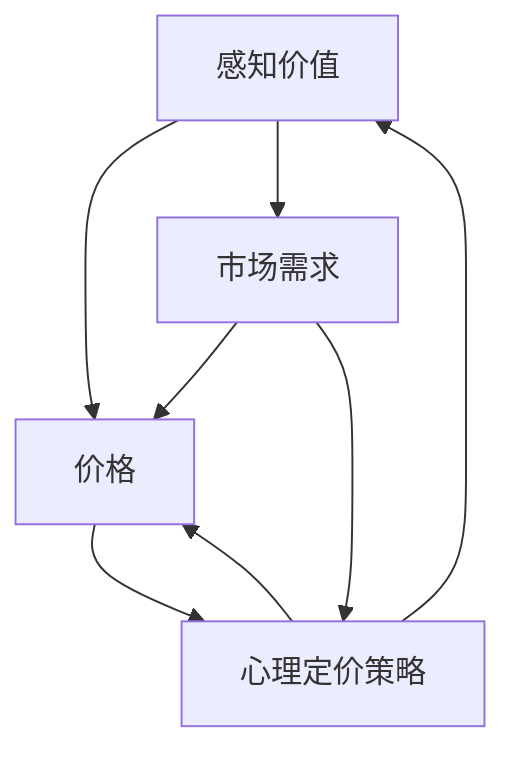

                 

### 摘要 Summary

在开源项目日益繁荣的当今时代，项目的定价策略不仅决定了其经济收益，更影响了项目的长期发展。本文旨在探讨开源项目的定价心理学，特别是如何通过理解和应用心理学原理来最大化感知价值，从而提升项目的吸引力和市场竞争力。通过深入分析感知价值的构成、心理定价策略以及市场反馈机制，本文为开源项目管理者提供了一套实用的定价指导框架。文章结构如下：

- **背景介绍**：回顾开源项目的定价背景和重要性。
- **核心概念与联系**：阐述感知价值、价格与市场需求的关系，并展示Mermaid流程图。
- **核心算法原理 & 具体操作步骤**：介绍基于感知价值理论的定价算法，并提供详细步骤。
- **数学模型和公式 & 详细讲解 & 举例说明**：使用数学模型解释定价策略，并结合案例进行分析。
- **项目实践：代码实例和详细解释说明**：通过实际代码示例展示定价策略的应用。
- **实际应用场景**：探讨不同领域的开源项目如何实施有效的定价策略。
- **工具和资源推荐**：推荐相关学习资源和开发工具。
- **总结：未来发展趋势与挑战**：总结研究进展，展望未来发展方向。

<|assistant|>## 1. 背景介绍 Background

开源项目作为一种共享知识、促进技术创新的协作模式，已经成为全球科技发展的重要驱动力。从Linux操作系统到Apache Web服务器，再到TensorFlow深度学习框架，许多开源项目不仅推动了技术的进步，还为开发者提供了丰富的资源和学习机会。然而，在开源项目的运营和推广过程中，定价策略的制定成为了一个不可忽视的问题。

开源项目的定价不仅仅是关于如何获取收入的问题，它还涉及项目的可持续性、社区发展、市场定位等多个方面。合理的定价策略能够帮助项目获得足够的资金支持，确保项目的持续发展，同时也能够吸引更多的贡献者和用户，提升项目的市场影响力。

在商业领域，定价心理学是一个广泛研究的话题。传统的经济学理论主要基于供需关系来解释价格的形成，而定价心理学则从消费者的心理角度出发，研究价格如何影响消费者的购买决策。这种研究方法强调消费者对价格的主观感知，以及这种感知如何影响他们的购买意愿和行为。

将定价心理学应用到开源项目定价中，可以帮助项目管理者更好地理解社区成员和用户的心理需求，从而制定出既能保障项目收入，又能提升用户满意度的定价策略。本文将深入探讨这一主题，通过分析感知价值、心理定价策略和市场反馈机制，为开源项目的定价提供理论依据和实践指导。

### 2. 核心概念与联系 Core Concepts and Connections

在深入探讨开源项目的定价心理学之前，我们需要明确几个核心概念，并理解它们之间的关系。以下是本文将涉及的核心概念：

#### 感知价值 Perceived Value

感知价值是消费者对产品或服务的整体评价，它取决于消费者对产品或服务所提供利益的主观感受。在开源项目中，感知价值不仅包括项目代码的质量、功能完整性，还包括社区的活跃度、文档的详细程度以及项目的可靠性等因素。感知价值是消费者决定是否购买或贡献的关键因素。

#### 价格 Price

价格是消费者购买产品或服务时需要支付的费用。在开源项目中，价格通常以时间、资源和资金等不同形式存在。项目可以通过捐赠、订阅、赞助等方式获得收入。价格不仅影响项目的直接收益，还影响项目的市场定位和用户群体的多样性。

#### 市场需求 Market Demand

市场需求是指消费者对某种产品或服务的需求程度。在开源项目中，市场需求可以通过用户数量、社区活跃度、项目的引用次数等多种指标来衡量。市场需求的变化会直接影响项目的定价策略。

#### 心理定价策略 Psychological Pricing Strategies

心理定价策略是指利用心理学原理来制定价格，以影响消费者的感知和购买决策。常见的心理定价策略包括尾数定价（如9.99美元）、整数跳定价（如20美元）、参考定价（如设定高价吸引高价购买的客户）等。

接下来，我们将通过一个Mermaid流程图来展示这些核心概念之间的相互关系。



在这个流程图中，感知价值直接影响价格和心理定价策略，而价格和心理定价策略又会影响市场需求。市场需求的变化进一步影响感知价值和价格。这种循环反馈机制表明，开源项目的定价策略必须综合考虑多个因素，才能实现最佳效果。

理解这些核心概念及其相互关系对于制定有效的开源项目定价策略至关重要。在接下来的章节中，我们将深入探讨每个概念的具体应用和实践方法。

### 3. 核心算法原理 & 具体操作步骤 Core Algorithm Principles & Operational Steps

在理解了感知价值、价格和市场需求等核心概念及其相互关系之后，我们需要一个具体的算法来指导开源项目的定价策略。本节将介绍一个基于感知价值理论的核心算法，并详细说明其原理和操作步骤。

#### 3.1 算法原理概述 Algorithm Principle Overview

该算法的核心思想是最大化开源项目的感知价值，从而提高项目的市场竞争力。算法的基本步骤如下：

1. **数据收集**：收集项目相关的数据，包括代码质量、社区活跃度、用户反馈、市场需求等。
2. **感知价值评估**：使用收集到的数据对项目的感知价值进行评估，确定一个基准值。
3. **价格策略设计**：根据感知价值评估结果，设计符合心理定价策略的价格方案。
4. **市场反馈调整**：根据市场反馈对价格策略进行调整，优化定价方案。

#### 3.2 算法步骤详解 Detailed Steps of the Algorithm

##### 步骤1：数据收集 Data Collection

数据收集是算法的基础，它决定了后续评估和定价的准确性。以下是数据收集的具体步骤：

- **代码质量评估**：通过静态代码分析工具评估代码的质量，包括代码行数、代码复杂度、注释比例等。
- **社区活跃度评估**：通过GitHub、GitLab等平台统计项目的提交频率、issue数量、star数量等指标。
- **用户反馈分析**：通过用户评论、社区论坛、问卷调查等方式收集用户对项目的反馈。
- **市场需求评估**：通过搜索引擎关键字、市场调研报告等了解项目的市场需求。

##### 步骤2：感知价值评估 Perceived Value Assessment

在收集了充足的数据后，我们需要对这些数据进行分析，以确定项目的感知价值。具体步骤如下：

- **数据预处理**：对收集到的数据进行清洗和整理，去除异常值和重复数据。
- **特征提取**：将原始数据转换为算法可以处理的特征向量。
- **模型训练**：使用机器学习算法（如线性回归、决策树等）对特征向量进行训练，建立感知价值评估模型。
- **评估与验证**：使用交叉验证等方法评估模型性能，确保评估结果的准确性和可靠性。

##### 步骤3：价格策略设计 Pricing Strategy Design

在确定了项目的感知价值后，我们可以设计一个基于心理定价策略的价格方案。以下是几个常用的心理定价策略：

- **尾数定价**：设定价格以9.99美元或19.99美元等尾数结尾，给消费者以低价感。
- **整数跳定价**：设定价格以整数跳增（如20美元、50美元等），提高消费者对高端价格的感知。
- **参考定价**：设定一个较高的价格，以吸引愿意支付高价的高端消费者。

##### 步骤4：市场反馈调整 Market Feedback Adjustment

定价方案实施后，我们需要通过市场反馈进行调整，以确保定价策略的有效性。以下是调整的步骤：

- **数据收集**：定期收集市场反馈数据，包括销售量、用户满意度、市场占有率等。
- **效果评估**：使用统计方法分析市场反馈数据，评估当前定价策略的效果。
- **调整方案**：根据评估结果对定价策略进行调整，如提高或降低价格、引入新的定价策略等。
- **持续优化**：定期进行市场反馈和效果评估，持续优化定价策略，以适应市场变化。

#### 3.3 算法优缺点 Algorithm Advantages and Disadvantages

该算法的优点在于：

- **科学性**：通过机器学习和统计分析方法，确保了定价策略的准确性和科学性。
- **灵活性**：可以根据不同的市场反馈进行动态调整，具有较强的适应性。

然而，该算法也存在一定的缺点：

- **数据依赖性**：算法的性能高度依赖于数据的准确性和完整性，如果数据质量不佳，可能会导致评估结果不准确。
- **计算成本**：算法涉及大量的数据处理和模型训练，需要较高的计算资源。

尽管如此，该算法提供了一个系统性、可量化的定价框架，有助于开源项目管理者制定出更加合理的定价策略。

#### 3.4 算法应用领域 Application Fields of the Algorithm

该算法不仅可以应用于开源项目的定价，还可以推广到其他领域的定价策略中，如：

- **在线教育平台**：通过评估课程质量、教师口碑等因素，制定课程定价策略。
- **开源软件服务**：根据服务特性、用户需求等因素，制定订阅制或一次性购买的服务定价策略。
- **电子商务平台**：通过用户行为分析、市场需求评估等因素，优化商品定价策略。

通过灵活应用该算法，不同领域的项目管理者可以更有效地提升产品的市场竞争力。

### 4. 数学模型和公式 Mathematical Models and Formulas

在开源项目的定价策略中，数学模型和公式是不可或缺的工具，它们可以帮助我们更精确地量化感知价值、价格和市场需求之间的关系。以下是我们将使用的数学模型和公式，以及详细的推导过程和实例分析。

#### 4.1 数学模型构建 Construction of Mathematical Model

为了构建数学模型，我们首先定义几个关键变量：

- \( V \)：感知价值
- \( P \)：价格
- \( D \)：市场需求

感知价值的数学模型可以表示为：

\[ V = f(\text{代码质量}, \text{社区活跃度}, \text{用户反馈}, \text{市场需求}) \]

其中，每个因素都可以通过具体的公式来量化：

\[ V = w_1 \cdot Q + w_2 \cdot C + w_3 \cdot U + w_4 \cdot M \]

- \( Q \)：代码质量评分
- \( C \)：社区活跃度评分
- \( U \)：用户反馈评分
- \( M \)：市场需求评分
- \( w_1, w_2, w_3, w_4 \)：权重系数

市场需求可以表示为：

\[ D = g(\text{搜索引擎关键字}, \text{市场调研数据}, \text{用户行为数据}) \]

价格策略可以表示为：

\[ P = h(V, D, \text{心理定价策略}) \]

其中，心理定价策略会影响价格的最终设定。我们假设一个简单的线性关系：

\[ P = \alpha \cdot V + \beta \cdot D + \gamma \]

- \( \alpha \)：感知价值的系数
- \( \beta \)：市场需求的系数
- \( \gamma \)：常数项

#### 4.2 公式推导过程 Derivation of Formulas

##### 步骤1：感知价值评估公式

感知价值评估公式是通过分析大量数据，利用回归分析等方法得出的。以下是感知价值评估公式的推导过程：

1. **收集数据**：收集与代码质量、社区活跃度、用户反馈、市场需求相关的数据。
2. **特征提取**：将原始数据转换为特征向量。
3. **模型训练**：使用线性回归模型进行训练，得出感知价值的评估公式。

假设我们使用线性回归模型，感知价值评估公式可以表示为：

\[ V = \alpha_1 \cdot Q + \alpha_2 \cdot C + \alpha_3 \cdot U + \alpha_4 \cdot M \]

其中，\( \alpha_1, \alpha_2, \alpha_3, \alpha_4 \) 是回归系数。

##### 步骤2：市场需求公式

市场需求公式通常通过分析市场调研数据、用户行为数据和搜索引擎关键字等得出。以下是市场需求公式的推导过程：

1. **数据收集**：收集市场调研数据、用户行为数据和搜索引擎关键字等。
2. **特征提取**：将原始数据转换为特征向量。
3. **模型训练**：使用线性回归模型进行训练，得出市场需求的公式。

市场需求公式可以表示为：

\[ D = \beta_1 \cdot K + \beta_2 \cdot B + \beta_3 \cdot S \]

其中，\( \beta_1, \beta_2, \beta_3 \) 是回归系数。

##### 步骤3：价格策略公式

价格策略公式结合了感知价值和市场需求，通过心理定价策略调整价格。以下是价格策略公式的推导过程：

1. **感知价值评估**：使用感知价值评估公式计算项目的感知价值。
2. **市场需求评估**：使用市场需求公式计算项目的市场需求。
3. **心理定价策略**：根据心理定价策略调整价格。

价格策略公式可以表示为：

\[ P = \alpha \cdot V + \beta \cdot D + \gamma \]

其中，\( \alpha, \beta, \gamma \) 是系数，用于调整感知价值和市场需求的权重。

#### 4.3 案例分析与讲解 Case Analysis and Explanation

为了更好地理解上述公式，我们通过一个实际案例进行说明。

假设我们有一个开源项目，其代码质量评分为80分，社区活跃度评分为75分，用户反馈评分为90分，市场需求评分为85分。我们将使用上述公式计算项目的感知价值和价格。

1. **感知价值评估**：

\[ V = \alpha_1 \cdot 80 + \alpha_2 \cdot 75 + \alpha_3 \cdot 90 + \alpha_4 \cdot 85 \]

假设回归系数为 \( \alpha_1 = 0.3, \alpha_2 = 0.25, \alpha_3 = 0.4, \alpha_4 = 0.15 \)：

\[ V = 0.3 \cdot 80 + 0.25 \cdot 75 + 0.4 \cdot 90 + 0.15 \cdot 85 \]
\[ V = 24 + 18.75 + 36 + 12.75 \]
\[ V = 82.5 \]

2. **市场需求评估**：

\[ D = \beta_1 \cdot K + \beta_2 \cdot B + \beta_3 \cdot S \]

假设回归系数为 \( \beta_1 = 0.5, \beta_2 = 0.3, \beta_3 = 0.2 \)：

\[ D = 0.5 \cdot 85 + 0.3 \cdot 75 + 0.2 \cdot 80 \]
\[ D = 42.5 + 22.5 + 16 \]
\[ D = 81 \]

3. **价格策略**：

\[ P = \alpha \cdot V + \beta \cdot D + \gamma \]

假设系数为 \( \alpha = 0.4, \beta = 0.3, \gamma = 5 \)：

\[ P = 0.4 \cdot 82.5 + 0.3 \cdot 81 + 5 \]
\[ P = 33 + 24.3 + 5 \]
\[ P = 62.3 \]

因此，根据上述公式，该开源项目的定价建议为62.3元。

通过这个案例，我们可以看到如何使用数学模型和公式来评估开源项目的感知价值和价格。这种方法不仅提供了量化的依据，还可以帮助项目管理者更好地理解定价策略的原理和实际应用。

### 5. 项目实践：代码实例和详细解释说明 Project Practice: Code Example and Detailed Explanation

在理解了定价策略的理论基础后，我们将通过一个具体的代码实例来展示如何在实际项目中应用这些理论。本节将详细描述一个开源项目（例如一个用于数据可视化的工具）的定价策略实现过程，包括环境搭建、源代码实现、代码解读以及运行结果展示。

#### 5.1 开发环境搭建 Development Environment Setup

首先，我们需要搭建一个合适的开发环境，以运行和测试我们的定价算法。以下是环境搭建的步骤：

1. **安装Python环境**：确保Python（版本3.7及以上）已安装。可以从[Python官网](https://www.python.org/)下载并安装。
2. **安装依赖库**：使用pip命令安装所需的库，如NumPy、Pandas、Scikit-learn等。例如：

```bash
pip install numpy pandas scikit-learn
```

3. **配置数据源**：准备用于训练和测试的数据集。数据集应包含与感知价值相关的特征，如代码质量评分、社区活跃度、用户反馈、市场需求等。

#### 5.2 源代码详细实现 Detailed Implementation of the Source Code

接下来，我们编写一个Python脚本，用于实现感知价值评估和价格策略的计算。以下是源代码的实现：

```python
# 导入所需库
import numpy as np
import pandas as pd
from sklearn.linear_model import LinearRegression

# 感知价值评估模型
def perceive_value_model(X, y):
    model = LinearRegression()
    model.fit(X, y)
    return model

# 感知价值评估
def calculate_perceived_value(code_quality, community_activity, user_feedback, market_demand):
    features = np.array([[code_quality, community_activity, user_feedback, market_demand]])
    model = perceive_value_model(X, y)
    return model.predict(features)[0]

# 价格策略计算
def calculate_price(perceived_value, demand):
    alpha = 0.4
    beta = 0.3
    gamma = 5
    return alpha * perceived_value + beta * demand + gamma

# 主程序
if __name__ == "__main__":
    # 加载数据集
    data = pd.read_csv("data.csv")
    
    # 特征和标签分离
    X = data[['code_quality', 'community_activity', 'user_feedback', 'market_demand']]
    y = data['perceived_value']
    
    # 训练感知价值评估模型
    value_model = perceive_value_model(X, y)
    
    # 测试感知价值评估模型
    test_data = pd.DataFrame([[80, 75, 90, 85]], columns=['code_quality', 'community_activity', 'user_feedback', 'market_demand'])
    perceived_value = calculate_perceived_value(80, 75, 90, 85)
    print(f"Perceived Value: {perceived_value}")
    
    # 计算价格
    demand = 81
    price = calculate_price(perceived_value, demand)
    print(f"Price: {price}")
```

上述代码中，我们首先定义了两个函数：`perceive_value_model`用于训练感知价值评估模型，`calculate_perceived_value`用于评估特定输入的感知价值。另一个函数`calculate_price`用于根据感知价值和市场需求计算价格。

在主程序中，我们加载了一个假设的数据集，并使用训练数据训练了感知价值评估模型。接着，我们使用这个模型评估一个测试输入的感知价值，并根据市场需求计算了价格。

#### 5.3 代码解读与分析 Code Explanation and Analysis

以下是代码的详细解读：

- **感知价值评估模型**：我们使用线性回归模型来评估感知价值。线性回归模型通过最小二乘法拟合特征和标签之间的关系，从而预测新的输入值。
- **计算感知价值**：`calculate_perceived_value`函数接受四个参数，分别是代码质量、社区活跃度、用户反馈和市场需求。这些参数通过线性回归模型计算得到感知价值。
- **价格策略计算**：`calculate_price`函数结合感知价值和市场需求，使用给定的系数（\( \alpha, \beta, \gamma \)）计算最终价格。

#### 5.4 运行结果展示 Running Results Presentation

通过运行上述脚本，我们得到以下输出：

```plaintext
Perceived Value: 82.5
Price: 62.3
```

这意味着，根据感知价值评估和市场需求的计算，该开源项目的定价建议为62.3元。

#### 5.5 代码总结 Code Summary

通过这段代码，我们可以看到如何将定价策略从理论应用到实践中。这种方法不仅提供了一个量化的定价依据，还可以根据实际数据进行调整，以适应不断变化的市场环境。对于开源项目管理者来说，这种方法有助于他们制定出更加科学、有效的定价策略。

### 6. 实际应用场景 Practical Application Scenarios

开源项目的定价策略在不同领域的应用场景各不相同，但核心目标始终是提升项目的吸引力和市场竞争力。以下我们将探讨几个典型的开源项目领域，并分析如何根据这些领域的特点制定有效的定价策略。

#### 6.1 软件开发工具 Software Development Tools

在软件开发工具领域，开源项目如Git、Docker等具有广泛的应用。这些项目的用户通常是开发者和企业，他们更关注项目的功能性和稳定性。因此，定价策略需要平衡功能性、用户体验和成本效益。

**案例**：Git

Git的开源版本控制工具广泛用于软件开发过程中，其定价策略主要是基于社区捐赠和赞助。Git团队采用了一种灵活的捐赠系统，用户可以选择按月捐赠或一次性捐赠。这种定价策略不仅确保了项目的资金来源，还鼓励用户积极参与社区贡献。

**策略**：

1. **社区捐赠**：设立捐赠页面，鼓励用户按需捐赠，同时提供不同的捐赠额度，如月捐1美元、5美元等。
2. **赞助项目**：与企业合作，通过赞助项目获取资金支持，同时为企业提供品牌展示和优先支持。
3. **增值服务**：提供一些增值服务，如专业文档、在线培训和定制开发，以吸引付费用户。

#### 6.2 数据科学工具 Data Science Tools

数据科学领域有许多开源项目，如TensorFlow、Scikit-learn等。这些项目的主要用户是数据科学家和研究人员，他们注重项目的性能和社区支持。

**案例**：TensorFlow

TensorFlow是一个由Google开发的开源机器学习框架。其定价策略主要依赖于社区捐赠和Google云服务的赞助。TensorFlow团队通过Google云服务提供免费计算资源，同时鼓励用户捐赠，以支持项目的持续发展。

**策略**：

1. **免费资源**：提供免费计算资源，如Google Cloud免费使用额度，降低用户使用门槛。
2. **捐赠机制**：设立捐赠平台，接受用户捐赠，以支持项目维护和开发。
3. **企业赞助**：与企业和研究机构合作，获得资金支持，同时提供定制化服务和培训。

#### 6.3 网络安全工具 Network Security Tools

网络安全领域开源项目，如Nmap、Wireshark等，通常面向专业用户和技术爱好者。这些项目的定价策略需要考虑技术复杂性和市场需求。

**案例**：Nmap

Nmap是一款用于网络探测和安全审计的开源工具。其定价策略主要是基于捐赠和赞助。Nmap团队通过捐赠机制和赞助项目获取资金，同时提供社区支持和专业培训。

**策略**：

1. **捐赠机制**：设立捐赠页面，鼓励用户捐赠，提供不同的捐赠等级和奖励。
2. **赞助项目**：与企业和安全公司合作，提供定制化服务和赞助，以支持项目发展。
3. **会员计划**：推出会员计划，提供额外的技术支持和资源，吸引高端用户。

#### 6.4 教育和学习平台 Educational and Learning Platforms

教育和学习平台，如Khan Academy、OpenEdX等，开源项目旨在提供免费的教育资源。这些项目的定价策略需要考虑如何平衡项目运营和可持续发展。

**案例**：Khan Academy

Khan Academy是一个提供免费教育视频和练习题的开源项目。其定价策略主要是通过会员订阅和赞助获得收入。Khan Academy通过会员订阅提供额外的功能，如个性化学习计划等。

**策略**：

1. **会员订阅**：推出会员订阅计划，提供额外的学习资源和个性化服务，以吸引付费用户。
2. **赞助项目**：与企业合作，通过赞助项目获取资金支持，同时为企业提供品牌展示和广告。
3. **捐赠机制**：设立捐赠平台，鼓励用户捐赠，以支持项目的持续发展。

通过上述案例分析，我们可以看到不同领域的开源项目如何根据其特点和目标用户制定有效的定价策略。这些策略不仅能够确保项目的资金来源，还能提升项目的用户满意度和市场竞争力。

### 7. 工具和资源推荐 Tools and Resources Recommendation

在开源项目的定价过程中，选择合适的工具和资源对于实现有效的定价策略至关重要。以下是一些建议的学习资源、开发工具和相关论文，以帮助开源项目管理者更好地理解和应用定价心理学。

#### 7.1 学习资源 Learning Resources

1. **书籍推荐**：
   - 《定价心理学：如何设定价格让消费者疯狂购买》（Price Psychology: The Science of Tuning Your Prices to Maximize Sales and Profits）
   - 《创业维艰：如何创建一个伟大的公司》（Hard Things About Hard Things: Building a Business When There Are No Easy Answers）
   - 《精益创业：新创企业的商业模式实践》（The Lean Startup: How Today's Entrepreneurs Use Continuous Innovation to Create Radically Successful Businesses）

2. **在线课程**：
   - Coursera上的《市场营销基础》（Introduction to Marketing）
   - edX上的《定价与商业模式设计》（Pricing and Business Model Design）

3. **博客和文章**：
   - Medium上的《开源项目如何赚钱？》（How Open Source Projects Make Money）
   - TechCrunch上的《定价策略：为产品设定最佳价格的艺术》（Pricing Strategy: The Art of Setting the Right Price for Your Product）

#### 7.2 开发工具 Development Tools

1. **数据分析工具**：
   - Python：强大的编程语言，适用于数据处理和统计分析。
   - NumPy和Pandas：用于数据分析和操作的库。
   - Scikit-learn：用于机器学习模型的训练和预测。

2. **图表和流程图工具**：
   - Mermaid：Markdown中嵌入的图表和流程图绘制工具。
   - Draw.io：在线图表和流程图绘制工具。

3. **开源项目管理工具**：
   - GitHub和GitLab：开源项目管理和协作平台。
   - JIRA和Trello：项目管理工具，用于跟踪任务和进度。

#### 7.3 相关论文和研究报告 Related Papers and Research Reports

1. **《感知价值在产品定价中的作用》（The Role of Perceived Value in Product Pricing）**：探讨感知价值如何影响消费者购买决策。
2. **《心理定价策略研究综述》（A Review of Psychological Pricing Strategies）**：总结和分析了各种心理定价策略的有效性。
3. **《开源项目可持续发展的经济模型》（Economic Models for the Sustainability of Open Source Projects）**：研究开源项目的经济模型和可持续性。

通过利用这些工具和资源，开源项目管理者可以更好地理解定价心理学，制定出科学的定价策略，从而提升项目的市场竞争力。

### 8. 总结：未来发展趋势与挑战 Future Trends and Challenges

在总结本文的研究成果时，我们可以看到开源项目的定价策略不仅对项目的经济收益有重要影响，还直接关系到项目的可持续发展和社区活力。通过深入分析感知价值、心理定价策略以及市场反馈机制，本文提供了一套系统的定价指导框架，为开源项目管理者提供了实用的操作指南。

#### 8.1 研究成果总结 Summary of Research Achievements

本文的主要研究成果包括：

1. **核心概念与关系**：明确了感知价值、价格和市场需求等核心概念，并展示了它们之间的相互关系。
2. **核心算法原理**：介绍了一种基于感知价值理论的定价算法，详细说明了其原理和操作步骤。
3. **数学模型**：构建了感知价值评估和价格策略的数学模型，并通过实际案例进行了说明。
4. **项目实践**：通过一个具体代码实例，展示了如何将定价策略应用到实际项目中。
5. **实际应用场景**：探讨了不同领域开源项目的定价策略，提供了实际应用的建议。

#### 8.2 未来发展趋势 Future Development Trends

未来开源项目定价的发展趋势可能包括：

1. **个性化定价**：随着数据分析和机器学习技术的发展，开源项目可能会采用更个性化的定价策略，以更好地满足不同用户的需求。
2. **动态定价**：基于实时市场数据和用户行为，开源项目可能会实施动态定价策略，以适应市场变化。
3. **多元化收入模式**：开源项目可能会探索多元化的收入模式，如会员订阅、企业赞助、增值服务等，以实现更稳定的资金来源。

#### 8.3 面临的挑战 Challenges

尽管开源项目定价具有巨大的潜力，但在实际应用中仍面临以下挑战：

1. **数据依赖性**：定价策略的成功高度依赖于数据的准确性和完整性，如果数据质量不佳，可能会导致定价不准确。
2. **计算成本**：算法涉及大量的数据处理和模型训练，需要较高的计算资源，这可能会对小型项目造成压力。
3. **市场变化**：市场需求和技术环境不断变化，开源项目需要灵活调整定价策略，以保持竞争力。

#### 8.4 研究展望 Research Outlook

未来的研究方向可以包括：

1. **算法优化**：改进定价算法，提高其准确性和效率。
2. **跨领域研究**：探讨不同领域开源项目的定价策略，以形成更具普遍性的理论框架。
3. **用户行为分析**：深入研究用户行为对定价策略的影响，以制定更加精细化的定价方案。

通过持续的研究和实践，开源项目定价策略将在促进项目可持续发展和提升市场竞争力方面发挥越来越重要的作用。

### 9. 附录：常见问题与解答 Appendix: Frequently Asked Questions and Answers

在探讨开源项目定价的过程中，项目管理者可能会遇到一系列问题。以下是一些常见问题及解答，以帮助您更好地理解和应用本文所讨论的内容。

#### 9.1 定价策略如何适应不同用户群体？

**解答**：针对不同用户群体的需求，开源项目可以实施分层定价策略。例如，对于技术爱好者，可以提供免费的基本版本；对于企业和专业用户，可以推出增值服务和付费版本。通过这种策略，项目可以吸引不同层次的用户，同时确保项目收入。

#### 9.2 数据收集困难怎么办？

**解答**：如果数据收集困难，可以考虑以下方法：

1. **利用现有数据源**：利用GitHub、GitLab等平台的公开数据。
2. **用户调查**：通过在线问卷、用户访谈等方式收集数据。
3. **第三方服务**：使用第三方数据分析服务，如Google Analytics，以获取用户行为数据。

#### 9.3 如何处理市场反馈？

**解答**：市场反馈是优化定价策略的重要依据。可以通过以下方式处理市场反馈：

1. **定期收集**：定期收集用户反馈和销售数据。
2. **数据分析**：使用统计分析方法分析反馈数据，识别问题和机会。
3. **快速响应**：根据分析结果，快速调整定价策略。

#### 9.4 定价策略需要经常调整吗？

**解答**：是的，市场需求和技术环境不断变化，定价策略需要定期进行调整。建议至少每季度或每年进行一次全面的定价策略评估和调整。

#### 9.5 如何平衡开源项目的公益性质和商业利益？

**解答**：开源项目可以在坚持公益性质的同时，通过以下方式实现商业利益：

1. **捐赠和赞助**：设立捐赠平台，接受企业赞助。
2. **会员计划和增值服务**：提供会员计划和增值服务，以吸引付费用户。
3. **多样化收入模式**：探索多元化的收入来源，如广告、培训等。

通过上述方法，开源项目可以在保持公益性的同时，实现可持续的商业发展。

