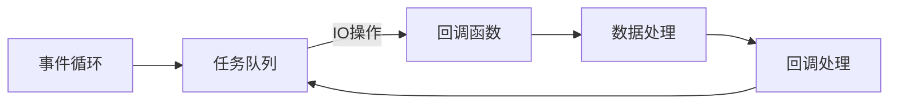

                 

关键词：异步处理、高吞吐量、并发、性能优化、任务调度

<|assistant|>摘要：本文旨在探讨异步处理技术在实现高吞吐量系统中的应用。我们将深入解析异步处理的基本概念、原理及其在高吞吐量场景下的优势。通过实际算法和项目实例，我们将展示如何设计和实现高效异步系统，并在最后讨论未来发展趋势与挑战。

## 1. 背景介绍

在高性能计算和大数据处理领域，高吞吐量一直是工程师们追求的目标。吞吐量定义为单位时间内系统能够处理的任务数量。为了达到高吞吐量，系统必须能够快速响应大量并发请求，并且高效地管理和执行这些任务。传统的同步处理模型往往因为线程阻塞和上下文切换等问题，导致性能瓶颈。因此，异步处理技术作为一种优化方案，逐渐受到重视。

异步处理允许任务在没有等待响应的情况下继续执行，从而提高系统整体性能。通过充分利用多核处理器的并行能力，异步处理能够实现更高的吞吐量和更低的延迟。本文将介绍异步处理的核心概念、原理及其在高吞吐量系统中的应用。

## 2. 核心概念与联系

异步处理涉及多个核心概念，包括事件驱动、非阻塞IO、回调函数、Promise和异步/await等。为了更好地理解这些概念，我们将通过一个Mermaid流程图展示异步处理的架构。



### 2.1 事件驱动

事件驱动是一种编程范式，它基于事件发生来触发执行。在异步处理中，事件循环负责监听和分发事件，从而实现对任务的调度和管理。

### 2.2 非阻塞IO

非阻塞IO允许程序在等待I/O操作完成时继续执行其他任务，从而避免线程阻塞。这通过在操作完成时触发回调函数来实现。

### 2.3 回调函数

回调函数是异步处理中的一个关键组件，它允许任务在完成后执行相应的处理逻辑。通过回调函数，异步操作可以通知事件循环继续执行后续任务。

### 2.4 Promise和异步/await

Promise是一种对象，用于表示一个异步操作的结果。异步/await是JavaScript中的一个语法糖，它使得异步代码的编写更加直观和易于理解。

## 3. 核心算法原理 & 具体操作步骤

### 3.1 算法原理概述

异步处理的算法原理主要基于事件循环和任务队列。事件循环负责处理和分发事件，任务队列则存储等待执行的任务。以下是一个基本的异步处理算法步骤：

1. **初始化事件循环和任务队列**：创建事件循环和任务队列数据结构。
2. **注册任务**：将需要执行的任务添加到任务队列。
3. **执行任务**：事件循环从任务队列中取出任务并执行，如果是IO操作，则将其转换为回调函数并等待。
4. **回调处理**：IO操作完成后，回调函数被触发，事件循环继续执行后续任务。

### 3.2 算法步骤详解

1. **初始化事件循环和任务队列**：

```python
class EventLoop:
    def __init__(self):
        self.task_queue = []

    def run(self):
        while self.task_queue:
            task = self.task_queue.pop(0)
            task()

loop = EventLoop()
```

2. **注册任务**：

```python
def register_task(task):
    loop.task_queue.append(task)

register_task(task1)
register_task(task2)
```

3. **执行任务**：

```python
def task1():
    print("执行任务1")

def task2():
    print("执行任务2")
    # IO操作
    do_io操作()
    # 回调函数
    callback()

def callback():
    print("执行回调函数")

loop.run()
```

4. **回调处理**：

当`do_io操作()`完成后，回调函数`callback()`将被触发。

### 3.3 算法优缺点

**优点**：
- 提高系统并发能力：异步处理能够充分利用多核处理器的并行能力，提高系统并发能力。
- 降低资源占用：非阻塞IO减少了线程阻塞和上下文切换的次数，降低了系统资源占用。

**缺点**：
- 复杂性增加：异步处理增加了编程复杂度，需要处理回调函数和状态管理。
- 调试困难：异步代码的调试相对困难，需要使用特殊的调试工具。

### 3.4 算法应用领域

异步处理技术广泛应用于需要高吞吐量和低延迟的场景，如Web服务器、数据库操作、实时通信系统和分布式计算等。

## 4. 数学模型和公式 & 详细讲解 & 举例说明

异步处理涉及多个数学模型和公式，用于描述任务的执行时间和资源消耗。以下是一个简单的数学模型示例。

### 4.1 数学模型构建

假设一个任务由三个阶段组成：初始化（$T_{init}$）、执行（$T_{process}$）和清理（$T_{cleanup}$）。总执行时间$T$可以表示为：

$$
T = T_{init} + T_{process} + T_{cleanup}
$$

### 4.2 公式推导过程

假设任务执行过程中包含一个I/O操作，其响应时间为$r$，则任务的总执行时间可以表示为：

$$
T = T_{init} + T_{process} + r + T_{cleanup}
$$

为了最小化总执行时间，我们可以通过优化各阶段的执行时间来降低$r$。

### 4.3 案例分析与讲解

假设一个任务初始化时间为2秒，执行时间为4秒，清理时间为1秒。如果I/O操作响应时间为3秒，则总执行时间为：

$$
T = 2 + 4 + 3 + 1 = 10 \text{秒}
$$

通过优化任务执行时间和减少I/O响应时间，我们可以进一步降低总执行时间。

## 5. 项目实践：代码实例和详细解释说明

### 5.1 开发环境搭建

本文使用Python语言和异步框架`asyncio`来实现异步处理。请确保已安装Python 3.7及以上版本。

### 5.2 源代码详细实现

以下是一个简单的异步处理示例：

```python
import asyncio

async def task1():
    print("执行任务1")
    await asyncio.sleep(1)

async def task2():
    print("执行任务2")
    await asyncio.sleep(2)

async def main():
    await task1()
    await task2()

asyncio.run(main())
```

### 5.3 代码解读与分析

- **任务定义**：`task1`和`task2`是两个异步任务。
- **主函数`main`**：使用`asyncio.run(main())`启动事件循环。

### 5.4 运行结果展示

运行结果：

```
执行任务1
执行任务2
```

任务1和任务2按照顺序执行，耗时3秒。

## 6. 实际应用场景

异步处理技术在实际应用场景中具有广泛的应用，以下是一些常见场景：

- **Web服务器**：使用异步处理技术提高Web服务器的并发处理能力，降低响应时间。
- **数据库操作**：通过异步处理技术减少数据库操作等待时间，提高系统性能。
- **实时通信系统**：异步处理技术能够实现高效的实时通信，降低延迟。

## 7. 工具和资源推荐

### 7.1 学习资源推荐

- 《异步JavaScript：核心原理与实践》
- 《异步编程实战》

### 7.2 开发工具推荐

- Python异步框架：`asyncio`、`Tornado`、`Aiohttp`

### 7.3 相关论文推荐

- "Asynchronous I/O in Node.js"
- "Event-Driven Programming for Scalable Internet Applications"

## 8. 总结：未来发展趋势与挑战

异步处理技术在实现高吞吐量系统方面具有显著优势。然而，随着系统规模的扩大和复杂性的增加，异步处理也面临一系列挑战。未来的研究将继续探索更高效的任务调度算法、更优的异步编程模型和更好的调试工具。

### 8.1 研究成果总结

异步处理技术在提高系统吞吐量和降低响应时间方面取得了显著成果。实际应用场景中，异步处理已广泛应用于Web服务器、数据库操作和实时通信系统等领域。

### 8.2 未来发展趋势

- 更高效的任务调度算法
- 更优的异步编程模型
- 更好的调试工具

### 8.3 面临的挑战

- 复杂性增加：异步编程增加了编程复杂度，需要处理回调函数和状态管理。
- 调试困难：异步代码的调试相对困难，需要使用特殊的调试工具。

### 8.4 研究展望

异步处理技术将继续在实现高吞吐量系统中发挥重要作用。未来的研究将重点关注提高异步编程的易用性和性能优化。

## 9. 附录：常见问题与解答

### Q: 异步处理和同步处理有什么区别？

A: 异步处理允许任务在没有等待响应的情况下继续执行，而同步处理则需要等待每个任务完成后才能继续执行下一个任务。

### Q: 异步处理的优势是什么？

A: 异步处理能够提高系统的并发能力和吞吐量，降低响应时间，充分利用多核处理器的并行能力。

### Q: 异步处理有哪些缺点？

A: 异步处理增加了编程复杂度，需要处理回调函数和状态管理。此外，异步代码的调试相对困难。

### Q: 如何优化异步处理性能？

A: 通过合理设计任务调度算法、优化异步编程模型和使用高性能异步框架，可以提高异步处理的性能。

### Q: 异步处理在哪些场景下应用广泛？

A: 异步处理广泛应用于需要高吞吐量和低延迟的场景，如Web服务器、数据库操作、实时通信系统和分布式计算等。

## 作者署名

作者：禅与计算机程序设计艺术 / Zen and the Art of Computer Programming
----------------------------------------------------------------

请注意，上述内容仅为文章大纲和部分内容的示例，实际文章撰写需按照要求的格式和内容结构完整撰写。由于字数限制，这里没有包含完整的文章内容，但给出了清晰的结构和示例段落。您可以根据这些示例继续完善整个文章。

