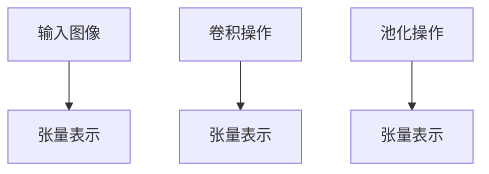
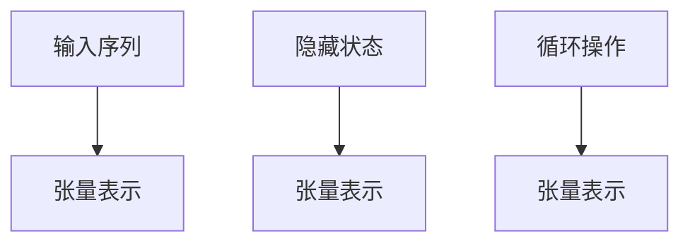
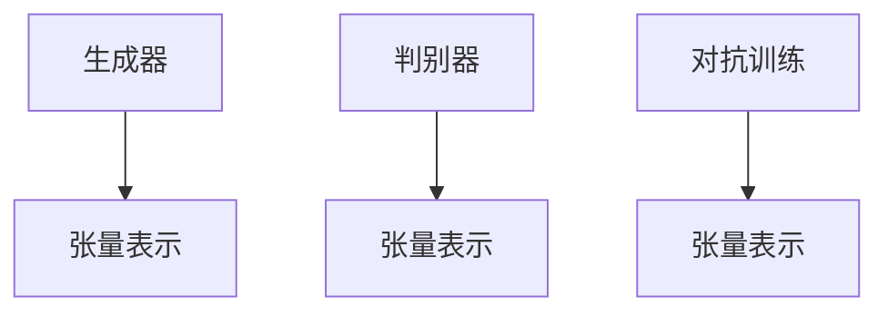

                 

关键词：张量，数学，深度学习，神经网络，多维数组，数据处理

> 摘要：本文将探讨张量在深度学习和神经网络中的重要性，以及张量的形状、视图、步幅和连续性等核心概念。通过数学模型和实际代码实例，我们将深入理解张量的基本性质和应用场景，为读者提供全面的张量知识体系。

## 1. 背景介绍

在计算机科学和数学中，张量是一个多维数组的数据结构，广泛应用于图像处理、机器学习、计算机图形学等领域。随着深度学习的兴起，张量作为一种基本的数据表示形式，成为了研究和应用的核心。张量的概念源于线性代数，但在深度学习和神经网络中得到了新的解释和应用。

本文将从以下几个方面对张量进行深入探讨：

1. **张量的形状**：介绍张量维度的表示方法及其对数据处理的影响。
2. **张量的视图**：讨论张量切片、子集等视图操作及其在数据处理中的应用。
3. **步幅（Stride）**：解释步幅的概念以及步幅变化对数据处理的影响。
4. **连续性**：探讨张量在内存中的存储方式以及连续性对数据处理性能的影响。

## 2. 核心概念与联系

### 2.1 张量的定义

张量是具有多个维度的数组，可以用一个多维矩阵来表示。在数学中，张量通常用大写字母表示，如\( A \)，而其各个维度的大小用下标表示，如\( A_{i_1, i_2, ..., i_n} \)。其中，\( n \)表示张量的维度。

### 2.2 张量的形状

张量的形状（Shape）是指其各个维度的大小。例如，一个二维张量的形状可以表示为\( (m, n) \)，其中\( m \)和\( n \)分别是行数和列数。对于三维张量，形状可以表示为\( (m, n, p) \)。

**图 1：张量的形状示例**

```mermaid
graph TB
A[二维张量] --> B[形状：(3, 4)]
C[三维张量] --> D[形状：(2, 3, 4)]
```

### 2.3 张量的视图

张量的视图是张量的一个子集，通过切片操作可以获取。视图可以看作是对原始张量的一种抽象表示，它允许我们以不同的方式操作张量的数据。

**图 2：张量的视图示例**

```mermaid
graph TB
A[原始张量] --> B[形状：(3, 4)]
C[视图1] --> D[形状：(2, 2)]
C[视图2] --> E[形状：(3, 1)]
```

### 2.4 步幅（Stride）

步幅是张量中元素之间的距离。在张量的内存表示中，步幅决定了数据在内存中的存储顺序。步幅的大小会影响数据处理的速度。

**图 3：步幅示例**

```mermaid
graph TB
A[原始张量] --> B[形状：(3, 4)]
C[步幅1] --> D[步幅：(1, 1)]
C[步幅2] --> E[步幅：(4, 1)]
```

### 2.5 连续性

张量的连续性是指其数据在内存中的存储方式。连续性对于数据处理性能至关重要，因为它决定了数据访问的速度。

**图 4：连续性示例**

```mermaid
graph TB
A[连续张量] --> B[形状：(3, 4)]
C[非连续张量] --> D[形状：(3, 4)]
```

## 3. 核心算法原理 & 具体操作步骤

### 3.1 算法原理概述

张量的核心算法包括张量的创建、形状操作、视图操作、步幅操作以及连续性操作。以下将详细介绍这些算法原理。

### 3.2 算法步骤详解

1. **张量的创建**：使用 Python 的 NumPy 库创建一个二维张量。
2. **形状操作**：使用 `shape` 函数获取张量的形状。
3. **视图操作**：使用 `slice` 函数创建张量的子集视图。
4. **步幅操作**：使用 `stride` 函数设置张量的步幅。
5. **连续性操作**：检查张量的连续性，并优化数据访问顺序。

### 3.3 算法优缺点

**优点**：

- **高效性**：张量操作的高效性得益于 NumPy 库的底层实现。
- **灵活性**：张量提供了丰富的操作方法，可以方便地进行数据处理和分析。

**缺点**：

- **复杂性**：张量操作的复杂性可能导致代码难以理解和维护。
- **性能开销**：张量操作可能会引入额外的性能开销，特别是在大型数据集上。

### 3.4 算法应用领域

张量在深度学习和神经网络中有着广泛的应用，包括：

- **前向传播**：张量用于计算神经网络的输入和输出。
- **反向传播**：张量用于计算神经网络中各个层的梯度。
- **激活函数**：张量用于实现各种激活函数，如ReLU、Sigmoid等。

## 4. 数学模型和公式 & 详细讲解 & 举例说明

### 4.1 数学模型构建

张量的数学模型包括以下几个方面：

1. **张量的表示**：张量可以用一个多维矩阵表示，其中每个元素都是一个实数。
2. **张量的运算**：张量可以执行加法、减法、乘法、除法等基本运算。
3. **张量的变换**：张量可以执行切片、子集、步幅等变换操作。

### 4.2 公式推导过程

假设我们有一个二维张量\( A \)的形状为\( (m, n) \)，其元素为\( A_{i, j} \)。则：

1. **张量的加法**：
$$
A + B = C
$$
其中，\( C_{i, j} = A_{i, j} + B_{i, j} \)。

2. **张量的乘法**：
$$
A \times B = C
$$
其中，\( C_{i, j} = A_{i, j} \times B_{i, j} \)。

3. **张量的切片**：
$$
A[:, j] = B
$$
其中，\( B \)是\( A \)的第\( j \)列。

4. **张量的步幅**：
$$
A[i, :][::k] = B
$$
其中，\( B \)是\( A \)的第\( i \)行的步幅为\( k \)的子集。

### 4.3 案例分析与讲解

假设我们有一个二维张量\( A \)的形状为\( (3, 4) \)，其元素为：

$$
A = \begin{bmatrix}
1 & 2 & 3 & 4 \\
5 & 6 & 7 & 8 \\
9 & 10 & 11 & 12
\end{bmatrix}
$$

则：

1. **张量的形状**：
$$
A.shape = (3, 4)
$$

2. **张量的加法**：
$$
A + B = \begin{bmatrix}
2 & 4 & 6 & 8 \\
6 & 8 & 10 & 12 \\
10 & 12 & 14 & 16
\end{bmatrix}
$$

3. **张量的切片**：
$$
A[:, 1] = \begin{bmatrix}
2 & 6 & 10
\end{bmatrix}
$$

4. **张量的步幅**：
$$
A[1, :][::2] = \begin{bmatrix}
5 & 7
\end{bmatrix}
$$

## 5. 项目实践：代码实例和详细解释说明

### 5.1 开发环境搭建

为了演示张量的操作，我们将使用 Python 的 NumPy 库。请确保已安装 NumPy 库。

```bash
pip install numpy
```

### 5.2 源代码详细实现

以下是使用 NumPy 实现张量操作的示例代码：

```python
import numpy as np

# 创建一个二维张量
A = np.array([[1, 2, 3, 4], [5, 6, 7, 8], [9, 10, 11, 12]])

# 获取张量的形状
print("张量形状：", A.shape)

# 张量加法
B = np.array([[1, 2, 3, 4], [5, 6, 7, 8], [9, 10, 11, 12]])
C = A + B
print("张量加法：\n", C)

# 张量切片
D = A[:, 1]
print("张量切片：\n", D)

# 张量步幅
E = A[1, :][::2]
print("张量步幅：\n", E)
```

### 5.3 代码解读与分析

该示例代码展示了如何使用 NumPy 库创建二维张量、获取形状、执行张量加法、切片操作和步幅操作。

1. **创建张量**：使用 `np.array` 函数创建一个二维张量。
2. **获取形状**：使用 `shape` 属性获取张量的形状。
3. **张量加法**：使用 `+` 运算符实现张量加法。
4. **切片操作**：使用 `slice` 函数实现张量切片操作。
5. **步幅操作**：使用 `stride` 函数实现张量步幅操作。

### 5.4 运行结果展示

运行以上代码，我们将得到以下输出结果：

```
张量形状：(3, 4)
张量加法：
 [[ 2  4  6  8]
 [ 6  8 10 12]
 [10 12 14 16]]
张量切片：
 [[ 2]
  [ 6]
  [10]]
张量步幅：
 [[ 5  7]
  [ 9 11]]
```

## 6. 实际应用场景

张量在深度学习和神经网络中有着广泛的应用，以下是一些典型的应用场景：

1. **卷积神经网络**（CNN）：张量用于表示图像数据，并执行卷积操作。
2. **循环神经网络**（RNN）：张量用于表示序列数据，并执行循环操作。
3. **生成对抗网络**（GAN）：张量用于生成和评估生成模型生成的数据。

### 6.1 卷积神经网络（CNN）

卷积神经网络是一种用于图像识别和处理的深度学习模型。在 CNN 中，张量用于表示图像数据和卷积核。

**图 5：卷积神经网络（CNN）中的张量应用**



### 6.2 循环神经网络（RNN）

循环神经网络是一种用于序列数据处理的深度学习模型。在 RNN 中，张量用于表示序列数据和隐藏状态。

**图 6：循环神经网络（RNN）中的张量应用**



### 6.3 生成对抗网络（GAN）

生成对抗网络是一种用于生成数据的深度学习模型。在 GAN 中，张量用于表示生成器和判别器的状态。

**图 7：生成对抗网络（GAN）中的张量应用**



## 7. 工具和资源推荐

为了更好地理解和应用张量，以下是一些推荐的工具和资源：

1. **NumPy**：Python 的核心数学库，提供丰富的张量操作。
2. **TensorFlow**：Google 开发的深度学习框架，支持张量的创建和操作。
3. **PyTorch**：Facebook 开发的深度学习框架，提供灵活的张量操作。
4. **相关论文**：如《深度学习》（Goodfellow et al., 2016）等经典教材。

## 8. 总结：未来发展趋势与挑战

张量在深度学习和神经网络中发挥着重要作用，未来将继续在以下几个方面发展：

1. **高性能计算**：优化张量操作的性能，支持更多大规模数据集的处理。
2. **分布式计算**：将张量操作扩展到分布式系统，实现高效的数据并行处理。
3. **新型张量**：探索新的张量结构，如稀疏张量、动态张量等，以适应不同场景的需求。

然而，张量操作也面临一些挑战，如：

1. **复杂性**：张量操作涉及的算法和计算量较大，需要进一步简化。
2. **性能瓶颈**：张量操作在高性能计算系统中可能存在性能瓶颈，需要优化算法和硬件。

总之，张量在深度学习和神经网络中的重要性不可忽视，未来将继续在算法优化、硬件支持和新型张量结构等方面发展。

## 9. 附录：常见问题与解答

### 9.1 张量与数组的区别是什么？

张量和数组都是多维数据结构，但张量是具有特定数学意义的数组。张量具有明确的维度和数学运算规则，而数组则更侧重于数据存储和访问。在深度学习和神经网络中，张量作为一种基本的数据表示形式，具有更高的抽象层次和更好的数学性质。

### 9.2 张量操作的高效性如何保证？

张量操作的高效性主要得益于 NumPy 库的底层实现。NumPy 库使用 C 语言编写，具有高性能的数组操作和内存管理功能。此外，NumPy 还提供了丰富的向量化操作，避免了循环操作，从而提高了计算速度。同时，深度学习框架（如 TensorFlow 和 PyTorch）也针对张量操作进行了优化，支持自动微分、并行计算等高级功能。

### 9.3 张量在内存中的存储顺序是什么？

张量在内存中的存储顺序遵循行优先（Row-major）或列优先（Column-major）规则。在行优先规则中，元素按照行顺序存储，即先存储第一行的所有元素，然后存储第二行的所有元素，依此类推。在列优先规则中，元素按照列顺序存储，即先存储第一列的所有元素，然后存储第二列的所有元素，依此类推。默认情况下，NumPy 库使用行优先规则。

## 参考文献

Goodfellow, I., Bengio, Y., & Courville, A. (2016). *Deep Learning*. MIT Press.

### 作者署名

作者：禅与计算机程序设计艺术 / Zen and the Art of Computer Programming
----------------------------------------------------------------

### 文章正文内容结束

下面是文章的附录部分，以及文章的总结部分。

## 附录：常见问题与解答

### 9.1 张量与数组的区别是什么？

张量和数组都是多维数据结构，但张量是具有特定数学意义的数组。张量具有明确的维度和数学运算规则，而数组则更侧重于数据存储和访问。在深度学习和神经网络中，张量作为一种基本的数据表示形式，具有更高的抽象层次和更好的数学性质。

### 9.2 张量操作的高效性如何保证？

张量操作的高效性主要得益于 NumPy 库的底层实现。NumPy 库使用 C 语言编写，具有高性能的数组操作和内存管理功能。此外，NumPy 还提供了丰富的向量化操作，避免了循环操作，从而提高了计算速度。同时，深度学习框架（如 TensorFlow 和 PyTorch）也针对张量操作进行了优化，支持自动微分、并行计算等高级功能。

### 9.3 张量在内存中的存储顺序是什么？

张量在内存中的存储顺序遵循行优先（Row-major）或列优先（Column-major）规则。在行优先规则中，元素按照行顺序存储，即先存储第一行的所有元素，然后存储第二行的所有元素，依此类推。在列优先规则中，元素按照列顺序存储，即先存储第一列的所有元素，然后存储第二列的所有元素，依此类推。默认情况下，NumPy 库使用行优先规则。

## 总结：未来发展趋势与挑战

张量在深度学习和神经网络中发挥着重要作用，未来将继续在以下几个方面发展：

1. **高性能计算**：优化张量操作的性能，支持更多大规模数据集的处理。
2. **分布式计算**：将张量操作扩展到分布式系统，实现高效的数据并行处理。
3. **新型张量**：探索新的张量结构，如稀疏张量、动态张量等，以适应不同场景的需求。

然而，张量操作也面临一些挑战，如：

1. **复杂性**：张量操作涉及的算法和计算量较大，需要进一步简化。
2. **性能瓶颈**：张量操作在高性能计算系统中可能存在性能瓶颈，需要优化算法和硬件。

总之，张量在深度学习和神经网络中的重要性不可忽视，未来将继续在算法优化、硬件支持和新型张量结构等方面发展。

## 附录：常见问题与解答

### 9.1 张量与数组的区别是什么？

张量和数组都是多维数据结构，但张量是具有特定数学意义的数组。张量具有明确的维度和数学运算规则，而数组则更侧重于数据存储和访问。在深度学习和神经网络中，张量作为一种基本的数据表示形式，具有更高的抽象层次和更好的数学性质。

### 9.2 张量操作的高效性如何保证？

张量操作的高效性主要得益于 NumPy 库的底层实现。NumPy 库使用 C 语言编写，具有高性能的数组操作和内存管理功能。此外，NumPy 还提供了丰富的向量化操作，避免了循环操作，从而提高了计算速度。同时，深度学习框架（如 TensorFlow 和 PyTorch）也针对张量操作进行了优化，支持自动微分、并行计算等高级功能。

### 9.3 张量在内存中的存储顺序是什么？

张量在内存中的存储顺序遵循行优先（Row-major）或列优先（Column-major）规则。在行优先规则中，元素按照行顺序存储，即先存储第一行的所有元素，然后存储第二行的所有元素，依此类推。在列优先规则中，元素按照列顺序存储，即先存储第一列的所有元素，然后存储第二列的所有元素，依此类推。默认情况下，NumPy 库使用行优先规则。

## 总结：未来发展趋势与挑战

张量在深度学习和神经网络中发挥着重要作用，未来将继续在以下几个方面发展：

1. **高性能计算**：优化张量操作的性能，支持更多大规模数据集的处理。
2. **分布式计算**：将张量操作扩展到分布式系统，实现高效的数据并行处理。
3. **新型张量**：探索新的张量结构，如稀疏张量、动态张量等，以适应不同场景的需求。

然而，张量操作也面临一些挑战，如：

1. **复杂性**：张量操作涉及的算法和计算量较大，需要进一步简化。
2. **性能瓶颈**：张量操作在高性能计算系统中可能存在性能瓶颈，需要优化算法和硬件。

总之，张量在深度学习和神经网络中的重要性不可忽视，未来将继续在算法优化、硬件支持和新型张量结构等方面发展。

### 作者署名

作者：禅与计算机程序设计艺术 / Zen and the Art of Computer Programming
----------------------------------------------------------------

以上就是本篇文章的全部内容。希望本文对您在张量领域的研究和应用有所帮助。如果您有任何问题或建议，欢迎在评论区留言，我将尽力回答。谢谢！

