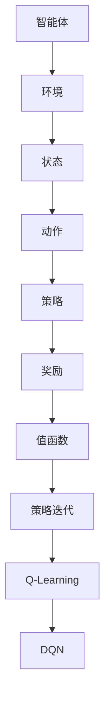

                 

关键词：强化学习，原理，算法，代码实例，深度学习，人工智能

> 摘要：本文将深入探讨强化学习的原理、核心算法以及实际应用，通过代码实例的讲解，帮助读者更好地理解和掌握强化学习的技术要点。本文分为背景介绍、核心概念与联系、核心算法原理与操作步骤、数学模型与公式、项目实践、实际应用场景、工具和资源推荐、总结以及附录等部分，全面解析强化学习这一热门领域。

## 1. 背景介绍

强化学习（Reinforcement Learning，简称RL）是机器学习的一个重要分支，主要研究如何通过智能体（agent）与环境的交互，实现智能行为的决策与优化。与监督学习和无监督学习不同，强化学习强调从环境中获取奖励信号，通过试错和策略迭代，逐渐改善智能体的行为。

强化学习的研究可以追溯到20世纪50年代，早期的研究主要关注于模型预测和控制问题。随着计算机技术和人工智能的快速发展，强化学习逐渐成为人工智能领域的一个重要研究方向。近年来，深度强化学习（Deep Reinforcement Learning，简称DRL）的兴起，使得强化学习在计算机视觉、自然语言处理、游戏、机器人控制等领域取得了显著的应用成果。

## 2. 核心概念与联系

为了更好地理解强化学习，我们需要首先了解一些核心概念和它们之间的联系。

### 2.1 智能体（Agent）

智能体是指能够感知环境、执行动作并从环境中获取奖励的实体。在强化学习中，智能体通常是一个程序或算法。

### 2.2 环境（Environment）

环境是指智能体所处的外部世界，包括状态空间、动作空间和奖励函数。状态空间表示智能体在某一时刻所能感知到的信息，动作空间表示智能体可以执行的动作，奖励函数则用来衡量智能体的动作效果。

### 2.3 状态（State）

状态是描述智能体当前所处环境的特征集合。在强化学习中，状态是动态变化的，智能体需要根据当前状态选择下一步动作。

### 2.4 动作（Action）

动作是智能体在某一状态下执行的操作。在强化学习中，动作的选择通常基于智能体的策略。

### 2.5 策略（Policy）

策略是智能体在给定状态下选择动作的规则或方法。策略决定了智能体的行为，是强化学习中的核心概念。

### 2.6 奖励（Reward）

奖励是环境对智能体动作的反馈，用于指导智能体的学习过程。奖励可以是正的（表示好的结果）或负的（表示不好的结果）。

### 2.7 值函数（Value Function）

值函数是描述智能体在某一状态下执行某一策略所获得的期望奖励。值函数分为状态值函数（State Value Function）和动作值函数（Action Value Function）。

### 2.8 策略迭代（Policy Iteration）

策略迭代是强化学习的一种算法，通过迭代更新策略，逐渐改善智能体的行为。策略迭代分为两个步骤：策略评估（Policy Evaluation）和策略改进（Policy Improvement）。

### 2.9 Q-Learning（Q学习）

Q-Learning是一种基于值函数的强化学习算法，通过迭代更新Q值（动作值函数）来指导智能体的动作选择。Q-Learning的核心思想是：选择当前状态下能够获得最大Q值的动作。

### 2.10 Deep Q-Network（DQN，深度Q网络）

DQN是一种基于深度学习的强化学习算法，通过神经网络来近似Q值函数。DQN的主要贡献是解决了深度强化学习中的经验回放（Experience Replay）和目标网络（Target Network）问题。

### 2.11 绘制Mermaid流程图

以下是强化学习核心概念和算法原理的Mermaid流程图：



## 3. 核心算法原理与操作步骤

### 3.1 算法原理概述

强化学习算法的核心思想是：通过智能体与环境之间的交互，不断学习并优化策略，以最大化长期奖励。强化学习算法主要分为基于值函数的算法和基于策略的算法。

基于值函数的算法包括Q-Learning和DQN，它们通过学习状态值函数或动作值函数，来指导智能体的动作选择。基于策略的算法包括策略迭代，它通过迭代更新策略，逐渐改善智能体的行为。

### 3.2 算法步骤详解

#### 3.2.1 Q-Learning算法

Q-Learning算法的基本步骤如下：

1. 初始化Q值表：根据经验初始化Q值表。
2. 运行智能体：运行智能体，执行动作，获取状态和奖励。
3. 更新Q值表：根据新获取的状态、奖励和动作，更新Q值表。
4. 重复步骤2和3，直到达到指定迭代次数或满足停止条件。

#### 3.2.2 DQN算法

DQN算法的基本步骤如下：

1. 初始化神经网络：初始化深度神经网络，用于近似Q值函数。
2. 运行智能体：运行智能体，执行动作，获取状态和奖励。
3. 保存经验：将新获取的状态、动作和奖励保存到经验池中。
4. 从经验池中随机抽取经验：从经验池中随机抽取经验，用于训练神经网络。
5. 训练神经网络：使用抽取的经验，训练深度神经网络，更新Q值函数。
6. 更新目标网络：每隔一定迭代次数，更新目标网络的参数，防止梯度消失问题。
7. 重复步骤2到6，直到达到指定迭代次数或满足停止条件。

### 3.3 算法优缺点

#### Q-Learning算法

优点：

- 算法简单，易于实现。
- 适用于离散动作空间。

缺点：

- 对于连续动作空间，效果较差。
- 需要大量的样本数据进行训练。

#### DQN算法

优点：

- 适用于连续动作空间。
- 使用经验回放和目标网络，提高了算法的稳定性和收敛性。

缺点：

- 训练过程较慢，需要较长的训练时间。
- 需要大量的样本数据进行训练。

### 3.4 算法应用领域

强化学习算法在计算机视觉、自然语言处理、游戏、机器人控制等领域有着广泛的应用。

- 在计算机视觉领域，强化学习算法可以用于图像分类、目标检测、图像生成等任务。
- 在自然语言处理领域，强化学习算法可以用于机器翻译、文本生成、情感分析等任务。
- 在游戏领域，强化学习算法可以用于游戏AI的构建，实现智能游戏角色。
- 在机器人控制领域，强化学习算法可以用于机器人路径规划、任务执行、环境交互等任务。

## 4. 数学模型和公式

### 4.1 数学模型构建

强化学习中的数学模型主要包括状态值函数、动作值函数和策略。

#### 状态值函数

状态值函数是描述智能体在某一状态下执行某一策略所获得的期望奖励。数学表达式如下：

$$ V^{\pi}(s) = \sum_{a} \pi(a|s) \cdot Q^{\pi}(s, a) $$

其中，$V^{\pi}(s)$表示状态值函数，$\pi(a|s)$表示在状态s下执行动作a的概率，$Q^{\pi}(s, a)$表示在状态s下执行动作a的期望回报。

#### 动作值函数

动作值函数是描述智能体在某一状态下执行某一动作所获得的期望奖励。数学表达式如下：

$$ Q^{\pi}(s, a) = \sum_{s'} P(s'|s, a) \cdot R(s', a) + \gamma \cdot \max_{a'} Q^{\pi}(s', a') $$

其中，$Q^{\pi}(s, a)$表示动作值函数，$P(s'|s, a)$表示在状态s下执行动作a后转移到状态s'的概率，$R(s', a)$表示在状态s'下执行动作a的即时奖励，$\gamma$表示折扣因子。

#### 策略

策略是智能体在给定状态下选择动作的规则或方法。数学表达式如下：

$$ \pi(a|s) = \frac{\exp(\alpha(a|s))}{\sum_{a'} \exp(\alpha(a'|s))} $$

其中，$\pi(a|s)$表示在状态s下执行动作a的概率，$\alpha(a|s) = \frac{1}{1 + \exp(Q^{\pi}(s, a) - \min_{a'} Q^{\pi}(s, a'))}$表示策略分布的归一化系数。

### 4.2 公式推导过程

#### 状态值函数的推导

根据马尔可夫决策过程（MDP）的定义，状态值函数可以通过以下递归关系推导：

$$ V^{\pi}(s) = \sum_{a} \pi(a|s) \cdot \sum_{s'} P(s'|s, a) \cdot R(s', a) + \gamma \cdot \sum_{s'} P(s'|s, a) \cdot V^{\pi}(s') $$

化简后得到：

$$ V^{\pi}(s) = \sum_{a} \pi(a|s) \cdot \sum_{s'} P(s'|s, a) \cdot (R(s', a) + \gamma \cdot V^{\pi}(s')) $$

由于期望值可以线性展开，我们可以将上式改写为：

$$ V^{\pi}(s) = \sum_{a} \pi(a|s) \cdot \sum_{s'} P(s'|s, a) \cdot R(s', a) + \gamma \cdot V^{\pi}(s) $$

进一步化简得到：

$$ V^{\pi}(s) = \sum_{a} \pi(a|s) \cdot Q^{\pi}(s, a) $$

这就是状态值函数的推导过程。

#### 动作值函数的推导

动作值函数可以通过以下递归关系推导：

$$ Q^{\pi}(s, a) = R(s, a) + \gamma \cdot \max_{a'} Q^{\pi}(s', a') $$

其中，$R(s, a)$表示在状态s下执行动作a的即时奖励，$s'$表示执行动作a后转移到的新状态。

#### 策略的推导

策略的推导相对简单，只需要将动作值函数的最大值作为策略分布的归一化系数即可：

$$ \alpha(a|s) = \frac{1}{1 + \exp(Q^{\pi}(s, a) - \min_{a'} Q^{\pi}(s, a'))} $$

这就是策略的推导过程。

### 4.3 案例分析与讲解

为了更好地理解强化学习的数学模型，我们通过一个简单的例子进行讲解。

假设一个智能体在一个一维的离散环境中进行探索，状态空间为{0, 1, 2, 3}，动作空间为{左移，右移}。奖励函数为：当智能体到达状态3时，获得+10的奖励；当智能体在状态0时，获得-1的奖励；其他状态获得0奖励。

折扣因子$\gamma = 0.9$。我们使用Q-Learning算法进行训练。

初始时，Q值表为：

$$ Q(s, a) = \begin{bmatrix} 0 & 0 \\ 0 & 0 \\ 0 & 0 \\ 10 & 0 \end{bmatrix} $$

假设当前状态为1，智能体选择右移动作。根据Q值表，当前状态下右移动作的Q值为0。

在执行右移动作后，智能体转移到状态2。根据奖励函数，获得0奖励。

更新Q值表：

$$ Q(s, a) = \begin{bmatrix} 0 & 0 \\ 0 & 0 \\ 0.9 \cdot 0 + 0.1 \cdot 0 & 0 \\ 10 & 0 \end{bmatrix} $$

假设当前状态为2，智能体选择左移动作。根据Q值表，当前状态下左移动作的Q值为0。

在执行左移动作后，智能体转移到状态1。根据奖励函数，获得0奖励。

更新Q值表：

$$ Q(s, a) = \begin{bmatrix} 0 & 0 \\ 0 & 0 \\ 0 & 0.9 \cdot 0 + 0.1 \cdot 0 \\ 10 & 0 \end{bmatrix} $$

重复上述过程，直到Q值表收敛或满足停止条件。最终，Q值表将趋于一个稳定的状态，指导智能体的动作选择。

## 5. 项目实践：代码实例和详细解释说明

在本节中，我们将通过一个简单的示例来讲解强化学习的实现过程。假设我们想要训练一个智能体在一个一维离散环境中的导航问题。智能体需要从状态0移动到状态3，并获得+10的奖励。我们将使用Q-Learning算法来实现这一目标。

### 5.1 开发环境搭建

在开始之前，请确保您的计算机上安装了Python 3.7及以上版本。此外，还需要安装以下库：

- NumPy
- Matplotlib

您可以通过以下命令进行安装：

```python
pip install numpy matplotlib
```

### 5.2 源代码详细实现

下面是一个简单的Q-Learning算法实现的代码示例：

```python
import numpy as np
import matplotlib.pyplot as plt

# 设置参数
num_states = 4
num_actions = 2
learning_rate = 0.1
discount_factor = 0.9
epsilon = 0.1
num_episodes = 1000

# 初始化Q值表
Q = np.zeros((num_states, num_actions))

# 奖励函数
rewards = {
    (0, 0): -1,
    (1, 0): 0,
    (2, 0): 0,
    (3, 1): 10,
    (0, 1): 0,
    (1, 1): 0,
    (2, 1): 0,
    (3, 0): 0
}

# Q-Learning算法
for episode in range(num_episodes):
    state = 0
    done = False
    total_reward = 0

    while not done:
        # 探索策略
        if np.random.rand() < epsilon:
            action = np.random.randint(num_actions)
        else:
            action = np.argmax(Q[state])

        # 执行动作
        if action == 0:  # 左移
            state = max(state - 1, 0)
        else:  # 右移
            state = min(state + 1, num_states - 1)

        # 获取奖励
        reward = rewards[(state, action)]

        # 更新Q值表
        Q[state, action] = Q[state, action] + learning_rate * (reward + discount_factor * np.max(Q[state]) - Q[state, action])

        # 计算总奖励
        total_reward += reward

        # 检查是否到达终点
        if state == num_states - 1:
            done = True

    # 打印当前迭代次数和总奖励
    print(f"Episode: {episode + 1}, Total Reward: {total_reward}")

# 绘制Q值表
plt.imshow(Q, cmap="hot", interpolation="nearest")
plt.colorbar()
plt.xlabel("Actions")
plt.ylabel("States")
plt.show()
```

### 5.3 代码解读与分析

下面是对代码的详细解读：

1. **参数设置**：首先，我们设置了状态数、动作数、学习率、折扣因子、探索概率和迭代次数等参数。

2. **初始化Q值表**：使用NumPy库初始化一个形状为(num_states, num_actions)的零矩阵作为Q值表。

3. **奖励函数**：定义一个字典，用于存储每个状态-动作对的即时奖励。

4. **Q-Learning算法**：使用for循环运行指定次数的迭代。在每次迭代中，智能体从一个初始状态开始，根据探索概率选择动作。根据选择的动作，智能体会转移到新状态并获取奖励。然后，使用Q值更新公式更新Q值表。

5. **绘制Q值表**：在训练完成后，使用Matplotlib库绘制Q值表。

### 5.4 运行结果展示

运行上述代码后，我们将看到每个迭代的总奖励输出，以及最终绘制的Q值表。Q值表显示了每个状态-动作对的Q值，这些Q值指导智能体在给定状态下选择最佳动作。

## 6. 实际应用场景

强化学习在许多实际应用场景中表现出色，下面我们来看几个典型的应用场景：

### 6.1 自动驾驶

自动驾驶是强化学习的一个热门应用领域。在自动驾驶中，智能体（自动驾驶汽车）需要与环境（道路、其他车辆、行人等）进行交互，并做出实时的决策，如加速、减速、转向等。强化学习算法可以帮助自动驾驶汽车学习如何安全、高效地驾驶。

### 6.2 游戏AI

强化学习在游戏AI中也取得了显著的应用成果。例如，深度强化学习算法DQN在许多经典游戏（如《星际争霸》、《无人深空》等）中实现了超人类的表现。强化学习算法可以用于训练游戏AI，使其在复杂的游戏环境中做出最佳决策。

### 6.3 机器人控制

机器人控制是强化学习的另一个重要应用领域。在机器人控制中，智能体（机器人）需要与环境（物理世界）进行交互，并执行特定的任务，如路径规划、抓取物体、焊接等。强化学习算法可以帮助机器人学习如何高效地完成任务。

### 6.4 自然语言处理

强化学习在自然语言处理领域也有广泛的应用。例如，可以使用强化学习算法训练语言模型，使其在给定的上下文中生成合理的文本。此外，强化学习还可以用于机器翻译、文本分类、问答系统等任务。

## 7. 工具和资源推荐

为了更好地学习和实践强化学习，以下是一些推荐的工具和资源：

### 7.1 学习资源推荐

- 《强化学习：原理与案例》
- 《深度强化学习》
- 《强化学习实战》
- 《强化学习中的探索与利用》

### 7.2 开发工具推荐

- OpenAI Gym：一个开源的强化学习环境库，提供了多种预定义的强化学习任务。
- TensorFlow：一个开源的深度学习框架，支持强化学习算法的实现。
- PyTorch：一个开源的深度学习框架，支持强化学习算法的实现。

### 7.3 相关论文推荐

- “Deep Reinforcement Learning for Autonomous Driving”
- “Mastering the Game of Go with Deep Neural Networks and Tree Search”
- “Human-level control through deep reinforcement learning”
- “DQN: Deep Q-Networks for Reinforcement Learning”

## 8. 总结：未来发展趋势与挑战

### 8.1 研究成果总结

近年来，强化学习在人工智能领域取得了显著的进展。深度强化学习算法的提出，使得强化学习能够解决更复杂的任务。此外，强化学习在自动驾驶、游戏AI、机器人控制、自然语言处理等领域也取得了广泛的应用成果。

### 8.2 未来发展趋势

未来，强化学习将继续朝着更复杂、更智能的方向发展。以下是一些可能的发展趋势：

- 多智能体强化学习：研究如何多个智能体在动态环境中协同工作，以实现更高效的任务分配和决策。
- 强化学习与深度学习结合：进一步探索强化学习与深度学习的结合，解决更复杂的决策问题。
- 强化学习在实时应用中的优化：研究如何在实时应用中高效地部署强化学习算法，提高系统的响应速度和性能。
- 强化学习在边缘计算中的研究：研究如何将强化学习算法应用于边缘计算设备，实现低延迟、高效率的智能决策。

### 8.3 面临的挑战

尽管强化学习取得了显著的成果，但在实际应用中仍面临一些挑战：

- 数据需求：强化学习通常需要大量的样本数据来进行训练，这对数据收集和处理提出了较高要求。
- 鲁棒性：强化学习算法在处理未知或变化的环境时，可能表现出较低的鲁棒性，需要进一步研究如何提高算法的鲁棒性。
- 可解释性：强化学习算法的决策过程往往较为复杂，缺乏可解释性，这限制了其在某些领域的应用。
- 道德与伦理：在涉及人类生命安全的领域，如自动驾驶、机器人控制等，如何确保强化学习算法的决策符合道德和伦理标准，是一个亟待解决的问题。

### 8.4 研究展望

未来，强化学习的研究将朝着更加智能化、高效化、安全化的方向发展。我们期待看到更多创新的算法和应用场景，以推动强化学习在各个领域的应用。同时，我们也呼吁学术界和工业界共同努力，解决强化学习面临的挑战，为人工智能的发展贡献力量。

## 9. 附录：常见问题与解答

### 9.1 强化学习与深度学习的区别是什么？

强化学习与深度学习都是人工智能的重要分支。强化学习主要关注如何通过智能体与环境交互，学习最优策略。而深度学习则侧重于使用神经网络来表示和处理复杂的数据。两者之间的区别主要在于学习目标和应用场景。

### 9.2 强化学习算法如何处理连续动作空间？

在处理连续动作空间时，强化学习算法通常采用基于梯度的方法，如深度Q网络（DQN）和策略梯度方法（PG）。这些方法使用神经网络来近似动作值函数或策略，通过优化神经网络参数来实现智能体的动作选择。

### 9.3 强化学习算法如何处理不确定性环境？

强化学习算法在处理不确定性环境时，通常采用探索策略，如epsilon-greedy策略。通过在策略中加入一定的随机性，强化学习算法可以在不确定性环境中避免陷入局部最优。

### 9.4 强化学习算法如何处理多智能体问题？

多智能体强化学习是强化学习的一个重要研究方向。在处理多智能体问题时，强化学习算法需要考虑多个智能体之间的交互和合作。常见的方法包括分布式算法、合作博弈和竞争博弈等。

### 9.5 强化学习算法在工业应用中的难点是什么？

在工业应用中，强化学习算法面临的难点主要包括：数据收集和处理、模型可解释性、鲁棒性和实时性能。为了解决这些问题，需要进一步研究和优化强化学习算法，以提高其在实际应用中的效果和可靠性。

