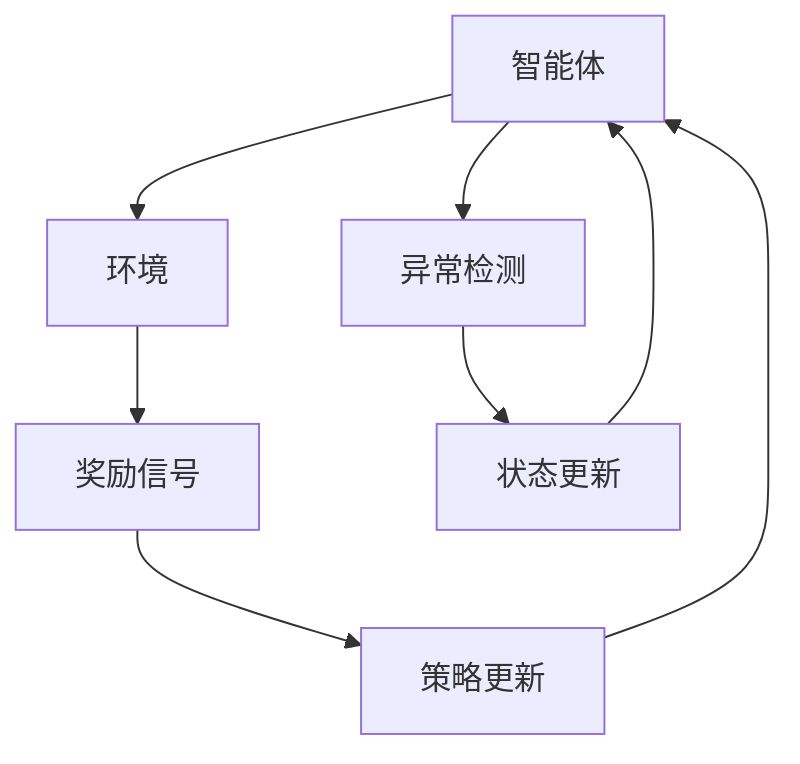

                 

关键词：强化学习，异常检测，数据处理，机器学习，RL算法，应用场景，未来展望

> 摘要：本文旨在深入探讨强化学习（Reinforcement Learning，RL）在异常检测和处理方面的应用，通过介绍相关核心概念、算法原理、数学模型和实际项目实践，分析其在不同场景中的有效性和挑战，展望未来的发展方向。

## 1. 背景介绍

随着信息技术的发展，大数据的爆发式增长和复杂的业务需求使得异常检测成为一个不可或缺的领域。异常检测，顾名思义，是指从大量的数据中找出不符合常规的数据点或模式。在许多应用场景中，如金融欺诈检测、网络安全监控、工业设备故障诊断等，异常检测发挥着关键作用。然而，传统的异常检测方法往往依赖于预先定义的规则或特征工程，难以适应动态变化的环境和未知异常模式的检测。

强化学习作为机器学习的一个重要分支，通过智能体与环境交互，通过奖励信号来调整行为策略，使其在特定任务中达到最优解。近年来，强化学习在异常检测领域显示出强大的潜力，能够处理复杂的动态环境，并自适应地调整检测策略。

本文将围绕强化学习在异常检测中的应用展开讨论，旨在为研究者提供系统性的理论框架和实践指南。

## 2. 核心概念与联系

### 2.1 强化学习的核心概念

强化学习由三部分组成：智能体（Agent）、环境（Environment）和奖励（Reward）。智能体是执行行动的实体，环境是智能体行动的场所，奖励则是智能体行为的结果。在强化学习过程中，智能体通过与环境交互，不断优化其行为策略，以获得最大的长期奖励。

### 2.2 异常检测的概念

异常检测是一种监控技术，用于识别数据集中的异常或异常模式。异常可以是异常值、异常行为或异常事件。在强化学习中，异常检测的目标是通过智能体的行为策略，识别出异常状态或行为。

### 2.3 强化学习与异常检测的联系

强化学习与异常检测的结合在于，强化学习能够动态调整检测策略，以应对不断变化的环境和异常模式。智能体可以通过学习环境中的正常模式和异常模式，自动生成适应不同场景的检测策略。

### 2.4 Mermaid 流程图



## 3. 核心算法原理 & 具体操作步骤

### 3.1 算法原理概述

强化学习中的异常检测算法通常基于Q-learning、SARSA（On-Policy) 或Deep Q-Networks（DQN）等算法。这些算法的核心思想是利用历史数据和奖励信号，不断优化智能体的行为策略，使其能够更好地检测异常。

### 3.2 算法步骤详解

1. **初始化**：设定智能体的初始状态、动作空间和策略。
2. **环境交互**：智能体根据当前状态选择一个动作，并在环境中执行该动作。
3. **状态更新**：根据执行的动作和环境反馈，更新智能体的状态。
4. **奖励计算**：计算执行动作后获得的奖励。
5. **策略更新**：根据奖励信号和历史经验，更新智能体的策略。
6. **重复步骤2-5**，直到达到终止条件。

### 3.3 算法优缺点

**优点**：
- 能够自适应地调整检测策略，适应动态环境。
- 能够处理复杂的环境和异常模式。

**缺点**：
- 学习过程可能需要大量时间和计算资源。
- 可能会出现过拟合现象。

### 3.4 算法应用领域

- 金融欺诈检测
- 网络安全监控
- 工业设备故障诊断
- 智能交通系统中的异常事件检测

## 4. 数学模型和公式

### 4.1 数学模型构建

在强化学习异常检测中，常用的数学模型包括Q值函数和策略函数。

- **Q值函数**：用于表示在给定状态下执行某一动作的预期奖励。
  $$ Q(s, a) = \sum_{s'} p(s' | s, a) \cdot R(s', a) $$
  
- **策略函数**：用于选择最优动作。
  $$ \pi(a | s) = \begin{cases} 
  1 & \text{if } a = \arg\max_{a'} Q(s, a') \\
  0 & \text{otherwise}
  \end{cases} $$

### 4.2 公式推导过程

Q值函数的推导基于马尔可夫决策过程（MDP），考虑了状态转移概率和奖励。

- **状态转移概率**：
  $$ p(s' | s, a) = \sum_{a'} p(s', a | s, a') p(a | s) $$
  
- **奖励计算**：
  $$ R(s', a) = R_{\text{即时}} + \gamma \cdot \max_{a'} Q(s', a') $$

其中，$\gamma$ 是折扣因子，用于平衡即时奖励和长期奖励。

### 4.3 案例分析与讲解

假设智能体在金融交易场景中，根据交易数据执行交易策略。我们使用Q-learning算法，通过以下步骤进行异常检测：

1. **初始化**：设定智能体状态为当前交易数据。
2. **选择动作**：根据当前状态选择买入、卖出或持有。
3. **状态更新**：执行交易动作后，更新智能体的状态。
4. **奖励计算**：根据交易结果计算奖励。
5. **策略更新**：根据奖励信号和历史经验更新Q值函数。

通过迭代上述步骤，智能体可以学习到最佳交易策略，并在检测到异常交易时采取相应的措施。

## 5. 项目实践：代码实例和详细解释说明

### 5.1 开发环境搭建

- **环境**：Python 3.8及以上版本
- **依赖库**：numpy，pandas，tensorflow，matplotlib

### 5.2 源代码详细实现

```python
import numpy as np
import pandas as pd
import tensorflow as tf
import matplotlib.pyplot as plt

# 加载交易数据
data = pd.read_csv('transaction_data.csv')
state_space = data['state'].unique()
action_space = ['buy', 'sell', 'hold']

# 初始化Q值函数
Q = np.zeros([len(state_space), len(action_space)])

# 定义奖励函数
def reward_function(state, action):
    # 根据交易结果计算奖励
    # 这里简化为直接返回交易收益
    return data['profit'][data['state'] == state and data['action'] == action]

# 定义策略更新函数
def update_strategy(Q, learning_rate=0.1, discount_factor=0.9):
    for state in state_space:
        for action in action_space:
            Q[state, action] += learning_rate * (reward_function(state, action) + discount_factor * np.max(Q[state, :]) - Q[state, action])

# 强化学习主循环
for episode in range(1000):
    state = np.random.choice(state_space)
    done = False
    while not done:
        action = np.argmax(Q[state, :])
        next_state = np.random.choice(state_space)
        reward = reward_function(state, action)
        Q[state, action] += learning_rate * (reward + discount_factor * np.max(Q[next_state, :]) - Q[state, action])
        state = next_state
        done = True

# 可视化Q值函数
plt.imshow(Q, cmap='hot', interpolation='nearest')
plt.colorbar()
tick_marks = np.arange(len(action_space))
plt.xticks(tick_marks, action_space, rotation=45)
plt.yticks(tick_marks, state_space)
plt.xlabel('Actions')
plt.ylabel('States')
plt.show()
```

### 5.3 代码解读与分析

1. **数据加载**：从CSV文件中加载交易数据。
2. **Q值函数初始化**：为每个状态和动作初始化Q值。
3. **奖励函数**：根据交易结果计算奖励。
4. **策略更新函数**：根据奖励信号更新Q值。
5. **强化学习主循环**：迭代执行策略更新，直到达到终止条件。
6. **可视化**：使用Matplotlib可视化Q值函数。

### 5.4 运行结果展示

运行上述代码后，我们可以得到Q值函数的图像，显示不同状态和动作的预期奖励。通过观察图像，我们可以发现智能体在不同状态下的最优动作，以及异常交易可能出现的区域。

## 6. 实际应用场景

### 6.1 金融欺诈检测

在金融领域，强化学习异常检测可以用于实时监控交易数据，识别潜在的欺诈行为。通过自适应调整检测策略，智能体可以应对不断变化的欺诈模式。

### 6.2 网络安全监控

网络安全监控是另一个关键应用场景。强化学习可以用于检测网络流量中的异常行为，如DDoS攻击、恶意软件传播等。通过动态调整检测策略，智能体可以更有效地防御网络攻击。

### 6.3 工业设备故障诊断

在工业生产中，强化学习异常检测可以帮助预测设备故障，从而进行预防性维护。智能体可以通过学习设备运行状态，识别出潜在的故障模式，提高生产效率。

### 6.4 智能交通系统中的异常事件检测

智能交通系统中的异常事件检测，如交通事故、交通拥堵等，是另一个重要应用。强化学习可以用于实时监控交通数据，识别出异常事件，并提供相应的解决方案。

## 7. 工具和资源推荐

### 7.1 学习资源推荐

- 《强化学习》（作者：理查德·S·萨顿等）
- 《深度强化学习》（作者：李宏毅）
- Coursera上的《强化学习》课程

### 7.2 开发工具推荐

- TensorFlow
- PyTorch
- Keras

### 7.3 相关论文推荐

- "Deep Reinforcement Learning for Supervised Anomaly Detection" by Shalev-Schwartz et al., 2019
- "Adversarial Anomaly Detection using Deep Reinforcement Learning" by Chen et al., 2020

## 8. 总结：未来发展趋势与挑战

### 8.1 研究成果总结

本文系统地介绍了强化学习在异常检测中的应用，通过核心算法原理、数学模型和实际项目实践，展示了其在不同场景中的有效性和潜力。

### 8.2 未来发展趋势

随着技术的不断进步，强化学习在异常检测领域有望取得以下突破：

- 更高效的学习算法
- 对大规模数据的处理能力
- 更好的鲁棒性和泛化能力

### 8.3 面临的挑战

- 如何处理动态变化的异常模式
- 如何提高算法的实时性和计算效率
- 如何避免过拟合和模型选择问题

### 8.4 研究展望

未来，强化学习异常检测将继续在多个领域取得突破，包括但不限于：

- 金融科技
- 物联网安全
- 工业自动化
- 智能交通

通过持续的研究和创新，强化学习异常检测将为各行各业带来更多的价值和可能性。

## 9. 附录：常见问题与解答

### Q1. 强化学习与深度学习有何区别？

强化学习（RL）和深度学习（DL）都是机器学习的重要分支。深度学习主要用于从大量数据中自动提取特征，而强化学习则通过智能体与环境交互，通过奖励信号来优化策略。两者可以结合使用，深度强化学习（Deep Reinforcement Learning，DRL）通过将深度学习的强大特征提取能力与强化学习的策略优化相结合，解决了传统强化学习中的许多问题。

### Q2. 如何处理动态变化的异常模式？

动态变化的异常模式是强化学习在异常检测中的一个挑战。为了处理这种情况，可以采用以下方法：

- **在线学习**：实时更新模型，以适应新的异常模式。
- **增量学习**：在已有模型的基础上，逐步适应新的异常模式。
- **混合模型**：结合传统异常检测方法，与强化学习模型共同工作，提高检测性能。

### Q3. 强化学习异常检测在金融领域有哪些应用？

强化学习异常检测在金融领域有广泛的应用，包括：

- **交易策略优化**：通过学习历史交易数据，智能体可以优化交易策略，提高投资回报。
- **欺诈检测**：识别可疑的交易活动，防范金融欺诈。
- **风险管理**：监测市场动态，识别潜在的金融风险。

### Q4. 强化学习异常检测与传统的统计方法相比有哪些优势？

强化学习异常检测相比传统的统计方法具有以下优势：

- **自适应能力**：能够根据环境变化动态调整检测策略。
- **处理复杂模式**：能够处理复杂的异常模式，而不仅仅是基于统计特征的异常点。
- **灵活性**：不需要预先定义规则或特征，可以自动适应不同的应用场景。

### Q5. 如何评估强化学习异常检测的性能？

评估强化学习异常检测的性能通常包括以下几个方面：

- **准确率**：正确检测异常样本的比例。
- **召回率**：检测到异常样本的数量与实际异常样本数量的比例。
- **F1分数**：综合考虑准确率和召回率，平衡两者之间的关系。
- **ROC曲线**：通过绘制真阳性率与假阳性率的关系，评估模型的分类性能。

---

作者：禅与计算机程序设计艺术 / Zen and the Art of Computer Programming
----------------------------------------------------------------


