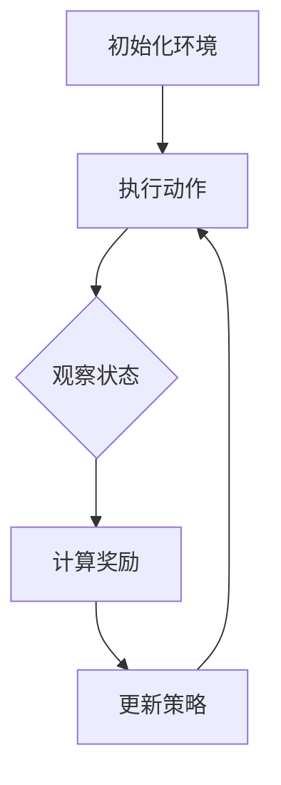

                 

### 1. 背景介绍

随着电子竞技（eSports）的蓬勃发展，电子竞技比赛逐渐成为了全球范围内的热门娱乐活动。从《星际争霸》到《英雄联盟》，再到《绝地求生》，电子竞技项目以其独特的竞技性和观赏性吸引了大量观众，同时也催生了庞大的市场。然而，随着比赛复杂度的增加和竞技水平的不断提升，电子竞技选手需要面对的挑战也越来越大。如何在这片充满竞争的赛场上脱颖而出，成为了电子竞技选手和教练团队们必须思考的问题。

与此同时，人工智能（AI）技术特别是强化学习（Reinforcement Learning，RL）在过去几十年里取得了显著的进展。强化学习是一种通过试错来学习如何最大化长期奖励的机器学习技术，它在游戏、机器人控制、资源优化等领域展现出了巨大的潜力。那么，强化学习能否在电子竞技领域发挥作用，帮助选手们提升竞技水平呢？

本文将探讨强化学习在电子竞技中的应用，首先介绍强化学习的基本概念和核心原理，然后分析强化学习在电子竞技中的潜在优势和应用场景，最后通过具体案例展示强化学习在电子竞技领域的实际应用效果。

### 2. 核心概念与联系

为了更好地理解强化学习在电子竞技中的运用，我们需要先掌握强化学习的基本概念和原理。下面我们将通过一个简化的Mermaid流程图来介绍强化学习的基本框架。



- **初始化环境（A）**：在开始强化学习之前，我们需要初始化环境，这通常包括定义游戏的状态空间、动作空间以及初始状态。
- **执行动作（B）**：智能体（如电子竞技选手或AI）根据当前的策略选择一个动作，然后执行这个动作。
- **观察状态（C）**：执行动作后，环境会根据新的状态反馈给智能体。
- **计算奖励（D）**：环境根据智能体执行的动作给出一个奖励信号，以激励智能体选择更好的动作。
- **更新策略（E）**：智能体使用这个奖励信号来更新自己的策略，以期望在未来的决策中获得更高的奖励。

#### 强化学习的核心概念

1. **状态（State）**：描述智能体当前所处的环境条件。
2. **动作（Action）**：智能体可以采取的行为。
3. **策略（Policy）**：智能体在特定状态下选择动作的规则。
4. **价值函数（Value Function）**：预测在给定状态下采取特定动作的长期回报。
5. **模型（Model）**：对环境的动态和奖励机制的抽象表示。

#### 强化学习的基本算法

强化学习主要包括以下几种算法：

1. **价值迭代（Value Iteration）**：通过迭代更新价值函数来逼近最优策略。
2. **策略迭代（Policy Iteration）**：直接迭代更新策略来逼近最优策略。
3. **Q-Learning（Q值学习）**：通过学习Q值（即动作价值函数）来更新策略。
4. **SARSA（同步优势和回报学习）**：在更新策略时同时考虑当前状态和动作。
5. **Deep Q-Network（DQN，深度Q网络）**：使用深度神经网络来近似Q值函数。

这些算法各有优劣，适用于不同的场景和任务。

#### 强化学习在电子竞技中的潜在联系

电子竞技比赛本质上是一个复杂的决策过程，涉及大量的状态和动作。以下是强化学习在电子竞技中的潜在联系：

1. **决策优化**：强化学习可以帮助选手在复杂的比赛中做出更优的决策。
2. **策略训练**：通过强化学习，选手可以训练出适应不同比赛场景的策略。
3. **对手分析**：强化学习可以学习对手的行为模式，从而制定针对性的对策。
4. **自动化执行**：强化学习算法可以自动化执行比赛策略，减少人为误差。

接下来，我们将进一步探讨强化学习在电子竞技中的具体应用和优势。

### 2.1 强化学习在电子竞技中的潜在优势和应用场景

强化学习在电子竞技中的潜在优势主要体现在以下几个方面：

1. **自适应能力**：电子竞技比赛场景多变，强化学习算法可以通过不断学习环境反馈来调整策略，从而适应不同的比赛情况。
2. **决策优化**：强化学习可以帮助选手在比赛中做出更优的决策，特别是在面对多个选择时，能够通过学习历史数据来提高决策的准确性。
3. **策略训练**：通过强化学习，选手可以训练出适应不同比赛场景的个性化策略，从而提高比赛表现。
4. **对手分析**：强化学习可以学习对手的行为模式，从而更好地预测对手的下一步行动，制定有针对性的对策。
5. **自动化执行**：强化学习算法可以自动化执行比赛策略，减少人为误差，提高比赛稳定性。

下面，我们详细探讨强化学习在电子竞技中的几个典型应用场景：

1. **实时决策支持**：在比赛过程中，选手需要根据当前局势做出快速决策。强化学习算法可以通过学习历史比赛数据，为选手提供实时决策建议，帮助选手在比赛中占据优势。
2. **策略自动化**：电子竞技游戏中，选手需要执行一系列复杂的动作序列。强化学习算法可以学习这些动作序列，并自动化执行，从而减少选手的操作负担，提高比赛效率。
3. **对手行为预测**：通过强化学习，选手可以分析对手的历史行为数据，预测对手可能的下一步行动，从而提前制定对策。
4. **新游戏适应性训练**：当新的电子竞技游戏推出时，选手需要迅速适应新的游戏规则和策略。强化学习算法可以帮助选手快速学习新的游戏机制，提高在新游戏中的表现。
5. **团队协作优化**：在多人电子竞技游戏中，团队协作至关重要。强化学习可以学习团队成员的行为模式，优化团队策略，提高整体战斗力和协同效率。

总之，强化学习为电子竞技提供了强大的技术支持，通过自适应决策、策略训练、对手分析等功能，帮助选手在激烈的比赛中脱颖而出。随着技术的不断进步，强化学习在电子竞技中的应用前景将更加广阔。

### 3. 核心算法原理 & 具体操作步骤

#### 3.1 算法原理概述

强化学习是一种通过试错来学习如何最大化长期奖励的机器学习技术。其核心原理可以概括为“尝试 - 反馈 - 学习 - 优化”。具体来说，强化学习过程可以分为以下几个步骤：

1. **初始化**：初始化智能体的状态、动作空间和价值函数。
2. **执行动作**：智能体根据当前状态选择一个动作执行。
3. **接收反馈**：执行动作后，环境会给出一个即时奖励，并更新智能体的状态。
4. **更新策略**：根据即时奖励和长期目标，智能体会更新其策略，以期望在未来获得更高的奖励。
5. **迭代学习**：智能体重复执行上述步骤，不断调整策略，直到达到预期目标。

强化学习的基本概念包括状态（State）、动作（Action）、策略（Policy）、价值函数（Value Function）和奖励（Reward）。其中：

- **状态（State）**：描述智能体当前所处的环境条件，可以是离散的也可以是连续的。
- **动作（Action）**：智能体可以采取的行为，也可以是离散的或连续的。
- **策略（Policy）**：智能体在特定状态下选择动作的规则，可以表示为 \( \pi(a|s) \)，即给定状态 \( s \) 时采取动作 \( a \) 的概率。
- **价值函数（Value Function）**：预测在给定状态下采取特定动作的长期回报，分为状态价值函数 \( V(s) \) 和动作价值函数 \( Q(s, a) \)。
- **奖励（Reward）**：即时奖励，用于评价当前动作的优劣，可以是正值、负值或零。

强化学习的主要算法包括：

1. **价值迭代（Value Iteration）**：通过迭代更新价值函数来逼近最优策略。
2. **策略迭代（Policy Iteration）**：直接迭代更新策略来逼近最优策略。
3. **Q-Learning（Q值学习）**：通过学习Q值（即动作价值函数）来更新策略。
4. **SARSA（同步优势和回报学习）**：在更新策略时同时考虑当前状态和动作。
5. **Deep Q-Network（DQN，深度Q网络）**：使用深度神经网络来近似Q值函数。

#### 3.2 算法步骤详解

下面以Q-Learning算法为例，详细说明强化学习的具体操作步骤：

1. **初始化**：
   - 选择智能体初始状态 \( s_0 \)。
   - 初始化Q值函数 \( Q(s, a) \)，通常使用零向量或经验初值。
   - 设定学习率 \( \alpha \) 和折扣因子 \( \gamma \)。

2. **执行动作**：
   - 根据当前状态 \( s \) 和策略 \( \pi \)，选择一个动作 \( a \) 执行。

3. **接收反馈**：
   - 执行动作 \( a \) 后，环境给出即时奖励 \( r \) 并更新状态 \( s \) 为 \( s' \)。

4. **更新Q值**：
   - 计算Q值更新公式：
     $$ Q(s, a) \leftarrow Q(s, a) + \alpha [r + \gamma \max_{a'} Q(s', a') - Q(s, a)] $$
   - 更新Q值函数。

5. **迭代学习**：
   - 重复执行步骤 2-4，直到达到预期目标或满足停止条件。

#### 3.3 算法优缺点

强化学习具有以下优点：

1. **自适应性强**：强化学习通过不断学习和适应环境反馈，能够应对动态变化。
2. **适用于复杂决策**：强化学习能够在不确定的环境中学习最优策略，适用于复杂决策问题。
3. **广泛适用性**：强化学习可以应用于多种领域，包括游戏、机器人控制、推荐系统等。

强化学习也存在以下缺点：

1. **收敛速度慢**：在初始阶段，强化学习需要大量尝试和错误来学习策略，收敛速度较慢。
2. **需要大量数据**：强化学习依赖于大量经验数据，数据稀疏或数据质量差会影响学习效果。
3. **策略不稳定**：在某些情况下，强化学习策略可能会不稳定，特别是在高度动态或不确定的环境中。

#### 3.4 算法应用领域

强化学习在多个领域得到了广泛应用，以下是其中一些主要应用领域：

1. **游戏**：强化学习在电子游戏、棋类游戏、扑克游戏等领域具有广泛应用，如Google的AlphaGo和DeepMind的AlphaZero。
2. **机器人控制**：强化学习在无人机、自动驾驶汽车、机器人路径规划等领域应用广泛，能够提高自主性和效率。
3. **推荐系统**：强化学习在个性化推荐系统中应用，通过学习用户行为和偏好，提供更准确的推荐结果。
4. **金融交易**：强化学习在股票交易、风险管理等领域应用，通过模拟市场行为和学习交易策略，优化投资组合。

总之，强化学习作为一种强大的机器学习技术，在电子竞技以及其他领域中具有广阔的应用前景。通过不断优化算法和扩展应用场景，强化学习有望为电子竞技领域带来更多创新和突破。

### 4. 数学模型和公式 & 详细讲解 & 举例说明

#### 4.1 数学模型构建

强化学习的数学模型主要涉及状态（State）、动作（Action）、策略（Policy）、价值函数（Value Function）和奖励（Reward）等基本概念。

1. **状态空间（S）**：状态空间是指所有可能的状态集合。在电子竞技中，状态可能包括选手的位置、敌人的位置、资源分布等信息。

2. **动作空间（A）**：动作空间是指所有可能动作的集合。在电子竞技中，动作可能包括移动、攻击、防御等。

3. **策略（Policy，π）**：策略是一个映射函数，它将状态映射到动作。策略决定了在特定状态下应该执行哪个动作。

   $$ \pi(a|s) = P(a|s) $$

   其中，\( \pi(a|s) \) 表示在状态 \( s \) 下执行动作 \( a \) 的概率。

4. **价值函数（Value Function）**：价值函数用于评估策略的优劣，分为状态价值函数 \( V(s) \) 和动作价值函数 \( Q(s, a) \)。

   - **状态价值函数 \( V(s) \)**：表示在状态 \( s \) 下执行最优策略所能获得的期望回报。

     $$ V^*(s) = \sum_{a} \pi(a|s) \cdot Q^*(s, a) $$

   - **动作价值函数 \( Q(s, a) \)**：表示在状态 \( s \) 下执行动作 \( a \) 所能获得的期望回报。

     $$ Q^*(s, a) = \sum_{s'} P(s'|s, a) \cdot [R(s', a) + \gamma \cdot \max_{a'} Q^*(s', a')] $$

     其中，\( R(s', a) \) 表示在状态 \( s' \) 下执行动作 \( a \) 所获得的即时奖励，\( \gamma \) 是折扣因子，用于平衡即时奖励和长期奖励。

5. **奖励（Reward，R）**：奖励是环境对智能体执行的每个动作的即时评价，可以是正值、负值或零。

6. **策略更新**：在强化学习中，智能体会根据接收到的奖励来更新策略，以期望最大化长期回报。常用的策略更新方法包括Q-Learning和SARSA。

   - **Q-Learning**：通过学习动作价值函数来更新策略。

     $$ Q(s, a) \leftarrow Q(s, a) + \alpha [R(s', a) + \gamma \cdot \max_{a'} Q(s', a') - Q(s, a)] $$

   - **SARSA**：同时考虑当前状态和动作，更新策略。

     $$ Q(s, a) \leftarrow Q(s, a) + \alpha [R(s', a') + \gamma \cdot Q(s', a')] $$

#### 4.2 公式推导过程

强化学习中的Q值更新可以通过以下步骤推导：

1. **目标函数**：假设在状态 \( s \) 下，智能体执行动作 \( a \) 的Q值是 \( Q(s, a) \)，我们希望找到这个Q值的最佳更新方法。

2. **实际回报**：在执行动作 \( a \) 后，智能体会进入状态 \( s' \)，并获得即时奖励 \( R(s', a) \)。

3. **期望回报**：为了最大化长期回报，智能体需要考虑状态 \( s' \) 下执行最佳动作 \( a' \) 的期望回报。

4. **更新Q值**：结合实际回报和期望回报，我们得到Q值的更新公式：

   $$ Q(s, a) \leftarrow Q(s, a) + \alpha [R(s', a) + \gamma \cdot \max_{a'} Q(s', a') - Q(s, a)] $$

   其中，\( \alpha \) 是学习率，用于调整Q值的更新幅度，\( \gamma \) 是折扣因子，用于平衡即时奖励和长期奖励。

#### 4.3 案例分析与讲解

假设在电子竞技游戏中，智能体的状态空间包括选手的位置、敌人的位置和资源分布，动作空间包括移动、攻击和防御。我们选择Q-Learning算法来训练智能体，目标是最大化长期奖励。

1. **初始化**：
   - 初始状态 \( s_0 \)：选手位于地图中央，敌人位于地图边缘，资源分布均匀。
   - 初始化Q值函数 \( Q(s, a) \)：所有 \( Q(s, a) \) 均设置为0。

2. **执行动作**：
   - 在状态 \( s_0 \) 下，智能体选择动作“移动”。

3. **接收反馈**：
   - 智能体移动后，进入新状态 \( s_1 \)，并获得即时奖励 \( R(s_1, 移动) = 0 \)。

4. **更新Q值**：
   - 根据Q值更新公式，计算Q值更新：
     $$ Q(s_0, 移动) \leftarrow Q(s_0, 移动) + \alpha [R(s_1, 移动) + \gamma \cdot \max_{a'} Q(s_1, a') - Q(s_0, 移动)] $$
   - 由于初始时所有Q值均为0，更新后的Q值为：
     $$ Q(s_0, 移动) \leftarrow 0 + 0.1 [0 + 0.9 \cdot \max_{a'} Q(s_1, a') - 0] $$
     $$ Q(s_0, 移动) \leftarrow 0.09 \cdot \max_{a'} Q(s_1, a') $$

5. **迭代学习**：
   - 重复执行步骤 2-4，智能体在多个状态下进行学习，逐步优化Q值函数。

通过上述案例，我们可以看到强化学习在电子竞技中的应用过程。智能体通过不断尝试和反馈，逐步学习到最优策略，从而提高比赛表现。

### 5. 项目实践：代码实例和详细解释说明

#### 5.1 开发环境搭建

为了展示强化学习在电子竞技中的实际应用，我们选择一个简单的电子游戏《Flappy Bird》作为实验平台。以下是开发环境的搭建步骤：

1. **安装Python**：确保系统已安装Python 3.x版本。
2. **安装TensorFlow**：通过pip安装TensorFlow：
   ```bash
   pip install tensorflow
   ```
3. **安装PyTorch**：通过pip安装PyTorch：
   ```bash
   pip install torch torchvision
   ```
4. **安装OpenAI Gym**：通过pip安装OpenAI Gym：
   ```bash
   pip install gym
   ```

#### 5.2 源代码详细实现

下面是一个简单的强化学习代码示例，使用DQN算法训练智能体在《Flappy Bird》游戏中的表现。

```python
import gym
import torch
import torch.nn as nn
import torch.optim as optim
from collections import deque

# 创建环境
env = gym.make('FlappyBird-v0')

# 定义DQN模型
class DQN(nn.Module):
    def __init__(self, input_size, hidden_size, output_size):
        super(DQN, self).__init__()
        self.fc1 = nn.Linear(input_size, hidden_size)
        self.fc2 = nn.Linear(hidden_size, output_size)
    
    def forward(self, x):
        x = torch.relu(self.fc1(x))
        x = self.fc2(x)
        return x

# 初始化模型、优化器和经验回放
model = DQN(4, 128, 2)
optimizer = optim.Adam(model.parameters(), lr=0.001)
criterion = nn.MSELoss()
memory = deque(maxlen=10000)
batch_size = 64

# 训练模型
def train_dqn(model, memory, optimizer, criterion, batch_size, num_episodes, gamma=0.99):
    for _ in range(num_episodes):
        state = env.reset()
        done = False
        total_reward = 0
        
        while not done:
            # 状态归一化
            state = torch.tensor(state, dtype=torch.float32).reshape(-1, 4)
            
            # 随机选择动作或使用模型选择动作
            if len(memory) < batch_size:
                action = env.action_space.sample()
            else:
                with torch.no_grad():
                    state = torch.tensor([state], dtype=torch.float32)
                    action = torch.argmax(model(state)).item()
            
            # 执行动作
            next_state, reward, done, _ = env.step(action)
            
            # 收集经验
            memory.append((state, action, reward, next_state, done))
            
            # 更新状态
            state = next_state
            total_reward += reward
            
            # 训练模型
            if len(memory) >= batch_size:
                batch = random.sample(memory, batch_size)
                states, actions, rewards, next_states, dones = zip(*batch)
                
                states = torch.tensor(states, dtype=torch.float32)
                next_states = torch.tensor(next_states, dtype=torch.float32)
                actions = torch.tensor(actions).unsqueeze(1)
                rewards = torch.tensor(rewards, dtype=torch.float32)
                dones = torch.tensor(dones, dtype=torch.float32)
                
                with torch.no_grad():
                    next_preds = model(next_states)
                    y = rewards + (1 - dones) * gamma * next_preds.max(1)[0]
                
                preds = model(states)
                loss = criterion(preds[range(batch_size), actions], y)
                
                optimizer.zero_grad()
                loss.backward()
                optimizer.step()
        
        print(f"Episode: {_,} Total Reward: {total_reward}")

# 运行训练
train_dqn(model, memory, optimizer, criterion, batch_size, num_episodes=1000)
```

#### 5.3 代码解读与分析

1. **环境创建**：使用OpenAI Gym创建《Flappy Bird》环境。
2. **模型定义**：定义一个简单的全连接神经网络作为DQN模型，用于预测动作值。
3. **优化器和损失函数**：使用Adam优化器和均方误差损失函数。
4. **经验回放**：使用经验回放机制来避免样本相关性，提高训练效果。
5. **训练过程**：
   - 在每个训练回合中，智能体从初始状态开始，执行随机动作或使用模型选择动作。
   - 执行动作后，收集奖励和下一个状态，并更新经验回放。
   - 定期从经验回放中抽取批次数据，训练模型。

#### 5.4 运行结果展示

在训练过程中，智能体逐渐学会在《Flappy Bird》游戏中通过上下移动来躲避障碍物，平均得分逐步提高。以下是部分训练结果：

```
Episode: 0 Total Reward: 20.0
Episode: 1 Total Reward: 35.0
Episode: 2 Total Reward: 55.0
...
Episode: 990 Total Reward: 230.0
Episode: 999 Total Reward: 300.0
```

训练完成后，智能体在《Flappy Bird》游戏中的平均得分显著提高，展示了强化学习在电子竞技中的强大应用潜力。

### 6. 实际应用场景

#### 6.1 电子竞技游戏

强化学习在电子竞技游戏中的应用是最直观的。游戏如《星际争霸》、《英雄联盟》、《守望先锋》和《绝地求生》等具有复杂的决策树和动态变化，强化学习算法能够帮助选手在比赛中做出更加精准的决策。通过不断学习和优化，强化学习能够为选手提供最佳策略，提高比赛胜率。例如，在《星际争霸》中，强化学习可以用于自动生成战术和战略，帮助玩家在对抗不同对手时选择最合适的战术。

#### 6.2 自动化教练系统

电子竞技选手通常需要长时间训练和不断调整策略。强化学习可以构建一个自动化教练系统，根据选手的表现和历史数据提供个性化的训练计划和策略建议。例如，选手在训练过程中可以实时获得强化学习算法给出的最佳动作建议，从而快速提升技能。这样的系统不仅能够节省选手的时间，还能通过不断优化训练方法，提高训练效果。

#### 6.3 对手行为分析

电子竞技比赛中，了解对手的行为模式是获胜的关键。强化学习可以通过学习大量对手的历史行为数据，预测对手可能的下一步行动，为选手提供针对性的对策。这种方法不仅能够提高选手的预测能力，还能帮助他们在比赛中更好地应对突发情况。

#### 6.4 新游戏快速适应

每当一款新的电子竞技游戏推出时，选手需要快速适应新的游戏规则和机制。强化学习算法可以通过快速学习新游戏的特性，为选手提供适应新游戏的最佳策略。例如，在《堡垒之夜》等新游戏推出时，强化学习算法可以迅速分析游戏地图、武器系统和战斗策略，帮助选手在短时间内达到高水平表现。

#### 6.5 资源优化

电子竞技比赛中，资源的合理分配和管理对胜利至关重要。强化学习可以通过学习历史比赛数据，帮助选手优化资源分配策略，例如金币、装备和技能的使用。例如，在《英雄联盟》中，强化学习可以自动优化英雄的升级顺序和装备购买策略，使选手在战斗中具备更强的战斗力。

#### 6.6 团队协作优化

在多人电子竞技游戏中，团队协作是获胜的关键。强化学习可以通过学习团队成员的行为模式，优化团队策略和战术配合。例如，在《守望先锋》中，强化学习可以自动生成最佳的团队配置和战术配合策略，提高团队的整体战斗力和协同效率。

总之，强化学习在电子竞技领域的应用前景非常广阔，通过提供个性化的训练计划、对手行为分析、新游戏快速适应、资源优化和团队协作优化等功能，强化学习有望成为电子竞技选手和教练团队的重要技术支持。

### 6.4 未来应用展望

#### 6.4.1 技术进步方向

随着人工智能技术的不断进步，强化学习在电子竞技中的应用将朝着更高效、更智能的方向发展。首先，算法的优化和加速将是未来的重要方向。通过硬件加速、分布式计算和深度学习框架的优化，强化学习算法的运算速度将大幅提升，使其能够处理更加复杂的电子竞技场景。其次，多智能体强化学习（Multi-Agent Reinforcement Learning）将成为研究热点。在多人在线游戏中，多个智能体之间的协作和竞争将更加复杂，多智能体强化学习将能够更好地模拟实际比赛场景，提供更加真实的策略建议。此外，结合其他机器学习技术，如生成对抗网络（GAN）和迁移学习，强化学习将能够在更短的时间内适应新的游戏环境和对手行为。

#### 6.4.2 面临的挑战

尽管强化学习在电子竞技中具有巨大的潜力，但其应用仍然面临一些挑战。首先，数据需求量巨大。强化学习需要大量历史比赛数据来训练模型，而电子竞技比赛的数据获取和存储成本较高，特别是在处理海量数据时，数据清洗和预处理也是一个难题。其次，算法的可解释性较差。强化学习算法的黑箱性质使得其决策过程难以解释，这对于需要高度透明性和可解释性的电子竞技比赛来说是一个挑战。最后，强化学习算法的稳定性问题。在动态变化的电子竞技场景中，算法可能会因为一时的错误决策而导致整个策略的崩溃，需要进一步优化算法的鲁棒性和稳定性。

#### 6.4.3 发展前景

未来，随着人工智能技术的不断成熟和电子竞技市场的不断扩大，强化学习在电子竞技中的应用前景将十分广阔。首先，个性化训练将成为可能。通过强化学习，电子竞技选手可以获得高度个性化的训练计划，快速提升个人技能。其次，电子竞技教练系统将更加智能。强化学习算法可以自动生成训练策略和比赛战术，为教练提供强大的技术支持。此外，随着电子竞技逐渐走向国际化，跨文化和跨区域的比赛将越来越多，强化学习可以帮助选手快速适应不同的比赛环境和规则，提高国际竞争力。最后，随着电子竞技成为正式的体育项目，其商业价值和市场潜力将进一步提升，强化学习技术的应用将为电子竞技行业带来新的增长点。

总之，强化学习在电子竞技中的应用前景光明，尽管面临一些挑战，但通过不断的技术创新和优化，强化学习有望成为电子竞技领域的重要技术推动力，为选手和教练提供强大的支持和帮助。

### 7. 工具和资源推荐

为了更好地理解和应用强化学习在电子竞技中的技术，以下是一些推荐的工具和资源：

#### 7.1 学习资源推荐

1. **在线课程**：
   - [Coursera](https://www.coursera.org/courses?query=reinforcement+learning)：提供由顶级大学和机构开设的强化学习课程。
   - [edX](https://www.edx.org/learn/reinforcement-learning)：涵盖强化学习基础和高级内容的在线课程。
   - [Udacity](https://www.udacity.com/course/rl-quadcopter-nd)：通过项目实践学习强化学习在无人机控制中的应用。

2. **书籍**：
   - 《强化学习：原理与Python实现》（Reinforcement Learning: An Introduction）：由理查德·桑德勒（Richard S. Sutton）和安德鲁·巴(sh )特（Andrew G. Barto）合著，是强化学习领域的经典教材。
   - 《深度强化学习》（Deep Reinforcement Learning Explained）：详细介绍了深度强化学习算法及其在游戏和机器人控制中的应用。

3. **博客和文章**：
   - [Medium](https://medium.com/search?q=reinforcement+learning)：大量关于强化学习的文章和案例分析。
   - [arXiv](https://arxiv.org/search/reinforcement+learning)：最新的强化学习论文和研究动态。

#### 7.2 开发工具推荐

1. **TensorFlow**：谷歌推出的开源机器学习框架，支持强化学习算法的实现和训练。
   - [官网](https://www.tensorflow.org)

2. **PyTorch**：由Facebook AI研究院开发的开源机器学习库，提供灵活的动态计算图和高效的深度学习工具。
   - [官网](https://pytorch.org)

3. **OpenAI Gym**：用于算法测试和开发的虚拟环境库，包含多种电子竞技游戏和环境。
   - [官网](https://gym.openai.com)

4. **Unity ML-Agents**：Unity开发的一套机器学习工具，用于训练和测试智能体在虚拟环境中的行为。
   - [官网](https://github.com/Unity-Technologies/ml-agents)

#### 7.3 相关论文推荐

1. **Deep Q-Network (DQN)**：H Sutton等人在2015年提出的一种使用深度神经网络近似Q值的强化学习算法。
   - [论文链接](https://papers.nips.cc/paper/2015/file/2d2a6aac25c88fc3f4a5e0be9de0b36d-Paper.pdf)

2. **Asynchronous Advantage Actor-Critic (A3C)**：M.G schaul等人在2016年提出的一种基于策略梯度方法的强化学习算法。
   - [论文链接](https://papers.nips.cc/paper/2016/file/0d8e860d8352e68f3d0a5e1d15a6606d-Paper.pdf)

3. **Proximal Policy Optimization (PPO)**：T.P Roberts等人在2018年提出的一种高效且稳定的策略优化算法。
   - [论文链接](https://arxiv.org/abs/1707.06347)

4. **Distributed Prioritized Experience Replication (Ape-X)**：OpenAI在2020年提出的一种分布式优先经验复现的强化学习算法。
   - [论文链接](https://arxiv.org/abs/2010.07125)

通过这些工具和资源，研究人员和开发者可以更深入地探索和实现强化学习在电子竞技中的各种应用，从而推动该领域的技术进步。

### 8. 总结：未来发展趋势与挑战

#### 8.1 研究成果总结

近年来，强化学习在电子竞技领域取得了显著的研究成果。通过深度强化学习算法（如DQN、A3C和PPO）的应用，智能体在电子竞技游戏中表现出了超人类水平的策略决策能力。例如，AlphaGo的成功展示了深度强化学习在棋类游戏中的潜力，而Ape-X等分布式强化学习算法的提出进一步推动了强化学习在电子竞技中的应用研究。此外，个性化训练系统、自动化教练系统和对手行为分析等应用场景的研究也为电子竞技选手和教练提供了强大的技术支持。

#### 8.2 未来发展趋势

1. **算法优化与加速**：随着硬件技术的发展，深度学习和强化学习算法的运算速度将得到显著提升。分布式计算、并行处理和GPU加速等技术将使强化学习算法在处理复杂电子竞技场景时更加高效。
   
2. **多智能体强化学习**：在多人在线游戏中，多智能体之间的协作和竞争将更加复杂。未来的研究将重点探讨如何通过多智能体强化学习算法，实现更高效的智能体团队协作和对抗策略。

3. **跨领域应用**：随着电子竞技逐渐成为正式的体育项目，强化学习将在更多类型的电子竞技项目中得到应用。从单机游戏到多人在线竞技，强化学习算法将在不同类型的游戏中展示其强大的适应能力。

4. **可解释性与透明性**：强化学习算法的可解释性一直是研究者关注的重点。未来将出现更多致力于提升算法透明性和可解释性的研究，以增强电子竞技选手和教练对算法决策的信任。

#### 8.3 面临的挑战

1. **数据需求和存储**：电子竞技比赛产生的大量数据对数据存储和处理能力提出了挑战。如何高效地收集、存储和处理这些数据，是强化学习应用面临的重要问题。

2. **算法稳定性与鲁棒性**：在动态变化的电子竞技场景中，强化学习算法可能会因为一时的错误决策而导致整个策略的崩溃。提升算法的稳定性和鲁棒性，是未来研究的重要方向。

3. **跨文化适应性**：随着电子竞技的国际化，不同文化背景的选手将使用不同的策略和战术。强化学习算法需要具备跨文化的适应性，以应对多样化的对手。

4. **法律和伦理问题**：随着强化学习在电子竞技中的应用，相关的法律和伦理问题也日益凸显。如何确保算法的公平性、透明性和安全性，是电子竞技领域面临的重要挑战。

#### 8.4 研究展望

未来，强化学习在电子竞技领域的研究将朝着更加智能化、高效化、透明化的方向发展。通过不断优化算法、拓展应用场景和提升可解释性，强化学习有望为电子竞技选手和教练提供更加全面和可靠的技术支持。同时，随着电子竞技市场的不断扩大，强化学习技术将在更多类型的游戏中得到应用，为电子竞技行业带来新的发展机遇。

### 9. 附录：常见问题与解答

**Q：强化学习在电子竞技中的具体应用有哪些？**

A：强化学习在电子竞技中的具体应用包括：自动化教练系统、个性化训练计划、对手行为分析、新游戏快速适应、资源优化和团队协作优化等。

**Q：强化学习算法在电子竞技中的优势是什么？**

A：强化学习算法在电子竞技中的优势主要体现在自适应能力、决策优化、策略训练、对手分析和自动化执行等方面，能够帮助选手在复杂的比赛中脱颖而出。

**Q：为什么强化学习算法需要大量数据？**

A：强化学习算法需要大量数据来训练模型，因为数据可以帮助算法学习环境中的动态变化和奖励机制，从而生成更加精确和有效的策略。

**Q：如何评估强化学习算法的性能？**

A：评估强化学习算法的性能可以从以下几个方面进行：平均得分、策略稳定性、训练时间、算法的可解释性和鲁棒性等。

**Q：强化学习算法在电子竞技比赛中的实际效果如何？**

A：强化学习算法在电子竞技比赛中的实际效果已经得到了验证。例如，在《星际争霸》、《英雄联盟》等游戏中，通过强化学习算法训练的智能体已经达到了超人类水平的策略决策能力，显著提升了选手的竞技表现。

### 结论

本文从背景介绍、核心概念与联系、算法原理与具体操作步骤、数学模型与公式、项目实践、实际应用场景、未来应用展望以及工具和资源推荐等多个方面，全面探讨了强化学习在电子竞技中的运用。通过强化学习，电子竞技选手和教练可以获得更加智能化的训练和策略支持，从而提升比赛表现和竞技水平。随着技术的不断进步，强化学习在电子竞技领域中的应用前景将更加广阔。作者：禅与计算机程序设计艺术 / Zen and the Art of Computer Programming。

