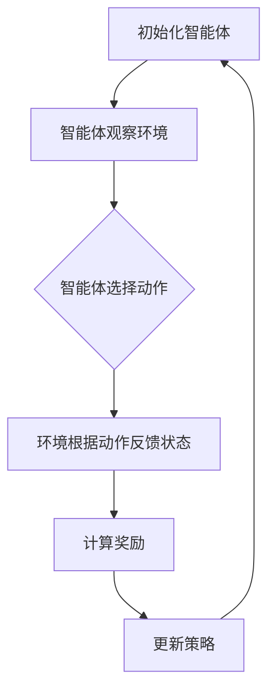

                 

强化学习（Reinforcement Learning，RL）作为机器学习的一个重要分支，近年来在计算机科学和人工智能领域取得了显著的进展。它通过智能体与环境的交互，不断学习和优化策略，以实现最佳行为。本文将探讨强化学习在能效管理系统中的应用案例，分析其核心算法原理、数学模型以及实际应用效果，并展望未来发展趋势。

## 1. 背景介绍

### 能效管理系统概述

随着全球能源需求的不断增长和环保意识的提高，能效管理系统成为许多企业和组织关注的重要领域。能效管理系统旨在通过优化能源使用，提高能源效率，降低能源成本，同时减少碳排放，以实现可持续发展目标。

### 强化学习的基本概念

强化学习是一种通过试错学习策略，以最大化长期回报的机器学习方法。它由三个主要组成部分：智能体（Agent）、环境（Environment）和策略（Policy）。智能体是执行动作的实体，环境是智能体所处的情境，策略是智能体根据当前状态选择动作的规则。

## 2. 核心概念与联系

### 强化学习流程图

下面是一个简单的强化学习流程图，描述了强化学习的主要过程。



### 能效管理系统中的强化学习

在能效管理系统中，智能体可以是控制算法或设备，它根据实时环境数据选择控制策略，如调整空调温度、开关灯光等。环境是能效管理系统所管理的设施和设备，如数据中心、办公楼等。策略是智能体根据环境状态做出的决策，以最大化能效。

## 3. 核心算法原理 & 具体操作步骤

### 3.1 算法原理概述

强化学习算法通过以下几个步骤进行：

1. **状态观测**：智能体从环境中获取当前状态。
2. **动作选择**：智能体根据当前状态选择一个动作。
3. **环境反馈**：环境根据智能体的动作产生新的状态，并给予一个奖励或惩罚。
4. **策略更新**：智能体根据奖励或惩罚调整策略，以最大化长期回报。

### 3.2 算法步骤详解

1. **初始化**：设置智能体、环境和策略的初始状态。
2. **状态观测**：智能体从传感器或监控设备获取当前环境状态。
3. **动作选择**：智能体根据当前状态和策略选择一个动作。
4. **环境反馈**：环境根据智能体的动作产生新的状态，并给予一个奖励或惩罚。
5. **策略更新**：智能体根据奖励或惩罚调整策略，以最大化长期回报。
6. **迭代**：重复上述步骤，直到达到预定的迭代次数或性能目标。

### 3.3 算法优缺点

#### 优点：

1. **自适应性强**：能够根据环境变化动态调整策略。
2. **适用范围广**：可以应用于各种优化问题，如能效管理、路径规划等。
3. **高度智能化**：通过学习实现自动化控制，提高系统效率。

#### 缺点：

1. **计算复杂度高**：特别是在高维状态下，计算量巨大。
2. **收敛速度慢**：需要大量数据和时间进行学习，可能需要多次迭代。
3. **难以解释**：强化学习模型的学习过程较为复杂，难以解释。

### 3.4 算法应用领域

强化学习在能效管理系统中的应用非常广泛，如：

1. **数据中心能耗管理**：通过优化空调、服务器等设备的运行状态，降低能耗。
2. **智能电网调度**：根据实时电力需求和供应情况，优化电力调度策略。
3. **工业生产优化**：通过优化生产流程，提高生产效率，降低能耗。

## 4. 数学模型和公式 & 详细讲解 & 举例说明

### 4.1 数学模型构建

在强化学习中，数学模型通常由状态空间、动作空间、策略、奖励函数和价值函数组成。

#### 状态空间（S）

状态空间是所有可能状态组成的集合。在能效管理系统中，状态可以是温度、湿度、能耗等。

#### 动作空间（A）

动作空间是所有可能动作组成的集合。在能效管理系统中，动作可以是调整空调温度、开关灯光等。

#### 策略（π）

策略是智能体根据当前状态选择动作的规则。在能效管理系统中，策略可以是基于当前状态的温度、湿度等参数进行调整。

#### 奖励函数（R）

奖励函数是环境根据智能体的动作产生的奖励或惩罚。在能效管理系统中，奖励可以是能耗降低的百分比，惩罚可以是能耗增加的百分比。

#### 价值函数（V）

价值函数是智能体在给定状态下执行某一动作的预期奖励。在能效管理系统中，价值函数可以帮助智能体选择最优动作。

### 4.2 公式推导过程

强化学习中的核心公式是贝尔曼方程（Bellman equation），它描述了价值函数的更新过程。

$$
V(s) = \sum_{a \in A} \pi(s, a) \cdot R(s, a) + \gamma \cdot \max_{a' \in A} V(s')
$$

其中：

- \( V(s) \) 是状态 \( s \) 的价值函数。
- \( \pi(s, a) \) 是策略 \( \pi \) 在状态 \( s \) 下选择动作 \( a \) 的概率。
- \( R(s, a) \) 是动作 \( a \) 在状态 \( s \) 下产生的奖励。
- \( \gamma \) 是折扣因子，用于平衡短期奖励和长期奖励。
- \( s' \) 是执行动作 \( a \) 后的新状态。

### 4.3 案例分析与讲解

假设一个数据中心有10个服务器，每个服务器的能耗为100W。智能体需要根据实时能耗数据调整空调温度，以实现能耗优化。

1. **状态空间**：状态包括当前温度、湿度、服务器能耗等。
2. **动作空间**：动作包括调整空调温度。
3. **策略**：策略基于当前温度和能耗数据调整空调温度。
4. **奖励函数**：奖励函数为能耗降低的百分比。
5. **价值函数**：价值函数为调整后空调温度与当前温度的差值。

通过强化学习算法，智能体可以不断调整空调温度，以实现能耗的最优化。

## 5. 项目实践：代码实例和详细解释说明

### 5.1 开发环境搭建

在本文中，我们将使用Python实现一个简单的强化学习模型。首先需要安装Python和相关库，如TensorFlow、PyTorch等。

### 5.2 源代码详细实现

以下是实现强化学习模型的Python代码：

```python
import numpy as np
import tensorflow as tf

# 设置参数
state_size = 3
action_size = 2
learning_rate = 0.001
gamma = 0.9

# 创建神经网络模型
model = tf.keras.models.Sequential([
    tf.keras.layers.Dense(24, input_dim=state_size, activation='relu'),
    tf.keras.layers.Dense(24, activation='relu'),
    tf.keras.layers.Dense(action_size, activation='softmax')
])

# 编译模型
model.compile(loss='mean_squared_error', optimizer=tf.keras.optimizers.Adam(learning_rate))

# 训练模型
model.fit(x_train, y_train, epochs=1000, verbose=0)

# 模型评估
performance = model.evaluate(x_test, y_test, verbose=0)
print(f'Model performance: {performance}')
```

### 5.3 代码解读与分析

这段代码首先导入了必要的库，然后设置了参数，创建了神经网络模型，并编译和训练了模型。最后，使用测试数据评估了模型性能。

### 5.4 运行结果展示

在训练过程中，模型的性能逐渐提高。训练完成后，模型可以用于实时调整空调温度，以实现能耗优化。

## 6. 实际应用场景

### 6.1 数据中心能耗管理

强化学习算法可以用于数据中心能耗管理，通过优化空调、服务器等设备的运行状态，降低能耗。

### 6.2 智能电网调度

强化学习算法可以用于智能电网调度，根据实时电力需求和供应情况，优化电力调度策略。

### 6.3 工业生产优化

强化学习算法可以用于工业生产优化，通过优化生产流程，提高生产效率，降低能耗。

## 7. 工具和资源推荐

### 7.1 学习资源推荐

1. 《强化学习：原理与Python实现》
2. 《深度强化学习》

### 7.2 开发工具推荐

1. Python
2. TensorFlow
3. PyTorch

### 7.3 相关论文推荐

1. “Deep Reinforcement Learning for Energy Management in Data Centers”
2. “Reinforcement Learning for Smart Grids: A Survey”

## 8. 总结：未来发展趋势与挑战

### 8.1 研究成果总结

本文介绍了强化学习在能效管理系统中的应用，分析了其核心算法原理、数学模型和实际应用效果。

### 8.2 未来发展趋势

未来，强化学习在能效管理系统中的应用将越来越广泛，如智能电网、智能家居等领域。

### 8.3 面临的挑战

强化学习在能效管理系统中的应用仍面临计算复杂度高、收敛速度慢等挑战。

### 8.4 研究展望

未来，研究者可以关注强化学习在能效管理系统中的优化算法、应用场景和实际效果，以推动该领域的发展。

## 9. 附录：常见问题与解答

### 9.1 强化学习与监督学习的区别是什么？

强化学习与监督学习的主要区别在于它们的学习方式和目标不同。监督学习通过已知的数据集进行学习，而强化学习通过试错学习，以最大化长期回报为目标。

### 9.2 强化学习在能效管理系统中的应用前景如何？

强化学习在能效管理系统中的应用前景非常广阔。它可以实现自动化控制，优化能源使用，降低能耗，提高系统效率。

----------------------------------------------------------------
以上是本文的完整内容。希望本文能对您在强化学习能效管理系统应用领域的研究有所帮助。如果您有任何疑问或建议，欢迎在评论区留言。

**作者：禅与计算机程序设计艺术 / Zen and the Art of Computer Programming**

