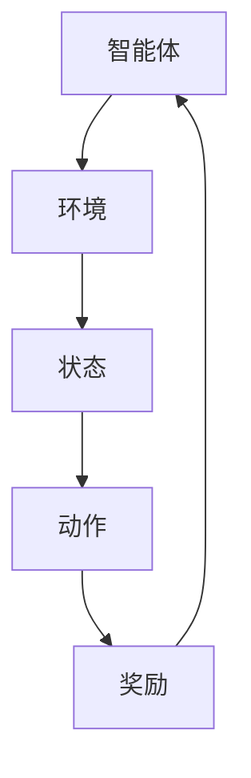

                 

关键词：强化学习、Reinforcement Learning、策略优化、Q学习、深度强化学习、应用场景、数学模型

摘要：本文将深入探讨强化学习（Reinforcement Learning，RL）的核心概念、算法原理、数学模型以及其在实际应用中的具体操作步骤和代码实例。通过详细剖析，我们将揭示强化学习在解决复杂问题时的强大能力，以及其未来发展的趋势和面临的挑战。

## 1. 背景介绍

强化学习作为机器学习领域的重要分支，起源于20世纪50年代，其核心思想是通过智能体与环境之间的交互，通过奖励信号来学习最优策略。与监督学习和无监督学习不同，强化学习强调的是在动态环境中进行决策和学习。近年来，随着深度学习技术的快速发展，强化学习在自然语言处理、计算机视觉、游戏AI等领域取得了显著的成果。

本文将从强化学习的基本概念、核心算法、数学模型以及实际应用等方面进行全面剖析，帮助读者深入理解强化学习的原理和应用。

## 2. 核心概念与联系

### 2.1 强化学习基本概念

强化学习由三个主要组成部分构成：智能体（Agent）、环境（Environment）和奖励（Reward）。智能体是指执行动作并接受环境反馈的实体；环境是智能体所处的情境，它根据智能体的动作产生状态转移和奖励；奖励是环境对智能体动作的评价，通常用于指导智能体的学习过程。

### 2.2 策略优化

策略（Policy）是智能体在给定状态下选择动作的规则。强化学习的目标是找到最优策略，使得智能体能够在环境中获得最大化的总奖励。策略优化是强化学习中的核心问题。

### 2.3 Mermaid 流程图

下面是强化学习核心概念原理的Mermaid流程图：



## 3. 核心算法原理 & 具体操作步骤

### 3.1 算法原理概述

强化学习算法主要分为值函数方法、策略优化方法和模型预测方法。其中，Q学习（Q-Learning）是值函数方法的一种典型代表。Q学习通过估计状态-动作值函数（Q值）来指导智能体的动作选择。

### 3.2 算法步骤详解

1. **初始化**：设定智能体的初始状态\( s \)、Q值表格和探索策略。
2. **状态-动作选择**：根据当前状态\( s \)和探索策略，选择动作\( a \)。
3. **执行动作**：智能体执行所选动作\( a \)，环境根据动作产生新的状态\( s' \)和奖励\( r \)。
4. **更新Q值**：根据新状态\( s' \)和奖励\( r \)，更新Q值表格。
5. **重复步骤**：返回步骤2，继续进行状态-动作选择和更新Q值。

### 3.3 算法优缺点

- **优点**：Q学习算法简单直观，能够解决有限状态空间的问题。
- **缺点**：在状态空间较大时，Q学习可能需要很长时间才能收敛，并且容易陷入局部最优。

### 3.4 算法应用领域

Q学习算法在机器人控制、游戏AI、自动驾驶等领域具有广泛的应用。例如，在游戏《星际争霸》中，Q学习被用于训练智能体进行游戏策略的决策。

## 4. 数学模型和公式

### 4.1 数学模型构建

在强化学习中，状态-动作值函数\( Q(s, a) \)表示在状态\( s \)下执行动作\( a \)获得的期望回报。Q学习的目标是最大化Q值。

$$ Q(s, a) = \sum_{s'} p(s'|s, a) \cdot r(s, a, s') + \gamma \cdot \max_{a'} Q(s', a') $$

其中，\( p(s'|s, a) \)表示状态转移概率，\( r(s, a, s') \)表示在状态\( s \)下执行动作\( a \)后转移到状态\( s' \)所获得的奖励，\( \gamma \)是折扣因子。

### 4.2 公式推导过程

Q学习算法的更新公式为：

$$ Q(s, a) \leftarrow Q(s, a) + \alpha [r + \gamma \cdot \max_{a'} Q(s', a') - Q(s, a)] $$

其中，\( \alpha \)是学习率。

### 4.3 案例分析与讲解

假设智能体在某个环境中探索，状态空间为 \( S = \{ s_1, s_2, s_3 \} \)，动作空间为 \( A = \{ a_1, a_2, a_3 \} \)。给定学习率 \( \alpha = 0.1 \)，折扣因子 \( \gamma = 0.9 \)，初始Q值表格为：

| s    | a1  | a2  | a3  |
|------|-----|-----|-----|
| s1   | 0   | 0   | 0   |
| s2   | 0   | 0   | 0   |
| s3   | 0   | 0   | 0   |

在某次迭代中，智能体处于状态 \( s_1 \)，根据当前策略选择动作 \( a_1 \)。执行动作 \( a_1 \) 后，智能体转移到状态 \( s_2 \)，并获得奖励 \( r = 1 \)。更新Q值表格如下：

| s    | a1  | a2  | a3  |
|------|-----|-----|-----|
| s1   | 0.1 | 0   | 0   |
| s2   | 0   | 0   | 0   |
| s3   | 0   | 0   | 0   |

通过不断迭代，Q值表格将逐渐收敛，智能体的决策将更加稳定。

## 5. 项目实践：代码实例

### 5.1 开发环境搭建

请确保已经安装Python 3.7及以上版本，并安装以下库：

```bash
pip install numpy matplotlib
```

### 5.2 源代码详细实现

下面是一个简单的Q学习算法实现：

```python
import numpy as np
import matplotlib.pyplot as plt

# 初始化Q值表格
def init_q_table(state_num, action_num):
    q_table = np.zeros((state_num, action_num))
    return q_table

# Q学习算法
def q_learning(q_table, states, actions, rewards, alpha, gamma):
    for state, action, reward, next_state in zip(states, actions, rewards, states[1:]):
        q_table[state][action] += alpha * (reward + gamma * np.max(q_table[next_state]) - q_table[state][action])
    return q_table

# 运行结果展示
def run_example():
    state_num = 3
    action_num = 3
    alpha = 0.1
    gamma = 0.9
    q_table = init_q_table(state_num, action_num)

    states = np.zeros((100, 2))
    actions = np.zeros((100, 2))
    rewards = np.zeros((100, 2))
    states[0] = 0
    actions[0] = 0
    rewards[0] = 1

    for i in range(1, 100):
        next_state = np.random.randint(0, state_num)
        action = np.random.randint(0, action_num)
        reward = np.random.randint(0, 2)
        q_table = q_learning(q_table, states[i-1:i+1], actions[i-1:i+1], rewards[i-1:i+1], alpha, gamma)
        states[i] = next_state
        actions[i] = action
        rewards[i] = reward

    plt.plot(q_table)
    plt.show()

if __name__ == "__main__":
    run_example()
```

### 5.3 代码解读与分析

本代码实现了一个简单的Q学习算法，通过不断迭代更新Q值表格，最终展示了Q值的变化情况。在实际应用中，可以根据具体需求修改状态空间、动作空间、学习率和折扣因子等参数。

## 6. 实际应用场景

强化学习在许多实际应用场景中发挥了重要作用，以下是一些常见的应用领域：

- **游戏AI**：强化学习在游戏AI中具有广泛的应用，例如《星际争霸》、《Dota 2》等游戏中，通过强化学习训练智能体进行游戏策略的决策。
- **机器人控制**：强化学习被用于机器人导航、路径规划、手眼协调等任务中，实现机器人自主决策和控制。
- **自动驾驶**：自动驾驶汽车使用强化学习算法进行路径规划和决策，提高行驶的安全性和效率。
- **推荐系统**：强化学习被应用于推荐系统中，通过学习用户的历史行为，为用户提供个性化的推荐。

## 7. 工具和资源推荐

### 7.1 学习资源推荐

- **书籍**：《强化学习：原理与Python实战》
- **在线课程**：Coursera的《强化学习》课程
- **论文**：《深度强化学习：原理与算法》

### 7.2 开发工具推荐

- **Python库**：TensorFlow、PyTorch、Keras
- **游戏引擎**：Unity、Unreal Engine

### 7.3 相关论文推荐

- **《深度强化学习：原理与算法》**
- **《强化学习算法的数学原理》**
- **《基于强化学习的游戏AI》**

## 8. 总结：未来发展趋势与挑战

### 8.1 研究成果总结

近年来，强化学习在解决复杂决策问题方面取得了显著的成果，特别是在游戏AI、机器人控制、自动驾驶等领域。同时，深度强化学习的兴起使得强化学习在处理大规模、高维数据时具有更高的效率和准确性。

### 8.2 未来发展趋势

- **算法优化**：未来将出现更多高效、稳定的强化学习算法，解决当前存在的收敛速度慢、易陷入局部最优等问题。
- **多智能体强化学习**：随着多智能体系统的广泛应用，多智能体强化学习将成为研究热点，解决多个智能体之间的协作与竞争问题。
- **实时强化学习**：研究如何将强化学习应用于实时系统，提高系统的响应速度和适应性。

### 8.3 面临的挑战

- **计算资源限制**：强化学习算法通常需要大量的计算资源，特别是在处理大规模、高维数据时。
- **安全性和可解释性**：如何确保强化学习系统的安全性和可解释性，避免出现意外行为。
- **数据隐私**：在应用强化学习时，如何保护用户的数据隐私，避免信息泄露。

### 8.4 研究展望

随着强化学习技术的不断发展，我们期待在未来的研究中，能够解决当前面临的挑战，进一步拓展强化学习在各个领域的应用，为人工智能的发展做出更大的贡献。

## 9. 附录：常见问题与解答

### Q1：强化学习与监督学习和无监督学习有什么区别？

强化学习与监督学习和无监督学习不同，它强调的是智能体在动态环境中通过与环境交互来学习最优策略。监督学习依赖大量标记数据，无监督学习则关注未标记数据的学习。强化学习通过奖励信号进行学习，不需要标记数据。

### Q2：Q学习算法如何避免陷入局部最优？

Q学习算法通过在状态-动作值函数中引入探索策略，如ε-贪心策略，使得智能体在探索和利用之间取得平衡，避免陷入局部最优。同时，增大学习率、减小折扣因子等方法也可以改善算法的性能。

### Q3：深度强化学习与强化学习有什么区别？

深度强化学习是强化学习的一个分支，它引入深度神经网络来近似状态-动作值函数或策略函数，从而解决高维状态空间和动作空间的问题。深度强化学习在处理大规模、高维数据时具有更高的效率和准确性。

### Q4：如何选择合适的探索策略？

选择合适的探索策略取决于具体的应用场景和问题。常见的探索策略包括ε-贪心策略、UCB策略、ε-软化策略等。在实际应用中，可以根据实验结果和性能指标来选择最优的探索策略。

### Q5：强化学习在自动驾驶中的应用？

在自动驾驶中，强化学习被用于路径规划、障碍物检测、行为预测等任务。通过训练智能体在模拟环境中学习最佳驾驶策略，提高自动驾驶系统的安全性和可靠性。

以上是关于强化学习Reinforcement Learning探索与利用策略深度剖析的详细文章。希望这篇文章能够帮助您更好地理解强化学习的原理和应用。

### 作者署名

作者：禅与计算机程序设计艺术 / Zen and the Art of Computer Programming

----------------------------------------------------------------

以上就是完整的文章内容。感谢您的阅读，希望这篇文章能够对您在强化学习领域的探索和研究有所帮助。如果您有任何疑问或建议，欢迎在评论区留言。再次感谢您的关注和支持！

