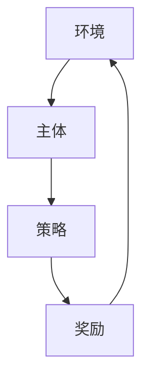

                 

关键词：强化学习，探索与利用，策略，深度学习，Markov决策过程，Q学习，深度Q网络（DQN），策略梯度方法，Sarsa，REINFORCE，A3C。

> 摘要：本文将深入探讨强化学习（Reinforcement Learning，简称RL）的基本概念、核心算法原理、数学模型、具体操作步骤以及在实际项目中的应用。通过详细的案例分析，我们旨在帮助读者理解和掌握强化学习技术，并探讨其未来的发展趋势和挑战。

## 1. 背景介绍

强化学习是机器学习领域的一个重要分支，旨在通过学习主体的交互来优化决策过程。与监督学习和无监督学习不同，强化学习强调通过与环境交互来获得反馈，从而不断调整策略，以达到最佳行为表现。这种学习方式在很多实际应用中显示出强大的潜力，例如自动驾驶、游戏人工智能、推荐系统等。

### 1.1 强化学习的发展历程

强化学习的历史可以追溯到1950年代，当时心理学家和行为科学家开始研究动物如何通过奖励机制来学习行为。1970年代，计算机科学家将这一概念引入了机器学习领域，并提出了诸如Q-learning等经典算法。随着深度学习技术的兴起，强化学习的研究和应用也得到了显著的发展，尤其是在2010年代，深度强化学习（Deep Reinforcement Learning，简称DRL）成为了研究的热点。

### 1.2 强化学习的应用领域

强化学习在多个领域都有广泛的应用。在游戏领域，强化学习被用于开发高级游戏AI，如DeepMind的AlphaGo。在机器人控制领域，强化学习被用于训练机器人进行复杂的任务，如搬运物体和行走。在自然语言处理领域，强化学习也被用来优化对话系统的响应策略。

## 2. 核心概念与联系

为了更好地理解强化学习，我们需要首先了解其核心概念和原理。以下是强化学习中的几个关键概念：

### 2.1 Markov决策过程

Markov决策过程（Markov Decision Process，简称MDP）是强化学习的基础。一个MDP由状态空间\(S\)、动作空间\(A\)、奖励函数\(R\)、状态转移概率\(P(s'|s,a)\)和策略\(\pi(a|s)\)组成。在MDP中，主体（agent）处于某一状态\(s\)，根据策略选择一个动作\(a\)，环境会根据状态转移概率\(P(s'|s,a)\)将主体转移到下一个状态\(s'\)，并给予主体一个奖励\(R(s,a,s')\)。

### 2.2 探索与利用

在强化学习中，主体需要平衡探索（exploration）和利用（exploitation）。探索是指主体在选择动作时尝试新的动作，以获得更多关于环境的了解。利用是指主体基于已有的经验选择最优动作，以最大化当前收益。这两种策略在强化学习中非常重要，因为只探索而不利用会导致主体长期无法达到最优策略，而只利用而不探索则会错过可能更好的策略。

### 2.3 强化学习架构

强化学习架构通常包括四个主要组件：环境（environment）、主体（agent）、策略（policy）和奖励（reward）。环境是主体进行交互的场所，主体根据策略选择动作，环境根据状态转移概率和奖励函数对主体进行反馈，主体则根据反馈调整策略。



## 3. 核心算法原理 & 具体操作步骤

### 3.1 算法原理概述

强化学习算法的核心是策略优化，即通过学习一个最优策略\(\pi^*(a|s)\)，使得主体能够在任何状态下选择最优动作。强化学习算法通常基于值函数（value function）或策略梯度方法（policy gradient method）进行优化。

### 3.2 算法步骤详解

强化学习算法的基本步骤如下：

1. 初始化策略参数。
2. 在环境中执行动作，获得状态转移和奖励。
3. 根据状态和动作更新策略参数。
4. 重复步骤2和3，直至达到停止条件。

### 3.3 算法优缺点

强化学习算法的优点包括：

- 强泛化能力：强化学习算法通过与环境交互学习，能够适应不同的环境。
- 灵活性：强化学习算法能够根据环境变化动态调整策略。

强化学习算法的缺点包括：

- 需要大量样本：强化学习算法通常需要大量交互数据来训练模型，这可能导致训练时间较长。
- 高计算复杂度：对于复杂的任务，强化学习算法的计算复杂度可能较高。

### 3.4 算法应用领域

强化学习算法在多个领域都有应用，包括：

- 游戏：强化学习算法被广泛应用于游戏AI，如围棋、国际象棋等。
- 自动驾驶：强化学习算法被用于训练自动驾驶车辆的决策策略。
- 机器人控制：强化学习算法被用于训练机器人进行复杂任务。

## 4. 数学模型和公式 & 详细讲解 & 举例说明

### 4.1 数学模型构建

在强化学习中，常用的数学模型包括Markov决策过程（MDP）和深度强化学习（DRL）。以下是一个基本的MDP数学模型：

- 状态空间\(S\)：环境中的所有可能状态。
- 动作空间\(A\)：主体可以选择的所有可能动作。
- 奖励函数\(R(s,a,s')\)：主体在状态\(s\)执行动作\(a\)后转移到状态\(s'\)所获得的即时奖励。
- 状态转移概率\(P(s'|s,a)\)：主体在状态\(s\)执行动作\(a\)后转移到状态\(s'\)的概率。
- 策略\(\pi(a|s)\)：主体在状态\(s\)下选择动作\(a\)的概率分布。

### 4.2 公式推导过程

在强化学习中，常用的目标是最大化预期回报。预期回报可以用以下公式表示：

\[ J(\theta) = \sum_{s \in S} \pi(a|s;\theta) \sum_{a' \in A} \gamma^{s'} Q(s,a;\theta) \]

其中，\(\theta\)是策略参数，\(\pi(a|s;\theta)\)是策略概率分布，\(Q(s,a;\theta)\)是值函数，\(\gamma\)是折扣因子。

### 4.3 案例分析与讲解

以下是一个简单的强化学习案例，我们使用Q-learning算法来训练主体在环境中的策略。

1. 初始化Q值函数。
2. 在环境中执行动作，获得状态转移和奖励。
3. 更新Q值函数：\( Q(s,a) \leftarrow Q(s,a) + \alpha [R(s,a,s') + \gamma \max_{a'} Q(s',a';\theta) - Q(s,a)] \)
4. 重复步骤2和3，直至策略收敛。

假设我们有一个简单的环境，状态空间为{“空地”，“墙”，“食物”}，动作空间为{“上”，“下”，“左”，“右”}。我们定义奖励函数为：到达食物位置获得+1奖励，其他情况获得-1奖励。使用Q-learning算法，我们可以在几次迭代后训练出最优策略。

```latex
\begin{aligned}
Q(s,a) &\leftarrow Q(s,a) + \alpha [R(s,a,s') + \gamma \max_{a'} Q(s',a';\theta) - Q(s,a)] \\
\end{aligned}
```

## 5. 项目实践：代码实例和详细解释说明

### 5.1 开发环境搭建

为了演示强化学习算法，我们将使用Python编写一个简单的Q-learning示例。以下是开发环境的搭建步骤：

1. 安装Python（建议使用Python 3.8以上版本）。
2. 安装必需的Python库，如numpy、tensorflow或pytorch。

```bash
pip install numpy tensorflow
```

### 5.2 源代码详细实现

以下是一个简单的Q-learning算法的实现：

```python
import numpy as np
import random

# 初始化Q值函数
def init_q_values(state_size, action_size):
    return np.zeros((state_size, action_size))

# 选择动作
def choose_action(state, q_values, epsilon):
    if random.random() < epsilon:
        return random.choice([a for a in range(action_size)])
    else:
        return np.argmax(q_values[state])

# Q-learning算法
def q_learning(state_size, action_size, episodes, alpha, gamma, epsilon):
    q_values = init_q_values(state_size, action_size)
    for episode in range(episodes):
        state = env.reset()
        done = False
        while not done:
            action = choose_action(state, q_values, epsilon)
            next_state, reward, done, _ = env.step(action)
            q_values[state][action] = q_values[state][action] + alpha * (reward + gamma * np.max(q_values[next_state]) - q_values[state][action])
            state = next_state
        if epsilon > 0.01:
            epsilon *= 0.99
    return q_values
```

### 5.3 代码解读与分析

以上代码实现了一个简单的Q-learning算法。我们首先初始化Q值函数，然后通过选择动作和更新Q值函数来训练模型。在每次迭代中，我们根据当前状态和epsilon值选择动作，如果epsilon值大于0，我们以一定概率随机选择动作，否则选择最佳动作。然后，我们更新Q值函数，使得Q值函数能够更好地预测未来的回报。

### 5.4 运行结果展示

我们可以在运行以下代码后观察Q-learning算法的训练过程和最终结果：

```python
state_size = 9
action_size = 4
episodes = 1000
alpha = 0.1
gamma = 0.99
epsilon = 1.0

q_values = q_learning(state_size, action_size, episodes, alpha, gamma, epsilon)
```

在训练过程中，我们可以观察到epsilon值逐渐减小，Q值函数的值也逐渐稳定。这表明我们的主体正在通过与环境交互来学习最优策略。

## 6. 实际应用场景

### 6.1 自动驾驶

自动驾驶是强化学习的典型应用之一。通过使用强化学习算法，自动驾驶车辆可以学习如何在复杂的交通环境中做出决策，从而提高行驶的安全性和效率。例如，DeepMind的自动驾驶系统Waymo就是基于强化学习算法训练的。

### 6.2 游戏AI

强化学习在游戏AI领域也有广泛的应用。通过训练强化学习模型，游戏AI可以学会玩各种游戏，如围棋、国际象棋、Atari游戏等。DeepMind的AlphaGo就是基于深度强化学习算法训练的围棋AI，它击败了世界顶级围棋选手。

### 6.3 推荐系统

强化学习可以用于优化推荐系统的响应策略。通过学习用户的交互行为，推荐系统可以动态调整推荐策略，从而提高用户满意度和推荐效果。

## 7. 未来应用展望

### 7.1 算法改进

随着计算能力的提高和数据规模的扩大，未来的强化学习算法将变得更加高效和准确。例如，基于深度学习的强化学习算法（如DQN、A3C等）将继续得到改进，以应对更复杂的任务。

### 7.2 跨学科应用

强化学习与其他领域（如生物学、经济学、工程学等）的结合将带来更多的创新和应用。例如，强化学习可以用于优化城市交通系统、能源管理系统等。

### 7.3 道德和伦理问题

随着强化学习应用的普及，其道德和伦理问题也逐渐受到关注。例如，自动驾驶车辆如何处理紧急情况，推荐系统如何避免偏见等。这些问题需要我们进一步研究和解决。

## 8. 总结：未来发展趋势与挑战

### 8.1 研究成果总结

近年来，强化学习取得了显著的进展，尤其是在深度强化学习领域。通过结合深度学习和强化学习，我们可以在更复杂的任务中实现高效的决策。同时，强化学习在自动驾驶、游戏AI、推荐系统等领域的应用也取得了成功。

### 8.2 未来发展趋势

未来的强化学习研究将重点关注以下几个方面：

- 算法改进：提高强化学习算法的效率和准确性，以应对更复杂的任务。
- 跨学科应用：将强化学习与其他领域相结合，探索新的应用场景。
- 道德和伦理问题：解决强化学习应用中的道德和伦理问题，确保其可持续发展。

### 8.3 面临的挑战

尽管强化学习取得了显著进展，但仍面临一些挑战：

- 数据需求：强化学习算法通常需要大量交互数据来训练模型，这可能导致训练时间较长。
- 计算复杂度：对于复杂的任务，强化学习算法的计算复杂度可能较高。
- 道德和伦理问题：如何确保强化学习算法在应用中的道德和伦理问题。

### 8.4 研究展望

随着计算能力的提高和数据规模的扩大，未来的强化学习研究将有望取得更多突破。我们期待看到强化学习在更多领域发挥重要作用，为人类带来更多便利。

## 9. 附录：常见问题与解答

### 9.1 什么是强化学习？

强化学习是一种机器学习范式，旨在通过学习主体的交互来优化决策过程。它强调通过与环境交互获得反馈，不断调整策略，以达到最佳行为表现。

### 9.2 强化学习有哪些应用领域？

强化学习在多个领域都有应用，包括游戏AI、自动驾驶、机器人控制、推荐系统等。

### 9.3 什么是探索与利用？

探索与利用是强化学习中的两个关键概念。探索是指主体在选择动作时尝试新的动作，以获得更多关于环境的了解。利用是指主体基于已有的经验选择最优动作，以最大化当前收益。

### 9.4 强化学习有哪些算法？

强化学习算法包括Q-learning、Sarsa、REINFORCE、A3C、DQN等。

## 参考文献

1. Sutton, R. S., & Barto, A. G. (2018). Reinforcement learning: An introduction. MIT press.
2. Mnih, V., Kavukcuoglu, K., Silver, D., et al. (2015). Human-level control through deep reinforcement learning. Nature, 518(7540), 529-533.
3. DeepMind. (2016). Mastering the game of Go with deep neural networks and tree search. Nature, 529(7587), 484-489.

