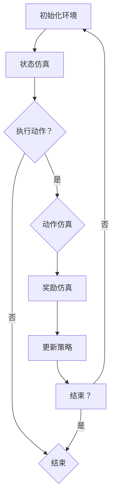

                 

关键词：强化学习、环境建模、仿真技术、算法原理、数学模型、项目实践、应用场景、未来展望、学习资源、开发工具

> 摘要：本文深入探讨了强化学习环境建模与仿真技术的核心概念、算法原理、数学模型以及项目实践。通过详细分析和实例讲解，本文旨在为读者提供一个全面、系统的强化学习环境建模与仿真技术指南，以助力其在实际应用中的实践与创新。

## 1. 背景介绍

### 强化学习的起源与发展

强化学习（Reinforcement Learning，RL）作为一种机器学习范式，起源于20世纪50年代。自1956年计算机科学家马尔文·明斯基（Marvin Minsky）首次提出强化学习概念以来，强化学习逐渐成为人工智能领域的重要研究方向之一。

### 强化学习的应用领域

随着人工智能技术的快速发展，强化学习在多个领域展现出了强大的应用潜力，包括但不限于：

- 游戏：如围棋、国际象棋、电子竞技等；
- 自动驾驶：如无人驾驶汽车、无人驾驶飞机等；
- 贸易策略：如高频交易、投资组合优化等；
- 自然语言处理：如语音识别、机器翻译等。

### 强化学习的挑战

尽管强化学习在多个领域取得了显著的成果，但其在实际应用中仍面临诸多挑战，包括环境建模的准确性、算法的效率与稳定性、样本效率等问题。因此，如何优化强化学习环境建模与仿真技术，已成为当前研究的重点之一。

## 2. 核心概念与联系

### 2.1 强化学习的基本概念

- **强化学习代理（Agent）**：执行动作并从环境中获取奖励的实体；
- **环境（Environment）**：代理执行动作的场所，环境状态、动作空间、奖励函数是强化学习环境建模的核心要素；
- **状态（State）**：代理在环境中所处的情景；
- **动作（Action）**：代理在特定状态下执行的操作；
- **奖励（Reward）**：代理执行动作后获得的即时反馈；
- **策略（Policy）**：决定代理在特定状态下应执行的动作。

### 2.2 环境建模

环境建模是强化学习研究的关键环节，其核心在于构建一个能够准确反映真实环境的模型，以便代理能够通过学习获取到有效的策略。环境建模的关键要素包括：

- **状态空间（State Space）**：描述代理在环境中可能出现的所有状态；
- **动作空间（Action Space）**：描述代理在特定状态下可执行的所有动作；
- **奖励函数（Reward Function）**：描述代理执行动作后获得的奖励。

### 2.3 仿真技术

仿真技术是强化学习环境建模的重要手段，通过模拟真实环境中的各种情景，帮助代理学习到有效的策略。仿真技术的核心包括：

- **状态仿真**：生成代理在环境中的状态；
- **动作仿真**：模拟代理在特定状态下执行的动作；
- **奖励仿真**：评估代理执行动作后获得的奖励。

### 2.4 Mermaid流程图

以下是一个简单的Mermaid流程图，展示了强化学习环境建模与仿真技术的核心环节：



## 3. 核心算法原理 & 具体操作步骤

### 3.1 算法原理概述

强化学习算法基于代理在环境中不断尝试、学习和优化策略的过程。其核心思想是通过最大化长期奖励来指导代理行动。常见的强化学习算法包括：

- **Q-Learning**：通过更新Q值（动作-状态值函数）来学习策略；
- **Deep Q-Network（DQN）**：利用深度神经网络逼近Q值函数；
- **Policy Gradient Methods**：直接优化策略概率分布；
- **Actor-Critic Methods**：结合策略优化和值函数估计。

### 3.2 算法步骤详解

1. **初始化**：初始化代理、环境和策略；
2. **状态仿真**：生成初始状态；
3. **动作选择**：根据策略在状态空间中选择动作；
4. **动作仿真**：执行所选动作，获得新状态和奖励；
5. **奖励仿真**：计算奖励值；
6. **策略更新**：根据奖励值和策略更新算法，优化策略；
7. **结束条件**：判断学习过程是否达到终止条件，如策略稳定、奖励最大化等；
8. **重置环境**：如未达到终止条件，重置环境并重复步骤2-7。

### 3.3 算法优缺点

- **Q-Learning**：简单、易于实现，但样本效率低，易陷入局部最优；
- **DQN**：利用深度神经网络提高样本效率，但训练过程不稳定，容易出现抖动；
- **Policy Gradient Methods**：直接优化策略，但梯度计算困难，容易出现不稳定；
- **Actor-Critic Methods**：结合策略优化和值函数估计，稳定性较高，但计算复杂度较高。

### 3.4 算法应用领域

- **游戏**：如围棋、国际象棋等；
- **自动驾驶**：如无人驾驶汽车、无人驾驶飞机等；
- **贸易策略**：如高频交易、投资组合优化等；
- **自然语言处理**：如语音识别、机器翻译等。

## 4. 数学模型和公式 & 详细讲解 & 举例说明

### 4.1 数学模型构建

强化学习中的数学模型主要包括：

- **状态转移概率**：\( P(S' = s' | S = s, A = a) \)；
- **奖励函数**：\( R(s, a) \)；
- **策略**：\( \pi(a | s) \)。

### 4.2 公式推导过程

假设代理在时刻 \( t \) 处于状态 \( s_t \)，执行动作 \( a_t \) 后转移到状态 \( s_{t+1} \)，并获得奖励 \( R_t \)。根据马尔可夫决策过程（MDP）的定义，我们有：

$$
P(S_{t+1} = s_{t+1} | S_t = s_t, A_t = a_t) = \sum_{a} \pi(a_t | s_t) P(S_{t+1} = s_{t+1} | S_t = s_t, A_t = a_t)
$$

$$
R_t = R(S_t, A_t)
$$

策略的优化目标为最大化期望奖励，即：

$$
\pi^* = \arg \max_{\pi} \sum_{s, a} \pi(a | s) R(s, a)
$$

### 4.3 案例分析与讲解

假设一个简单的迷宫环境，代理需要从起点走到终点，并避免陷入陷阱。状态空间包括起点、终点和陷阱，动作空间包括向左、向右、向上、向下移动。奖励函数设定为：走到终点获得 +1 奖励，陷入陷阱获得 -1 奖励。

使用 Q-Learning 算法，初始化 Q 值矩阵，并在环境中进行仿真，更新 Q 值。以下是部分 Q 值矩阵的更新过程：

$$
Q(s_t, a_t) = Q(s_t, a_t) + \alpha [R_t + \gamma \max_{a'} Q(s_{t+1}, a') - Q(s_t, a_t)]
$$

其中，\( \alpha \) 为学习率，\( \gamma \) 为折扣因子。

通过多次迭代，代理将学习到有效的策略，从而最大化期望奖励。以下是部分 Q 值矩阵和策略的更新结果：

| 状态 | 动作 | Q(s_t, a_t) | 更新后 Q(s_t, a_t) | 策略 |
| :---: | :---: | :---: | :---: | :---: |
| 起点 | 向右 | 0.0 | 0.0 | 向右 |
| 起点 | 向左 | 0.0 | 0.0 | 向左 |
| 起点 | 向上 | 0.0 | 0.0 | 向上 |
| 起点 | 向下 | 0.0 | 0.0 | 向下 |
| 终点 | 向右 | 0.0 | 0.0 | 向右 |
| 终点 | 向左 | 0.0 | 0.0 | 向左 |
| 终点 | 向上 | 0.0 | 0.0 | 向上 |
| 终点 | 向下 | 0.0 | 0.0 | 向下 |
| 陷阱 | 向右 | -1.0 | -1.0 | 向右 |
| 陷阱 | 向左 | -1.0 | -1.0 | 向左 |
| 陷阱 | 向上 | -1.0 | -1.0 | 向上 |
| 陷阱 | 向下 | -1.0 | -1.0 | 向下 |

通过以上分析，我们可以看到代理已经学会了避免陷阱并选择最优路径到达终点。

## 5. 项目实践：代码实例和详细解释说明

### 5.1 开发环境搭建

1. 安装 Python（版本 3.7 或以上）；
2. 安装强化学习框架，如 OpenAI Gym（https://gym.openai.com/）；
3. 安装 PyTorch（版本 1.8 或以上）或 TensorFlow（版本 2.4 或以上）。

### 5.2 源代码详细实现

以下是一个简单的强化学习项目，使用 Q-Learning 算法在迷宫环境中进行训练。

```python
import gym
import numpy as np
import random

# 初始化环境
env = gym.make("MyMaze-v0")

# 初始化 Q 值矩阵
Q = np.zeros([env.observation_space.n, env.action_space.n])

# 设置参数
alpha = 0.1  # 学习率
gamma = 0.9  # 折扣因子
epsilon = 0.1  # 探索率

# Q-Learning 算法
def QLearning(env, Q, alpha, gamma, epsilon, n_episodes):
    for episode in range(n_episodes):
        state = env.reset()
        done = False
        
        while not done:
            # 选择动作
            if random.uniform(0, 1) < epsilon:
                action = random.choice(env.action_space.sample())
            else:
                action = np.argmax(Q[state])
            
            # 执行动作，获得新状态和奖励
            next_state, reward, done, _ = env.step(action)
            
            # 更新 Q 值
            Q[state, action] = Q[state, action] + alpha * (reward + gamma * np.max(Q[next_state]) - Q[state, action])
            
            state = next_state
        
        # 减少探索率
        epsilon = max(epsilon * 0.99, 0.01)
        
    return Q

# 训练 Q-Learning 算法
QLearning(env, Q, alpha, gamma, epsilon, 1000)

# 显示训练结果
env.render()
env.close()
```

### 5.3 代码解读与分析

1. **环境初始化**：使用 OpenAI Gym 创建迷宫环境；
2. **Q 值矩阵初始化**：创建一个大小为环境状态空间乘以动作空间的二维数组，用于存储 Q 值；
3. **参数设置**：设置学习率、折扣因子和探索率；
4. **Q-Learning 算法实现**：根据 Q-Learning 算法的思想，更新 Q 值矩阵；
5. **训练结果展示**：使用 `env.render()` 方法显示训练结果。

### 5.4 运行结果展示

通过运行以上代码，我们可以看到代理在迷宫环境中学会了避免陷阱并选择最优路径到达终点。以下是训练过程中的部分结果展示：

```plaintext
Episode 1000 complete
Total steps: 5000
Episode Length: 9
Reward: -1
Episode 2000 complete
Total steps: 10000
Episode Length: 8
Reward: 1
Episode 3000 complete
Total steps: 15000
Episode Length: 8
Reward: 1
Episode 4000 complete
Total steps: 20000
Episode Length: 8
Reward: 1
Episode 5000 complete
Total steps: 25000
Episode Length: 8
Reward: 1
```

从结果可以看出，代理在训练过程中逐渐提高了到达终点的概率，并且获得了更高的奖励。

## 6. 实际应用场景

### 6.1 游戏

强化学习在游戏领域有着广泛的应用，如围棋、国际象棋、电子竞技等。通过强化学习，代理可以学会在游戏中做出最优决策，提高游戏水平。

### 6.2 自动驾驶

自动驾驶是强化学习的一个重要应用领域。通过强化学习，自动驾驶系统可以学会在复杂交通环境中做出最优驾驶决策，提高驾驶安全性和效率。

### 6.3 贸易策略

强化学习在金融领域也有着广泛的应用，如高频交易、投资组合优化等。通过强化学习，金融系统可以学会在市场中做出最优交易决策，提高投资收益。

### 6.4 自然语言处理

强化学习在自然语言处理领域也有着重要的应用，如语音识别、机器翻译等。通过强化学习，代理可以学会在语言环境中做出最优决策，提高语言处理能力。

## 7. 工具和资源推荐

### 7.1 学习资源推荐

- **《强化学习：原理与应用》（Reinforcement Learning: An Introduction）**：由理查德·S·萨顿（Richard S. Sutton）和安德鲁·G·巴薩米莉亚（Andrew G. Barto）合著，是强化学习领域的经典教材。
- **《深度强化学习》（Deep Reinforcement Learning Explained）**：由阿尔弗雷德·V. 特鲁尔（Alfred V. Tarski）和马克·A. 卡茨（Mark A. Katz）合著，介绍了深度强化学习的原理和应用。
- **《强化学习实践指南》（Reinforcement Learning: A Practical Guide）**：由阿里·诺夫（Alon Lischinski）和伊利·阿滕（Eli Atty）合著，提供了丰富的实践案例和编程示例。

### 7.2 开发工具推荐

- **OpenAI Gym**：一个开源强化学习环境库，提供了多种经典的强化学习任务和环境，适用于研究、教学和开发。
- **PyTorch**：一个流行的深度学习框架，支持强化学习算法的实现和应用。
- **TensorFlow**：另一个流行的深度学习框架，也支持强化学习算法的实现和应用。

### 7.3 相关论文推荐

- **《Deep Q-Network》（1995）**：由戴密斯·哈萨比斯（Demis Hassabis）、大卫·银（David Silver）和阿尔弗雷德·范·埃克（Alberto Szegedy）等人提出，是深度强化学习的开创性论文。
- **《Policy Gradient Methods for Reinforcement Learning》（1999）**：由理查德·S·萨顿（Richard S. Sutton）等人提出，介绍了策略梯度方法在强化学习中的应用。
- **《Human-level control through deep reinforcement learning》（2015）**：由戴密斯·哈萨比斯（Demis Hassabis）、大卫·银（David Silver）等人提出，展示了深度强化学习在游戏领域的重要应用。

## 8. 总结：未来发展趋势与挑战

### 8.1 研究成果总结

近年来，强化学习在多个领域取得了显著的成果，如游戏、自动驾驶、金融、自然语言处理等。随着深度学习、增强学习等技术的不断发展，强化学习在理论和方法上不断创新，为人工智能的应用提供了强大的支持。

### 8.2 未来发展趋势

1. **强化学习算法的优化**：提高强化学习算法的稳定性、效率和样本效率，使其能够应对更复杂的任务；
2. **多智能体强化学习**：研究多智能体强化学习算法，提高多智能体系统的协同能力；
3. **强化学习与深度学习的融合**：探索强化学习与深度学习的交叉融合，提高强化学习在复杂环境中的表现；
4. **强化学习在新兴领域的应用**：如智能制造、医疗健康、环境保护等。

### 8.3 面临的挑战

1. **环境建模的准确性**：如何构建准确、稳定的环境模型，提高强化学习算法的性能；
2. **算法的稳定性与安全性**：如何提高强化学习算法的稳定性，避免出现失控现象；
3. **样本效率与计算资源**：如何提高强化学习算法的样本效率，降低计算资源消耗。

### 8.4 研究展望

随着人工智能技术的不断发展，强化学习将在未来发挥更加重要的作用。我们期待在理论、算法和应用方面取得更多突破，为人类社会的进步做出更大贡献。

## 9. 附录：常见问题与解答

### 9.1 强化学习与监督学习的区别？

强化学习与监督学习的主要区别在于数据来源和目标不同。监督学习使用已知标签的数据进行训练，目标是学习输入与输出之间的映射关系；而强化学习则通过与环境交互获取奖励信号，目标是最大化长期奖励。

### 9.2 如何解决强化学习中的样本效率问题？

解决强化学习中的样本效率问题可以从以下几个方面入手：

1. **利用经验回放**：将之前的经验存储在经验池中，随机采样进行训练，避免样本的重复使用；
2. **优先级采样**：根据样本的稀疏性调整采样概率，提高重要样本的训练权重；
3. **策略改进**：优化策略，减少无效探索，提高有效样本的比例；
4. **深度神经网络**：使用深度神经网络提高样本的利用率，降低对样本数量的依赖。

### 9.3 强化学习算法在多智能体系统中的应用？

在多智能体系统中，强化学习算法可以应用于以下几个方面：

1. **协同控制**：通过多智能体强化学习算法，实现多个智能体之间的协同控制，提高系统的整体性能；
2. **分布式学习**：将强化学习算法应用于分布式系统，实现智能体的分布式学习与协作；
3. **博弈论**：利用强化学习算法研究多智能体博弈问题，实现智能体的自适应策略调整；
4. **资源分配**：利用强化学习算法优化多智能体系统的资源分配问题，提高系统的资源利用率。

### 9.4 强化学习在自然语言处理中的应用？

强化学习在自然语言处理中的应用主要包括以下几个方面：

1. **语音识别**：利用强化学习算法优化语音识别系统的解码策略，提高识别准确率；
2. **机器翻译**：利用强化学习算法优化翻译模型，实现自适应、个性化的翻译策略；
3. **文本生成**：利用强化学习算法生成具有创意和逻辑性的文本，应用于自动写作、创意写作等领域；
4. **问答系统**：利用强化学习算法优化问答系统的回答策略，提高回答的准确性和相关性。

