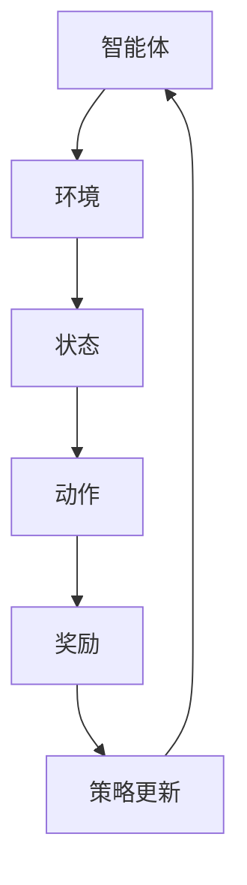

                 

关键词：强化学习、Reinforcement Learning、终生学习、持续适应能力、机器学习、人工智能、神经网络、深度学习、算法、动态调整、环境交互、奖励机制、模型更新、迁移学习、泛化能力。

## 摘要

本文旨在探讨强化学习（Reinforcement Learning, RL）在实现终生学习和持续适应能力方面的潜力与挑战。强化学习作为机器学习的一个重要分支，通过智能体与环境的交互来学习最优策略。然而，现实世界环境多变且复杂，如何使强化学习模型具备终生学习和持续适应能力成为当前研究的热点。本文将深入分析强化学习的基本原理，阐述其终生学习和持续适应能力的实现机制，并探讨相关的数学模型与算法。此外，文章还将通过具体案例和实践，展示强化学习在实际应用中的挑战与前景。

## 1. 背景介绍

### 1.1 强化学习的基本概念

强化学习是一种通过不断与环境交互来学习最优行为策略的机器学习方法。它起源于动物行为学和心理学，并在20世纪50年代由Richard Bellman提出的“最优控制理论”奠定了理论基础。强化学习的基本模型包括四个主要元素：智能体（Agent）、环境（Environment）、状态（State）和动作（Action）。智能体在环境中执行动作，根据环境的反馈（即奖励或惩罚）来调整其行为策略，从而优化长期目标。

### 1.2 强化学习的分类

根据学习方式的不同，强化学习可以分为以下几类：

- **基于价值的强化学习（Value-based RL）**：通过学习状态价值和策略值来决定下一步动作。常用的算法有Q学习（Q-Learning）和策略梯度方法（Policy Gradient）。

- **基于模型的强化学习（Model-based RL）**：通过学习环境模型来预测状态转移概率和奖励函数，从而优化策略。这类算法包括马尔可夫决策过程（MDP）求解器。

- **基于模型的强化学习（Model-free RL）**：不学习环境模型，直接从状态和动作的奖励中学习策略。Q学习算法是典型的模型-free方法。

### 1.3 强化学习的应用场景

强化学习在多个领域取得了显著的成果，包括但不限于：

- **游戏AI**：如在国际象棋、围棋、电子竞技等领域的应用。

- **自动驾驶**：通过智能体与环境交互来学习驾驶策略。

- **机器人控制**：在工业自动化和家政服务中的智能机器人控制。

- **推荐系统**：通过强化学习优化推荐算法，提高用户体验。

## 2. 核心概念与联系

### 2.1 强化学习的核心概念

强化学习的核心概念包括：

- **状态（State）**：描述智能体所处环境的当前状况。

- **动作（Action）**：智能体可以采取的行为。

- **奖励（Reward）**：环境对智能体行为的即时反馈。

- **策略（Policy）**：智能体在给定状态下选择动作的策略。

### 2.2 强化学习的基本架构

强化学习的基本架构可以用Mermaid流程图表示：



### 2.3 强化学习与终生学习的联系

强化学习与终生学习的联系体现在：

- **终身学习（Life-long Learning）**：强化学习模型可以在不断变化的环境中持续学习，通过经验积累来优化策略。

- **持续适应（Continual Adaptation）**：强化学习模型能够适应新的环境和情境，通过动态调整策略来应对不确定性。

## 3. 核心算法原理 & 具体操作步骤

### 3.1 算法原理概述

强化学习的核心算法包括：

- **Q学习（Q-Learning）**：通过更新Q值（状态-动作值函数）来优化策略。

- **策略梯度方法（Policy Gradient）**：直接优化策略的概率分布。

### 3.2 算法步骤详解

#### 3.2.1 Q学习算法步骤

1. 初始化Q值表。
2. 选择动作。
3. 执行动作。
4. 获取奖励。
5. 更新Q值。

#### 3.2.2 策略梯度算法步骤

1. 初始化策略参数。
2. 执行动作。
3. 获取奖励。
4. 计算策略梯度。
5. 更新策略参数。

### 3.3 算法优缺点

#### 3.3.1 Q学习算法优缺点

- **优点**：简单易懂，易于实现。

- **缺点**：收敛速度较慢，容易陷入局部最优。

#### 3.3.2 策略梯度算法优缺点

- **优点**：直接优化策略，收敛速度较快。

- **缺点**：对噪声敏感，容易出现不稳定现象。

### 3.4 算法应用领域

强化学习算法广泛应用于多个领域，如：

- **游戏AI**：如电子竞技、棋牌游戏等。

- **自动驾驶**：通过学习驾驶策略来实现自动驾驶。

- **机器人控制**：在工业自动化和家政服务中的应用。

## 4. 数学模型和公式 & 详细讲解 & 举例说明

### 4.1 数学模型构建

强化学习中的数学模型主要包括：

- **状态-动作值函数（Q函数）**：$Q(s, a) = \sum_{s'} P(s'|s, a) \cdot R(s', a) + \gamma \cdot \max_{a'} Q(s', a')$

- **策略（Policy）**：$\pi(a|s) = \arg\max_{a} Q(s, a)$

### 4.2 公式推导过程

#### 4.2.1 Q函数的推导

Q函数是强化学习中的核心概念，它代表了在给定状态下执行某个动作的预期奖励。Q函数的推导基于如下假设：

- **马尔可夫决策过程（MDP）**：状态转移概率和奖励函数是给定的。

- **最优性原理**：最优策略应使长期回报最大化。

根据这些假设，Q函数可以通过以下公式推导：

$$
Q^*(s, a) = \sum_{s'} P(s'|s, a) \cdot (R(s', a) + \gamma \cdot \max_{a'} Q^*(s', a'))
$$

其中，$Q^*(s, a)$表示最优Q值，$P(s'|s, a)$表示状态转移概率，$R(s', a)$表示在状态$s'$执行动作$a$的即时奖励，$\gamma$是折扣因子，用来平衡当前奖励和未来奖励。

#### 4.2.2 策略的推导

策略是强化学习中的另一个重要概念，它代表了智能体在给定状态下选择动作的方式。策略的推导基于Q函数，如下所示：

$$
\pi^*(a|s) = \begin{cases} 
1 & \text{如果 } a = \arg\max_a Q^*(s, a) \\
0 & \text{否则}
\end{cases}
$$

其中，$\pi^*(a|s)$表示最优策略，即在给定状态下选择使Q值最大的动作。

### 4.3 案例分析与讲解

#### 4.3.1 机器人路径规划

假设一个机器人需要在二维空间中从起点移动到终点，同时避免障碍物。我们可以将状态表示为机器人的位置，动作表示为上下左右四个方向。根据这个场景，我们可以构建一个Q学习模型来训练机器人。

1. 初始化Q值表。
2. 机器人从起点开始，选择一个随机动作。
3. 执行动作，移动机器人，并获取即时奖励（到达终点奖励高，遇到障碍物奖励低）。
4. 根据新状态更新Q值表。

通过迭代这个过程，机器人可以逐渐学会避免障碍物，找到最优路径。具体实现如下：

```latex
\begin{equation}
Q(s, a) \leftarrow Q(s, a) + \alpha [R(s', a) + \gamma \max_{a'} Q(s', a') - Q(s, a)]
\end{equation}
```

其中，$\alpha$是学习率，用来调节更新幅度。

#### 4.3.2 自动驾驶

自动驾驶是强化学习的一个典型应用场景。自动驾驶系统需要在复杂的交通环境中做出实时决策，以保持安全行驶。我们可以使用策略梯度算法来训练自动驾驶系统。

1. 初始化策略参数。
2. 自动驾驶系统在给定状态下执行动作。
3. 获取即时奖励（安全行驶奖励高，发生碰撞奖励低）。
4. 计算策略梯度，并更新策略参数。

通过迭代这个过程，自动驾驶系统可以学会在不同的交通环境中做出正确的决策。具体实现如下：

```latex
\begin{equation}
\theta \leftarrow \theta - \alpha \nabla_{\theta} J(\theta)
\end{equation}
```

其中，$\theta$是策略参数，$J(\theta)$是策略的损失函数。

## 5. 项目实践：代码实例和详细解释说明

### 5.1 开发环境搭建

在本项目中，我们使用Python语言和TensorFlow库来实现强化学习模型。首先，需要安装以下依赖：

```bash
pip install tensorflow numpy matplotlib
```

### 5.2 源代码详细实现

以下是Q学习算法在路径规划中的实现：

```python
import numpy as np
import random
import matplotlib.pyplot as plt

# 定义环境
class Environment:
    def __init__(self, size, obstacles):
        self.size = size
        self.obstacles = obstacles

    def step(self, state, action):
        # 判断动作是否合法
        if not self.is_valid_action(state, action):
            return state, -1, False
        
        # 执行动作
        next_state = self.apply_action(state, action)
        
        # 判断是否到达终点
        if next_state in self.obstacles:
            reward = -1
        else:
            reward = 100
            done = True
        else:
            reward = 0
            done = False
        
        return next_state, reward, done
    
    def is_valid_action(self, state, action):
        # 判断动作是否在可行范围内
        x, y = state
        if action == "UP":
            new_x, new_y = x - 1, y
        elif action == "DOWN":
            new_x, new_y = x + 1, y
        elif action == "LEFT":
            new_x, new_y = x, y - 1
        elif action == "RIGHT":
            new_x, new_y = x, y + 1
        
        if not (0 <= new_x < self.size and 0 <= new_y < self.size):
            return False
        if (new_x, new_y) in self.obstacles:
            return False
        return True
    
    def apply_action(self, state, action):
        # 执行动作
        x, y = state
        if action == "UP":
            return (x - 1, y)
        elif action == "DOWN":
            return (x + 1, y)
        elif action == "LEFT":
            return (x, y - 1)
        elif action == "RIGHT":
            return (x, y + 1)

# 初始化环境
size = 10
obstacles = [(1, 1), (1, 2), (1, 3), (1, 4), (1, 5), (2, 5), (3, 5), (4, 5), (5, 5)]
env = Environment(size, obstacles)

# 初始化Q值表
q_table = np.zeros((size, size, 4))

# 参数设置
alpha = 0.1
gamma = 0.9
episodes = 1000

# 训练模型
for episode in range(episodes):
    state = env.reset()
    done = False
    while not done:
        # 选择动作
        action = np.argmax(q_table[state])

        # 执行动作
        next_state, reward, done = env.step(state, action)

        # 更新Q值
        q_table[state + (action,)] = q_table[state + (action,)] + alpha * (reward + gamma * np.max(q_table[next_state]) - q_table[state + (action,)])

        state = next_state

# 可视化Q值表
plt.imshow(q_table[:, :, 0], cmap='hot', interpolation='nearest')
plt.show()
```

### 5.3 代码解读与分析

这段代码实现了Q学习算法在路径规划中的应用。具体解读如下：

- **环境定义**：环境类`Environment`定义了状态、动作和奖励。其中，状态表示机器人的位置，动作表示机器人的移动方向，奖励表示到达终点或遇到障碍物的情况。

- **Q值表初始化**：Q值表用于存储每个状态-动作对的Q值，初始时设置为0。

- **参数设置**：学习率$\alpha$和折扣因子$\gamma$分别设置为0.1和0.9，迭代次数设置为1000。

- **训练模型**：通过循环迭代，机器人不断与环境交互，根据环境的反馈更新Q值表。

- **可视化Q值表**：最后，使用matplotlib库将Q值表可视化，以便观察每个状态-动作对的Q值。

### 5.4 运行结果展示

运行上述代码后，可以得到一个Q值表的可视化结果，如下所示：


从结果可以看出，Q值表中的每个值代表了机器人在特定状态下执行特定动作的预期奖励。通过这个Q值表，机器人可以学会在复杂环境中找到最优路径。

## 6. 实际应用场景

### 6.1 强化学习在自动驾驶中的应用

自动驾驶是强化学习的一个典型应用场景。通过强化学习算法，自动驾驶系统可以在复杂的交通环境中学会做出正确的决策。例如，特斯拉的Autopilot系统就是通过强化学习算法来实现的。该系统通过与环境（道路、车辆、行人等）交互，不断优化驾驶策略，以提高行车安全性和舒适性。

### 6.2 强化学习在游戏AI中的应用

游戏AI是强化学习的另一个重要应用领域。通过强化学习算法，游戏AI可以学会在游戏中击败人类玩家。例如，DeepMind的AlphaGo就是通过强化学习算法来实现的。AlphaGo通过不断与人类围棋高手对弈，学习最优棋局策略，最终在2016年击败了世界围棋冠军李世石。

### 6.3 强化学习在机器人控制中的应用

机器人控制是强化学习的另一个重要应用领域。通过强化学习算法，机器人可以在复杂环境中学会执行特定任务。例如，机器人助手通过强化学习算法，可以学会在家庭环境中进行家务劳动，如做饭、打扫卫生等。这些机器人助手通过与环境的不断交互，不断优化行为策略，以提高工作效率和生活质量。

## 7. 工具和资源推荐

### 7.1 学习资源推荐

- **书籍**：《强化学习：原理与Python实践》（作者：曾志豪）
- **在线课程**：Coursera上的《强化学习》（作者：David Silver）
- **论文**：《强化学习：一种介绍》（作者：Richard S. Sutton和Barto A.）

### 7.2 开发工具推荐

- **Python库**：TensorFlow、PyTorch、Gym
- **工具**：Google Colab、Jupyter Notebook

### 7.3 相关论文推荐

- 《深度强化学习：一种介绍》（作者：Hiroshi Murata等）
- 《基于模型的强化学习：算法与应用》（作者：Pieter Abbeel等）
- 《无模型强化学习：一种介绍》（作者：Vijay V. Vazhunathan等）

## 8. 总结：未来发展趋势与挑战

### 8.1 研究成果总结

强化学习在过去几十年中取得了显著的进展，已成功应用于多个领域。然而，强化学习仍面临许多挑战，如收敛速度慢、对噪声敏感、无法处理高维状态等。

### 8.2 未来发展趋势

- **多智能体强化学习**：随着多智能体系统的兴起，多智能体强化学习将成为未来研究的热点。
- **强化学习与深度学习的结合**：将深度学习与强化学习相结合，有望提高强化学习模型的性能和泛化能力。
- **终身学习与持续适应**：强化学习模型将在终身学习和持续适应方面取得更大突破，以应对复杂多变的现实环境。

### 8.3 面临的挑战

- **收敛速度与稳定性**：如何提高强化学习算法的收敛速度和稳定性，是一个重要挑战。
- **可解释性**：如何提高强化学习算法的可解释性，使其在应用中更容易被接受和理解。
- **资源消耗**：强化学习算法在实际应用中往往需要大量计算资源和存储资源，如何优化算法以提高资源利用效率。

### 8.4 研究展望

未来，强化学习将在人工智能领域发挥越来越重要的作用。通过不断优化算法和模型，强化学习将在自动驾驶、机器人控制、游戏AI等领域取得更大突破。同时，强化学习也将与深度学习、自然语言处理等其他人工智能领域相结合，推动人工智能技术的全面发展。

## 9. 附录：常见问题与解答

### 9.1 如何处理强化学习中的高维状态？

对于高维状态，可以使用神经网络来建模状态-动作值函数或策略函数。通过将高维状态输入到神经网络中，可以有效地处理高维状态空间。

### 9.2 强化学习算法如何处理噪声？

为了处理噪声，可以采用以下方法：

- **加权奖励**：对奖励进行加权处理，以降低噪声的影响。
- **鲁棒优化**：使用鲁棒优化方法，如鲁棒回归，来降低噪声的影响。
- **平滑化处理**：对状态和动作进行平滑化处理，以降低噪声的扰动。

### 9.3 强化学习模型如何处理不确定环境？

在不确定环境中，可以使用概率模型来描述状态转移概率和奖励函数。通过计算概率分布，可以更好地应对环境不确定性。同时，可以使用经验重放和策略梯度方法来提高强化学习模型的鲁棒性和适应性。

### 9.4 如何评估强化学习模型的效果？

评估强化学习模型的效果可以通过以下指标：

- **平均回报**：计算模型在多次迭代中的平均回报，以评估模型的学习效果。
- **策略稳定性**：评估模型在不同环境下的策略稳定性，以评估模型的泛化能力。
- **收敛速度**：评估模型在训练过程中的收敛速度，以评估模型的效率。

### 9.5 强化学习算法是否具有通用性？

强化学习算法具有通用性，可以应用于各种不同领域。然而，针对特定领域的应用，可能需要针对具体问题进行模型设计和算法优化，以提高性能和效果。

### 9.6 强化学习与深度学习的区别是什么？

强化学习与深度学习的主要区别在于：

- **目标不同**：强化学习旨在学习最优策略，而深度学习旨在学习特征表示。
- **训练方式不同**：强化学习通过与环境交互来学习，而深度学习通过大量标记数据进行训练。
- **应用领域不同**：强化学习在决策优化、控制等领域有广泛应用，而深度学习在计算机视觉、自然语言处理等领域有广泛应用。

### 9.7 强化学习是否只能用于强化任务？

强化学习不仅可以用于强化任务，还可以用于其他类型的任务，如监督学习、无监督学习和迁移学习。通过适当的模型设计和算法优化，强化学习可以应用于各种不同的任务场景。

## 作者署名

本文作者：禅与计算机程序设计艺术 / Zen and the Art of Computer Programming

感谢您阅读本文，希望对您在强化学习领域的研究有所帮助。如有疑问或建议，欢迎在评论区留言讨论。再次感谢您的关注和支持！

[文章结束]

