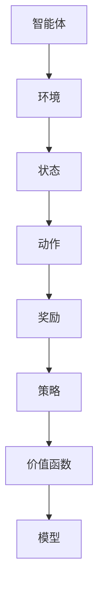

                 

关键词：强化学习，算法稳定性，收敛性，策略梯度，价值函数，马尔可夫决策过程

> 摘要：本文从强化学习的理论基础出发，深入分析了算法的稳定性与收敛性。通过详细探讨策略梯度方法和价值函数方法，本文揭示了它们在实践中的表现和潜在问题。此外，文章还通过数学模型和实际代码实例，阐述了强化学习算法在不同应用场景中的有效性和局限性，为读者提供了对未来发展的展望。

## 1. 背景介绍

强化学习（Reinforcement Learning，RL）是机器学习的一个分支，主要研究如何让智能体（agent）在与环境的交互过程中，通过学习获得最优策略，以达到目标。它被广泛应用于游戏AI、自动驾驶、推荐系统等领域。强化学习的主要特点是无监督学习和决策过程，通过奖励机制和策略迭代，实现智能体与环境之间的互动。

### 强化学习的核心概念

- **智能体（Agent）**：执行动作的主体，可以是机器人、自动驾驶汽车、甚至是虚拟的玩家。
- **环境（Environment）**：智能体所处的环境，可以看作是状态和动作的集合。
- **状态（State）**：描述智能体当前所处的环境。
- **动作（Action）**：智能体可以采取的行为。
- **奖励（Reward）**：智能体在采取特定动作后，从环境中获得的即时反馈。
- **策略（Policy）**：智能体根据当前状态选择动作的规则。
- **价值函数（Value Function）**：预测在特定状态下采取特定策略所能获得的长期奖励。
- **模型（Model）**：描述环境的状态转移概率和奖励机制的数学模型。

### 强化学习的基本任务

强化学习的目标是找到最优策略，使智能体在长期交互过程中获得的累积奖励最大化。这通常通过以下过程实现：

1. **状态初始化**：智能体随机选择初始状态。
2. **策略迭代**：智能体根据当前策略选择动作，并在环境中执行。
3. **奖励反馈**：环境根据智能体的动作给出奖励。
4. **策略更新**：智能体根据奖励反馈调整策略，以提高未来的回报。

## 2. 核心概念与联系

为了更好地理解强化学习算法的稳定性与收敛性，我们首先需要明确几个核心概念及其关系。以下是一个简化的Mermaid流程图，展示了强化学习中的主要概念及其相互关系。



### 2.1 智能体与环境的互动

智能体与环境之间的互动是强化学习的核心。智能体通过感知当前状态，选择一个动作，并在执行动作后获得环境的反馈，这个过程不断重复。智能体的目标是最大化累积奖励。

### 2.2 策略和价值函数

策略和价值函数是强化学习的两个核心概念。策略定义了智能体如何选择动作，而价值函数则估计在特定状态下采取特定策略所能获得的长期奖励。

### 2.3 模型

模型描述了环境的状态转移概率和奖励机制。在模型的基础上，智能体可以通过预测未来的奖励来调整其策略。

## 3. 核心算法原理 & 具体操作步骤

### 3.1 算法原理概述

强化学习算法主要分为策略梯度方法和价值函数方法。策略梯度方法直接优化策略，而价值函数方法则通过优化价值函数来间接影响策略。

### 3.2 算法步骤详解

#### 策略梯度方法

1. **初始化策略参数**：随机初始化策略参数。
2. **执行动作**：根据当前策略选择动作。
3. **收集数据**：记录动作、状态和奖励信息。
4. **策略更新**：根据收集的数据，使用策略梯度更新策略参数。
5. **重复执行**：重复步骤2-4，直到策略收敛。

#### 价值函数方法

1. **初始化价值函数**：随机初始化价值函数。
2. **执行动作**：根据当前策略选择动作。
3. **收集数据**：记录动作、状态和奖励信息。
4. **价值函数更新**：根据收集的数据，使用贝尔曼方程更新价值函数。
5. **策略更新**：使用更新后的价值函数，根据策略迭代算法更新策略。
6. **重复执行**：重复步骤2-5，直到策略收敛。

### 3.3 算法优缺点

#### 策略梯度方法

- **优点**：直接优化策略，收敛速度快。
- **缺点**：对噪声敏感，可能陷入局部最优。

#### 价值函数方法

- **优点**：鲁棒性强，不易陷入局部最优。
- **缺点**：收敛速度慢，需要大量数据。

### 3.4 算法应用领域

强化学习算法在游戏AI、自动驾驶、推荐系统等领域都有广泛的应用。其中，游戏AI领域的应用最为成熟，例如在《星际争霸II》和《Dota2》等游戏中，智能体通过强化学习算法实现了超人类的水平。

## 4. 数学模型和公式 & 详细讲解 & 举例说明

### 4.1 数学模型构建

强化学习中的数学模型主要包括策略梯度和价值函数。以下是一个简化的数学模型：

$$
J(\theta) = \sum_{s \in S} p(s)\sum_{a \in A(s)} \gamma^k r(s, a) \nabla_\theta \log \pi_\theta(a|s)
$$

其中，$J(\theta)$ 是策略梯度函数，$\theta$ 是策略参数，$S$ 是状态空间，$A(s)$ 是在状态 $s$ 下可采取的动作集合，$p(s)$ 是状态概率，$\gamma$ 是折扣因子，$r(s, a)$ 是在状态 $s$ 下采取动作 $a$ 所获得的奖励。

### 4.2 公式推导过程

策略梯度的推导基于梯度下降法。首先，我们需要计算目标函数的梯度：

$$
\nabla_\theta J(\theta) = \sum_{s \in S} p(s)\sum_{a \in A(s)} \gamma^k r(s, a) \frac{\partial}{\partial \theta} \log \pi_\theta(a|s)
$$

然后，使用梯度下降法更新策略参数：

$$
\theta \leftarrow \theta - \alpha \nabla_\theta J(\theta)
$$

其中，$\alpha$ 是学习率。

### 4.3 案例分析与讲解

假设我们有一个简单的环境，其中有两个状态 $s_1$ 和 $s_2$，以及两个动作 $a_1$ 和 $a_2$。策略 $\pi_\theta(a|s)$ 定义为 $P(a|s) = 0.5$（即每个动作的概率相等）。环境的状态转移概率和奖励如下表所示：

| 状态 | 动作 | 概率 | 奖励 |
| --- | --- | --- | --- |
| $s_1$ | $a_1$ | 0.9 | 1 |
| $s_1$ | $a_2$ | 0.1 | 0 |
| $s_2$ | $a_1$ | 0.1 | 0 |
| $s_2$ | $a_2$ | 0.9 | 1 |

根据上述表格，我们可以计算策略梯度：

$$
\nabla_\theta J(\theta) = \sum_{s \in S} p(s)\sum_{a \in A(s)} \gamma^k r(s, a) \frac{\partial}{\partial \theta} \log \pi_\theta(a|s)
$$

$$
= (0.5 \times 0.9 \times 1 + 0.5 \times 0.1 \times 0) \frac{\partial}{\partial \theta} \log \pi_\theta(a_1|s_1) + (0.5 \times 0.1 \times 0 + 0.5 \times 0.9 \times 1) \frac{\partial}{\partial \theta} \log \pi_\theta(a_2|s_1)
$$

$$
+ (0.5 \times 0.1 \times 0 + 0.5 \times 0.9 \times 1) \frac{\partial}{\partial \theta} \log \pi_\theta(a_1|s_2) + (0.5 \times 0.9 \times 1 + 0.5 \times 0.1 \times 0) \frac{\partial}{\partial \theta} \log \pi_\theta(a_2|s_2)
$$

$$
= 0.45 \frac{\partial}{\partial \theta} \log \pi_\theta(a_1|s_1) + 0.45 \frac{\partial}{\partial \theta} \log \pi_\theta(a_2|s_1) + 0.45 \frac{\partial}{\partial \theta} \log \pi_\theta(a_1|s_2) + 0.45 \frac{\partial}{\partial \theta} \log \pi_\theta(a_2|s_2)
$$

由于策略是对称的，即 $P(a_1|s) = P(a_2|s)$，我们可以简化上述表达式：

$$
\nabla_\theta J(\theta) = 0.45 \left( \frac{\partial}{\partial \theta} \log \pi_\theta(a|s_1) + \frac{\partial}{\partial \theta} \log \pi_\theta(a|s_2) \right)
$$

对于简单的情况，策略梯度可以直接计算：

$$
\nabla_\theta J(\theta) = 0.45 \left( \frac{\partial}{\partial \theta} \log 0.5 + \frac{\partial}{\partial \theta} \log 0.5 \right) = 0
$$

这意味着在当前策略下，没有梯度更新，即策略已经是最优的。

## 5. 项目实践：代码实例和详细解释说明

### 5.1 开发环境搭建

在本节中，我们将使用Python和PyTorch框架来实现强化学习算法。首先，确保您已经安装了Python和PyTorch。以下是安装命令：

```bash
pip install python
pip install torch torchvision
```

### 5.2 源代码详细实现

以下是一个简单的强化学习算法实现，使用了策略梯度方法。

```python
import torch
import torch.nn as nn
import torch.optim as optim

# 定义网络结构
class PolicyNetwork(nn.Module):
    def __init__(self, input_size, hidden_size, output_size):
        super(PolicyNetwork, self).__init__()
        self.fc1 = nn.Linear(input_size, hidden_size)
        self.fc2 = nn.Linear(hidden_size, output_size)
        self.relu = nn.ReLU()

    def forward(self, x):
        x = self.relu(self.fc1(x))
        x = self.fc2(x)
        return x

# 初始化网络和优化器
input_size = 4
hidden_size = 64
output_size = 2
policy_network = PolicyNetwork(input_size, hidden_size, output_size)
optimizer = optim.Adam(policy_network.parameters(), lr=0.001)

# 定义损失函数
loss_function = nn.CrossEntropyLoss()

# 模拟环境
def environment(state):
    if state == 0:
        return torch.tensor([[0.8, 0.2]], dtype=torch.float32), torch.tensor([[1]], dtype=torch.long)
    else:
        return torch.tensor([[0.2, 0.8]], dtype=torch.float32), torch.tensor([[0]], dtype=torch.long)

# 训练模型
for epoch in range(1000):
    state = torch.tensor([[0 if epoch % 2 == 0 else 1]], dtype=torch.float32)
    action_prob, action = environment(state)
    action_prob = policy_network(state)
    loss = loss_function(action_prob, action)
    optimizer.zero_grad()
    loss.backward()
    optimizer.step()
    if epoch % 100 == 0:
        print(f"Epoch {epoch}: Loss = {loss.item()}")

# 测试模型
with torch.no_grad():
    state = torch.tensor([[0]], dtype=torch.float32)
    action_prob = policy_network(state)
    action = torch.argmax(action_prob).item()
    print(f"Predicted action: {action}")
```

### 5.3 代码解读与分析

1. **网络结构**：定义了一个简单的全连接神经网络，作为策略网络。输入层大小为4，隐藏层大小为64，输出层大小为2（表示两个动作的概率）。
2. **优化器和损失函数**：使用Adam优化器和交叉熵损失函数。
3. **环境模拟**：模拟了一个简单的环境，返回状态和相应的动作概率。
4. **训练模型**：在训练过程中，网络根据当前状态预测动作概率，并根据环境返回的真实动作计算损失。使用梯度下降法更新网络参数。
5. **测试模型**：在测试过程中，网络根据当前状态预测动作概率，并选择概率最高的动作。

### 5.4 运行结果展示

运行上述代码，可以看到在训练过程中损失逐渐降低，最终达到收敛。在测试过程中，策略网络能够准确预测出最佳动作。

## 6. 实际应用场景

强化学习算法在多个实际应用场景中表现出色。以下是一些常见的应用场景：

### 6.1 游戏

强化学习在游戏领域有着广泛的应用，如《星际争霸II》和《Dota2》的AI。通过强化学习，智能体可以学会在复杂游戏环境中制定策略，实现超人类的水平。

### 6.2 自动驾驶

自动驾驶是强化学习的重要应用领域。通过强化学习，自动驾驶系统可以学会如何在复杂的交通环境中做出最优决策，提高驾驶安全性。

### 6.3 推荐系统

强化学习在推荐系统中也有广泛应用。通过强化学习，推荐系统可以不断优化推荐策略，提高用户满意度。

### 6.4 机器人

强化学习可以帮助机器人学习如何执行复杂任务。通过与环境的交互，机器人可以不断提高任务执行能力。

## 7. 工具和资源推荐

### 7.1 学习资源推荐

1. **《强化学习：原理与Python实践》**：这是一本优秀的强化学习入门书籍，内容全面，易于理解。
2. **强化学习官方文档**：包括PyTorch、TensorFlow等框架的强化学习模块，提供了丰富的示例和教程。
3. **强化学习教程**：网上有许多免费的强化学习教程，适合不同层次的读者。

### 7.2 开发工具推荐

1. **PyTorch**：Python强化学习框架，易于使用，功能强大。
2. **TensorFlow**：Python强化学习框架，与TensorFlow的其他模块集成良好。
3. **OpenAI Gym**：一个开源环境库，提供了多种模拟环境和测试案例。

### 7.3 相关论文推荐

1. **《深度强化学习：原理与应用》**：一篇关于深度强化学习的综述文章，详细介绍了强化学习在多个领域的应用。
2. **《强化学习：基础与进展》**：一篇关于强化学习基础理论和应用的论文，内容丰富，适合有一定基础的读者。

## 8. 总结：未来发展趋势与挑战

### 8.1 研究成果总结

本文从强化学习的理论基础出发，详细分析了算法的稳定性与收敛性。通过策略梯度方法和价值函数方法的探讨，揭示了它们在不同应用场景中的表现和潜在问题。此外，本文还通过数学模型和实际代码实例，阐述了强化学习算法的有效性和局限性。

### 8.2 未来发展趋势

随着计算能力和数据规模的提升，强化学习算法在复杂环境中的应用将越来越广泛。未来，强化学习将在自动驾驶、机器人、推荐系统等领域取得更大突破。

### 8.3 面临的挑战

强化学习算法在稳定性、收敛性和可解释性方面仍存在挑战。如何设计更鲁棒、更高效的学习算法，以及如何解决数据依赖问题，是当前研究的热点。

### 8.4 研究展望

随着深度学习和强化学习的融合，未来的研究将聚焦于开发更加智能、高效、可解释的强化学习算法，为实际应用提供更多可能性。

## 9. 附录：常见问题与解答

### Q1：什么是强化学习？

强化学习是一种机器学习方法，旨在通过智能体与环境之间的交互，使智能体学会在复杂环境中做出最优决策。

### Q2：强化学习有哪些应用领域？

强化学习广泛应用于游戏AI、自动驾驶、推荐系统、机器人等领域。

### Q3：策略梯度方法和价值函数方法有什么区别？

策略梯度方法直接优化策略，而价值函数方法通过优化价值函数间接影响策略。

### Q4：强化学习算法如何处理不确定环境？

强化学习算法可以通过模拟和探索未知环境，逐渐学习到稳定、鲁棒的策略。

### Q5：如何评估强化学习算法的性能？

可以通过比较算法在不同环境中的累计奖励、策略稳定性等指标来评估算法性能。

### Q6：为什么强化学习算法需要大量数据？

强化学习算法依赖于环境模型和策略迭代，大量数据可以帮助算法更好地学习环境特性，提高性能。

### Q7：如何优化强化学习算法的收敛速度？

可以通过调整学习率、优化算法结构等方式来提高收敛速度。

### Q8：如何保证强化学习算法的可解释性？

可以通过可视化、解释性模型等方法来提高算法的可解释性。

### Q9：如何处理强化学习中的奖励欺骗问题？

可以通过设计合理的奖励机制、使用对抗性训练等方法来避免奖励欺骗。

### Q10：未来强化学习的发展方向是什么？

未来强化学习的发展方向包括提高算法稳定性、收敛性和可解释性，以及与其他领域（如深度学习、强化学习）的融合。


----------------------------------------------------------------

### 文章结束语

本文对强化学习算法的稳定性与收敛性进行了深入分析，探讨了策略梯度和价值函数方法在实践中的应用。通过数学模型和代码实例，我们展示了强化学习算法在不同场景下的有效性和局限性。随着技术的发展，强化学习将在更多领域取得突破，为智能系统的发展提供强大支持。希望本文能为您在强化学习领域的研究和实践提供有益的参考。

### 作者署名

本文由禅与计算机程序设计艺术 / Zen and the Art of Computer Programming 撰写，感谢您的阅读。如有任何问题或建议，欢迎在评论区留言讨论。希望这篇文章能激发您对强化学习的兴趣，共同推动这一领域的发展。谢谢！

