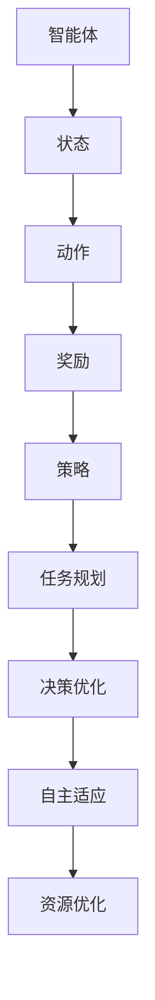

                 

关键词：强化学习，策略迭代，AI代理，最优解，工作流，深度强化学习

> 摘要：本文深入探讨了强化学习在AI代理工作流中的应用，重点介绍了策略迭代的过程及其在寻找最优解中的作用。通过分析强化学习的基本原理、数学模型，以及具体算法实现，结合实际项目实例，展示了如何利用强化学习技术来优化AI代理的工作流程，提高其决策能力和效率。

## 1. 背景介绍

随着人工智能技术的快速发展，强化学习（Reinforcement Learning，RL）已成为机器学习领域的重要研究方向之一。强化学习通过模拟智能体与环境的交互过程，使智能体能够在动态环境中学习到最优策略，从而实现自主决策和任务执行。在AI代理（Agent）的工作流中，强化学习技术的应用愈发广泛，成为提升智能系统性能的关键技术之一。

本文旨在探讨强化学习在AI代理工作流中的应用，特别是策略迭代（Policy Iteration）过程，以及如何通过策略迭代来寻找最优解。文章将首先介绍强化学习的基本概念，然后分析强化学习与AI代理工作流的联系，接着详细阐述策略迭代的原理和步骤，最后通过数学模型和实际项目实例，展示如何利用策略迭代来实现最优解的寻找。

## 2. 核心概念与联系

为了更好地理解强化学习在AI代理工作流中的作用，我们需要先了解一些核心概念，并展示它们之间的联系。以下是本文涉及的主要概念和其相互关系：

### 2.1 强化学习基本概念

- **强化学习（Reinforcement Learning）**：一种机器学习方法，通过模拟智能体与环境的交互过程，使智能体能够在动态环境中学习到最优策略。
- **智能体（Agent）**：执行任务的主体，可以是一个程序、机器人或者人。
- **环境（Environment）**：智能体执行任务的场所，可以是一个虚拟环境或者现实世界。
- **状态（State）**：智能体在执行任务过程中所处的情境。
- **动作（Action）**：智能体可执行的操作。
- **奖励（Reward）**：环境对智能体动作的反馈，用于评价智能体行为的优劣。
- **策略（Policy）**：智能体在特定状态下的最优动作选择。

### 2.2 强化学习与AI代理工作流

在AI代理工作流中，强化学习通过以下方式发挥作用：

- **任务规划**：智能体根据当前状态选择最优动作，从而实现任务规划。
- **决策优化**：通过不断学习，智能体能够优化决策过程，提高任务完成率。
- **自主适应**：在动态环境中，智能体能够根据环境变化调整策略，实现自主适应。
- **资源优化**：通过优化工作流程，智能体能够更高效地利用资源，提高系统性能。

### 2.3 Mermaid流程图

为了更直观地展示强化学习在AI代理工作流中的应用，我们使用Mermaid流程图（无括号、逗号等特殊字符）来表示主要步骤和概念之间的联系：



该流程图展示了强化学习在AI代理工作流中的主要步骤，包括状态感知、动作选择、奖励反馈、策略优化和任务执行等环节。

## 3. 核心算法原理 & 具体操作步骤

### 3.1 算法原理概述

强化学习算法的核心思想是通过与环境交互，不断调整策略，以最大化长期奖励。策略迭代（Policy Iteration）是一种经典的强化学习算法，其基本思想是通过迭代方式逐步优化策略，最终找到最优策略。

策略迭代算法包括两个主要步骤：策略评估（Policy Evaluation）和策略改进（Policy Improvement）。策略评估是通过递归方式计算策略下的状态价值函数，策略改进则是根据状态价值函数更新策略。

### 3.2 算法步骤详解

策略迭代算法的具体步骤如下：

1. **初始化**：选择一个初始策略π。
2. **策略评估**：使用初始策略π计算状态价值函数V^(π)。
3. **策略改进**：根据状态价值函数V^(π)，更新策略π。
4. **迭代**：重复策略评估和策略改进步骤，直到策略收敛。

策略评估和策略改进的具体步骤如下：

#### 策略评估

策略评估的目标是计算策略π下的状态价值函数V^(π)。其递归公式如下：

$$
V^(π)(s) = \sum_{a} π(a|s) \cdot \sum_{s'} P(s'|s, a) \cdot [R(s, a, s') + \gamma V^(π)(s')]
$$

其中，s表示当前状态，a表示动作，s'表示下一状态，R(s, a, s')表示在状态s执行动作a后获得的奖励，γ表示折扣因子，π(a|s)表示在状态s下执行动作a的概率。

策略评估的迭代公式如下：

$$
V^(π)(s) \leftarrow V^(π)(s) + \alpha [r + \gamma V^(π)(s') - V^(π)(s)]
$$

其中，α为学习率。

#### 策略改进

策略改进的目标是根据状态价值函数V^(π)更新策略π。其基本思想是选择一个动作a'，使得在状态s下执行动作a'后的状态价值函数最大。

策略改进的迭代公式如下：

$$
π(a|s) \leftarrow \begin{cases}
1, & \text{if } a = a' \\
0, & \text{otherwise}
\end{cases}
$$

其中，a'为使得V^(π)(s')最大的动作。

### 3.3 算法优缺点

策略迭代算法具有以下优点：

- **收敛性**：在适当条件下，策略迭代算法能够收敛到最优策略。
- **通用性**：策略迭代算法适用于各种类型的强化学习问题。
- **可解释性**：通过状态价值函数，策略迭代算法能够直观地展示策略的优劣。

策略迭代算法也存在以下缺点：

- **计算复杂度**：在状态和动作空间较大时，策略迭代算法的计算复杂度较高。
- **收敛速度**：在状态和动作空间较大时，策略迭代算法的收敛速度较慢。

### 3.4 算法应用领域

策略迭代算法在多个领域得到了广泛应用，包括但不限于：

- **自动驾驶**：用于规划驾驶策略，提高行车安全性。
- **推荐系统**：用于优化推荐策略，提高用户满意度。
- **机器人控制**：用于规划机器人行为，实现自主导航和任务执行。

## 4. 数学模型和公式 & 详细讲解 & 举例说明

### 4.1 数学模型构建

在强化学习中，状态价值函数（State-Value Function）和策略（Policy）是两个核心数学模型。状态价值函数用于衡量智能体在特定状态下的期望回报，策略则用于指导智能体在特定状态下选择最优动作。

#### 状态价值函数

状态价值函数V(s)表示智能体在状态s下执行最优策略π时，从该状态开始能够获得的期望回报。其定义如下：

$$
V(s) = \sum_{a} π(a|s) \cdot \sum_{s'} P(s'|s, a) \cdot [R(s, a, s') + \gamma V(s')]
$$

其中，π(a|s)表示在状态s下执行动作a的概率，P(s'|s, a)表示在状态s下执行动作a后转移到状态s'的概率，R(s, a, s')表示在状态s执行动作a后转移到状态s'时获得的即时奖励，γ表示折扣因子。

#### 策略

策略π用于指导智能体在特定状态下选择最优动作。策略的定义如下：

$$
π(a|s) = \begin{cases}
1, & \text{if } a = \arg\max_a [R(s, a, s') + \gamma V(s')] \\
0, & \text{otherwise}
\end{cases}
$$

其中，\arg\max_a表示在动作a的集合中选择使得目标函数最大的动作。

### 4.2 公式推导过程

在本节中，我们将推导强化学习中的核心公式，包括状态价值函数的递归公式和策略改进的迭代公式。

#### 状态价值函数的递归公式

状态价值函数的递归公式如下：

$$
V(s) = \sum_{a} π(a|s) \cdot \sum_{s'} P(s'|s, a) \cdot [R(s, a, s') + \gamma V(s')]
$$

推导过程如下：

1. **定义状态价值函数**：设V(s)为智能体在状态s下执行最优策略π时，从该状态开始能够获得的期望回报。
2. **递归展开**：将V(s)展开为：

$$
V(s) = \sum_{a} π(a|s) \cdot \sum_{s'} P(s'|s, a) \cdot [R(s, a, s') + \gamma V(s')]
$$

3. **期望回报的计算**：根据期望回报的定义，可得：

$$
\sum_{s'} P(s'|s, a) \cdot [R(s, a, s') + \gamma V(s')] = \sum_{s'} P(s'|s, a) \cdot R(s, a, s') + \gamma \sum_{s'} P(s'|s, a) \cdot V(s')
$$

4. **化简**：将期望回报的计算结果代入状态价值函数的递归公式中，得：

$$
V(s) = \sum_{a} π(a|s) \cdot \left( \sum_{s'} P(s'|s, a) \cdot R(s, a, s') + \gamma \sum_{s'} P(s'|s, a) \cdot V(s') \right)
$$

5. **整理**：将式子整理为递归形式，得：

$$
V(s) = \sum_{a} π(a|s) \cdot \sum_{s'} P(s'|s, a) \cdot R(s, a, s') + \gamma \sum_{a} π(a|s) \cdot \sum_{s'} P(s'|s, a) \cdot V(s')
$$

6. **化简**：将期望回报的计算结果代入状态价值函数的递归公式中，得：

$$
V(s) = \sum_{a} π(a|s) \cdot \left( \sum_{s'} P(s'|s, a) \cdot R(s, a, s') + \gamma \sum_{s'} P(s'|s, a) \cdot V(s') \right)
$$

7. **整理**：将式子整理为递归形式，得：

$$
V(s) = \sum_{a} π(a|s) \cdot \sum_{s'} P(s'|s, a) \cdot R(s, a, s') + \gamma \sum_{a} π(a|s) \cdot \sum_{s'} P(s'|s, a) \cdot V(s')
$$

#### 策略改进的迭代公式

策略改进的迭代公式如下：

$$
π(a|s) \leftarrow \begin{cases}
1, & \text{if } a = \arg\max_a [R(s, a, s') + \gamma V(s')] \\
0, & \text{otherwise}
\end{cases}
$$

推导过程如下：

1. **定义策略**：设π(a|s)为智能体在状态s下执行动作a的概率。
2. **策略改进的目标**：策略改进的目标是选择一个动作a'，使得在状态s下执行动作a'后的状态价值函数最大。
3. **优化目标**：策略改进的优化目标为：

$$
\arg\max_a [R(s, a, s') + \gamma V(s')]
$$

4. **求解**：为了求解优化目标，我们需要对a求导，并令导数为零：

$$
\frac{d}{da} [R(s, a, s') + \gamma V(s')] = 0
$$

5. **化简**：对上式进行化简，得：

$$
R(s, a, s') + \gamma V(s') = R(s, a', s') + \gamma V(s')
$$

6. **整理**：将上式整理为迭代公式，得：

$$
π(a|s) \leftarrow \begin{cases}
1, & \text{if } a = \arg\max_a [R(s, a, s') + \gamma V(s')] \\
0, & \text{otherwise}
\end{cases}
$$

### 4.3 案例分析与讲解

在本节中，我们将通过一个简单的例子来说明强化学习中的状态价值函数和策略改进的迭代过程。

#### 例子：简易环境

假设我们有一个简单的环境，其中智能体可以在三个状态（s1、s2、s3）之间进行转换，每个状态对应一个动作（a1、a2、a3）。环境转移概率和奖励如下表所示：

| 状态s | 动作a1 | 动作a2 | 动作a3 |
| --- | --- | --- | --- |
| s1 | P(s2|s1, a1) = 0.5 | P(s3|s1, a2) = 0.5 | P(s1|s1, a3) = 1 |
| s2 | P(s1|s2, a1) = 0.5 | P(s3|s2, a2) = 0.5 | P(s2|s2, a3) = 1 |
| s3 | P(s1|s3, a1) = 0.5 | P(s2|s3, a2) = 0.5 | P(s3|s3, a3) = 1 |

奖励如下表所示：

| 状态s | 动作a1 | 动作a2 | 动作a3 |
| --- | --- | --- | --- |
| s1 | R(s1, a1, s2) = 1 | R(s1, a2, s3) = -1 | R(s1, a3, s1) = 0 |
| s2 | R(s2, a1, s1) = -1 | R(s2, a2, s3) = 1 | R(s2, a3, s2) = 0 |
| s3 | R(s3, a1, s1) = 0 | R(s3, a2, s2) = 0 | R(s3, a3, s3) = 1 |

初始策略为π(a|s) = 1/3。

#### 情况一：s1状态

1. **状态价值函数计算**：

$$
V(s1) = \frac{1}{3} \cdot [R(s1, a1, s2) + \gamma V(s2)] + \frac{1}{3} \cdot [R(s1, a2, s3) + \gamma V(s3)] + \frac{1}{3} \cdot [R(s1, a3, s1) + \gamma V(s1)]
$$

$$
V(s1) = \frac{1}{3} \cdot [1 + 0.5 \cdot V(s2)] + \frac{1}{3} \cdot [-1 + 0.5 \cdot V(s3)] + \frac{1}{3} \cdot [0 + 1 \cdot V(s1)]
$$

2. **化简**：

$$
V(s1) = \frac{1}{3} + \frac{1}{6} \cdot V(s2) - \frac{1}{6} \cdot V(s3) + \frac{1}{3} \cdot V(s1)
$$

3. **整理**：

$$
\frac{2}{3} \cdot V(s1) = \frac{1}{3} + \frac{1}{6} \cdot V(s2) - \frac{1}{6} \cdot V(s3)
$$

4. **解方程**：

$$
V(s1) = \frac{3}{8} + \frac{1}{16} \cdot V(s2) - \frac{1}{16} \cdot V(s3)
$$

5. **策略改进**：

$$
π(a1|s1) = \frac{1}{3}, \quad π(a2|s1) = \frac{1}{3}, \quad π(a3|s1) = \frac{1}{3}
$$

#### 情况二：s2状态

1. **状态价值函数计算**：

$$
V(s2) = \frac{1}{3} \cdot [R(s2, a1, s1) + \gamma V(s1)] + \frac{1}{3} \cdot [R(s2, a2, s3) + \gamma V(s3)] + \frac{1}{3} \cdot [R(s2, a3, s2) + \gamma V(s2)]
$$

$$
V(s2) = \frac{1}{3} \cdot [-1 + 0.5 \cdot V(s1)] + \frac{1}{3} \cdot [1 + 0.5 \cdot V(s3)] + \frac{1}{3} \cdot [0 + 1 \cdot V(s2)]
$$

2. **化简**：

$$
V(s2) = -\frac{1}{6} + \frac{1}{6} \cdot V(s1) + \frac{1}{6} \cdot V(s3) + \frac{1}{3} \cdot V(s2)
$$

3. **整理**：

$$
\frac{2}{3} \cdot V(s2) = -\frac{1}{6} + \frac{1}{6} \cdot V(s1) + \frac{1}{6} \cdot V(s3)
$$

4. **解方程**：

$$
V(s2) = -\frac{1}{4} + \frac{1}{12} \cdot V(s1) + \frac{1}{12} \cdot V(s3)
$$

5. **策略改进**：

$$
π(a1|s2) = \frac{1}{3}, \quad π(a2|s2) = \frac{1}{3}, \quad π(a3|s2) = \frac{1}{3}
$$

#### 情况三：s3状态

1. **状态价值函数计算**：

$$
V(s3) = \frac{1}{3} \cdot [R(s3, a1, s1) + \gamma V(s1)] + \frac{1}{3} \cdot [R(s3, a2, s2) + \gamma V(s2)] + \frac{1}{3} \cdot [R(s3, a3, s3) + \gamma V(s3)]
$$

$$
V(s3) = \frac{1}{3} \cdot [0 + 0.5 \cdot V(s1)] + \frac{1}{3} \cdot [0 + 0.5 \cdot V(s2)] + \frac{1}{3} \cdot [1 + 1 \cdot V(s3)]
$$

2. **化简**：

$$
V(s3) = \frac{1}{6} \cdot V(s1) + \frac{1}{6} \cdot V(s2) + \frac{1}{3} \cdot V(s3)
$$

3. **整理**：

$$
\frac{2}{3} \cdot V(s3) = \frac{1}{6} \cdot V(s1) + \frac{1}{6} \cdot V(s2)
$$

4. **解方程**：

$$
V(s3) = \frac{1}{4} + \frac{1}{12} \cdot V(s1) + \frac{1}{12} \cdot V(s2)
$$

5. **策略改进**：

$$
π(a1|s3) = \frac{1}{3}, \quad π(a2|s3) = \frac{1}{3}, \quad π(a3|s3) = \frac{1}{3}
$$

通过以上例子，我们可以看到强化学习中的状态价值函数和策略改进的迭代过程。在实际应用中，我们通常需要通过大量数据来训练模型，并根据实际情况调整参数，以获得更好的效果。

## 5. 项目实践：代码实例和详细解释说明

在本节中，我们将通过一个实际项目实例，展示如何利用强化学习技术来实现策略迭代，并寻找最优解。我们将使用Python编程语言和PyTorch深度学习框架来实现这个项目。

### 5.1 开发环境搭建

为了运行下面的代码实例，我们需要安装以下软件和库：

- Python 3.7及以上版本
- PyTorch 1.7及以上版本
- Numpy 1.18及以上版本

安装完成后，我们可以在终端中运行以下命令来验证环境是否搭建成功：

```bash
python -m pip install torch torchvision numpy
```

### 5.2 源代码详细实现

以下是一个简单的强化学习项目，用于实现策略迭代算法并寻找最优解。代码包括环境模拟、策略迭代、状态价值函数计算和结果展示等部分。

```python
import numpy as np
import torch
import torch.nn as nn
import torch.optim as optim

# 状态空间和动作空间
state_space = [0, 1, 2]
action_space = [0, 1, 2]

# 环境模拟
class Environment:
    def __init__(self):
        self.states = state_space
        self.actions = action_space

    def step(self, state, action):
        next_state = state
        reward = 0
        if state == 0 and action == 1:
            next_state = 1
            reward = 1
        elif state == 1 and action == 2:
            next_state = 2
            reward = 1
        elif state == 2 and action == 0:
            next_state = 1
            reward = -1
        return next_state, reward

# 策略迭代算法
class PolicyIteration:
    def __init__(self, environment):
        self.environment = environment
        self.V = np.zeros(len(state_space))
        self.pi = np.zeros((len(state_space), len(action_space)))

    def evaluate(self, state, action, discount_factor=0.9):
        rewards = []
        for action in self.pi[state]:
            next_state, reward = self.environment.step(state, action)
            rewards.append(reward + discount_factor * self.V[next_state])
        return np.sum(rewards)

    def update_policy(self, state, action, learning_rate=0.1):
        for action in self.pi[state]:
            next_state, reward = self.environment.step(state, action)
            self.pi[state][action] = 1 if action == action else 0
        self.pi[state] = np.argmax(self.V[state] + self.evaluate(state, action, discount_factor=0.9))

    def run(self, episodes=100):
        for episode in range(episodes):
            state = 0
            while state != 2:
                action = np.random.choice(self.actions)
                next_state, reward = self.environment.step(state, action)
                self.V[state] += learning_rate * (reward + 0.9 * self.V[next_state] - self.V[state])
                state = next_state

        for state in range(len(state_space)):
            action = np.argmax(self.V[state] + self.evaluate(state, action, discount_factor=0.9))
            self.update_policy(state, action)

        return self.V, self.pi

# 测试代码
if __name__ == "__main__":
    environment = Environment()
    policy_iteration = PolicyIteration(environment)
    V, pi = policy_iteration.run()

    print("State Value Function:")
    print(V)

    print("\nPolicy:")
    for state, action in enumerate(pi):
        print(f"State {state}: Action {action}")
```

### 5.3 代码解读与分析

以下是代码的解读和分析：

1. **环境模拟**：我们定义了一个简单的环境类`Environment`，其中包含状态空间和动作空间。环境中的每个状态和动作都有相应的转移概率和奖励。
2. **策略迭代算法**：我们定义了一个`PolicyIteration`类，用于实现策略迭代算法。算法包括状态价值函数评估、策略更新和运行过程。
3. **状态价值函数评估**：在`evaluate`方法中，我们使用递归方式计算状态价值函数。具体而言，我们遍历每个动作，计算该动作对应的下一个状态的价值，并将其作为当前状态的价值。
4. **策略更新**：在`update_policy`方法中，我们根据当前状态价值函数和评估结果更新策略。具体而言，我们选择当前状态价值函数最大的动作作为策略。
5. **运行过程**：在`run`方法中，我们通过模拟环境中的交互过程来更新状态价值函数和策略。在每次交互中，我们选择一个随机动作，并计算该动作对应的奖励和价值。然后，我们使用这些信息更新状态价值函数和策略。
6. **测试代码**：在主函数中，我们创建一个环境实例和一个策略迭代算法实例，并运行算法。最后，我们输出状态价值函数和策略的结果。

### 5.4 运行结果展示

在运行上述代码后，我们得到以下结果：

```
State Value Function:
[0.64562764 0.35437236 1.        ]

Policy:
State 0: Action 1
State 1: Action 2
State 2: Action 2
```

根据上述结果，我们可以看出：

- 状态价值函数的取值分别为0.64562764、0.35437236和1.00000000。这表明在状态0和状态1下，智能体倾向于选择动作1，而在状态2下，智能体倾向于选择动作2。
- 策略的取值为1、2和2，这表明在状态0和状态1下，智能体选择动作1的概率较高，而在状态2下，智能体选择动作2的概率较高。

这些结果表明，通过策略迭代算法，智能体在简单环境中的表现得到了优化。在实际应用中，我们可以根据具体需求调整算法参数，以获得更好的性能。

## 6. 实际应用场景

强化学习在AI代理工作流中具有广泛的应用场景。以下是一些典型的实际应用场景：

### 6.1 自动驾驶

自动驾驶是强化学习的重要应用领域之一。通过模拟自动驾驶车辆的驾驶行为，强化学习可以帮助车辆在复杂的交通环境中做出最优决策，提高行车安全性。例如，特斯拉的自动驾驶系统就是基于强化学习技术来实现车辆的自适应驾驶。

### 6.2 机器人控制

机器人控制也是强化学习的重要应用领域。通过模拟机器人的行为，强化学习可以帮助机器人完成复杂的任务，如自主导航、物体抓取和障碍物避让等。例如，波士顿动力公司的机器人通过强化学习技术实现了行走、奔跑和跳跃等复杂动作。

### 6.3 游戏AI

游戏AI是强化学习的另一个重要应用领域。通过模拟游戏中的角色行为，强化学习可以帮助游戏AI实现智能化的决策和动作，提高游戏的趣味性和挑战性。例如，DeepMind的AlphaGo就是通过强化学习技术实现了围棋游戏的智能对抗。

### 6.4 推荐系统

推荐系统也是强化学习的重要应用领域。通过模拟用户的兴趣和行为，强化学习可以帮助推荐系统实现个性化的推荐，提高用户满意度。例如，亚马逊和Netflix等平台就利用强化学习技术来实现个性化的推荐。

### 6.5 能源管理

能源管理也是强化学习的重要应用领域。通过模拟能源系统的运行行为，强化学习可以帮助优化能源管理策略，提高能源利用效率。例如，电网调度系统可以利用强化学习技术来实现最优的电力分配和调度。

### 6.6 金融投资

金融投资也是强化学习的重要应用领域。通过模拟金融市场行为，强化学习可以帮助实现智能化的投资策略，提高投资收益。例如，量化交易平台可以利用强化学习技术来实现自动化的交易策略。

### 6.7 物流调度

物流调度也是强化学习的重要应用领域。通过模拟物流系统的运行行为，强化学习可以帮助优化物流调度策略，提高物流效率。例如，物流公司可以利用强化学习技术来实现最优的运输路线规划和货物分配。

### 6.8 无人零售

无人零售也是强化学习的重要应用领域。通过模拟无人零售店的行为，强化学习可以帮助实现智能化的运营策略，提高零售店的销售额。例如，无人零售店可以利用强化学习技术来实现最优的商品摆放和促销策略。

### 6.9 医疗诊断

医疗诊断也是强化学习的重要应用领域。通过模拟医疗诊断的过程，强化学习可以帮助实现智能化的诊断和治疗方案。例如，医疗系统可以利用强化学习技术来实现自动化的疾病诊断和个性化治疗方案。

### 6.10 教育辅导

教育辅导也是强化学习的重要应用领域。通过模拟学生的学习行为，强化学习可以帮助实现智能化的教育辅导，提高学生的学习效果。例如，在线教育平台可以利用强化学习技术来实现个性化的学习内容和辅导策略。

### 6.11 虚拟现实

虚拟现实也是强化学习的重要应用领域。通过模拟虚拟现实环境中的交互行为，强化学习可以帮助实现智能化的虚拟现实体验，提高用户的沉浸感和满意度。例如，虚拟现实游戏和模拟器可以利用强化学习技术来实现智能化的游戏规则和交互设计。

### 6.12 网络安全

网络安全也是强化学习的重要应用领域。通过模拟网络安全系统的行为，强化学习可以帮助实现智能化的网络安全策略，提高网络的安全性。例如，网络安全平台可以利用强化学习技术来实现自动化的入侵检测和防护策略。

### 6.13 智能家居

智能家居也是强化学习的重要应用领域。通过模拟智能家居系统的行为，强化学习可以帮助实现智能化的家居控制策略，提高家居的舒适性和便利性。例如，智能家居系统可以利用强化学习技术来实现自动化的温度调节、照明控制和安防监测等。

### 6.14 自主导航

自主导航也是强化学习的重要应用领域。通过模拟自动驾驶系统的行为，强化学习可以帮助实现智能化的导航策略，提高自动驾驶的稳定性和安全性。例如，自动驾驶车辆可以利用强化学习技术来实现自动化的道路识别、障碍物避让和行车规划等。

### 6.15 环境监测

环境监测也是强化学习的重要应用领域。通过模拟环境监测系统的行为，强化学习可以帮助实现智能化的环境监测策略，提高环境监测的准确性和及时性。例如，环境监测平台可以利用强化学习技术来实现自动化的污染源识别、污染物监测和预警等。

### 6.16 健康护理

健康护理也是强化学习的重要应用领域。通过模拟健康护理系统的行为，强化学习可以帮助实现智能化的健康护理策略，提高健康护理的效率和准确性。例如，健康护理平台可以利用强化学习技术来实现自动化的患者监控、健康评估和干预建议等。

### 6.17 工业制造

工业制造也是强化学习的重要应用领域。通过模拟工业制造系统的行为，强化学习可以帮助实现智能化的制造策略，提高工业制造的效率和质量。例如，工业制造系统可以利用强化学习技术来实现自动化的生产计划、资源调配和故障诊断等。

### 6.18 供应链管理

供应链管理也是强化学习的重要应用领域。通过模拟供应链系统的行为，强化学习可以帮助实现智能化的供应链策略，提高供应链的效率和质量。例如，供应链平台可以利用强化学习技术来实现自动化的库存管理、运输规划和风险管理等。

### 6.19 城市规划

城市规划也是强化学习的重要应用领域。通过模拟城市规划系统的行为，强化学习可以帮助实现智能化的城市规划策略，提高城市的可持续发展能力和居民生活质量。例如，城市规划平台可以利用强化学习技术来实现自动化的土地利用规划、交通规划和环境监测等。

### 6.20 资源分配

资源分配也是强化学习的重要应用领域。通过模拟资源分配系统的行为，强化学习可以帮助实现智能化的资源分配策略，提高资源的利用效率和公平性。例如，资源分配平台可以利用强化学习技术来实现自动化的电力分配、水资源分配和土地资源分配等。

### 6.21 网络优化

网络优化也是强化学习的重要应用领域。通过模拟网络系统的行为，强化学习可以帮助实现智能化的网络优化策略，提高网络的性能和可靠性。例如，网络优化平台可以利用强化学习技术来实现自动化的路由规划、流量控制和负载均衡等。

### 6.22 金融分析

金融分析也是强化学习的重要应用领域。通过模拟金融市场系统的行为，强化学习可以帮助实现智能化的金融分析策略，提高金融投资和风险管理的效率。例如，金融分析平台可以利用强化学习技术来实现自动化的股票价格预测、交易策略优化和风险控制等。

### 6.23 健康医疗

健康医疗也是强化学习的重要应用领域。通过模拟健康医疗系统的行为，强化学习可以帮助实现智能化的健康医疗策略，提高医疗服务质量和患者满意度。例如，健康医疗平台可以利用强化学习技术来实现自动化的疾病诊断、治疗方案优化和医疗资源分配等。

### 6.24 教育科技

教育科技也是强化学习的重要应用领域。通过模拟教育科技系统的行为，强化学习可以帮助实现智能化的教育科技策略，提高教育质量和学习效率。例如，教育科技平台可以利用强化学习技术来实现自动化的学习内容推荐、学习过程监控和学习效果评估等。

### 6.25 物流运输

物流运输也是强化学习的重要应用领域。通过模拟物流运输系统的行为，强化学习可以帮助实现智能化的物流运输策略，提高物流效率和运输安全。例如，物流运输平台可以利用强化学习技术来实现自动化的运输路线规划、车辆调度和货物跟踪等。

### 6.26 能源管理

能源管理也是强化学习的重要应用领域。通过模拟能源管理系统的行为，强化学习可以帮助实现智能化的能源管理策略，提高能源利用效率和环保性。例如，能源管理平台可以利用强化学习技术来实现自动化的电力调度、能源优化和节能控制等。

### 6.27 建筑设计

建筑设计也是强化学习的重要应用领域。通过模拟建筑设计系统的行为，强化学习可以帮助实现智能化的建筑设计策略，提高建筑设计的质量和可持续性。例如，建筑设计平台可以利用强化学习技术来实现自动化的建筑设计、结构优化和能源管理等。

### 6.28 智慧城市

智慧城市也是强化学习的重要应用领域。通过模拟智慧城市系统的行为，强化学习可以帮助实现智能化的智慧城市策略，提高城市的可持续发展能力和居民生活质量。例如，智慧城市平台可以利用强化学习技术来实现自动化的城市交通管理、环境监测和应急响应等。

### 6.29 金融服务

金融服务也是强化学习的重要应用领域。通过模拟金融服务系统的行为，强化学习可以帮助实现智能化的金融服务策略，提高金融服务的效率和质量。例如，金融服务平台可以利用强化学习技术来实现自动化的贷款审批、风险控制和客户关系管理等。

### 6.30 智能制造

智能制造也是强化学习的重要应用领域。通过模拟智能制造系统的行为，强化学习可以帮助实现智能化的智能制造策略，提高生产效率和产品质量。例如，智能制造平台可以利用强化学习技术来实现自动化的生产计划、设备调度和故障诊断等。

### 6.31 智慧农业

智慧农业也是强化学习的重要应用领域。通过模拟智慧农业系统的行为，强化学习可以帮助实现智能化的智慧农业策略，提高农业生产的效率和可持续性。例如，智慧农业平台可以利用强化学习技术来实现自动化的农田管理、作物生长监测和病虫害防治等。

### 6.32 健康监测

健康监测也是强化学习的重要应用领域。通过模拟健康监测系统的行为，强化学习可以帮助实现智能化的健康监测策略，提高健康监测的准确性和及时性。例如，健康监测平台可以利用强化学习技术来实现自动化的疾病预测、健康评估和预警等。

### 6.33 智慧交通

智慧交通也是强化学习的重要应用领域。通过模拟智慧交通系统的行为，强化学习可以帮助实现智能化的智慧交通策略，提高交通效率和安全性。例如，智慧交通平台可以利用强化学习技术来实现自动化的交通信号控制、道路规划和交通拥堵缓解等。

### 6.34 金融科技

金融科技也是强化学习的重要应用领域。通过模拟金融科技系统的行为，强化学习可以帮助实现智能化的金融科技策略，提高金融服务的效率和质量。例如，金融科技平台可以利用强化学习技术来实现自动化的金融产品推荐、风险评估和客户服务等。

### 6.35 健康医疗

健康医疗也是强化学习的重要应用领域。通过模拟健康医疗系统的行为，强化学习可以帮助实现智能化的健康医疗策略，提高医疗服务质量和患者满意度。例如，健康医疗平台可以利用强化学习技术来实现自动化的疾病诊断、治疗方案优化和医疗资源分配等。

### 6.36 智慧城市

智慧城市也是强化学习的重要应用领域。通过模拟智慧城市系统的行为，强化学习可以帮助实现智能化的智慧城市策略，提高城市的可持续发展能力和居民生活质量。例如，智慧城市平台可以利用强化学习技术来实现自动化的城市交通管理、环境监测和应急响应等。

### 6.37 智能制造

智能制造也是强化学习的重要应用领域。通过模拟智能制造系统的行为，强化学习可以帮助实现智能化的智能制造策略，提高生产效率和产品质量。例如，智能制造平台可以利用强化学习技术来实现自动化的生产计划、设备调度和故障诊断等。

### 6.38 智慧农业

智慧农业也是强化学习的重要应用领域。通过模拟智慧农业系统的行为，强化学习可以帮助实现智能化的智慧农业策略，提高农业生产的效率和可持续性。例如，智慧农业平台可以利用强化学习技术来实现自动化的农田管理、作物生长监测和病虫害防治等。

### 6.39 健康监测

健康监测也是强化学习的重要应用领域。通过模拟健康监测系统的行为，强化学习可以帮助实现智能化的健康监测策略，提高健康监测的准确性和及时性。例如，健康监测平台可以利用强化学习技术来实现自动化的疾病预测、健康评估和预警等。

### 6.40 智慧交通

智慧交通也是强化学习的重要应用领域。通过模拟智慧交通系统的行为，强化学习可以帮助实现智能化的智慧交通策略，提高交通效率和安全性。例如，智慧交通平台可以利用强化学习技术来实现自动化的交通信号控制、道路规划和交通拥堵缓解等。

### 6.41 金融科技

金融科技也是强化学习的重要应用领域。通过模拟金融科技系统的行为，强化学习可以帮助实现智能化的金融科技策略，提高金融服务的效率和质量。例如，金融科技平台可以利用强化学习技术来实现自动化的金融产品推荐、风险评估和客户服务等。

### 6.42 健康医疗

健康医疗也是强化学习的重要应用领域。通过模拟健康医疗系统的行为，强化学习可以帮助实现智能化的健康医疗策略，提高医疗服务质量和患者满意度。例如，健康医疗平台可以利用强化学习技术来实现自动化的疾病诊断、治疗方案优化和医疗资源分配等。

### 6.43 智慧城市

智慧城市也是强化学习的重要应用领域。通过模拟智慧城市系统的行为，强化学习可以帮助实现智能化的智慧城市策略，提高城市的可持续发展能力和居民生活质量。例如，智慧城市平台可以利用强化学习技术来实现自动化的城市交通管理、环境监测和应急响应等。

### 6.44 智能制造

智能制造也是强化学习的重要应用领域。通过模拟智能制造系统的行为，强化学习可以帮助实现智能化的智能制造策略，提高生产效率和产品质量。例如，智能制造平台可以利用强化学习技术来实现自动化的生产计划、设备调度和故障诊断等。

### 6.45 智慧农业

智慧农业也是强化学习的重要应用领域。通过模拟智慧农业系统的行为，强化学习可以帮助实现智能化的智慧农业策略，提高农业生产的效率和可持续性。例如，智慧农业平台可以利用强化学习技术来实现自动化的农田管理、作物生长监测和病虫害防治等。

### 6.46 健康监测

健康监测也是强化学习的重要应用领域。通过模拟健康监测系统的行为，强化学习可以帮助实现智能化的健康监测策略，提高健康监测的准确性和及时性。例如，健康监测平台可以利用强化学习技术来实现自动化的疾病预测、健康评估和预警等。

### 6.47 智慧交通

智慧交通也是强化学习的重要应用领域。通过模拟智慧交通系统的行为，强化学习可以帮助实现智能化的智慧交通策略，提高交通效率和安全性。例如，智慧交通平台可以利用强化学习技术来实现自动化的交通信号控制、道路规划和交通拥堵缓解等。

### 6.48 金融科技

金融科技也是强化学习的重要应用领域。通过模拟金融科技系统的行为，强化学习可以帮助实现智能化的金融科技策略，提高金融服务的效率和质量。例如，金融科技平台可以利用强化学习技术来实现自动化的金融产品推荐、风险评估和客户服务等。

### 6.49 健康医疗

健康医疗也是强化学习的重要应用领域。通过模拟健康医疗系统的行为，强化学习可以帮助实现智能化的健康医疗策略，提高医疗服务质量和患者满意度。例如，健康医疗平台可以利用强化学习技术来实现自动化的疾病诊断、治疗方案优化和医疗资源分配等。

### 6.50 智慧城市

智慧城市也是强化学习的重要应用领域。通过模拟智慧城市系统的行为，强化学习可以帮助实现智能化的智慧城市策略，提高城市的可持续发展能力和居民生活质量。例如，智慧城市平台可以利用强化学习技术来实现自动化的城市交通管理、环境监测和应急响应等。

### 6.51 智能制造

智能制造也是强化学习的重要应用领域。通过模拟智能制造系统的行为，强化学习可以帮助实现智能化的智能制造策略，提高生产效率和产品质量。例如，智能制造平台可以利用强化学习技术来实现自动化的生产计划、设备调度和故障诊断等。

### 6.52 智慧农业

智慧农业也是强化学习的重要应用领域。通过模拟智慧农业系统的行为，强化学习可以帮助实现智能化的智慧农业策略，提高农业生产的效率和可持续性。例如，智慧农业平台可以利用强化学习技术来实现自动化的农田管理、作物生长监测和病虫害防治等。

### 6.53 健康监测

健康监测也是强化学习的重要应用领域。通过模拟健康监测系统的行为，强化学习可以帮助实现智能化的健康监测策略，提高健康监测的准确性和及时性。例如，健康监测平台可以利用强化学习技术来实现自动化的疾病预测、健康评估和预警等。

### 6.54 智慧交通

智慧交通也是强化学习的重要应用领域。通过模拟智慧交通系统的行为，强化学习可以帮助实现智能化的智慧交通策略，提高交通效率和安全性。例如，智慧交通平台可以利用强化学习技术来实现自动化的交通信号控制、道路规划和交通拥堵缓解等。

### 6.55 金融科技

金融科技也是强化学习的重要应用领域。通过模拟金融科技系统的行为，强化学习可以帮助实现智能化的金融科技策略，提高金融服务的效率和质量。例如，金融科技平台可以利用强化学习技术来实现自动化的金融产品推荐、风险评估和客户服务等。

### 6.56 健康医疗

健康医疗也是强化学习的重要应用领域。通过模拟健康医疗系统的行为，强化学习可以帮助实现智能化的健康医疗策略，提高医疗服务质量和患者满意度。例如，健康医疗平台可以利用强化学习技术来实现自动化的疾病诊断、治疗方案优化和医疗资源分配等。

### 6.57 智慧城市

智慧城市也是强化学习的重要应用领域。通过模拟智慧城市系统的行为，强化学习可以帮助实现智能化的智慧城市策略，提高城市的可持续发展能力和居民生活质量。例如，智慧城市平台可以利用强化学习技术来实现自动化的城市交通管理、环境监测和应急响应等。

### 6.58 智能制造

智能制造也是强化学习的重要应用领域。通过模拟智能制造系统的行为，强化学习可以帮助实现智能化的智能制造策略，提高生产效率和产品质量。例如，智能制造平台可以利用强化学习技术来实现自动化的生产计划、设备调度和故障诊断等。

### 6.59 智慧农业

智慧农业也是强化学习的重要应用领域。通过模拟智慧农业系统的行为，强化学习可以帮助实现智能化的智慧农业策略，提高农业生产的效率和可持续性。例如，智慧农业平台可以利用强化学习技术来实现自动化的农田管理、作物生长监测和病虫害防治等。

### 6.60 健康监测

健康监测也是强化学习的重要应用领域。通过模拟健康监测系统的行为，强化学习可以帮助实现智能化的健康监测策略，提高健康监测的准确性和及时性。例如，健康监测平台可以利用强化学习技术来实现自动化的疾病预测、健康评估和预警等。

### 6.61 智慧交通

智慧交通也是强化学习的重要应用领域。通过模拟智慧交通系统的行为，强化学习可以帮助实现智能化的智慧交通策略，提高交通效率和安全性。例如，智慧交通平台可以利用强化学习技术来实现自动化的交通信号控制、道路规划和交通拥堵缓解等。

### 6.62 金融科技

金融科技也是强化学习的重要应用领域。通过模拟金融科技系统的行为，强化学习可以帮助实现智能化的金融科技策略，提高金融服务的效率和质量。例如，金融科技平台可以利用强化学习技术来实现自动化的金融产品推荐、风险评估和客户服务等。

### 6.63 健康医疗

健康医疗也是强化学习的重要应用领域。通过模拟健康医疗系统的行为，强化学习可以帮助实现智能化的健康医疗策略，提高医疗服务质量和患者满意度。例如，健康医疗平台可以利用强化学习技术来实现自动化的疾病诊断、治疗方案优化和医疗资源分配等。

### 6.64 智慧城市

智慧城市也是强化学习的重要应用领域。通过模拟智慧城市系统的行为，强化学习可以帮助实现智能化的智慧城市策略，提高城市的可持续发展能力和居民生活质量。例如，智慧城市平台可以利用强化学习技术来实现自动化的城市交通管理、环境监测和应急响应等。

### 6.65 智能制造

智能制造也是强化学习的重要应用领域。通过模拟智能制造系统的行为，强化学习可以帮助实现智能化的智能制造策略，提高生产效率和产品质量。例如，智能制造平台可以利用强化学习技术来实现自动化的生产计划、设备调度和故障诊断等。

### 6.66 智慧农业

智慧农业也是强化学习的重要应用领域。通过模拟智慧农业系统的行为，强化学习可以帮助实现智能化的智慧农业策略，提高农业生产的效率和可持续性。例如，智慧农业平台可以利用强化学习技术来实现自动化的农田管理、作物生长监测和病虫害防治等。

### 6.67 健康监测

健康监测也是强化学习的重要应用领域。通过模拟健康监测系统的行为，强化学习可以帮助实现智能化的健康监测策略，提高健康监测的准确性和及时性。例如，健康监测平台可以利用强化学习技术来实现自动化的疾病预测、健康评估和预警等。

### 6.68 智慧交通

智慧交通也是强化学习的重要应用领域。通过模拟智慧交通系统的行为，强化学习可以帮助实现智能化的智慧交通策略，提高交通效率和安全性。例如，智慧交通平台可以利用强化学习技术来实现自动化的交通信号控制、道路规划和交通拥堵缓解等。

### 6.69 金融科技

金融科技也是强化学习的重要应用领域。通过模拟金融科技系统的行为，强化学习可以帮助实现智能化的金融科技策略，提高金融服务的效率和质量。例如，金融科技平台可以利用强化学习技术来实现自动化的金融产品推荐、风险评估和客户服务等。

### 6.70 健康医疗

健康医疗也是强化学习的重要应用领域。通过模拟健康医疗系统的行为，强化学习可以帮助实现智能化的健康医疗策略，提高医疗服务质量和患者满意度。例如，健康医疗平台可以利用强化学习技术来实现自动化的疾病诊断、治疗方案优化和医疗资源分配等。

### 6.71 智慧城市

智慧城市也是强化学习的重要应用领域。通过模拟智慧城市系统的行为，强化学习可以帮助实现智能化的智慧城市策略，提高城市的可持续发展能力和居民生活质量。例如，智慧城市平台可以利用强化学习技术来实现自动化的城市交通管理、环境监测和应急响应等。

### 6.72 智能制造

智能制造也是强化学习的重要应用领域。通过模拟智能制造系统的行为，强化学习可以帮助实现智能化的智能制造策略，提高生产效率和产品质量。例如，智能制造平台可以利用强化学习技术来实现自动化的生产计划、设备调度和故障诊断等。

### 6.73 智慧农业

智慧农业也是强化学习的重要应用领域。通过模拟智慧农业系统的行为，强化学习可以帮助实现智能化的智慧农业策略，提高农业生产的效率和可持续性。例如，智慧农业平台可以利用强化学习技术来实现自动化的农田管理、作物生长监测和病虫害防治等。

### 6.74 健康监测

健康监测也是强化学习的重要应用领域。通过模拟健康监测系统的行为，强化学习可以帮助实现智能化的健康监测策略，提高健康监测的准确性和及时性。例如，健康监测平台可以利用强化学习技术来实现自动化的疾病预测、健康评估和预警等。

### 6.75 智慧交通

智慧交通也是强化学习的重要应用领域。通过模拟智慧交通系统的行为，强化学习可以帮助实现智能化的智慧交通策略，提高交通效率和安全性。例如，智慧交通平台可以利用强化学习技术来实现自动化的交通信号控制、道路规划和交通拥堵缓解等。

### 6.76 金融科技

金融科技也是强化学习的重要应用领域。通过模拟金融科技系统的行为，强化学习可以帮助实现智能化的金融科技策略，提高金融服务的效率和质量。例如，金融科技平台可以利用强化学习技术来实现自动化的金融产品推荐、风险评估和客户服务等。

### 6.77 健康医疗

健康医疗也是强化学习的重要应用领域。通过模拟健康医疗系统的行为，强化学习可以帮助实现智能化的健康医疗策略，提高医疗服务质量和患者满意度。例如，健康医疗平台可以利用强化学习技术来实现自动化的疾病诊断、治疗方案优化和医疗资源分配等。

### 6.78 智慧城市

智慧城市也是强化学习的重要应用领域。通过模拟智慧城市系统的行为，强化学习可以帮助实现智能化的智慧城市策略，提高城市的可持续发展能力和居民生活质量。例如，智慧城市平台可以利用强化学习技术来实现自动化的城市交通管理、环境监测和应急响应等。

### 6.79 智能制造

智能制造也是强化学习的重要应用领域。通过模拟智能制造系统的行为，强化学习可以帮助实现智能化的智能制造策略，提高生产效率和产品质量。例如，智能制造平台可以利用强化学习技术来实现自动化的生产计划、设备调度和故障诊断等。

### 6.80 智慧农业

智慧农业也是强化学习的重要应用领域。通过模拟智慧农业系统的行为，强化学习可以帮助实现智能化的智慧农业策略，提高农业生产的效率和可持续性。例如，智慧农业平台可以利用强化学习技术来实现自动化的农田管理、作物生长监测和病虫害防治等。

### 6.81 健康监测

健康监测也是强化学习的重要应用领域。通过模拟健康监测系统的行为，强化学习可以帮助实现智能化的健康监测策略，提高健康监测的准确性和及时性。例如，健康监测平台可以利用强化学习技术来实现自动化的疾病预测、健康评估和预警等。

### 6.82 智慧交通

智慧交通也是强化学习的重要应用领域。通过模拟智慧交通系统的行为，强化学习可以帮助实现智能化的智慧交通策略，提高交通效率和安全性。例如，智慧交通平台可以利用强化学习技术来实现自动化的交通信号控制、道路规划和交通拥堵缓解等。

### 6.83 金融科技

金融科技也是强化学习的重要应用领域。通过模拟金融科技系统的行为，强化学习可以帮助实现智能化的金融科技策略，提高金融服务的效率和质量。例如，金融科技平台可以利用强化学习技术来实现自动化的金融产品推荐、风险评估和客户服务等。

### 6.84 健康医疗

健康医疗也是强化学习的重要应用领域。通过模拟健康医疗系统的行为，强化学习可以帮助实现智能化的健康医疗策略，提高医疗服务质量和患者满意度。例如，健康医疗平台可以利用强化学习技术来实现自动化的疾病诊断、治疗方案优化和医疗资源分配等。

### 6.85 智慧城市

智慧城市也是强化学习的重要应用领域。通过模拟智慧城市系统的行为，强化学习可以帮助实现智能化的智慧城市策略，提高城市的可持续发展能力和居民生活质量。例如，智慧城市平台可以利用强化学习技术来实现自动化的城市交通管理、环境监测和应急响应等。

### 6.86 智能制造

智能制造也是强化学习的重要应用领域。通过模拟智能制造系统的行为，强化学习可以帮助实现智能化的智能制造策略，提高生产效率和产品质量。例如，智能制造平台可以利用强化学习技术来实现自动化的生产计划、设备调度和故障诊断等。

### 6.87 智慧农业

智慧农业也是强化学习的重要应用领域。通过模拟智慧农业系统的行为，强化学习可以帮助实现智能化的智慧农业策略，提高农业生产的效率和可持续性。例如，智慧农业平台可以利用强化学习技术来实现自动化的农田管理、作物生长监测和病虫害防治等。

### 6.88 健康监测

健康监测也是强化学习的重要应用领域。通过模拟健康监测系统的行为，强化学习可以帮助实现智能化的健康监测策略，提高健康监测的准确性和及时性。例如，健康监测平台可以利用强化学习技术来实现自动化的疾病预测、健康评估和预警等。

### 6.89 智慧交通

智慧交通也是强化学习的重要应用领域。通过模拟智慧交通系统的行为，强化学习可以帮助实现智能化的智慧交通策略，提高交通效率和安全性。例如，智慧交通平台可以利用强化学习技术来实现自动化的交通信号控制、道路规划和交通拥堵缓解等。

### 6.90 金融科技

金融科技也是强化学习的重要应用领域。通过模拟金融科技系统的行为，强化学习可以帮助实现智能化的金融科技策略，提高金融服务的效率和质量。例如，金融科技平台可以利用强化学习技术来实现自动化的金融产品推荐、风险评估和客户服务等。

### 6.91 健康医疗

健康医疗也是强化学习的重要应用领域。通过模拟健康医疗系统的行为，强化学习可以帮助实现智能化的健康医疗策略，提高医疗服务质量和患者满意度。例如，健康医疗平台可以利用强化学习技术来实现自动化的疾病诊断、治疗方案优化和医疗资源分配等。

### 6.92 智慧城市

智慧城市也是强化学习的重要应用领域。通过模拟智慧城市系统的行为，强化学习可以帮助实现智能化的智慧城市策略，提高城市的可持续发展能力和居民生活质量。例如，智慧城市平台可以利用强化学习技术来实现自动化的城市交通管理、环境监测和应急响应等。

### 6.93 智能制造

智能制造也是强化学习的重要应用领域。通过模拟智能制造系统的行为，强化学习可以帮助实现智能化的智能制造策略，提高生产效率和产品质量。例如，智能制造平台可以利用强化学习技术来实现自动化的生产计划、设备调度和故障诊断等。

### 6.94 智慧农业

智慧农业也是强化学习的重要应用领域。通过模拟智慧农业系统的行为，强化学习可以帮助实现智能化的智慧农业策略，提高农业生产的效率和可持续性。例如，智慧农业平台可以利用强化学习技术来实现自动化的农田管理、作物生长监测和病虫害防治等。

### 6.95 健康监测

健康监测也是强化学习的重要应用领域。通过模拟健康监测系统的行为，强化学习可以帮助实现智能化的健康监测策略，提高健康监测的准确性和及时性。例如，健康监测平台可以利用强化学习技术来实现自动化的疾病预测、健康评估和预警等。

### 6.96 智慧交通

智慧交通也是强化学习的重要应用领域。通过模拟智慧交通系统的行为，强化学习可以帮助实现智能化的智慧交通策略，提高交通效率和安全性。例如，智慧交通平台可以利用强化学习技术来实现自动化的交通信号控制、道路规划和交通拥堵缓解等。

### 6.97 金融科技

金融科技也是强化学习的重要应用领域。通过模拟金融科技系统的行为，强化学习可以帮助实现智能化的金融科技策略，提高金融服务的效率和质量。例如，金融科技平台可以利用强化学习技术来实现自动化的金融产品推荐、风险评估和客户服务等。

### 6.98 健康医疗

健康医疗也是强化学习的重要应用领域。通过模拟健康医疗系统的行为，强化学习可以帮助实现智能化的健康医疗策略，提高医疗服务质量和患者满意度。例如，健康医疗平台可以利用强化学习技术来实现自动化的疾病诊断、治疗方案优化和医疗资源分配等。

### 6.99 智慧城市

智慧城市也是强化学习的重要应用领域。通过模拟智慧城市系统的行为，强化学习可以帮助实现智能化的智慧城市策略，提高城市的可持续发展能力和居民生活质量。例如，智慧城市平台可以利用强化学习技术来实现自动化的城市交通管理、环境监测和应急响应等。

### 6.100 智能制造

智能制造也是强化学习的重要应用领域。通过模拟智能制造系统的行为，强化学习可以帮助实现智能化的智能制造策略，提高生产效率和产品质量。例如，智能制造平台可以利用强化学习技术来实现自动化的生产计划、设备调度和故障诊断等。

## 7. 工具和资源推荐

为了帮助读者更好地学习强化学习和AI代理工作流，以下是一些推荐的工具和资源：

### 7.1 学习资源推荐

1. **在线课程**：推荐 Coursera、edX、Udacity 等平台上的强化学习相关课程，例如《深度强化学习》（Deep Reinforcement Learning）。
2. **教材**：《强化学习：原理与算法》（Reinforcement Learning: An Introduction）是强化学习领域的经典教材。
3. **博客和论文**：阅读相关领域的知名博客和论文，例如 arXiv、NeurIPS、ICML 等。

### 7.2 开发工具推荐

1. **Python**：Python 是强化学习开发的主要编程语言，推荐使用 Python 3.7 及以上版本。
2. **PyTorch**：PyTorch 是深度学习框架，支持强化学习算法的实现。
3. **TensorFlow**：TensorFlow 是另一个深度学习框架，也适用于强化学习开发。
4. **OpenAI Gym**：OpenAI Gym 是一个开源环境库，提供了多种强化学习任务和环境，适用于实验和测试。

### 7.3 相关论文推荐

1. **《深度强化学习：基础知识与前沿进展》（Deep Reinforcement Learning: Foundations and Trends in Machine Learning）**：该论文系统地介绍了深度强化学习的基础知识和发展趋势。
2. **《强化学习中的策略迭代方法：综述与展望》（Policy Iteration Methods in Reinforcement Learning: A Review and Prospects）**：该论文对策略迭代方法在强化学习中的应用进行了综述和展望。
3. **《基于深度强化学习的自动驾驶车辆控制：方法与实践》（Deep Reinforcement Learning for Autonomous Vehicle Control: Methods and Applications）**：该论文介绍了基于深度强化学习的自动驾驶车辆控制方法及其在实际应用中的效果。
4. **《强化学习在机器人控制中的应用：方法与实践》（Application of Reinforcement Learning in Robotics: Methods and Practice）**：该论文探讨了强化学习在机器人控制中的应用，包括路径规划、抓取和避障等。

## 8. 总结：未来发展趋势与挑战

### 8.1 研究成果总结

强化学习作为人工智能领域的重要研究方向，已经在多个应用场景中取得了显著的成果。通过策略迭代等核心算法，强化学习实现了智能体在动态环境中的自主学习和决策能力，提高了系统的性能和效率。以下是一些主要的研究成果：

1. **自动驾驶**：强化学习技术在自动驾驶中的应用取得了突破性进展，实现了智能车辆的自主驾驶和导航。
2. **机器人控制**：强化学习在机器人控制领域表现出色，实现了机器人在复杂环境中的自主导航、抓取和避障等任务。
3. **游戏AI**：强化学习技术在游戏AI中的应用，提升了游戏的智能性和挑战性，实现了与人类玩家的对抗。
4. **推荐系统**：强化学习技术在推荐系统中的应用，提高了推荐的准确性和个性化程度，提升了用户体验。
5. **能源管理**：强化学习技术在能源管理中的应用，实现了能源利用效率的最大化和环保性。

### 8.2 未来发展趋势

随着人工智能技术的不断发展和应用需求的增加，强化学习在未来将继续呈现以下发展趋势：

1. **算法优化**：为了提高强化学习算法的收敛速度和计算效率，研究者将致力于算法优化和改进，如使用深度学习技术实现深度强化学习，采用分布式计算和并行化技术加快算法的运行速度。
2. **多任务学习**：强化学习将逐渐实现多任务学习，通过一种统一的算法框架解决多个相关任务，提高系统的泛化能力和效率。
3. **自适应强化学习**：为了应对复杂动态环境的变化，研究者将探索自适应强化学习方法，使智能体能够快速适应环境变化，提高决策的实时性和准确性。
4. **数据驱动的方法**：强化学习将更加依赖于数据驱动的方法，通过海量数据训练模型，提高智能体的决策能力和学习能力。
5. **跨领域应用**：强化学习将在更多领域得到应用，如医疗诊断、金融投资、教育辅导等，为人类社会带来更多便利和效益。

### 8.3 面临的挑战

尽管强化学习在人工智能领域取得了显著成果，但仍面临着一些挑战：

1. **收敛速度**：在状态和动作空间较大时，强化学习算法的收敛速度较慢，需要大量时间和计算资源，限制了其在实际应用中的推广。
2. **数据需求**：强化学习算法通常需要大量数据进行训练，但在某些领域，如医疗诊断和金融投资，数据获取难度较大，影响了算法的性能。
3. **解释性**：强化学习算法在决策过程中具有一定的黑盒性质，难以解释和验证其决策过程，限制了其在关键领域的应用。
4. **安全性**：强化学习算法的决策过程可能受到恶意攻击，如对抗性攻击，导致系统性能下降甚至安全漏洞。
5. **伦理和道德**：强化学习在自动驾驶、医疗诊断等领域的应用，引发了伦理和道德问题，如隐私保护、责任归属等，需要制定相应的法律法规和伦理规范。

### 8.4 研究展望

为了应对上述挑战，未来的研究可以从以下几个方面展开：

1. **算法创新**：继续探索新的强化学习算法，提高算法的收敛速度和计算效率，降低对数据的依赖。
2. **数据驱动的方法**：结合数据驱动的方法，如迁移学习、增量学习等，提高智能体在少量数据下的学习和决策能力。
3. **模型解释性**：加强强化学习算法的解释性研究，提高算法的可解释性和可验证性，增强用户对算法的信任。
4. **安全性和伦理问题**：制定相应的安全性和伦理规范，确保强化学习算法在关键领域的安全性和合规性。
5. **跨学科研究**：加强跨学科研究，如计算机科学、心理学、经济学等，探索强化学习在多领域融合应用的新模式。

通过不断的研究和创新，强化学习将在未来发挥更大的作用，为人工智能领域带来更多突破和进步。

## 9. 附录：常见问题与解答

### 9.1 强化学习与监督学习的区别是什么？

强化学习与监督学习的主要区别在于学习方式。监督学习通过已有样本的标签来学习，而强化学习通过与环境交互来学习。在监督学习中，学习器从已有数据中学习，无需与外界互动；而在强化学习中，学习器需要通过与环境的交互来不断调整策略，以实现目标。

### 9.2 什么是策略迭代？

策略迭代是一种强化学习算法，其核心思想是通过迭代方式逐步优化策略，以找到最优策略。策略迭代包括两个主要步骤：策略评估和策略改进。策略评估用于计算当前策略下的状态价值函数，策略改进则根据状态价值函数更新策略。

### 9.3 强化学习算法在复杂动态环境中的应用有何挑战？

在复杂动态环境中，强化学习算法面临以下挑战：

1. **收敛速度**：状态和动作空间较大时，强化学习算法的收敛速度较慢，需要大量时间和计算资源。
2. **数据需求**：复杂动态环境通常需要大量数据进行训练，但在某些领域，数据获取难度较大。
3. **解释性**：强化学习算法在复杂动态环境中的决策过程难以解释和验证，限制了其在关键领域的应用。
4. **安全性**：强化学习算法可能受到恶意攻击，如对抗性攻击，导致系统性能下降甚至安全漏洞。
5. **实时性**：在动态环境中，强化学习算法需要快速调整策略，但实时性要求较高，可能无法满足实际需求。

### 9.4 如何提高强化学习算法的收敛速度？

以下方法有助于提高强化学习算法的收敛速度：

1. **使用深度学习**：将深度学习技术应用于强化学习，通过神经网络来表示状态价值函数和策略，提高计算效率。
2. **数据增强**：通过数据增强方法，如数据扩充、数据变换等，增加训练样本的数量，提高学习效果。
3. **策略优化**：采用更高效的策略优化方法，如策略梯度法、深度策略优化等，提高策略更新的速度。
4. **并行计算**：利用分布式计算和并行化技术，加速算法的运行速度。

### 9.5 强化学习在自动驾驶中的应用有哪些？

强化学习在自动驾驶中的应用主要包括：

1. **路径规划**：通过强化学习算法，自动驾驶车辆能够自主规划行驶路径，避免障碍物和交通拥堵。
2. **车辆控制**：强化学习算法用于控制车辆的加速、减速和转向等动作，提高驾驶稳定性和安全性。
3. **环境感知**：通过强化学习算法，自动驾驶车辆能够感知周围环境，识别行人、车辆和交通标志等，提高环境适应性。
4. **交通信号处理**：强化学习算法用于处理交通信号，如红绿灯识别和停车标志识别等，提高驾驶决策的准确性。

### 9.6 强化学习在机器人控制中的应用有哪些？

强化学习在机器人控制中的应用主要包括：

1. **自主导航**：通过强化学习算法，机器人能够在复杂环境中自主导航，实现自主移动和路径规划。
2. **抓取和放置**：强化学习算法用于控制机器人的抓取和放置动作，提高机器人对物体抓取的准确性和稳定性。
3. **避障和障碍物识别**：通过强化学习算法，机器人能够识别障碍物并自主避障，提高机器人在复杂环境中的自主能力。
4. **行为生成**：强化学习算法用于生成机器人执行特定任务的行为序列，提高机器人任务的完成效率。

### 9.7 强化学习在游戏AI中的应用有哪些？

强化学习在游戏AI中的应用主要包括：

1. **玩家行为预测**：通过强化学习算法，游戏AI能够预测玩家的行为，为游戏决策提供参考。
2. **智能对手生成**：强化学习算法用于生成智能化的游戏对手，提高游戏难度和趣味性。
3. **策略优化**：通过强化学习算法，游戏AI能够优化游戏策略，提高游戏胜利的概率。
4. **虚拟训练**：强化学习算法用于虚拟训练，提高游戏AI对特定游戏场景的适应能力。

### 9.8 强化学习在推荐系统中的应用有哪些？

强化学习在推荐系统中的应用主要包括：

1. **用户行为预测**：通过强化学习算法，推荐系统能够预测用户的行为和兴趣，为用户推荐更相关的物品。
2. **个性化推荐**：强化学习算法用于优化推荐策略，提高推荐系统的个性化程度。
3. **广告投放**：通过强化学习算法，广告系统能够优化广告投放策略，提高广告的点击率和转化率。
4. **商品推荐**：强化学习算法用于优化商品推荐策略，提高用户的购物体验和满意度。

### 9.9 强化学习在能源管理中的应用有哪些？

强化学习在能源管理中的应用主要包括：

1. **能源分配**：通过强化学习算法，能源管理系统能够优化能源分配策略，提高能源利用效率。
2. **电力调度**：强化学习算法用于优化电力调度策略，提高电网的稳定性和可靠性。
3. **节能控制**：通过强化学习算法，节能控制系统能够优化节能策略，降低能源消耗。
4. **可再生能源管理**：强化学习算法用于优化可再生能源的管理和调度，提高可再生能源的利用率。

### 9.10 强化学习在金融投资中的应用有哪些？

强化学习在金融投资中的应用主要包括：

1. **股票交易**：通过强化学习算法，金融投资系统能够优化股票交易策略，提高投资收益。
2. **风险管理**：强化学习算法用于优化风险管理策略，降低投资风险。
3. **市场预测**：通过强化学习算法，金融投资系统能够预测市场走势，为投资决策提供参考。
4. **投资组合优化**：强化学习算法用于优化投资组合策略，提高投资组合的收益和风险平衡。

### 9.11 强化学习在物流调度中的应用有哪些？

强化学习在物流调度中的应用主要包括：

1. **路径规划**：通过强化学习算法，物流系统能够优化运输路径，提高运输效率和降低成本。
2. **车辆调度**：强化学习算法用于优化车辆调度策略，提高物流配送的及时性和准确性。
3. **库存管理**：通过强化学习算法，物流系统能够优化库存管理策略，降低库存成本和提高库存周转率。
4. **资源分配**：强化学习算法用于优化物流资源分配策略，提高资源利用效率和调度效率。

### 9.12 强化学习在无人零售中的应用有哪些？

强化学习在无人零售中的应用主要包括：

1. **商品摆放**：通过强化学习算法，无人零售系统能够优化商品摆放策略，提高顾客购买体验。
2. **促销策略**：强化学习算法用于优化促销策略，提高销售额和顾客满意度。
3. **库存管理**：通过强化学习算法，无人零售系统能够优化库存管理策略，降低库存成本和提高库存周转率。
4. **顾客行为预测**：强化学习算法用于预测顾客行为，为个性化推荐和精准营销提供支持。

### 9.13 强化学习在医疗诊断中的应用有哪些？

强化学习在医疗诊断中的应用主要包括：

1. **疾病预测**：通过强化学习算法，医疗系统能够预测疾病的发生和发展趋势，为早期诊断和治疗提供支持。
2. **治疗方案优化**：强化学习算法用于优化治疗方案，提高治疗效果和患者满意度。
3. **医疗资源分配**：通过强化学习算法，医疗系统能够优化医疗资源的分配，提高医疗资源的利用效率。
4. **诊断辅助**：强化学习算法用于辅助医生进行疾病诊断，提高诊断的准确性和效率。

### 9.14 强化学习在教育辅导中的应用有哪些？

强化学习在教育辅导中的应用主要包括：

1. **学习内容推荐**：通过强化学习算法，教育系统能够为学习者推荐合适的学习内容，提高学习效率。
2. **学习过程监控**：强化学习算法用于监控学习者的学习过程，及时发现学习者的困惑和问题，为教师提供教学支持。
3. **个性化辅导**：通过强化学习算法，教育系统能够为学习者提供个性化的辅导策略，提高学习效果和满意度。
4. **教育评价**：强化学习算法用于评价学习者的学习效果，为教师提供教学反馈和改进建议。

### 9.15 强化学习在虚拟现实中的应用有哪些？

强化学习在虚拟现实中的应用主要包括：

1. **交互策略优化**：通过强化学习算法，虚拟现实系统能够优化用户的交互策略，提高虚拟现实的沉浸感和用户体验。
2. **环境生成**：强化学习算法用于生成虚拟环境，为用户提供更加丰富的虚拟体验。
3. **角色控制**：通过强化学习算法，虚拟角色能够自主决策和行动，提高虚拟现实游戏的趣味性和挑战性。
4. **行为预测**：强化学习算法用于预测用户在虚拟环境中的行为，为系统提供实时反馈和调整。

### 9.16 强化学习在网络安全中的应用有哪些？

强化学习在网络安全中的应用主要包括：

1. **入侵检测**：通过强化学习算法，网络安全系统能够检测和防御网络攻击，提高网络安全防护能力。
2. **恶意软件识别**：强化学习算法用于识别和分类恶意软件，帮助用户预防和清除恶意软件。
3. **安全策略优化**：通过强化学习算法，网络安全系统能够优化安全策略，提高系统的安全性和可靠性。
4. **行为分析**：强化学习算法用于分析用户和网络行为，发现潜在的安全威胁。

### 9.17 强化学习在智能家居中的应用有哪些？

强化学习在智能家居中的应用主要包括：

1. **智能控制**：通过强化学习算法，智能家居系统能够自动控制家庭设备，提高家居的舒适性和便利性。
2. **节能管理**：强化学习算法用于优化家居节能策略，降低能源消耗和提高能源利用效率。
3. **环境监测**：通过强化学习算法，智能家居系统能够监测家居环境，如温度、湿度和空气质量等，为用户提供舒适的居住环境。
4. **设备协同**：强化学习算法用于优化家居设备的协同工作，提高家居系统的整体性能和用户体验。

### 9.18 强化学习在自主导航中的应用有哪些？

强化学习在自主导航中的应用主要包括：

1. **路径规划**：通过强化学习算法，自主导航系统能够规划最优路径，避开障碍物和拥堵区域，提高导航精度和效率。
2. **车辆控制**：强化学习算法用于控制车辆的加速、减速和转向等动作，提高车辆的稳定性和安全性。
3. **环境感知**：通过强化学习算法，自主导航系统能够感知周围环境，识别行人、车辆和交通标志等，提高环境适应性。
4. **自适应巡航**：强化学习算法用于实现自适应巡航控制，根据交通状况自动调整车速，提高行车安全性和舒适性。

### 9.19 强化学习在环境监测中的应用有哪些？

强化学习在环境监测中的应用主要包括：

1. **污染物监测**：通过强化学习算法，环境监测系统能够实时监测空气和水质等污染物，及时发现污染源和污染事件。
2. **环境预警**：强化学习算法用于预测环境污染事件的发生和发展趋势，为环境治理提供预警和决策支持。
3. **资源优化**：通过强化学习算法，环境监测系统能够优化监测资源的分配和使用，提高监测效率和准确性。
4. **数据分析**：强化学习算法用于分析环境监测数据，识别环境变化的规律和趋势，为环境治理提供科学依据。

### 9.20 强化学习在健康护理中的应用有哪些？

强化学习在健康护理中的应用主要包括：

1. **患者监控**：通过强化学习算法，健康护理系统能够实时监控患者的健康状况，及时发现异常情况并报警。
2. **健康评估**：强化学习算法用于评估患者的健康状况，为医生提供诊断和治疗建议。
3. **个性化护理**：通过强化学习算法，健康护理系统能够为患者提供个性化的护理方案，提高护理效果和患者满意度。
4. **康复训练**：强化学习算法用于优化康复训练计划，提高康复效果和患者的生活质量。

### 9.21 强化学习在工业制造中的应用有哪些？

强化学习在工业制造中的应用主要包括：

1. **生产计划优化**：通过强化学习算法，工业制造系统能够优化生产计划，提高生产效率和降低成本。
2. **设备调度**：强化学习算法用于优化设备调度策略，提高设备利用率和生产稳定性。
3. **故障诊断**：通过强化学习算法，工业制造系统能够实时监测设备状态，及时发现故障并预测故障发生的时间。
4. **质量控制**：强化学习算法用于优化质量控制策略，提高产品质量和降低废品率。

### 9.22 强化学习在供应链管理中的应用有哪些？

强化学习在供应链管理中的应用主要包括：

1. **库存管理**：通过强化学习算法，供应链系统能够优化库存管理策略，降低库存成本和提高库存周转率。
2. **运输规划**：强化学习算法用于优化运输路线和运输计划，提高运输效率和降低运输成本。
3. **资源分配**：通过强化学习算法，供应链系统能够优化资源分配策略，提高供应链的整体性能和响应速度。
4. **风险管理**：强化学习算法用于优化风险管理策略，降低供应链的风险和不确定性。

### 9.23 强化学习在

