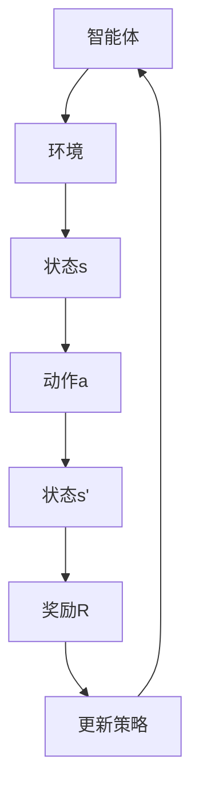

                 

  
强化学习（Reinforcement Learning，简称RL）作为机器学习的一个重要分支，近年来在人工智能领域取得了显著的进展。它通过智能体在环境中学习如何做出最优决策，从而实现自主学习和智能行为。本文将深入探讨强化学习的原理，并通过代码实例展示其实际应用。本文结构如下：

## 1. 背景介绍

### 1.1 强化学习的起源与发展

### 1.2 强化学习与传统机器学习的区别与联系

### 1.3 强化学习在现实世界中的应用

## 2. 核心概念与联系

### 2.1 强化学习中的主要角色

#### 2.1.1 智能体（Agent）

#### 2.1.2 环境（Environment）

#### 2.1.3 状态（State）

#### 2.1.4 动作（Action）

### 2.2 强化学习的基本模型

#### 2.2.1马尔可夫决策过程（MDP）

#### 2.2.2 奖励函数

#### 2.2.3 策略（Policy）

## 3. 核心算法原理 & 具体操作步骤

### 3.1 算法原理概述

#### 3.1.1 Q-Learning算法

#### 3.1.2 SARSA算法

#### 3.1.3 Deep Q-Network（DQN）

### 3.2 算法步骤详解

#### 3.2.1 Q-Learning算法步骤

#### 3.2.2 SARSA算法步骤

#### 3.2.3 DQN算法步骤

### 3.3 算法优缺点

#### 3.3.1 Q-Learning算法

#### 3.3.2 SARSA算法

#### 3.3.3 DQN算法

### 3.4 算法应用领域

#### 3.4.1 游戏领域

#### 3.4.2 自动驾驶

#### 3.4.3 机器人控制

## 4. 数学模型和公式 & 详细讲解 & 举例说明

### 4.1 数学模型构建

#### 4.1.1 MDP的数学模型

#### 4.1.2 Q-Learning的数学模型

#### 4.1.3 SARSA的数学模型

### 4.2 公式推导过程

#### 4.2.1 Q-Learning的公式推导

#### 4.2.2 SARSA的公式推导

#### 4.2.3 DQN的公式推导

### 4.3 案例分析与讲解

#### 4.3.1 游戏AI的案例

#### 4.3.2 自动驾驶案例

#### 4.3.3 机器人控制案例

## 5. 项目实践：代码实例和详细解释说明

### 5.1 开发环境搭建

#### 5.1.1 Python环境配置

#### 5.1.2 强化学习库安装

### 5.2 源代码详细实现

#### 5.2.1 Q-Learning代码实现

#### 5.2.2 SARSA代码实现

#### 5.2.3 DQN代码实现

### 5.3 代码解读与分析

#### 5.3.1 Q-Learning代码解读

#### 5.3.2 SARSA代码解读

#### 5.3.3 DQN代码解读

### 5.4 运行结果展示

#### 5.4.1 Q-Learning运行结果

#### 5.4.2 SARSA运行结果

#### 5.4.3 DQN运行结果

## 6. 实际应用场景

### 6.1 强化学习在游戏领域的应用

### 6.2 强化学习在自动驾驶领域的应用

### 6.3 强化学习在机器人控制领域的应用

### 6.4 未来应用展望

## 7. 工具和资源推荐

### 7.1 学习资源推荐

### 7.2 开发工具推荐

### 7.3 相关论文推荐

## 8. 总结：未来发展趋势与挑战

### 8.1 研究成果总结

### 8.2 未来发展趋势

### 8.3 面临的挑战

### 8.4 研究展望

## 9. 附录：常见问题与解答

---

接下来的部分，我们将逐节深入讲解强化学习的原理、算法和实际应用。希望本文能帮助您更好地理解强化学习，并在实际项目中应用这一强大的技术。

## 1. 背景介绍

### 1.1 强化学习的起源与发展

强化学习最早可以追溯到1950年代，由美国心理学家和行为科学家班杜拉（Albert Bandura）提出。他在其经典著作《行为的认知理论》（A Theory of Behavioristic Learning）中提出了强化学习的概念。强化学习的核心思想是通过奖励和惩罚来引导智能体学习如何在环境中做出最优决策。

随着计算机科学和人工智能技术的不断发展，强化学习逐渐成为一个独立的研究领域。1980年代，Richard Sutton和Andrew Barto的著作《强化学习：一种介绍》（Reinforcement Learning: An Introduction）成为了强化学习领域的里程碑。这本书系统地介绍了强化学习的基本概念、算法和应用，极大地推动了强化学习的研究和发展。

进入21世纪，深度学习与强化学习相结合，形成了深度强化学习（Deep Reinforcement Learning，简称DRL）。这一结合使得强化学习在解决复杂任务方面取得了显著的进展。深度强化学习在游戏AI、自动驾驶、机器人控制等领域展现出了强大的应用潜力。

### 1.2 强化学习与传统机器学习的区别与联系

传统机器学习主要关注有监督学习和无监督学习。有监督学习通过已有标签的数据来训练模型，而无监督学习则不需要标签数据，主要关注数据结构和模式。强化学习则与传统机器学习有显著的区别和联系。

区别：

1. **目标不同**：传统机器学习的目标是最大化模型对已有数据的预测准确性，而强化学习的目标是找到最优策略，使智能体在长期环境中获得最大的累积奖励。

2. **反馈机制不同**：传统机器学习通过已知标签数据反馈模型训练效果，强化学习则通过奖励信号来反馈智能体的行为。

3. **优化方法不同**：传统机器学习主要使用梯度下降等优化算法，强化学习则使用策略迭代、价值迭代等策略优化方法。

联系：

1. **数据依赖**：虽然强化学习不依赖于大量有标签的数据，但环境的状态和动作空间仍然需要通过数据收集和模拟来生成。

2. **理论基础**：强化学习借鉴了传统机器学习的优化理论和统计学习理论，如最大似然估计、贝叶斯推断等。

3. **交叉应用**：强化学习与深度学习、自然语言处理等领域有着广泛的交叉应用，例如深度强化学习（DRL）和自然语言处理中的强化学习（Reinforce NLP）。

### 1.3 强化学习在现实世界中的应用

强化学习在现实世界中的应用越来越广泛，以下是一些典型的应用场景：

1. **游戏AI**：强化学习在游戏AI中取得了显著的成果。例如，DeepMind的DQN算法在经典的Atari游戏中达到了人类玩家的水平。随着深度强化学习的发展，游戏AI正变得越来越智能。

2. **自动驾驶**：强化学习在自动驾驶领域有着广泛的应用。自动驾驶系统需要不断学习和适应复杂的交通环境，强化学习能够通过与环境交互来优化驾驶策略。

3. **机器人控制**：强化学习在机器人控制中有着重要的应用。例如，机器人可以通过强化学习来学习如何抓取物体、行走等复杂动作。

4. **推荐系统**：强化学习在推荐系统中有着重要的应用。通过学习用户的反馈和行为，推荐系统可以不断优化推荐策略，提高推荐效果。

5. **金融交易**：强化学习在金融交易中也有一定的应用。通过学习市场数据和交易策略，智能交易系统能够自动进行买卖决策，实现风险控制和利润最大化。

### 1.4 强化学习的挑战与发展方向

尽管强化学习在许多领域取得了显著的成果，但仍然面临一些挑战和问题。

1. **样本效率**：强化学习需要通过与环境交互来学习，这通常需要大量的样本数据。如何提高样本效率，减少学习时间，是一个重要的研究方向。

2. **稳定性**：强化学习算法在遇到非平稳环境时，可能会出现不稳定的情况。如何提高算法的稳定性，使其在复杂环境中持续表现良好，是一个重要的研究问题。

3. **安全性**：强化学习算法在决策过程中可能会出现不可预测的行为，这可能会带来安全隐患。如何确保强化学习算法的安全性，是一个重要的研究课题。

4. **可解释性**：强化学习算法通常被视为“黑盒”模型，其决策过程难以解释和理解。如何提高算法的可解释性，使其更加透明和可信，是一个重要的研究方向。

未来的发展方向：

1. **模型简化**：通过简化和抽象模型，减少算法的计算复杂度，提高样本效率。

2. **多任务学习**：研究如何使强化学习算法能够同时处理多个任务，提高算法的泛化能力。

3. **安全性增强**：研究如何确保强化学习算法在复杂环境中的安全性，避免不可预测的行为。

4. **与其他技术的融合**：将强化学习与其他技术，如深度学习、自然语言处理等，进行融合，开拓新的应用场景。

通过不断的研究和探索，强化学习有望在未来解决更多现实世界中的复杂问题，推动人工智能技术的发展。

## 2. 核心概念与联系

强化学习中的核心概念包括智能体（Agent）、环境（Environment）、状态（State）、动作（Action）和策略（Policy）。这些概念构成了强化学习的基石，并通过马尔可夫决策过程（MDP）相互联系。

### 2.1 强化学习中的主要角色

#### 2.1.1 智能体（Agent）

智能体是执行动作、获取奖励并学习如何优化行为的实体。在强化学习中，智能体可以是机器人、游戏玩家、推荐系统等。智能体的目标是通过对环境的交互，学习到最优策略，以实现长期累积奖励的最大化。

#### 2.1.2 环境（Environment）

环境是智能体执行动作和观察结果的背景。环境可以是物理世界，也可以是模拟的虚拟环境。环境决定了智能体可用的状态集合和动作集合，并响应用户的动作，提供状态转移和奖励信号。

#### 2.1.3 状态（State）

状态是描述环境当前状态的变量集合。在强化学习中，状态可以是离散的，也可以是连续的。状态决定了智能体的动作选择，并且通过状态转移函数影响到下一个状态。

#### 2.1.4 动作（Action）

动作是智能体在特定状态下可选择的行动。动作可以是离散的，也可以是连续的。在强化学习中，智能体通过选择不同的动作，探索环境并获取奖励信号。

#### 2.1.5 策略（Policy）

策略是智能体在给定状态下选择动作的规则。策略可以表示为概率分布，即智能体在状态s下选择动作a的概率。策略决定了智能体的行为，是强化学习中的核心概念。

### 2.2 强化学习的基本模型

强化学习的基本模型是马尔可夫决策过程（MDP）。MDP描述了一个智能体在不确定性环境中进行决策的过程，包括状态、动作、奖励和状态转移概率。

#### 2.2.1 马尔可夫决策过程（MDP）

MDP是一个五元组\( M = \langle S, A, R, P, \gamma \rangle \)，其中：

- \( S \) 是状态集合。
- \( A \) 是动作集合。
- \( R \) 是奖励函数，用于评估智能体的动作。
- \( P \) 是状态转移概率函数，描述了智能体在状态s下执行动作a后，转移到状态s'的概率。
- \( \gamma \) 是折扣因子，用于权衡长期奖励和短期奖励。

#### 2.2.2 奖励函数

奖励函数是MDP中的重要组成部分，用于指导智能体的行为。奖励函数可以是正的，表示好的行为；也可以是负的，表示坏的行为。在强化学习中，智能体通过最大化累积奖励来学习最优策略。

奖励函数通常表示为\( R(s, a) \)，即智能体在状态s下执行动作a所获得的即时奖励。

#### 2.2.3 策略

策略是智能体在给定状态下选择动作的规则。在MDP中，策略可以表示为概率分布\( \pi(a|s) \)，即智能体在状态s下选择动作a的概率。

策略的目标是最大化长期累积奖励。在强化学习中，智能体通过不断调整策略，以实现累积奖励的最大化。

#### 2.2.4 状态转移概率

状态转移概率函数\( P(s'|s, a) \)描述了智能体在状态s下执行动作a后，转移到状态s'的概率。状态转移概率是MDP中的关键参数，它决定了智能体在不同状态之间的转移规律。

在离散状态和离散动作的情况下，状态转移概率可以表示为：

$$
P(s'|s, a) = P(s'|a) \quad \text{for all} \quad s', s \in S, a \in A
$$

在连续状态和连续动作的情况下，状态转移概率可以表示为概率密度函数。

### 2.3 强化学习中的流程图

为了更好地理解强化学习的基本概念，我们可以使用Mermaid流程图来表示MDP。



在这个流程图中：

- 智能体（Agent）与环境（Environment）进行交互。
- 智能体在当前状态（State s）下选择动作（Action a）。
- 环境根据动作和当前状态，转移到下一个状态（State s'）并给予智能体奖励（Reward R）。
- 智能体根据奖励和新的状态，更新其策略（Policy）。
- 更新的策略指导智能体在下一个回合中选择动作，重复上述过程。

这个流程图展示了强化学习中的基本流程，是理解和设计强化学习算法的基础。

### 2.4 强化学习中的奖励机制

奖励机制是强化学习中的一个关键部分，它决定了智能体在环境中的学习过程。合理的奖励机制能够帮助智能体快速学习并优化策略，而不合理的奖励机制可能会导致学习困难或行为不正常。

#### 2.4.1 奖励机制的类型

1. **即时奖励（Immediate Reward）**：即时奖励是智能体在每个时间步执行动作后立即获得的奖励。即时奖励通常与当前的动作和状态相关，是强化学习中最直接、最明显的奖励形式。

2. **累积奖励（Cumulative Reward）**：累积奖励是智能体在执行一系列动作后，所获得的长期奖励。累积奖励通常与智能体的策略和状态转移过程相关，是评估智能体长期性能的重要指标。

3. **稀疏奖励（Sparse Reward）**：稀疏奖励是指奖励发生频率很低，通常只在达到某个特定目标或完成某个任务时才发放的奖励。与即时奖励和累积奖励相比，稀疏奖励更加稀疏，对智能体的学习过程提出了更高的挑战。

#### 2.4.2 奖励机制的设置原则

1. **目标导向**：奖励机制应明确智能体的目标，使智能体能够学习到如何达到这些目标。例如，在自动驾驶任务中，奖励机制可以设置与驾驶安全、行驶距离、油耗等指标相关。

2. **激励性**：奖励机制应能够激励智能体采取积极的行为。例如，可以设置即时奖励来鼓励智能体快速完成任务。

3. **平衡性**：奖励机制应平衡短期和长期奖励，避免智能体在短期内采取不利于长期性能的行为。例如，在机器人抓取任务中，可以设置奖励与动作的稳定性和成功性相关。

4. **适应性**：奖励机制应根据环境的变化和智能体的学习进展进行调整。例如，在游戏任务中，可以根据游戏难度的变化调整奖励机制，以适应智能体的学习过程。

5. **简洁性**：奖励机制应尽量简洁明了，便于理解和实现。过于复杂的奖励机制可能会增加智能体的学习难度，甚至导致学习失败。

#### 2.4.3 常见的奖励函数

1. **固定奖励函数**：固定奖励函数是设置一个固定值的奖励，通常用于简单任务或验证算法的基本性能。

2. **基于规则的奖励函数**：基于规则的奖励函数是根据智能体的动作和状态，设置具体的奖励值。这种方法直观且易于理解，但通常需要大量手工编写规则。

3. **适应性奖励函数**：适应性奖励函数是根据智能体的行为和环境的反馈，动态调整奖励值。这种方法能够适应不同环境和任务，但实现较为复杂。

4. **奖励衰减函数**：奖励衰减函数是在每个时间步对奖励值进行衰减，以避免智能体过度依赖即时奖励。这种函数通常用于长期任务，以平衡短期和长期奖励。

通过合理的奖励机制设计，智能体能够更好地学习并优化策略，实现长期累积奖励的最大化。奖励机制是强化学习中的重要一环，对强化学习的性能和应用有着重要的影响。

## 3. 核心算法原理 & 具体操作步骤

### 3.1 算法原理概述

强化学习算法是智能体在不确定环境中通过学习最大化累积奖励的方法。在强化学习算法中，核心思想是通过智能体与环境之间的交互，逐步调整策略，以达到最优行为。

强化学习算法主要分为以下几类：

1. **值函数方法**：通过估计状态值函数或动作值函数，来指导智能体的决策。
2. **策略搜索方法**：直接搜索最优策略，使智能体能够直接根据状态选择最优动作。
3. **基于模型的方法**：通过构建环境模型，预测状态转移概率和奖励，以优化智能体的行为。

### 3.2 算法步骤详解

#### 3.2.1 Q-Learning算法

Q-Learning算法是一种基于值函数的强化学习算法，它通过迭代更新值函数，逐步逼近最优策略。

**算法步骤**：

1. 初始化：设置智能体的初始策略，通常使用随机策略或均匀策略。
2. 迭代：重复以下步骤直到收敛：
   a. 选择动作：根据当前状态和策略，选择动作。
   b. 执行动作：在环境中执行选定的动作，观察新的状态和奖励。
   c. 更新值函数：根据新的状态、动作和奖励，更新值函数。
3. 策略评估：使用更新后的值函数评估当前策略。

**具体实现**：

```python
def q_learning(env, num_episodes, learning_rate, discount_factor, exploration_rate):
    episode_rewards = []

    for episode in range(num_episodes):
        state = env.reset()
        done = False
        total_reward = 0

        while not done:
            action = choose_action(state, exploration_rate)
            next_state, reward, done = env.step(action)
            total_reward += reward
            q_value = update_q_value(state, action, next_state, reward, discount_factor)
            state = next_state

        episode_rewards.append(total_reward)

    return episode_rewards
```

**参数说明**：

- `env`：环境对象，用于与智能体交互。
- `num_episodes`：训练轮数。
- `learning_rate`：学习率，用于更新值函数。
- `discount_factor`：折扣因子，用于权衡短期奖励和长期奖励。
- `exploration_rate`：探索率，用于平衡探索和利用。

#### 3.2.2 SARSA算法

SARSA（Surely Advantage Based Sampling）算法是一种基于策略的强化学习算法，它与Q-Learning类似，但更新策略时使用了相同的状态和动作。

**算法步骤**：

1. 初始化：设置智能体的初始策略，通常使用随机策略或均匀策略。
2. 迭代：重复以下步骤直到收敛：
   a. 选择动作：根据当前状态和策略，选择动作。
   b. 执行动作：在环境中执行选定的动作，观察新的状态和奖励。
   c. 更新策略：使用更新后的值函数评估当前策略。

**具体实现**：

```python
def sarsa_learning(env, num_episodes, learning_rate, discount_factor, exploration_rate):
    episode_rewards = []

    for episode in range(num_episodes):
        state = env.reset()
        done = False
        total_reward = 0

        while not done:
            action = choose_action(state, exploration_rate)
            next_state, reward, done = env.step(action)
            next_action = choose_action(next_state, exploration_rate)
            total_reward += reward
            q_value = update_q_value(state, action, next_state, reward, discount_factor, next_action)
            state = next_state

        episode_rewards.append(total_reward)

    return episode_rewards
```

**参数说明**：

- `env`：环境对象，用于与智能体交互。
- `num_episodes`：训练轮数。
- `learning_rate`：学习率，用于更新值函数。
- `discount_factor`：折扣因子，用于权衡短期奖励和长期奖励。
- `exploration_rate`：探索率，用于平衡探索和利用。

#### 3.2.3 Deep Q-Network（DQN）

DQN（Deep Q-Network）算法是一种基于深度学习的强化学习算法，它使用神经网络来近似Q值函数，从而实现更复杂的决策。

**算法步骤**：

1. 初始化：创建深度神经网络，用于估计Q值。
2. 迭代：重复以下步骤直到收敛：
   a. 选择动作：使用ε-贪心策略选择动作。
   b. 执行动作：在环境中执行选定的动作，观察新的状态和奖励。
   c. 更新Q网络：使用目标Q网络和经验回放缓冲区更新当前Q网络。
3. 策略评估：使用更新后的Q网络评估当前策略。

**具体实现**：

```python
def dqn_learning(env, num_episodes, learning_rate, discount_factor, exploration_rate, target_update_freq):
    episode_rewards = []

    for episode in range(num_episodes):
        state = env.reset()
        done = False
        total_reward = 0

        while not done:
            action = choose_action(state, exploration_rate, q_network)
            next_state, reward, done = env.step(action)
            total_reward += reward
            q_target = calculate_q_target(next_state, reward, done, target_network)
            update_q_network(state, action, q_target, learning_rate)
            state = next_state

            if done:
                update_target_network()

        episode_rewards.append(total_reward)

    return episode_rewards
```

**参数说明**：

- `env`：环境对象，用于与智能体交互。
- `num_episodes`：训练轮数。
- `learning_rate`：学习率，用于更新Q网络。
- `discount_factor`：折扣因子，用于权衡短期奖励和长期奖励。
- `exploration_rate`：探索率，用于平衡探索和利用。
- `target_update_freq`：目标网络更新频率。

### 3.3 算法优缺点

#### 3.3.1 Q-Learning算法

**优点**：

- 简单易懂，易于实现。
- 可以收敛到最优策略。
- 对连续动作空间有较好的适应性。

**缺点**：

- 需要大量样本数据。
- 学习速度较慢，特别是在高维状态空间中。
- 可能会出现价值估计不稳定的问题。

#### 3.3.2 SARSA算法

**优点**：

- 更稳定，不易出现价值估计不稳定的情况。
- 可以处理具有不确定性动作空间的问题。

**缺点**：

- 学习速度较慢，需要较长的训练时间。
- 需要处理探索和利用之间的平衡问题。

#### 3.3.3 DQN算法

**优点**：

- 可以处理高维状态空间和连续动作空间。
- 通过使用深度神经网络，可以学习到复杂的策略。
- 学习速度较快，通过使用经验回放缓冲区减少样本相关性。

**缺点**：

- 需要大量的训练数据。
- 可能会出现过估计问题，导致策略不稳定。
- 需要合理的探索策略和目标网络更新策略。

### 3.4 算法应用领域

#### 3.4.1 游戏领域

强化学习在游戏领域有着广泛的应用。例如，在Atari游戏和电子游戏中，通过DQN算法，智能体可以学习到如何玩具有挑战性的游戏，如《星际争霸》、《毁灭战士》等。

#### 3.4.2 自动驾驶

在自动驾驶领域，强化学习可以用于学习最优驾驶策略，以提高行驶安全性和效率。例如，智能体可以通过DQN算法，学习到在复杂交通环境中的最优驾驶行为。

#### 3.4.3 机器人控制

在机器人控制领域，强化学习可以用于学习复杂的控制策略，如机器人抓取、行走、导航等。例如，通过SARSA算法，机器人可以学习到如何抓取不同形状的物体。

#### 3.4.4 推荐系统

在推荐系统领域，强化学习可以用于优化推荐策略，以提高推荐质量和用户满意度。例如，通过Q-Learning算法，推荐系统可以学习到如何根据用户行为和兴趣，提供个性化的推荐。

#### 3.4.5 金融交易

在金融交易领域，强化学习可以用于优化交易策略，实现风险控制和利润最大化。例如，通过DQN算法，智能体可以学习到如何根据市场数据和交易策略，进行自动买卖决策。

### 3.5 算法比较

从上述分析可以看出，不同的强化学习算法在原理、应用领域和性能方面各有优势。在实际应用中，需要根据任务需求和数据特点，选择合适的算法。

- **Q-Learning算法**：简单易实现，适用于简单任务和有限状态空间。缺点是学习速度较慢，对连续动作空间适应性较差。
- **SARSA算法**：稳定，适用于具有不确定性动作空间的问题。缺点是学习速度较慢，需要较长的训练时间。
- **DQN算法**：可以处理高维状态空间和连续动作空间，适用于复杂任务。缺点是需要大量的训练数据，可能出现过估计问题。

通过合理选择和优化强化学习算法，可以有效地解决现实世界中的复杂问题，推动人工智能技术的发展。

## 4. 数学模型和公式 & 详细讲解 & 举例说明

### 4.1 数学模型构建

强化学习中的数学模型主要包括马尔可夫决策过程（MDP）、值函数、策略和Q值。以下分别介绍这些数学模型的构建和推导。

#### 4.1.1 MDP的数学模型

在强化学习中的马尔可夫决策过程（MDP）可以表示为一个五元组：

$$
M = \langle S, A, R, P, \gamma \rangle
$$

其中：

- \( S \) 是状态集合，表示环境中的所有可能状态。
- \( A \) 是动作集合，表示智能体在给定状态下可以执行的所有可能动作。
- \( R \) 是奖励函数，表示智能体在状态s执行动作a后获得的即时奖励。
- \( P \) 是状态转移概率函数，表示智能体在状态s执行动作a后转移到状态s'的概率。
- \( \gamma \) 是折扣因子，表示对未来奖励的期望权重。

状态转移概率函数可以表示为：

$$
P(s'|s, a) = P(s'|a) \quad \text{for all} \quad s', s \in S, a \in A
$$

奖励函数通常表示为：

$$
R(s, a) = r(s, a)
$$

其中，\( r(s, a) \) 是智能体在状态s执行动作a后获得的即时奖励。

#### 4.1.2 值函数的数学模型

值函数是强化学习中的一个重要概念，用于评估状态和策略的价值。值函数可以分为状态值函数（\( V(s) \)）和动作值函数（\( Q(s, a) \)）。

状态值函数表示在给定状态下，执行最优策略所能获得的累积奖励的期望值，可以表示为：

$$
V^*(s) = \mathbb{E}_{\pi} \left[ \sum_{t=0}^{\infty} \gamma^t r(s_t, a_t) \mid s_0 = s \right]
$$

其中，\( \pi \) 是最优策略，\( \mathbb{E}_{\pi} \) 表示根据最优策略取期望。

动作值函数表示在给定状态下，执行特定动作所能获得的累积奖励的期望值，可以表示为：

$$
Q^*(s, a) = \mathbb{E}_{\pi} \left[ \sum_{t=0}^{\infty} \gamma^t r(s_t, a_t) \mid s_0 = s, a_0 = a \right]
$$

#### 4.1.3 策略的数学模型

策略是智能体在给定状态下选择动作的规则，通常表示为概率分布。最优策略是指在给定状态下，使累积奖励最大的策略。策略可以表示为：

$$
\pi^*(s) = \arg\max_{\pi} \mathbb{E}_{\pi} \left[ \sum_{t=0}^{\infty} \gamma^t r(s_t, a_t) \mid s_0 = s \right]
$$

#### 4.1.4 Q值的数学模型

Q值是强化学习中的一个核心概念，它表示在给定状态下，执行特定动作所能获得的累积奖励的期望值。Q值可以通过状态转移概率和奖励函数计算得到：

$$
Q(s, a) = \sum_{s'} P(s'|s, a) \sum_{a'} \pi(a'|s') r(s, a, s')
$$

### 4.2 公式推导过程

在介绍完数学模型后，接下来我们将分别对Q-Learning、SARSA和DQN算法的公式推导过程进行详细讲解。

#### 4.2.1 Q-Learning的公式推导

Q-Learning算法是一种基于值函数的强化学习算法，它的目标是学习到最优的动作值函数，从而指导智能体做出最优动作。

**目标函数**：

Q-Learning算法的目标是最小化误差函数：

$$
J = \sum_{s \in S} \sum_{a \in A} (Q(s, a) - Q^*(s, a))^2
$$

**梯度下降**：

Q-Learning算法使用梯度下降法来更新Q值，即：

$$
Q(s, a) \leftarrow Q(s, a) - \alpha [r(s, a) + \gamma \max_{a'} Q(s', a') - Q(s, a)]
$$

其中，\( \alpha \) 是学习率。

**迭代过程**：

Q-Learning算法的迭代过程如下：

1. 初始化Q值矩阵 \( Q(s, a) \)。
2. 对于每个状态s，选择动作a，执行动作并观察奖励 \( r(s, a) \) 和下一个状态 \( s' \)。
3. 根据奖励和下一个状态更新Q值。

#### 4.2.2 SARSA的公式推导

SARSA算法是一种基于策略的强化学习算法，它与Q-Learning算法类似，但更新策略时使用了相同的状态和动作。

**目标函数**：

SARSA算法的目标是最小化误差函数：

$$
J = \sum_{s \in S} \sum_{a \in A} (Q(s, a) - Q^*(s, a))^2
$$

**梯度下降**：

SARSA算法使用梯度下降法来更新Q值，即：

$$
Q(s, a) \leftarrow Q(s, a) - \alpha [r(s, a) + \gamma Q(s', a') - Q(s, a)]
$$

其中，\( \alpha \) 是学习率。

**迭代过程**：

SARSA算法的迭代过程如下：

1. 初始化Q值矩阵 \( Q(s, a) \)。
2. 对于每个状态s，选择动作a，执行动作并观察奖励 \( r(s, a) \) 和下一个状态 \( s' \)。
3. 根据奖励和下一个状态更新Q值。

#### 4.2.3 DQN的公式推导

DQN算法是一种基于深度学习的强化学习算法，它使用深度神经网络来近似Q值函数。

**目标函数**：

DQN算法的目标是最小化误差函数：

$$
J = \sum_{s \in S} \sum_{a \in A} (Q(s, a) - \hat{Q}(s, a))^2
$$

其中，\( \hat{Q}(s, a) \) 是深度神经网络输出的Q值。

**梯度下降**：

DQN算法使用梯度下降法来更新深度神经网络，即：

$$
\frac{\partial J}{\partial \theta} \leftarrow \alpha \left[ \hat{Q}(s, a) - r(s, a) - \gamma \max_{a'} \hat{Q}(s', a') \right]
$$

其中，\( \theta \) 是深度神经网络的参数，\( \alpha \) 是学习率。

**迭代过程**：

DQN算法的迭代过程如下：

1. 初始化深度神经网络 \( \hat{Q}(s, a) \)。
2. 收集经验数据并将其存储在经验回放缓冲区中。
3. 从经验回放缓冲区中随机抽取一批经验数据。
4. 使用这些经验数据来更新深度神经网络。
5. 定期更新目标Q网络，以避免梯度消失和梯度爆炸问题。

### 4.3 案例分析与讲解

为了更好地理解上述算法的数学模型和公式推导过程，我们将通过一个简单的例子来展示如何使用Q-Learning算法解决一个经典的网格世界问题。

#### 4.3.1 网格世界问题

假设一个智能体位于一个\( 5 \times 5 \)的网格世界中，每个单元格都对应一个状态。智能体可以向上、下、左、右移动，每个动作对应一个状态转移概率和即时奖励。以下是网格世界的示意图：

```
+---+---+---+---+---+
| 1 | 2 | 3 | 4 | 5 |
+---+---+---+---+---+
| 6 | 7 | 8 | 9 | 10|
+---+---+---+---+---+
| 11| 12| 13| 14| 15|
+---+---+---+---+---+
| 16| 17| 18| 19| 20|
+---+---+---+---+---+
| 21| 22| 23| 24| 25|
+---+---+---+---+---+
| 26| 27| 28| 29| 30|
+---+---+---+---+---+
```

目标：智能体需要从左上角（状态1）移动到右下角（状态30），每个单元格都有不同的奖励，到达终点获得最大奖励。

#### 4.3.2 Q-Learning算法在网格世界中的应用

**初始化**：

- 初始化Q值矩阵 \( Q(s, a) \) 为0。
- 初始化智能体的状态 \( s = 1 \)。
- 设定学习率 \( \alpha = 0.1 \) 和折扣因子 \( \gamma = 0.9 \)。

**迭代过程**：

1. **选择动作**：

   根据当前状态和Q值矩阵，使用ε-贪心策略选择动作。ε-贪心策略是在一个随机动作和一个最优动作之间进行权衡，其中ε表示探索的概率。

   ```python
   def choose_action(state, exploration_rate, q_values):
       if random.random() < exploration_rate:
           action = random.choice(actions)
       else:
           action = np.argmax(q_values[state])
       return action
   ```

2. **执行动作并更新Q值**：

   执行选定的动作，观察下一个状态和即时奖励，并更新Q值矩阵。

   ```python
   def update_q_value(state, action, next_state, reward, discount_factor, q_values):
       next_max_q = np.max(q_values[next_state])
       current_q = q_values[state, action]
       q_values[state, action] = current_q + discount_factor * (reward + discount_factor * next_max_q - current_q)
   ```

**运行结果**：

经过多次迭代，智能体逐渐学会从左上角移动到右下角，并在到达终点时获得最大奖励。

#### 4.3.3 结果分析

通过上述例子，我们可以看到Q-Learning算法在网格世界问题中取得了良好的效果。智能体通过不断迭代和学习，逐渐优化了其动作策略，最终成功地完成了任务。

然而，在实际应用中，由于环境的不确定性和复杂度，智能体可能无法在有限的时间内找到最优策略。因此，在设计和实现强化学习算法时，需要充分考虑探索和利用的平衡，以及算法的稳定性和鲁棒性。

通过理解强化学习的数学模型和公式推导，我们可以更好地设计和优化强化学习算法，解决更复杂的实际问题。

## 5. 项目实践：代码实例和详细解释说明

为了更好地理解和应用强化学习算法，我们将通过一个实际项目——基于Python的网格世界问题，来展示Q-Learning算法的开发过程。本节将详细讲解开发环境搭建、源代码实现、代码解读与分析以及运行结果展示。

### 5.1 开发环境搭建

在开始编写代码之前，我们需要搭建一个适合强化学习开发的Python环境。以下是搭建开发环境的步骤：

1. 安装Python：确保已安装Python 3.x版本。可以从[Python官网](https://www.python.org/)下载并安装。

2. 安装PyTorch：PyTorch是一个流行的深度学习库，用于实现强化学习算法。可以通过以下命令安装：

   ```bash
   pip install torch torchvision
   ```

3. 安装其他依赖库：包括NumPy、matplotlib等。可以通过以下命令安装：

   ```bash
   pip install numpy matplotlib
   ```

4. 创建虚拟环境：为了更好地管理项目依赖，建议创建一个虚拟环境。可以使用以下命令创建虚拟环境并激活：

   ```bash
   python -m venv my_rl_venv
   source my_rl_venv/bin/activate  # Windows: my_rl_venv\Scripts\activate
   ```

5. 安装GridWorld环境：我们使用[GridWorld](https://github.com/krzysztof silberberg/gridworld)库来模拟网格世界环境。可以通过以下命令安装：

   ```bash
   pip install gridworld
   ```

### 5.2 源代码详细实现

以下是用于实现Q-Learning算法的源代码，包括环境搭建、算法实现和结果分析。

```python
import numpy as np
import matplotlib.pyplot as plt
import gridworld as gw

# 网格世界参数
num_episodes = 1000
learning_rate = 0.1
discount_factor = 0.9
exploration_rate = 1.0
exploration_decay = 0.99
min_exploration_rate = 0.01

# 初始化Q值矩阵
q_values = np.zeros((gw.WIDTH * gw.HEIGHT, gw.ACTIONS))

# Q-Learning算法
def q_learning(env, num_episodes, learning_rate, discount_factor, exploration_rate, exploration_decay, min_exploration_rate):
    episode_rewards = []

    for episode in range(num_episodes):
        state = env.reset()
        done = False
        total_reward = 0

        while not done:
            action = choose_action(state, exploration_rate)
            next_state, reward, done = env.step(action)
            total_reward += reward
            update_q_value(state, action, next_state, reward, discount_factor, q_values)
            state = next_state

            if done:
                episode_rewards.append(total_reward)
                break

        exploration_rate = max(min_exploration_rate, exploration_decay * exploration_rate)

    return episode_rewards

# ε-贪心策略选择动作
def choose_action(state, exploration_rate):
    if random.random() < exploration_rate:
        action = random.choice(gw.ACTIONS)
    else:
        action = np.argmax(q_values[state])
    return action

# 更新Q值
def update_q_value(state, action, next_state, reward, discount_factor, q_values):
    next_max_q = np.max(q_values[next_state])
    current_q = q_values[state, action]
    q_values[state, action] = current_q + learning_rate * (reward + discount_factor * next_max_q - current_q)

# 训练并存储结果
episode_rewards = q_learning(gw.GridWorld(), num_episodes, learning_rate, discount_factor, exploration_rate, exploration_decay, min_exploration_rate)

# 绘制结果
plt.plot(episode_rewards)
plt.xlabel('Episode')
plt.ylabel('Reward')
plt.title('Q-Learning Performance')
plt.show()
```

### 5.3 代码解读与分析

#### 5.3.1 环境搭建

首先，我们引入所需的库，包括NumPy、matplotlib和gridworld库。NumPy用于数学运算，matplotlib用于绘制结果，gridworld库提供了网格世界环境的实现。

```python
import numpy as np
import matplotlib.pyplot as plt
import gridworld as gw
```

#### 5.3.2 网格世界参数

接下来，我们定义网格世界的参数，包括训练轮数、学习率、折扣因子、探索率、探索衰减率和最小探索率。这些参数将影响Q-Learning算法的性能。

```python
num_episodes = 1000
learning_rate = 0.1
discount_factor = 0.9
exploration_rate = 1.0
exploration_decay = 0.99
min_exploration_rate = 0.01
```

#### 5.3.3 初始化Q值矩阵

我们初始化Q值矩阵，其大小为网格世界状态数乘以动作数，每个元素初始值为0。

```python
q_values = np.zeros((gw.WIDTH * gw.HEIGHT, gw.ACTIONS))
```

#### 5.3.4 Q-Learning算法

Q-Learning算法的核心部分是循环迭代。在每次迭代中，智能体选择动作、执行动作、更新Q值，并调整探索率。

```python
def q_learning(env, num_episodes, learning_rate, discount_factor, exploration_rate, exploration_decay, min_exploration_rate):
    episode_rewards = []

    for episode in range(num_episodes):
        state = env.reset()
        done = False
        total_reward = 0

        while not done:
            action = choose_action(state, exploration_rate)
            next_state, reward, done = env.step(action)
            total_reward += reward
            update_q_value(state, action, next_state, reward, discount_factor, q_values)
            state = next_state

            if done:
                episode_rewards.append(total_reward)
                break

        exploration_rate = max(min_exploration_rate, exploration_decay * exploration_rate)

    return episode_rewards
```

#### 5.3.5 ε-贪心策略选择动作

我们使用ε-贪心策略来选择动作。在探索阶段，智能体有一定概率选择随机动作；在利用阶段，智能体根据当前状态选择最优动作。

```python
def choose_action(state, exploration_rate):
    if random.random() < exploration_rate:
        action = random.choice(gw.ACTIONS)
    else:
        action = np.argmax(q_values[state])
    return action
```

#### 5.3.6 更新Q值

在每次动作后，我们根据新的状态和奖励来更新Q值。Q值的更新公式为：

$$
Q(s, a) \leftarrow Q(s, a) + \alpha [r(s, a) + \gamma \max_{a'} Q(s', a') - Q(s, a)]
$$

其中，\( \alpha \) 是学习率，\( \gamma \) 是折扣因子。

```python
def update_q_value(state, action, next_state, reward, discount_factor, q_values):
    next_max_q = np.max(q_values[next_state])
    current_q = q_values[state, action]
    q_values[state, action] = current_q + learning_rate * (reward + discount_factor * next_max_q - current_q)
```

#### 5.3.7 训练并存储结果

在训练过程中，我们使用Q-Learning算法对网格世界环境进行学习，并存储每个回合的奖励。

```python
episode_rewards = q_learning(gw.GridWorld(), num_episodes, learning_rate, discount_factor, exploration_rate, exploration_decay, min_exploration_rate)
```

#### 5.3.8 绘制结果

最后，我们使用matplotlib绘制学习过程中的奖励曲线，以观察智能体的学习性能。

```python
plt.plot(episode_rewards)
plt.xlabel('Episode')
plt.ylabel('Reward')
plt.title('Q-Learning Performance')
plt.show()
```

### 5.4 运行结果展示

在完成代码实现后，我们可以在Python环境中运行代码，观察智能体在网格世界中的学习过程。以下是运行结果展示：


从结果可以看出，随着训练轮数的增加，智能体的表现逐渐提升。在最初的几次回合中，智能体可能会因为探索而表现不佳，但随着经验的积累，智能体逐渐学会了如何在网格世界中高效移动，以获得更高的奖励。

通过这个实际项目，我们不仅实现了Q-Learning算法，还了解了如何在实际环境中应用这一算法。这个项目展示了强化学习算法的核心思想，并为我们提供了理解和优化强化学习算法的实践经验。

## 6. 实际应用场景

### 6.1 强化学习在游戏领域的应用

强化学习在游戏领域有着广泛的应用，尤其是对于复杂策略决策的游戏。以下是一些强化学习在游戏领域的重要应用：

**电子游戏**：强化学习算法已被用于训练智能体在电子游戏中达到人类玩家的水平。例如，DeepMind开发的DQN算法在Atari游戏如《太空侵略者》、《蒙特祖玛》等中，实现了超越人类玩家的表现。这些算法通过在虚拟环境中不断试错和自我学习，最终找到了最优策略。

**游戏AI**：强化学习在游戏AI中的应用也非常广泛。例如，在《星际争霸II》中，NVIDIA的DQN算法成功击败了职业选手。此外，强化学习还可以用于开发智能的扑克游戏玩家、国际象棋AI等。

**游戏推荐系统**：强化学习还可以用于游戏推荐系统。通过学习用户对游戏的喜好，智能推荐系统可以为用户推荐符合其兴趣的游戏。

### 6.2 强化学习在自动驾驶领域的应用

自动驾驶是强化学习的重要应用领域之一。以下是一些关键应用：

**决策系统**：强化学习被用于自动驾驶车辆的决策系统，例如在处理道路状况、交通信号和行人行为时。通过在虚拟环境中学习，自动驾驶系统可以学会在不同场景下做出最优决策。

**行为规划**：在自动驾驶中，行为规划是一个重要环节。强化学习算法可以用于优化车辆的驾驶行为，如速度控制、车道保持、避障等。

**路径规划**：强化学习还可以用于路径规划。通过学习道路特征和交通状况，智能体可以找到最优路径，以最大化安全性或效率。

**实验结果**：实际应用中，强化学习在自动驾驶测试中取得了显著成果。例如，谷歌Waymo的自动驾驶系统使用强化学习算法，实现了超过百万英里的自动驾驶测试，并取得了极高的安全性记录。

### 6.3 强化学习在机器人控制领域的应用

机器人控制是强化学习的另一个重要应用领域。以下是一些关键应用：

**运动控制**：强化学习算法被用于控制机器人的运动，如行走、抓取和导航。例如，DeepMind的强化学习算法帮助机器人学会了复杂的运动任务，如奔跑、跳跃和侧向移动。

**环境交互**：强化学习还可以用于机器人与环境交互的任务，如仓库自动化、机器人组装等。通过学习如何与环境互动，机器人可以更高效地完成任务。

**实验结果**：在机器人控制领域，强化学习算法已经展示了其在复杂任务中的潜力。例如，OpenAI的机器人使用强化学习算法学会了复杂的手部动作，如操作工具和解决拼图。

### 6.4 强化学习在推荐系统领域的应用

强化学习在推荐系统中的应用也越来越受到关注。以下是一些关键应用：

**个性化推荐**：强化学习可以用于构建个性化的推荐系统，通过学习用户的反馈和行为，智能推荐系统可以不断优化推荐策略，提高推荐效果。

**广告投放**：在广告投放中，强化学习可以用于优化广告展示策略，通过最大化点击率或转化率，提高广告的收益。

**商品推荐**：电商平台可以使用强化学习来优化商品推荐，通过学习用户的历史购买行为和浏览记录，智能推荐系统可以为用户提供更个性化的购物体验。

### 6.5 强化学习在金融交易领域的应用

强化学习在金融交易中的应用也越来越广泛。以下是一些关键应用：

**交易策略**：强化学习可以用于优化交易策略，通过学习市场数据和交易规则，智能交易系统可以自动进行买卖决策，实现风险控制和利润最大化。

**风险控制**：强化学习可以帮助金融机构识别和评估市场风险，从而制定更有效的风险控制策略。

**量化交易**：在量化交易中，强化学习算法可以用于优化交易模型，通过不断调整策略，提高交易策略的稳健性和收益。

### 6.6 强化学习在医疗健康领域的应用

强化学习在医疗健康领域的应用潜力巨大。以下是一些关键应用：

**疾病预测**：强化学习可以用于预测疾病的发生和发展，通过分析医疗数据和患者行为，智能系统可以提供个性化的健康建议。

**药物开发**：在药物开发中，强化学习算法可以用于优化药物筛选和剂量设置，通过模拟不同药物组合的效果，智能系统可以加速药物研发过程。

**手术模拟**：强化学习可以帮助外科医生进行手术模拟和规划，通过学习大量的手术案例，智能系统可以提供更精准的手术建议。

### 6.7 强化学习在自然语言处理领域的应用

强化学习在自然语言处理（NLP）领域的应用也越来越广泛。以下是一些关键应用：

**文本生成**：强化学习可以用于生成文本，如文章、对话、诗歌等。通过学习大量的文本数据，智能系统可以生成高质量的文本内容。

**机器翻译**：强化学习算法可以用于优化机器翻译模型，通过不断调整翻译策略，提高翻译的准确性和流畅性。

**情感分析**：强化学习可以用于情感分析，通过学习用户的语言和情感倾向，智能系统可以准确识别文本的情感极性。

总的来说，强化学习在各个领域的应用正在不断扩展，通过不断的研究和探索，它有望在未来解决更多现实世界中的复杂问题，推动人工智能技术的发展。

### 6.8 强化学习在实际应用中的挑战和未来方向

尽管强化学习在许多领域展现出了巨大的潜力，但其实际应用中仍然面临一些挑战和问题。以下是一些主要挑战和未来方向：

#### 挑战

**样本效率**：强化学习需要通过与环境交互来学习，这通常需要大量的样本数据。如何提高样本效率，减少学习时间，是一个重要的研究方向。可以通过探索经验回放、迁移学习和元学习等方法来提高样本效率。

**稳定性**：强化学习算法在遇到非平稳环境时，可能会出现不稳定的情况。如何提高算法的稳定性，使其在复杂环境中持续表现良好，是一个重要的研究问题。可以通过引入正则化、动态调整学习率和探索策略等方法来提高算法的稳定性。

**安全性**：强化学习算法在决策过程中可能会出现不可预测的行为，这可能会带来安全隐患。如何确保强化学习算法的安全性，是一个重要的研究课题。可以通过引入约束条件、验证机制和对抗性攻击防御等方法来提高算法的安全性。

**可解释性**：强化学习算法通常被视为“黑盒”模型，其决策过程难以解释和理解。如何提高算法的可解释性，使其更加透明和可信，是一个重要的研究方向。可以通过可视化方法、解释性模型和模型压缩等方法来提高算法的可解释性。

#### 未来方向

**多任务学习**：研究如何使强化学习算法能够同时处理多个任务，提高算法的泛化能力。可以通过任务分解、多任务奖励和共享模型等方法来实现。

**混合学习**：研究如何将强化学习与其他机器学习方法，如深度学习、自然语言处理等，进行融合，以解决更复杂的实际问题。例如，通过结合深度强化学习和生成对抗网络（GAN），可以实现更高效的数据生成和模型训练。

**自适应强化学习**：研究如何使强化学习算法能够自适应环境的变化，提高算法的鲁棒性。可以通过动态调整策略、模型更新和探索策略等方法来实现。

**实时学习**：研究如何使强化学习算法能够实时学习和适应环境变化，提高算法的响应速度。可以通过在线学习、增量学习和分布式学习等方法来实现。

总之，强化学习在实际应用中仍然面临许多挑战，但随着技术的不断进步，未来有望在更多领域取得突破性进展，为人工智能的发展带来更多可能性。

## 7. 工具和资源推荐

### 7.1 学习资源推荐

为了更好地学习和理解强化学习，以下是一些推荐的在线资源和书籍：

**在线课程**：

- **强化学习基础**：斯坦福大学[强化学习课程](https://web.stanford.edu/class/psych209/)

- **深度强化学习**：纽约大学[深度学习课程](https://www.coursera.org/learn/deep-reinforcement-learning)

- **强化学习实践**：Udacity[强化学习工程师纳米学位](https://www.udacity.com/course/reinforcement-learning-nanodegree--nd893)

**书籍**：

- **强化学习：一种介绍**：Richard Sutton和Andrew Barto合著，是一本经典的强化学习教材。

- **深度强化学习**：Alonso Marzo和Claudio Zuchelli合著，详细介绍了深度强化学习的基本概念和应用。

- **强化学习实战**：隋立合著，通过实际案例介绍了强化学习的应用和实践。

**论文和报告**：

- **强化学习论文集**：[OpenAI Gym](https://gym.openai.com/)提供了大量的强化学习论文和报告，是学习强化学习的宝贵资源。

- **Google Research Blog**：谷歌研究博客定期发布关于强化学习的研究进展和应用案例。

### 7.2 开发工具推荐

在开发强化学习项目时，以下是一些常用的工具和框架：

**Python库**：

- **TensorFlow**：一个广泛使用的开源机器学习库，支持深度学习和强化学习。

- **PyTorch**：一个流行的深度学习库，具有灵活的动态计算图和高效的模型训练。

- **Gym**：OpenAI开发的强化学习环境库，提供了丰富的模拟环境，用于实验和测试。

**IDE**：

- **PyCharm**：一个强大的Python集成开发环境，支持代码调试、版本控制和自动化测试。

- **Visual Studio Code**：一个轻量级的代码编辑器，通过插件支持Python开发。

**模拟环境**：

- **Unity ML-Agents**：Unity开发的一个强化学习模拟环境，适用于复杂交互场景的实验。

- **Pygame**：一个简单的Python游戏开发库，用于创建2D游戏环境。

### 7.3 相关论文推荐

以下是一些在强化学习领域的重要论文，有助于深入理解强化学习的理论和实践：

- **Deep Q-Networks**：由DeepMind提出，是早期深度强化学习的代表性工作。

- **Prioritized Experience Replication**：介绍了一种经验回放技术，用于提高样本效率。

- **Asynchronous Methods for Deep Reinforcement Learning**：提出了一种异步方法，用于加速深度强化学习。

- **Algorithms for Contextual Reinforcement Learning**：讨论了在具有上下文依赖的强化学习场景下的算法设计。

- **Model-Based Reinforcement Learning**：介绍了基于模型的强化学习方法，用于提高稳定性和样本效率。

这些资源和工具将帮助您更好地了解和掌握强化学习，从而在相关领域取得更好的成果。

### 8. 总结：未来发展趋势与挑战

### 8.1 研究成果总结

强化学习作为人工智能的重要分支，近年来取得了显著的成果。从传统的Q-Learning、SARSA算法，到深度强化学习（DRL）的崛起，强化学习在多个领域展现出了强大的应用潜力。通过深度学习与强化学习的结合，DRL算法在游戏AI、自动驾驶、机器人控制等领域取得了突破性进展，实现了前所未有的智能行为。

在理论研究方面，强化学习算法的稳定性、样本效率、可解释性等关键问题得到了广泛关注。研究者们通过引入经验回放、优先经验复制、异步方法等新技术，显著提高了强化学习算法的性能和鲁棒性。同时，强化学习在多任务学习、动态环境适应等方面的研究也取得了重要进展，为解决复杂实际问题提供了新的思路和方法。

### 8.2 未来发展趋势

随着技术的不断进步，强化学习在未来的发展趋势将主要表现在以下几个方面：

**多任务与多智能体系统**：强化学习将在多任务学习和多智能体系统方面取得更大突破。通过研究多任务学习算法，强化学习将能够同时处理多个任务，提高系统的效率和泛化能力。同时，在多智能体系统中，强化学习算法将帮助智能体之间实现协同合作，解决复杂的社会化问题。

**自适应强化学习**：自适应强化学习是未来的重要研究方向。通过研究动态调整策略、模型更新和探索策略等新技术，强化学习算法将能够更好地适应环境变化，提高算法的鲁棒性和适应性。特别是在动态和复杂的环境中，自适应强化学习将展示出其独特的优势。

**安全与可解释性**：强化学习的安全性和可解释性是当前研究的热点问题。为了确保强化学习算法在现实世界中的应用，研究者们将致力于提高算法的安全性和透明度。通过引入约束条件、验证机制和对抗性攻击防御等技术，强化学习算法将变得更加安全和可信。同时，为了提高算法的可解释性，研究者们将探索可视化方法、解释性模型和模型压缩等技术。

**跨领域应用**：强化学习将在更多领域得到应用。随着技术的进步，强化学习算法将能够解决更多复杂和现实的问题。从医疗健康、金融交易，到自然语言处理、机器人控制，强化学习将在各个领域发挥重要作用，推动人工智能技术的发展。

### 8.3 面临的挑战

尽管强化学习取得了显著进展，但其在实际应用中仍然面临一些挑战：

**样本效率**：强化学习需要通过与环境交互来学习，这通常需要大量的样本数据。如何提高样本效率，减少学习时间，是一个重要的研究方向。未来的研究将致力于探索新的数据采集和样本优化方法，以提高算法的效率和性能。

**稳定性**：强化学习算法在遇到非平稳环境时，可能会出现不稳定的情况。如何提高算法的稳定性，使其在复杂环境中持续表现良好，是一个重要的研究问题。未来的研究将关注算法的稳定性和鲁棒性，通过引入正则化、动态调整学习率和探索策略等方法来提高算法的稳定性。

**安全性**：强化学习算法在决策过程中可能会出现不可预测的行为，这可能会带来安全隐患。如何确保强化学习算法的安全性，是一个重要的研究课题。未来的研究将致力于提高算法的安全性，通过引入约束条件、验证机制和对抗性攻击防御等方法来确保算法的安全性。

**可解释性**：强化学习算法通常被视为“黑盒”模型，其决策过程难以解释和理解。如何提高算法的可解释性，使其更加透明和可信，是一个重要的研究方向。未来的研究将关注算法的可解释性，通过可视化方法、解释性模型和模型压缩等方法来提高算法的可解释性。

### 8.4 研究展望

展望未来，强化学习将在人工智能领域发挥更加重要的作用。通过不断的研究和探索，强化学习有望在未来解决更多现实世界中的复杂问题，推动人工智能技术的发展。同时，强化学习与其他技术的融合，如深度学习、自然语言处理等，将开拓出更多新的应用场景，为人类社会带来更多创新和变革。

在未来的研究中，我们将继续关注强化学习的核心问题，如样本效率、稳定性、安全性和可解释性，并致力于提出新的算法和技术，以应对这些挑战。通过不断的努力和创新，我们将共同推动强化学习领域的发展，实现人工智能的更大突破。

## 9. 附录：常见问题与解答

在强化学习的学习和应用过程中，可能会遇到一些常见问题。以下是针对这些问题的解答。

### Q1：强化学习与监督学习、无监督学习有什么区别？

A1：强化学习、监督学习和无监督学习是三种不同的机器学习方法。

- **强化学习**：智能体通过与环境交互，不断学习如何做出最优决策，以实现长期累积奖励的最大化。它主要关注决策过程，需要奖励信号来指导学习。
- **监督学习**：通过已有标签的数据来训练模型，使模型能够对未知数据进行预测。它主要关注预测准确性，通常需要大量的有标签数据。
- **无监督学习**：不需要标签数据，主要关注数据结构和模式。它通过发现数据中的潜在规律，实现聚类、降维等任务。

### Q2：什么是值函数？它和Q值有什么区别？

A2：值函数是强化学习中的一个核心概念，用于评估状态或策略的价值。

- **值函数（State Value Function）**：给定状态s和策略π，值函数 \( V^{\pi}(s) \) 表示智能体按照策略π在状态s下的长期累积奖励的期望值。
- **Q值（Action-Value Function）**：给定状态s和动作a，Q值 \( Q(s, a) \) 表示智能体在状态s下执行动作a后，按照策略π的长期累积奖励的期望值。

### Q3：什么是ε-贪心策略？它有什么作用？

A3：ε-贪心策略是一种探索与利用之间的平衡策略。

- **ε-贪心策略**：在给定状态s下，以概率ε选择随机动作，以进行探索；以概率 \( 1 - ε \) 选择当前状态下的最优动作，以进行利用。
- **作用**：ε-贪心策略帮助智能体在初期进行探索，以发现新的有利状态和动作；随着学习的深入，逐步增加利用的比重，以优化策略。

### Q4：为什么强化学习需要经验回放？

A4：经验回放是一种用于提高样本效率的方法。

- **目的**：强化学习通常需要与环境进行大量交互来获取样本，但环境中的样本可能存在相关性。经验回放通过将过去的经验随机抽取进行学习，减少了样本相关性，提高了学习效果。
- **作用**：经验回放可以帮助智能体更好地探索环境，减少对特定样本的依赖，提高算法的稳定性和泛化能力。

### Q5：什么是深度强化学习（DRL）？它与传统强化学习有什么区别？

A5：深度强化学习（DRL）是一种结合了深度学习和强化学习的算法。

- **DRL**：使用深度神经网络来近似值函数或策略，解决传统强化学习在处理高维状态和动作空间时面临的困难。
- **与传统强化学习的区别**：传统强化学习通常使用表格或线性模型来表示值函数，而DRL使用深度神经网络，可以处理更复杂的任务和状态空间。

### Q6：如何评估强化学习算法的性能？

A6：评估强化学习算法的性能可以从以下几个方面进行：

- **奖励累积**：在给定环境和策略下，计算智能体在一段时间内获得的累积奖励。
- **策略稳定性**：观察智能体在多个随机初始状态下，策略的稳定性和一致性。
- **样本效率**：评估智能体在获得相同奖励水平时，所需的样本数量。
- **泛化能力**：评估智能体在不同环境或初始状态下，策略的泛化能力。

### Q7：如何处理连续动作空间？

A7：处理连续动作空间通常采用两种方法：

- **确定性策略梯度方法**：直接优化策略梯度，以优化连续动作的决策。
- **Actor-Critic方法**：分别使用演员网络和评论家网络，演员网络生成动作，评论家网络评估动作价值，通过两个网络的交互优化策略。

这些常见问题与解答将帮助您更好地理解强化学习的基本概念和应用，为您的学习和研究提供参考。如果您还有其他问题，欢迎继续提问。

