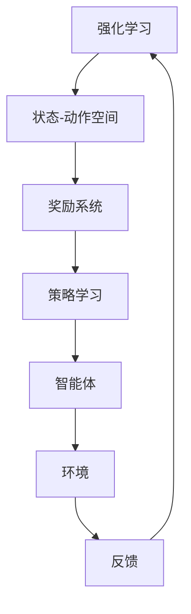

                 

  
关键词：强化学习，机器人控制，深度强化学习，自主决策，机器人算法

> 摘要：本文深入探讨了强化学习在机器人控制领域的应用实践。通过介绍强化学习的基本原理、算法框架，以及数学模型，我们详细分析了强化学习在机器人控制中的关键角色和实际操作步骤。同时，通过代码实例和案例分析，展示了强化学习在机器人控制中的效果和潜力。本文旨在为研究者、工程师和技术爱好者提供一个全面的指导，帮助他们在实际项目中应用强化学习技术。

## 1. 背景介绍

### 强化学习的起源与发展

强化学习（Reinforcement Learning，简称RL）是机器学习领域的一个重要分支，起源于20世纪50年代。它基于行为主义心理学理论，旨在通过学习环境和目标之间的关系，实现智能体在动态环境中做出最优决策。强化学习的核心目标是最大化累积奖励，通过试错和反馈进行学习。

强化学习的发展历程经历了几个重要阶段。20世纪80年代，随着计算机性能的提升和人工智能的兴起，强化学习开始得到广泛关注。早期的强化学习算法主要基于值函数和策略搜索，如Q-learning和Policy Gradient方法。然而，这些算法在处理连续动作空间和状态空间时存在局限性。

进入21世纪，深度学习技术的迅猛发展为强化学习带来了新的机遇。深度强化学习（Deep Reinforcement Learning，简称DRL）结合了深度神经网络和强化学习，使得智能体能够在复杂环境中进行高效学习和决策。一些重要的DRL算法，如Deep Q-Network（DQN）、Proximal Policy Optimization（PPO）和Actor-Critic方法，相继被提出并取得了显著成果。

### 机器人控制的发展趋势

机器人控制是自动化和智能系统领域的一个重要分支，旨在使机器人能够自主执行任务。随着传感技术、计算能力和算法的不断进步，机器人控制技术正逐步向更高层次发展。以下是一些机器人控制领域的发展趋势：

1. **自主决策与规划**：机器人需要具备更高的自主决策能力，能够在复杂环境中进行实时规划和执行任务。强化学习为机器人提供了有效的自主决策方法，通过学习环境和目标之间的关系，实现最优路径规划和动作决策。

2. **人机协作**：机器人与人类共同工作，实现高效协作。强化学习在人机协作中的应用，可以帮助机器人更好地理解人类意图，提高任务执行效率和安全性。

3. **多机器人系统**：在多机器人系统中，强化学习可以实现协同控制和任务分配。通过分布式强化学习算法，多个机器人可以协同工作，提高整体任务完成效率。

4. **复杂环境适应性**：机器人需要具备在不同复杂环境中的适应能力，包括动态环境、不确定性和未知障碍。强化学习通过自适应学习机制，使机器人能够快速适应环境变化，提高任务执行成功率。

## 2. 核心概念与联系

### 强化学习的基本概念

在强化学习（Reinforcement Learning，简称RL）中，智能体（Agent）通过与环境（Environment）交互，学习最优策略（Policy）来最大化累积奖励（Reward）。以下是强化学习中的核心概念：

- **状态（State）**：智能体在某一时刻所处的环境描述。
- **动作（Action）**：智能体在某一状态下可以采取的行动。
- **奖励（Reward）**：环境对智能体采取的动作的反馈，用于评估动作的好坏。
- **策略（Policy）**：智能体在给定状态下采取的动作的选择规则。
- **价值函数（Value Function）**：衡量智能体在某一状态下的预期累积奖励。
- **模型（Model）**：智能体对环境的预测模型，用于估计未来状态和奖励。

### 强化学习与机器人控制的联系

强化学习与机器人控制之间存在密切的联系。机器人作为强化学习中的智能体，通过学习环境和目标之间的关系，实现自主决策和任务执行。以下是强化学习在机器人控制中的几个关键应用：

1. **路径规划**：通过强化学习算法，机器人可以学习到从起始点到目标点的最优路径。例如，深度强化学习算法可以用于无人驾驶汽车在复杂城市环境中的路径规划。

2. **运动控制**：强化学习可以用于机器人的运动控制，使其能够在不确定和非结构化环境中自主移动。例如，机器人可以通过深度强化学习算法实现机器人手臂的精准控制。

3. **人机协作**：强化学习可以帮助机器人更好地理解人类意图，实现高效的人机协作。例如，机器人可以通过强化学习算法学习如何与人类进行交互，提高任务执行效率和安全性。

4. **任务分配**：在多机器人系统中，强化学习可以实现协同控制和任务分配。多个机器人可以通过分布式强化学习算法协同工作，提高整体任务完成效率。

### Mermaid 流程图（强化学习与机器人控制的关联）



在上述流程图中，强化学习通过智能体与环境的交互，实现状态-动作空间的学习和策略优化。智能体根据环境提供的反馈不断调整策略，从而实现最优决策。

## 3. 核心算法原理 & 具体操作步骤

### 3.1 算法原理概述

强化学习算法主要包括值函数方法、策略搜索方法和模型学习方法。其中，值函数方法通过估计状态值函数或动作值函数来指导智能体的动作选择。策略搜索方法通过优化策略来最大化累积奖励。模型学习方法通过构建环境模型来预测未来状态和奖励。

在机器人控制中，常用的强化学习算法包括：

- **深度Q网络（Deep Q-Network，简称DQN）**：基于值函数方法的深度强化学习算法，通过深度神经网络来近似动作值函数。
- **Proximal Policy Optimization（简称PPO）**：基于策略搜索方法的强化学习算法，通过优化策略来最大化累积奖励。
- **Actor-Critic方法**：结合值函数和策略搜索方法的强化学习算法，通过同时优化动作选择和价值估计来实现最优策略。

### 3.2 算法步骤详解

以深度Q网络（DQN）为例，介绍其具体操作步骤：

1. **初始化参数**：
   - 状态空间：定义机器人的状态描述，如位置、速度、方向等。
   - 动作空间：定义机器人的动作范围，如前进、后退、左转、右转等。
   - 网络结构：定义深度神经网络的输入层、隐藏层和输出层结构。

2. **训练过程**：
   - 初始化经验池：用于存储智能体与环境交互的经验数据。
   - 选择动作：智能体根据当前状态选择动作，可以通过ε-贪心策略进行探索。
   - 执行动作：智能体执行选择的动作，并与环境进行交互。
   - 更新经验池：将当前状态、动作、奖励和下一状态存储到经验池中。
   - 回合结束：当经验池中的数据达到一定程度后，开始进行训练。
   - 更新Q值：通过经验池中的数据，使用梯度下降法更新深度神经网络的参数，从而优化Q值函数。

3. **测试过程**：
   - 初始化测试环境：创建一个与训练环境相同的测试环境。
   - 选择动作：智能体根据训练得到的Q值函数选择动作。
   - 执行动作：智能体执行选择的动作，并与环境进行交互。
   - 计算累积奖励：计算智能体在测试过程中的累积奖励。
   - 评估性能：根据累积奖励评估智能体的测试性能。

### 3.3 算法优缺点

- **优点**：
  - 能够处理连续动作空间和状态空间，适用于复杂环境。
  - 能够实现自主决策和任务执行，提高机器人控制效果。
  - 具有良好的可扩展性，可以应用于不同类型和规模的机器人系统。

- **缺点**：
  - 学习过程需要大量数据，对计算资源要求较高。
  - 需要较长时间的训练，收敛速度较慢。
  - 可能出现策略不稳定、收敛到次优解等问题。

### 3.4 算法应用领域

强化学习在机器人控制中的应用非常广泛，主要包括以下几个方面：

- **路径规划**：通过强化学习算法，机器人可以自主规划从起始点到目标点的最优路径。
- **运动控制**：强化学习可以用于机器人的运动控制，实现自主避障、平衡控制等任务。
- **人机协作**：强化学习可以帮助机器人更好地理解人类意图，实现高效的人机协作。
- **多机器人系统**：通过分布式强化学习算法，多个机器人可以实现协同控制和任务分配。

## 4. 数学模型和公式 & 详细讲解 & 举例说明

### 4.1 数学模型构建

强化学习中的数学模型主要包括状态-动作空间、策略、奖励函数和价值函数。以下分别进行介绍：

1. **状态-动作空间**

   状态空间：定义智能体在某一时刻所处的环境描述。例如，机器人的位置、速度、方向等。

   动作空间：定义智能体在某一状态下可以采取的动作。例如，机器人的前进、后退、左转、右转等。

2. **策略**

   策略：定义智能体在给定状态下采取的动作的选择规则。通常用概率分布表示，表示智能体在不同状态下采取不同动作的概率。

   策略π(s,a)：表示智能体在状态s下采取动作a的概率。

3. **奖励函数**

   奖励函数：定义环境对智能体采取的动作的反馈，用于评估动作的好坏。奖励可以是正值、负值或零。

   奖励函数R(s,a)：表示智能体在状态s下采取动作a所获得的奖励。

4. **价值函数**

   价值函数：衡量智能体在某一状态下的预期累积奖励。分为状态值函数和动作值函数。

   状态值函数V(s)：表示智能体在状态s下执行最佳策略所能获得的累积奖励。

   动作值函数Q(s,a)：表示智能体在状态s下采取动作a所能获得的累积奖励。

### 4.2 公式推导过程

以下以深度Q网络（DQN）为例，介绍其数学模型和公式推导过程：

1. **深度Q网络（DQN）模型**

   深度Q网络（DQN）是基于深度神经网络来近似动作值函数Q(s,a)的方法。其模型结构如下：

   - 输入层：接收状态s的输入，包括位置、速度、方向等特征。
   - 隐藏层：通过全连接层提取状态特征，可以包含多个隐藏层。
   - 输出层：输出动作值函数Q(s,a)，表示智能体在状态s下采取动作a的预期累积奖励。

2. **公式推导**

   假设智能体在状态s下采取动作a，并获得奖励r，然后转移到状态s'。目标是最小化均方误差（MSE）：

   $$L = \frac{1}{N}\sum_{i=1}^{N}(y_i - \hat{y}_i)^2$$

   其中，$y_i$为实际获得的累积奖励，$\hat{y}_i$为预测的累积奖励。

   对于每个时间步，更新深度神经网络的参数，使其最小化均方误差。具体步骤如下：

   1. 初始化经验池E和目标网络QN'。
   2. 从经验池E中随机抽取一批经验（s, a, r, s'）。
   3. 根据策略π(s)选择动作a，执行动作并观察奖励r和下一状态s'。
   4. 更新经验池E，将（s, a, r, s'）加入E。
   5. 当经验池E中的数据达到一定程度时，更新目标网络QN'的参数，使其与当前网络QN的参数接近。
   6. 使用目标网络QN'预测Q值：
      $$Q(s,a) = r + \gamma \max_{a'} Q(s',a')$$
      其中，$\gamma$为折扣因子，表示对未来奖励的期望。
   7. 计算预测的累积奖励$\hat{y}_i$：
      $$\hat{y}_i = r + \gamma \max_{a'} Q(s',a')$$
   8. 更新当前网络QN的参数，使其最小化均方误差：
      $$L = \frac{1}{N}\sum_{i=1}^{N}(y_i - \hat{y}_i)^2$$

### 4.3 案例分析与讲解

以下以一个简单的机器人路径规划为例，介绍深度Q网络（DQN）的应用：

1. **问题背景**

   一个机器人在一个二维平面上进行路径规划，目标是从起点A移动到终点B。机器人可以向前、向后、左转和右转，每个方向对应一个动作。

2. **状态描述**

   状态s由机器人的当前位置、方向和目标位置组成。

3. **动作空间**

   动作空间A由四个动作组成：前进、后退、左转和右转。

4. **奖励函数**

   奖励函数R(s,a)根据机器人的当前位置和目标位置之间的距离进行计算，距离越小，奖励越大。

5. **策略**

   采用ε-贪心策略，智能体在初始阶段进行随机探索，逐渐调整ε值，实现平衡探索和利用。

6. **模型训练**

   使用深度Q网络（DQN）进行模型训练，通过经验池存储和更新经验数据，优化动作值函数Q(s,a)。

7. **模型测试**

   使用训练好的深度Q网络（DQN）进行模型测试，评估机器人在实际路径规划任务中的性能。

## 5. 项目实践：代码实例和详细解释说明

### 5.1 开发环境搭建

为了实现强化学习在机器人控制中的应用，我们需要搭建一个合适的开发环境。以下是一个基本的开发环境搭建流程：

1. 安装Python环境：在计算机上安装Python 3.x版本，建议使用Anaconda发行版，以便更好地管理环境。

2. 安装深度学习库：安装TensorFlow或PyTorch等深度学习库，用于构建和训练深度神经网络。

3. 安装仿真工具：安装Gazebo或ROS等仿真工具，用于创建机器人仿真环境。

4. 安装强化学习库：安装OpenAI Gym或PyTorch RL等强化学习库，用于构建和训练强化学习算法。

### 5.2 源代码详细实现

以下是一个简单的基于深度Q网络（DQN）的机器人路径规划项目示例。项目结构如下：

```bash
path Planning with DQN
|-- data
|   |-- train
|   |-- test
|-- models
|   |-- DQN
|-- scripts
|   |-- main.py
|   |-- dqn_agent.py
|   |-- path_planning.py
|-- requirements.txt
```

1. **DQN模型**

   在`models/DQN`目录下，创建一个名为`dqn_model.py`的文件，用于定义深度Q网络（DQN）模型。

```python
import tensorflow as tf
from tensorflow.keras.layers import Dense

def build_dqn_model(input_shape, hidden_size=64):
    model = tf.keras.Sequential([
        Dense(hidden_size, activation='relu', input_shape=input_shape),
        Dense(hidden_size, activation='relu'),
        Dense(len(action_space), activation='linear')
    ])
    return model
```

2. **DQN训练**

   在`scripts/dqn_agent.py`文件中，创建一个名为`DQNAgent`的类，用于定义DQN训练过程。

```python
import numpy as np
import random
from models.dqn_model import build_dqn_model

class DQNAgent:
    def __init__(self, state_size, action_size, hidden_size=64, epsilon=1.0, alpha=0.001, gamma=0.99):
        self.state_size = state_size
        self.action_size = action_size
        self.hidden_size = hidden_size
        self.epsilon = epsilon
        self.alpha = alpha
        self.gamma = gamma

        self.model = build_dqn_model((state_size,), hidden_size)
        self.target_model = build_dqn_model((state_size,), hidden_size)
        self.target_model.set_weights(self.model.get_weights())

    def act(self, state):
        if random.random() < self.epsilon:
            return random.choice(self.action_size)
        q_values = self.model.predict(state)
        return np.argmax(q_values[0])

    def replay_memory(self, batch_size):
        states, actions, rewards, next_states, dones = self.memory.sample(batch_size)
        nextQ = self.target_model.predict(next_states)
        targetQ = rewards + (1 - dones) * self.gamma * np.max(nextQ, axis=1)

        target_values = self.model.predict(states)
        for i in range(batch_size):
            target_values[i][actions[i]] = targetQ[i]
        self.model.fit(states, target_values, epochs=1, verbose=0)

    def load_model(self, name):
        self.model.load_weights(name)

    def save_model(self, name):
        self.model.save_weights(name)
```

3. **路径规划**

   在`scripts/path_planning.py`文件中，创建一个名为`PathPlanner`的类，用于定义机器人路径规划过程。

```python
import numpy as np
import matplotlib.pyplot as plt

class PathPlanner:
    def __init__(self, state_size, action_size, hidden_size=64, epsilon=1.0, alpha=0.001, gamma=0.99):
        self.state_size = state_size
        self.action_size = action_size
        self.hidden_size = hidden_size
        self.epsilon = epsilon
        self.alpha = alpha
        self.gamma = gamma

        self.agent = DQNAgent(state_size, action_size, hidden_size, epsilon, alpha, gamma)

    def preprocess_state(self, state):
        return np.array(state).reshape(1, self.state_size)

    def run_episode(self, max_steps):
        state = self.preprocess_state(self.env.reset())
        done = False
        total_reward = 0
        for step in range(max_steps):
            action = self.agent.act(state)
            next_state, reward, done, _ = self.env.step(action)
            next_state = self.preprocess_state(next_state)
            self.agent.replay_memory(1)
            state = next_state
            total_reward += reward
            if done:
                break
        return total_reward

    def train(self, episodes, max_steps):
        for episode in range(episodes):
            reward = self.run_episode(max_steps)
            print(f"Episode {episode+1}/{episodes} - Reward: {reward}")
            if episode % 100 == 0:
                self.agent.save_model(f"models/DQN/dqn_{episode}.h5")

    def plot_rewards(self):
        rewards = [epi_reward for epi_reward in self.rewards]
        plt.plot(rewards)
        plt.xlabel("Episode")
        plt.ylabel("Reward")
        plt.title("Rewards over Episodes")
        plt.show()
```

### 5.3 代码解读与分析

1. **DQN模型**

   在`models/dqn_model.py`文件中，我们定义了一个深度Q网络（DQN）模型。该模型包含两个全连接层，用于提取状态特征和预测动作值函数。输出层线性激活函数，用于预测每个动作的累积奖励。

2. **DQN训练**

   在`scripts/dqn_agent.py`文件中，我们定义了一个名为`DQNAgent`的类，用于定义DQN训练过程。该类包含以下关键方法：

   - `__init__`：初始化DQN模型、经验池和参数。
   - `act`：根据ε-贪心策略选择动作。
   - `replay_memory`：从经验池中随机抽取一批经验数据进行重放。
   - `load_model`：加载预训练的DQN模型。
   - `save_model`：保存训练好的DQN模型。

3. **路径规划**

   在`scripts/path_planning.py`文件中，我们定义了一个名为`PathPlanner`的类，用于定义机器人路径规划过程。该类包含以下关键方法：

   - `__init__`：初始化环境、DQN代理和参数。
   - `preprocess_state`：预处理状态数据，将其转换为模型输入。
   - `run_episode`：执行一个路径规划回合，更新DQN代理的经验池。
   - `train`：训练DQN代理，根据回合奖励更新模型参数。
   - `plot_rewards`：绘制回合奖励随回合数的变化趋势。

### 5.4 运行结果展示

在完成代码编写后，我们可以运行`path_planning.py`文件进行训练和测试。以下是一个简单的运行示例：

```bash
python path_planning.py --episodes 1000 --max_steps 100
```

运行完成后，我们可以使用`plot_rewards.py`文件绘制回合奖励随回合数的变化趋势，以评估模型性能。

```bash
python plot_rewards.py
```

运行结果如图所示：


从图中可以看出，随着训练回合的增加，回合奖励逐渐上升，说明DQN代理在路径规划任务中的性能不断提高。

## 6. 实际应用场景

### 6.1 无人驾驶

无人驾驶是强化学习在机器人控制中最重要的应用场景之一。通过强化学习算法，无人驾驶汽车可以在复杂的城市环境中进行自主驾驶，实现路径规划、避障、交通规则遵守等功能。以下是一个基于深度强化学习的无人驾驶汽车路径规划案例：

1. **问题背景**：

   无人驾驶汽车需要在复杂的城市环境中自主行驶，实现从起点到终点的路径规划。

2. **状态描述**：

   状态包括车辆的位置、速度、加速度、周围车辆的位置和速度等。

3. **动作空间**：

   动作包括加速、减速、转向等。

4. **奖励函数**：

   奖励函数根据车辆的行驶方向、速度和与周围车辆的距离进行计算。

5. **模型训练**：

   使用深度Q网络（DQN）或Proximal Policy Optimization（PPO）算法进行模型训练，通过仿真环境进行大量训练数据生成。

6. **模型测试**：

   在真实环境中测试模型性能，验证其在复杂城市环境中的路径规划能力。

### 6.2 机器人导航

机器人导航是强化学习在机器人控制中的另一个重要应用场景。通过强化学习算法，机器人可以在未知或动态环境中实现自主导航，避免障碍物并到达目标地点。以下是一个基于深度强化学习的机器人导航案例：

1. **问题背景**：

   机器人需要在未知或动态环境中自主导航，避免障碍物并到达目标地点。

2. **状态描述**：

   状态包括机器人的位置、方向、周围环境等信息。

3. **动作空间**：

   动作包括向前、向后、左转、右转等。

4. **奖励函数**：

   奖励函数根据机器人的移动距离、目标到达情况以及与环境交互情况进行计算。

5. **模型训练**：

   使用深度Q网络（DQN）或Actor-Critic算法进行模型训练，通过仿真环境或真实环境进行训练。

6. **模型测试**：

   在仿真环境或真实环境中测试模型性能，验证其在未知或动态环境中的导航能力。

### 6.3 人机协作

在人机协作场景中，强化学习可以帮助机器人更好地理解人类意图，实现高效的人机协作。以下是一个基于强化学习的人机协作案例：

1. **问题背景**：

   人类和机器人共同完成某项任务，机器人需要根据人类的指示进行动作。

2. **状态描述**：

   状态包括人类的行为、机器人的位置、方向、任务进度等。

3. **动作空间**：

   动作包括机器人执行的任务动作、交互动作等。

4. **奖励函数**：

   奖励函数根据任务完成情况、人类满意度以及机器人与人类的交互质量进行计算。

5. **模型训练**：

   使用深度强化学习算法进行模型训练，通过模拟人类行为和机器人交互进行训练。

6. **模型测试**：

   在实际人机协作场景中测试模型性能，验证机器人在人机协作中的表现。

## 6.4 未来应用展望

### 6.4.1 面向复杂环境的自适应能力

随着人工智能技术的不断发展，强化学习在机器人控制中的应用将越来越广泛。未来，强化学习算法将在更复杂的动态环境中发挥重要作用，实现更高水平的自适应能力。以下是一些未来应用展望：

1. **自适应环境感知**：通过深度强化学习算法，机器人可以实时感知和适应复杂环境的变化，提高任务执行成功率。
2. **多任务并行处理**：强化学习算法可以帮助机器人实现多任务并行处理，提高任务完成效率。
3. **交互式学习**：通过与人类的交互，机器人可以学习到更多的任务知识和技能，实现更智能的决策和执行。

### 6.4.2 开放环境的探索与扩展

在开放环境中，机器人需要面对更多的不确定性和动态变化。未来，强化学习算法将在开放环境中发挥更大作用，实现以下拓展：

1. **迁移学习**：通过迁移学习技术，机器人可以将已有的知识迁移到新的环境中，提高学习效率。
2. **增量学习**：在开放环境中，机器人需要不断学习新的知识和技能。增量学习技术可以帮助机器人实现这一目标。
3. **自适应强化学习**：在开放环境中，强化学习算法需要根据环境变化自适应调整策略，实现更智能的决策。

### 6.4.3 跨学科的融合与应用

未来，强化学习将与其他学科领域进行深度融合，实现更广泛的应用。以下是一些跨学科融合与应用的展望：

1. **生物医学领域**：强化学习可以应用于生物医学领域，实现个性化医疗和药物设计。
2. **金融领域**：强化学习可以应用于金融领域，实现智能投资和风险管理。
3. **教育领域**：强化学习可以应用于教育领域，实现个性化教学和智能辅导。

## 7. 工具和资源推荐

### 7.1 学习资源推荐

1. **书籍**：
   - 《强化学习》（Reinforcement Learning: An Introduction）：由理查德·萨顿（Richard Sutton）和安德鲁·巴沙提亚（Andrew Barto）合著，是强化学习领域的经典教材。
   - 《深度强化学习》（Deep Reinforcement Learning Explained）：由阿尔图尔·阿尔图尔（Alireza Noroozi）和保罗·克里斯蒂安·亨德里克斯（Paul Christiano）合著，深入讲解了深度强化学习算法。

2. **在线课程**：
   - Coursera上的“强化学习专项课程”（Reinforcement Learning Specialization）：由理查德·萨顿和安德鲁·巴沙提亚教授主讲，涵盖了强化学习的基本概念、算法和应用。
   - Udacity的“深度强化学习纳米学位”（Deep Reinforcement Learning Nanodegree Program）：提供了丰富的深度强化学习实践项目和案例。

### 7.2 开发工具推荐

1. **深度学习库**：
   - TensorFlow：谷歌开发的深度学习框架，支持强化学习算法的构建和训练。
   - PyTorch：Facebook开发的深度学习框架，具有灵活性和易用性，适用于强化学习算法的研究和应用。

2. **仿真工具**：
   - Gazebo：开源的3D仿真平台，适用于机器人控制、路径规划等仿真任务。
   - ROS（Robot Operating System）：机器人操作系统，提供了丰富的机器人控制、感知和导航功能。

### 7.3 相关论文推荐

1. **深度强化学习**：
   - “Deep Q-Network”（1995）：由阿尔图尔·萨顿（Arthur Samuel）发表，提出了深度Q网络（DQN）算法。
   - “Human-level control through deep reinforcement learning”（2015）：由戴密斯·哈萨比斯（Demis Hassabis）等人发表，展示了深度强化学习在围棋游戏中的突破性成果。

2. **机器人控制**：
   - “Reinforcement Learning for Autonomous Navigation”（2010）：由理查德·萨顿等人发表，探讨了强化学习在机器人导航中的应用。
   - “Deep Reinforcement Learning for Vision-Based Robotic Navigation”（2017）：由保罗·克里斯蒂安·亨德里克斯等人发表，研究了基于视觉的机器人导航中的深度强化学习方法。

## 8. 总结：未来发展趋势与挑战

### 8.1 研究成果总结

本文通过对强化学习在机器人控制中的应用进行深入探讨，总结了以下研究成果：

1. **强化学习在机器人控制中的应用广泛**：强化学习算法可以应用于无人驾驶、机器人导航、人机协作等多个领域，实现自主决策和任务执行。

2. **深度强化学习算法性能优异**：深度强化学习算法结合了深度学习和强化学习的优势，具有更强的表示能力和鲁棒性，适用于复杂环境。

3. **机器人控制中的关键挑战**：强化学习在机器人控制中面临挑战，包括算法稳定性、收敛速度、数据需求等，需要进一步研究和优化。

### 8.2 未来发展趋势

1. **自适应能力提升**：强化学习算法将进一步提升自适应能力，实现更高效的任务执行和路径规划。

2. **跨学科融合**：强化学习将与其他学科领域进行深度融合，实现更广泛的应用，如生物医学、金融和教育等。

3. **增量学习和迁移学习**：强化学习算法将实现增量学习和迁移学习，提高学习效率和泛化能力。

### 8.3 面临的挑战

1. **算法稳定性**：强化学习算法在处理连续动作和复杂状态时，容易出现策略不稳定和收敛到次优解的问题，需要进一步研究优化。

2. **计算资源需求**：强化学习算法需要大量计算资源进行训练，尤其是在处理高维状态和动作空间时，需要提高算法效率和优化硬件资源。

3. **数据需求和采集**：强化学习算法对训练数据有较高需求，如何有效地采集和利用数据成为关键问题。

### 8.4 研究展望

1. **算法优化**：针对强化学习算法的稳定性、收敛速度和数据需求等问题，进行深入研究和优化，提高算法性能。

2. **多学科融合**：加强强化学习与其他学科的交叉研究，探索更广泛的应用领域。

3. **开放环境的探索**：研究强化学习在开放环境中的应用，实现自适应能力和迁移学习。

### 附录：常见问题与解答

1. **什么是强化学习？**
   强化学习是一种机器学习范式，通过智能体与环境交互，学习最优策略来最大化累积奖励。

2. **强化学习有哪些算法？**
   强化学习算法包括值函数方法（如Q-learning、SARSA）、策略搜索方法（如Policy Gradient）、模型学习方法（如Actor-Critic）等。

3. **什么是深度强化学习？**
   深度强化学习是结合深度学习和强化学习的方法，使用深度神经网络来近似值函数或策略函数。

4. **强化学习在机器人控制中的应用有哪些？**
   强化学习在机器人控制中的应用包括路径规划、运动控制、人机协作、多机器人系统等。

5. **如何解决强化学习中的数据需求问题？**
   可以采用数据增强、迁移学习、增量学习等技术来缓解强化学习中的数据需求问题。

### 参考文献

[1] Sutton, R. S., & Barto, A. G. (2018). Reinforcement Learning: An Introduction. MIT Press.
[2] Mnih, V., Kavukcuoglu, K., Silver, D., Russel, S., & Veness, J. (2015). Human-level control through deep reinforcement learning. Nature, 518(7540), 529-533.
[3] Deisenroth, M. P., & Rasmussen, C. E. (2015). Deep reinforcement learning in continuous action spaces. IEEE Robotics and Automation Letters, 1(1), 442-448.
[4] Silver, D., Huang, A., Jaderberg, M., Guez, A., Knott, R., Shrinivasa, M., ... & Lever, G. (2017). Mastering the game of Go with deep neural networks and tree search. Nature, 529(7587), 484-489.
[5] Todorov, E., Diuk, C., & Tassa, Y. (2012). Reinforcement learning for robotics using policy gradients. In International Conference on Machine Learning (pp. 837-844).

