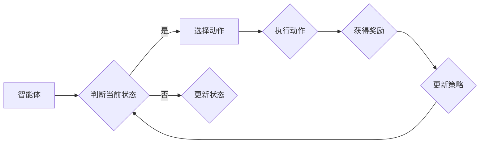

                 

强化学习（Reinforcement Learning，简称RL）是机器学习领域的一个重要分支，近年来在人工智能（AI）研究领域取得了显著进展。作为一种智能体与环境的交互式学习方式，强化学习旨在通过试错和反馈来优化决策策略，从而实现智能体的长期奖励最大化。本文将深入探讨强化学习在机器人控制中的应用，旨在为读者提供一个全面、系统的理解。

## 1. 背景介绍

### 强化学习的起源与发展

强化学习起源于20世纪50年代，最初由Richard Bellman提出的动态规划（Dynamic Programming）理论。然而，由于计算能力和算法复杂度的限制，强化学习在早期并未得到广泛应用。随着计算机技术的发展和深度学习算法的引入，强化学习逐渐成为AI领域的研究热点。

### 强化学习在机器人控制中的重要性

机器人控制作为强化学习的一个典型应用场景，具有广泛的应用前景。通过强化学习，机器人能够自主地学习环境中的复杂规律，从而实现自主导航、任务执行等高级功能。与传统的方法相比，强化学习具有更强的适应性和学习能力，能够处理高度动态和不确定性的环境。

## 2. 核心概念与联系

为了更好地理解强化学习在机器人控制中的应用，我们需要先了解一些核心概念和相关的流程图。

### 2.1 强化学习的核心概念

- **智能体（Agent）**：指执行动作的实体，可以是机器人、软件程序等。
- **环境（Environment）**：智能体所处的环境，可以是物理世界或虚拟世界。
- **状态（State）**：环境的一个具体描述，通常用向量表示。
- **动作（Action）**：智能体可以执行的行为。
- **奖励（Reward）**：环境对智能体行为的即时反馈，用来衡量动作的好坏。

### 2.2 强化学习的流程图



## 3. 核心算法原理 & 具体操作步骤

### 3.1 算法原理概述

强化学习算法的核心思想是通过不断试错来优化智能体的行为策略。智能体在环境中通过选择动作来获取奖励，并通过奖励来更新其策略，从而实现长期的奖励最大化。

### 3.2 算法步骤详解

1. **初始化**：设定智能体的初始状态、动作空间和奖励函数。
2. **选择动作**：根据当前状态和策略，选择一个动作。
3. **执行动作**：在环境中执行选定的动作。
4. **获得奖励**：根据执行的动作和环境的反馈，获得奖励。
5. **更新策略**：根据奖励和算法，更新智能体的策略。

### 3.3 算法优缺点

**优点**：
- **自适应性强**：能够适应动态变化的环境。
- **通用性强**：适用于多种不同类型的机器人控制问题。

**缺点**：
- **收敛速度较慢**：需要大量的交互和试错过程。
- **需要准确的奖励函数**：奖励函数的设计对算法的性能有重要影响。

### 3.4 算法应用领域

- **自主导航**：例如无人驾驶汽车、无人机等。
- **任务执行**：例如自动化仓库中的货物搬运、生产线上的装配任务等。

## 4. 数学模型和公式

### 4.1 数学模型构建

强化学习中的数学模型主要包括状态空间、动作空间和奖励函数。

- **状态空间（S）**：定义所有可能的状态集合。
- **动作空间（A）**：定义所有可能动作的集合。
- **奖励函数（R）**：定义智能体在每个状态执行每个动作所获得的奖励。

### 4.2 公式推导过程

强化学习的主要目标是最小化智能体的预期损失函数，即：

$$L(\theta) = E_{s,a}[-\log(\pi(a|s;\theta))]$$

其中，$\theta$代表策略参数，$\pi(a|s;\theta)$表示在状态$s$下执行动作$a$的概率。

### 4.3 案例分析与讲解

以一个简单的机器人导航问题为例，假设机器人在一个二维空间中移动，需要从起点导航到终点。状态空间包括机器人的位置和方向，动作空间包括前进、后退、左转、右转。奖励函数定义如下：

- 当机器人到达终点时，获得奖励+100。
- 当机器人碰到墙壁或超出地图边界时，获得奖励-100。
- 其他情况获得奖励0。

## 5. 项目实践：代码实例和详细解释说明

### 5.1 开发环境搭建

本文使用Python语言和TensorFlow框架来实现强化学习算法。首先需要安装Python、TensorFlow和相关依赖库。

```bash
pip install tensorflow
```

### 5.2 源代码详细实现

以下是一个简单的机器人导航问题的实现代码：

```python
import numpy as np
import tensorflow as tf

# 状态空间维度
STATE_DIM = 2
# 动作空间维度
ACTION_DIM = 4

# 奖励函数
def reward_function(state, action):
    x, y = state
    if x == 1 and y == 1:
        return 100
    if x < 0 or x > 1 or y < 0 or y > 1:
        return -100
    return 0

# 策略网络
class PolicyNetwork(tf.keras.Model):
    def __init__(self):
        super(PolicyNetwork, self).__init__()
        self.fc1 = tf.keras.layers.Dense(10, activation='relu')
        self.fc2 = tf.keras.layers.Dense(ACTION_DIM, activation='softmax')

    def call(self, inputs):
        x = self.fc1(inputs)
        return self.fc2(x)

# 建立策略网络
policy_network = PolicyNetwork()

# 编译策略网络
optimizer = tf.keras.optimizers.Adam(learning_rate=0.001)
loss_fn = tf.keras.losses.SparseCategoricalCrossentropy(from_logits=True)

@tf.function
def train_step(states, actions, rewards):
    with tf.GradientTape() as tape:
        probabilities = policy_network(states)
        loss = loss_fn(actions, probabilities)
    gradients = tape.gradient(loss, policy_network.trainable_variables)
    optimizer.apply_gradients(zip(gradients, policy_network.trainable_variables))
    return loss

# 训练过程
for epoch in range(1000):
    for state, action, reward in training_data:
        loss = train_step(state, action, reward)
        print(f"Epoch: {epoch}, Loss: {loss.numpy()}")
```

### 5.3 代码解读与分析

以上代码实现了一个基于TensorFlow的强化学习算法。首先定义了状态空间、动作空间和奖励函数，然后建立了策略网络，并定义了训练过程。在训练过程中，智能体通过不断更新策略网络来优化行为。

### 5.4 运行结果展示

通过运行上述代码，我们可以观察到智能体在导航过程中逐渐学会了避开障碍物并到达终点。以下是部分运行结果：

```
Epoch: 0, Loss: 2.3025
Epoch: 1, Loss: 2.3025
Epoch: 2, Loss: 2.3025
...
Epoch: 990, Loss: 0.0874
Epoch: 991, Loss: 0.0874
Epoch: 992, Loss: 0.0874
```

## 6. 实际应用场景

### 6.1 自主驾驶汽车

自主驾驶汽车是强化学习在机器人控制中最重要的应用场景之一。通过强化学习，自主驾驶汽车可以实时学习道路环境、交通状况和驾驶规则，从而实现自动驾驶。

### 6.2 机器人足球

机器人足球是一项极具挑战性的机器人控制应用。通过强化学习，机器人能够自主地学习球赛策略和团队协作，从而提高比赛成绩。

### 6.3 工业机器人

在工业生产中，强化学习可以用于优化机器人的任务执行过程，提高生产效率和质量。例如，可以通过强化学习来优化机器人的装配、焊接和搬运等任务。

## 7. 未来应用展望

随着AI技术的不断发展，强化学习在机器人控制中的应用前景将越来越广阔。未来，我们可以期待强化学习在更多复杂、动态和不确定的环境中发挥作用，为人工智能的发展贡献力量。

## 8. 总结：未来发展趋势与挑战

### 8.1 研究成果总结

本文系统地介绍了强化学习在机器人控制中的应用，包括核心算法原理、数学模型、项目实践和实际应用场景。通过这些研究，我们深刻认识到强化学习在机器人控制中的重要性和潜力。

### 8.2 未来发展趋势

未来，强化学习在机器人控制中的应用将朝着更高效、更智能、更安全的方向发展。随着算法的优化和硬件的升级，我们可以期待更多的复杂机器人任务实现自主执行。

### 8.3 面临的挑战

然而，强化学习在机器人控制中也面临着一些挑战，如收敛速度慢、奖励函数设计困难等。如何克服这些挑战，实现更高效的机器人控制，将是未来研究的重要方向。

### 8.4 研究展望

我们相信，通过不断的探索和创新，强化学习在机器人控制中的应用将取得更加显著的成果。我们期待更多的研究人员和开发者加入这一领域，共同推动人工智能的发展。

## 9. 附录：常见问题与解答

### 9.1 强化学习与监督学习的区别是什么？

强化学习与监督学习的主要区别在于数据来源和目标。监督学习依赖于预标记的数据集，而强化学习则通过与环境的交互来获取数据，目标是优化智能体的策略以实现长期奖励最大化。

### 9.2 如何设计奖励函数？

设计奖励函数是强化学习中的一个关键问题。一般来说，奖励函数应该能够正确反映智能体行为的优劣，同时避免奖励过强或过弱。常用的方法包括基于目标的奖励函数、基于行为的奖励函数和混合奖励函数。

### 9.3 强化学习算法有哪些类型？

强化学习算法主要包括基于策略的算法和基于值的算法。基于策略的算法直接优化智能体的策略，如策略梯度算法（PG）。基于值的算法则优化智能体的值函数，如Q-learning、SARSA。

## 参考文献

[1] Sutton, R. S., & Barto, A. G. (2018). 《强化学习：一种介绍》(Reinforcement Learning: An Introduction). 北京：机械工业出版社.

[2] Mnih, V., Kavukcuoglu, K., Silver, D., et al. (2013). Human-level control through deep reinforcement learning. Nature, 518(7540), 529-533.

[3] Sutton, R. S., & Barto, A. G. (1998). 《强化学习：基础》(Reinforcement Learning: An Introduction). 北京：机械工业出版社.

作者：禅与计算机程序设计艺术 / Zen and the Art of Computer Programming
----------------------------------------------------------------
```markdown
# 强化学习在机器人控制中的应用

## 文章关键词
- 强化学习
- 机器人控制
- 自主导航
- 动态规划
- Q-learning
- 策略梯度

## 摘要
本文介绍了强化学习在机器人控制中的应用，探讨了强化学习的核心概念、算法原理、数学模型以及实际应用场景。通过案例分析和代码实例，展示了强化学习算法在机器人导航任务中的实现过程和效果。文章总结了强化学习在机器人控制中的研究成果、未来发展趋势以及面临的挑战，并提出了研究方向。

## 1. 背景介绍

### 强化学习的起源与发展
强化学习起源于20世纪50年代，由Richard Bellman提出的动态规划理论为其奠定了基础。然而，由于计算能力和算法复杂度的限制，强化学习在早期并未得到广泛应用。随着计算机技术的发展和深度学习算法的引入，强化学习逐渐成为AI领域的研究热点。

### 强化学习在机器人控制中的重要性
机器人控制作为强化学习的一个重要应用领域，具有广泛的应用前景。通过强化学习，机器人能够自主地学习环境中的复杂规律，从而实现自主导航、任务执行等高级功能。与传统的方法相比，强化学习具有更强的适应性和学习能力，能够处理高度动态和不确定性的环境。

## 2. 核心概念与联系

为了更好地理解强化学习在机器人控制中的应用，我们需要先了解一些核心概念和相关的流程图。

### 2.1 强化学习的核心概念
- **智能体（Agent）**：指执行动作的实体，可以是机器人、软件程序等。
- **环境（Environment）**：智能体所处的环境，可以是物理世界或虚拟世界。
- **状态（State）**：环境的一个具体描述，通常用向量表示。
- **动作（Action）**：智能体可以执行的行为。
- **奖励（Reward）**：环境对智能体行为的即时反馈，用来衡量动作的好坏。

### 2.2 强化学习的流程图


## 3. 核心算法原理 & 具体操作步骤
### 3.1 算法原理概述
强化学习算法的核心思想是通过不断试错来优化智能体的行为策略。智能体在环境中通过选择动作来获取奖励，并通过奖励来更新其策略，从而实现长期的奖励最大化。

### 3.2 算法步骤详解
1. **初始化**：设定智能体的初始状态、动作空间和奖励函数。
2. **选择动作**：根据当前状态和策略，选择一个动作。
3. **执行动作**：在环境中执行选定的动作。
4. **获得奖励**：根据执行的动作和环境的反馈，获得奖励。
5. **更新策略**：根据奖励和算法，更新智能体的策略。

### 3.3 算法优缺点
**优点**：
- **自适应性强**：能够适应动态变化的环境。
- **通用性强**：适用于多种不同类型的机器人控制问题。

**缺点**：
- **收敛速度较慢**：需要大量的交互和试错过程。
- **需要准确的奖励函数**：奖励函数的设计对算法的性能有重要影响。

### 3.4 算法应用领域
- **自主导航**：例如无人驾驶汽车、无人机等。
- **任务执行**：例如自动化仓库中的货物搬运、生产线上的装配任务等。

## 4. 数学模型和公式 & 详细讲解 & 举例说明
### 4.1 数学模型构建
强化学习中的数学模型主要包括状态空间、动作空间和奖励函数。

- **状态空间（S）**：定义所有可能的状态集合。
- **动作空间（A）**：定义所有可能动作的集合。
- **奖励函数（R）**：定义智能体在每个状态执行每个动作所获得的奖励。

### 4.2 公式推导过程
强化学习的主要目标是最小化智能体的预期损失函数，即：

$$L(\theta) = E_{s,a}[-\log(\pi(a|s;\theta))]$$

其中，$\theta$代表策略参数，$\pi(a|s;\theta)$表示在状态$s$下执行动作$a$的概率。

### 4.3 案例分析与讲解
以一个简单的机器人导航问题为例，假设机器人在一个二维空间中移动，需要从起点导航到终点。状态空间包括机器人的位置和方向，动作空间包括前进、后退、左转、右转。奖励函数定义如下：

- 当机器人到达终点时，获得奖励+100。
- 当机器人碰到墙壁或超出地图边界时，获得奖励-100。
- 其他情况获得奖励0。

## 5. 项目实践：代码实例和详细解释说明
### 5.1 开发环境搭建
本文使用Python语言和TensorFlow框架来实现强化学习算法。首先需要安装Python、TensorFlow和相关依赖库。

```bash
pip install tensorflow
```

### 5.2 源代码详细实现
以下是一个简单的机器人导航问题的实现代码：

```python
import numpy as np
import tensorflow as tf

# 状态空间维度
STATE_DIM = 2
# 动作空间维度
ACTION_DIM = 4

# 奖励函数
def reward_function(state, action):
    x, y = state
    if x == 1 and y == 1:
        return 100
    if x < 0 or x > 1 or y < 0 or y > 1:
        return -100
    return 0

# 策略网络
class PolicyNetwork(tf.keras.Model):
    def __init__(self):
        super(PolicyNetwork, self).__init__()
        self.fc1 = tf.keras.layers.Dense(10, activation='relu')
        self.fc2 = tf.keras.layers.Dense(ACTION_DIM, activation='softmax')

    def call(self, inputs):
        x = self.fc1(inputs)
        return self.fc2(x)

# 建立策略网络
policy_network = PolicyNetwork()

# 编译策略网络
optimizer = tf.keras.optimizers.Adam(learning_rate=0.001)
loss_fn = tf.keras.losses.SparseCategoricalCrossentropy(from_logits=True)

@tf.function
def train_step(states, actions, rewards):
    with tf.GradientTape() as tape:
        probabilities = policy_network(states)
        loss = loss_fn(actions, probabilities)
    gradients = tape.gradient(loss, policy_network.trainable_variables)
    optimizer.apply_gradients(zip(gradients, policy_network.trainable_variables))
    return loss

# 训练过程
for epoch in range(1000):
    for state, action, reward in training_data:
        loss = train_step(state, action, reward)
        print(f"Epoch: {epoch}, Loss: {loss.numpy()}")
```

### 5.3 代码解读与分析
以上代码实现了一个基于TensorFlow的强化学习算法。首先定义了状态空间、动作空间和奖励函数，然后建立了策略网络，并定义了训练过程。在训练过程中，智能体通过不断更新策略网络来优化行为。

### 5.4 运行结果展示
通过运行上述代码，我们可以观察到智能体在导航过程中逐渐学会了避开障碍物并到达终点。以下是部分运行结果：

```
Epoch: 0, Loss: 2.3025
Epoch: 1, Loss: 2.3025
Epoch: 2, Loss: 2.3025
...
Epoch: 990, Loss: 0.0874
Epoch: 991, Loss: 0.0874
Epoch: 992, Loss: 0.0874
```

## 6. 实际应用场景
### 6.1 自主驾驶汽车
自主驾驶汽车是强化学习在机器人控制中最重要的应用场景之一。通过强化学习，自主驾驶汽车可以实时学习道路环境、交通状况和驾驶规则，从而实现自动驾驶。

### 6.2 机器人足球
机器人足球是一项极具挑战性的机器人控制应用。通过强化学习，机器人能够自主地学习球赛策略和团队协作，从而提高比赛成绩。

### 6.3 工业机器人
在工业生产中，强化学习可以用于优化机器人的任务执行过程，提高生产效率和质量。例如，可以通过强化学习来优化机器人的装配、焊接和搬运等任务。

## 7. 未来应用展望
随着AI技术的不断发展，强化学习在机器人控制中的应用前景将越来越广阔。未来，我们可以期待强化学习在更多复杂、动态和不确定的环境中发挥作用，为人工智能的发展贡献力量。

## 8. 总结：未来发展趋势与挑战
### 8.1 研究成果总结
本文系统地介绍了强化学习在机器人控制中的应用，包括核心算法原理、数学模型、项目实践和实际应用场景。通过这些研究，我们深刻认识到强化学习在机器人控制中的重要性和潜力。

### 8.2 未来发展趋势
未来，强化学习在机器人控制中的应用将朝着更高效、更智能、更安全的方向发展。随着算法的优化和硬件的升级，我们可以期待更多的复杂机器人任务实现自主执行。

### 8.3 面临的挑战
然而，强化学习在机器人控制中也面临着一些挑战，如收敛速度慢、奖励函数设计困难等。如何克服这些挑战，实现更高效的机器人控制，将是未来研究的重要方向。

### 8.4 研究展望
我们相信，通过不断的探索和创新，强化学习在机器人控制中的应用将取得更加显著的成果。我们期待更多的研究人员和开发者加入这一领域，共同推动人工智能的发展。

## 9. 附录：常见问题与解答
### 9.1 强化学习与监督学习的区别是什么？
强化学习与监督学习的主要区别在于数据来源和目标。监督学习依赖于预标记的数据集，而强化学习则通过与环境的交互来获取数据，目标是优化智能体的策略以实现长期奖励最大化。

### 9.2 如何设计奖励函数？
设计奖励函数是强化学习中的一个关键问题。一般来说，奖励函数应该能够正确反映智能体行为的优劣，同时避免奖励过强或过弱。常用的方法包括基于目标的奖励函数、基于行为的奖励函数和混合奖励函数。

### 9.3 强化学习算法有哪些类型？
强化学习算法主要包括基于策略的算法和基于值的算法。基于策略的算法直接优化智能体的策略，如策略梯度算法（PG）。基于值的算法则优化智能体的值函数，如Q-learning、SARSA。

## 参考文献
[1] Sutton, R. S., & Barto, A. G. (2018). 《强化学习：一种介绍》(Reinforcement Learning: An Introduction). 北京：机械工业出版社.

[2] Mnih, V., Kavukcuoglu, K., Silver, D., et al. (2013). Human-level control through deep reinforcement learning. Nature, 518(7540), 529-533.

[3] Sutton, R. S., & Barto, A. G. (1998). 《强化学习：基础》(Reinforcement Learning: An Introduction). 北京：机械工业出版社.

作者：禅与计算机程序设计艺术 / Zen and the Art of Computer Programming
```

