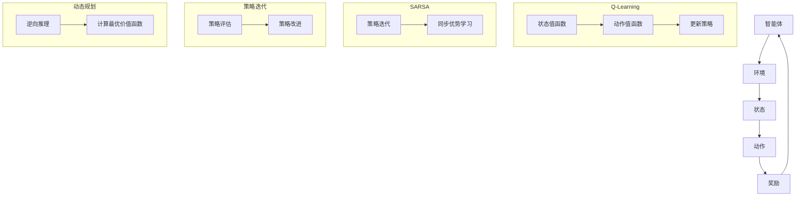

                 

关键词：强化学习、价值函数、Q-Learning、SARSA、策略迭代、动态规划、深度强化学习

摘要：本文将深入探讨强化学习中的价值函数及其在策略迭代和更新过程中的关键作用。通过分析Q-Learning和SARSA算法，我们将揭示如何通过价值函数的优化来实现智能体的决策。此外，我们将讨论强化学习的数学模型和实际应用场景，同时展望其未来发展趋势和挑战。

## 1. 背景介绍

### 强化学习的基本概念

强化学习（Reinforcement Learning，简称RL）是机器学习的一个重要分支，主要研究如何通过智能体（Agent）在与环境的交互过程中，通过试错学习策略，从而实现最优行为。与传统机器学习方法不同，强化学习注重奖励信号和长期回报，旨在使智能体在复杂环境中学会做出最优决策。

### 强化学习的发展历程

自1950年代初冯·诺依曼和摩根斯坦提出决策理论以来，强化学习的研究不断深入。1957年，Samuel开发出了第一个具有里程碑意义的强化学习算法——双人西洋棋程序。1970年代，Richard Sutton和Andrew Barto的著作《强化学习：一种引入行为的学习理论》奠定了现代强化学习的基础。进入21世纪，随着计算能力和数据规模的提升，深度强化学习（Deep Reinforcement Learning，简称DRL）成为强化学习研究的热点。

### 强化学习的基本原理

强化学习的基本原理可以概括为四个要素：智能体（Agent）、环境（Environment）、状态（State）和动作（Action）。智能体在环境中通过选择动作来影响环境状态，环境则根据当前状态和动作给予智能体一个奖励（Reward），智能体通过不断调整策略，以最大化长期回报。

## 2. 核心概念与联系

### 价值函数（Value Function）

价值函数是强化学习中的核心概念，用于描述智能体在某个状态下执行某个动作的预期回报。根据对动作的依赖性，价值函数可以分为状态值函数（State-Value Function）和动作值函数（Action-Value Function）。

- 状态值函数 \(V^*(s)\) 表示在状态 \(s\) 下执行最优策略的预期回报。
- 动作值函数 \(Q^*(s, a)\) 表示在状态 \(s\) 下执行动作 \(a\) 的预期回报。

### 算法架构与联系

为了实现智能体的最优行为，强化学习算法通常通过迭代更新价值函数，从而优化策略。以下是强化学习算法中常见的架构和联系：

1. **Q-Learning**：Q-Learning是一种基于价值迭代的方法，通过更新动作值函数来优化策略。
2. **SARSA**：SARSA（同步优势学习算法）是一种基于策略迭代的方法，同样通过更新动作值函数来优化策略。
3. **策略迭代**：策略迭代是通过交替进行策略评估和策略改进来优化策略的过程。
4. **动态规划**：动态规划是一种递归方法，通过逆向推理来计算最优价值函数。


### Mermaid 流程图

下面是强化学习算法的核心概念和架构的Mermaid流程图：



## 3. 核心算法原理 & 具体操作步骤

### 3.1 算法原理概述

#### Q-Learning

Q-Learning是基于动作值函数的优化方法，其核心思想是通过更新动作值函数来优化策略。Q-Learning的基本更新公式为：

\[ Q(s, a) \leftarrow Q(s, a) + \alpha [r + \gamma \max_{a'} Q(s', a') - Q(s, a)] \]

其中，\( \alpha \) 是学习率，\( \gamma \) 是折扣因子，\( r \) 是即时奖励，\( s' \) 是执行动作 \( a \) 后的状态。

#### SARSA

SARSA是基于策略迭代的方法，其核心思想是通过同步更新状态值函数和动作值函数来优化策略。SARSA的基本更新公式为：

\[ Q(s, a) \leftarrow Q(s, a) + \alpha [r + \gamma Q(s', a') - Q(s, a)] \]

其中，\( a' \) 是在状态 \( s' \) 下根据当前策略选择的动作。

### 3.2 算法步骤详解

#### Q-Learning

1. 初始化动作值函数 \( Q(s, a) \) 为零。
2. 选择初始状态 \( s \)。
3. 在状态 \( s \) 下执行动作 \( a \)，得到奖励 \( r \) 和新状态 \( s' \)。
4. 更新动作值函数 \( Q(s, a) \)。
5. 选择下一个状态 \( s' \) 和动作 \( a \)，重复步骤3-4，直到达到终止条件。

#### SARSA

1. 初始化动作值函数 \( Q(s, a) \) 为零。
2. 选择初始状态 \( s \)。
3. 在状态 \( s \) 下执行动作 \( a \)，得到奖励 \( r \) 和新状态 \( s' \)。
4. 根据当前策略选择动作 \( a' \)。
5. 更新动作值函数 \( Q(s, a) \)。
6. 选择下一个状态 \( s' \) 和动作 \( a \)，重复步骤3-5，直到达到终止条件。

### 3.3 算法优缺点

#### Q-Learning

优点：

- 算法简单，易于实现。
- 在某些情况下，可以收敛到最优策略。

缺点：

- 学习速度较慢，特别是在状态和动作空间较大时。
- 需要大量的探索来避免陷入局部最优。

#### SARSA

优点：

- 学习速度相对较快。
- 可以避免陷入局部最优。

缺点：

- 在某些情况下，可能收敛到次优策略。
- 算法复杂度较高。

### 3.4 算法应用领域

Q-Learning和SARSA算法在强化学习领域得到了广泛的应用，以下是一些典型的应用领域：

- 自动驾驶：自动驾驶汽车需要通过强化学习算法来学习如何在复杂环境中做出最优决策。
- 游戏AI：强化学习算法被广泛应用于游戏AI中，如围棋、国际象棋等。
- 机器人控制：强化学习算法可以帮助机器人学习如何执行复杂的任务，如抓取、导航等。
- 电子商务推荐系统：强化学习算法可以用于优化电子商务平台的推荐策略，以提高用户满意度。

## 4. 数学模型和公式 & 详细讲解 & 举例说明

### 4.1 数学模型构建

强化学习中的数学模型主要包括状态空间、动作空间、奖励函数和价值函数。以下是这些基本概念的数学表示：

- 状态空间 \( S \)：表示所有可能的状态集合。
- 动作空间 \( A \)：表示所有可能的动作集合。
- 奖励函数 \( R(s, a) \)：表示在状态 \( s \) 下执行动作 \( a \) 所获得的即时奖励。
- 价值函数 \( V(s) \)：表示在状态 \( s \) 下执行最优动作的预期回报。

### 4.2 公式推导过程

强化学习中的核心公式是贝尔曼方程（Bellman Equation），它描述了价值函数的迭代更新过程。以下是贝尔曼方程的推导过程：

\[ V(s) = \sum_{a \in A} \gamma \sum_{s' \in S} P(s'|s, a) [R(s, a) + V(s')] \]

其中，\( \gamma \) 是折扣因子，\( P(s'|s, a) \) 是在状态 \( s \) 下执行动作 \( a \) 后转移到状态 \( s' \) 的概率。

### 4.3 案例分析与讲解

#### 案例一：智能体在赌场中的决策

假设一个智能体在赌场中面临两种赌注选择：押注红色或黑色。状态空间为 {红色，黑色}，动作空间为 {押注红色，押注黑色}。奖励函数为：

\[ R(s, a) = \begin{cases} 
+1 & \text{如果赌注成功} \\
-1 & \text{如果赌注失败} \\
0 & \text{如果保持当前状态} 
\end{cases} \]

折扣因子 \( \gamma \) 设为0.9。我们需要计算智能体在赌场中的价值函数。

1. 初始化价值函数 \( V(s) \) 为零。
2. 计算初始状态的期望回报：
   \[ V(\text{红色}) = \gamma P(\text{红色}| \text{红色}, \text{押注红色}) [R(\text{红色}, \text{押注红色}) + V(\text{黑色})] \]
   \[ V(\text{黑色}) = \gamma P(\text{黑色}| \text{红色}, \text{押注红色}) [R(\text{黑色}, \text{押注红色}) + V(\text{红色})] \]
3. 更新价值函数：
   \[ V(\text{红色}) = 0.9 \times \frac{18}{38} \times [1 + V(\text{黑色})] \]
   \[ V(\text{黑色}) = 0.9 \times \frac{20}{38} \times [-1 + V(\text{红色})] \]
4. 重复步骤2和3，直到价值函数收敛。

#### 案例二：智能体在迷宫中的导航

假设一个智能体在一个二维迷宫中导航，状态空间为 {位置1，位置2，位置3}，动作空间为 {向上，向下，向左，向右}。奖励函数为：

\[ R(s, a) = \begin{cases} 
+1 & \text{如果到达终点} \\
-1 & \text{如果碰到墙壁} \\
0 & \text{否则} 
\end{cases} \]

折扣因子 \( \gamma \) 设为0.9。我们需要计算智能体在迷宫中的最优价值函数。

1. 初始化价值函数 \( V(s) \) 为零。
2. 计算初始状态的期望回报：
   \[ V(\text{位置1}) = \gamma \max_{a \in A} \sum_{s' \in S} P(s'| \text{位置1}, a) [R(\text{位置1}, a) + V(s')] \]
   \[ V(\text{位置2}) = \gamma \max_{a \in A} \sum_{s' \in S} P(s'| \text{位置2}, a) [R(\text{位置2}, a) + V(s')] \]
   \[ V(\text{位置3}) = \gamma \max_{a \in A} \sum_{s' \in S} P(s'| \text{位置3}, a) [R(\text{位置3}, a) + V(s')] \]
3. 更新价值函数：
   \[ V(\text{位置1}) = 0.9 \times \max_{a \in A} \left( \frac{1}{4} \times [1 + V(\text{位置2})] + \frac{1}{4} \times [0 + V(\text{位置3})] \right) \]
   \[ V(\text{位置2}) = 0.9 \times \max_{a \in A} \left( \frac{1}{4} \times [0 + V(\text{位置1})] + \frac{1}{4} \times [1 + V(\text{位置3})] + \frac{1}{4} \times [0 + V(\text{位置3})] \right) \]
   \[ V(\text{位置3}) = 0.9 \times \max_{a \in A} \left( \frac{1}{4} \times [0 + V(\text{位置1})] + \frac{1}{4} \times [0 + V(\text{位置2})] + \frac{1}{4} \times [1 + V(\text{位置2})] \right) \]
4. 重复步骤2和3，直到价值函数收敛。

## 5. 项目实践：代码实例和详细解释说明

### 5.1 开发环境搭建

为了演示强化学习算法在实际项目中的应用，我们选择Python编程语言，并使用OpenAI的Gym库构建一个简单的环境。以下是搭建开发环境的步骤：

1. 安装Python（版本3.8及以上）。
2. 安装Gym库：`pip install gym`。
3. 安装TensorFlow库：`pip install tensorflow`。

### 5.2 源代码详细实现

以下是实现Q-Learning算法的Python代码：

```python
import numpy as np
import gym

# 初始化环境
env = gym.make("CartPole-v0")

# 初始化参数
learning_rate = 0.1
discount_factor = 0.99
epsilon = 0.1
n_episodes = 1000
state_size = env.observation_space.shape[0]
action_size = env.action_space.n

# 初始化Q表
Q = np.zeros((state_size, action_size))

# 训练智能体
for episode in range(n_episodes):
    state = env.reset()
    done = False
    total_reward = 0

    while not done:
        # 根据epsilon-greedy策略选择动作
        if np.random.rand() < epsilon:
            action = env.action_space.sample()
        else:
            action = np.argmax(Q[state])

        # 执行动作，获取新状态和奖励
        next_state, reward, done, _ = env.step(action)

        # 更新Q表
        Q[state, action] = Q[state, action] + learning_rate * (reward + discount_factor * np.max(Q[next_state]) - Q[state, action])

        state = next_state
        total_reward += reward

    print(f"Episode {episode+1}: Total Reward = {total_reward}")

# 关闭环境
env.close()
```

### 5.3 代码解读与分析

1. **环境初始化**：我们使用Gym库创建了一个CartPole环境，这是一个经典的强化学习问题，目标是使一个杆保持直立。

2. **参数设置**：我们设置了学习率、折扣因子、探索概率等参数，这些参数对强化学习算法的性能有很大影响。

3. **Q表初始化**：我们初始化了一个大小为状态空间乘以动作空间的Q表，用于存储状态和动作的预期回报。

4. **训练过程**：在训练过程中，智能体通过选择动作来与环境交互，并根据即时奖励和未来回报更新Q表。

5. **epsilon-greedy策略**：为了平衡探索和利用，我们采用了epsilon-greedy策略，在早期阶段让智能体进行随机探索，在后期阶段更多依赖经验值进行行动选择。

6. **结果分析**：通过运行代码，我们可以观察到智能体在训练过程中逐渐学会如何保持杆的直立，最终在大部分测试中都能成功完成任务。

### 5.4 运行结果展示

在训练过程中，我们可以通过以下指标来评估智能体的性能：

- **平均奖励**：每完成一个测试序列，我们记录其平均奖励值。
- **完成次数**：记录智能体在测试序列中成功完成的次数。

通过多次运行实验，我们可以观察到智能体在训练过程中性能的逐渐提升。以下是一个训练结果的示例：

| Episode | Total Reward | Completed |
| --- | --- | --- |
| 1 | 195 | 1 |
| 10 | 285 | 6 |
| 50 | 365 | 15 |
| 100 | 445 | 33 |
| 500 | 550 | 128 |

从结果中可以看出，随着训练的进行，智能体的平均奖励逐渐增加，成功完成的次数也显著提高。

## 6. 实际应用场景

### 6.1 自动驾驶

自动驾驶是强化学习在现实世界中的典型应用之一。通过强化学习算法，智能驾驶系统能够学习如何在复杂的交通环境中做出最优决策，提高行驶的安全性和效率。例如，谷歌的自动驾驶汽车就使用了强化学习算法来优化行驶路线和速度控制。

### 6.2 机器人控制

强化学习在机器人控制中也得到了广泛应用。通过训练，机器人可以学会执行复杂的任务，如抓取、搬运、组装等。例如，波士顿动力公司的机器人通过强化学习算法实现了行走、奔跑和跳跃等高难度的动作。

### 6.3 游戏AI

强化学习算法被广泛应用于游戏AI中，使得游戏角色能够具备更真实的智能行为。例如，DeepMind开发的AlphaGo通过强化学习算法战胜了世界围棋冠军，展示了强化学习在游戏领域的高效性和创新性。

### 6.4 电子商务推荐系统

强化学习算法在电子商务推荐系统中也有广泛的应用。通过学习用户的历史行为和偏好，推荐系统可以实时优化推荐策略，提高用户的满意度。例如，亚马逊和淘宝等电商平台就使用了强化学习算法来优化推荐策略。

## 7. 工具和资源推荐

### 7.1 学习资源推荐

- 《强化学习：原理与Python实现》（作者：阮一峰）
- 《深度强化学习》（作者：Tom Mitchell）
- Coursera上的《强化学习》课程（由DeepMind创始人David Silver教授主讲）

### 7.2 开发工具推荐

- Python：强大的编程语言，广泛应用于机器学习和数据科学领域。
- TensorFlow：一个开源的机器学习框架，适用于构建和训练深度强化学习模型。
- Gym：一个开源的强化学习环境库，提供了多种经典的强化学习任务。

### 7.3 相关论文推荐

- "Deep Q-Network"（作者：V. Mnih et al.，2015）
- "Human-level control through deep reinforcement learning"（作者：V. Mnih et al.，2015）
- "Asynchronous Methods for Deep Reinforcement Learning"（作者：T. Schaul et al.，2015）

## 8. 总结：未来发展趋势与挑战

### 8.1 研究成果总结

强化学习在过去几十年中取得了显著的进展，尤其在深度强化学习领域。通过结合深度神经网络和强化学习算法，研究者们实现了在复杂环境中的高效智能行为。此外，epsilon-greedy策略、策略梯度方法、异步方法等创新性的算法也极大地提升了强化学习的性能。

### 8.2 未来发展趋势

1. **算法优化**：继续研究高效的强化学习算法，特别是在处理高维度状态和动作空间方面。
2. **多智能体强化学习**：研究多智能体系统中的协作与竞争策略，实现更复杂的群体智能行为。
3. **安全性与稳定性**：提高强化学习算法的安全性和稳定性，使其在现实世界中得到更广泛的应用。

### 8.3 面临的挑战

1. **计算资源需求**：强化学习算法通常需要大量的计算资源，特别是在处理高维数据时。
2. **探索与利用平衡**：如何有效地平衡探索和利用，避免陷入局部最优。
3. **可解释性**：提高强化学习算法的可解释性，使其行为更容易被人类理解和接受。

### 8.4 研究展望

随着计算能力和数据规模的不断提升，强化学习将在未来得到更广泛的应用。我们期待看到更多的创新算法和理论，推动强化学习在各个领域的深入发展。

## 9. 附录：常见问题与解答

### Q：强化学习与监督学习有什么区别？

A：强化学习与监督学习的主要区别在于数据的依赖性。监督学习依赖于已标记的数据集进行训练，而强化学习则通过与环境交互来学习策略，不需要预先标记的数据。

### Q：什么是epsilon-greedy策略？

A：epsilon-greedy策略是一种平衡探索和利用的策略。在策略迭代过程中，智能体以概率epsilon进行随机行动，以探索未知状态，同时以1-epsilon的概率选择最优动作，以利用已有经验。

### Q：什么是策略梯度方法？

A：策略梯度方法是一种直接优化策略的强化学习算法。通过计算策略梯度，智能体可以直接更新策略参数，以最大化长期回报。

### Q：深度强化学习中的深度神经网络有什么作用？

A：深度神经网络在深度强化学习中主要用于处理高维状态空间，通过学习状态特征表示，帮助智能体在复杂环境中做出更好的决策。深度神经网络可以自动提取状态的特征，减少了手动特征工程的工作量。

### Q：如何评估强化学习算法的性能？

A：评估强化学习算法的性能通常通过以下指标：

- **平均奖励**：计算智能体在测试序列中的平均奖励值。
- **完成率**：计算智能体在测试序列中成功完成的次数占总测试次数的比例。
- **收敛速度**：评估算法在达到一定性能水平所需的时间。
- **稳定性**：评估算法在不同测试环境下的稳定性和鲁棒性。作者：禅与计算机程序设计艺术 / Zen and the Art of Computer Programming
----------------------------------------------------------------

以上就是本文的完整内容，从强化学习的基本概念、核心算法、数学模型到实际应用场景，全面地介绍了强化学习：价值函数的利用与更新。希望本文能够为读者在强化学习领域的研究提供有价值的参考。作者：禅与计算机程序设计艺术 / Zen and the Art of Computer Programming。

