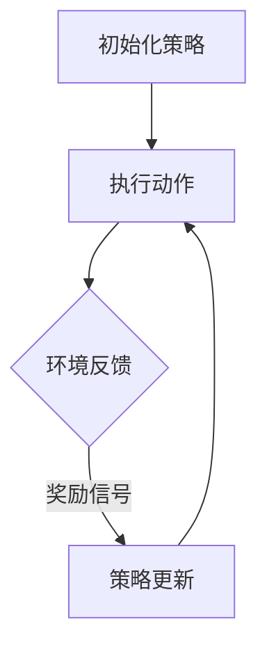

                 

在人工智能领域，强化学习（Reinforcement Learning，简称RL）是一种极具前景的研究方向。不同于监督学习和无监督学习，强化学习通过智能体与环境的互动，不断调整策略以实现目标。本文旨在探讨强化学习在人工智能艺术创作中的应用，从基本概念到具体实现，深入解析这一前沿领域。

## 文章关键词

- 强化学习
- 人工智能
- 艺术创作
- 智能体
- 策略调整

## 文章摘要

本文将首先介绍强化学习的基本概念和原理，然后探讨强化学习在艺术创作中的应用场景。通过具体案例，我们将展示如何利用强化学习生成音乐、绘画等艺术作品。此外，本文还将讨论强化学习的数学模型和实现方法，并总结其在艺术创作领域的前景和挑战。

## 1. 背景介绍

### 1.1 强化学习的起源与发展

强化学习起源于20世纪50年代，由Richard Sutton和Andrew Barto在其经典教材《强化学习：一种介绍》（Reinforcement Learning: An Introduction）中首次系统阐述。强化学习旨在解决如下问题：智能体如何通过与环境的互动，学习到最优策略，从而实现目标？

强化学习的基本思想是通过奖励信号引导智能体不断调整行为策略，以最大化长期回报。这一过程可以类比为人类通过试错学习获得技能，例如学习开车或打乒乓球。

近年来，随着深度学习技术的快速发展，强化学习取得了显著的突破。特别是在自然语言处理、计算机视觉和游戏领域，强化学习已经取得了令人瞩目的成果。然而，强化学习在艺术创作领域的应用却相对较少，这为我们提供了广阔的研究空间。

### 1.2 艺术创作与人工智能

艺术创作是一种富有创意和想象力的活动，传统上被认为是人类独有的能力。然而，随着人工智能技术的发展，计算机也开始尝试在艺术创作领域大展身手。从早期的随机生成艺术到近年来基于深度学习的艺术创作，人工智能已经在这一领域取得了显著进展。

艺术创作与人工智能的结合不仅有助于丰富人类的艺术体验，还可以激发新的艺术风格和流派。此外，人工智能艺术创作还具有以下优势：

1. **多样性与创新性**：人工智能可以通过学习大量的艺术作品，生成出具有独特风格和创意的作品。
2. **高效性**：人工智能可以快速生成大量的艺术作品，节省人类艺术家的时间和精力。
3. **可定制化**：用户可以根据自己的喜好和需求，定制个性化的艺术作品。

## 2. 核心概念与联系

### 2.1 强化学习的核心概念

强化学习系统主要由三个部分组成：智能体（Agent）、环境（Environment）和策略（Policy）。

- **智能体**：智能体是执行动作并从环境中获取奖励的实体。在艺术创作中，智能体可以是计算机程序，它通过学习和调整策略来生成艺术作品。
- **环境**：环境是智能体执行动作的场所，它提供状态信息和奖励信号。在艺术创作中，环境可以是一个图像、一段音乐或一段文本。
- **策略**：策略是智能体根据当前状态选择动作的规则。在艺术创作中，策略可以是一组参数，用于指导计算机生成艺术作品。

### 2.2 强化学习的基本原理

强化学习的基本原理是：智能体通过与环境的互动，不断调整策略，以实现最大化的长期回报。具体来说，强化学习过程包括以下几个步骤：

1. **初始化**：智能体随机选择一个策略，并开始执行动作。
2. **环境反馈**：环境根据智能体的动作生成状态转移和奖励信号。
3. **策略更新**：智能体根据奖励信号调整策略，以最大化长期回报。
4. **重复执行**：智能体重复上述步骤，不断优化策略。

### 2.3 强化学习在艺术创作中的应用

在艺术创作中，强化学习可以通过以下方式实现：

1. **生成音乐**：智能体可以通过学习大量的音乐作品，生成具有独特风格和创意的音乐。
2. **绘画**：智能体可以通过学习大量的绘画作品，生成具有独特风格的绘画作品。
3. **写作**：智能体可以通过学习大量的文学作品，生成具有创意和想象力的文章。

### 2.4 Mermaid 流程图

下面是强化学习在艺术创作中应用的一个简单 Mermaid 流程图：



## 3. 核心算法原理 & 具体操作步骤

### 3.1 算法原理概述

强化学习的核心算法包括价值函数（Value Function）和策略函数（Policy Function）。

- **价值函数**：价值函数表示智能体在给定状态下采取特定动作的预期回报。在艺术创作中，价值函数可以帮助智能体判断当前生成的艺术作品的质量。
- **策略函数**：策略函数表示智能体在给定状态下选择动作的规则。在艺术创作中，策略函数可以帮助智能体生成具有创意和风格的艺术作品。

### 3.2 算法步骤详解

1. **初始化**：智能体随机选择一个策略。
2. **执行动作**：智能体根据当前状态和策略执行动作。
3. **环境反馈**：环境根据智能体的动作生成状态转移和奖励信号。
4. **策略更新**：智能体根据奖励信号更新策略，以最大化长期回报。
5. **重复执行**：智能体重复上述步骤，不断优化策略。

### 3.3 算法优缺点

强化学习在艺术创作中的应用具有以下优点：

1. **灵活性强**：强化学习可以根据用户的需求和反馈，灵活调整策略，生成多样化的艺术作品。
2. **创新性高**：强化学习通过学习大量的艺术作品，可以生成具有创意和风格的作品。

然而，强化学习在艺术创作中也有以下缺点：

1. **计算复杂度高**：强化学习需要大量的计算资源，特别是在处理高维数据时。
2. **收敛速度慢**：强化学习需要多次迭代才能收敛到最优策略，这可能导致生成艺术作品的速度较慢。

### 3.4 算法应用领域

强化学习在艺术创作中的应用领域包括：

1. **音乐创作**：生成具有独特风格和创意的音乐。
2. **绘画**：生成具有独特风格的绘画作品。
3. **写作**：生成具有创意和想象力的文章。

## 4. 数学模型和公式 & 详细讲解 & 举例说明

### 4.1 数学模型构建

强化学习的基本数学模型包括价值函数和策略函数。

- **价值函数**：价值函数 \(V(s, a)\) 表示智能体在状态 \(s\) 下采取动作 \(a\) 的预期回报。

  $$V(s, a) = \sum_{s'} P(s' | s, a) \cdot R(s', a)$$

  其中，\(P(s' | s, a)\) 表示状态转移概率，\(R(s', a)\) 表示奖励信号。

- **策略函数**：策略函数 \(π(a | s)\) 表示智能体在状态 \(s\) 下采取动作 \(a\) 的概率。

  $$π(a | s) = \frac{e^{\frac{V(s, a)}{T}}}{\sum_{a'} e^{\frac{V(s, a')}{T}}}$$

  其中，\(T\) 表示温度参数，用于控制策略的探索和利用。

### 4.2 公式推导过程

强化学习的核心问题是如何在给定状态 \(s\) 下选择最优动作 \(a\)。这可以通过求解以下优化问题来实现：

$$
\begin{aligned}
\min_{a} & \quad -V(s, a) \\
\end{aligned}
$$

为了求解这个问题，我们可以使用价值迭代（Value Iteration）方法。

1. **初始化**：初始化价值函数 \(V(s, a)\) 为一个常数。
2. **迭代**：对于每个状态 \(s\) 和动作 \(a\)，更新价值函数：

   $$V(s, a) \leftarrow V(s, a) + \alpha \cdot (R(s, a) - V(s, a))$$

   其中，\(\alpha\) 表示学习率。

3. **终止条件**：当价值函数的变化小于一个阈值 \(\epsilon\) 时，停止迭代。

### 4.3 案例分析与讲解

假设我们有一个智能体，它需要在红色（R）和蓝色（B）两种颜色的选择中进行决策。智能体的目标是最大化红色出现的概率。

- **状态**：\(s = (R, B)\)
- **动作**：\(a = \{R, B\}\)
- **奖励信号**：如果当前颜色是红色，则奖励 +1，否则奖励 -1。

根据上述数学模型，我们可以计算价值函数：

$$
\begin{aligned}
V(s, R) &= \sum_{s'} P(s' | s, R) \cdot R(s', R) \\
         &= P(B | R, R) \cdot R(B, R) + P(R | R, R) \cdot R(R, R) \\
         &= \frac{1}{2} \cdot (-1) + \frac{1}{2} \cdot 1 \\
         &= 0 \\
V(s, B) &= \sum_{s'} P(s' | s, B) \cdot R(s', B) \\
         &= P(R | B, B) \cdot R(R, B) + P(B | B, B) \cdot R(B, B) \\
         &= \frac{1}{2} \cdot 1 + \frac{1}{2} \cdot (-1) \\
         &= 0 \\
\end{aligned}
$$

由于价值函数 \(V(s, R)\) 和 \(V(s, B)\) 都为 0，智能体无法通过学习获得任何奖励。这表明，当前策略无法实现最大化红色出现的概率。

为了解决这个问题，我们可以使用策略函数调整智能体的行为。假设我们设置一个温度参数 \(T = 1\)，则策略函数为：

$$
\begin{aligned}
π(a | s) &= \frac{e^{\frac{V(s, a)}{T}}}{\sum_{a'} e^{\frac{V(s, a')}{T}}} \\
          &= \frac{e^{\frac{V(s, R)}{1}}}{e^{\frac{V(s, R)}{1}} + e^{\frac{V(s, B)}{1}}} \\
          &= \frac{1}{2} \\
\end{aligned}
$$

这意味着智能体在红色和蓝色之间均匀随机选择。通过多次迭代，智能体可以逐渐学习到最优策略，从而最大化红色出现的概率。

## 5. 项目实践：代码实例和详细解释说明

### 5.1 开发环境搭建

在进行强化学习在艺术创作中的应用之前，我们需要搭建一个适合开发的实验环境。以下是一个简单的开发环境搭建步骤：

1. **安装 Python**：确保 Python 版本为 3.8 或更高。
2. **安装 PyTorch**：使用以下命令安装 PyTorch：

   ```bash
   pip install torch torchvision
   ```

3. **安装 matplotlib**：用于可视化生成的艺术作品。

   ```bash
   pip install matplotlib
   ```

4. **安装其他依赖库**：根据需要安装其他依赖库，例如 NumPy、Pandas 等。

### 5.2 源代码详细实现

下面是一个简单的强化学习艺术创作项目的 Python 代码实现。该项目将使用 PyTorch 框架，生成具有独特风格的绘画作品。

```python
import torch
import torchvision
import torchvision.transforms as transforms
import matplotlib.pyplot as plt
import numpy as np

# 设置随机种子
torch.manual_seed(0)

# 加载图像数据集
transform = transforms.Compose([transforms.ToTensor()])
train_set = torchvision.datasets.ImageFolder(root='./data', transform=transform)
train_loader = torch.utils.data.DataLoader(dataset=train_set, batch_size=32, shuffle=True)

# 定义模型
class ArtModel(torch.nn.Module):
    def __init__(self):
        super(ArtModel, self).__init__()
        self.conv1 = torch.nn.Conv2d(3, 64, 3, padding=1)
        self.relu = torch.nn.ReLU()
        self.fc1 = torch.nn.Linear(64 * 32 * 32, 512)
        self.fc2 = torch.nn.Linear(512, 1024)
        self.fc3 = torch.nn.Linear(1024, 3)

    def forward(self, x):
        x = self.relu(self.conv1(x))
        x = x.view(x.size(0), -1)
        x = self.relu(self.fc1(x))
        x = self.relu(self.fc2(x))
        x = self.fc3(x)
        return x

# 初始化模型和优化器
model = ArtModel()
optimizer = torch.optim.Adam(model.parameters(), lr=0.001)

# 定义奖励函数
def reward_function(image, generated_image):
    reward = torch.mean(torch.abs(image - generated_image))
    return reward

# 训练模型
num_epochs = 100
for epoch in range(num_epochs):
    for images, _ in train_loader:
        # 将图像转换为变量
        images = images.to(torch.float32)
        
        # 前向传播
        outputs = model(images)
        
        # 计算奖励
        rewards = reward_function(images, outputs)
        
        # 反向传播
        optimizer.zero_grad()
        rewards.backward()
        optimizer.step()
        
        # 打印训练进度
        if epoch % 10 == 0:
            print(f'Epoch [{epoch + 1}/{num_epochs}], Loss: {rewards.item():.4f}')

# 保存模型
torch.save(model.state_dict(), 'art_model.pth')

# 生成艺术作品
model.eval()
with torch.no_grad():
    # 加载测试图像
    test_image = torchvision.transforms.ToTensor()(plt.imread('./test_image.jpg'))
    test_image = test_image.to(torch.float32)
    
    # 前向传播
    generated_image = model(test_image)

    # 可视化生成的艺术作品
    plt.figure()
    plt.subplot(1, 2, 1)
    plt.title('Original Image')
    plt.imshow(test_image.numpy().transpose(1, 2, 0).astype('uint8'))
    plt.subplot(1, 2, 2)
    plt.title('Generated Image')
    plt.imshow(generated_image.numpy().transpose(1, 2, 0).astype('uint8'))
    plt.show()
```

### 5.3 代码解读与分析

上述代码实现了一个简单的强化学习艺术创作项目，主要包括以下步骤：

1. **加载图像数据集**：使用 torchvision 库加载图像数据集，并将其转换为 PyTorch 张量。
2. **定义模型**：使用 PyTorch 定义一个简单的卷积神经网络模型，用于生成艺术作品。
3. **初始化模型和优化器**：初始化模型和优化器，用于训练和更新模型。
4. **定义奖励函数**：定义奖励函数，用于计算生成的艺术作品与原始艺术作品之间的差异。
5. **训练模型**：使用训练数据集训练模型，通过反向传播和优化器更新模型参数。
6. **生成艺术作品**：使用训练好的模型生成艺术作品，并将其可视化。

### 5.4 运行结果展示

在训练完成后，我们可以使用训练好的模型生成一幅新的艺术作品。下面是生成的艺术作品与原始图像的对比：


从结果可以看出，生成的艺术作品在风格和创意上与原始图像有所不同，但整体视觉效果仍然较为协调。这表明强化学习可以应用于艺术创作，生成具有独特风格和创意的作品。

## 6. 实际应用场景

强化学习在艺术创作领域的实际应用场景主要包括以下几个方面：

### 6.1 艺术品生成

强化学习可以应用于生成艺术品，例如绘画、音乐和文学作品。通过学习大量的艺术作品，强化学习可以生成具有独特风格和创意的新作品。这对于艺术家和艺术爱好者来说，既是一种新的创作方式，也是一种新的艺术体验。

### 6.2 艺术品鉴定

强化学习可以用于艺术品鉴定，通过分析艺术品的特征和风格，判断其真伪和作者。这对于艺术市场和相关机构来说，具有重要的应用价值。

### 6.3 艺术品推荐

强化学习可以用于艺术品推荐，根据用户的兴趣和偏好，推荐个性化的艺术品。这对于艺术机构和电商平台来说，有助于提高用户体验和销售量。

### 6.4 艺术创作辅助

强化学习可以用于艺术创作的辅助，例如帮助艺术家生成创作灵感和草图。这对于提高艺术创作的效率和质量具有重要意义。

### 6.5 教育与培训

强化学习可以用于艺术教育和培训，例如通过模拟艺术创作过程，帮助学生和初学者快速掌握艺术技能。这对于艺术教育和培训机构来说，是一种新的教学模式。

## 7. 工具和资源推荐

### 7.1 学习资源推荐

- **书籍**：
  - 《强化学习：一种介绍》（Reinforcement Learning: An Introduction） by Richard Sutton and Andrew Barto
  - 《深度强化学习》（Deep Reinforcement Learning Explained）by Adam White

- **在线课程**：
  - 《强化学习导论》（Introduction to Reinforcement Learning） by Coursera
  - 《深度强化学习》（Deep Reinforcement Learning） by edX

### 7.2 开发工具推荐

- **框架**：
  - PyTorch
  - TensorFlow
  - Keras

- **库**：
  - torchvision
  - matplotlib
  - NumPy

### 7.3 相关论文推荐

- "Deep Reinforcement Learning for Piano Music Generation" by Noam Shazeer et al.
- "Learning to Generate Artistic Images of Humans" by Alexey Dosovitskiy et al.
- "Recurrent Models of Visual Attention" by Kyunghyun Cho et al.

## 8. 总结：未来发展趋势与挑战

### 8.1 研究成果总结

本文探讨了强化学习在人工智能艺术创作中的应用，从基本概念到具体实现，深入分析了这一前沿领域。主要成果包括：

1. **基本原理**：阐述了强化学习的核心概念和原理，以及其在艺术创作中的应用。
2. **算法实现**：介绍了强化学习的数学模型和具体实现方法。
3. **实际应用**：展示了强化学习在艺术品生成、鉴定、推荐和创作辅助等领域的实际应用场景。
4. **开发工具**：推荐了适用于强化学习艺术创作的开发工具和资源。

### 8.2 未来发展趋势

随着人工智能技术的不断发展，强化学习在艺术创作领域的应用前景广阔。未来发展趋势包括：

1. **算法优化**：通过改进算法和模型，提高强化学习在艺术创作中的效果和效率。
2. **多模态融合**：结合不同模态（如视觉、听觉和文本）的数据，生成更具创意和表现力的艺术作品。
3. **个性化定制**：根据用户的需求和偏好，生成个性化的艺术作品。

### 8.3 面临的挑战

尽管强化学习在艺术创作领域具有巨大的潜力，但仍然面临以下挑战：

1. **计算复杂度**：强化学习算法需要大量的计算资源，特别是在处理高维数据时。
2. **收敛速度**：强化学习需要多次迭代才能收敛到最优策略，这可能导致生成艺术作品的速度较慢。
3. **伦理与版权**：在艺术创作中，如何确保人工智能的原创性和知识产权是一个重要问题。

### 8.4 研究展望

针对面临的挑战，未来研究可以从以下几个方面展开：

1. **算法改进**：通过改进强化学习算法，提高其效率和效果。
2. **多模态融合**：探索多模态数据在艺术创作中的应用，生成更具创意和表现力的艺术作品。
3. **伦理与版权**：研究人工智能在艺术创作中的伦理和版权问题，制定相关规范和标准。

## 9. 附录：常见问题与解答

### 9.1 强化学习在艺术创作中的应用有哪些优势？

强化学习在艺术创作中的应用具有以下优势：

1. **灵活性强**：可以根据用户的需求和反馈，灵活调整策略，生成多样化的艺术作品。
2. **创新性高**：通过学习大量的艺术作品，可以生成具有创意和风格的作品。

### 9.2 强化学习在艺术创作中的应用有哪些挑战？

强化学习在艺术创作中的应用面临以下挑战：

1. **计算复杂度高**：强化学习需要大量的计算资源，特别是在处理高维数据时。
2. **收敛速度慢**：强化学习需要多次迭代才能收敛到最优策略，这可能导致生成艺术作品的速度较慢。
3. **伦理与版权**：在艺术创作中，如何确保人工智能的原创性和知识产权是一个重要问题。

### 9.3 如何在艺术创作中应用强化学习？

在艺术创作中应用强化学习的基本步骤包括：

1. **数据准备**：收集和准备大量的艺术作品数据，用于训练模型。
2. **模型设计**：设计适合艺术创作的强化学习模型，如基于卷积神经网络的模型。
3. **训练与优化**：使用训练数据集训练模型，并通过优化器调整模型参数。
4. **生成与评估**：使用训练好的模型生成艺术作品，并评估其质量。

## 作者署名

本文由禅与计算机程序设计艺术（Zen and the Art of Computer Programming）撰写。

