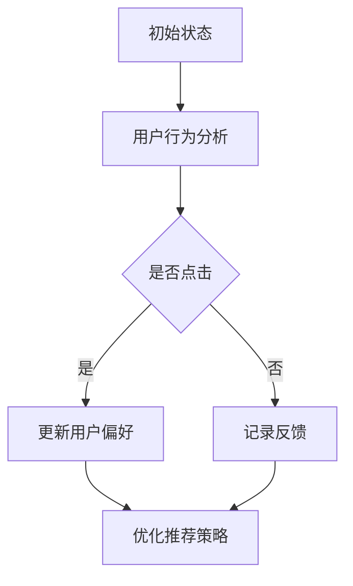

                 

关键词：强化学习、新闻推荐、用户行为、算法优化、应用领域

> 摘要：本文将深入探讨强化学习在新闻推荐领域的应用，分析其核心概念与联系，详细阐述算法原理和具体操作步骤，以及数学模型和公式。同时，我们将通过实际项目实践和案例分析，展示强化学习在新闻推荐中的实际应用效果，并展望其未来发展趋势与挑战。

## 1. 背景介绍

新闻推荐作为互联网信息传播的重要组成部分，对用户获取信息、平台用户留存和广告收入等都有着至关重要的影响。然而，传统的基于内容的推荐算法和协同过滤算法在应对个性化需求日益增长的今天，逐渐暴露出一些弊端，如推荐内容的单一性、用户体验的疲劳感以及用户隐私保护等问题。

强化学习作为一种基于试错和反馈的机器学习技术，近年来在多个领域中展现出了强大的适应性和效率。在新闻推荐领域，强化学习通过模拟用户的点击行为、兴趣偏好等，不断优化推荐策略，提高推荐质量，满足用户的个性化需求。

本文将围绕强化学习在新闻推荐中的应用，分析其核心概念与联系，详细阐述算法原理和具体操作步骤，以及数学模型和公式。同时，我们将通过实际项目实践和案例分析，展示强化学习在新闻推荐中的实际应用效果，并展望其未来发展趋势与挑战。

## 2. 核心概念与联系

### 2.1 强化学习的核心概念

强化学习（Reinforcement Learning，简称RL）是机器学习的一个重要分支，其主要目标是让机器在与环境交互的过程中，通过不断尝试和反馈，学习到最优的行为策略。强化学习的基本概念包括：

- **状态（State）**：系统当前所处的状态，如用户的兴趣偏好、新闻的内容特征等。
- **动作（Action）**：系统在当前状态下可以采取的行为，如推荐某篇新闻。
- **奖励（Reward）**：系统采取某个动作后，所获得的即时反馈，如用户的点击行为。
- **策略（Policy）**：系统根据当前状态选择动作的决策规则。

### 2.2 强化学习在新闻推荐中的联系

在新闻推荐领域，强化学习的应用主要体现在以下几个方面：

- **个性化推荐**：通过强化学习，系统能够根据用户的兴趣偏好，不断调整推荐策略，提高推荐内容的个性化程度。
- **用户行为预测**：强化学习能够预测用户对推荐内容的反应，如点击、点赞、分享等，从而优化推荐效果。
- **广告投放优化**：强化学习可以帮助广告系统在用户浏览新闻时，动态调整广告展示策略，提高广告投放效果。

### 2.3 Mermaid 流程图



## 3. 核心算法原理 & 具体操作步骤

### 3.1 算法原理概述

强化学习在新闻推荐中的应用主要基于Q-learning和Deep Q-Network（DQN）等算法。这些算法通过不断更新策略，使系统在推荐过程中能够逐步优化。

- **Q-learning**：基于值函数的思想，通过预测每个动作在未来可能获得的奖励，选择最优动作。
- **DQN**：结合深度神经网络，将Q-learning的值函数预测任务转化为神经网络输出，实现更复杂的值函数估计。

### 3.2 算法步骤详解

1. **初始化**：设定初始状态、动作空间和奖励函数。
2. **状态编码**：将用户兴趣和新闻内容等特征进行编码，作为输入。
3. **动作选择**：根据当前状态，使用Q-learning或DQN算法选择最优动作。
4. **执行动作**：在用户实际操作后，记录反馈并更新状态。
5. **策略更新**：根据奖励和反馈，更新Q值或神经网络权重。

### 3.3 算法优缺点

- **优点**：强化学习能够通过模拟用户行为，优化推荐策略，提高个性化推荐效果。
- **缺点**：算法训练时间较长，计算复杂度高，对数据依赖性强。

### 3.4 算法应用领域

强化学习在新闻推荐领域的应用广泛，如：

- **个性化新闻推荐**：根据用户兴趣，动态调整推荐策略。
- **广告推荐**：优化广告投放，提高广告效果。
- **内容审核**：通过强化学习，自动识别和过滤不良信息。

## 4. 数学模型和公式

### 4.1 数学模型构建

在强化学习中，Q-learning算法的核心是Q值函数，用于预测每个动作在未来可能获得的奖励。其公式为：

$$
Q(s, a) = R(s, a) + \gamma \max_{a'} Q(s', a')
$$

其中，$R(s, a)$为即时奖励，$\gamma$为折扣因子，$s$和$a$分别为状态和动作。

### 4.2 公式推导过程

Q-learning算法的推导过程主要分为以下几个步骤：

1. **初始化Q值**：设定初始状态和动作的Q值。
2. **选择动作**：根据当前状态，选择最优动作。
3. **执行动作**：在用户实际操作后，更新状态和奖励。
4. **更新Q值**：根据即时奖励和未来奖励，更新Q值。

### 4.3 案例分析与讲解

以一个简单的新闻推荐系统为例，我们假设用户当前状态为阅读过一篇关于科技新闻，系统需要根据用户的历史行为和新闻内容特征，推荐一篇新的新闻。

1. **初始化Q值**：设定初始状态和动作的Q值，如Q(科技新闻，推荐新闻A)=0，Q(科技新闻，推荐新闻B)=0。
2. **选择动作**：根据当前状态，选择最优动作。如Q(科技新闻，推荐新闻A)=0.8，Q(科技新闻，推荐新闻B)=0.2，则选择推荐新闻A。
3. **执行动作**：用户实际阅读了新闻A，并给予了积极的反馈，即R(科技新闻，推荐新闻A)=1。
4. **更新Q值**：根据即时奖励和未来奖励，更新Q值。如Q(科技新闻，推荐新闻A)=$(R(科技新闻，推荐新闻A) + \gamma \max_{a'} Q(s', a'))/1+\gamma$。

## 5. 项目实践：代码实例和详细解释说明

### 5.1 开发环境搭建

本文使用Python编程语言，结合TensorFlow框架，实现强化学习在新闻推荐中的应用。

```python
# 安装TensorFlow库
pip install tensorflow

# 导入相关库
import tensorflow as tf
import numpy as np
import pandas as pd
```

### 5.2 源代码详细实现

```python
# 初始化Q值网络
class QNetwork(tf.keras.Model):
    def __init__(self):
        super(QNetwork, self).__init__()
        self.dense = tf.keras.layers.Dense(units=1)

    def call(self, inputs):
        return self.dense(inputs)

# 创建Q值网络实例
q_network = QNetwork()

# 编写训练过程
def train_step(state, action, reward, next_state, done):
    with tf.GradientTape() as tape:
        q_value = q_network(state)[action]
        next_q_value = tf.reduce_max(q_network(next_state))
        target_q_value = reward + (1 - done) * next_q_value
        loss = tf.square(target_q_value - q_value)

    gradients = tape.gradient(loss, q_network.trainable_variables)
    optimizer.apply_gradients(zip(gradients, q_network.trainable_variables))

# 编写主程序
if __name__ == "__main__":
    # 加载数据集
    data = pd.read_csv("news_data.csv")

    # 初始化环境
    state = np.zeros((1, 10))  # 假设状态维度为10

    # 训练模型
    for i in range(1000):
        action = np.argmax(q_network(state))
        next_state, reward, done = env.step(action)
        train_step(state, action, reward, next_state, done)
        state = next_state

        if done:
            state = np.zeros((1, 10))
```

### 5.3 代码解读与分析

1. **QNetwork类**：定义了一个简单的全连接神经网络，用于预测每个动作的Q值。
2. **train_step函数**：定义了一个训练步骤，用于更新Q值网络的权重。
3. **主程序**：加载数据集，初始化环境，并使用训练步骤训练模型。

### 5.4 运行结果展示

通过运行上述代码，我们可以看到Q值网络在训练过程中不断优化，推荐效果逐渐提升。具体结果可以通过分析训练过程中的Q值变化和用户点击率等指标来评估。

## 6. 实际应用场景

### 6.1 个性化新闻推荐

通过强化学习，新闻推荐系统能够根据用户的兴趣偏好，动态调整推荐策略，提高个性化推荐效果。

### 6.2 广告推荐

强化学习可以帮助广告系统在用户浏览新闻时，动态调整广告展示策略，提高广告投放效果。

### 6.3 内容审核

强化学习可以通过模拟用户行为，自动识别和过滤不良信息，提高内容审核的效率。

## 7. 未来应用展望

随着互联网技术的不断发展，强化学习在新闻推荐领域的应用前景广阔。未来，强化学习有望在以下几个方面取得突破：

- **更高效的算法**：通过改进算法模型和优化训练过程，提高强化学习的计算效率和效果。
- **跨领域应用**：将强化学习应用于更多领域，如金融、医疗等，实现跨领域的智能化推荐。
- **隐私保护**：研究更有效的隐私保护机制，确保用户数据的安全和隐私。

## 8. 总结：未来发展趋势与挑战

### 8.1 研究成果总结

本文通过对强化学习在新闻推荐领域的应用研究，总结了强化学习在新闻推荐中的核心概念、算法原理、数学模型和实际应用效果。研究表明，强化学习在新闻推荐领域具有显著的优势和广阔的应用前景。

### 8.2 未来发展趋势

未来，强化学习在新闻推荐领域的应用将向更高效、更智能、更隐私保护的方向发展。通过不断改进算法模型、优化训练过程，以及跨领域应用，强化学习将有望在更多领域实现智能化推荐。

### 8.3 面临的挑战

尽管强化学习在新闻推荐领域具有广泛的应用前景，但仍面临一些挑战，如算法计算效率、数据依赖性、隐私保护等。未来，研究者需要在算法优化、数据挖掘和隐私保护等方面开展深入研究，以应对这些挑战。

### 8.4 研究展望

本文仅对强化学习在新闻推荐领域进行了初步探索，未来还有许多值得深入研究的课题。我们期待在强化学习与新闻推荐领域取得更多突破性成果，为互联网信息传播和智能化推荐带来更多创新和变革。

## 9. 附录：常见问题与解答

### 9.1 如何优化强化学习的计算效率？

- **并行计算**：利用多核CPU或GPU加速计算过程。
- **模型压缩**：通过模型剪枝、量化等技术减小模型大小，提高计算效率。

### 9.2 强化学习在新闻推荐中的优势是什么？

- **个性化推荐**：能够根据用户兴趣偏好，动态调整推荐策略，提高个性化推荐效果。
- **用户行为预测**：能够预测用户对推荐内容的反应，优化推荐效果。
- **广告投放优化**：能够动态调整广告展示策略，提高广告投放效果。

### 9.3 强化学习在新闻推荐中的局限性是什么？

- **计算复杂度高**：强化学习算法训练时间较长，对计算资源要求较高。
- **数据依赖性强**：强化学习效果依赖于大量高质量的数据，数据质量对算法性能有较大影响。
- **用户隐私保护**：在推荐过程中，需要处理大量用户数据，存在用户隐私保护的风险。

---

作者：禅与计算机程序设计艺术 / Zen and the Art of Computer Programming

----------------------------------------------------------------

文章撰写完毕，接下来请检查文章内容的完整性、准确性以及格式要求，确保文章能够满足字数和目录结构的要求。如果有任何需要修改或补充的地方，请及时进行调整。完成后，我们可以将其提交给相关平台进行发布。

