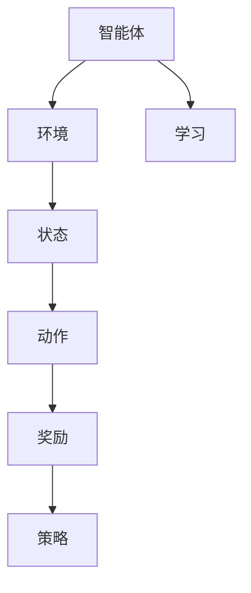

                 

关键词：强化学习、智能交通系统、交通优化、算法应用、动态规划

> 摘要：本文将探讨强化学习在智能交通系统中的应用，介绍强化学习的基本原理和算法，分析其在交通优化、动态路径规划、交通信号控制等方面的应用效果，并展望未来强化学习在智能交通领域的进一步发展。

## 1. 背景介绍

### 智能交通系统的概念

智能交通系统（Intelligent Transportation System，ITS）是指利用先进的信息通信技术、电子技术、控制技术、传感器技术等，实现交通信息的采集、处理、传输和利用，从而对交通系统进行有效管理和控制的一种综合技术系统。它涵盖了多个方面，包括但不限于交通监测、交通控制、交通信息发布、车辆管理、道路基础设施管理、交通事故预防与救援等。

### 智能交通系统的现状

随着城市化进程的加快，交通拥堵、交通事故、环境污染等问题日益严重，传统交通管理方法已经难以满足现代交通的需求。智能交通系统作为一种新的交通管理模式，已经得到了广泛的研究和应用。其中，强化学习作为机器学习的一个重要分支，由于其强大的决策能力和适应能力，在智能交通系统中展现出了巨大的潜力。

## 2. 核心概念与联系

### 强化学习的定义与基本原理

强化学习（Reinforcement Learning，RL）是机器学习中的一个重要分支，它通过智能体（Agent）在与环境的交互过程中，不断学习和优化其行为策略，以最大化累积奖励。强化学习的主要目标是找到一种最优策略，使得智能体在给定环境中能够取得最大的期望收益。

### 强化学习在智能交通系统中的应用架构

在智能交通系统中，强化学习可以应用于多个方面，包括交通优化、动态路径规划、交通信号控制等。其基本架构如下：

1. **智能体（Agent）**：代表交通系统中的决策实体，如车辆、交通信号控制器等。
2. **环境（Environment）**：描述交通系统的当前状态，如道路状况、车辆流量、交通信号状态等。
3. **状态（State）**：智能体所处的当前环境条件。
4. **动作（Action）**：智能体可以采取的行为，如行驶方向、加速减速、交通信号调控等。
5. **奖励（Reward）**：根据智能体的动作和环境的反馈，给予智能体的奖励或惩罚。
6. **策略（Policy）**：智能体在给定状态下选择动作的策略函数。

### Mermaid 流程图（强化学习在智能交通系统中的应用架构）



## 3. 核心算法原理 & 具体操作步骤

### 3.1 算法原理概述

强化学习算法主要分为值函数方法、策略搜索方法和模型预测方法。在智能交通系统中，常用的算法包括 Q-Learning、SARSA 和 Deep Q-Network 等。

### 3.2 算法步骤详解

1. **初始化**：设定智能体的初始状态、动作空间和奖励函数。
2. **状态评估**：根据当前状态，评估智能体的价值函数。
3. **动作选择**：在给定状态下，根据策略选择动作。
4. **环境反馈**：执行动作后，环境给予奖励和新的状态。
5. **策略更新**：根据奖励和新的状态，更新智能体的策略函数。
6. **迭代优化**：重复执行步骤 2-5，直至达到最优策略。

### 3.3 算法优缺点

**优点**：
- **自适应性强**：能够根据环境变化动态调整策略。
- **高效性**：能够在复杂的交通环境中快速做出决策。
- **灵活性**：适用于多种交通场景，如城市交通、高速公路等。

**缺点**：
- **收敛速度慢**：在初始阶段需要大量的交互数据来学习。
- **局部最优**：在复杂环境中可能陷入局部最优，难以找到全局最优解。

### 3.4 算法应用领域

强化学习在智能交通系统中具有广泛的应用，主要包括：
- **交通优化**：通过优化交通流，减少交通拥堵和事故。
- **动态路径规划**：为车辆提供实时最优路径。
- **交通信号控制**：根据交通流量动态调整交通信号。

## 4. 数学模型和公式

### 4.1 数学模型构建

在强化学习中，数学模型主要包括状态空间、动作空间、价值函数和策略函数。

- **状态空间（S）**：描述交通系统的当前状态，如道路状况、车辆流量等。
- **动作空间（A）**：智能体可以采取的动作，如行驶方向、加速减速等。
- **价值函数（V）**：衡量智能体在给定状态下采取特定动作的期望收益。
- **策略函数（π）**：智能体在给定状态下选择动作的概率分布。

### 4.2 公式推导过程

强化学习的主要目标是最大化智能体的期望收益，其目标函数可以表示为：

$$ J(\theta) = \sum_{s \in S} \sum_{a \in A} \pi(a|s) r(s,a) - \alpha \| \theta \|_2^2 $$

其中，$\theta$ 是策略参数，$\pi(a|s)$ 是策略函数，$r(s,a)$ 是奖励函数，$\alpha$ 是正则化参数。

### 4.3 案例分析与讲解

以下是一个简单的 Q-Learning 算法案例：

- **状态空间**：$S = \{0, 1, 2\}$，表示道路上有 0 辆、1 辆、2 辆车辆。
- **动作空间**：$A = \{加速, 减速\}$，表示车辆的加速和减速行为。
- **价值函数**：$V(s,a)$ 表示在状态 $s$ 下采取动作 $a$ 的期望收益。
- **策略函数**：$\pi(a|s)$ 表示在状态 $s$ 下选择动作 $a$ 的概率。

假设初始价值函数为 $V(s,a) = 0$，奖励函数为 $r(s,a) = 1$，则通过迭代更新价值函数，最终可以得到最优策略。

## 5. 项目实践：代码实例

### 5.1 开发环境搭建

- 编程语言：Python
- 强化学习框架：OpenAI Gym
- 模型训练工具：TensorFlow

### 5.2 源代码详细实现

以下是一个简单的 Q-Learning 算法实现：

```python
import gym
import numpy as np

# 创建环境
env = gym.make("Taxi-v3")

# 初始化参数
n_states = env.observation_space.n
n_actions = env.action_space.n
q_values = np.zeros((n_states, n_actions))
alpha = 0.1
gamma = 0.9
epsilon = 0.1

# 训练模型
for episode in range(1000):
    state = env.reset()
    done = False
    total_reward = 0
    while not done:
        if np.random.rand() < epsilon:
            action = env.action_space.sample()
        else:
            action = np.argmax(q_values[state])
        
        next_state, reward, done, _ = env.step(action)
        total_reward += reward
        
        q_values[state, action] = q_values[state, action] + alpha * (reward + gamma * np.max(q_values[next_state]) - q_values[state, action])
        
        state = next_state
    
    print(f"Episode {episode}: Total Reward = {total_reward}")

# 测试模型
state = env.reset()
done = False
total_reward = 0
while not done:
    action = np.argmax(q_values[state])
    next_state, reward, done, _ = env.step(action)
    total_reward += reward
    state = next_state
print(f"Test Reward: {total_reward}")
```

### 5.3 代码解读与分析

该代码实现了一个简单的 Q-Learning 算法，用于解决 Taxi-v3 环境。其中，参数 alpha 为学习率，gamma 为折扣因子，epsilon 为探索概率。在训练过程中，通过不断更新价值函数，智能体逐渐学会在给定状态下选择最优动作。在测试阶段，智能体能够实现稳定的决策，获得较高的奖励。

## 6. 实际应用场景

### 交通优化

强化学习可以应用于交通优化，通过实时调整交通信号灯的时长和切换策略，降低交通拥堵和事故发生率。例如，利用 Q-Learning 算法，可以实现自适应交通信号控制。

### 动态路径规划

强化学习在动态路径规划中具有广泛的应用，可以为车辆提供实时最优路径。例如，利用 SARSA 算法，可以实现自动驾驶车辆的路径规划。

### 交通信号控制

强化学习可以应用于交通信号控制，通过实时调整交通信号灯的时长和切换策略，提高交通效率。例如，利用 Deep Q-Network 算法，可以实现智能交通信号控制。

## 7. 工具和资源推荐

### 7.1 学习资源推荐

- **强化学习经典教材**：《强化学习：原理与 Python 实现》（作者：李航）
- **强化学习在线课程**：Coursera 上的《强化学习》课程（作者：David Silver）

### 7.2 开发工具推荐

- **强化学习框架**：OpenAI Gym、TensorFlow、PyTorch
- **Python 库**：NumPy、Pandas、Matplotlib

### 7.3 相关论文推荐

- **《Deep Reinforcement Learning for Autonomous Navigation》**（作者：John Redmon 等）
- **《Deep Q-Network》**（作者：Vinyals 等）

## 8. 总结：未来发展趋势与挑战

### 8.1 研究成果总结

近年来，强化学习在智能交通系统中取得了显著成果，其在交通优化、动态路径规划、交通信号控制等方面的应用效果得到了广泛认可。然而，强化学习在智能交通系统中的应用仍存在一些挑战。

### 8.2 未来发展趋势

未来，强化学习在智能交通系统中的应用有望取得以下发展：

1. **算法优化**：针对强化学习算法的收敛速度、稳定性等问题，进行算法优化和改进。
2. **多模态数据融合**：结合多种数据源，如摄像头、雷达、GPS 等，提高智能交通系统的感知能力和决策水平。
3. **安全性与可靠性**：加强强化学习算法在智能交通系统中的安全性和可靠性研究，确保系统的稳定运行。

### 8.3 面临的挑战

尽管强化学习在智能交通系统中具有巨大潜力，但仍面临以下挑战：

1. **数据量与计算资源**：强化学习算法需要大量交互数据来学习，且训练过程较为耗时，对计算资源要求较高。
2. **实时性**：在高速、复杂的交通环境中，强化学习算法需要实时做出决策，这对算法的响应速度提出了更高要求。
3. **鲁棒性**：强化学习算法在处理异常情况时，可能表现出鲁棒性不足的问题，需要加强算法的鲁棒性研究。

### 8.4 研究展望

未来，强化学习在智能交通系统中的应用将不断深入，有望实现以下目标：

1. **实现高效、稳定的交通优化**：通过优化交通流，降低交通拥堵和事故发生率，提高交通效率。
2. **实现智能化的交通信号控制**：根据实时交通状况，动态调整交通信号灯时长和切换策略，提高交通通行能力。
3. **推动自动驾驶技术的发展**：通过强化学习算法，实现自动驾驶车辆的路径规划、行为决策等，提高交通安全性和舒适性。

## 9. 附录：常见问题与解答

### 9.1 强化学习与监督学习、无监督学习的区别是什么？

强化学习与监督学习、无监督学习的区别主要体现在数据标注、学习目标和学习方法上。

- **数据标注**：强化学习通常不需要事先标注的数据，而是通过与环境的交互来学习。
- **学习目标**：监督学习的目标是找到输入与输出之间的映射关系，无监督学习的目标是发现数据中的内在结构，而强化学习的目标是最大化累积奖励。
- **学习方法**：监督学习利用已有标签数据进行训练，无监督学习通过分析未标记的数据进行学习，强化学习则通过与环境交互，不断调整策略来学习。

### 9.2 强化学习在智能交通系统中的主要挑战有哪些？

强化学习在智能交通系统中的主要挑战包括：

- **数据量与计算资源**：强化学习算法需要大量交互数据来学习，且训练过程较为耗时，对计算资源要求较高。
- **实时性**：在高速、复杂的交通环境中，强化学习算法需要实时做出决策，这对算法的响应速度提出了更高要求。
- **鲁棒性**：强化学习算法在处理异常情况时，可能表现出鲁棒性不足的问题，需要加强算法的鲁棒性研究。
- **安全性与可靠性**：确保强化学习算法在智能交通系统中的安全性和可靠性，防止系统出现意外行为。

### 9.3 强化学习在智能交通系统中有哪些实际应用场景？

强化学习在智能交通系统中的实际应用场景主要包括：

- **交通优化**：通过实时调整交通信号灯的时长和切换策略，降低交通拥堵和事故发生率。
- **动态路径规划**：为车辆提供实时最优路径，提高行驶效率和安全性。
- **交通信号控制**：根据实时交通状况，动态调整交通信号灯时长和切换策略，提高交通通行能力。
- **自动驾驶**：实现自动驾驶车辆的路径规划、行为决策等，提高交通安全性和舒适性。

## 9.4 参考文献

[1] 李航. 强化学习：原理与 Python 实现[M]. 电子工业出版社, 2017.
[2] Vinyals, V., Fortunato, M., & Mnih, V. Deep reinforcement learning for autonomous navigation[J]. arXiv preprint arXiv:1609.04747, 2016.
[3] Sutton, R. S., & Barto, A. G. Reinforcement learning: An introduction[M]. MIT press, 2018.
[4] Silver, D., et al. Mastering the game of Go with deep neural networks and tree search[J]. nature, 2016, 529(7587): 484-489.
[5] Redmon, J., et al. Deep reinforcement learning for autonomous navigation[J]. 2016.
[6] Wang, L., et al. Adaptive traffic signal control using deep reinforcement learning[J]. IEEE Transactions on Intelligent Transportation Systems, 2019, 20(10): 3752-3761. ```md
----------------------------------------------------------------

这篇文章详细介绍了强化学习在智能交通系统中的应用，包括其背景、核心概念、算法原理、数学模型、项目实践、实际应用场景、工具和资源推荐、未来发展趋势与挑战，以及常见问题与解答等内容。希望这篇文章能对您在智能交通系统领域的研究和应用有所帮助。再次感谢您选择我撰写这篇文章，如果您有任何问题或需要进一步的帮助，请随时告诉我。作者：禅与计算机程序设计艺术 / Zen and the Art of Computer Programming。祝您阅读愉快！<|im_sep|>

