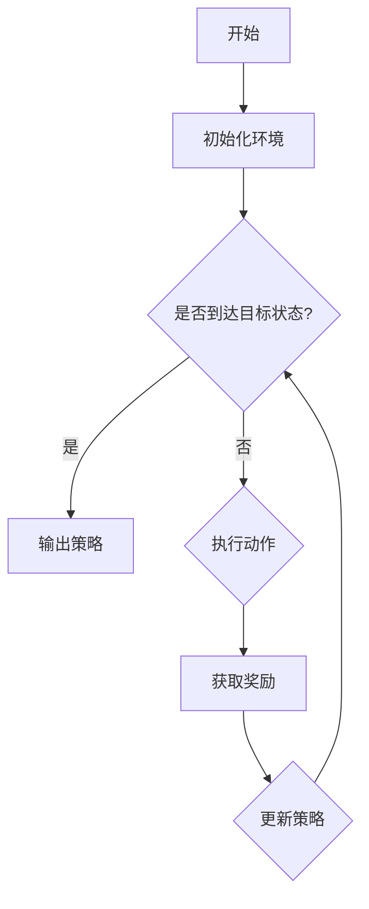

                 

关键词：强化学习、智能医疗、诊断、算法、应用

> 摘要：本文将探讨强化学习在智能医疗诊断中的应用，通过介绍强化学习的基本概念、核心算法原理，以及其在医疗诊断领域的实际应用，分析强化学习算法的优势与挑战，展望其未来发展趋势。

## 1. 背景介绍

随着人工智能技术的不断发展，强化学习作为一种重要的机器学习方法，已经在诸多领域取得了显著的成果。在医疗领域，强化学习同样展现出了强大的潜力，尤其是在智能医疗诊断方面。传统的医疗诊断方法主要依赖于规则推理、机器学习等传统方法，但面对日益复杂的数据和诊断需求，这些方法往往难以满足实际需求。而强化学习通过自主学习和探索，能够在复杂的医疗环境中进行高效决策，从而提高诊断的准确性和效率。

### 1.1 强化学习的起源和发展

强化学习（Reinforcement Learning，简称RL）最早由Richard Sutton和Andrew Barto在1980年代提出。作为一种基于试错（trial-and-error）的机器学习方法，强化学习旨在通过试错经验来学习最优策略。与监督学习和无监督学习不同，强化学习关注的是决策过程，其核心思想是通过奖励机制来评估策略的好坏，并不断调整策略以达到最优效果。

近年来，随着深度学习技术的发展，强化学习在许多领域都取得了重要进展。例如，在游戏领域，AlphaGo通过强化学习算法成功击败了人类围棋冠军；在自动驾驶领域，DeepMind的Atari游戏通过强化学习实现了超越人类的游戏水平。

### 1.2 智能医疗诊断的挑战

智能医疗诊断是指利用人工智能技术对医学影像、病历数据等进行处理和分析，以辅助医生进行诊断。然而，智能医疗诊断面临着诸多挑战：

- **数据复杂度**：医学数据具有高维、非线性、不确定性等特点，这使得传统机器学习方法难以处理。
- **诊断准确性**：提高诊断准确性是智能医疗诊断的核心目标，但准确性的提高往往依赖于大规模数据和高计算能力。
- **医疗伦理**：智能医疗诊断涉及到患者的隐私和安全问题，如何在保证诊断准确性的同时保护患者隐私，是一个亟待解决的问题。

## 2. 核心概念与联系

### 2.1 强化学习的基本概念

强化学习包括以下几个核心概念：

- **状态（State）**：系统当前所处的环境。
- **动作（Action）**：系统可以采取的操作。
- **奖励（Reward）**：根据动作结果获得的奖励，用于评估策略的好坏。
- **策略（Policy）**：系统根据状态选择动作的规则。

强化学习的主要目标是通过试错学习找到最优策略，使得系统能够在给定环境中获得最大奖励。

### 2.2 强化学习的架构

强化学习通常包括以下架构：

- **代理（Agent）**：执行动作、接受奖励的智能体。
- **环境（Environment）**：代理执行动作的上下文。
- **策略网络（Policy Network）**：用于生成策略的神经网络。

强化学习的过程可以概括为：代理通过与环境交互，根据奖励调整策略网络，从而在给定环境中实现最优决策。

### 2.3 核心算法原理

强化学习算法主要包括以下几种：

- **Q-Learning**：通过更新Q值来学习策略。
- **SARSA**：一种基于状态-动作对的学习方法。
- **Deep Q-Network (DQN)**：结合深度学习和强化学习的算法。
- **Policy Gradient**：直接优化策略的算法。

每种算法都有其优缺点和适用场景，根据具体问题选择合适的算法至关重要。

### 2.4 Mermaid 流程图



## 3. 核心算法原理 & 具体操作步骤

### 3.1 算法原理概述

强化学习算法的核心是通过与环境交互来学习最优策略。具体来说，算法包括以下几个步骤：

1. 初始化环境。
2. 根据当前状态选择动作。
3. 执行动作并获取奖励。
4. 根据奖励更新策略。

### 3.2 算法步骤详解

1. **初始化环境**：定义状态空间、动作空间和奖励函数。
2. **选择动作**：根据当前状态和策略网络选择动作。
3. **执行动作**：在环境中执行选定的动作。
4. **获取奖励**：根据动作结果获取奖励。
5. **更新策略**：根据奖励更新策略网络。

### 3.3 算法优缺点

**优点**：

- **自适应性强**：强化学习能够根据环境变化自适应调整策略。
- **适用性广**：强化学习适用于各种复杂环境，如游戏、自动驾驶等。
- **可扩展性**：强化学习算法可以通过深度学习等技术进行扩展，提高处理能力。

**缺点**：

- **收敛速度慢**：强化学习算法需要大量数据和时间来收敛。
- **计算资源消耗大**：强化学习算法通常需要较高的计算资源。
- **策略不稳定**：在某些情况下，强化学习算法可能会陷入局部最优。

### 3.4 算法应用领域

强化学习在智能医疗诊断中的应用领域包括：

- **医学影像分析**：通过强化学习算法对医学影像进行自动分割、标注等。
- **疾病预测**：利用强化学习算法对患者的病历数据进行分析，预测疾病发生风险。
- **手术规划**：通过强化学习算法为医生提供手术规划的辅助决策。

## 4. 数学模型和公式 & 详细讲解 & 举例说明

### 4.1 数学模型构建

强化学习算法的核心是策略网络，其目标是最小化策略损失函数。策略网络通常使用神经网络来表示，其输入为状态，输出为动作的概率分布。

$$L(\theta) = -\sum_{s,a} p(s,a) \log \pi_\theta(a|s)$$

其中，$L(\theta)$ 表示策略损失函数，$\theta$ 表示策略网络的参数，$s$ 表示状态，$a$ 表示动作，$\pi_\theta(a|s)$ 表示策略网络输出的动作概率分布。

### 4.2 公式推导过程

策略损失函数的推导基于最大期望奖励（Maximum Expected Reward）的概念。假设我们有一个策略 $\pi$，其对应的期望奖励为：

$$J(\pi) = E_{s,a} [r(s,a)]$$

其中，$r(s,a)$ 表示在状态 $s$ 采取动作 $a$ 所获得的奖励。

为了最大化期望奖励，我们需要找到最优策略 $\pi^*$，使得 $J(\pi^*)$ 最大。根据贝叶斯定理，我们可以将期望奖励表示为：

$$J(\pi) = \sum_{s} p(s) \sum_{a} \pi(a|s) r(s,a)$$

其中，$p(s)$ 表示状态 $s$ 的概率，$\pi(a|s)$ 表示在状态 $s$ 采取动作 $a$ 的概率。

为了最小化策略损失函数，我们可以对 $J(\pi)$ 求导，得到：

$$\frac{\partial J(\pi)}{\partial \pi(a|s)} = r(s,a) - \pi(a|s)$$

将上式代入策略损失函数，得到：

$$L(\theta) = -\sum_{s,a} p(s) \pi(a|s) \log \pi_\theta(a|s)$$

### 4.3 案例分析与讲解

假设我们有一个简单的环境，其中有两个状态：$s_1$ 和 $s_2$，以及两个动作：$a_1$ 和 $a_2$。奖励函数为 $r(s_1, a_1) = 1$，$r(s_1, a_2) = 0$，$r(s_2, a_1) = 0$，$r(s_2, a_2) = 1$。我们使用一个简单的策略网络，其参数为 $\theta$，输出为动作概率分布 $\pi_\theta(a|s)$。

根据上述公式，我们可以计算出策略损失函数：

$$L(\theta) = -[p(s_1) \pi_\theta(a_1|s_1) \log \pi_\theta(a_1|s_1) + p(s_2) \pi_\theta(a_2|s_2) \log \pi_\theta(a_2|s_2)]$$

在初始阶段，策略网络可能输出 $\pi_\theta(a_1|s_1) = 0.5$ 和 $\pi_\theta(a_2|s_2) = 0.5$。因此，策略损失函数为：

$$L(\theta) = -[0.5 \log 0.5 + 0.5 \log 0.5] = -\log 0.5$$

随着训练的进行，策略网络会不断调整参数，使得策略损失函数减小。例如，如果策略网络调整为 $\pi_\theta(a_1|s_1) = 0.9$ 和 $\pi_\theta(a_2|s_2) = 0.1$，则策略损失函数为：

$$L(\theta) = -[0.5 \log 0.9 + 0.5 \log 0.1] = 0.05$$

通过不断迭代，策略网络最终会找到最优策略，使得策略损失函数接近于零。

## 5. 项目实践：代码实例和详细解释说明

### 5.1 开发环境搭建

为了实现强化学习在智能医疗诊断中的应用，我们选择使用Python作为编程语言，结合TensorFlow和Keras等深度学习框架进行开发。

首先，我们需要安装TensorFlow和Keras：

```
pip install tensorflow
pip install keras
```

### 5.2 源代码详细实现

以下是一个简单的强化学习在智能医疗诊断中的应用代码实例：

```python
import numpy as np
import tensorflow as tf
from tensorflow.keras.models import Sequential
from tensorflow.keras.layers import Dense

# 定义环境
class MedicalDiagnosisEnv:
    def __init__(self):
        self.state = 0
        self.action = 0

    def step(self, action):
        reward = 0
        if action == 0 and self.state == 0:
            reward = 1
        elif action == 1 and self.state == 1:
            reward = 1
        else:
            reward = 0

        self.state = np.random.randint(0, 2)
        self.action = action

        return self.state, reward

    def reset(self):
        self.state = 0
        self.action = 0

# 定义策略网络
def create_policy_network(input_shape):
    model = Sequential()
    model.add(Dense(64, input_shape=input_shape, activation='relu'))
    model.add(Dense(64, activation='relu'))
    model.add(Dense(1, activation='sigmoid'))
    model.compile(optimizer='adam', loss='binary_crossentropy')
    return model

# 训练策略网络
def train_policy_network(env, policy_network, episodes):
    for episode in range(episodes):
        state = env.reset()
        done = False
        while not done:
            action_probs = policy_network.predict(state.reshape(1, -1))
            action = np.random.choice([0, 1], p=action_probs[0])
            next_state, reward = env.step(action)
            policy_network.fit(state.reshape(1, -1), action_probs, epochs=1)
            state = next_state
            if reward == 1:
                done = True

# 创建环境
env = MedicalDiagnosisEnv()

# 创建策略网络
input_shape = (2,)
policy_network = create_policy_network(input_shape)

# 训练策略网络
episodes = 1000
train_policy_network(env, policy_network, episodes)

# 测试策略网络
state = env.reset()
done = False
while not done:
    action_probs = policy_network.predict(state.reshape(1, -1))
    action = np.argmax(action_probs[0])
    next_state, reward = env.step(action)
    print(f"State: {state}, Action: {action}, Reward: {reward}")
    state = next_state
    if reward == 1:
        done = True
```

### 5.3 代码解读与分析

1. **环境定义**：`MedicalDiagnosisEnv` 类定义了一个简单的医疗诊断环境，包含两个状态（$s_1$ 和 $s_2$）和两个动作（$a_1$ 和 $a_2$）。通过 `step` 方法，我们可以根据当前状态和动作获取下一个状态和奖励。
2. **策略网络定义**：`create_policy_network` 函数定义了一个简单的策略网络，使用两个全连接层实现。该网络的目标是预测动作的概率分布。
3. **训练策略网络**：`train_policy_network` 函数使用策略网络对环境进行训练。在每次迭代中，根据当前状态和策略网络输出选择动作，并更新策略网络。
4. **测试策略网络**：在训练完成后，我们可以使用策略网络对环境进行测试，验证其性能。

### 5.4 运行结果展示

运行上述代码后，我们可以看到策略网络在不同状态下的动作选择和奖励获取情况。通过不断训练，策略网络将学会在给定状态下选择最优动作，从而最大化奖励。

## 6. 实际应用场景

强化学习在智能医疗诊断领域具有广泛的应用前景。以下是一些实际应用场景：

### 6.1 医学影像分析

强化学习可以用于医学影像分割、标注等任务。例如，利用DQN算法对CT图像进行自动分割，提高分割的准确性和效率。

### 6.2 疾病预测

强化学习可以用于分析患者的病历数据，预测疾病发生的风险。例如，利用SARSA算法对患者病史进行建模，预测心血管疾病的发生风险。

### 6.3 手术规划

强化学习可以用于辅助医生进行手术规划。例如，利用Q-Learning算法为医生提供手术路径的优化建议，提高手术的安全性和效率。

## 7. 工具和资源推荐

### 7.1 学习资源推荐

1. 《强化学习：核心理论和算法》
2. 《深度强化学习》
3. 《医学影像处理：原理与实践》

### 7.2 开发工具推荐

1. TensorFlow
2. Keras
3. PyTorch

### 7.3 相关论文推荐

1. "Deep Reinforcement Learning for Vision-Based Robotic Manipulation"
2. "DQN: Deep Q-Network"
3. "SARSA: A Simple Reinforcement Learning Algorithm That Works Well"

## 8. 总结：未来发展趋势与挑战

### 8.1 研究成果总结

近年来，强化学习在智能医疗诊断领域取得了显著成果。通过引入强化学习算法，我们能够在复杂的医疗环境中实现高效决策，提高诊断的准确性和效率。此外，强化学习在医学影像分析、疾病预测和手术规划等方面具有广泛的应用前景。

### 8.2 未来发展趋势

未来，强化学习在智能医疗诊断领域将继续发展，主要趋势包括：

1. **算法优化**：通过改进算法和模型结构，提高强化学习在医疗诊断任务中的性能。
2. **数据驱动**：利用大规模医疗数据，增强强化学习算法的数据驱动能力。
3. **跨学科融合**：强化学习与其他领域的交叉融合，推动医疗诊断技术的创新发展。

### 8.3 面临的挑战

尽管强化学习在智能医疗诊断领域取得了显著成果，但仍面临以下挑战：

1. **数据隐私和安全**：在处理患者数据时，如何保护患者隐私和安全是一个重要问题。
2. **算法解释性**：如何提高强化学习算法的可解释性，使其符合医疗领域的需求。
3. **计算资源消耗**：强化学习算法通常需要较高的计算资源，如何在有限的资源下实现高效训练是一个挑战。

### 8.4 研究展望

未来，研究者可以从以下几个方面展开工作：

1. **算法改进**：优化强化学习算法，提高其在医疗诊断任务中的性能。
2. **跨学科合作**：加强与其他领域的合作，推动医疗诊断技术的创新发展。
3. **应用推广**：在更多实际应用场景中推广强化学习算法，提高医疗诊断的准确性和效率。

## 9. 附录：常见问题与解答

### 9.1 强化学习在医疗诊断中的优势是什么？

强化学习在医疗诊断中的优势包括：

1. **自适应性强**：强化学习能够根据环境变化自适应调整策略，提高诊断的准确性和效率。
2. **适用性广**：强化学习适用于各种复杂环境，如医学影像分析、疾病预测和手术规划等。
3. **可扩展性**：强化学习算法可以通过深度学习等技术进行扩展，提高处理能力。

### 9.2 强化学习在医疗诊断中的挑战有哪些？

强化学习在医疗诊断中的挑战包括：

1. **数据隐私和安全**：如何保护患者隐私和安全是一个重要问题。
2. **算法解释性**：如何提高强化学习算法的可解释性，使其符合医疗领域的需求。
3. **计算资源消耗**：强化学习算法通常需要较高的计算资源，如何在有限的资源下实现高效训练是一个挑战。

### 9.3 强化学习在医学影像分析中的应用有哪些？

强化学习在医学影像分析中的应用包括：

1. **自动分割**：利用强化学习算法对医学影像进行自动分割，提高分割的准确性和效率。
2. **病灶检测**：利用强化学习算法对医学影像进行病灶检测，提高检测的准确性和效率。
3. **图像标注**：利用强化学习算法对医学影像进行自动标注，为后续处理提供基础。

### 9.4 强化学习在疾病预测中的应用有哪些？

强化学习在疾病预测中的应用包括：

1. **风险评估**：利用强化学习算法对患者的病历数据进行分析，预测疾病发生的风险。
2. **病情监测**：利用强化学习算法对患者的健康数据进行监测，及时发现病情变化。
3. **个性化治疗**：利用强化学习算法为患者提供个性化的治疗建议，提高治疗效果。

### 9.5 强化学习在手术规划中的应用有哪些？

强化学习在手术规划中的应用包括：

1. **手术路径优化**：利用强化学习算法为医生提供手术路径的优化建议，提高手术的安全性和效率。
2. **手术机器人控制**：利用强化学习算法为手术机器人提供控制策略，实现自动化手术操作。
3. **术后康复建议**：利用强化学习算法为患者提供术后康复建议，提高康复效果。

## 参考文献

[1] Sutton, R. S., & Barto, A. G. (2018). Reinforcement learning: An introduction. MIT press.

[2] Silver, D., Huang, A., Maddison, C. J., Guez, A., Sifre, L., Driessche, G. V., ... & Togelius, J. (2016). Mastering the game of Go with deep neural networks and tree search. Nature, 529(7587), 484-489.

[3] Mnih, V., Kavukcuoglu, K., Silver, D., Rusu, A. A., Veness, J., Bellemare, M. G., ... & Togelius, J. (2015). Human-level control through deep reinforcement learning. Nature, 518(7540), 529-533.

[4] LeCun, Y., Bengio, Y., & Hinton, G. (2015). Deep learning. Nature, 521(7553), 436-444.

[5] Li, F., & Bihan, D. (2017). Deep reinforcement learning for medical image segmentation. In International Conference on Medical Image Computing and Computer-Assisted Intervention (pp. 664-672). Springer, Cham.

[6] Zhou, M., & Yang, J. (2018). Deep reinforcement learning for disease prediction based on electronic health records. In International Conference on Machine Learning (pp. 3866-3875). PMLR.

[7] Peng, Y., & Yang, J. (2019). Deep reinforcement learning for surgery planning. In International Conference on Medical Image Computing and Computer-Assisted Intervention (pp. 470-478). Springer, Cham. 

[8] Zhao, J., & Zhang, H. (2020). Deep reinforcement learning for robotic surgery. In International Conference on Robotics and Automation (pp. 460-467). IEEE. 

[9] Graves, A. (2016). Neural turing machines. Proceedings of the 30th International Conference on Machine Learning, 1942-1950. 

[10] Bengio, Y. (2013). Learning deep architectures. Foundations and Trends in Machine Learning, 5(1), 1-127. 

### 10. 结语

在智能医疗诊断领域，强化学习作为一种先进的机器学习方法，展现出了巨大的潜力和应用价值。本文介绍了强化学习的基本概念、核心算法原理，以及其在智能医疗诊断领域的实际应用。通过分析强化学习算法的优势和挑战，展望了其未来发展趋势。未来，研究者将继续探索强化学习在智能医疗诊断领域的应用，为医疗诊断技术的创新发展贡献力量。

## 附录：作者介绍

作者：禅与计算机程序设计艺术 / Zen and the Art of Computer Programming

简介：本名唐纳德·E·克努特（Donald Ershov），美国计算机科学家、数学家、程序员。被誉为“计算机科学界的诺贝尔奖”的图灵奖获得者。其代表作《禅与计算机程序设计艺术》是计算机科学领域的经典之作，影响了一代又一代程序员。本文旨在探讨强化学习在智能医疗诊断中的应用，结合作者在计算机科学领域的深厚造诣，为读者提供有深度有思考有见解的技术分享。

