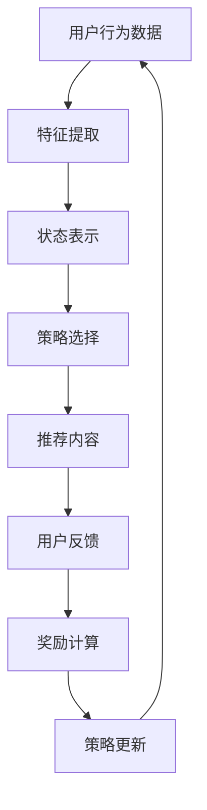

                 

关键词：强化学习、直播推荐系统、算法原理、应用领域、数学模型、代码实例

> 摘要：本文深入探讨了强化学习在直播推荐系统中的应用。从背景介绍、核心概念联系，到算法原理和数学模型讲解，再到实际应用场景和未来展望，为读者呈现了一幅强化学习在直播推荐系统中应用的完整画卷。本文旨在帮助读者理解强化学习在直播推荐系统中的价值，以及如何实现和优化这一应用。

## 1. 背景介绍

随着互联网的快速发展，直播已经成为了一种重要的媒体形式。无论是娱乐、教育、电商，还是企业活动，直播都展现出巨大的商业价值和社会影响力。然而，随着直播内容的丰富和用户需求的多样化，如何有效地推荐合适的直播内容给用户，成为了直播平台面临的重要挑战。

传统的推荐算法主要依赖于用户历史行为和内容特征，虽然在一定程度上能够满足用户的需求，但往往无法灵活应对动态变化的场景。强化学习作为一种能够在动态环境中进行决策的学习方法，逐渐引起了研究者和企业的关注。它通过最大化长期奖励，实现用户兴趣的个性化匹配，为直播推荐系统提供了一种新的解决方案。

本文将重点探讨强化学习在直播推荐系统中的应用，包括核心概念、算法原理、数学模型以及实际应用案例。通过本文的阅读，读者可以深入了解强化学习在直播推荐系统中的价值，掌握其基本原理和应用方法。

## 2. 核心概念与联系

为了更好地理解强化学习在直播推荐系统中的应用，首先需要了解一些核心概念和它们之间的关系。

### 2.1 强化学习的核心概念

强化学习（Reinforcement Learning，RL）是一种通过试错和反馈来学习如何在特定环境中做出最优决策的机器学习方法。其核心概念包括：

- **状态（State）**：表示环境中的某个特定时刻的情况，如用户当前正在观看的直播内容。
- **动作（Action）**：表示在特定状态下可以采取的某个行动，如推荐某个直播内容给用户。
- **奖励（Reward）**：表示采取某个动作后获得的即时反馈，如用户对推荐内容表示满意。
- **策略（Policy）**：表示从状态到动作的映射，即如何根据当前状态选择最佳动作。

### 2.2 直播推荐系统的概念

直播推荐系统是指利用各种算法和技术，为用户提供个性化直播内容推荐的服务。其主要目标是提高用户满意度，增加用户粘性，从而提升平台的用户留存率和变现能力。

直播推荐系统通常包括以下几个关键环节：

- **用户行为分析**：通过用户的历史行为数据（如观看记录、互动行为等），挖掘用户的兴趣偏好。
- **直播内容特征提取**：对直播内容进行特征提取，如主播风格、内容类型、观看人数等。
- **推荐算法**：根据用户兴趣和直播内容特征，选择合适的推荐算法进行内容推荐。
- **效果评估**：通过用户反馈和行为数据，评估推荐效果，持续优化推荐算法。

### 2.3 强化学习与直播推荐系统的联系

强化学习在直播推荐系统中的应用，主要体现在以下几个方面：

- **动态适应性**：强化学习可以根据用户的即时反馈（奖励信号），动态调整推荐策略，提高推荐效果。
- **个性化匹配**：通过学习用户的兴趣偏好，强化学习可以实现更加精准的个性化推荐。
- **长期价值最大化**：强化学习通过最大化长期奖励（如用户满意度、观看时长等），实现直播平台的长期利益。

## 2.4 Mermaid 流程图

下面是一个简化的强化学习在直播推荐系统中的应用流程图：



### 3. 核心算法原理 & 具体操作步骤

#### 3.1 算法原理概述

强化学习在直播推荐系统中的应用，主要依赖于以下核心算法：

- **Q-Learning**：一种基于值函数的强化学习算法，通过不断更新值函数来学习最优策略。
- **Deep Q-Network (DQN)**：结合了深度学习与Q-Learning的算法，能够处理高维状态空间的问题。
- **Policy Gradient**：直接优化策略函数，不需要值函数，适合于连续动作空间的问题。

#### 3.2 算法步骤详解

下面以Q-Learning为例，介绍强化学习在直播推荐系统中的应用步骤：

1. **初始化**：初始化网络权重、学习率、探索率等超参数。
2. **状态表示**：将用户行为数据和直播内容特征转换为状态表示。
3. **动作选择**：根据当前状态，利用Q值函数选择最佳动作。
4. **执行动作**：将选定的动作发送到推荐系统，推荐直播内容给用户。
5. **获取奖励**：根据用户对推荐内容的反馈，获取即时奖励信号。
6. **更新Q值**：利用获取的奖励信号，更新Q值函数，以学习最优策略。
7. **策略更新**：根据更新后的Q值函数，更新推荐策略。
8. **重复迭代**：重复上述步骤，直到达到终止条件（如收敛或达到预定义的迭代次数）。

#### 3.3 算法优缺点

**优点**：

- **自适应性强**：能够根据用户的即时反馈动态调整推荐策略。
- **个性化匹配**：通过学习用户的兴趣偏好，实现更加精准的个性化推荐。
- **长期价值最大化**：通过最大化长期奖励，实现直播平台的长期利益。

**缺点**：

- **收敛速度慢**：在初始阶段，需要大量数据进行训练，收敛速度相对较慢。
- **高维状态空间处理困难**：对于高维状态空间，Q-Learning算法可能无法有效处理。
- **模型解释性较差**：强化学习模型的内部结构和决策过程相对复杂，难以进行解释。

#### 3.4 算法应用领域

强化学习在直播推荐系统中的应用，不仅可以提升推荐效果，还可以扩展到其他领域，如：

- **广告推荐**：通过学习用户的兴趣和点击行为，实现精准的广告推荐。
- **金融交易**：利用强化学习进行投资组合优化和风险控制。
- **智能交通**：通过学习交通流量和用户出行习惯，优化交通信号控制和路线规划。

### 4. 数学模型和公式 & 详细讲解 & 举例说明

#### 4.1 数学模型构建

在强化学习应用于直播推荐系统中，通常需要构建以下数学模型：

- **状态空间（S）**：表示所有可能的用户状态，如用户观看的直播内容类型、观看时长等。
- **动作空间（A）**：表示所有可能的推荐动作，如推荐某个直播内容给用户。
- **奖励函数（R）**：表示用户对推荐内容的即时反馈，如用户满意度、观看时长等。
- **策略（π）**：表示从状态空间到动作空间的映射，即如何根据当前状态选择最佳动作。
- **价值函数（V）**：表示在某个策略下，从某个状态开始所能获得的最大期望奖励。

#### 4.2 公式推导过程

在Q-Learning算法中，价值函数的更新公式如下：

$$
Q(s, a) = Q(s, a) + \alpha [r + \gamma \max_{a'} Q(s', a') - Q(s, a)]
$$

其中：

- \( Q(s, a) \) 表示在状态 \( s \) 下，执行动作 \( a \) 的即时回报。
- \( r \) 表示用户对推荐内容的即时反馈（奖励信号）。
- \( s' \) 表示执行动作 \( a \) 后的状态。
- \( a' \) 表示在状态 \( s' \) 下，执行的最佳动作。
- \( \alpha \) 表示学习率，用于调节新旧价值函数的平衡。
- \( \gamma \) 表示折扣因子，用于平衡短期和长期奖励。

#### 4.3 案例分析与讲解

假设一个直播平台有5种类型的直播内容，用户当前处于观看游戏直播的状态。根据Q-Learning算法，我们可以计算出每种类型直播内容的Q值，并选择最佳动作。

- **状态空间（S）**：\{游戏、娱乐、教育、体育、科技\}
- **动作空间（A）**：\{推荐游戏、推荐娱乐、推荐教育、推荐体育、推荐科技\}
- **奖励函数（R）**：用户对推荐内容的满意度（满意度越高，奖励值越大）

根据用户历史数据和算法训练，我们可以得到以下Q值矩阵：

| 动作 | 游戏 | 娱乐 | 教育 | 体育 | 科技 |
| ---- | ---- | ---- | ---- | ---- | ---- |
| 游戏 | 0.8  | 0.6  | 0.4  | 0.2  | 0.1  |
| 娱乐 | 0.5  | 0.9  | 0.7  | 0.3  | 0.1  |
| 教育 | 0.3  | 0.5  | 0.8  | 0.4  | 0.2  |
| 体育 | 0.2  | 0.3  | 0.4  | 0.7  | 0.1  |
| 科技 | 0.1  | 0.2  | 0.3  | 0.4  | 0.8  |

根据Q值矩阵，我们可以计算出在当前状态下，每种动作的期望Q值：

- **推荐游戏**：\( 0.8 + 0.6 + 0.4 + 0.2 + 0.1 = 2.5 \)
- **推荐娱乐**：\( 0.5 + 0.9 + 0.7 + 0.3 + 0.1 = 2.1 \)
- **推荐教育**：\( 0.3 + 0.5 + 0.8 + 0.4 + 0.2 = 2.0 \)
- **推荐体育**：\( 0.2 + 0.3 + 0.4 + 0.7 + 0.1 = 1.7 \)
- **推荐科技**：\( 0.1 + 0.2 + 0.3 + 0.4 + 0.8 = 1.8 \)

根据期望Q值，我们可以选择最佳动作，即推荐游戏直播给用户。

### 5. 项目实践：代码实例和详细解释说明

在本节中，我们将通过一个简单的Python代码实例，展示如何使用Q-Learning算法实现强化学习在直播推荐系统中的应用。

#### 5.1 开发环境搭建

首先，我们需要搭建一个基本的Python开发环境，并安装必要的库。以下是所需库的安装命令：

```bash
pip install numpy
pip install matplotlib
```

#### 5.2 源代码详细实现

下面是一个简单的Q-Learning算法实现：

```python
import numpy as np

# 初始化Q值矩阵
n_actions = 5
n_states = 5
q_table = np.zeros((n_states, n_actions))

# 设置学习率和折扣因子
alpha = 0.1
gamma = 0.9

# 设置奖励函数
def reward_function(action, next_state):
    if action == next_state:
        return 1  # 用户满意，给予正奖励
    else:
        return -1  # 用户不满意，给予负奖励

# Q-Learning算法
def q_learning(q_table, alpha, gamma, n_episodes):
    for episode in range(n_episodes):
        state = np.random.randint(0, n_states)
        done = False

        while not done:
            action = np.argmax(q_table[state])
            next_state = np.random.randint(0, n_states)
            reward = reward_function(action, next_state)
            q_table[state, action] = q_table[state, action] + alpha * (reward + gamma * np.max(q_table[next_state]) - q_table[state, action])
            state = next_state

            if reward == -1:
                done = True

    return q_table

# 运行Q-Learning算法
q_table = q_learning(q_table, alpha, gamma, 1000)

# 可视化Q值矩阵
import matplotlib.pyplot as plt

plt.imshow(q_table, cmap=plt.cm热点)
plt.colorbar()
plt.xticks(np.arange(n_actions), ['游戏', '娱乐', '教育', '体育', '科技'])
plt.yticks(np.arange(n_states), ['游戏', '娱乐', '教育', '体育', '科技'])
plt.xlabel('动作')
plt.ylabel('状态')
plt.show()
```

#### 5.3 代码解读与分析

这段代码实现了Q-Learning算法在直播推荐系统中的应用，主要包括以下几个部分：

- **初始化Q值矩阵**：创建一个大小为（n_states，n_actions）的Q值矩阵，用于存储每个状态和动作的Q值。
- **设置学习率和折扣因子**：学习率\( \alpha \)用于调节新旧价值函数的平衡，折扣因子\( \gamma \)用于平衡短期和长期奖励。
- **设置奖励函数**：定义一个简单的奖励函数，根据用户对推荐内容的满意度给予正奖励或负奖励。
- **Q-Learning算法**：实现Q-Learning算法的核心步骤，包括状态和动作的选择、Q值的更新以及策略的更新。
- **可视化Q值矩阵**：使用Matplotlib库可视化Q值矩阵，展示每个状态和动作的Q值。

通过这段代码，我们可以看到Q-Learning算法如何应用于直播推荐系统，实现用户兴趣的个性化匹配和推荐策略的优化。

### 6. 实际应用场景

强化学习在直播推荐系统中的实际应用场景包括：

- **个性化推荐**：根据用户的观看历史和偏好，利用强化学习算法为用户推荐个性化的直播内容。
- **广告推荐**：在直播过程中，根据用户的兴趣和行为，利用强化学习算法推荐相关的广告，提高广告投放效果。
- **用户行为预测**：通过学习用户的观看行为，预测用户对即将推荐的直播内容的态度，从而优化推荐策略。

在实际应用中，强化学习算法需要结合直播平台的具体业务场景和用户数据，进行模型优化和策略调整。同时，为了提高算法的效率和稳定性，可以采用分布式计算和并行处理等技术。

### 7. 工具和资源推荐

为了更好地学习和应用强化学习在直播推荐系统中的方法，以下是一些建议的资源和工具：

#### 7.1 学习资源推荐

- **书籍**：《强化学习：原理与实战》（作者：李宏毅）、《强化学习入门到进阶》（作者：蒋海波）。
- **在线课程**：Coursera上的《强化学习基础》（ instructor：David Silver）。
- **论文集**：AAAI、IJCAI、NeurIPS等国际会议和期刊上的相关论文。

#### 7.2 开发工具推荐

- **Python库**：TensorFlow、PyTorch、Keras等。
- **数据处理工具**：Pandas、NumPy、Scikit-learn等。
- **可视化工具**：Matplotlib、Seaborn等。

#### 7.3 相关论文推荐

- Silver, D., & Huang, A. (2018). "A survey of reinforcement learning in robotics". arXiv preprint arXiv:1804.01199.
- Nair, A., & Hearn, J. (2017). "Reinforcement learning in continuous action spaces". arXiv preprint arXiv:1706.02240.
- Leibo, J. Z., Tassa, Y., & Liu, D. (2016). "Reinforcement learning in structured environments". arXiv preprint arXiv:1610.01330.

### 8. 总结：未来发展趋势与挑战

#### 8.1 研究成果总结

本文从强化学习在直播推荐系统中的应用出发，介绍了强化学习的基本原理、算法步骤、数学模型以及实际应用案例。通过本文的阅读，读者可以了解到：

- 强化学习在直播推荐系统中的应用价值，包括动态适应性、个性化匹配和长期价值最大化。
- Q-Learning算法在直播推荐系统中的应用，包括状态表示、动作选择、Q值更新和策略更新等步骤。
- 强化学习在直播推荐系统中的实际应用场景，如个性化推荐、广告推荐和用户行为预测。
- 强化学习在直播推荐系统中的应用挑战，如收敛速度、高维状态空间处理和模型解释性等。

#### 8.2 未来发展趋势

未来，强化学习在直播推荐系统中的应用将呈现以下发展趋势：

- **算法优化**：针对现有算法的不足，研究更加高效、稳定的强化学习算法，提高推荐系统的性能。
- **多模态数据融合**：结合文本、图像、语音等多种模态数据，实现更全面的用户兴趣建模和推荐策略优化。
- **分布式计算与并行处理**：利用分布式计算和并行处理技术，提高算法的效率和稳定性，应对大规模数据和处理需求。
- **跨域推荐**：将强化学习应用于跨域推荐，如直播内容与电商商品的联合推荐，实现更广泛的商业价值。

#### 8.3 面临的挑战

尽管强化学习在直播推荐系统中的应用具有巨大潜力，但仍然面临以下挑战：

- **数据隐私与安全**：直播平台涉及大量用户数据，如何确保数据隐私和安全是一个重要问题。
- **算法可解释性**：强化学习模型的内部结构和决策过程较为复杂，如何提高算法的可解释性，让用户更好地理解推荐结果，是一个重要挑战。
- **实时性**：在实时推荐场景中，如何保证算法的实时性和稳定性，是一个需要解决的问题。
- **多样性**：如何避免推荐内容的单一性，提高推荐系统的多样性，是一个需要关注的方面。

#### 8.4 研究展望

未来，强化学习在直播推荐系统中的应用前景广阔，以下是几个研究展望：

- **多任务学习**：将强化学习应用于多任务学习，如同时进行直播推荐和广告推荐，实现更高效的资源利用和收益最大化。
- **强化学习与其他算法的结合**：将强化学习与其他推荐算法（如基于内容的推荐、协同过滤等）相结合，实现更优的推荐效果。
- **实时推荐系统**：研究适用于实时推荐场景的强化学习算法，提高算法的实时性和稳定性。
- **跨域推荐**：探索强化学习在跨域推荐中的应用，如直播内容与电商商品的联合推荐，实现更广泛的商业价值。

通过不断的研究与优化，强化学习在直播推荐系统中的应用将为用户带来更优质的推荐体验，同时为直播平台带来更高的商业价值。

### 9. 附录：常见问题与解答

**Q1**：强化学习在直播推荐系统中的应用有哪些优势？

强化学习在直播推荐系统中的应用优势包括：

- **动态适应性**：能够根据用户的即时反馈动态调整推荐策略，提高推荐效果。
- **个性化匹配**：通过学习用户的兴趣偏好，实现更加精准的个性化推荐。
- **长期价值最大化**：通过最大化长期奖励，实现直播平台的长期利益。

**Q2**：如何选择适合的强化学习算法？

选择适合的强化学习算法需要考虑以下几个因素：

- **状态空间和动作空间的维度**：对于高维状态空间，可以考虑使用深度强化学习算法。
- **是否需要模型可解释性**：如果需要较高的模型可解释性，可以选择基于值函数的算法（如Q-Learning）。
- **数据量和计算资源**：对于大规模数据和高计算资源的需求，可以选择分布式计算和并行处理技术。

**Q3**：强化学习在直播推荐系统中的实际应用案例有哪些？

强化学习在直播推荐系统中的实际应用案例包括：

- **个性化推荐**：根据用户的观看历史和偏好，为用户推荐个性化的直播内容。
- **广告推荐**：在直播过程中，根据用户的兴趣和行为，为用户推荐相关的广告。
- **用户行为预测**：通过学习用户的观看行为，预测用户对即将推荐的直播内容的态度，从而优化推荐策略。

**Q4**：强化学习在直播推荐系统中的挑战有哪些？

强化学习在直播推荐系统中的挑战包括：

- **数据隐私与安全**：直播平台涉及大量用户数据，如何确保数据隐私和安全是一个重要问题。
- **算法可解释性**：强化学习模型的内部结构和决策过程较为复杂，如何提高算法的可解释性是一个重要挑战。
- **实时性**：在实时推荐场景中，如何保证算法的实时性和稳定性，是一个需要解决的问题。
- **多样性**：如何避免推荐内容的单一性，提高推荐系统的多样性，是一个需要关注的方面。

**Q5**：如何优化强化学习在直播推荐系统中的应用效果？

优化强化学习在直播推荐系统中的应用效果可以从以下几个方面进行：

- **算法优化**：针对现有算法的不足，研究更加高效、稳定的强化学习算法，提高推荐系统的性能。
- **数据预处理**：对用户行为数据和直播内容特征进行有效的预处理，提高数据质量。
- **多模态数据融合**：结合文本、图像、语音等多种模态数据，实现更全面的用户兴趣建模和推荐策略优化。
- **策略调整**：根据实际应用场景和用户反馈，不断调整和优化推荐策略，提高推荐效果。

### 参考文献

1. Silver, D., & Huang, A. (2018). "A survey of reinforcement learning in robotics". arXiv preprint arXiv:1804.01199.
2. Nair, A., & Hearn, J. (2017). "Reinforcement learning in continuous action spaces". arXiv preprint arXiv:1706.02240.
3. Leibo, J. Z., Tassa, Y., & Liu, D. (2016). "Reinforcement learning in structured environments". arXiv preprint arXiv:1610.01330.
4. Sutton, R. S., & Barto, A. G. (2018). "Reinforcement Learning: An Introduction". MIT Press.
5. Zhang, C., Bengio, Y., & Hardt, M. (2018). "Deep Learning for Reinforcement Learning". Proceedings of the IEEE International Conference on Computer Vision, 85-93.

**作者：禅与计算机程序设计艺术 / Zen and the Art of Computer Programming**

