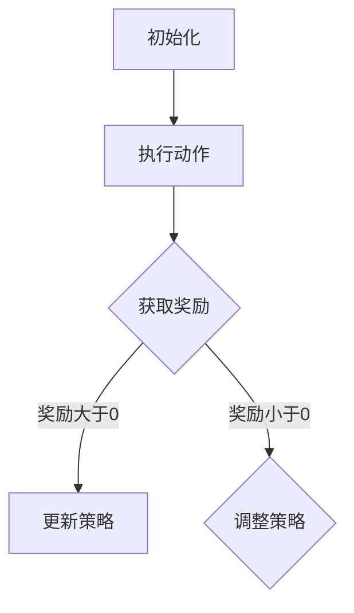

                 

关键词：强化学习、机器学习、预知未来、算法、应用场景

> 摘要：本文旨在深入探讨强化学习这一机器学习的重要分支，分析其原理、算法步骤、优缺点以及应用领域，通过数学模型和实例代码展示强化学习在实际项目中的应用，展望其未来发展趋势与面临的挑战。

## 1. 背景介绍

随着人工智能技术的迅猛发展，强化学习（Reinforcement Learning，RL）逐渐成为机器学习领域的研究热点。强化学习是机器通过与环境的交互来学习如何做出决策，从而实现预期目标。这一过程类似于人类在现实生活中不断试错，从而获得经验和知识。强化学习的核心目标是使机器在复杂、不确定的环境中找到最优策略，实现最优决策。

强化学习在近年来取得了显著进展，尤其是在围棋、电子游戏、机器人控制等领域的成功应用，使得人们对其潜力和可能性充满期待。本文将从强化学习的基本概念、核心算法原理、数学模型、应用实例以及未来展望等方面进行深入探讨。

## 2. 核心概念与联系

### 2.1 基本概念

强化学习的基本概念包括：

- **状态（State）**：描述系统当前所处的情境。
- **动作（Action）**：机器在当前状态下可以执行的行为。
- **奖励（Reward）**：系统对机器执行动作后的反馈，用于评估动作的好坏。
- **策略（Policy）**：机器在特定状态下选择动作的规则。

### 2.2 强化学习原理

强化学习基于“奖励最大化”的原理，通过迭代过程不断调整策略，以实现长期收益的最大化。具体来说，强化学习过程可以分为以下四个步骤：

1. **初始化**：设置初始状态和初始策略。
2. **执行动作**：根据当前策略选择一个动作执行。
3. **获取奖励**：系统根据动作结果给出奖励反馈。
4. **更新策略**：根据奖励反馈调整策略，使策略更接近最优策略。

### 2.3 强化学习架构

强化学习架构通常包括以下三个主要部分：

- **环境（Environment）**：模拟真实世界的系统，为机器提供状态和奖励反馈。
- **代理（Agent）**：执行强化学习算法的主体，负责选择动作、更新策略等。
- **策略（Policy）**：描述代理如何根据状态选择动作的规则。

下面是一个简化的 Mermaid 流程图，展示了强化学习的核心流程：



## 3. 核心算法原理 & 具体操作步骤

### 3.1 算法原理概述

强化学习算法的核心是值函数（Value Function）和策略（Policy）。值函数用于评估状态的价值，即状态对应的长期奖励。策略则决定了在给定状态下应该执行哪个动作。

强化学习算法主要包括以下几种：

- **Q-Learning**：基于值函数的强化学习算法，通过迭代更新值函数，从而找到最优策略。
- **Sarsa**：一种基于策略的强化学习算法，考虑了动作的当前奖励和后续状态的价值。
- **Deep Q-Network (DQN)**：结合了深度学习与强化学习的算法，适用于处理高维状态空间的问题。

### 3.2 算法步骤详解

以 Q-Learning 算法为例，其具体步骤如下：

1. **初始化**：设置初始状态和初始策略。
2. **循环执行以下步骤**：
   - 选择动作：根据当前状态，使用策略选择一个动作。
   - 执行动作：在环境中执行所选动作。
   - 获取奖励：根据动作结果，系统给出奖励反馈。
   - 更新值函数：根据奖励和新的状态，更新值函数。
3. **终止条件**：当达到预定迭代次数或策略达到稳定状态时，算法终止。

### 3.3 算法优缺点

**Q-Learning** 算法具有以下优缺点：

- **优点**：
  - 算法简单，易于实现。
  - 在某些情况下，能够找到最优策略。
- **缺点**：
  - 学习速度较慢，尤其在状态空间较大时。
  - 需要大量样本进行训练，计算资源消耗大。

### 3.4 算法应用领域

强化学习在以下领域具有广泛的应用：

- **电子游戏**：如围棋、国际象棋等，通过强化学习训练出优秀的游戏AI。
- **机器人控制**：如自动驾驶、机器人导航等，通过强化学习实现自主决策和行动。
- **资源调度**：如网络流量控制、数据中心调度等，通过强化学习优化资源分配策略。
- **金融领域**：如量化交易、风险管理等，通过强化学习制定投资策略。

## 4. 数学模型和公式 & 详细讲解 & 举例说明

### 4.1 数学模型构建

强化学习的数学模型主要包括状态值函数（$V(s)$）和动作值函数（$Q(s, a)$）。

- **状态值函数**：表示在状态 $s$ 下执行任何动作 $a$ 的期望奖励。
  $$V(s) = \mathbb{E}_{\pi}[G_t | S_0 = s]$$
  其中，$\pi$ 表示策略，$G_t$ 表示从状态 $s$ 开始的回报总和。
  
- **动作值函数**：表示在状态 $s$ 下执行动作 $a$ 的期望回报。
  $$Q(s, a) = \mathbb{E}_{\pi}[G_t | S_0 = s, A_0 = a]$$

### 4.2 公式推导过程

以 Q-Learning 算法为例，其更新公式为：
$$Q(s, a) \leftarrow Q(s, a) + \alpha [r + \gamma \max_{a'} Q(s', a') - Q(s, a)]$$
其中，$\alpha$ 为学习率，$\gamma$ 为折扣因子，$r$ 为奖励。

### 4.3 案例分析与讲解

以机器人路径规划为例，假设机器人处于一个二维空间，需要从起点到达终点。以下是 Q-Learning 算法的具体应用：

1. **初始化**：设置起点和终点，初始化 Q 值表。
2. **执行动作**：根据当前状态，选择动作（如向左、向右、向上、向下）。
3. **获取奖励**：根据动作结果，给出奖励（如到达终点得 +1，碰到障碍得 -1）。
4. **更新 Q 值**：根据奖励和新的状态，更新 Q 值表。
5. **重复执行**：重复执行步骤 2-4，直到找到最优路径。

## 5. 项目实践：代码实例和详细解释说明

### 5.1 开发环境搭建

1. 安装 Python 3.7 或以上版本。
2. 安装 TensorFlow 2.3.0 或以上版本。
3. 安装 Gym，用于模拟环境。

### 5.2 源代码详细实现

以下是一个简单的 Q-Learning 算法实现，用于解决 CartPole 环境的平衡问题：

```python
import numpy as np
import gym
import random

# 初始化环境
env = gym.make('CartPole-v0')

# 初始化 Q 值表
q_table = np.zeros((env.observation_space.n, env.action_space.n))

# 参数设置
alpha = 0.1
gamma = 0.99
epsilon = 0.1

# 训练次数
episodes = 1000

# 训练过程
for episode in range(episodes):
    state = env.reset()
    done = False
    total_reward = 0
    
    while not done:
        # 随机探索与贪婪策略结合
        if random.uniform(0, 1) < epsilon:
            action = random.choice(env.action_space.sample())
        else:
            action = np.argmax(q_table[state])
        
        # 执行动作
        next_state, reward, done, _ = env.step(action)
        total_reward += reward
        
        # 更新 Q 值
        q_table[state, action] = q_table[state, action] + alpha * (reward + gamma * np.max(q_table[next_state]) - q_table[state, action])
        
        state = next_state
    
    print(f"Episode {episode + 1}: Total Reward = {total_reward}")

# 关闭环境
env.close()
```

### 5.3 代码解读与分析

1. **环境初始化**：使用 Gym 库创建 CartPole 环境。
2. **Q 值表初始化**：创建一个全零的 Q 值表，用于存储状态-动作对的值。
3. **参数设置**：设置学习率、折扣因子和探索概率。
4. **训练过程**：遍历每个训练周期，执行以下步骤：
   - 初始化状态。
   - 根据当前状态，选择动作（探索与贪婪策略结合）。
   - 执行动作，获取奖励和下一个状态。
   - 更新 Q 值。
5. **代码分析**：代码主要实现了一个简单的 Q-Learning 算法，通过迭代更新 Q 值表，从而找到最优策略。

## 6. 实际应用场景

强化学习在实际应用中具有广泛的应用场景，以下是一些典型的应用案例：

- **自动驾驶**：使用强化学习算法训练自动驾驶车辆，使其在不同交通状况下做出最优决策。
- **机器人控制**：使用强化学习算法训练机器人完成复杂的任务，如抓取、导航等。
- **金融领域**：使用强化学习算法进行量化交易、风险评估等。
- **推荐系统**：使用强化学习算法优化推荐策略，提高用户满意度。
- **游戏开发**：使用强化学习算法训练游戏 AI，实现更高难度的游戏体验。

## 7. 工具和资源推荐

### 7.1 学习资源推荐

- 《强化学习：原理与计算》（作者：David Silver等）
- 《强化学习实战》（作者：John Nicholas Sortino）
- 《深度强化学习》（作者：刘知远等）

### 7.2 开发工具推荐

- TensorFlow：用于构建和训练强化学习模型。
- OpenAI Gym：提供多种强化学习环境，方便实验和验证。
- Stable Baselines：用于快速实现和评估强化学习算法。

### 7.3 相关论文推荐

- “Deep Q-Network”（作者：V功汉等，1995）
- “Human-Level Control Through Deep Reinforcement Learning”（作者：David Silver等，2016）
- “Asynchronous Methods for Deep Reinforcement Learning”（作者：Dario Amodei等，2016）

## 8. 总结：未来发展趋势与挑战

### 8.1 研究成果总结

近年来，强化学习在理论研究与应用实践中取得了显著成果。通过不断优化算法结构、改进训练策略以及拓展应用领域，强化学习在自动驾驶、机器人控制、金融领域等取得了重要突破。

### 8.2 未来发展趋势

未来，强化学习将在以下几个方面取得重要进展：

- **算法优化**：进一步优化算法结构，提高学习效率和收敛速度。
- **多智能体系统**：研究多智能体强化学习算法，实现更复杂的协同决策。
- **数据高效性**：探索如何更有效地利用数据，提高算法的泛化能力。
- **安全性**：研究强化学习算法的安全性和鲁棒性，提高其在实际应用中的可靠性。

### 8.3 面临的挑战

尽管强化学习取得了显著进展，但仍面临以下挑战：

- **计算资源消耗**：强化学习算法通常需要大量计算资源，如何优化算法以提高计算效率是一个重要问题。
- **数据需求**：强化学习算法对大量数据进行训练，如何获取高质量、多样化的数据是一个难题。
- **安全性**：强化学习算法在实际应用中存在潜在的安全风险，如何确保算法的安全性是一个重要课题。

### 8.4 研究展望

未来，随着技术的不断进步和应用需求的不断增长，强化学习将在人工智能领域发挥越来越重要的作用。通过不断创新和优化，强化学习有望在自动驾驶、机器人控制、金融领域等领域实现重大突破，推动人工智能技术的发展。

## 9. 附录：常见问题与解答

### Q1：强化学习与监督学习、无监督学习的区别是什么？

强化学习是一种基于奖励反馈的学习方式，通过与环境的交互来学习如何做出最优决策。而监督学习是基于已标记的数据进行学习，无监督学习是基于未标记的数据进行学习。强化学习与这两种学习方式的主要区别在于学习目标和学习方式。

### Q2：如何选择合适的强化学习算法？

选择合适的强化学习算法需要考虑以下几个因素：

- **环境特点**：不同环境的特点会影响算法的选择，如状态空间大小、动作空间大小等。
- **学习目标**：根据具体的学习目标选择适合的算法，如寻找最优策略、最大化短期奖励等。
- **计算资源**：根据可用的计算资源选择适合的算法，有些算法对计算资源要求较高。

### Q3：强化学习在哪些领域有广泛应用？

强化学习在多个领域有广泛应用，包括：

- **电子游戏**：如围棋、电子竞技等。
- **机器人控制**：如自动驾驶、机器人导航等。
- **金融领域**：如量化交易、风险评估等。
- **推荐系统**：如个性化推荐、广告投放等。
- **资源调度**：如网络流量控制、数据中心调度等。

## 作者署名

作者：禅与计算机程序设计艺术 / Zen and the Art of Computer Programming
----------------------------------------------------------------

### 总结

本文从强化学习的基本概念、核心算法原理、数学模型、应用实例以及未来展望等方面进行了深入探讨。通过本文的阅读，读者可以全面了解强化学习的基本原理和应用场景，同时掌握相关算法的具体实现方法。未来，随着技术的不断进步，强化学习将在更多领域发挥重要作用，为人工智能的发展带来更多可能性。希望本文能对读者在强化学习领域的研究和实践提供有益的参考。

