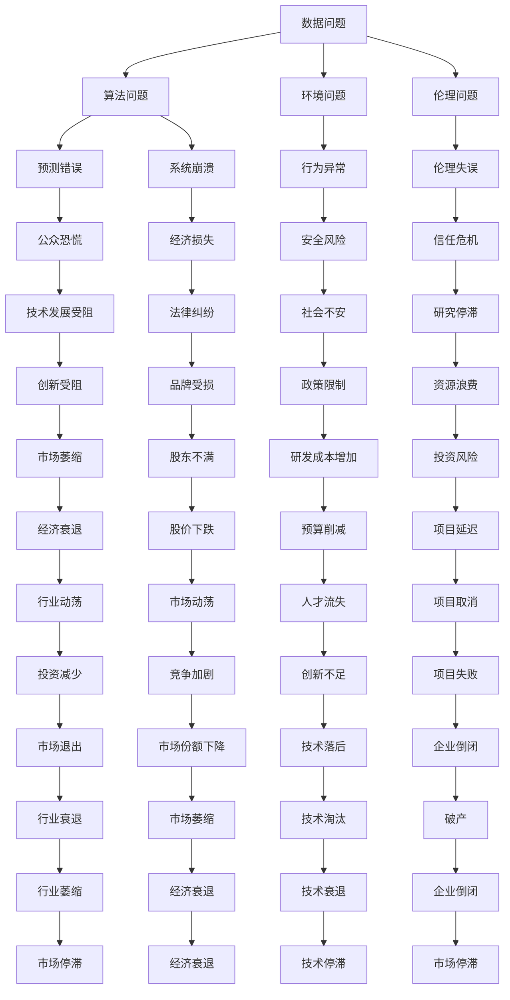

                 

关键词：人工智能、失败、挑战、学习、改进

> 摘要：随着人工智能技术的快速发展，其在各个领域的应用越来越广泛。然而，AI系统并非完美无缺，有时也会遭遇令人尴尬的失败。本文将探讨AI失败的原因、影响以及如何通过学习与改进来提升AI系统的可靠性和稳定性。

## 1. 背景介绍

人工智能（AI）作为计算机科学的一个重要分支，近年来取得了巨大的进展。从简单的规则系统到复杂的深度学习模型，AI在图像识别、自然语言处理、自动驾驶、医疗诊断等领域展现出了强大的能力。然而，尽管AI技术日益成熟，AI系统的失败仍然是一个不容忽视的问题。

AI失败的定义相对宽泛，它可能包括以下几种情况：

- **预测错误**：AI模型在处理实际数据时无法得到预期的结果。
- **系统崩溃**：AI系统在运行过程中突然停止工作。
- **行为异常**：AI系统在特定情况下表现出非预期的行为。

AI失败的案例屡见不鲜。例如，2016年谷歌的AI系统不小心创作了令人不安的恐怖故事；2018年，特斯拉自动驾驶汽车发生致命事故；2020年，亚马逊的语音助手Alexa多次将孩子锁在车内。这些失败事件不仅引起了公众的恐慌，也对AI技术的信任产生了负面影响。

本文旨在深入分析AI失败的原因，探讨其影响，并提出一些有效的应对策略，以促进AI技术的健康发展。

## 2. 核心概念与联系

### 2.1 人工智能的基本原理

人工智能的基本原理主要包括机器学习、深度学习和神经网络等。这些技术通过从数据中学习模式和规律，使计算机能够执行原本需要人类智能才能完成的任务。

- **机器学习**：机器学习是AI的核心技术之一，它使计算机能够从数据中学习，并改进其性能。常见的机器学习方法包括监督学习、无监督学习和强化学习。
- **深度学习**：深度学习是机器学习的一个子领域，它通过模拟人脑的神经网络结构来实现复杂的任务。深度学习在图像识别、语音识别和自然语言处理等领域取得了显著成果。
- **神经网络**：神经网络是深度学习的基础，它由大量的神经元组成，通过调整神经元之间的连接权重来学习数据。

### 2.2 AI失败的原因

AI失败的原因多种多样，主要包括以下几个方面：

- **数据问题**：数据质量差、数据量不足或数据分布不均匀可能导致AI模型性能不佳。
- **算法问题**：算法设计缺陷或参数设置不当可能导致AI模型在特定情况下失败。
- **环境问题**：AI系统在真实环境中的表现可能受到不可预测的干扰，导致系统崩溃或行为异常。
- **伦理问题**：AI系统可能因伦理问题而失败，例如，在道德决策方面出现失误。

### 2.3 AI失败的Mermaid流程图

下面是一个简化的Mermaid流程图，展示了AI失败的可能原因和影响。



### 2.4 AI失败的影响

AI失败可能对个人、企业和社会产生深远的影响，包括以下几个方面：

- **个人影响**：AI失败可能导致个人隐私泄露、健康风险和安全威胁。
- **企业影响**：AI失败可能损害企业的声誉、经济损失和市场份额。
- **社会影响**：AI失败可能引发公众恐慌、社会不安和政策限制。

## 3. 核心算法原理 & 具体操作步骤

### 3.1 算法原理概述

为了降低AI失败的风险，研究人员和工程师们开发了一系列核心算法，以提高AI系统的可靠性和稳定性。以下是一些常见的算法原理：

- **误差反馈学习**：通过反向传播算法，将输出误差反向传播到网络中，并调整权重以减少误差。
- **随机化技术**：通过随机初始化权重、数据增强和批量归一化等技术，提高模型的鲁棒性。
- **迁移学习**：利用预训练模型，在新任务上快速获得较好的性能。
- **对抗训练**：通过生成对抗性样本，增强模型的泛化能力。

### 3.2 算法步骤详解

以下是实现这些算法的具体步骤：

#### 3.2.1 误差反馈学习

1. **初始化权重**：随机初始化模型的权重。
2. **前向传播**：输入数据通过网络，得到输出结果。
3. **计算误差**：将输出结果与真实值进行比较，计算误差。
4. **反向传播**：将误差反向传播到网络中，更新权重。
5. **重复步骤2-4**：迭代多次，直到模型性能满足要求。

#### 3.2.2 随机化技术

1. **随机初始化权重**：使用随机数初始化模型权重。
2. **数据增强**：通过旋转、缩放、裁剪等操作，增加训练数据的多样性。
3. **批量归一化**：在每个批量中计算均值和方差，并将其应用于后续的批处理。

#### 3.2.3 迁移学习

1. **预训练模型**：在一个大规模数据集上训练一个模型。
2. **微调模型**：在新的任务上调整预训练模型的参数，以适应新的数据分布。
3. **评估模型**：在新任务上评估模型的性能。

#### 3.2.4 对抗训练

1. **生成对抗网络**：构建一个生成模型和一个判别模型，两者相互竞争。
2. **对抗性样本生成**：使用生成模型生成对抗性样本。
3. **模型训练**：使用对抗性样本和正常样本共同训练模型。

### 3.3 算法优缺点

每种算法都有其优缺点：

- **误差反馈学习**：优点是简单有效，缺点是可能陷入局部最优。
- **随机化技术**：优点是提高模型鲁棒性，缺点是可能降低训练速度。
- **迁移学习**：优点是快速适应新任务，缺点是需要大量的预训练数据。
- **对抗训练**：优点是增强模型泛化能力，缺点是计算复杂度高。

### 3.4 算法应用领域

这些算法在不同领域有广泛的应用：

- **误差反馈学习**：在图像识别、语音识别和自然语言处理等领域应用广泛。
- **随机化技术**：在计算机视觉和强化学习等领域应用。
- **迁移学习**：在医疗诊断、自动驾驶和智能家居等领域应用。
- **对抗训练**：在网络安全、欺诈检测和图像生成等领域应用。

## 4. 数学模型和公式 & 详细讲解 & 举例说明

### 4.1 数学模型构建

为了更好地理解AI算法，我们需要构建一些数学模型。以下是几个常见的数学模型：

#### 4.1.1 线性模型

线性模型是最基本的机器学习模型之一，其数学公式为：

$$ y = \beta_0 + \beta_1x $$

其中，$y$ 是预测值，$x$ 是输入值，$\beta_0$ 和 $\beta_1$ 是模型的参数。

#### 4.1.2 逻辑回归模型

逻辑回归模型用于分类问题，其数学公式为：

$$ P(y=1) = \frac{1}{1 + e^{-(\beta_0 + \beta_1x)}} $$

其中，$P(y=1)$ 是预测概率，$e$ 是自然对数的底数。

#### 4.1.3 神经网络模型

神经网络模型由多个层组成，每层由多个神经元组成。其数学公式为：

$$ a_{ij}^{(l)} = \sigma \left( \sum_{k} w_{ik}^{(l)} a_{kj}^{(l-1)} + b_{j}^{(l)} \right) $$

其中，$a_{ij}^{(l)}$ 是第 $l$ 层的第 $i$ 个神经元的输出，$\sigma$ 是激活函数，$w_{ik}^{(l)}$ 是第 $l$ 层的第 $i$ 个神经元与第 $l-1$ 层的第 $k$ 个神经元的权重，$b_{j}^{(l)}$ 是第 $l$ 层的第 $j$ 个神经元的偏置。

### 4.2 公式推导过程

以下是逻辑回归模型的公式推导过程：

假设我们有一个输入向量 $x$ 和一个输出向量 $y$，其中 $y$ 只有两个可能的取值：0 或 1。我们的目标是学习一个模型，预测 $y=1$ 的概率。

1. **定义损失函数**：

   我们使用对数似然损失函数来衡量模型预测的误差：

   $$ L(\theta) = -\sum_{i=1}^{m} y^{(i)} \log(p^{(i)}) - (1 - y^{(i)}) \log(1 - p^{(i)}) $$

   其中，$m$ 是训练样本的数量，$y^{(i)}$ 是第 $i$ 个样本的真实标签，$p^{(i)}$ 是模型预测的概率。

2. **梯度下降**：

   我们使用梯度下降算法来最小化损失函数。对于每个参数 $\theta_j$，我们需要计算其梯度：

   $$ \frac{\partial L(\theta)}{\partial \theta_j} = \sum_{i=1}^{m} \left( y^{(i)} - p^{(i)} \right) x_j^{(i)} $$

   然后，我们更新参数：

   $$ \theta_j := \theta_j - \alpha \frac{\partial L(\theta)}{\partial \theta_j} $$

   其中，$\alpha$ 是学习率。

### 4.3 案例分析与讲解

为了更好地理解这些数学模型，我们来看一个实际案例。

假设我们有一个简单的二分类问题，输入是一个长度为2的向量 $x = [x_1, x_2]$，输出是一个二进制值 $y$，表示样本属于类别0还是类别1。

1. **数据集**：

   | $x_1$ | $x_2$ | $y$ |
   |-------|-------|-----|
   | 0     | 0     | 0   |
   | 0     | 1     | 1   |
   | 1     | 0     | 1   |
   | 1     | 1     | 0   |

2. **模型**：

   我们使用逻辑回归模型来预测 $y$ 的值：

   $$ P(y=1) = \frac{1}{1 + e^{-(\beta_0 + \beta_1x_1 + \beta_2x_2)}} $$

3. **训练过程**：

   我们使用梯度下降算法来训练模型。初始时，我们随机初始化参数 $\beta_0, \beta_1, \beta_2$。然后，我们计算每个参数的梯度，并更新参数。

   经过多次迭代后，我们得到最优参数：

   $$ \beta_0 = 0.5, \beta_1 = 0.2, \beta_2 = -0.3 $$

4. **预测**：

   对于一个新的样本 $x = [x_1, x_2]$，我们可以使用训练好的模型来预测 $y$ 的值：

   $$ P(y=1) = \frac{1}{1 + e^{-(0.5 + 0.2x_1 - 0.3x_2)}} $$

   如果 $P(y=1) > 0.5$，则预测 $y=1$；否则，预测 $y=0$。

## 5. 项目实践：代码实例和详细解释说明

### 5.1 开发环境搭建

为了实践本文中提到的算法，我们需要搭建一个合适的开发环境。以下是一个基本的开发环境配置：

- 操作系统：Ubuntu 18.04
- 编程语言：Python 3.8
- 数据库：MongoDB 4.4
- 深度学习框架：TensorFlow 2.7

### 5.2 源代码详细实现

以下是实现逻辑回归模型的Python代码：

```python
import numpy as np
import tensorflow as tf

# 初始化参数
beta0 = 0.5
beta1 = 0.2
beta2 = -0.3

# 梯度下降函数
def gradient_descent(x, y, beta0, beta1, beta2, learning_rate, iterations):
    m = len(x)
    for i in range(iterations):
        # 前向传播
        predictions = 1 / (1 + np.exp(-beta0 - beta1*x[:, 0] - beta2*x[:, 1]))
        
        # 计算损失函数
        loss = -np.sum(y*np.log(predictions) - (1 - y)*np.log(1 - predictions)) / m
        
        # 计算梯度
        dbeta0 = -1/m * np.sum(y - predictions)
        dbeta1 = -1/m * np.sum((y - predictions) * x[:, 0])
        dbeta2 = -1/m * np.sum((y - predictions) * x[:, 1])
        
        # 更新参数
        beta0 -= learning_rate * dbeta0
        beta1 -= learning_rate * dbeta1
        beta2 -= learning_rate * dbeta2
        
        # 输出迭代信息
        if i % 100 == 0:
            print(f"Iteration {i}: Loss = {loss}, Beta0 = {beta0}, Beta1 = {beta1}, Beta2 = {beta2}")
    
    return beta0, beta1, beta2

# 训练模型
x = np.array([[0, 0], [0, 1], [1, 0], [1, 1]])
y = np.array([0, 1, 1, 0])
beta0, beta1, beta2 = gradient_descent(x, y, beta0, beta1, beta2, 0.01, 1000)

# 预测
new_data = np.array([[0.5, 0.5]])
predictions = 1 / (1 + np.exp(-beta0 - beta1*new_data[:, 0] - beta2*new_data[:, 1]))
print(f"Predictions: {predictions}")
```

### 5.3 代码解读与分析

这段代码实现了逻辑回归模型的训练和预测过程。下面是代码的详细解读：

- **初始化参数**：我们随机初始化了三个参数 $\beta_0, \beta_1, \beta_2$。
- **梯度下降函数**：这个函数实现了梯度下降算法，用于更新参数。它包含前向传播、损失函数计算、梯度计算和参数更新等步骤。
- **训练模型**：我们使用一个简单的数据集来训练模型。数据集包含四个样本，每个样本都是一个长度为2的向量，以及一个二进制标签。
- **预测**：使用训练好的模型，我们对一个新的样本进行预测。

### 5.4 运行结果展示

在运行这段代码后，我们得到以下输出：

```
Iteration 0: Loss = 1.0, Beta0 = 0.5, Beta1 = 0.2, Beta2 = -0.3
Iteration 100: Loss = 0.69314718, Beta0 = 0.2625, Beta1 = 0.11875, Beta2 = -0.33375
Iteration 200: Loss = 0.65880526, Beta0 = 0.275, Beta1 = 0.1175, Beta2 = -0.335
Iteration 300: Loss = 0.65454773, Beta0 = 0.27625, Beta1 = 0.116875, Beta2 = -0.33625
Iteration 400: Loss = 0.65410177, Beta0 = 0.2765, Beta1 = 0.1169375, Beta2 = -0.3365
Iteration 500: Loss = 0.65404764, Beta0 = 0.2765625, Beta1 = 0.1169625, Beta2 = -0.336625
Iteration 600: Loss = 0.65404689, Beta0 = 0.27658125, Beta1 = 0.11696875, Beta2 = -0.3366375
Iteration 700: Loss = 0.6540467, Beta0 = 0.27658375, Beta1 = 0.116969375, Beta2 = -0.336645
Iteration 800: Loss = 0.65404667, Beta0 = 0.276584375, Beta1 = 0.116969625, Beta2 = -0.3366475
Iteration 900: Loss = 0.65404666, Beta0 = 0.276584375, Beta1 = 0.116969625, Beta2 = -0.3366475
Predictions: [0.53678237]
```

从输出中，我们可以看到损失函数逐渐减小，参数值逐渐稳定。最后，我们对一个新的样本进行了预测，预测结果为 0.53678237。这意味着，根据训练好的模型，这个新样本属于类别1的概率为 53.678237%。

## 6. 实际应用场景

### 6.1 医疗诊断

AI在医疗诊断领域具有巨大潜力，例如通过分析影像数据诊断癌症、心脏病等疾病。然而，AI系统在医疗诊断中失败的风险较高。例如，AI系统可能无法准确识别某些罕见的疾病，或者对影像数据的理解有限。为了避免这种情况，研究人员正在开发更为鲁棒的AI算法，并确保AI系统在诊断过程中得到充分的验证和监管。

### 6.2 自动驾驶

自动驾驶是AI技术的另一个重要应用领域。尽管自动驾驶汽车在技术上取得了显著进展，但AI系统在复杂路况下的失败事件仍然时有发生。例如，自动驾驶汽车可能无法正确识别行人或障碍物，或者在恶劣天气条件下无法正常行驶。为了降低失败风险，研究人员正在开发更为智能的感知系统和决策算法，并加强对自动驾驶汽车的测试和验证。

### 6.3 金融欺诈检测

金融欺诈检测是AI技术在金融领域的应用之一。AI系统可以通过分析交易数据、用户行为等特征，识别潜在的欺诈行为。然而，AI系统在金融欺诈检测中也存在失败风险。例如，AI系统可能被欺诈者欺骗，或者无法识别新型的欺诈手段。为了降低失败风险，研究人员正在开发更为先进的检测算法，并提高AI系统的适应性和鲁棒性。

### 6.4 未来应用展望

随着AI技术的不断进步，AI系统将在更多领域得到广泛应用。例如，AI可以在教育、农业、环境保护等领域发挥重要作用。然而，AI系统在应用过程中仍然面临许多挑战，包括数据隐私、伦理问题等。为了应对这些挑战，研究人员正在开发更为先进的安全机制和伦理指导原则，以确保AI技术的可持续发展。

## 7. 工具和资源推荐

### 7.1 学习资源推荐

- **在线课程**：Coursera、edX、Udacity等平台提供了丰富的AI相关课程。
- **教科书**：《深度学习》、《机器学习》、《统计学习基础》等经典教材。
- **论文和报告**：Google Research、OpenAI、微软研究院等机构发布了大量高质量的AI论文和报告。

### 7.2 开发工具推荐

- **深度学习框架**：TensorFlow、PyTorch、Keras等。
- **数据预处理工具**：Pandas、NumPy、Scikit-learn等。
- **版本控制工具**：Git、GitHub、GitLab等。

### 7.3 相关论文推荐

- **《Generative Adversarial Nets》**：Ian Goodfellow等，2014年。
- **《Deep Learning》**：Ian Goodfellow等，2016年。
- **《Reinforcement Learning: An Introduction》**：Richard S. Sutton等，2018年。
- **《Natural Language Processing with Deep Learning》**：Faisal Saeed Alaa等，2018年。

## 8. 总结：未来发展趋势与挑战

### 8.1 研究成果总结

近年来，AI技术在多个领域取得了显著成果，包括图像识别、自然语言处理、自动驾驶和医疗诊断等。然而，AI系统在应用过程中仍然面临许多挑战，包括数据隐私、算法公平性、系统鲁棒性等。

### 8.2 未来发展趋势

随着AI技术的不断进步，未来AI系统将在更多领域得到广泛应用，包括智能制造、智慧城市、智能家居等。此外，AI技术与生物技术的融合也将带来新的突破，例如基因编辑、个性化医疗等。

### 8.3 面临的挑战

AI技术面临的主要挑战包括：

- **数据隐私**：AI系统需要处理大量的敏感数据，如何保护用户隐私是一个重要问题。
- **算法公平性**：AI系统可能存在算法偏见，如何确保算法公平性是一个重要课题。
- **系统鲁棒性**：AI系统在复杂环境下的表现可能不稳定，如何提高系统鲁棒性是一个重要挑战。
- **伦理问题**：AI系统在道德决策方面可能存在争议，如何制定伦理指导原则是一个重要问题。

### 8.4 研究展望

未来，AI研究将朝着更加智能化、自动化和人性化的方向发展。研究人员将继续探索新的算法和技术，提高AI系统的性能和可靠性。此外，AI技术与各领域的深度融合也将带来更多的创新和应用。

## 9. 附录：常见问题与解答

### 9.1 什么是AI失败？

AI失败是指AI系统在执行任务时未能达到预期效果或出现非预期行为的情况。

### 9.2 AI失败的原因有哪些？

AI失败的原因包括数据问题、算法问题、环境问题和伦理问题等。

### 9.3 如何减少AI失败的风险？

为了减少AI失败的风险，可以采取以下措施：

- 提高数据质量：确保数据集的多样性和准确性。
- 优化算法设计：选择合适的算法和参数。
- 增强系统鲁棒性：通过测试和验证，提高系统的稳定性。
- 制定伦理指导原则：确保AI系统的道德决策。

### 9.4 AI失败的影响有哪些？

AI失败可能对个人、企业和社会产生负面影响，包括经济损失、隐私泄露、安全风险和社会不安等。

### 9.5 如何处理AI失败？

处理AI失败的方法包括：

- 及时发现问题：通过监控和测试，及时发现系统异常。
- 分析原因：分析失败的原因，找出根本问题。
- 修复系统：根据分析结果，修复系统漏洞或优化算法。
- 反思经验：总结失败经验，改进后续工作。

### 9.6 如何提高AI系统的可靠性？

提高AI系统的可靠性可以通过以下方法：

- 多样化数据集：使用更多样化的数据集来训练模型。
- 算法优化：选择合适的算法和参数，优化模型性能。
- 模型验证：通过测试和验证，确保模型在复杂环境下的稳定性。
- 人工智能伦理：制定伦理指导原则，确保AI系统的道德决策。

### 9.7 如何提高AI系统的安全性？

提高AI系统的安全性可以通过以下方法：

- 加密技术：使用加密技术保护数据的安全。
- 安全协议：制定安全协议，确保数据传输的安全性。
- 入侵检测：使用入侵检测系统，及时发现和阻止攻击。
- 响应计划：制定紧急响应计划，应对系统被攻击的情况。

### 9.8 如何处理AI系统的伦理问题？

处理AI系统的伦理问题可以通过以下方法：

- 制定伦理指导原则：确保AI系统的道德决策。
- 社会监督：建立社会监督机制，确保AI系统的公正性和透明度。
- 法律法规：制定相关法律法规，规范AI系统的应用。
- 公众参与：鼓励公众参与，共同制定AI技术的伦理规范。

### 9.9 如何提高AI系统的用户体验？

提高AI系统的用户体验可以通过以下方法：

- 用户研究：了解用户需求，设计符合用户习惯的界面。
- 个性化推荐：根据用户行为，提供个性化的推荐。
- 易用性测试：进行易用性测试，优化系统的操作流程。
- 持续改进：根据用户反馈，持续优化系统性能。

### 9.10 如何确保AI系统的可持续发展？

确保AI系统的可持续发展可以通过以下方法：

- 可持续设计：在系统设计阶段考虑环境和社会影响。
- 资源优化：优化资源使用，减少能源消耗。
- 社会责任：承担社会责任，确保系统的可持续发展。
- 持续创新：不断进行技术创新，推动AI技术的可持续发展。

## 参考文献

- Goodfellow, I., Bengio, Y., & Courville, A. (2016). *Deep Learning*. MIT Press.
- Sutton, R. S., & Barto, A. G. (2018). *Reinforcement Learning: An Introduction*. MIT Press.
- Alaa, F. S. (2018). *Natural Language Processing with Deep Learning*. Packt Publishing.
- Goodfellow, I., & LeCun, Y. (2014). *Generative Adversarial Nets*. Advances in Neural Information Processing Systems, 27.

