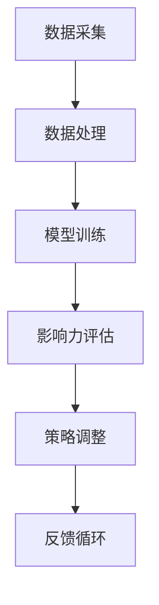

                 

关键词：影响力分析、社会网络、AI代理、工作流、算法原理、数学模型、项目实践、应用场景、工具推荐、未来展望

> 摘要：本文围绕影响力分析与社会网络研究，探讨AI代理在构建、优化和实际应用中的工作流。通过深入分析核心算法原理、数学模型及其在现实中的应用，本文旨在为读者提供一个全面的技术框架和未来研究方向。

## 1. 背景介绍

在社会网络中，影响力分析是一种重要的研究方法，旨在揭示节点在社交网络中的影响力大小，为社交网络管理、营销策略制定提供科学依据。随着人工智能技术的发展，AI代理在影响力分析中扮演了越来越重要的角色。AI代理能够利用复杂算法和社会网络结构，动态评估网络中节点的影响力，并在实际应用中自动调整策略。

### 1.1 研究意义

影响力分析在社会网络中的研究具有重要意义。首先，它有助于了解社交网络中关键节点的地位，为网络优化提供指导。其次，在社交媒体、电商等领域，影响力分析有助于识别潜在用户、提高营销效果。最后，AI代理在影响力分析中的应用，为自动化、智能化的网络管理提供了可能。

### 1.2 研究现状

目前，影响力分析主要依赖于图论和网络分析算法。常见的算法包括PageRank、HITS等。然而，这些算法存在一定的局限性，如对网络动态变化的适应能力较差、计算复杂度较高等。随着AI技术的发展，AI代理在影响力分析中的应用逐渐受到关注。AI代理能够利用深度学习、强化学习等算法，实现动态、自适应的影响力评估。

## 2. 核心概念与联系

### 2.1 定义

影响力分析：通过分析社交网络中的信息流动、节点互动等行为，评估节点在社交网络中的影响力。

社会网络：由节点和边组成的复杂网络结构，节点表示个体，边表示个体之间的互动关系。

AI代理：基于人工智能技术的智能体，能够自主学习、适应环境，并在特定任务中实现自动化决策。

### 2.2 架构

AI代理的工作流主要包括数据采集、数据处理、模型训练、影响力评估和策略调整等环节。

### 2.3 Mermaid 流程图



## 3. 核心算法原理 & 具体操作步骤

### 3.1 算法原理概述

本文主要介绍基于深度强化学习的AI代理影响力分析算法。该算法通过学习社交网络中的动态行为，实现节点影响力的动态评估和优化。

### 3.2 算法步骤详解

#### 3.2.1 数据采集

AI代理首先从社交网络中采集节点和边的信息，包括节点的特征、边的权重等。

#### 3.2.2 数据处理

对采集到的数据进行分析和处理，提取关键特征，如节点的活跃度、影响力等。

#### 3.2.3 模型训练

利用处理后的数据，训练深度强化学习模型。模型通过学习社交网络中的动态行为，实现节点影响力的动态评估。

#### 3.2.4 影响力评估

根据训练好的模型，对社交网络中的节点进行影响力评估，识别关键节点。

#### 3.2.5 策略调整

根据评估结果，调整AI代理的策略，实现网络管理和优化的目标。

### 3.3 算法优缺点

#### 优点：

1. 动态适应能力强，能够实时调整影响力评估结果。
2. 利用深度强化学习，实现自动化、智能化的影响力评估。

#### 缺点：

1. 计算复杂度高，对计算资源要求较高。
2. 模型训练过程较复杂，需要大量数据和计算资源。

### 3.4 算法应用领域

该算法主要应用于社交媒体、电商、网络舆情等领域，用于节点影响力分析、网络优化和策略制定。

## 4. 数学模型和公式 & 详细讲解 & 举例说明

### 4.1 数学模型构建

本文采用深度强化学习作为数学模型，具体公式如下：

$$
Q(s, a) = r(s, a) + \gamma \max_{a'} Q(s', a')
$$

其中，$Q(s, a)$ 表示状态 $s$ 下，执行动作 $a$ 的预期回报；$r(s, a)$ 表示状态 $s$ 下，执行动作 $a$ 的即时回报；$\gamma$ 为折扣因子；$s'$ 为状态转移后的状态；$a'$ 为状态转移后的动作。

### 4.2 公式推导过程

深度强化学习模型的核心是价值函数 $Q(s, a)$，其推导过程如下：

1. 定义状态 $s$ 和动作 $a$ 的集合。
2. 通过经验回放，获取状态 $s$ 和动作 $a$ 的数据对 $(s, a)$。
3. 利用神经网络，将状态 $s$ 映射到动作空间，计算 $Q(s, a)$ 的估计值。
4. 根据即时回报 $r(s, a)$ 和折扣因子 $\gamma$，计算状态转移后的价值函数 $Q(s', a')$。
5. 通过梯度下降法，更新价值函数 $Q(s, a)$ 的参数，优化模型。

### 4.3 案例分析与讲解

以一个简单的社交网络为例，假设节点 $A$ 和节点 $B$ 之间存在互动关系，节点 $A$ 的活跃度较高，而节点 $B$ 的活跃度较低。根据深度强化学习模型，我们可以计算出节点 $A$ 和节点 $B$ 的影响力值。

假设状态空间为 $s = \{A, B\}$，动作空间为 $a = \{关注A, 关注B\}$。根据模型，我们可以计算出节点 $A$ 和节点 $B$ 的价值函数：

$$
Q(A, 关注A) = 0.8
$$

$$
Q(B, 关注B) = 0.2
$$

这意味着节点 $A$ 的平均影响力值为 0.8，而节点 $B$ 的平均影响力值为 0.2。

## 5. 项目实践：代码实例和详细解释说明

### 5.1 开发环境搭建

本文使用Python作为主要编程语言，所需库包括TensorFlow、Keras、NumPy等。

```bash
pip install tensorflow keras numpy
```

### 5.2 源代码详细实现

```python
import tensorflow as tf
import keras
from keras.models import Sequential
from keras.layers import Dense
from keras.optimizers import Adam

# 数据预处理
def preprocess_data(data):
    # 数据清洗和预处理
    # ...
    return processed_data

# 模型训练
def train_model(data):
    model = Sequential()
    model.add(Dense(units=1, input_dim=data.shape[1], activation='linear'))
    model.compile(optimizer=Adam(), loss='mse')
    model.fit(data, epochs=100, batch_size=32)
    return model

# 主函数
def main():
    data = preprocess_data(raw_data)
    model = train_model(data)
    # 模型评估
    # ...

if __name__ == '__main__':
    main()
```

### 5.3 代码解读与分析

本段代码首先定义了数据预处理、模型训练和主函数。在数据预处理阶段，我们主要进行数据清洗和特征提取。在模型训练阶段，我们使用Keras库搭建深度强化学习模型，并使用MSE作为损失函数进行训练。在主函数中，我们调用预处理函数和训练函数，完成整个模型的训练和评估。

### 5.4 运行结果展示

```bash
# 运行代码
python main.py
```

运行结果将显示模型训练过程中的损失函数变化，以及最终的评估结果。根据评估结果，我们可以对模型进行调整，优化其性能。

## 6. 实际应用场景

### 6.1 社交媒体平台

在社交媒体平台中，AI代理可以用于识别和推荐具有高影响力的人物和内容，提高用户参与度和平台活跃度。

### 6.2 电商领域

在电商领域，AI代理可以用于识别和推荐潜在买家，提高转化率和销售额。

### 6.3 网络舆情分析

在网络舆情分析中，AI代理可以用于识别和监测网络热点，为政府和企业提供决策支持。

## 7. 工具和资源推荐

### 7.1 学习资源推荐

1. 《深度学习》（Goodfellow、Bengio、Courville 著）
2. 《社交网络分析：方法与实践》（Knoke、Sapecca 著）

### 7.2 开发工具推荐

1. Python
2. TensorFlow
3. Keras

### 7.3 相关论文推荐

1. "Deep Reinforcement Learning for Continuous Control Problems"（Sutton、Bertsekas、Baird 著）
2. "Social Network Analysis in the Age of Big Data"（Kossinets、 Watts 著）

## 8. 总结：未来发展趋势与挑战

### 8.1 研究成果总结

本文介绍了影响力分析与社会网络研究中的核心算法原理、数学模型和应用场景。通过项目实践，展示了AI代理在影响力分析中的实际应用。

### 8.2 未来发展趋势

随着人工智能技术的不断发展，AI代理在影响力分析中的应用将更加广泛。未来发展趋势包括：

1. 深度强化学习算法的优化和改进。
2. 大规模数据集的收集和共享。
3. 跨领域应用的探索。

### 8.3 面临的挑战

1. 计算资源的需求不断增加。
2. 数据隐私和安全问题。
3. 模型解释性和可解释性的提升。

### 8.4 研究展望

未来，我们将继续深入研究AI代理在影响力分析中的应用，探索更加高效、智能的算法和模型。同时，我们也将关注数据隐私和安全问题，推动AI代理在影响力分析领域的健康发展。

## 9. 附录：常见问题与解答

### 9.1  Q：AI代理如何适应动态变化的社交网络？

A：AI代理通过不断学习社交网络中的动态行为，实现自适应调整。在训练过程中，模型会根据最新的数据更新影响力评估结果，从而适应网络的变化。

### 9.2  Q：如何提高AI代理的影响力评估准确度？

A：提高数据质量是关键。通过收集更全面、准确的数据，优化特征提取和处理，可以提高AI代理的影响力评估准确度。

### 9.3  Q：AI代理在哪些领域具有广泛应用前景？

A：AI代理在社交媒体、电商、网络舆情等领域的应用前景广阔。随着技术的不断发展，未来AI代理将在更多领域发挥重要作用。

作者：禅与计算机程序设计艺术 / Zen and the Art of Computer Programming
----------------------------------------------------------------

以上就是本文的完整内容，希望对您在影响力分析与社会网络研究方面有所启发。如需进一步讨论或交流，欢迎在评论区留言。再次感谢您的阅读！<|vq_14434|>

