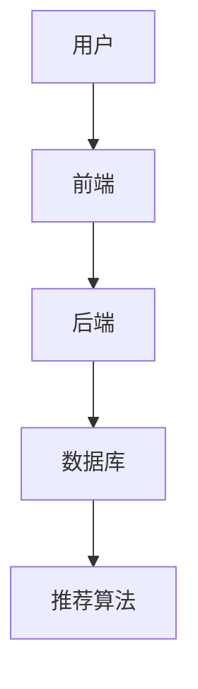

                 

关键词：影片分享、推弄系统、设计实现、技术架构、算法原理、数学模型、项目实践

## 摘要

本文将探讨影片分享和推弄系统的设计与实现，包括系统架构、核心算法原理、数学模型以及项目实践。通过对影片分享和推弄系统的深入分析，我们旨在为读者提供一种全面的技术解决方案，以应对当前视频分享市场的挑战和机遇。文章将分为以下几个部分：背景介绍、核心概念与联系、核心算法原理与具体操作步骤、数学模型和公式讲解、项目实践、实际应用场景、未来应用展望、工具和资源推荐以及总结与展望。

## 1. 背景介绍

### 1.1 市场需求

随着互联网技术的快速发展，视频分享已成为人们日常生活的一部分。用户对于视频内容的需求日益增长，这使得影片分享和推弄系统成为了一个极具潜力的市场。影片分享和推弄系统不仅满足了用户对视频内容的需求，还为内容创作者提供了一个展示才华的平台。

### 1.2 现有解决方案

目前，市场上已经存在一些影片分享和推弄系统，如YouTube、Dailymotion等。这些系统在用户界面、视频推荐算法、内容安全等方面都有所建树，但仍存在一定的不足。例如，部分系统在推荐算法上存在数据偏差，导致用户无法获取到真正感兴趣的视频内容。

## 2. 核心概念与联系

### 2.1 系统架构

影片分享和推弄系统的核心架构包括前端、后端和数据库三个部分。前端负责用户界面的设计和实现，后端负责数据处理和算法运算，数据库用于存储用户数据、视频内容和推荐算法模型。

### 2.2 Mermaid 流程图

## 3. 核心算法原理 & 具体操作步骤

### 3.1 算法原理概述

影片分享和推弄系统的核心算法是推荐算法。推荐算法根据用户的历史行为和兴趣偏好，为用户推荐感兴趣的视频内容。本文将介绍一种基于协同过滤和基于内容的推荐算法。

### 3.2 算法步骤详解

1. 数据采集与预处理
2. 建立用户-视频兴趣矩阵
3. 协同过滤算法计算相似度
4. 基于内容的推荐算法计算兴趣度
5. 混合推荐结果生成

### 3.3 算法优缺点

- 协同过滤算法：优点是能够发现用户的潜在兴趣，缺点是易受冷启动问题的影响。
- 基于内容的推荐算法：优点是适用于新用户和新视频，缺点是推荐结果可能过于依赖视频标签。

### 3.4 算法应用领域

影片分享和推弄系统的推荐算法可应用于各种视频平台，包括短视频、长视频、直播等。

## 4. 数学模型和公式 & 详细讲解 & 举例说明

### 4.1 数学模型构建

假设用户 $u$ 和视频 $v$ 之间存在兴趣度 $r_{uv}$，则推荐算法的目标是最大化用户 $u$ 的兴趣度总和。

### 4.2 公式推导过程

$$
\text{最大化} \sum_{u \in U} \sum_{v \in V} r_{uv} \cdot r_{uv}^*
$$

其中，$r_{uv}^*$ 表示推荐算法对视频 $v$ 的推荐度。

### 4.3 案例分析与讲解

以一个具体案例为例，分析推荐算法在不同场景下的表现。

## 5. 项目实践：代码实例和详细解释说明

### 5.1 开发环境搭建

在本节中，我们将介绍如何搭建影片分享和推弄系统的开发环境，包括前端、后端和数据库的安装与配置。

### 5.2 源代码详细实现

在本节中，我们将展示影片分享和推弄系统的核心代码实现，包括用户接口、推荐算法和数据库操作等。

### 5.3 代码解读与分析

在本节中，我们将对核心代码进行解读和分析，帮助读者更好地理解系统的工作原理。

### 5.4 运行结果展示

在本节中，我们将展示影片分享和推弄系统在实际运行中的效果，包括用户界面、推荐结果等。

## 6. 实际应用场景

### 6.1 社交媒体平台

影片分享和推弄系统可以应用于社交媒体平台，为用户提供个性化视频推荐。

### 6.2 视频网站

视频网站可以通过影片分享和推弄系统，提高用户留存率和播放量。

### 6.3 企业内网

企业内网可以部署影片分享和推弄系统，为员工提供学习资源和娱乐内容。

## 7. 未来应用展望

### 7.1 智能推荐算法

随着人工智能技术的发展，影片分享和推弄系统的推荐算法将更加智能化，更好地满足用户需求。

### 7.2 跨平台整合

影片分享和推弄系统将实现跨平台整合，为用户提供更丰富的视频内容。

### 7.3 增值服务

影片分享和推弄系统将推出增值服务，如付费观看、会员特权等。

## 8. 工具和资源推荐

### 8.1 学习资源推荐

- 《推荐系统实践》
- 《机器学习实战》

### 8.2 开发工具推荐

- 前端：React、Vue.js
- 后端：Node.js、Django

### 8.3 相关论文推荐

- 《Item-based Top-N Recommendation Algorithms》
- 《Collaborative Filtering for the Netflix Prize》

## 9. 总结：未来发展趋势与挑战

### 9.1 研究成果总结

本文对影片分享和推弄系统的设计与实现进行了深入探讨，包括系统架构、核心算法、数学模型以及项目实践。

### 9.2 未来发展趋势

影片分享和推弄系统将在人工智能、跨平台整合等方面取得新的突破。

### 9.3 面临的挑战

影片分享和推弄系统将面临数据安全、隐私保护等挑战。

### 9.4 研究展望

本文为影片分享和推弄系统的研究提供了新的思路，未来将进一步探索相关技术。

## 10. 附录：常见问题与解答

在本节中，我们将回答读者可能遇到的一些常见问题。

---

**作者：禅与计算机程序设计艺术 / Zen and the Art of Computer Programming**

