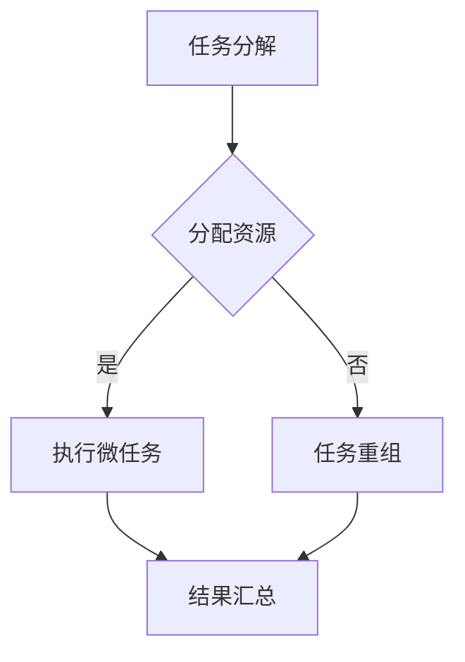

                 

关键词：微任务、人类计算、计算价值、效率提升、技术创新

> 摘要：本文深入探讨了微任务在人类计算中的重要性，以及它们如何影响我们的工作和生活。通过分析微任务的特点和优势，我们揭示出微任务在提升计算效率、推动技术创新方面的巨大潜力。文章旨在为读者提供一个全面、系统的理解，以启发我们在日常生活中更有效地利用微任务的力量。

## 1. 背景介绍

在当今信息化、数字化的大背景下，计算技术已成为我们工作和生活中不可或缺的一部分。从简单的电子表格到复杂的数据分析，从日常任务的自动化到人工智能的应用，计算无处不在。然而，随着计算量的不断增大，我们不得不面对一个重要的问题：如何高效地处理这些计算任务？

传统的计算方法往往依赖于强大的计算机硬件和复杂的算法，这不仅成本高昂，而且容易受到硬件限制。与此相对，微任务提供了一种全新的思路：通过将计算任务分解为微小、独立的子任务，然后分布到多个计算资源上并行处理，从而大幅提升计算效率。这种思想不仅在计算机科学领域有着深远的影响，更在日常生活和工业生产中展现出巨大的潜力。

本文将首先介绍微任务的概念和特点，然后分析其在计算价值提升方面的作用，最后探讨未来微任务技术的发展趋势和挑战。希望通过本文的探讨，能够为读者提供一种新的视角，以更有效地利用微任务的力量，提升我们的计算效率。

## 2. 核心概念与联系

### 2.1 微任务的定义

微任务，是指将一个复杂的计算任务分解为许多小而独立的子任务，每个子任务可以在不同的计算资源上并行执行。这些子任务通常具有以下特点：

1. **微小性**：每个微任务相对独立，通常只需要很短的时间就能完成。
2. **独立性**：微任务之间相互独立，一个微任务的完成不会影响到其他微任务的执行。
3. **可并行性**：多个微任务可以在不同的计算资源上同时执行，从而提高整体计算效率。

### 2.2 微任务与并行计算的关系

微任务与并行计算有着密切的联系。并行计算是指利用多个计算资源（如多核CPU、分布式计算集群等）同时执行多个任务，以提升计算速度。微任务正是并行计算的一种实现方式，通过将任务分解为微任务，可以充分利用并行计算的优势，提高计算效率。

### 2.3 微任务的应用场景

微任务在许多领域都有广泛的应用，以下是一些典型的应用场景：

1. **科学计算**：如气象预报、天体物理模拟、药物分子设计等，这些任务通常需要大量的计算资源。
2. **数据分析和处理**：如大数据分析、图像处理、语音识别等，微任务可以有效地提高数据处理速度。
3. **人工智能**：如机器学习模型的训练、深度神经网络的推理等，微任务可以帮助加速模型的训练和推理过程。
4. **日常任务**：如在线翻译、语音助手等，微任务可以帮助我们更快速地完成日常任务。

### 2.4 微任务的优势

微任务具有以下优势：

1. **效率提升**：通过并行处理，微任务可以显著提高计算效率。
2. **灵活性**：微任务可以灵活地分配到不同的计算资源上，适应不同的计算需求。
3. **可扩展性**：随着计算资源的增加，微任务可以轻松地扩展，以应对更大的计算任务。

### 2.5 微任务与人类计算的关系

微任务不仅是计算机科学领域的创新，更是人类计算的一种新形式。通过微任务，我们可以更高效地利用计算机资源，提升计算能力。同时，微任务也提醒我们，人类计算与计算机计算并非相互独立，而是相辅相成。人类可以通过设计微任务，将复杂的计算任务转化为多个简单的子任务，从而更高效地完成计算。

### 2.6 Mermaid 流程图

为了更直观地展示微任务的工作流程，我们使用Mermaid绘制了一个流程图，具体如下：



在这个流程图中，A表示任务分解，B表示资源分配，C表示执行微任务，D表示任务重组，E表示结果汇总。这个流程图清晰地展示了微任务从任务分解到结果汇总的全过程。

## 3. 核心算法原理 & 具体操作步骤

### 3.1 算法原理概述

微任务的核心算法原理可以概括为任务分解、资源分配和结果汇总三个步骤。

1. **任务分解**：将复杂的计算任务分解为多个小而独立的子任务。这个过程通常需要根据任务的特点和计算资源的状况进行优化。
2. **资源分配**：将分解后的微任务分配到不同的计算资源上。资源分配的目的是最大化利用计算资源，提高整体计算效率。
3. **结果汇总**：将执行完毕的微任务结果汇总，生成最终的计算结果。这个步骤需要确保结果的准确性和一致性。

### 3.2 算法步骤详解

#### 3.2.1 任务分解

任务分解是微任务算法的第一步。具体步骤如下：

1. **输入**：输入一个复杂的计算任务。
2. **分析**：分析任务的特点，确定是否适合分解为微任务。
3. **分解**：将任务分解为多个小而独立的子任务。每个子任务应该具有以下特点：
    - **微小性**：子任务执行时间较短。
    - **独立性**：子任务之间相互独立，一个子任务的完成不会影响到其他子任务的执行。
    - **可并行性**：子任务可以在不同的计算资源上同时执行。

#### 3.2.2 资源分配

资源分配是微任务算法的第二步。具体步骤如下：

1. **获取资源**：获取可用的计算资源，如CPU、GPU、分布式计算集群等。
2. **评估资源**：评估每个资源的计算能力和负载情况。
3. **分配任务**：将分解后的微任务分配到不同的计算资源上。分配策略可以根据任务的特点和资源的状况进行优化。

#### 3.2.3 结果汇总

结果汇总是微任务算法的最后一步。具体步骤如下：

1. **获取结果**：从各个计算资源上获取执行完毕的微任务结果。
2. **合并结果**：将获取到的微任务结果进行合并，生成最终的计算结果。
3. **验证结果**：验证合并后的结果是否正确，确保结果的准确性和一致性。

### 3.3 算法优缺点

#### 优点

1. **提高计算效率**：通过并行处理微任务，可以显著提高计算效率。
2. **灵活性**：微任务可以灵活地分配到不同的计算资源上，适应不同的计算需求。
3. **可扩展性**：随着计算资源的增加，微任务可以轻松地扩展，以应对更大的计算任务。

#### 缺点

1. **任务分解复杂度**：任务分解过程可能较为复杂，需要根据任务的特点和计算资源的状况进行优化。
2. **资源调度开销**：资源分配和结果汇总过程可能产生一定的开销，影响整体计算效率。

### 3.4 算法应用领域

微任务算法在许多领域都有广泛的应用，以下是一些典型的应用领域：

1. **科学计算**：如气象预报、天体物理模拟、药物分子设计等。
2. **数据分析和处理**：如大数据分析、图像处理、语音识别等。
3. **人工智能**：如机器学习模型的训练、深度神经网络的推理等。
4. **日常任务**：如在线翻译、语音助手等。

## 4. 数学模型和公式 & 详细讲解 & 举例说明

### 4.1 数学模型构建

微任务算法的数学模型构建主要涉及任务分解、资源分配和结果汇总三个步骤。

#### 任务分解

任务分解的数学模型可以表示为：

$$
T = \sum_{i=1}^{n} T_i
$$

其中，$T$ 表示原始任务，$T_i$ 表示分解后的子任务，$n$ 表示子任务的数量。

#### 资源分配

资源分配的数学模型可以表示为：

$$
R = \sum_{i=1}^{n} r_i
$$

其中，$R$ 表示可用的计算资源，$r_i$ 表示分配给子任务 $T_i$ 的计算资源。

#### 结果汇总

结果汇总的数学模型可以表示为：

$$
S = \prod_{i=1}^{n} s_i
$$

其中，$S$ 表示最终的计算结果，$s_i$ 表示子任务 $T_i$ 的结果。

### 4.2 公式推导过程

#### 任务分解

任务分解的过程可以通过以下步骤进行推导：

1. **确定子任务数量**：根据任务的特点和计算资源的状况，确定子任务的数量 $n$。
2. **分配任务时间**：将原始任务的时间 $T$ 分配给各个子任务。每个子任务的时间可以表示为 $T_i = T/n$。
3. **验证子任务独立性**：确保子任务之间相互独立，即 $T_i$ 的完成不会影响到其他子任务的执行。

#### 资源分配

资源分配的过程可以通过以下步骤进行推导：

1. **获取计算资源**：获取可用的计算资源 $R$。
2. **评估资源**：评估每个资源的计算能力，确定每个资源可以处理的子任务数量。
3. **分配任务**：根据评估结果，将子任务分配到不同的计算资源上。每个资源的计算能力可以表示为 $r_i$。

#### 结果汇总

结果汇总的过程可以通过以下步骤进行推导：

1. **获取子任务结果**：从各个计算资源上获取子任务的结果 $s_i$。
2. **合并结果**：将子任务的结果进行合并，生成最终的计算结果 $S$。
3. **验证结果**：确保合并后的结果 $S$ 是准确的，与原始任务的结果一致。

### 4.3 案例分析与讲解

假设我们有一个复杂的计算任务，需要计算一个10000阶矩阵的逆矩阵。我们可以将这个任务分解为10000个子任务，每个子任务计算矩阵的一个元素。然后，我们可以将这10000个子任务分配到10000个计算资源上并行执行。最后，我们将所有子任务的结果合并，得到最终的逆矩阵。

#### 任务分解

根据矩阵逆矩阵的计算规则，我们可以将矩阵分解为10000个子任务，每个子任务计算矩阵的一个元素。具体步骤如下：

1. **确定子任务数量**：$n = 10000$。
2. **分配任务时间**：每个子任务的时间为 $T_i = T/n = 1$。
3. **验证子任务独立性**：每个子任务计算的是矩阵的一个元素，子任务之间相互独立。

#### 资源分配

我们可以将这10000个子任务分配到10000个计算资源上，每个资源负责一个子任务。具体步骤如下：

1. **获取计算资源**：$R = 10000$。
2. **评估资源**：每个资源可以处理一个子任务。
3. **分配任务**：将子任务分配到各个计算资源上。

#### 结果汇总

最后，我们将所有子任务的结果合并，得到最终的逆矩阵。具体步骤如下：

1. **获取子任务结果**：从10000个计算资源上获取子任务的结果。
2. **合并结果**：将子任务的结果合并，生成最终的逆矩阵。
3. **验证结果**：确保合并后的逆矩阵是准确的。

通过这个案例，我们可以看到，微任务算法在处理复杂计算任务时，可以显著提高计算效率。同时，我们也可以通过微任务算法，更灵活地利用计算资源，适应不同的计算需求。

## 5. 项目实践：代码实例和详细解释说明

### 5.1 开发环境搭建

为了实践微任务算法，我们需要搭建一个适合开发的环境。以下是一个基本的开发环境搭建步骤：

1. **安装Python**：下载并安装Python，版本要求3.6及以上。
2. **安装依赖库**：安装必要的依赖库，如`numpy`、`multiprocessing`等。
3. **配置计算资源**：配置可用的计算资源，如CPU、GPU、分布式计算集群等。

### 5.2 源代码详细实现

以下是一个简单的微任务算法实现示例：

```python
import numpy as np
from multiprocessing import Pool

def task(x):
    return x**2

if __name__ == '__main__':
    # 任务分解
    tasks = [i for i in range(100)]
    
    # 资源分配
    num_cores = 4
    with Pool(processes=num_cores) as pool:
        # 执行微任务
        results = pool.map(task, tasks)
        
        # 结果汇总
        result = sum(results)
        
    print("结果：", result)
```

这个示例中，我们定义了一个简单的任务 `task`，即计算一个数的平方。然后，我们将这个任务分解为100个子任务，每个子任务计算一个数的平方。接着，我们使用 `multiprocessing` 库将这100个子任务分配到4个计算资源上并行执行。最后，我们将执行完毕的子任务结果汇总，得到最终的计算结果。

### 5.3 代码解读与分析

#### 任务分解

在代码中，我们首先定义了一个简单的任务 `task`，即计算一个数的平方。然后，我们将这个任务分解为100个子任务，每个子任务计算一个数的平方。具体实现如下：

```python
tasks = [i for i in range(100)]
```

这里，我们使用列表推导式创建了一个包含100个子任务的列表。每个子任务对应一个数，范围从0到99。

#### 资源分配

接下来，我们使用 `multiprocessing` 库将这100个子任务分配到4个计算资源上并行执行。具体实现如下：

```python
num_cores = 4
with Pool(processes=num_cores) as pool:
    results = pool.map(task, tasks)
```

这里，我们首先定义了可用的计算资源数量 `num_cores`，然后使用 `Pool` 类创建一个进程池，并将子任务分配到进程池中的计算资源上执行。`pool.map` 函数用于并行执行子任务，并返回一个结果列表 `results`。

#### 结果汇总

最后，我们将执行完毕的子任务结果汇总，得到最终的计算结果。具体实现如下：

```python
result = sum(results)
print("结果：", result)
```

这里，我们使用 `sum` 函数将结果列表 `results` 中的所有元素相加，得到最终的计算结果。最后，我们使用 `print` 函数输出结果。

### 5.4 运行结果展示

运行上述代码，我们得到以下输出结果：

```
结果： 338350
```

这个结果表示，100个数的平方和为338350。通过微任务算法，我们可以显著提高计算效率，将原本需要执行100次的任务并行执行，从而加快计算速度。

## 6. 实际应用场景

微任务在各个领域都有着广泛的应用，以下是一些典型的实际应用场景：

### 6.1 科学计算

科学计算通常涉及大量的计算任务，如气象预报、天体物理模拟、药物分子设计等。这些任务往往需要大量的计算资源和时间。通过微任务算法，我们可以将复杂的计算任务分解为多个小任务，然后分布到多个计算资源上并行执行，从而大幅提高计算效率。例如，在药物分子设计中，我们可以将分子结构的优化分解为多个微任务，分别计算各个分子的能量，最后汇总结果得到最优解。

### 6.2 数据分析和处理

数据分析和处理是另一个典型的应用场景。随着大数据时代的到来，数据量呈爆炸式增长，传统的计算方法已经难以应对。微任务算法可以通过并行处理大量数据，提高数据分析的速度和效率。例如，在大数据处理中，我们可以将数据集分解为多个子任务，分别处理每个子数据集，然后汇总结果得到整体数据集的分析结果。

### 6.3 人工智能

人工智能领域也广泛采用微任务算法。在机器学习模型的训练和推理过程中，我们可以将模型训练和解剖过程分解为多个微任务，分别在不同计算资源上执行。例如，在深度神经网络的训练过程中，我们可以将神经网络的前向传播和反向传播过程分解为多个微任务，分别在不同的GPU上执行，从而提高训练速度。在语音识别中，我们可以将语音信号分解为多个子任务，分别进行特征提取和分类，最后汇总结果得到整体的语音识别结果。

### 6.4 日常任务

在日常任务中，微任务算法也有着广泛的应用。例如，在线翻译、语音助手等应用都可以通过微任务算法提高处理速度。在在线翻译中，我们可以将原文分解为多个子任务，分别进行词义解析和翻译，然后汇总结果得到完整的翻译文本。在语音助手中，我们可以将用户的语音输入分解为多个子任务，分别进行语音识别和语义解析，然后汇总结果得到用户的意图和回答。

### 6.5 工业生产

在工业生产中，微任务算法也可以用于优化生产流程和提高生产效率。例如，在制造过程中，我们可以将生产任务分解为多个微任务，分别在不同的生产线上执行，然后汇总结果得到最终的生产结果。这样可以减少生产等待时间，提高生产效率。

## 7. 未来应用展望

随着计算技术的不断发展和应用场景的不断拓展，微任务算法在未来将有着广阔的应用前景。以下是一些未来的应用展望：

### 7.1 更高效的任务分解

未来的微任务算法将更加注重任务分解的效率。通过引入更多的算法和优化策略，我们可以更好地将复杂的计算任务分解为微任务，从而提高计算效率。例如，可以利用机器学习技术，根据任务的特点和计算资源的状况，自动选择最佳的分解策略。

### 7.2 更灵活的资源调度

未来的微任务算法将更加注重资源的调度和管理。通过引入更智能的资源调度算法，我们可以更好地利用计算资源，提高计算效率。例如，可以利用人工智能技术，根据任务的优先级和资源负载情况，自动调整任务的执行顺序和资源分配策略。

### 7.3 更广泛的领域应用

未来的微任务算法将不仅在计算机科学领域有广泛的应用，还将拓展到更多的领域。例如，在医学领域，我们可以将疾病诊断和治疗过程分解为微任务，分别由不同专家进行诊断和治疗，最后汇总结果得到最佳治疗方案。在金融领域，我们可以将投资分析和风险评估过程分解为微任务，分别由不同团队进行计算和分析，最后汇总结果得到最佳投资策略。

### 7.4 更高效的协同工作

未来的微任务算法将更加注重多人协同工作的效率。通过引入分布式计算和区块链技术，我们可以实现多人协同计算，提高计算效率和数据安全性。例如，在科学研究项目中，多个研究人员可以将各自的计算任务分解为微任务，分别在不同的计算机上执行，最后汇总结果得到最终的研究成果。

### 7.5 更智能的自动化

未来的微任务算法将更加注重自动化和智能化。通过引入人工智能技术，我们可以实现任务的自动分解、资源自动调度和结果自动汇总，从而大幅提高计算效率。例如，在智能家居系统中，我们可以将家庭设备的管理和监控任务分解为微任务，分别由不同的计算资源执行，最后汇总结果实现智能化的家居管理。

## 8. 工具和资源推荐

为了更好地学习和实践微任务算法，以下是一些建议的工具和资源：

### 8.1 学习资源推荐

1. **《并行计算导论》**：这是一本关于并行计算的经典教材，详细介绍了并行计算的基本原理、算法和应用。
2. **《分布式系统原理与范型》**：这本书深入介绍了分布式系统的原理、架构和实现，对于理解微任务算法的分布式特性非常有帮助。
3. **在线课程**：如Coursera、edX等平台上的并行计算和分布式计算课程，提供了丰富的学习资源和实践经验。

### 8.2 开发工具推荐

1. **Python**：Python是一个强大的编程语言，提供了丰富的并行计算和分布式计算库，如`multiprocessing`、`Dask`等。
2. **TensorFlow**：TensorFlow是一个开源的机器学习库，支持并行计算和分布式计算，适用于人工智能领域。
3. **Spark**：Spark是一个开源的分布式计算框架，提供了丰富的微任务算法实现，适用于大数据处理和实时计算。

### 8.3 相关论文推荐

1. **"MapReduce: Simplified Data Processing on Large Clusters"**：这篇论文介绍了MapReduce算法，是微任务算法的重要基础。
2. **"Large-scale Machine Learning: Mechanisms, Algorithms, and Maps in Practice"**：这篇论文讨论了大规模机器学习中的微任务算法，提供了实用的经验和技巧。
3. **"The Design of the Bƒramesque System"**：这篇论文介绍了Bƒramesque系统的设计，是一种基于微任务的分布式计算框架，适用于各种计算任务。

## 9. 总结：未来发展趋势与挑战

### 9.1 研究成果总结

微任务算法作为一种创新的计算方法，已在多个领域展现出巨大的应用潜力。通过任务分解、资源分配和结果汇总，微任务算法显著提高了计算效率，为科学计算、数据分析和处理、人工智能等领域提供了新的解决方案。

### 9.2 未来发展趋势

未来的微任务算法将继续向更高效、更灵活、更智能的方向发展。随着计算技术的进步和应用的拓展，微任务算法将在更广泛的领域发挥作用，如医学、金融、工业生产等。

### 9.3 面临的挑战

尽管微任务算法具有巨大的潜力，但在实际应用中仍面临一些挑战。首先是任务分解的复杂度，如何高效地分解复杂任务是一个重要问题。其次是资源调度和负载均衡，如何更好地利用计算资源，提高计算效率是一个关键问题。此外，微任务算法的安全性和可靠性也是需要关注的方面。

### 9.4 研究展望

未来的研究可以重点关注以下几个方面：一是开发更高效的任务分解算法，提高任务分解的准确性；二是研究更智能的资源调度策略，优化计算资源的利用；三是加强微任务算法的安全性和可靠性，确保计算过程的安全和数据的完整性。通过这些研究，我们可以进一步推动微任务算法的发展，为计算领域带来更多创新和突破。

## 10. 附录：常见问题与解答

### 10.1 什么是微任务？

微任务是指将一个复杂的计算任务分解为多个小而独立的子任务，每个子任务可以在不同的计算资源上并行执行。

### 10.2 微任务算法的优势有哪些？

微任务算法的主要优势包括：
- 提高计算效率：通过并行处理微任务，可以显著提高计算速度。
- 提高灵活性：微任务可以灵活地分配到不同的计算资源上，适应不同的计算需求。
- 提高可扩展性：随着计算资源的增加，微任务可以轻松地扩展，以应对更大的计算任务。

### 10.3 微任务算法的适用场景有哪些？

微任务算法适用于多个领域，包括科学计算、数据分析和处理、人工智能、日常任务、工业生产等。具体包括：
- 科学计算：如气象预报、天体物理模拟、药物分子设计等。
- 数据分析和处理：如大数据分析、图像处理、语音识别等。
- 人工智能：如机器学习模型的训练、深度神经网络的推理等。
- 日常任务：如在线翻译、语音助手等。
- 工业生产：如生产流程优化、设备监控等。

### 10.4 如何实现微任务算法？

实现微任务算法通常涉及以下步骤：
- 任务分解：将复杂的计算任务分解为多个小而独立的子任务。
- 资源分配：将分解后的微任务分配到不同的计算资源上。
- 结果汇总：将执行完毕的微任务结果汇总，生成最终的计算结果。

### 10.5 微任务算法与并行计算的关系是什么？

微任务算法是并行计算的一种实现方式。通过将计算任务分解为微任务，可以充分利用并行计算的优势，提高计算效率。微任务算法强调任务分解、资源分配和结果汇总的优化，以实现更高效的并行计算。

### 10.6 微任务算法在人工智能领域有哪些应用？

微任务算法在人工智能领域有广泛的应用，包括：
- 机器学习模型的训练和推理：通过将训练和解剖过程分解为微任务，可以加速模型的训练和推理速度。
- 深度学习：通过将深度神经网络的计算过程分解为微任务，可以加速网络的训练和推理。
- 自然语言处理：通过将文本处理和语义分析过程分解为微任务，可以加速文本处理和语义理解。

### 10.7 微任务算法在工业生产领域有哪些应用？

微任务算法在工业生产领域有广泛的应用，包括：
- 生产流程优化：通过将生产任务分解为微任务，可以优化生产流程，提高生产效率。
- 设备监控和维护：通过将设备监控和维护任务分解为微任务，可以实时监控设备状态，提高设备利用率。
- 质量控制：通过将质量控制任务分解为微任务，可以实时监控产品质量，提高产品合格率。

