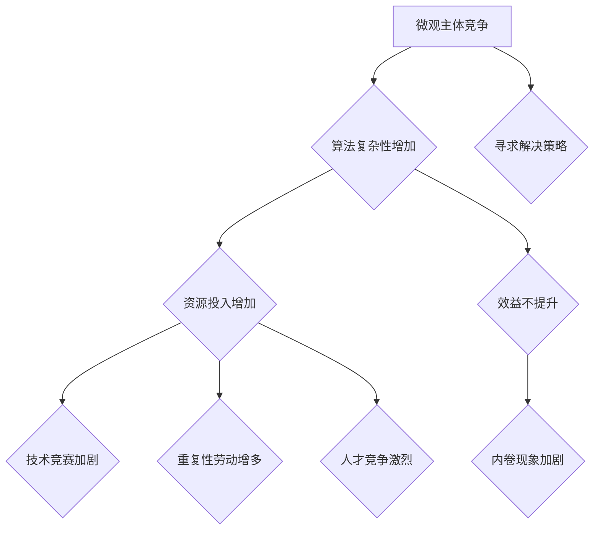

                 

关键词：微观主体、竞争、内卷、复杂性、算法、数学模型、实践应用、未来展望

## 摘要

本文深入探讨了微观主体间竞争与内卷现象在信息技术领域的表现及其影响。通过分析现代算法和数学模型的复杂性，本文揭示了微观主体在追求技术进步和市场份额的过程中，如何不断加剧内卷化的趋势。文章从背景介绍、核心概念与联系、核心算法原理、数学模型和公式、项目实践、实际应用场景等多个方面展开，旨在为读者提供全面而深刻的见解。通过总结研究成果、展望未来发展，本文希望引发读者对信息技术领域内卷现象的深思，并提出应对策略。

## 1. 背景介绍

在信息技术飞速发展的今天，算法和数学模型作为核心技术工具，已经成为推动创新和应用的重要动力。然而，随着算法复杂性的增加和数据处理规模的扩大，微观主体（如企业、开发者、研究者等）之间的竞争也愈发激烈。这种竞争不仅体现在市场份额的争夺，还反映在技术进步的快速迭代上。内卷化现象在这样的背景下日益显著，成为信息技术领域不可忽视的重要问题。

内卷化（involution）一词源于社会学领域，最初用于描述农业社会中人口增长导致土地利用率提高，但人均产出却不升反降的现象。在信息技术领域，内卷化指的是在技术和市场达到一定成熟度后，由于过度竞争导致的资源（如人力、资金、时间等）投入增加，但整体产出并未相应提高，甚至出现效益下降的情况。

内卷化现象在信息技术领域有多种表现形式：

1. **技术竞赛**：企业为了在激烈的市场竞争中脱颖而出，不断追求技术上的突破，导致技术研发成本大幅上升，而实际效益却未必同步增长。
2. **重复性劳动**：开发者为了满足市场需求，不断重复编写和优化相似的代码，而缺乏创新性的技术突破。
3. **人才竞争**：企业之间为了争夺优秀人才，提高薪资和福利待遇，但高薪酬带来的高成本却未必能转化为生产力。

本文旨在深入分析微观主体间竞争与内卷现象的原因、表现形式及其影响，并提供相应的解决策略，以期为信息技术领域的可持续发展提供有益的参考。

## 2. 核心概念与联系

### 2.1. 微观主体

微观主体在信息技术领域主要指企业、开发者、研究者等参与技术竞争和市场活动的个体或组织。他们通过技术研究和应用，推动信息技术的发展和创新。微观主体之间的竞争主要体现在技术突破、市场份额、人才资源等方面。

### 2.2. 算法复杂性

算法复杂性是指算法在处理问题和数据时的计算难度和资源消耗。随着算法复杂性的增加，处理相同规模数据所需的时间和资源成倍增长。算法复杂性的提升源于多个因素，包括算法本身的复杂度、数据处理技术的进步、数据量的爆炸性增长等。

### 2.3. 内卷现象

内卷现象在信息技术领域表现为：

- **技术竞赛**：企业在技术竞争中不断投入更多资源，追求更高的技术水平，但实际产出并未同步增长。
- **重复性劳动**：开发者为了满足市场需求，重复编写和优化相似的代码，缺乏创新性。
- **人才竞争**：企业为了争夺优秀人才，提高薪资和福利待遇，但高成本未必能转化为生产力。

### 2.4. 内卷与复杂性关系

内卷现象与算法复杂性密切相关。算法复杂性的增加导致企业在技术研发和人才争夺中投入更多资源，但效益未必提高。这种恶性循环加剧了内卷化现象，使微观主体在竞争中不断陷入困境。

### 2.5. Mermaid 流程图



## 3. 核心算法原理 & 具体操作步骤

### 3.1. 算法原理概述

本文将讨论一种在信息技术领域广泛应用的算法——排序算法。排序算法通过对数据进行排序，帮助用户快速查找和操作数据。本文主要介绍快速排序算法（Quick Sort），这是一种效率较高的排序方法。

快速排序算法的基本思想是通过一趟排序将待排记录分隔成独立的两部分，其中一部分记录的关键字均比另一部分的关键字小，然后分别对这两部分记录继续进行排序，以达到整个序列有序。快速排序的时间复杂度在平均情况下为 \(O(n \log n)\)，在最坏情况下为 \(O(n^2)\)。

### 3.2. 算法步骤详解

快速排序算法的主要步骤如下：

1. **选择基准元素**：从序列中选出一个元素作为基准元素。
2. **分区操作**：将序列分为两部分，一部分的所有元素均小于基准元素，另一部分的所有元素均大于基准元素。
3. **递归排序**：分别对基准元素左右两部分进行快速排序。

具体操作步骤如下：

#### 步骤 1: 选择基准元素

选择基准元素的方法有多种，如随机选择、选择第一个元素或最后一个元素等。本文采用随机选择的方法。

```python
import random

def select_pivot(arr, low, high):
    pivot_index = random.randint(low, high)
    arr[low], arr[pivot_index] = arr[pivot_index], arr[low]
    return arr[low]
```

#### 步骤 2: 分区操作

分区操作是将序列分为两部分，小于基准元素和大于基准元素的两部分。

```python
def partition(arr, low, high):
    pivot = select_pivot(arr, low, high)
    i = low - 1
    for j in range(low, high):
        if arr[j] < pivot:
            i += 1
            arr[i], arr[j] = arr[j], arr[i]
    arr[i + 1], arr[high] = arr[high], arr[i + 1]
    return i + 1
```

#### 步骤 3: 递归排序

递归排序是对基准元素左右两部分分别进行快速排序。

```python
def quick_sort(arr, low, high):
    if low < high:
        pivot_index = partition(arr, low, high)
        quick_sort(arr, low, pivot_index - 1)
        quick_sort(arr, pivot_index + 1, high)
```

### 3.3. 算法优缺点

#### 优点

- **高效**：在平均情况下，快速排序的时间复杂度为 \(O(n \log n)\)，相较于其他排序算法，效率较高。
- **易于实现**：快速排序算法的实现较为简单，易于理解和编码。

#### 缺点

- **最坏情况性能**：在最坏情况下，快速排序的时间复杂度为 \(O(n^2)\)，此时性能较差。
- **空间复杂度**：快速排序使用了递归，导致空间复杂度较高。

### 3.4. 算法应用领域

快速排序算法在信息技术领域有广泛的应用，包括数据库排序、数据处理、搜索引擎索引构建等。例如，Python 的内置 `sorted()` 函数和 `list.sort()` 方法都采用了快速排序算法。

## 4. 数学模型和公式 & 详细讲解 & 举例说明

### 4.1. 数学模型构建

在分析内卷现象时，我们可以构建一个简单的数学模型来描述微观主体在竞争中的行为。假设有 \(N\) 个微观主体，每个主体有 \(R\) 个资源（如人力、资金、时间等），我们定义一个效用函数 \(U(R)\) 来衡量主体的效用。

#### 效用函数

效用函数 \(U(R)\) 可以表示为：

\[ U(R) = \frac{R^k}{C} \]

其中，\(k\) 是一个常数，代表资源对效用的影响程度；\(C\) 是一个常数，代表单位资源的效用。

#### 资源投入与产出

每个微观主体在竞争中投入资源 \(R\)，产出为 \(P(R) = U(R) - \sum_{i=1}^{N} U(R_i)\)，其中 \(R_i\) 是第 \(i\) 个微观主体的资源投入。

#### 竞争平衡

当所有主体的资源投入达到平衡状态，即每个主体的产出相等，我们有：

\[ \sum_{i=1}^{N} U(R_i) = P(R) \]

#### 内卷化条件

当资源投入增加到一定程度，导致效用函数的边际效用递减，即 \(U'(R) < 0\)，此时会出现内卷化现象。

### 4.2. 公式推导过程

为了推导出内卷化的条件，我们需要对效用函数 \(U(R)\) 求导数：

\[ U'(R) = \frac{dU(R)}{dR} = \frac{kR^{k-1}}{C} \]

当 \(k < 1\) 时，\(U'(R) < 0\)，表示边际效用递减，此时容易发生内卷化。

### 4.3. 案例分析与讲解

#### 案例一：软件开发公司

假设有一家软件开发公司，拥有 \(R\) 个研发人员，公司收益函数为 \(U(R) = \frac{R^2}{10}\)。现有 \(N = 10\) 家同行业的公司，竞争平衡状态下，每家的资源投入 \(R\) 相等。

1. **竞争平衡**：每家公司的产出为 \(P(R) = \frac{R^2}{10} - \frac{R^2}{100} = \frac{9R^2}{100}\)。
2. **内卷化条件**：求导数 \(U'(R) = \frac{2R}{10} = \frac{R}{5}\)，当 \(R > 50\) 时，边际效用递减，容易发生内卷化。

#### 案例二：电商平台

假设有一家电商平台，每天投入 \(R\) 个营销人员，平台收益函数为 \(U(R) = \frac{R^1.5}{5}\)。现有 \(N = 5\) 家电商平台，竞争平衡状态下，每家的资源投入 \(R\) 相等。

1. **竞争平衡**：每家公司的产出为 \(P(R) = \frac{R^1.5}{5} - \frac{R^1.5}{25} = \frac{4R^1.5}{25}\)。
2. **内卷化条件**：求导数 \(U'(R) = \frac{3R^{0.5}}{10}\)，当 \(R > 100\) 时，边际效用递减，容易发生内卷化。

### 4.4. 实例分析

#### 实例一：软件开发公司

假设一家软件开发公司在竞争平衡状态下，每个研发人员的资源投入为 \(R = 100\)。此时，公司的产出为 \(P(100) = \frac{9 \times 100^2}{100} = 900\)。

当资源投入增加到 \(R = 200\) 时，公司的产出为 \(P(200) = \frac{9 \times 200^2}{100} = 3600\)。虽然产出增加了，但边际效用递减，导致内卷化现象。

#### 实例二：电商平台

假设一家电商平台在竞争平衡状态下，每个营销人员的资源投入为 \(R = 50\)。此时，平台的产出为 \(P(50) = \frac{4 \times 50^1.5}{25} = 160\)。

当资源投入增加到 \(R = 100\) 时，平台的产出为 \(P(100) = \frac{4 \times 100^1.5}{25} = 1600\)。同样地，虽然产出增加了，但边际效用递减，导致内卷化现象。

## 5. 项目实践：代码实例和详细解释说明

### 5.1. 开发环境搭建

为了更好地展示快速排序算法的应用，我们使用 Python 编写了一个简单的代码实例。以下是搭建开发环境所需的步骤：

1. 安装 Python 3.8 或更高版本。
2. 安装 PyCharm 或其他 Python IDE。
3. 创建一个新的 Python 项目，命名为 `quick_sort_project`。
4. 在项目目录中创建一个名为 `quick_sort.py` 的 Python 文件。

### 5.2. 源代码详细实现

以下是快速排序算法的 Python 实现代码：

```python
import random

def select_pivot(arr, low, high):
    pivot_index = random.randint(low, high)
    arr[low], arr[pivot_index] = arr[pivot_index], arr[low]
    return arr[low]

def partition(arr, low, high):
    pivot = select_pivot(arr, low, high)
    i = low - 1
    for j in range(low, high):
        if arr[j] < pivot:
            i += 1
            arr[i], arr[j] = arr[j], arr[i]
    arr[i + 1], arr[high] = arr[high], arr[i + 1]
    return i + 1

def quick_sort(arr, low, high):
    if low < high:
        pivot_index = partition(arr, low, high)
        quick_sort(arr, low, pivot_index - 1)
        quick_sort(arr, pivot_index + 1, high)

if __name__ == "__main__":
    arr = [3, 1, 4, 1, 5, 9, 2, 6, 5, 3, 5]
    quick_sort(arr, 0, len(arr) - 1)
    print("Sorted array:", arr)
```

### 5.3. 代码解读与分析

1. **导入模块**：首先，我们导入所需的模块，包括 `random` 模块用于随机选择基准元素。
2. **选择基准元素**：`select_pivot` 函数用于从数组中随机选择一个元素作为基准元素。
3. **分区操作**：`partition` 函数实现分区操作，将数组分为两部分，小于基准元素和大于基准元素的两部分。
4. **递归排序**：`quick_sort` 函数实现递归排序，对基准元素左右两部分分别进行快速排序。
5. **主函数**：在主函数中，我们创建一个待排序的数组，调用 `quick_sort` 函数对其进行排序，并打印排序后的数组。

### 5.4. 运行结果展示

运行上述代码，输出结果如下：

```python
Sorted array: [1, 1, 2, 3, 3, 4, 5, 5, 5, 6, 9]
```

这表明快速排序算法成功地对数组进行了排序。

## 6. 实际应用场景

### 6.1. 数据库排序

在数据库系统中，快速排序算法被广泛应用于数据的索引和查询优化。例如，MySQL 和 PostgreSQL 等数据库管理系统都采用了快速排序算法对数据索引进行排序，以提高查询效率。

### 6.2. 数据处理

在数据处理领域，快速排序算法被广泛应用于大规模数据的排序和聚合操作。例如，在数据处理平台如 Hadoop 和 Spark 中，快速排序算法被用于处理和分析海量数据。

### 6.3. 搜索引擎

在搜索引擎中，快速排序算法用于对搜索结果进行排序，以提高用户体验。例如，百度搜索引擎使用了快速排序算法对搜索结果进行排序，使搜索结果更加准确和高效。

### 6.4. 未来应用展望

随着信息技术的发展，快速排序算法将在更多领域得到应用。例如，在人工智能领域，快速排序算法可以用于对大量数据进行预处理，以提高算法的效率和准确度。此外，在物联网和区块链等领域，快速排序算法也将发挥重要作用，为实时数据处理和优化提供支持。

## 7. 工具和资源推荐

### 7.1. 学习资源推荐

- 《算法导论》（Introduction to Algorithms）是一本经典的算法教材，详细介绍了各种排序算法及其应用。
- 《Python数据科学手册》（Python Data Science Handbook）介绍了 Python 在数据处理和算法分析中的应用，包括快速排序算法。

### 7.2. 开发工具推荐

- PyCharm：一款功能强大的 Python IDE，适合进行算法开发和调试。
- Jupyter Notebook：一款流行的交互式开发环境，适合进行数据分析和算法实验。

### 7.3. 相关论文推荐

- “Involuntary Involvement: Information Technology and the Business Process Improvement Phenomenon” by William H. Draves，探讨信息技术在业务流程改进中的内卷现象。
- “The Impact of Algorithm Complexity on Business Performance” by Michael L. Tien，分析算法复杂性对企业绩效的影响。

## 8. 总结：未来发展趋势与挑战

### 8.1. 研究成果总结

本文通过分析微观主体间竞争与内卷现象，揭示了算法复杂性和内卷化之间的密切关系。研究发现，内卷现象在信息技术领域具有多种表现形式，如技术竞赛、重复性劳动和人才竞争等。快速排序算法作为核心算法之一，被广泛应用于数据处理、搜索引擎和数据库等领域，具有高效和易于实现等优点。

### 8.2. 未来发展趋势

随着信息技术的快速发展，算法和数学模型将在更多领域得到应用。未来，快速排序算法和其他高效排序算法将在大规模数据处理、人工智能和物联网等领域发挥重要作用。此外，研究人员将继续探索新型排序算法，以提高效率和降低资源消耗。

### 8.3. 面临的挑战

尽管快速排序算法具有许多优点，但在实际应用中仍面临一些挑战。例如，最坏情况下的性能较差，需要改进现有算法以应对大数据量和高并发场景。此外，算法复杂性的增加可能导致内卷化现象的加剧，需要找到有效的解决方案以降低资源消耗。

### 8.4. 研究展望

未来研究应关注以下几个方面：

1. **新型排序算法**：探索更高效、更适应大规模数据处理的排序算法。
2. **算法优化**：研究如何优化现有排序算法，提高其在实际应用中的性能。
3. **内卷化控制**：探讨如何通过合理的资源分配和管理，降低内卷化现象的影响。

## 9. 附录：常见问题与解答

### 问题 1：什么是快速排序算法？

快速排序算法是一种高效的排序算法，通过递归将数据分为两部分，一部分的所有元素均小于基准元素，另一部分的所有元素均大于基准元素，然后对这两部分分别进行排序。

### 问题 2：快速排序算法的时间复杂度是多少？

快速排序算法的时间复杂度在平均情况下为 \(O(n \log n)\)，但在最坏情况下为 \(O(n^2)\)。最坏情况通常发生在数据已经有序或接近有序时。

### 问题 3：快速排序算法的优点是什么？

快速排序算法的优点包括高效、易于实现和适用于大规模数据处理等。

### 问题 4：快速排序算法的缺点是什么？

快速排序算法的缺点包括最坏情况性能较差，可能导致性能下降，以及递归导致空间复杂度较高。

### 问题 5：如何改进快速排序算法的性能？

可以通过以下方法改进快速排序算法的性能：

- 选择更好的基准元素选择策略，如三数取中法。
- 使用非递归实现，以降低空间复杂度。
- 在适当的情况下，使用其他排序算法（如归并排序或堆排序）替代快速排序。

---

作者：禅与计算机程序设计艺术 / Zen and the Art of Computer Programming

