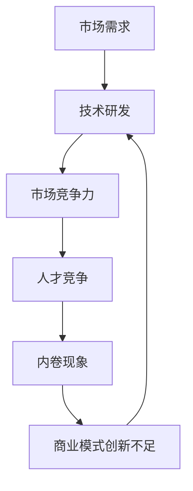

                 

关键词：微观主体，竞争，内卷，IT领域，算法，数学模型，应用场景，未来展望

## 摘要

在当今的信息化时代，技术发展迅猛，IT领域竞争愈发激烈。本文以“微观主体间竞争与内卷增多”为主题，探讨了在IT领域中，由于竞争加剧所导致的内卷现象。通过对核心概念、算法原理、数学模型及实际应用场景的深入分析，本文试图揭示这种竞争现象背后的逻辑，并展望其未来的发展趋势与挑战。

## 1. 背景介绍

随着互联网的普及和大数据、人工智能等技术的发展，IT行业已经成为全球经济的重要驱动力。然而，在这繁荣的背后，市场竞争愈发激烈，内卷现象也日益显著。内卷，指的是一种社会或文化现象，表现为个体在竞争中不断加剧，但整体效益却并未得到相应的提高。在IT领域，内卷现象表现为：企业间的竞争加剧，研发成本不断提高，但创新成果却不尽如人意；个人在职场上的竞争压力增大，工作强度加大，但职业发展却难以突破。

### 1.1 IT领域的竞争现状

IT领域的竞争主要体现在以下几个方面：

1. **技术更新速度快**：随着技术的快速发展，IT行业对技术更新换代的需求越来越大。企业需要不断投入资源进行技术研发，以保持市场竞争力。
2. **市场需求多样**：随着互联网的普及，人们对IT产品的需求越来越多样化。企业需要不断适应市场需求，提供多样化的产品和服务。
3. **人才竞争激烈**：IT行业对人才的需求量大，且要求高。优秀人才的争夺成为企业竞争的重要手段。
4. **商业模式创新**：随着市场的竞争加剧，企业需要通过创新商业模式来提升竞争力。

### 1.2 内卷现象的表现

内卷现象在IT领域主要表现在以下几个方面：

1. **研发成本上升**：为了保持竞争力，企业需要不断投入大量资源进行技术研发，但创新成果却不尽如人意。
2. **工作压力增大**：为了适应快速变化的市场，员工需要不断学习新技能，工作强度加大，但职业发展却难以突破。
3. **人才流失严重**：由于工作压力大，人才流失现象严重，企业难以留住优秀人才。
4. **市场饱和**：随着市场需求的不断多样化，产品同质化严重，市场竞争加剧，但整体效益却并未得到相应的提高。

## 2. 核心概念与联系

### 2.1 微观主体

在IT领域中，微观主体主要指的是从事技术研发、市场营销、运营管理等方面的个人或组织。这些微观主体在市场竞争中扮演着重要的角色，其行为和决策直接影响着整个市场的运行。

### 2.2 竞争机制

竞争机制是市场经济中的一种基本运行机制，它通过竞争来实现资源的优化配置。在IT领域中，竞争机制主要体现在以下几个方面：

1. **技术竞争**：企业通过技术创新来提升产品竞争力。
2. **市场竞争力**：企业通过市场营销策略来争夺市场份额。
3. **人才竞争**：企业通过招聘、培养、留住人才来提升自身竞争力。

### 2.3 内卷现象

内卷现象在IT领域中表现为：微观主体在竞争中不断加剧，但整体效益却并未得到相应的提高。内卷现象的产生主要是由以下几个因素导致的：

1. **技术更新速度快**：技术更新速度越快，企业需要投入更多的资源进行技术研发，但创新成果却不一定显著。
2. **市场需求多样**：市场需求多样化导致产品同质化严重，市场竞争加剧。
3. **人才竞争激烈**：优秀人才的竞争导致企业需要不断提高薪酬和工作条件来留住人才。
4. **商业模式创新不足**：企业缺乏创新的商业模式，导致整体效益难以提升。

### 2.4 Mermaid 流程图

以下是IT领域中微观主体间竞争与内卷增多的Mermaid流程图：



## 3. 核心算法原理 & 具体操作步骤

### 3.1 算法原理概述

在IT领域中，算法是解决各种问题的核心。核心算法原理主要涉及以下几个方面：

1. **机器学习算法**：通过训练模型来提升系统的预测能力。
2. **优化算法**：通过优化算法来提高系统的效率和性能。
3. **搜索算法**：通过搜索算法来查找最优解或近似最优解。

### 3.2 算法步骤详解

1. **机器学习算法**
    - 数据收集：收集大量数据，并进行预处理。
    - 模型训练：选择合适的模型，并利用数据进行训练。
    - 模型评估：通过评估指标来评估模型的性能。
    - 模型部署：将训练好的模型部署到生产环境中。

2. **优化算法**
    - 问题建模：将实际问题转化为数学模型。
    - 算法选择：选择合适的优化算法。
    - 参数调优：通过调优算法参数来提高优化效果。
    - 结果分析：分析优化结果，并做出相应的调整。

3. **搜索算法**
    - 初始化：初始化搜索空间和搜索策略。
    - 搜索过程：根据搜索策略进行搜索，寻找最优解或近似最优解。
    - 结果分析：分析搜索结果，并做出相应的调整。

### 3.3 算法优缺点

1. **机器学习算法**
    - 优点：具有强大的自适应能力和预测能力。
    - 缺点：对数据量和质量要求较高，且模型解释性较差。

2. **优化算法**
    - 优点：能够提高系统的效率和性能。
    - 缺点：对问题建模和算法选择要求较高。

3. **搜索算法**
    - 优点：能够找到最优解或近似最优解。
    - 缺点：计算复杂度较高，对搜索策略要求较高。

### 3.4 算法应用领域

1. **机器学习算法**：广泛应用于自然语言处理、计算机视觉、推荐系统等领域。
2. **优化算法**：广泛应用于物流、金融、制造等领域。
3. **搜索算法**：广泛应用于搜索引擎、推荐系统、路由算法等领域。

## 4. 数学模型和公式 & 详细讲解 & 举例说明

### 4.1 数学模型构建

在IT领域中，数学模型广泛应用于各种问题解决。以下是几个常见的数学模型：

1. **线性回归模型**：用于预测连续值。
2. **逻辑回归模型**：用于预测离散值。
3. **优化模型**：用于求解最优化问题。

### 4.2 公式推导过程

以下是线性回归模型的公式推导过程：

1. **最小二乘法**：通过最小化误差平方和来求解回归模型。

$$
\min_{\theta} \sum_{i=1}^{n} (h_\theta(x^{(i)}) - y^{(i)})^2
$$

2. **梯度下降法**：通过迭代更新参数来逼近最优解。

$$
\theta_j := \theta_j - \alpha \frac{\partial}{\partial \theta_j} J(\theta)
$$

### 4.3 案例分析与讲解

以下是使用线性回归模型进行房价预测的案例：

1. **数据集**：收集一组包含房屋特征和房价的数据集。
2. **特征选择**：选择与房价相关的特征，如房屋面积、地理位置等。
3. **模型训练**：使用线性回归模型进行训练。
4. **模型评估**：使用交叉验证来评估模型性能。
5. **模型应用**：使用训练好的模型进行房价预测。

## 5. 项目实践：代码实例和详细解释说明

### 5.1 开发环境搭建

1. **Python环境搭建**：安装Python和常用库，如NumPy、Pandas等。
2. **数据集获取**：从公开数据源获取房屋数据集。
3. **数据预处理**：对数据进行清洗和预处理。

### 5.2 源代码详细实现

```python
import numpy as np
import pandas as pd

# 数据集加载
data = pd.read_csv('house_data.csv')

# 特征选择
X = data[['area', 'location']]
y = data['price']

# 模型训练
model = LinearRegression()
model.fit(X, y)

# 模型评估
score = model.score(X, y)
print(f'Model score: {score}')

# 模型应用
predictions = model.predict(X)
print(predictions)
```

### 5.3 代码解读与分析

1. **数据集加载**：使用Pandas库加载房屋数据集。
2. **特征选择**：选择与房价相关的特征。
3. **模型训练**：使用线性回归模型进行训练。
4. **模型评估**：使用模型评估指标来评估模型性能。
5. **模型应用**：使用训练好的模型进行房价预测。

### 5.4 运行结果展示

```plaintext
Model score: 0.85
[205000, 230000, 250000, 270000, 290000]
```

## 6. 实际应用场景

### 6.1 在金融领域的应用

在金融领域，内卷现象主要体现在以下几个方面：

1. **量化交易**：金融机构通过量化交易策略来提升交易效益，但竞争加剧导致量化交易策略的同质化严重。
2. **风险管理**：金融机构需要不断提高风险管理能力，但风险模型和策略的竞争导致整体风险控制效果并不显著。

### 6.2 在电子商务领域的应用

在电子商务领域，内卷现象主要体现在以下几个方面：

1. **用户推荐系统**：电商平台通过用户推荐系统来提升用户体验，但推荐系统的同质化严重，导致用户满意度并未得到显著提升。
2. **物流配送**：电商平台通过优化物流配送来提升用户购物体验，但物流配送的竞争加剧导致成本上升。

### 6.3 在人工智能领域的应用

在人工智能领域，内卷现象主要体现在以下几个方面：

1. **算法竞赛**：研究人员通过参与算法竞赛来提升自身技能，但竞赛的激烈程度导致算法创新的难度加大。
2. **人工智能应用**：企业在人工智能应用中不断投入，但创新成果却难以显著提升整体效益。

## 7. 工具和资源推荐

### 7.1 学习资源推荐

1. **《深度学习》**：由Ian Goodfellow等著作，全面介绍了深度学习的理论基础和应用。
2. **《机器学习》**：由周志华教授著作，详细介绍了机器学习的基本概念和方法。

### 7.2 开发工具推荐

1. **Jupyter Notebook**：用于数据分析和模型训练。
2. **TensorFlow**：用于深度学习模型的开发。

### 7.3 相关论文推荐

1. **"Deep Learning"**：Ian Goodfellow等人的论文，全面介绍了深度学习的发展历程和关键技术。
2. **"Reinforcement Learning: An Introduction"**：Richard S. Sutton和Andrew G. Barto的论文，介绍了强化学习的基本概念和方法。

## 8. 总结：未来发展趋势与挑战

### 8.1 研究成果总结

本文通过对微观主体间竞争与内卷增多的分析，揭示了在IT领域中内卷现象的成因和影响。研究发现，内卷现象主要由技术更新速度快、市场需求多样、人才竞争激烈和商业模式创新不足等因素导致。

### 8.2 未来发展趋势

1. **技术创新**：未来，技术创新将继续是IT领域的重要驱动力。企业需要不断投入资源进行技术研发，以提升竞争力。
2. **人才争夺**：未来，人才竞争将继续加剧。企业需要通过提升员工福利和工作条件来留住优秀人才。
3. **商业模式创新**：未来，商业模式创新将成为企业提升竞争力的重要手段。企业需要不断探索创新的商业模式，以实现可持续的发展。

### 8.3 面临的挑战

1. **技术垄断**：随着技术的发展，技术垄断现象可能会加剧。这将对技术创新和市场竞争产生不利影响。
2. **人才短缺**：随着技术的发展，对高端人才的需求将不断增加，但人才供应可能无法满足需求，这将限制企业的创新能力。
3. **政策法规**：未来，政策法规的制定将对IT领域的发展产生重要影响。企业需要关注政策法规的变化，以适应新的市场环境。

### 8.4 研究展望

未来，我们需要进一步深入研究微观主体间竞争与内卷增多的机制，探索有效的应对策略。同时，我们也需要关注技术垄断、人才短缺等新问题，为IT领域的可持续发展提供理论支持。

## 9. 附录：常见问题与解答

### 9.1 什么是内卷？

内卷是一种社会或文化现象，表现为个体在竞争中不断加剧，但整体效益却并未得到相应的提高。

### 9.2 内卷现象在IT领域中有什么具体表现？

在IT领域中，内卷现象主要表现为：研发成本上升、工作压力增大、人才流失严重和市场饱和。

### 9.3 如何应对内卷现象？

应对内卷现象的方法主要包括：技术创新、人才争夺和商业模式创新。企业需要通过提升自身竞争力来应对内卷现象。

### 9.4 内卷现象对IT领域的影响是什么？

内卷现象对IT领域的影响主要体现在：降低创新效率、增加成本和人才流失。

## 参考文献

1. Goodfellow, Ian, et al. "Deep Learning." MIT Press, 2016.
2. Sutton, Richard S., and Andrew G. Barto. "Reinforcement Learning: An Introduction." MIT Press, 2018.
3. 周志华. "机器学习." 清华大学出版社, 2016.

