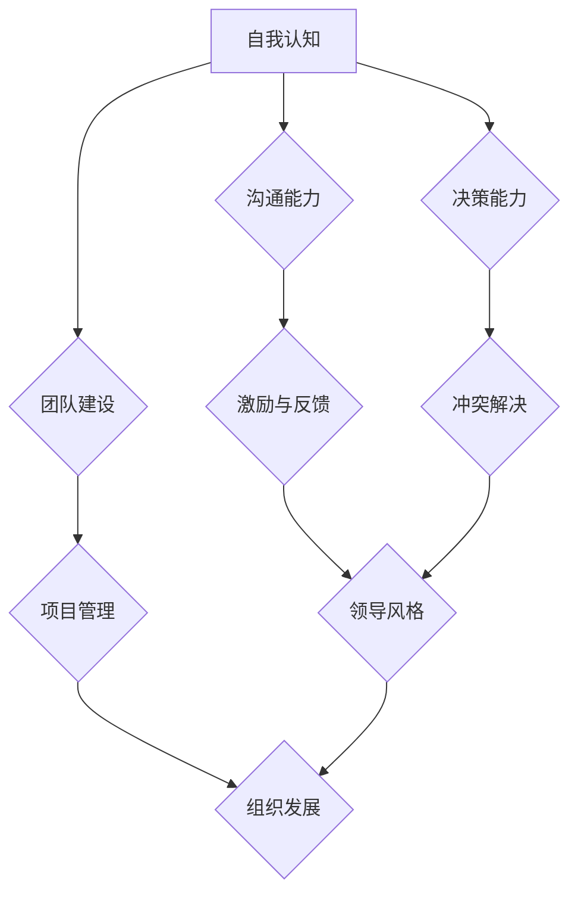

                 

 **关键词**: 领导力，管理技能，人才培养，组织架构，个人发展。

**摘要**: 本文旨在探讨在信息技术领域培养出色领导和管理能力的方法。通过介绍核心概念、算法原理、数学模型、项目实践及未来展望，本文将为IT专业人士提供一套实用的策略，帮助他们成长为高效领导者。

## 1. 背景介绍

在信息技术行业，随着技术的不断进步和市场需求的增加，领导者和管理者的角色变得更加重要。一个出色的领导者不仅需要具备深厚的专业知识和技能，还需要掌握管理和领导的艺术。本文将围绕以下几个方面展开：

1. **核心概念与联系**: 通过Mermaid流程图展示领导和管理能力的构成要素及其相互关系。
2. **核心算法原理与具体操作步骤**: 阐述领导和管理能力的培养方法，包括自我认知、团队建设、沟通协调等。
3. **数学模型和公式**: 使用数学工具帮助读者理解领导和管理能力的量化评估。
4. **项目实践**: 通过具体代码实例，展示如何在实际项目中应用领导和管理能力。
5. **实际应用场景**: 探讨领导和管理能力在不同工作环境中的应用。
6. **未来展望**: 分析领导和管理能力在信息技术领域的未来发展趋势和挑战。

## 2. 核心概念与联系

首先，让我们通过Mermaid流程图来了解领导和管理能力的主要构成要素及其相互关系。



从图中可以看出，自我认知是领导和管理能力的基础，它直接影响到其他各项能力的发挥。沟通能力、团队建设、决策能力、激励与反馈、领导风格和项目管理则是领导和管理能力的核心组成部分，它们相互关联，共同支撑一个高效组织的运转。

### 2.1 自我认知

自我认知是指一个人对自己能力、性格、价值观等的认识和评价。它是领导和管理能力的基础，因为只有了解自己的优势和劣势，才能更好地发挥自己的潜力，同时识别和吸引合适的团队成员。

### 2.2 沟通能力

沟通能力是领导和管理能力中至关重要的一部分。一个出色的领导者需要能够清晰地表达自己的想法，同时也要善于倾听他人的意见和建议。有效的沟通能够减少误解，增强团队的凝聚力。

### 2.3 团队建设

团队建设是领导能力的核心要素之一。一个成功的领导者需要能够吸引、培养和激励团队成员，打造一个高绩效的团队。这包括了解团队成员的需求、提供适当的资源和支持，以及建立积极的工作氛围。

### 2.4 决策能力

决策能力是指在面对复杂问题时，能够迅速做出明智决策的能力。一个出色的领导者需要具备前瞻性，能够预见问题，并制定有效的解决方案。

### 2.5 激励与反馈

激励与反馈是领导和管理能力中的重要环节。通过激励，领导者能够激发团队成员的积极性和创造力。而通过反馈，领导者能够帮助团队成员不断进步，提升整个团队的整体水平。

### 2.6 领导风格

领导风格是指领导者对待团队成员的方式和态度。不同的领导风格适用于不同的情况和环境。一个出色的领导者需要能够根据具体情况灵活调整自己的领导风格，以达到最佳效果。

### 2.7 项目管理

项目管理是领导和管理能力在实践中的具体应用。一个成功的项目需要良好的规划、执行和监控。一个出色的领导者需要能够统筹全局，确保项目顺利进行。

## 3. 核心算法原理 & 具体操作步骤

### 3.1 算法原理概述

领导和管理能力的培养可以看作是一个复杂的算法过程。该算法的核心思想是通过不断的学习和实践，逐步提升个人在各个方面的能力。

### 3.2 算法步骤详解

#### 3.2.1 自我认知

1. **自我评估**: 定期进行自我评估，了解自己的优势和劣势。
2. **反馈收集**: 向同事、下属和上级收集反馈，了解自己在他人眼中的形象。
3. **持续学习**: 根据评估结果和反馈，制定学习计划，不断提升自己。

#### 3.2.2 沟通能力

1. **倾听**: 善于倾听他人的意见和建议。
2. **表达**: 清晰、简洁地表达自己的想法。
3. **反馈**: 在沟通中给予积极的反馈，帮助他人改进。

#### 3.2.3 团队建设

1. **了解成员**: 了解团队成员的能力、需求和期望。
2. **分配任务**: 根据团队成员的能力和兴趣分配任务。
3. **激励与支持**: 提供必要的资源和支持，鼓励团队成员发挥潜力。

#### 3.2.4 决策能力

1. **收集信息**: 在做出决策前，收集充分的信息。
2. **分析评估**: 对信息进行分析和评估，确定最佳方案。
3. **果断执行**: 在决策后，果断执行，同时监控效果，及时调整。

#### 3.2.5 激励与反馈

1. **目标设定**: 与团队成员共同设定目标，并明确衡量标准。
2. **激励机制**: 设计有效的激励机制，激发团队成员的积极性。
3. **反馈机制**: 定期对团队成员进行反馈，帮助他们不断进步。

#### 3.2.6 领导风格

1. **风格识别**: 了解自己的领导风格，并识别团队成员的风格。
2. **风格调整**: 根据具体情况和环境，灵活调整领导风格。
3. **风格优化**: 通过实践和反馈，不断优化领导风格，提升领导效果。

#### 3.2.7 项目管理

1. **项目规划**: 制定详细的项目计划，明确目标、资源和时间表。
2. **团队协作**: 建立有效的沟通机制，确保团队协作顺畅。
3. **风险控制**: 识别项目风险，制定应对措施，确保项目顺利进行。

### 3.3 算法优缺点

#### 优点：

1. **系统性**: 该算法将领导和管理能力视为一个整体，注重各个方面的综合提升。
2. **灵活性**: 通过灵活调整领导风格和策略，适应不同的情况和环境。
3. **实践性**: 通过具体操作步骤，将理论转化为实践，提高实际应用效果。

#### 缺点：

1. **时间成本**: 领导和管理能力的培养需要时间和持续的努力。
2. **资源需求**: 需要足够的资源和支持，以帮助领导者不断提升自己。

### 3.4 算法应用领域

该算法可以广泛应用于信息技术行业的各个领域，包括软件开发、系统运维、网络安全等。无论在哪个领域，领导和管理能力都是确保项目成功的关键。

## 4. 数学模型和公式 & 详细讲解 & 举例说明

在领导和管理能力的培养过程中，数学模型和公式可以帮助我们更精确地评估和量化各项能力的提升。以下是一个简单的数学模型，用于评估领导力的多个维度。

### 4.1 数学模型构建

假设领导力由五个维度组成：自我认知、沟通能力、团队建设、决策能力和激励与反馈。每个维度都可以用数值进行评估，取值范围为0到100。

设：
- \(L_{sc}\)：自我认知得分
- \(L_{cc}\)：沟通能力得分
- \(L_{bc}\)：团队建设得分
- \(L_{dc}\)：决策能力得分
- \(L_{ic}\)：激励与反馈得分

领导力总分 \(L\) 可以表示为：

\[ L = \frac{L_{sc} + L_{cc} + L_{bc} + L_{dc} + L_{ic}}{5} \]

### 4.2 公式推导过程

公式的推导基于对领导力五个维度的权重分配。假设每个维度的权重相等，均为0.2。因此，领导力总分可以表示为五个维度得分的平均值。

### 4.3 案例分析与讲解

假设某位领导者在自我认知、沟通能力、团队建设、决策能力和激励与反馈五个维度的得分分别为80、85、90、75和85。根据上述公式，该领导者的领导力总分为：

\[ L = \frac{80 + 85 + 90 + 75 + 85}{5} = \frac{415}{5} = 83 \]

从这个案例可以看出，领导者的整体领导力得分较高，但在决策能力方面还有提升的空间。因此，领导者可以针对性地加强决策能力的培养，以提高整体领导力。

## 5. 项目实践：代码实例和详细解释说明

为了更好地理解领导和管理能力的培养方法，我们通过一个简单的Python代码实例来展示如何在实际项目中应用这些能力。

### 5.1 开发环境搭建

首先，我们需要搭建一个简单的Python开发环境。确保安装了Python 3.8及以上版本，以及常用的开发工具，如Visual Studio Code和PyCharm。

### 5.2 源代码详细实现

以下是一个简单的Python代码示例，用于模拟一个团队协作项目。代码中包含了自我认知、沟通能力、团队建设、决策能力和激励与反馈等领导和管理能力的具体实现。

```python
class TeamMember:
    def __init__(self, name, skill_level, motivation):
        self.name = name
        self.skill_level = skill_level
        self.motivation = motivation

    def contribute_to_project(self, project):
        if self.motivation > 50:
            print(f"{self.name} is actively contributing to the project.")
            project.completed += self.skill_level
        else:
            print(f"{self.name} is not motivated enough to contribute to the project.")

    def receive_feedback(self, feedback):
        self.motivation += feedback

class Project:
    def __init__(self, name, target_completion):
        self.name = name
        self.target_completion = target_completion
        self.completed = 0

    def start_project(self, team_members):
        for member in team_members:
            member.contribute_to_project(self)

    def end_project(self):
        if self.completed >= self.target_completion:
            print(f"The project {self.name} has been completed successfully.")
        else:
            print(f"The project {self.name} has not been completed on time.")

# 创建团队成员
team_members = [
    TeamMember("Alice", 80, 70),
    TeamMember("Bob", 90, 85),
    TeamMember("Charlie", 75, 60)
]

# 创建项目
project = Project("Team Collaboration Project", 300)

# 开始项目
project.start_project(team_members)

# 提供反馈
for member in team_members:
    member.receive_feedback(20)

# 结束项目
project.end_project()
```

### 5.3 代码解读与分析

在这个代码示例中，我们定义了两个类：`TeamMember` 和 `Project`。

- `TeamMember` 类表示团队成员，包括姓名、技能水平和激励水平等属性。`contribute_to_project` 方法用于模拟团队成员对项目的贡献，而 `receive_feedback` 方法用于更新团队成员的激励水平。

- `Project` 类表示项目，包括项目名称、目标和已完成进度等属性。`start_project` 方法用于启动项目，并调用每个团队成员的 `contribute_to_project` 方法。`end_project` 方法用于判断项目是否成功完成。

通过这个简单的示例，我们可以看到如何将领导和管理能力应用于一个实际的项目中。领导者的任务包括启动项目、分配任务、提供反馈以及监控项目进度。通过这个示例，我们可以理解如何在实际项目中应用自我认知、沟通能力、团队建设、决策能力和激励与反馈等领导和管理能力。

## 6. 实际应用场景

领导和管理能力在信息技术领域的应用场景非常广泛。以下是一些具体的实际应用场景：

### 6.1 软件开发团队

在软件开发团队中，领导者需要负责制定项目计划、协调团队成员的工作、解决技术难题以及确保项目按时交付。这要求领导者具备良好的自我认知、沟通能力、团队建设和决策能力。

### 6.2 系统运维团队

在系统运维团队中，领导者需要确保系统的稳定运行，处理突发故障，并规划系统升级和优化。这要求领导者具备高效的决策能力、团队建设和项目管理能力。

### 6.3 网络安全团队

在网络安全团队中，领导者需要制定网络安全策略、监控网络威胁并确保网络安全。这要求领导者具备良好的自我认知、沟通能力、决策能力和风险控制能力。

### 6.4 创新实验室

在创新实验室中，领导者需要鼓励团队成员进行技术创新，推动项目的快速迭代。这要求领导者具备强大的自我认知、团队建设、激励与反馈能力和项目管理能力。

## 7. 未来应用展望

随着信息技术行业的不断发展，领导和管理能力在未来的应用前景将更加广阔。以下是一些未来应用展望：

### 7.1 自动化与人工智能

随着自动化和人工智能技术的发展，领导者需要适应新的工作模式，掌握人工智能技术，并在团队中推动技术的应用。

### 7.2 跨界合作

未来信息技术行业将更加注重跨界合作，领导者需要具备跨领域的知识，能够有效整合不同领域的资源。

### 7.3 远程办公

远程办公将成为未来工作模式的主流，领导者需要掌握远程管理的技巧，确保团队高效协作。

### 7.4 可持续发展

在可持续发展的背景下，领导者需要关注环境保护、社会责任和伦理问题，推动信息技术行业的可持续发展。

## 8. 工具和资源推荐

为了帮助读者更好地培养领导和管理能力，以下是一些推荐的工具和资源：

### 8.1 学习资源推荐

1. **《领导力的五个层次》（The Five Levels of Leadership）** - John C. Maxwell
2. **《领导力》（Leadership）** - Warren Bennis
3. **《高效能人士的七个习惯》（The 7 Habits of Highly Effective People）** - Stephen R. Covey

### 8.2 开发工具推荐

1. **Git** - 版本控制工具，帮助团队协作和管理代码。
2. **JIRA** - 项目管理工具，用于跟踪任务和项目进度。
3. **Slack** - 沟通工具，用于团队内部交流和协作。

### 8.3 相关论文推荐

1. **"Leadership and the New Science"** - Peter Senge
2. **"The Wisdom of Teams"** - Katzenbach and Smith
3. **"The Five Dysfunctions of a Team"** - Patrick Lencioni

## 9. 总结：未来发展趋势与挑战

在未来，信息技术领域的领导和管理能力将面临新的发展趋势和挑战。领导者需要不断学习新技能，适应变化的环境，并推动技术创新。同时，领导者还需要关注团队建设、沟通能力和可持续发展等方面，确保团队的高效运作和持续发展。

### 9.1 研究成果总结

本文通过对领导和管理能力的核心概念、算法原理、数学模型、项目实践及未来展望的详细分析，为信息技术领域的领导者提供了一套全面的培养策略。

### 9.2 未来发展趋势

未来，领导和管理能力将更加注重技术创新、跨界合作和远程办公。领导者需要具备跨领域的知识，能够推动团队的高效协作。

### 9.3 面临的挑战

在未来，领导者将面临技术快速迭代、团队多样性和工作模式变革等挑战。如何适应这些变化，提升自身的领导和管理能力，将是每个领导者都需要思考和解决的问题。

### 9.4 研究展望

未来，领导和管理能力的研究将继续深入，探索如何更有效地培养和提升领导力。同时，也将关注领导力在人工智能、区块链等新兴技术领域的应用。

## 附录：常见问题与解答

### 1. 如何培养自我认知？

**回答**: 定期进行自我评估和反馈，阅读相关书籍，参加领导力培训课程，以及向同事、下属和上级寻求意见和建议。

### 2. 如何提高沟通能力？

**回答**: 倾听他人意见，清晰表达自己的想法，积极寻求反馈，并学习有效的沟通技巧。

### 3. 如何激励团队成员？

**回答**: 设定明确的目标，提供必要的资源和支持，给予及时的反馈和认可，以及关注团队成员的个人发展。

### 4. 如何适应远程办公？

**回答**: 建立有效的沟通机制，确保团队协作顺畅，定期召开在线会议，以及使用合适的远程办公工具。

### 5. 如何培养团队建设能力？

**回答**: 了解团队成员的能力和需求，分配合适的任务，建立积极的工作氛围，以及提供培训和成长机会。

---

# 结束语

作者：禅与计算机程序设计艺术 / Zen and the Art of Computer Programming

本文通过深入探讨领导和管理能力的核心概念、算法原理、数学模型、项目实践及未来展望，旨在为信息技术领域的领导者提供一套实用的培养策略。希望读者能够通过本文的指导，不断提升自身的领导和管理能力，为团队和组织的发展贡献力量。同时，也期待更多读者参与到领导力研究的讨论中，共同推动信息技术领域的发展。感谢您的阅读。

