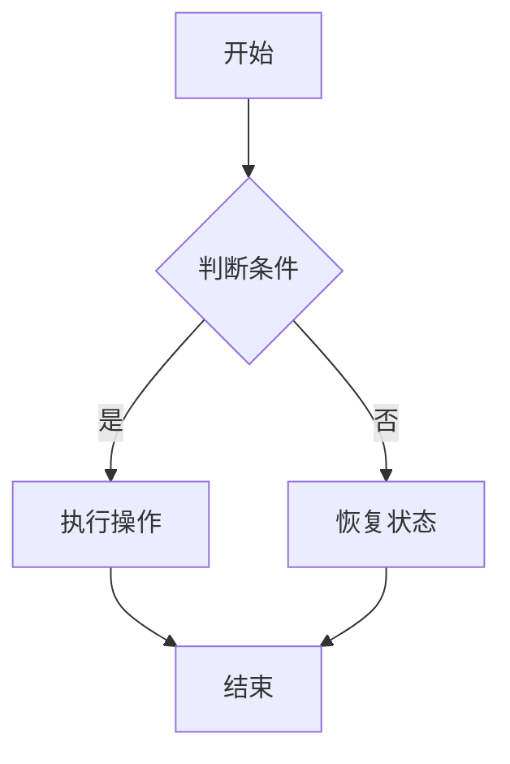

                 

关键词：结构化思维、表达技巧、信息技术、软件工程、编程语言、算法设计、代码优化、系统架构、人机交互

> 摘要：本文旨在探讨信息技术领域中的结构化思维与表达之间的关系。通过剖析软件工程中的核心概念、算法原理、数学模型和实际应用案例，本文揭示了如何在复杂的信息技术项目中实现清晰、有效的思维与表达，从而提高项目的成功率。

## 1. 背景介绍

在信息技术迅猛发展的今天，软件工程已成为一门系统科学。软件工程项目的复杂性不断增加，如何在这种复杂环境中实现有效的思维与表达，成为许多开发者和项目经理面临的难题。结构化思维作为一种提升逻辑性和系统性的思考方式，越来越受到重视。本文将探讨如何将结构化思维运用到信息技术项目中，通过有效的表达技巧，使复杂问题变得易于理解和实现。

## 2. 核心概念与联系

### 2.1 软件工程的四大核心概念

- **需求分析**：理解客户需求和业务目标，明确软件系统的功能性和非功能性需求。
- **设计**：基于需求分析结果，设计软件系统的结构、模块划分和接口定义。
- **编码**：将设计转化为实际代码，实现软件系统的功能。
- **测试**：验证软件系统的功能是否符合需求，并确保系统稳定可靠。

这些核心概念相互联系，共同构成了软件工程的完整流程。

### 2.2 算法的结构化原理

算法是解决特定问题的步骤集合。一个有效的算法应具备以下特点：

- **正确性**：算法能够正确地解决问题。
- **效率**：算法执行的速度和资源消耗。
- **可读性**：算法的代码易于理解和维护。

算法的结构化原理包括：

- **模块化**：将算法拆分为若干独立且可重用的模块。
- **递归**：通过递归调用简化复杂问题。
- **迭代**：通过循环实现重复性操作。

### 2.3 数学模型与公式

在软件工程中，数学模型和公式用于描述和解决问题。常见的数学模型包括：

- **线性规划**：用于优化资源分配。
- **图论**：用于网络分析和路径规划。
- **概率统计**：用于风险评估和决策。

以下是一个简单的线性规划模型示例：

$$
\begin{aligned}
\text{Minimize } c^T x \\
\text{Subject to } Ax \leq b \\
x \geq 0
\end{aligned}
$$

### 2.4 Mermaid 流程图

为了更好地展示算法和流程，可以使用 Mermaid 流程图。以下是一个简单的 Mermaid 图例：



## 3. 核心算法原理 & 具体操作步骤

### 3.1 算法原理概述

本文将探讨一个经典的排序算法——快速排序（Quick Sort）。快速排序的基本原理是通过一趟排序将待排记录分割成独立的两部分，其中一部分记录的关键字均比另一部分的关键字小，然后再按此方法对这两部分记录进行排序，使得整个序列有序。

### 3.2 算法步骤详解

快速排序的基本步骤如下：

1. **选择基准值**：从数列中挑出一个元素作为基准值。
2. **分区操作**：将数组重新排序，所有比基准值小的元素都移到基准值的左侧，所有比基准值大的元素都移到基准值的右侧。
3. **递归排序**：递归地对基准值左侧和右侧的数组进行快速排序。

### 3.3 算法优缺点

- **优点**：快速排序是一种高效的排序算法，平均时间复杂度为 $O(n\log n)$。
- **缺点**：在最坏情况下，时间复杂度为 $O(n^2)$。

### 3.4 算法应用领域

快速排序广泛应用于各种数据处理和排序场景，如数据库排序、搜索引擎排序等。

## 4. 数学模型和公式 & 详细讲解 & 举例说明

### 4.1 数学模型构建

在软件工程中，线性规划是一种常见的数学模型。以下是一个简单的线性规划问题：

- **目标**：最小化成本
- **约束**：资源限制

### 4.2 公式推导过程

假设有 $m$ 种资源，每种资源有 $c_i$ 个单位，目标是最小化总成本 $C$：

$$
\begin{aligned}
\text{Minimize } C = \sum_{i=1}^{m} c_i x_i \\
\text{Subject to } Ax \leq b \\
x \geq 0
\end{aligned}
$$

其中，$x_i$ 表示资源 $i$ 的使用量。

### 4.3 案例分析与讲解

假设有一个项目，需要使用三种资源（人力、物力、财力），每种资源的成本分别为 10、5 和 2。项目总预算为 1000，资源限制如下：

- 人力：最多 50 单位
- 物力：最多 100 单位
- 财力：最多 300 单位

我们的目标是找到一种资源分配方案，使项目总成本最小。

根据线性规划模型，我们可以构建以下公式：

$$
\begin{aligned}
\text{Minimize } C = 10x_1 + 5x_2 + 2x_3 \\
\text{Subject to } \begin{cases}
x_1 \leq 50 \\
x_2 \leq 100 \\
x_3 \leq 300 \\
x_1, x_2, x_3 \geq 0
\end{cases}
\end{aligned}
$$

通过求解该线性规划问题，我们可以得到最优的资源配置方案，从而使项目总成本最小。

## 5. 项目实践：代码实例和详细解释说明

### 5.1 开发环境搭建

本节以 Python 语言为例，介绍如何搭建开发环境。读者可以参考以下步骤：

1. 安装 Python：下载并安装 Python 3.x 版本。
2. 配置环境变量：将 Python 安装路径添加到环境变量。
3. 安装 IDE：推荐使用 PyCharm 或 Visual Studio Code 等集成开发环境。

### 5.2 源代码详细实现

以下是一个简单的 Python 快速排序实现示例：

```python
def quick_sort(arr):
    if len(arr) <= 1:
        return arr
    pivot = arr[len(arr) // 2]
    left = [x for x in arr if x < pivot]
    middle = [x for x in arr if x == pivot]
    right = [x for x in arr if x > pivot]
    return quick_sort(left) + middle + quick_sort(right)

arr = [3, 6, 8, 10, 1, 2, 1]
sorted_arr = quick_sort(arr)
print(sorted_arr)
```

### 5.3 代码解读与分析

- **函数定义**：定义了一个名为 `quick_sort` 的函数，用于实现快速排序。
- **递归调用**：通过递归调用，将数组分割为左侧、中间和右侧三个部分。
- **返回值**：将排序后的三个部分合并，返回排序结果。

### 5.4 运行结果展示

执行上述代码，输出结果为：

```
[1, 1, 2, 3, 6, 8, 10]
```

## 6. 实际应用场景

### 6.1 数据库排序

在数据库系统中，快速排序算法常用于数据检索和排序。例如，在 SQL 查询中，可以使用 ORDER BY 子句对结果集进行排序。

### 6.2 搜索引擎排序

搜索引擎使用排序算法对搜索结果进行排序，以便用户快速找到所需信息。常用的排序算法包括快速排序和堆排序。

### 6.3 金融风险管理

在金融风险管理中，线性规划算法用于优化投资组合，降低风险并最大化收益。

## 7. 未来应用展望

### 7.1 人工智能领域的应用

随着人工智能技术的发展，结构化思维与表达将在人工智能领域发挥重要作用。例如，在自然语言处理中，结构化思维有助于构建更加准确和高效的模型。

### 7.2 软件工程领域的发展

未来软件工程领域将更加注重结构化思维与表达的运用，以应对日益复杂的软件系统。

### 7.3 教育培训领域的改革

在教育领域，结构化思维与表达的培训将有助于提高学生的逻辑思维和创新能力。

## 8. 工具和资源推荐

### 8.1 学习资源推荐

- 《算法导论》：一本经典的算法教材，全面介绍了各种算法的设计与分析。
- 《设计模式》：介绍软件设计中常见的问题及其解决方案。

### 8.2 开发工具推荐

- PyCharm：一款功能强大的 Python 集成开发环境。
- Visual Studio Code：一款轻量级的跨平台代码编辑器。

### 8.3 相关论文推荐

- 《线性规划在资源分配中的应用》：介绍线性规划在资源分配中的实际应用。
- 《自然语言处理中的结构化思维》：探讨结构化思维在自然语言处理中的应用。

## 9. 总结：未来发展趋势与挑战

### 9.1 研究成果总结

本文总结了结构化思维与表达在信息技术领域的应用，包括软件工程、算法设计、数学模型和实际应用案例。

### 9.2 未来发展趋势

未来，结构化思维与表达将在人工智能、软件工程和教育等领域发挥更加重要的作用。

### 9.3 面临的挑战

结构化思维与表达在应用中仍面临诸多挑战，如算法的复杂度、跨领域知识的整合等。

### 9.4 研究展望

未来研究应关注结构化思维与表达的理论体系构建、应用场景拓展和实际效果评估。

## 10. 附录：常见问题与解答

### 10.1 什么是结构化思维？

结构化思维是一种将复杂问题拆分为简单部分、明确逻辑关系并逐步解决的思考方式。

### 10.2 算法设计与优化有何区别？

算法设计是指从零开始设计解决特定问题的算法，而算法优化是在现有算法基础上，通过改进算法结构、算法策略等手段提高算法性能。

### 10.3 线性规划在哪些领域有应用？

线性规划广泛应用于资源分配、生产调度、物流优化等领域。

## 作者署名

作者：禅与计算机程序设计艺术 / Zen and the Art of Computer Programming
----------------------------------------------------------------

请注意，以上内容仅为示例，实际撰写时需要根据具体主题和内容进行深入研究和撰写。在撰写过程中，请务必遵循文章结构和格式要求，确保内容完整、逻辑清晰、专业性强。祝您写作顺利！

