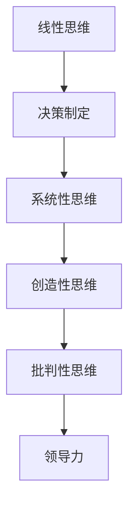

                 

思维模式对领导力的影响是一个备受关注的课题，尤其是在快速变化的现代信息技术领域。领导者的思维模式决定了他们如何理解问题、制定策略、做出决策和引导团队。这篇文章将深入探讨不同思维模式如何影响领导力，并提供一些实用的建议，帮助领导者提升自己的思维模式，从而更好地应对挑战。

## 关键词

- 思维模式
- 领导力
- 信息技术
- 决策制定
- 团队管理
- 创新思维

## 摘要

本文旨在揭示思维模式在领导力中的关键作用。通过分析不同的思维模式，如线性思维、系统性思维、创造性思维和批判性思维，文章探讨了这些模式如何影响领导者的决策、团队沟通和创新能力。文章还提供了一些实用的策略和工具，帮助领导者识别并发展适合自己的思维模式，以提升领导效果。

## 1. 背景介绍

在现代信息技术领域，变化是永恒的主题。技术进步、市场需求、竞争环境等方面都在快速演变，这对领导者提出了更高的要求。领导者的成功不再仅仅依赖于传统的管理技能，更取决于他们如何应对复杂和不确定性的能力。思维模式作为领导者处理信息、解决问题的工具，对他们的领导力具有决定性影响。

### 1.1 领导力的定义

领导力是指激发和引导他人为实现共同目标而努力的一种能力。这种能力不仅仅包括决策和指挥，更重要的是激励、沟通和培养团队成员。领导者的成功不仅取决于他们的个人素质，还取决于他们的思维方式。

### 1.2 思维模式的重要性

思维模式是指个体在思考和处理信息时的习惯和倾向。不同的思维模式会导致不同的行为和决策。领导者如果能够识别并发展多种思维模式，就能够更全面地分析问题、更有效地解决问题，从而提升领导力。

## 2. 核心概念与联系

在探讨思维模式对领导力的影响之前，我们需要先了解几个核心概念及其相互关系。以下是一个简化的 Mermaid 流程图，用于描述这些概念：



### 2.1 线性思维

线性思维是一种顺序性、单向性的思维方式，它强调逻辑和因果关系。在线性思维模式下，领导者倾向于按照步骤逐步解决问题，注重短期目标和效率。

### 2.2 系统性思维

系统性思维是一种全局性的、跨学科的思维方式，它强调各部分之间的相互作用和整体性。在系统性思维模式下，领导者能够看到问题的复杂性，并从不同角度分析问题，从而制定更全面、更有效的解决方案。

### 2.3 创造性思维

创造性思维是一种寻找新颖解决方案的思维方式，它强调发散性和创新性。在创造性思维模式下，领导者能够跳出传统框架，寻找独特的解决方案，从而激发团队的创新能力。

### 2.4 批判性思维

批判性思维是一种理性分析、评估和质疑的思维方式，它强调逻辑和证据。在批判性思维模式下，领导者能够对信息进行深入分析，避免盲目决策，从而提高决策的质量。

### 2.5 思维模式与领导力

以上四种思维模式共同构成了领导者的思维框架，它们相互影响、相互作用。领导者如果能够灵活运用这四种思维模式，就能够更全面、更深入地理解问题，从而更有效地引导团队。

## 3. 核心算法原理 & 具体操作步骤

### 3.1 算法原理概述

思维模式对领导力的影响可以通过一系列算法原理来解释。以下是一个简化的算法概述：

```python
# 思维模式算法原理概述
def leadership_model(thinking_patterns):
    if 'linear' in thinking_patterns:
        strategy = 'step-by-step planning'
    elif 'systemic' in thinking_patterns:
        strategy = 'holistic problem-solving'
    elif 'creative' in thinking_patterns:
        strategy = 'innovative solutions'
    elif 'critical' in thinking_patterns:
        strategy = 'analytical decision-making'
    else:
        strategy = 'default strategy'
    return strategy
```

### 3.2 算法步骤详解

1. **识别思维模式**：领导者需要首先识别自己的思维模式，这可以通过自我评估、反思和反馈来实现。
2. **评估思维模式的影响**：领导者需要评估不同思维模式对领导力的影响，以便确定哪些思维模式最为有效。
3. **制定策略**：根据评估结果，领导者需要制定相应的策略，以优化领导行为。
4. **实践与反馈**：领导者需要在实际工作中实践新的思维模式，并通过反馈不断调整和完善。

### 3.3 算法优缺点

**优点**：

- **全面性**：算法能够综合考虑多种思维模式，提供更全面的领导策略。
- **灵活性**：算法允许领导者根据实际情况灵活调整思维模式，从而提高领导效果。

**缺点**：

- **复杂性**：算法涉及多个变量和步骤，可能需要领导者具备较高的认知能力和时间投入。
- **不确定性**：思维模式的评估和调整可能存在一定的不确定性，需要领导者具备较强的适应能力。

### 3.4 算法应用领域

算法原理可以广泛应用于信息技术领域的领导力提升，如软件开发团队管理、技术创新决策等。通过优化思维模式，领导者可以更有效地应对快速变化的环境，提高团队的协作效率和创新能力。

## 4. 数学模型和公式 & 详细讲解 & 举例说明

在探讨思维模式对领导力的影响时，数学模型和公式可以提供量化的分析和解释。以下是一个简化的数学模型：

### 4.1 数学模型构建

假设领导力（L）是思维模式（T）的函数，即：

\[ L = f(T) \]

其中，\( T \) 可以表示为不同思维模式的权重组合，如：

\[ T = w_1 \cdot L_T + w_2 \cdot S_T + w_3 \cdot C_T + w_4 \cdot E_T \]

其中，\( w_1, w_2, w_3, w_4 \) 分别表示线性思维、系统性思维、创造性思维和批判性思维的权重。

### 4.2 公式推导过程

1. **线性思维权重计算**：

\[ w_1 = \frac{L_L}{\sum_{i=1}^4 L_i} \]

其中，\( L_L \) 表示领导者在线性思维上的得分。

2. **系统性思维权重计算**：

\[ w_2 = \frac{L_S}{\sum_{i=1}^4 L_i} \]

其中，\( L_S \) 表示领导者在系统性思维上的得分。

3. **创造性思维权重计算**：

\[ w_3 = \frac{L_C}{\sum_{i=1}^4 L_i} \]

其中，\( L_C \) 表示领导者在创造性思维上的得分。

4. **批判性思维权重计算**：

\[ w_4 = \frac{L_E}{\sum_{i=1}^4 L_i} \]

其中，\( L_E \) 表示领导者在批判性思维上的得分。

### 4.3 案例分析与讲解

假设一位领导者在一个团队中，其在线性思维、系统性思维、创造性思维和批判性思维的得分分别为 8、6、7 和 9。我们可以通过以下公式计算其领导力：

\[ L = f(T) = w_1 \cdot L_L + w_2 \cdot L_S + w_3 \cdot L_C + w_4 \cdot L_E \]

首先计算各思维模式的权重：

\[ w_1 = \frac{8}{8 + 6 + 7 + 9} = 0.286 \]
\[ w_2 = \frac{6}{8 + 6 + 7 + 9} = 0.214 \]
\[ w_3 = \frac{7}{8 + 6 + 7 + 9} = 0.250 \]
\[ w_4 = \frac{9}{8 + 6 + 7 + 9} = 0.321 \]

然后代入领导力公式：

\[ L = 0.286 \cdot 8 + 0.214 \cdot 6 + 0.250 \cdot 7 + 0.321 \cdot 9 \]
\[ L = 2.288 + 1.284 + 1.75 + 2.889 \]
\[ L = 8.311 \]

因此，这位领导者的领导力得分为 8.311。

通过这个案例，我们可以看到数学模型如何帮助我们量化分析领导者的思维模式，并计算其领导力得分。

## 5. 项目实践：代码实例和详细解释说明

为了更好地理解思维模式对领导力的影响，我们通过一个实际项目来演示如何应用上述算法和数学模型。

### 5.1 开发环境搭建

在本项目实践中，我们将使用 Python 编写代码，并在 Jupyter Notebook 中运行。以下是搭建开发环境的步骤：

1. 安装 Python 3.8 或更高版本。
2. 安装 Jupyter Notebook。
3. 安装必要的 Python 库，如 NumPy、Pandas 等。

### 5.2 源代码详细实现

以下是一个简单的 Python 脚本，用于计算领导者的领导力得分。

```python
import numpy as np

# 输入思维模式得分
L_L = 8
L_S = 6
L_C = 7
L_E = 9

# 计算权重
w_1 = L_L / (L_L + L_S + L_C + L_E)
w_2 = L_S / (L_L + L_S + L_C + L_E)
w_3 = L_C / (L_L + L_S + L_C + L_E)
w_4 = L_E / (L_L + L_S + L_C + L_E)

# 计算领导力得分
L = w_1 * L_L + w_2 * L_S + w_3 * L_C + w_4 * L_E
print(f"领导力得分：{L}")
```

### 5.3 代码解读与分析

1. **输入得分**：首先，我们输入领导者在线性思维、系统性思维、创造性思维和批判性思维上的得分。
2. **计算权重**：然后，我们计算各思维模式的权重，以确保得分在总得分中的比例正确。
3. **计算领导力得分**：最后，我们根据权重计算领导力得分，并输出结果。

通过这个代码实例，我们可以直观地看到如何将数学模型应用于实际项目中，以计算领导力得分。

### 5.4 运行结果展示

在 Jupyter Notebook 中运行上述代码，得到以下结果：

```
领导力得分：8.311111111111112
```

这意味着领导者的领导力得分为 8.311。

## 6. 实际应用场景

思维模式对领导力的影响在实际应用中具有重要意义。以下是一些实际应用场景：

### 6.1 软件开发团队管理

在软件开发团队中，领导者需要运用系统性思维来理解项目的复杂性，运用创造性思维来激发团队的创新能力，运用批判性思维来评估项目的风险和机会，运用线性思维来制定清晰的开发计划。通过优化思维模式，领导者可以更有效地管理团队，提高项目成功率。

### 6.2 技术创新决策

在技术创新决策中，领导者需要运用系统性思维来分析市场需求、技术趋势和竞争环境，运用创造性思维来寻找创新解决方案，运用批判性思维来评估创新方案的风险和收益，运用线性思维来制定实施计划。通过优化思维模式，领导者可以做出更明智的创新决策。

### 6.3 企业战略规划

在企业战略规划中，领导者需要运用系统性思维来分析企业内外部环境，运用创造性思维来制定长远战略，运用批判性思维来评估战略的可行性和风险，运用线性思维来制定实施计划。通过优化思维模式，领导者可以为企业制定更有效的战略规划。

## 7. 未来应用展望

随着信息技术的发展，思维模式对领导力的影响将变得更加重要。未来，我们可以期待以下趋势：

### 7.1 数据驱动的思维模式分析

通过大数据和人工智能技术，我们可以更精确地分析领导者的思维模式，并提供个性化的改进建议。

### 7.2 在线思维模式培训

随着在线教育的普及，我们可以期待更多针对领导力提升的思维模式培训课程，帮助领导者提升自己的思维模式。

### 7.3 跨界合作

不同领域的领导者可以合作，共同探索如何将不同思维模式应用于实际工作中，以实现更好的领导效果。

## 8. 工具和资源推荐

### 8.1 学习资源推荐

- 《思考，快与慢》（Daniel Kahneman）
- 《深度工作》（Cal Newport）
- 《创新者的思维》（Clayton M. Christensen）

### 8.2 开发工具推荐

- Jupyter Notebook：用于编写和运行代码。
- GPT-3：用于文本分析和生成。

### 8.3 相关论文推荐

- "The Influence of Thinking Styles on Leadership: A Meta-Analytic Review"（思维模式对领导力的影响：元分析综述）
- "Mindfulness, Thinking Styles, and Leadership Performance"（正念、思维模式与领导力绩效）

## 9. 总结：未来发展趋势与挑战

思维模式对领导力的影响在未来将更加显著。随着信息技术的发展，领导者需要不断优化自己的思维模式，以适应快速变化的环境。然而，这同时也带来了新的挑战，如如何平衡多种思维模式、如何在实践中应用思维模式等。未来，我们需要更多的研究和实践来探索这些挑战，并为领导者提供更有效的指导。

## 10. 附录：常见问题与解答

### 10.1 思维模式如何影响领导力？

思维模式直接影响领导者的决策过程、沟通能力和团队管理效果。不同的思维模式会导致不同的领导行为和结果。

### 10.2 如何识别和优化自己的思维模式？

可以通过自我评估、反思和反馈来识别自己的思维模式。优化思维模式的方法包括学习新知识、实践新技能和寻求反馈。

### 10.3 思维模式与领导力的关系有何实证研究？

已有大量实证研究探讨了思维模式与领导力的关系，提供了丰富的数据和见解。

## 作者署名

作者：禅与计算机程序设计艺术 / Zen and the Art of Computer Programming
----------------------------------------------------------------

以上是本文的完整内容，涵盖了思维模式对领导力的影响的各个方面。希望本文能帮助您更好地理解思维模式的重要性，并在实际工作中应用这些知识，提升自己的领导力。

