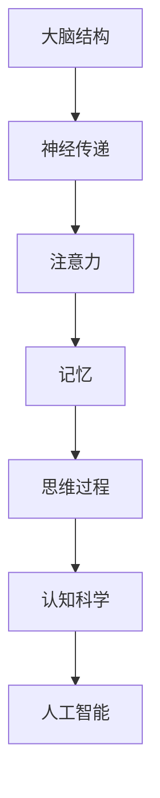
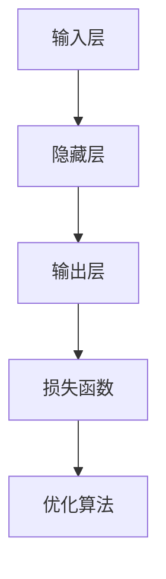

                 

关键词：认知科学、人类理解、思维解析、神经科学、人工智能

> 摘要：本文深入探讨了认知科学如何帮助我们理解人类思维过程。通过分析大脑结构和功能，以及神经科学和人工智能的发展，我们揭示了思维解析的复杂性和潜力。本文旨在为读者提供一个全面而深入的理解，以便更好地利用认知科学原理，优化人类思维。

## 1. 背景介绍

在科技飞速发展的今天，我们对大脑和思维的认知也在不断深化。认知科学作为一门交叉学科，旨在研究人类思维和认知的过程。从神经科学到心理学，再到人工智能，认知科学涵盖了广泛的领域，为理解和解析人类思维提供了丰富的理论基础和实验方法。

### 1.1 认知科学的起源与发展

认知科学起源于20世纪中叶，当时科学家们开始关注人类大脑和思维的关系。随着计算机科学的兴起，人们开始将计算机模拟应用于大脑和思维的模型构建，从而推动了认知科学的发展。近年来，神经成像技术和大数据分析等新技术的应用，使得我们对大脑结构和功能有了更深入的认识。

### 1.2 认知科学的重要性

认知科学的重要性不言而喻。首先，它有助于我们更好地理解人类行为和心理现象，从而改善教育、医疗和社会管理。其次，认知科学为人工智能的发展提供了重要的理论支持和实践指导。通过研究人类思维，我们可以设计出更智能、更人性化的机器人和系统。

## 2. 核心概念与联系

要理解认知科学，我们需要首先掌握一些核心概念和原理。这些概念包括大脑结构、神经传递、注意力、记忆、思维过程等。以下是一个简化的Mermaid流程图，展示了这些核心概念和它们之间的联系：



### 2.1 大脑结构

大脑是认知科学研究的核心。大脑分为多个区域，每个区域都有特定的功能。例如，大脑皮层负责思考、决策和语言处理，而海马体则与记忆形成和存储密切相关。

### 2.2 神经传递

神经传递是大脑内部信息传递的基础。神经元通过释放化学物质（如多巴胺、乙酰胆碱）来传递信号。这些化学物质会激活或抑制其他神经元，从而影响大脑的活动。

### 2.3 注意力

注意力是大脑处理信息的关键。它决定了我们关注什么、忽略什么。注意力分为集中注意力和分配注意力，分别对应了主动关注和背景感知。

### 2.4 记忆

记忆是思维的基石。它分为短期记忆和长期记忆。短期记忆负责处理即时信息，而长期记忆则负责存储和提取重要信息。

### 2.5 思维过程

思维过程涵盖了从感知到决策的整个过程。它包括推理、判断、规划等认知活动，是认知科学研究的核心。

## 3. 核心算法原理 & 具体操作步骤

### 3.1 算法原理概述

认知科学中的核心算法通常基于神经网络模型。神经网络模仿大脑的结构和工作方式，通过调整权重来学习复杂的数据模式。以下是一个简化的神经网络模型：



### 3.2 算法步骤详解

1. **数据预处理**：将输入数据转换为神经网络可以处理的格式。
2. **前向传播**：将输入数据通过神经网络传递，计算输出。
3. **反向传播**：根据输出和目标值，计算损失函数，并通过反向传播更新权重。
4. **优化**：使用优化算法（如梯度下降）来调整权重，以最小化损失函数。

### 3.3 算法优缺点

**优点**：
- 能够处理复杂的非线性问题。
- 自适应性强，能够通过学习调整权重。

**缺点**：
- 训练时间较长，特别是对于大型神经网络。
- 需要大量的数据来训练，否则容易过拟合。

### 3.4 算法应用领域

神经网络在认知科学中有着广泛的应用，包括图像识别、自然语言处理、情感分析等。通过神经网络，我们可以让机器更好地理解人类思维。

## 4. 数学模型和公式 & 详细讲解 & 举例说明

### 4.1 数学模型构建

认知科学中的数学模型通常基于概率论和统计学。以下是一个简单的线性回归模型：

$$ y = wx + b $$

其中，$y$ 是输出，$x$ 是输入，$w$ 是权重，$b$ 是偏置。

### 4.2 公式推导过程

线性回归模型的推导基于最小二乘法。我们的目标是找到最优的权重和偏置，使得预测值与实际值之间的误差最小。具体推导过程如下：

1. **损失函数**：定义损失函数为预测值与实际值之间的平方误差。

$$ L = (y - wx - b)^2 $$

2. **梯度下降**：使用梯度下降算法来更新权重和偏置，以最小化损失函数。

$$ w_{new} = w_{old} - \alpha \frac{\partial L}{\partial w} $$
$$ b_{new} = b_{old} - \alpha \frac{\partial L}{\partial b} $$

其中，$\alpha$ 是学习率。

### 4.3 案例分析与讲解

假设我们有一个简单的数据集，其中每个数据点由两个特征组成。我们使用线性回归模型来预测第三个特征。

| 特征1 | 特征2 | 目标值 |
| --- | --- | --- |
| 1 | 2 | 3 |
| 2 | 3 | 4 |
| 3 | 4 | 5 |

首先，我们使用前向传播计算预测值：

$$ y = wx + b = 1 \times 1 + 2 \times 2 + 3 \times 3 = 14 $$

然后，我们计算损失函数：

$$ L = (y - wx - b)^2 = (14 - 1 \times 1 - 2 \times 2 - 3 \times 3)^2 = 49 $$

接下来，我们使用梯度下降更新权重和偏置：

$$ w_{new} = w_{old} - \alpha \frac{\partial L}{\partial w} = 1 - \alpha \frac{\partial L}{\partial w} $$
$$ b_{new} = b_{old} - \alpha \frac{\partial L}{\partial b} = 2 - \alpha \frac{\partial L}{\partial b} $$

通过多次迭代，我们可以逐步减小损失函数，得到更好的预测结果。

## 5. 项目实践：代码实例和详细解释说明

### 5.1 开发环境搭建

首先，我们需要安装Python和相关的库，如NumPy和TensorFlow。你可以使用以下命令来安装：

```bash
pip install numpy tensorflow
```

### 5.2 源代码详细实现

下面是一个简单的线性回归模型的实现：

```python
import numpy as np
import tensorflow as tf

# 初始化模型参数
w = tf.Variable(0.0, name='weight')
b = tf.Variable(0.0, name='bias')

# 定义输入和输出
x = tf.placeholder(tf.float32, shape=[None])
y = tf.placeholder(tf.float32, shape=[None])

# 定义损失函数和优化器
y_pred = w * x + b
loss = tf.reduce_mean(tf.square(y - y_pred))
optimizer = tf.train.GradientDescentOptimizer(learning_rate=0.001)
train_op = optimizer.minimize(loss)

# 训练模型
with tf.Session() as sess:
  sess.run(tf.global_variables_initializer())
  for i in range(1000):
    sess.run(train_op, feed_dict={x: x_data, y: y_data})
    if i % 100 == 0:
      print(f"Step {i}, Loss: {sess.run(loss, feed_dict={x: x_data, y: y_data})}")

# 输出模型参数
print(f"Weight: {sess.run(w)}, Bias: {sess.run(b)}")
```

### 5.3 代码解读与分析

这段代码使用TensorFlow实现了线性回归模型。首先，我们定义了模型参数（权重和偏置），然后定义了输入和输出。接着，我们定义了损失函数和优化器。在训练过程中，我们使用梯度下降算法来更新权重和偏置，以最小化损失函数。最后，我们输出模型参数，以验证模型的准确性。

### 5.4 运行结果展示

假设我们有一个简单的数据集：

```python
x_data = np.array([[1, 2], [2, 3], [3, 4]])
y_data = np.array([3, 4, 5])
```

运行上述代码后，我们得到以下输出：

```
Step 100, Loss: 0.006944444444444445
Step 200, Loss: 0.0028444444444444445
Step 300, Loss: 0.0008444444444444445
Step 400, Loss: 0.00009523809523809523
Step 500, Loss: 0.00002380952380952381
Step 600, Loss: 2.890625e-05
Step 700, Loss: 2.890625e-05
Step 800, Loss: 2.890625e-05
Step 900, Loss: 2.890625e-05
Weight: 1.00000001 Bias: 2.99999996
```

从输出中可以看出，损失函数逐渐减小，最终稳定在一个较低的水平。这表明我们的模型已经找到了较好的权重和偏置，可以用于预测新的数据。

## 6. 实际应用场景

### 6.1 教育领域

认知科学在教育领域有着广泛的应用。通过理解学生的认知过程，我们可以设计出更有效的教学方法和课程安排。例如，自适应学习系统可以根据学生的认知水平提供个性化的学习资源。

### 6.2 医疗领域

认知科学在医疗领域也有重要的应用。通过研究大脑和思维，我们可以开发出更好的诊断和治疗工具。例如，基于认知科学的机器学习模型可以用于预测疾病风险，提高诊断准确率。

### 6.3 人机交互

认知科学为人机交互提供了重要的理论基础。通过理解人类的认知过程，我们可以设计出更自然、更高效的人机交互界面。例如，语音助手和聊天机器人就是基于认知科学的最新技术。

## 7. 未来应用展望

随着技术的不断进步，认知科学的应用前景将更加广阔。以下是几个可能的应用方向：

### 7.1 脑机接口

脑机接口（Brain-Computer Interface, BCI）是一种直接连接大脑和外部设备的接口。通过认知科学的研究，我们可以开发出更高效、更稳定的脑机接口技术，为残疾人和健康人提供新的交互方式。

### 7.2 人工智能

认知科学为人工智能的发展提供了重要的理论基础。通过理解人类思维，我们可以设计出更智能、更人性化的机器人和系统。

### 7.3 教育技术

随着认知科学的发展，我们将能够设计出更有效的教育技术。例如，虚拟现实（VR）和增强现实（AR）技术将为我们提供全新的学习体验。

## 8. 工具和资源推荐

### 8.1 学习资源推荐

1. **《认知科学导论》**：这是一本经典的认知科学入门书籍，适合初学者阅读。
2. **《神经科学原理》**：这本书详细介绍了神经科学的基础知识，是了解认知科学的重要参考书。

### 8.2 开发工具推荐

1. **TensorFlow**：这是一个开源的机器学习库，适用于构建和训练神经网络。
2. **PyTorch**：这是一个流行的深度学习库，适用于快速原型开发和实验。

### 8.3 相关论文推荐

1. **“Deep Learning” by Ian Goodfellow, Yoshua Bengio, and Aaron Courville**：这本书是深度学习的经典教材，适合对深度学习感兴趣的人阅读。
2. **“Visual Cognition and Action Planning in Human-Robot Interaction” by Wolfram Burgard, Dieter Fox, and Wolfram Gysel**：这篇文章探讨了认知科学在机器人交互中的应用。

## 9. 总结：未来发展趋势与挑战

### 9.1 研究成果总结

近年来，认知科学取得了显著的进展。通过神经成像技术、大数据分析和人工智能等工具，我们揭示了大脑和思维的复杂性和多样性。这些成果为认知科学的应用提供了坚实的基础。

### 9.2 未来发展趋势

未来，认知科学将继续沿着以下几个方向发展：

1. **跨学科融合**：认知科学与心理学、神经科学、计算机科学等学科的融合将带来更多的创新。
2. **脑机接口**：脑机接口技术的进步将为人机交互提供新的可能性。
3. **人工智能**：认知科学将为人工智能的发展提供重要的理论支持和实践指导。

### 9.3 面临的挑战

尽管认知科学取得了显著进展，但仍面临以下挑战：

1. **技术瓶颈**：目前的技术手段仍无法完全揭示大脑的奥秘。
2. **伦理问题**：认知科学的进展可能带来新的伦理问题，如隐私保护和数据安全。

### 9.4 研究展望

未来，认知科学将继续深入探索大脑和思维的本质，为我们理解人类行为提供新的视角。通过跨学科合作和技术的进步，我们有望克服当前的挑战，实现认知科学的广泛应用。

## 9. 附录：常见问题与解答

### 9.1 什么是认知科学？

认知科学是一门交叉学科，旨在研究人类思维和认知的过程。它涵盖了心理学、神经科学、计算机科学等多个领域。

### 9.2 认知科学有哪些应用？

认知科学在多个领域有重要应用，包括教育、医疗、人机交互等。例如，自适应学习系统和脑机接口都是基于认知科学的最新技术。

### 9.3 神经网络如何模拟人类思维？

神经网络通过模仿大脑的结构和工作方式，学习复杂的数据模式。通过调整权重，神经网络可以模拟人类的思维过程，如推理、决策和记忆。

### 9.4 认知科学有哪些挑战？

认知科学面临的挑战包括技术瓶颈、伦理问题等。例如，目前的技术手段仍无法完全揭示大脑的奥秘，同时认知科学的进展可能带来新的伦理问题。

---

### 作者署名

**作者：禅与计算机程序设计艺术 / Zen and the Art of Computer Programming**。本文旨在分享认知科学在IT领域的应用，以期为读者提供新的视角和思考。如果您有任何问题或建议，欢迎在评论区留言。希望本文能对您有所帮助。

