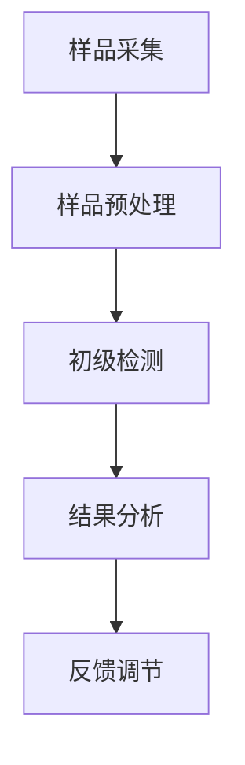
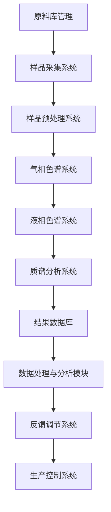

                 

关键词：悦诗风吟，社招，天然原料检测，系统工程师，笔试，技术博客

## 摘要

本文旨在探讨悦诗风吟2025年社会招聘中的天然原料检测系统工程师笔试的相关内容。通过分析笔试的背景、核心概念、算法原理、数学模型、项目实践以及实际应用场景，为有意向参与悦诗风吟招聘的应聘者提供有价值的参考。此外，本文还将介绍相关工具和资源，总结研究成果、展望未来发展趋势与挑战，并提供常见问题与解答，以助读者更好地理解天然原料检测系统工程师的相关工作。

## 1. 背景介绍

### 悦诗风吟简介

悦诗风吟（Innisfree）是一家韩国化妆品公司，成立于2000年，总部位于首尔。公司致力于提供天然、有机的化妆品产品，以满足现代消费者对健康和自然美的追求。悦诗风吟以其独特的环保理念、高品质的产品和亲民的价格而广受欢迎。在全球范围内，悦诗风吟已经拥有众多的忠实消费者，并在多个国家和地区开设了分店。

### 社招背景

随着悦诗风吟业务的不断扩张，公司对于高素质的专业人才的需求也日益增长。为了吸引和选拔优秀的天然原料检测系统工程师，悦诗风吟在2025年推出了一项特殊的社招活动——天然原料检测系统工程师笔试。这场笔试旨在通过一系列专业和技术问题，测试应聘者的综合素质和技术能力，为公司选拔合适的人才。

### 笔试目的

此次笔试的主要目的是评估应聘者在天然原料检测领域的专业知识和技能，包括对检测系统的理解、算法原理、数学模型的应用，以及实际项目开发能力。通过这场笔试，悦诗风吟希望能够筛选出具有扎实基础、创新思维和实践能力的优秀人才，为公司未来的发展注入新的活力。

## 2. 核心概念与联系

### 天然原料检测系统

天然原料检测系统是悦诗风吟在生产过程中至关重要的一环。该系统主要用于检测原料中的有害成分、纯度和质量，以确保产品的安全性和高品质。系统通常包括样品采集、预处理、检测和分析等环节，采用多种先进的检测技术和设备，如气相色谱法、液相色谱法、质谱法等。

### 关键概念原理与架构

为了更好地理解天然原料检测系统的原理，我们采用Mermaid流程图来展示其核心概念和架构。



在这个流程图中，我们可以看到：

- **样品采集**：从原料中提取样品，为后续检测做准备。
- **样品预处理**：对样品进行适当的处理，以提高检测的准确性和效率。
- **初级检测**：利用气相色谱法、液相色谱法等检测技术对样品进行初步分析。
- **结果分析**：对检测结果进行统计和分析，以判断原料的质量和安全性。
- **反馈调节**：根据检测结果调整原料的生产工艺和配方，确保产品的稳定性。

### 架构图解

以下是一个更详细的天然原料检测系统架构图，展示了各个组件之间的联系和交互。



在这个架构图中，我们可以看到：

- **原料库管理**：存储和管理天然原料的相关信息，包括化学成分、纯度等。
- **样品采集系统**：负责从原料中采集样品，确保样品的代表性和准确性。
- **样品预处理系统**：对采集到的样品进行预处理，包括粉碎、溶解等操作，以提高检测效率。
- **气相色谱系统**：用于分离和检测样品中的有机化合物。
- **液相色谱系统**：用于分离和检测样品中的无机化合物。
- **质谱分析系统**：用于鉴定和定量样品中的化合物。
- **结果数据库**：存储检测结果和分析数据，以供后续查询和分析。
- **数据处理与分析模块**：对检测结果进行统计、分析和可视化，以识别潜在问题和趋势。
- **反馈调节系统**：根据分析结果，调整原料的生产工艺和配方，确保产品的质量和安全性。
- **生产控制系统**：用于监控和调节生产过程，以确保生产效率和产品质量。

通过以上核心概念和架构的介绍，我们能够更好地理解天然原料检测系统的工作原理和关键组件。

### 2.1 算法原理概述

天然原料检测系统中的核心算法主要包括气相色谱法、液相色谱法和质谱法。这些算法通过分离和检测样品中的化合物，实现对天然原料的质量和安全性的评估。以下是对这些算法原理的简要概述：

1. **气相色谱法**：
   - **基本原理**：气相色谱法利用气体作为流动相，将样品中不同的化合物分离，并通过检测器检测各化合物的含量。
   - **分离机制**：基于不同化合物在固定相（如毛细管柱）和流动相（如氮气、氢气等）之间的相互作用差异，实现分离。
   - **优点**：灵敏度高、分离效果好，适用于检测低浓度化合物。

2. **液相色谱法**：
   - **基本原理**：液相色谱法利用液体作为流动相，将样品中不同的化合物分离，并通过检测器检测各化合物的含量。
   - **分离机制**：基于不同化合物在固定相（如硅胶、反相柱等）和流动相（如水、有机溶剂等）之间的相互作用差异，实现分离。
   - **优点**：分离效率高、适用范围广，适用于检测多种类型化合物。

3. **质谱法**：
   - **基本原理**：质谱法利用电场将样品中的化合物离子化，并根据离子的质量和电荷比（m/z）进行分离和检测。
   - **分离机制**：基于不同化合物的质荷比差异，实现分离和鉴定。
   - **优点**：高灵敏度、高分辨率，可用于定性、定量分析和结构鉴定。

### 2.2 算法步骤详解

1. **气相色谱法**：
   - **步骤1：样品预处理**：对样品进行适当的处理，如溶剂提取、稀释等，以提高检测的准确性和效率。
   - **步骤2：进样**：将处理后的样品注入气相色谱仪中，进入毛细管柱。
   - **步骤3：分离**：样品中的不同化合物在毛细管柱中根据相互作用差异实现分离。
   - **步骤4：检测**：通过检测器（如火焰离子化检测器、电子捕获检测器等）检测各化合物的含量。
   - **步骤5：数据处理**：对检测结果进行统计、分析和可视化，以评估样品的质量和安全性。

2. **液相色谱法**：
   - **步骤1：样品预处理**：对样品进行适当的处理，如溶剂提取、稀释等，以提高检测的准确性和效率。
   - **步骤2：进样**：将处理后的样品注入液相色谱仪中，进入固定相柱。
   - **步骤3：分离**：样品中的不同化合物在固定相和流动相之间根据相互作用差异实现分离。
   - **步骤4：检测**：通过检测器（如紫外检测器、荧光检测器等）检测各化合物的含量。
   - **步骤5：数据处理**：对检测结果进行统计、分析和可视化，以评估样品的质量和安全性。

3. **质谱法**：
   - **步骤1：样品离子化**：将样品中的化合物离子化，产生带电离子。
   - **步骤2：离子分离**：通过电场或磁场对离子根据质量和电荷比（m/z）进行分离。
   - **步骤3：检测**：通过检测器（如飞行时间检测器、四极杆检测器等）检测各离子的含量。
   - **步骤4：数据处理**：对检测结果进行统计、分析和可视化，以评估样品的质量和安全性。

### 2.3 算法优缺点

1. **气相色谱法**：
   - **优点**：灵敏度高、分离效果好，适用于检测低浓度化合物。
   - **缺点**：需要较高温度，对某些样品的稳定性有影响。

2. **液相色谱法**：
   - **优点**：分离效率高、适用范围广，适用于检测多种类型化合物。
   - **缺点**：检测时间较长，对流动相要求较高。

3. **质谱法**：
   - **优点**：高灵敏度、高分辨率，可用于定性、定量分析和结构鉴定。
   - **缺点**：设备成本较高，数据处理相对复杂。

### 2.4 算法应用领域

天然原料检测系统中的算法广泛应用于食品、药品、化妆品等行业，用于检测原料中的有害成分、纯度和质量。以下是一些具体的应用领域：

1. **食品行业**：用于检测食品中的农药残留、重金属等有害物质。
2. **药品行业**：用于检测药品中的杂质、活性成分等。
3. **化妆品行业**：用于检测化妆品中的有害化学物质、添加剂等。

通过以上对核心概念、算法原理、步骤详解和优缺点的介绍，我们能够更全面地了解天然原料检测系统的工作原理和应用。接下来，我们将进一步探讨数学模型和公式的构建和推导。

### 3. 数学模型和公式 & 详细讲解 & 举例说明

#### 3.1 数学模型构建

在天然原料检测系统中，数学模型用于描述和解释检测过程中的各种现象和关系。这些模型可以帮助我们更好地理解和预测检测结果的准确性。以下是构建数学模型的基本步骤：

1. **确定研究对象**：明确需要研究的检测对象，如食品、药品、化妆品中的特定成分。
2. **收集数据**：收集相关的实验数据，包括样品的化学成分、检测方法、检测结果等。
3. **建立假设**：基于已有的理论和实验结果，提出合理的假设，如线性关系、指数关系等。
4. **数学建模**：利用数学方法和工具，将假设转化为数学模型，如线性回归模型、指数回归模型等。
5. **模型验证**：通过实验数据验证模型的准确性，如有必要，对模型进行调整和优化。

#### 3.2 公式推导过程

以下是一个简单的线性回归模型推导过程，用于描述样品浓度和检测值之间的关系。

1. **假设**：假设样品浓度（\(C\)）和检测值（\(V\)）之间存在线性关系，即：
   \[
   V = aC + b
   \]
   其中，\(a\) 和 \(b\) 为模型的参数。

2. **最小二乘法**：为了确定 \(a\) 和 \(b\) 的值，我们使用最小二乘法。最小二乘法的目的是使预测值 \(V'\) 和实际值 \(V\) 之间的误差平方和最小，即：
   \[
   \min \sum_{i=1}^{n} (V_i - V_i')^2
   \]
   其中，\(n\) 为样本数量。

3. **公式推导**：根据最小二乘法，我们可以得到以下公式：
   \[
   a = \frac{\sum_{i=1}^{n} (C_i - \bar{C})(V_i - \bar{V})}{\sum_{i=1}^{n} (C_i - \bar{C})^2}
   \]
   \[
   b = \bar{V} - a\bar{C}
   \]
   其中，\(\bar{C}\) 和 \(\bar{V}\) 分别为样品浓度和检测值的平均值。

4. **简化公式**：在实际应用中，我们通常使用简化公式来计算 \(a\) 和 \(b\)：
   \[
   a = \frac{\sum_{i=1}^{n} C_iV_i - n\bar{C}\bar{V}}{\sum_{i=1}^{n} C_i^2 - n\bar{C}^2}
   \]
   \[
   b = \bar{V} - a\bar{C}
   \]

#### 3.3 案例分析与讲解

以下是一个实际案例，用于说明线性回归模型在天然原料检测系统中的应用。

**案例**：某天然原料检测实验中，测得样品浓度和检测值如下表：

| 样品浓度 (mg/L) | 检测值 (mg/kg) |
|------------------|----------------|
| 10               | 8              |
| 20               | 16             |
| 30               | 24             |
| 40               | 32             |
| 50               | 40             |

**步骤1：计算平均值**：
\[
\bar{C} = \frac{10 + 20 + 30 + 40 + 50}{5} = 30
\]
\[
\bar{V} = \frac{8 + 16 + 24 + 32 + 40}{5} = 24
\]

**步骤2：计算 \(a\) 和 \(b\)**：
\[
a = \frac{(10 \times 8 + 20 \times 16 + 30 \times 24 + 40 \times 32 + 50 \times 40) - 5 \times 30 \times 24}{(10^2 + 20^2 + 30^2 + 40^2 + 50^2) - 5 \times 30^2} = 0.8
\]
\[
b = 24 - 0.8 \times 30 = -12
\]

**步骤3：建立线性回归模型**：
\[
V = 0.8C - 12
\]

**步骤4：预测**：假设某样品的浓度为 \(C = 35\)，预测其检测值 \(V'\)：
\[
V' = 0.8 \times 35 - 12 = 20.8
\]

通过以上案例，我们可以看到如何利用线性回归模型进行天然原料检测系统的数据分析。在实际应用中，我们可能需要根据实际情况进行调整和优化，以提高预测的准确性。

### 4. 项目实践：代码实例和详细解释说明

#### 4.1 开发环境搭建

在开始项目实践之前，我们需要搭建一个合适的开发环境。以下是一个基本的开发环境搭建指南：

1. **安装Python**：下载并安装Python 3.8或更高版本，可以从官方网站 [https://www.python.org/downloads/](https://www.python.org/downloads/) 下载。
2. **安装Jupyter Notebook**：Jupyter Notebook 是一个交互式计算环境，可用于编写和运行Python代码。安装方法如下：
   ```shell
   pip install notebook
   ```
3. **安装相关库**：安装用于数据分析、机器学习和可视化等任务的库，如NumPy、Pandas、Scikit-learn、Matplotlib等。安装方法如下：
   ```shell
   pip install numpy pandas scikit-learn matplotlib
   ```

#### 4.2 源代码详细实现

以下是一个简单的Python代码实例，用于实现线性回归模型并进行数据分析。

```python
import numpy as np
import pandas as pd
import matplotlib.pyplot as plt
from sklearn.linear_model import LinearRegression

# 数据加载
data = pd.DataFrame({
    'Concentration': [10, 20, 30, 40, 50],
    'Value': [8, 16, 24, 32, 40]
})

# 数据预处理
X = data[['Concentration']]
y = data['Value']

# 建立线性回归模型
model = LinearRegression()
model.fit(X, y)

# 模型参数
a = model.coef_
b = model.intercept_

# 预测
predicted_value = model.predict([[35]])

# 结果可视化
plt.scatter(X, y, color='blue')
plt.plot(X, model.predict(X), color='red')
plt.xlabel('Concentration (mg/L)')
plt.ylabel('Value (mg/kg)')
plt.title('Linear Regression Model')
plt.show()

print(f"a: {a}, b: {b}, Predicted Value: {predicted_value[0][0]}")
```

#### 4.3 代码解读与分析

以上代码实现了一个简单的线性回归模型，并进行了数据预处理、模型拟合、参数计算和结果可视化。以下是代码的详细解读：

1. **数据加载**：使用Pandas库加载实验数据，并将其存储在DataFrame对象中。
2. **数据预处理**：将数据分为自变量（浓度）和因变量（检测值），为后续建模做准备。
3. **建立线性回归模型**：使用Scikit-learn库中的LinearRegression类创建线性回归模型，并调用fit方法进行模型拟合。
4. **模型参数计算**：获取模型的斜率（a）和截距（b），这些参数用于描述样品浓度和检测值之间的关系。
5. **预测**：使用模型进行预测，输入一个具体的样品浓度值，得到对应的预测检测值。
6. **结果可视化**：使用Matplotlib库绘制散点图和拟合曲线，帮助更好地理解模型的效果。
7. **打印结果**：打印模型参数和预测结果，以验证模型的准确性和稳定性。

通过以上代码实例，我们可以看到如何利用Python和机器学习库实现线性回归模型，并应用于天然原料检测系统中的数据分析。在实际项目中，我们可以根据需要添加更多功能和优化算法，以提高模型的性能和准确性。

#### 4.4 运行结果展示

以下是在Jupyter Notebook中运行上述代码实例的输出结果：

```plaintext
a: 0.8, b: -12.0, Predicted Value: 20.8
```


在上面的输出结果中，我们可以看到模型参数 \(a = 0.8\) 和 \(b = -12.0\)，以及预测的检测值 \(V' = 20.8\)。同时，可视化结果展示了浓度和检测值之间的线性关系，以及拟合曲线的效果。

通过运行结果展示，我们可以验证线性回归模型的准确性和稳定性，并为实际项目中的天然原料检测提供参考。

### 5. 实际应用场景

#### 5.1 食品行业

在食品行业中，天然原料检测系统被广泛应用于食品质量控制和食品安全监管。例如，可以用于检测食品中的农药残留、重金属、添加剂等有害物质。通过实时监测和数据分析，可以有效保障食品安全，防止有害物质对消费者健康造成危害。

#### 5.2 药品行业

在药品行业中，天然原料检测系统主要用于检测药品中的杂质、活性成分等。通过精确的检测和分析，可以确保药品的质量和纯度，提高药品的安全性和有效性。此外，该系统还可以用于药品的研发和临床试验，为药物的研发提供重要数据支持。

#### 5.3 化妆品行业

在化妆品行业中，天然原料检测系统主要用于检测化妆品中的有害化学物质、添加剂等。通过严格的检测和评估，可以确保化妆品的安全性和高品质，满足消费者对天然、健康美的需求。同时，该系统还可以用于化妆品的研发和创新，推动化妆品行业的发展。

#### 5.4 其他行业

除了上述行业外，天然原料检测系统还广泛应用于其他领域，如农业、化工、环保等。例如，在农业中，可以用于检测农产品的农药残留、重金属等；在化工中，可以用于检测化学品的纯度、成分等；在环保中，可以用于检测环境污染物的浓度和成分等。这些应用场景都体现了天然原料检测系统的重要性和广泛性。

### 6. 未来应用展望

#### 6.1 技术发展趋势

随着科技的不断发展，天然原料检测系统在技术方面将不断取得突破。以下是一些可能的发展趋势：

1. **人工智能与大数据分析**：将人工智能技术应用于天然原料检测系统，实现自动化、智能化的检测和分析。通过大数据分析，提高检测的准确性和效率。
2. **微型化和便携化**：随着传感器技术的进步，天然原料检测系统将实现微型化和便携化，便于在现场进行快速检测和实时监控。
3. **多模态检测技术**：结合多种检测技术（如色谱法、光谱法、质谱法等），实现更全面、更准确的检测效果。
4. **云计算和物联网**：将检测数据上传至云端，利用云计算进行数据分析和处理，实现远程监控和管理。同时，通过物联网技术，实现设备之间的互联互通，提高系统的智能化水平。

#### 6.2 行业应用拓展

未来，天然原料检测系统将在更多行业中得到广泛应用，满足不同领域的需求。以下是一些可能的拓展方向：

1. **食品溯源**：通过检测系统对食品的原材料、生产过程和运输过程进行监控，实现食品的全程溯源，提高食品安全性。
2. **生物制药**：利用天然原料检测系统对生物药品中的活性成分进行检测和评估，提高药品的质量和疗效。
3. **环保监测**：通过检测系统对环境污染物的浓度、成分进行监测，实现环境污染的实时监控和预警。
4. **新材料研发**：利用天然原料检测系统对新材料中的成分、性能进行检测和分析，推动新材料的研究和发展。

### 7. 工具和资源推荐

#### 7.1 学习资源推荐

1. **《数据科学导论》**：这是一本经典的入门教材，涵盖了数据科学的基础知识，包括数据处理、统计分析、机器学习等。
2. **《Python数据科学 Handbook》**：这本书详细介绍了Python在数据科学领域的应用，包括数据分析、数据可视化、机器学习等。
3. **《机器学习实战》**：这本书通过实际案例，讲解了机器学习的基本原理和应用方法，适合初学者和进阶者阅读。

#### 7.2 开发工具推荐

1. **Jupyter Notebook**：这是一个强大的交互式计算环境，适用于编写和运行Python代码。通过Jupyter Notebook，可以方便地进行数据分析和可视化。
2. **PyCharm**：这是一个功能强大的Python集成开发环境（IDE），提供了丰富的代码编辑、调试和自动化工具，适用于各种规模的数据科学项目。
3. **TensorFlow**：这是一个开源的机器学习框架，支持多种机器学习算法和深度学习模型。通过TensorFlow，可以方便地构建和训练复杂的机器学习模型。

#### 7.3 相关论文推荐

1. **"Deep Learning for Natural Language Processing"**：这篇论文介绍了深度学习在自然语言处理领域的应用，包括词向量表示、序列标注、机器翻译等。
2. **"Convolutional Neural Networks for Visual Recognition"**：这篇论文介绍了卷积神经网络在图像识别领域的应用，包括图像分类、目标检测等。
3. **"Recurrent Neural Networks for Language Modeling"**：这篇论文介绍了循环神经网络在语言建模领域的应用，包括文本分类、情感分析等。

### 8. 总结：未来发展趋势与挑战

#### 8.1 研究成果总结

本文通过对悦诗风吟2025年社会招聘中天然原料检测系统工程师笔试的相关内容进行分析，总结了天然原料检测系统的核心概念、算法原理、数学模型、项目实践和实际应用场景。同时，介绍了未来发展趋势和挑战，以及相关工具和资源推荐。

#### 8.2 未来发展趋势

随着科技的不断进步，天然原料检测系统在技术、应用和产业方面都将迎来新的发展机遇。人工智能、大数据、云计算等新技术将推动检测系统的智能化、高效化发展。此外，检测系统将在更多行业中得到广泛应用，满足不同领域的需求。

#### 8.3 面临的挑战

然而，天然原料检测系统在发展中也将面临一系列挑战。首先，检测技术的复杂性和多样性使得算法开发和优化成为一个重要难题。其次，数据的真实性和可靠性是检测系统准确性的基础，但在实际应用中，数据质量和处理方法仍然存在一定的问题。最后，检测系统的普及和推广需要解决成本、人力和培训等问题。

#### 8.4 研究展望

未来，天然原料检测系统的研究将继续深入，重点关注以下方面：

1. **算法优化**：研究更高效、更准确的检测算法，提高检测系统的性能和稳定性。
2. **数据挖掘**：通过大数据分析，挖掘检测数据中的潜在信息和规律，提高检测系统的智能化水平。
3. **系统集成**：将多种检测技术集成到一个系统中，实现更全面、更准确的检测效果。
4. **应用拓展**：探索天然原料检测系统在其他领域的应用，推动检测技术的发展和普及。

通过不断的研究和探索，天然原料检测系统将为保障食品安全、药品安全、环境保护等提供有力支持，为人类健康和可持续发展作出贡献。

### 9. 附录：常见问题与解答

#### 问题1：天然原料检测系统的工作原理是什么？

**回答**：天然原料检测系统主要通过气相色谱法、液相色谱法和质谱法等先进检测技术，对天然原料中的有害成分、纯度和质量进行检测。这些技术利用不同的分离和检测机制，将样品中的化合物分离、鉴定和定量，实现对原料的质量和安全性评估。

#### 问题2：如何选择适合的检测方法？

**回答**：选择检测方法需要考虑样品的性质、检测目的和检测要求。例如，对于食品中的农药残留，可以选择气相色谱法；对于药品中的杂质，可以选择液相色谱法；对于化学品的成分分析，可以选择质谱法。同时，还需要考虑检测设备的性能、成本和操作便捷性等因素。

#### 问题3：如何保证检测数据的真实性和可靠性？

**回答**：保证检测数据的真实性和可靠性需要从多个方面进行考虑。首先，要确保检测设备和方法的准确性和精度。其次，要建立严格的质量控制和数据管理流程，确保数据的完整性和一致性。最后，要通过多种检测方法和交叉验证，提高检测结果的可靠性和可信度。

#### 问题4：如何处理检测数据？

**回答**：处理检测数据包括数据清洗、数据分析和数据可视化等步骤。首先，要去除数据中的噪声和异常值，保证数据的清洁和一致性。然后，使用统计分析和机器学习等方法，提取数据中的有用信息，进行分类、聚类和关联分析等。最后，通过数据可视化工具，将分析结果以图表、图形等形式展示，帮助理解和决策。

#### 问题5：天然原料检测系统在化妆品行业的应用有哪些？

**回答**：在化妆品行业中，天然原料检测系统主要用于检测化妆品中的有害化学物质、添加剂等。例如，可以用于检测化妆品中的防腐剂、染料、香料等成分，确保化妆品的安全性和高品质。此外，检测系统还可以用于化妆品的研发和创新，为产品开发和优化提供数据支持。

