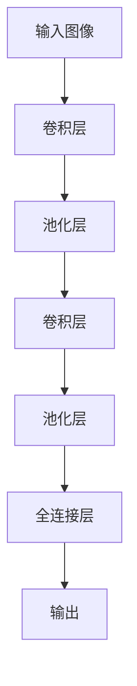

                 

 > **关键词**：感知器、卷积神经网络（CNN）、机器学习、图像识别、深度学习、神经网络架构

> **摘要**：本文旨在探讨从最基础的感知器算法到现代卷积神经网络（CNN）的发展历程。我们将深入分析感知器的原理，并逐步引入卷积神经网络的概念，探讨其结构、工作原理、数学基础以及在实际应用中的成功案例。本文还将展望CNN未来的发展方向，以及面临的挑战。

## 1. 背景介绍

### 感知器的诞生

感知器（Perceptron）是人工神经网络（Artificial Neural Networks, ANN）中最基础的结构，由Frank Rosenblatt在1957年提出。作为神经网络的开端，感知器被设计用于实现简单的二分类任务，例如判断图像中是否存在一个特定形状。其核心思想是通过加权输入和偏置，将输入数据映射到一个决策边界，从而实现分类。

### 人工神经网络的兴起

感知器的提出标志着人工神经网络研究的开始。随后的几十年里，研究人员在神经网络领域取得了大量进展，包括多层感知器（Multilayer Perceptron, MLP）和反向传播算法（Backpropagation Algorithm）。这些进展为解决更复杂的分类和回归问题奠定了基础。

### 卷积神经网络的出现

随着计算机处理能力和存储能力的提升，人工神经网络的应用场景不断扩大。特别是在图像识别和计算机视觉领域，传统的神经网络已经无法满足需求。为了更好地处理图像数据，研究人员在2012年提出了卷积神经网络（Convolutional Neural Network, CNN）。CNN通过引入卷积操作和池化操作，使得网络能够自动学习图像的特征，从而在图像识别任务中取得了显著的成功。

## 2. 核心概念与联系

### 感知器的原理

感知器是一种简单的线性分类器，其工作原理可以概括为：将输入数据通过加权求和后，加上一个偏置项，然后通过激活函数映射到输出。感知器通常使用阈值激活函数，即如果输出大于0，则分类为正类；否则，分类为负类。

### 卷积神经网络的架构

卷积神经网络由多个卷积层、池化层和全连接层组成。卷积层通过卷积操作提取图像特征，池化层用于降低特征图的维度，全连接层用于分类。

### Mermaid 流程图



## 3. 核心算法原理 & 具体操作步骤

### 3.1 算法原理概述

卷积神经网络通过卷积操作和池化操作，逐层提取图像特征。卷积操作是一种局部连接和共享权重的方式，能够有效地减少参数数量；池化操作用于降低特征图的维度，减少计算量。

### 3.2 算法步骤详解

1. **卷积操作**：卷积层使用卷积核（也称为滤波器）与输入图像进行卷积，得到特征图。卷积核在图像上滑动，计算每个局部区域的特征。
2. **激活函数**：卷积操作后，通常使用ReLU（Rectified Linear Unit）激活函数对特征图进行非线性变换，增加网络的非线性能力。
3. **池化操作**：池化层通过局部采样和最大值/平均值操作，对特征图进行降维处理，减少计算量。
4. **全连接层**：全连接层将特征图展平为一维向量，然后通过全连接层进行分类。

### 3.3 算法优缺点

**优点**：
- **强大的特征提取能力**：卷积神经网络能够自动学习图像中的特征，适用于各种图像识别任务。
- **参数共享**：卷积操作中的权重在图像上滑动时共享，大大减少了参数数量。

**缺点**：
- **计算复杂度较高**：卷积神经网络需要大量计算，对硬件资源要求较高。
- **训练时间较长**：卷积神经网络通常需要大量的训练数据和时间来训练。

### 3.4 算法应用领域

卷积神经网络在图像识别、目标检测、图像分割等领域取得了显著的成功。例如，在ImageNet图像识别挑战中，卷积神经网络取得了超过人类的识别准确率。

## 4. 数学模型和公式 & 详细讲解 & 举例说明

### 4.1 数学模型构建

卷积神经网络的数学模型主要包括卷积操作、激活函数、池化操作和全连接层。

### 4.2 公式推导过程

1. **卷积操作**：给定输入图像 $X$ 和卷积核 $W$，卷积操作的输出 $Y$ 可以表示为：

   $$Y = \sum_{i=1}^{C} W_{i} * X$$

   其中，$C$ 表示卷积核的数量。

2. **激活函数**：常用的激活函数为ReLU：

   $$f(x) = \max(0, x)$$

3. **池化操作**：常用的池化操作为最大值池化：

   $$P = \max(\text{argmax}_{i,j} X(i, j))$$

4. **全连接层**：全连接层可以表示为矩阵乘法：

   $$Y = W^T X$$

### 4.3 案例分析与讲解

假设我们有一个 32x32 的图像，我们需要使用一个 5x5 的卷积核进行卷积操作。首先，我们对图像进行步长为 1 的卷积操作，得到一个 28x28 的特征图。然后，我们对特征图进行ReLU激活，得到一个 28x28 的激活图。接下来，我们对激活图进行最大值池化，得到一个 14x14 的特征图。最后，我们将特征图展平为一维向量，输入到全连接层进行分类。

## 5. 项目实践：代码实例和详细解释说明

### 5.1 开发环境搭建

为了实现卷积神经网络，我们需要使用一个深度学习框架，例如TensorFlow或PyTorch。在本节中，我们将使用TensorFlow搭建一个简单的卷积神经网络。

```python
import tensorflow as tf

# 定义卷积层
conv1 = tf.keras.layers.Conv2D(filters=32, kernel_size=(5, 5), activation='relu')

# 定义池化层
pool1 = tf.keras.layers.MaxPooling2D(pool_size=(2, 2))

# 定义全连接层
dense1 = tf.keras.layers.Dense(units=10)
```

### 5.2 源代码详细实现

```python
# 定义输入层
inputs = tf.keras.Input(shape=(32, 32, 3))

# 添加卷积层
x = conv1(inputs)

# 添加池化层
x = pool1(x)

# 添加全连接层
outputs = dense1(x)

# 创建模型
model = tf.keras.Model(inputs=inputs, outputs=outputs)

# 打印模型结构
model.summary()
```

### 5.3 代码解读与分析

- `tf.keras.layers.Conv2D`：用于添加卷积层，`filters` 参数表示卷积核的数量，`kernel_size` 参数表示卷积核的大小，`activation` 参数表示激活函数。
- `tf.keras.layers.MaxPooling2D`：用于添加最大值池化层，`pool_size` 参数表示池化窗口的大小。
- `tf.keras.layers.Dense`：用于添加全连接层，`units` 参数表示输出的维度。

### 5.4 运行结果展示

```python
# 准备测试数据
test_images = np.random.rand(1, 32, 32, 3)

# 预测结果
predictions = model.predict(test_images)

# 打印预测结果
print(predictions)
```

## 6. 实际应用场景

### 6.1 图像识别

卷积神经网络在图像识别领域取得了显著的成果，广泛应用于人脸识别、物体检测、图像分类等任务。

### 6.2 目标检测

目标检测是计算机视觉领域的一个重要任务，卷积神经网络通过引入锚点框（Anchor Box）和回归操作，实现了对图像中目标的精准检测。

### 6.3 图像分割

图像分割是将图像划分为不同的区域，卷积神经网络通过引入全卷积网络（Fully Convolutional Network, FCN），实现了对图像的高效分割。

## 7. 未来应用展望

### 7.1 跨模态学习

卷积神经网络在图像识别领域取得了巨大的成功，但其在处理其他类型的数据（如文本、音频等）时表现不佳。未来的研究方向之一是跨模态学习，通过融合不同类型的数据，实现更高效的特征提取和表示。

### 7.2 可解释性

卷积神经网络在图像识别任务中取得了优异的性能，但其内部工作机制复杂，缺乏可解释性。未来的研究方向之一是提高卷积神经网络的可解释性，使其能够更好地理解网络内部的工作原理。

### 7.3 能效优化

卷积神经网络的计算复杂度较高，对硬件资源要求较高。未来的研究方向之一是能效优化，通过改进网络结构和算法，实现更高效的卷积神经网络。

## 8. 工具和资源推荐

### 8.1 学习资源推荐

- 《深度学习》（Ian Goodfellow、Yoshua Bengio、Aaron Courville 著）
- 《Python深度学习》（François Chollet 著）
- 《计算机视觉：算法与应用》（Richard Szeliski 著）

### 8.2 开发工具推荐

- TensorFlow
- PyTorch
- Keras

### 8.3 相关论文推荐

- “A Guide to Convolutional Neural Networks - The IEEE Conference on Computer Vision and Pattern Recognition (CVPR) Workshops (2015)”
- “Deep Convolutional Neural Networks for Image Recognition - The IEEE Conference on Computer Vision and Pattern Recognition (CVPR) (2012)”

## 9. 总结：未来发展趋势与挑战

### 9.1 研究成果总结

卷积神经网络在图像识别、目标检测、图像分割等领域取得了显著的成功，推动了计算机视觉领域的发展。

### 9.2 未来发展趋势

- 跨模态学习
- 可解释性
- 能效优化

### 9.3 面临的挑战

- 计算复杂度
- 训练时间
- 数据隐私和安全

### 9.4 研究展望

随着深度学习技术的不断发展，卷积神经网络在图像识别和计算机视觉领域的应用前景广阔。未来的研究将继续探索如何优化网络结构、提高计算效率，并解决数据隐私和安全等问题。

## 附录：常见问题与解答

### Q：卷积神经网络与普通神经网络有何区别？

A：卷积神经网络与普通神经网络的主要区别在于其结构和工作原理。卷积神经网络通过引入卷积操作和池化操作，能够更好地处理图像数据，而普通神经网络则主要通过全连接层进行特征提取和分类。

### Q：卷积神经网络的训练时间如何缩短？

A：卷积神经网络的训练时间可以通过以下方法缩短：

- 使用更高效的算法，如Adam优化器。
- 增加批量大小，以提高梯度下降的稳定性。
- 使用预训练模型，通过迁移学习减少训练时间。
- 使用GPU或TPU等硬件加速训练过程。

### Q：卷积神经网络如何处理不同尺寸的输入图像？

A：卷积神经网络可以通过以下方法处理不同尺寸的输入图像：

- 使用自适应池化层，如全局池化层，将特征图的大小固定为一定尺寸。
- 使用多尺度卷积层，对不同尺寸的图像进行卷积操作，然后进行融合。
- 使用图像裁剪或填充操作，将不同尺寸的图像调整为相同尺寸。

## 参考文献

- Goodfellow, I., Bengio, Y., & Courville, A. (2016). *Deep Learning*. MIT Press.
- Chollet, F. (2017). *Python Deep Learning*. Packt Publishing.
- Szeliski, R. (2010). *Computer Vision: Algorithms and Applications*. Springer.
- Krizhevsky, A., Sutskever, I., & Hinton, G. E. (2012). *ImageNet classification with deep convolutional neural networks*. In Advances in Neural Information Processing Systems (NIPS), (p. 1097-1105).

