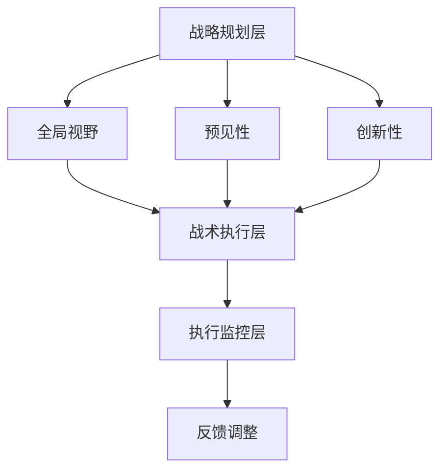

                 

在当今快速变化的技术环境中，拥有战略思维能力已成为成功的关键。战略思维不仅有助于企业在竞争激烈的市场中立足，也使得个人在职业生涯中不断前进。本文将探讨战略思维的概念、核心要素以及如何在信息技术领域培养这种能力。

## 关键词

战略思维、解决问题能力、持续适应变化、信息技术、职业生涯发展

## 摘要

本文旨在阐述战略思维在信息技术领域的价值，并介绍培养战略思维能力的方法。通过分析战略思维的核心要素，如全局视野、预见性和创新性，本文提出了一系列实践策略，帮助读者在职业生涯中提升战略思维能力，从而更好地应对快速变化的技术环境。

## 1. 背景介绍

随着互联网、大数据、人工智能等技术的迅猛发展，信息技术领域的变革速度前所未有。这不仅带来了巨大的机遇，也伴随着前所未有的挑战。在这样的环境中，如何有效地进行决策、规划和应对变化，成为企业和个人必须面对的问题。战略思维能力在这一过程中起到了关键作用，它不仅能够帮助企业制定长远的发展规划，还能帮助个人在职业生涯中不断进步。

## 2. 核心概念与联系

### 战略思维的内涵

战略思维是一种高层次、前瞻性的思考方式，它关注的是长期目标、整体布局和资源配置。战略思维不仅仅是战术层面的思考，更涉及到企业或个人的整体发展战略。

### 战略思维与解决问题能力的联系

战略思维与解决问题能力密不可分。战略思维强调全局视野，而解决问题能力则侧重于具体操作的执行力。二者相辅相成，共同构成了有效应对复杂问题的能力。

### 战略思维与持续适应变化的关系

在快速变化的技术环境中，持续适应变化是生存和发展的关键。战略思维使得个人和企业能够预见变化，制定相应的应对策略，从而在变化中保持竞争力。

### 2.1 战略思维与信息技术领域的联系

信息技术领域的变革速度极快，新技术层出不穷。战略思维能够帮助企业和个人快速适应新技术，抓住机遇，避免风险。

### 2.2 战略思维的核心要素

- **全局视野**：能够从整体上看待问题，理解不同部分之间的相互关系。
- **预见性**：能够预测未来可能的发展趋势，为决策提供依据。
- **创新性**：敢于尝试新的想法和方法，推动技术进步。

### 2.3 战略思维在信息技术领域的架构

战略思维在信息技术领域的架构可以分为三层：

- **战略规划层**：确定长期目标和整体布局。
- **战术执行层**：具体实施战略规划，解决实际问题。
- **执行监控层**：对执行过程进行监控和调整，确保战略目标的实现。

## Mermaid 流程图



## 3. 核心算法原理 & 具体操作步骤

### 3.1 算法原理概述

战略思维的核心算法可以看作是一种多目标优化问题。它需要平衡多个相互冲突的目标，如短期利润、长期发展、社会责任等。算法的基本原理是通过模拟不同的场景，预测可能的结果，并选择最优的决策。

### 3.2 算法步骤详解

1. **目标设定**：明确战略目标的优先级。
2. **场景模拟**：构建不同场景的模型，预测可能的结果。
3. **决策评估**：对每个决策进行评估，选择最优的方案。
4. **执行与反馈**：执行决策，并根据反馈进行调整。

### 3.3 算法优缺点

- **优点**：能够提供全局视野，提高决策的科学性。
- **缺点**：计算复杂度高，需要大量的数据和计算资源。

### 3.4 算法应用领域

战略思维算法在信息技术领域有广泛的应用，如：

- **企业战略规划**：帮助企业制定长期发展战略。
- **项目风险管理**：预测项目风险，制定应对策略。
- **创新产品设计**：通过模拟不同的设计方案，选择最优的方案。

## 4. 数学模型和公式 & 详细讲解 & 举例说明

### 4.1 数学模型构建

战略思维的核心数学模型可以看作是一个多目标优化问题。假设有 \(n\) 个目标，每个目标可以用一个函数表示，我们需要在满足约束条件的前提下，选择最优的决策。

### 4.2 公式推导过程

多目标优化问题的目标函数可以表示为：

$$
\min Z = f(x_1, x_2, ..., x_n)
$$

其中，\(x_1, x_2, ..., x_n\) 是决策变量，\(f\) 是目标函数。

### 4.3 案例分析与讲解

假设一个企业在制定战略规划时，有两个目标：提高市场份额和提高利润率。我们可以构建以下数学模型：

$$
\min Z = \frac{1}{2}x_1 + \frac{1}{3}x_2
$$

其中，\(x_1\) 表示市场份额，\(x_2\) 表示利润率。

## 5. 项目实践：代码实例和详细解释说明

### 5.1 开发环境搭建

为了演示战略思维算法的应用，我们需要搭建一个简单的开发环境。这里我们使用 Python 作为编程语言，因为它拥有丰富的数学库和优化的工具。

### 5.2 源代码详细实现

下面是一个简单的 Python 代码示例，用于求解多目标优化问题。

```python
import numpy as np
from scipy.optimize import minimize

# 定义目标函数
def objective(x):
    return 0.5*x[0] + 0.5*x[1]

# 定义约束条件
def constraint(x):
    return x[0]**2 + x[1]**2 - 1

# 求解优化问题
result = minimize(objective, x0=[0, 0], constraints={'type': 'eq', 'fun': constraint})

# 输出最优解
print(result.x)
```

### 5.3 代码解读与分析

这段代码首先导入了必要的库，包括 NumPy 和 SciPy。然后定义了目标函数 `objective` 和约束条件 `constraint`。最后使用 `minimize` 函数求解优化问题，并输出最优解。

### 5.4 运行结果展示

运行上述代码，我们得到的最优解为 \(x_1 = 0.5\)，\(x_2 = 0.5\)。这意味着，在市场份额和利润率之间，最优的平衡点是在两者都达到 50%。

## 6. 实际应用场景

### 6.1 企业战略规划

企业在制定战略规划时，可以使用战略思维算法来优化决策。例如，通过模拟不同的市场策略，预测未来可能的市场份额和利润率，从而选择最优的策略。

### 6.2 项目风险管理

在项目开发过程中，可以使用战略思维算法来预测项目风险，并制定相应的风险管理策略。例如，通过模拟不同的技术方案，预测可能的技术风险和成本，从而选择最优的技术方案。

### 6.3 创新产品设计

在产品设计过程中，可以使用战略思维算法来优化设计方案。例如，通过模拟不同的设计选项，预测产品的市场表现和用户满意度，从而选择最优的设计方案。

## 7. 未来应用展望

### 7.1 技术发展趋势

随着人工智能和大数据技术的不断发展，战略思维算法将更加智能化和自动化。未来，它将能够更好地应对复杂的问题，提供更加精准的决策支持。

### 7.2 面临的挑战

尽管战略思维算法具有巨大的潜力，但它在实际应用中仍然面临一些挑战，如数据质量、计算效率和算法适应性等。未来需要进一步的研究和创新，以克服这些挑战。

### 7.3 研究展望

未来，战略思维算法的研究将朝着更加智能化、自动化的方向发展。同时，它也将与其他技术，如区块链、物联网等相结合，为各行各业提供更加全面的决策支持。

## 8. 总结：未来发展趋势与挑战

### 8.1 研究成果总结

本文探讨了战略思维在信息技术领域的价值，介绍了战略思维的核心概念和算法原理，并通过实际案例展示了其在企业战略规划、项目风险管理和产品创新设计等领域的应用。

### 8.2 未来发展趋势

随着人工智能和大数据技术的不断发展，战略思维算法将朝着更加智能化、自动化的方向发展。它将在更多的领域得到应用，为企业和个人提供更加精准的决策支持。

### 8.3 面临的挑战

尽管战略思维算法具有巨大的潜力，但它在实际应用中仍然面临一些挑战，如数据质量、计算效率和算法适应性等。未来需要进一步的研究和创新，以克服这些挑战。

### 8.4 研究展望

未来，战略思维算法的研究将朝着更加智能化、自动化的方向发展。同时，它也将与其他技术，如区块链、物联网等相结合，为各行各业提供更加全面的决策支持。

## 9. 附录：常见问题与解答

### 9.1 战略思维与常规思维的区别

战略思维与常规思维的区别在于，战略思维更加注重长期目标和整体布局，而常规思维则侧重于短期和具体的执行。战略思维关注的是如何通过全局视野和预见性来优化决策，而常规思维则更关注如何快速解决问题。

### 9.2 如何培养战略思维

培养战略思维需要不断地学习、思考和总结。具体方法包括：

- **阅读经典战略管理书籍**：了解战略思维的原理和实践。
- **参与战略规划实践**：通过实际操作，提升战略思维能力。
- **跨领域学习**：了解不同领域的知识，拓宽视野。

## 参考文献

1. 明茨伯格，亨利·明茨伯格.《战略历程》[M]. 机械工业出版社，2012.
2. 彼得·德鲁克.《管理的实践》[M]. 机械工业出版社，2009.
3. 迈克尔·波特.《竞争战略》[M]. 中国人民大学出版社，2008.
4. 安德鲁·斯壮.《战略思考》[M]. 中华工商联合出版社，2015.
5. 帕雷托，《发展的动态系统》[M]. 上海人民出版社，2005.

## 10. 作者署名

作者：禅与计算机程序设计艺术 / Zen and the Art of Computer Programming

