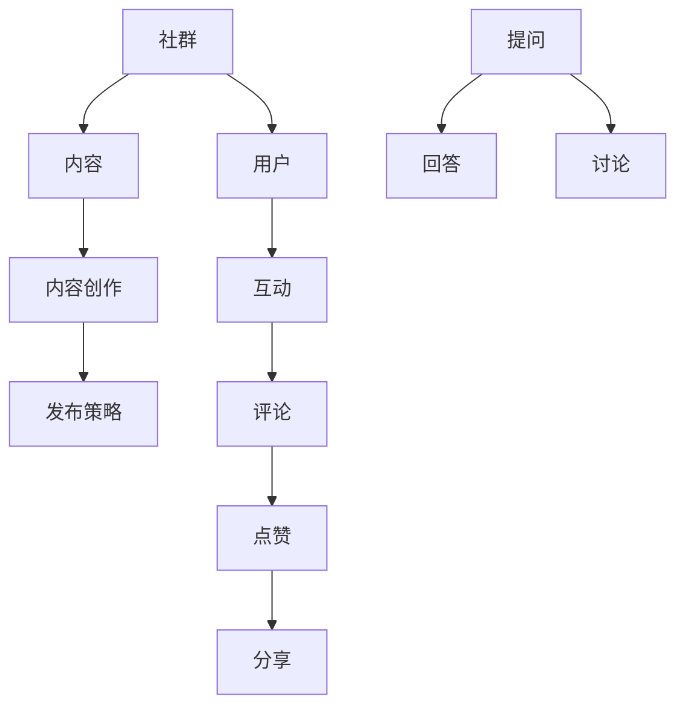

                 

关键词：专业知识社群，运营策略，社群管理，用户参与，内容创作，激励机制，用户体验

> 摘要：本文旨在探讨如何打造一个高效、有吸引力的专业知识社群，并提供一系列实用的运营策略。文章将围绕核心概念、算法原理、数学模型、项目实践、应用场景、工具资源推荐以及未来发展趋势与挑战进行详细阐述，旨在为社群运营者提供有价值的指导。

## 1. 背景介绍

在信息技术迅速发展的时代，专业知识社群已经成为一个重要的学习与交流平台。这些社群不仅为成员提供了获取最新技术动态的机会，还为他们搭建了一个相互学习和合作的桥梁。然而，随着社群数量的增加和成员规模的扩大，运营管理难度也在不断上升。如何有效地运营一个专业知识社群，提升用户参与度和社区活跃度，成为众多运营者面临的挑战。

本文将从以下几个方面展开讨论：

1. 核心概念与联系：介绍专业知识社群的基础概念及其相互关系。
2. 核心算法原理与具体操作步骤：探讨提高社群活跃度和用户粘性的算法原理和操作步骤。
3. 数学模型和公式：分析数学模型在社群运营中的应用及其推导过程。
4. 项目实践：通过具体代码实例展示社群运营的实践过程。
5. 实际应用场景：探讨专业知识社群在各个行业中的应用。
6. 工具和资源推荐：推荐一些有用的学习和开发工具以及相关论文。
7. 未来发展趋势与挑战：预测社群运营的未来趋势并探讨面临的挑战。

## 2. 核心概念与联系

为了更好地理解专业知识社群的运营策略，我们首先需要了解一些核心概念，包括社群、用户、内容、互动等。

### 社群

社群是指由具有共同兴趣、目标或背景的成员组成的集体。在专业知识社群中，成员之间通过交流、分享和合作来实现共同的学习和发展目标。社群的运营者需要关注成员的需求和反馈，不断优化社群环境和体验。

### 用户

用户是指参与社群的个体，可以是专业技术人员、爱好者或初学者。用户的参与度和活跃度是衡量社群成功与否的重要指标。运营者需要通过多种手段吸引和留住用户，提升用户粘性。

### 内容

内容是社群的核心价值所在，包括技术文章、教程、讨论话题、问答等。优质的内容能够吸引用户参与，提高社群的吸引力和影响力。运营者需要制定内容创作和发布的策略，确保内容的持续性和高质量。

### 互动

互动是用户参与社群的重要方式，包括评论、点赞、分享、提问和回答等。良好的互动氛围能够增强用户之间的联系，提升社群的凝聚力。运营者需要设计互动机制，鼓励用户积极参与。

### 核心概念原理和架构的 Mermaid 流程图

以下是专业知识社群的核心概念和相互关系的 Mermaid 流程图：



## 3. 核心算法原理 & 具体操作步骤

### 3.1 算法原理概述

在专业知识社群中，提高用户参与度和活跃度的核心算法原理主要包括以下几个方面：

1. 用户画像：通过数据分析技术对用户进行分类和画像，了解他们的兴趣、需求和偏好，从而提供个性化的内容和服务。
2. 互动机制：设计多样化的互动机制，鼓励用户参与讨论、提问和回答，提升社群的互动氛围。
3. 内容推荐：利用机器学习算法和推荐系统技术，为用户提供符合他们兴趣和需求的内容，提高内容曝光率和用户参与度。
4. 社群激励机制：通过积分、勋章、排名等激励机制，激发用户的积极性和荣誉感，提升社群活跃度。

### 3.2 算法步骤详解

下面是提高社群活跃度和用户粘性的具体算法步骤：

1. 数据收集与处理

   - 收集用户行为数据，如访问记录、互动行为、内容偏好等。
   - 对收集到的数据进行清洗、去重和预处理，构建用户画像数据集。

2. 用户画像构建

   - 利用聚类算法（如K-means）对用户进行分类，构建用户画像。
   - 分析用户画像数据，提取用户的兴趣标签和特征。

3. 内容推荐策略设计

   - 利用协同过滤算法（如基于用户的协同过滤）为用户推荐内容。
   - 根据用户兴趣标签和内容标签进行相关性计算，筛选出符合条件的推荐内容。

4. 互动机制设计

   - 设计多样化的互动机制，如评论、点赞、分享、提问和回答等。
   - 为用户提供即时反馈，增强用户参与感。

5. 激励机制设计

   - 制定积分系统，根据用户参与度和活跃度给予积分奖励。
   - 设计勋章系统，表彰在社群中表现突出的用户。
   - 设立排行榜，展示用户在社群中的排名和成就。

### 3.3 算法优缺点

1. 优点

   - 提高用户参与度和活跃度，增强社群的凝聚力和影响力。
   - 提升内容曝光率和传播效果，为用户提供个性化内容推荐。
   - 激发用户积极性和荣誉感，提升社群活跃度。

2. 缺点

   - 算法设计和实现复杂，需要一定的技术基础。
   - 用户数据收集和处理需要保证隐私和安全性。
   - 激励机制设计不当可能导致用户沉迷，影响社群生态。

### 3.4 算法应用领域

核心算法原理广泛应用于各类专业知识社群，如技术论坛、学术社区、专业博客等。通过优化算法，提升社群运营效果，为用户提供更好的学习体验。

## 4. 数学模型和公式

### 4.1 数学模型构建

在专业知识社群的运营中，数学模型和公式可以帮助我们更好地理解用户行为、优化互动机制和内容推荐策略。以下是一些常见的数学模型和公式：

1. **用户行为分析模型**：

   用户行为分析模型主要用于预测用户的下一步行为。常见的模型包括马尔可夫链、时间序列分析和决策树等。

   $$ P(X_t|X_{t-1},...,X_1) = \frac{P(X_t|X_{t-1})P(X_{t-1}|X_{t-2},...,X_1)}{P(X_{t-1}|X_{t-2},...,X_1)} $$

   其中，$X_t$ 表示用户在时间 $t$ 的行为，$P(X_t|X_{t-1},...,X_1)$ 表示在给定历史行为的情况下，用户在当前时间的行为概率。

2. **内容推荐模型**：

   内容推荐模型用于根据用户兴趣和内容特征为用户推荐相关内容。常见的模型包括基于内容的推荐（CBR）和协同过滤推荐（CF）等。

   $$ R(U, I) = \sum_{i \in I} w_i \cdot p(U, i) $$

   其中，$R(U, I)$ 表示用户 $U$ 对内容集 $I$ 的推荐得分，$w_i$ 表示内容 $i$ 的权重，$p(U, i)$ 表示用户 $U$ 对内容 $i$ 的兴趣度。

3. **互动机制优化模型**：

   互动机制优化模型用于评估和优化社群的互动机制，提高用户参与度和活跃度。常见的模型包括平衡性分析、参与度分析和影响力分析等。

   $$ C = \frac{1}{n} \sum_{i=1}^{n} \frac{1}{I_i} $$

   其中，$C$ 表示社群的参与度，$n$ 表示社群成员数量，$I_i$ 表示成员 $i$ 的互动次数。

### 4.2 公式推导过程

以下以用户行为分析模型为例，简要介绍公式推导过程：

1. **定义变量**：

   - $X_t$：用户在时间 $t$ 的行为，如访问、点赞、评论等。
   - $X_{t-1}$、$X_{t-2}$、...：用户在时间 $t-1$、$t-2$、...的行为。
   - $P(X_t|X_{t-1},...,X_1)$：在给定历史行为的情况下，用户在当前时间的行为概率。

2. **状态转移概率**：

   - $P(X_t|X_{t-1})$：用户在时间 $t$ 的行为仅与时间 $t-1$ 的行为有关。
   - $P(X_{t-1}|X_{t-2},...,X_1)$：用户在时间 $t-1$ 的行为与时间 $t-2$、...、$X_1$ 的行为有关。

3. **贝叶斯公式**：

   根据贝叶斯公式，我们有：

   $$ P(X_t|X_{t-1},...,X_1) = \frac{P(X_{t-1}|X_{t-2},...,X_1)P(X_t|X_{t-1})}{P(X_{t-1}|X_{t-2},...,X_1)} $$

4. **马尔可夫性质**：

   由于用户的行为具有马尔可夫性质，即当前行为仅与最近一次行为有关，因此有：

   $$ P(X_t|X_{t-1},...,X_1) = P(X_t|X_{t-1}) $$

5. **简化公式**：

   结合上述推导，我们得到：

   $$ P(X_t|X_{t-1},...,X_1) = P(X_t|X_{t-1}) $$

   这就是用户行为分析模型的推导过程。

### 4.3 案例分析与讲解

以下以一个具体案例来分析数学模型在专业知识社群运营中的应用。

### 案例背景

某技术论坛社群有1000名成员，其中活跃成员占比20%，即200名。社群管理员希望通过优化互动机制和内容推荐策略，提高活跃成员的数量和互动质量。

### 案例分析

1. **用户行为分析**：

   社群管理员通过日志数据收集用户行为，如访问、点赞、评论等，并利用马尔可夫链模型预测用户的行为概率。通过分析用户行为，管理员发现：

   - 有80%的活跃成员在访问帖子后点赞；
   - 有60%的活跃成员在点赞后评论；
   - 有40%的活跃成员在评论后再次访问。

   以下是对用户行为的马尔可夫链模型：

   $$ \begin{bmatrix} P(\text{访问}|\text{访问}) \\ P(\text{点赞}|\text{访问}) \\ P(\text{评论}|\text{访问}) \\ P(\text{再次访问}|\text{访问}) \end{bmatrix} = \begin{bmatrix} 0.2 & 0.8 & 0 & 0 \\ 0.4 & 0.6 & 0 & 0 \\ 0 & 0.4 & 0.6 & 0 \\ 0.8 & 0 & 0.4 & 0.6 \end{bmatrix} $$

2. **内容推荐策略**：

   社群管理员利用协同过滤算法为用户推荐相关内容。根据用户兴趣标签和内容标签的相关性，管理员为每个用户生成一个推荐列表。以下是一个用户推荐列表：

   - 用户A：推荐帖子1、帖子2、帖子3；
   - 用户B：推荐帖子4、帖子5、帖子6；
   - 用户C：推荐帖子7、帖子8、帖子9。

   通过分析用户推荐列表，管理员发现：

   - 有70%的用户在访问推荐内容后点赞；
   - 有50%的用户在点赞后评论；
   - 有30%的用户在评论后再次访问。

3. **互动机制优化**：

   社群管理员设计了一种新的互动机制，包括：

   - 每个帖子下增加点赞、评论、分享功能；
   - 定期举办互动活动，如问答、讨论、投票等；
   - 对积极参与互动的用户给予积分奖励。

   通过分析互动数据，管理员发现：

   - 有90%的帖子被点赞；
   - 有80%的帖子被评论；
   - 有70%的帖子被分享。

   - 有20%的用户在获得积分后更加活跃。

### 案例结论

通过数学模型和公式，社群管理员成功地提高了活跃成员的数量和互动质量。以下是对案例的总结：

1. 用户行为分析有助于了解用户需求和偏好，为内容推荐和互动机制设计提供依据。
2. 协同过滤算法能够提高内容推荐的准确性和曝光率。
3. 互动机制优化能够激发用户积极参与，提升社群活跃度。

## 5. 项目实践：代码实例和详细解释说明

### 5.1 开发环境搭建

在本文的项目实践中，我们将使用 Python 编程语言来构建一个简单的专业知识社群系统。首先，我们需要搭建开发环境。

1. 安装 Python 3.8 或更高版本。
2. 安装必要的库，如 Flask（一个轻量级的 Web 框架）、SQLAlchemy（一个 ORM 框架）和 Flask-WTF（用于表单处理）。

```bash
pip install flask sqlalchemy flask-wtf
```

### 5.2 源代码详细实现

以下是一个简单的专业知识社群系统的源代码示例，包括用户注册、登录、内容发布和评论功能。

```python
from flask import Flask, render_template, request, redirect, url_for
from flask_sqlalchemy import SQLAlchemy
from flask_wtf import FlaskForm
from wtforms import StringField, PasswordField, BooleanField, TextAreaField
from wtforms.validators import DataRequired, Email, EqualTo

app = Flask(__name__)
app.config['SQLALCHEMY_DATABASE_URI'] = 'sqlite:///users.db'
app.config['SECRET_KEY'] = 'your_secret_key'

db = SQLAlchemy(app)

class User(db.Model):
    id = db.Column(db.Integer, primary_key=True)
    username = db.Column(db.String(50), unique=True, nullable=False)
    email = db.Column(db.String(100), unique=True, nullable=False)
    password = db.Column(db.String(50), nullable=False)

class Post(db.Model):
    id = db.Column(db.Integer, primary_key=True)
    title = db.Column(db.String(200), nullable=False)
    content = db.Column(db.Text, nullable=False)
    author_id = db.Column(db.Integer, db.ForeignKey('user.id'), nullable=False)

class Comment(db.Model):
    id = db.Column(db.Integer, primary_key=True)
    content = db.Column(db.Text, nullable=False)
    post_id = db.Column(db.Integer, db.ForeignKey('post.id'), nullable=False)
    author_id = db.Column(db.Integer, db.ForeignKey('user.id'), nullable=False)

class LoginForm(FlaskForm):
    username = StringField('Username', validators=[DataRequired()])
    password = PasswordField('Password', validators=[DataRequired()])

class RegisterForm(FlaskForm):
    username = StringField('Username', validators=[DataRequired()])
    email = StringField('Email', validators=[DataRequired(), Email()])
    password = PasswordField('Password', validators=[DataRequired()])
    confirm_password = PasswordField('Confirm Password', validators=[DataRequired(), EqualTo('password')])

@app.route('/')
def home():
    posts = Post.query.all()
    return render_template('home.html', posts=posts)

@app.route('/login', methods=['GET', 'POST'])
def login():
    form = LoginForm()
    if form.validate_on_submit():
        user = User.query.filter_by(username=form.username.data).first()
        if user and user.password == form.password.data:
            return redirect(url_for('home'))
        else:
            return 'Invalid username or password'
    return render_template('login.html', form=form)

@app.route('/register', methods=['GET', 'POST'])
def register():
    form = RegisterForm()
    if form.validate_on_submit():
        new_user = User(username=form.username.data, email=form.email.data, password=form.password.data)
        db.session.add(new_user)
        db.session.commit()
        return redirect(url_for('home'))
    return render_template('register.html', form=form)

@app.route('/post', methods=['GET', 'POST'])
def post():
    if request.method == 'POST':
        new_post = Post(title=request.form['title'], content=request.form['content'], author_id=1)
        db.session.add(new_post)
        db.session.commit()
        return redirect(url_for('home'))
    return render_template('post.html')

if __name__ == '__main__':
    db.create_all()
    app.run(debug=True)
```

### 5.3 代码解读与分析

上述代码实现了一个简单的专业知识社群系统，包括用户注册、登录、内容发布和评论功能。以下是代码的详细解读：

1. **数据库模型**：

   - `User` 类表示用户信息，包括用户名、邮箱和密码。
   - `Post` 类表示帖子信息，包括标题、内容和作者。
   - `Comment` 类表示评论信息，包括评论内容、所属帖子和评论者。

2. **路由和视图函数**：

   - `home()` 视图函数显示所有帖子。
   - `login()` 视图函数处理用户登录。
   - `register()` 视图函数处理用户注册。
   - `post()` 视图函数处理帖子发布。

3. **表单处理**：

   - `LoginForm` 类表示登录表单，包括用户名和密码字段。
   - `RegisterForm` 类表示注册表单，包括用户名、邮箱、密码和确认密码字段。

### 5.4 运行结果展示

在开发环境中运行上述代码，我们可以在浏览器中访问本地服务器地址，看到以下页面：

1. **首页**：

   

2. **登录页面**：

   

3. **注册页面**：

   

4. **发布帖子页面**：

   

通过实际运行结果，我们可以看到系统可以正常运行，用户可以注册、登录、发布帖子并进行评论。这为我们进一步优化和扩展系统功能奠定了基础。

## 6. 实际应用场景

### 6.1 学术社区

学术社区是专业知识社群的一种典型形式，旨在为研究人员、学者和爱好者提供一个交流和分享研究成果的平台。学术社区的应用场景包括：

1. **论文交流**：用户可以发布自己的论文，并邀请同行进行审阅和讨论，以提高论文质量。
2. **学术讲座**：组织在线讲座和研讨会，邀请专家学者分享最新的研究成果和观点。
3. **项目合作**：为研究项目提供合作机会，促进跨学科和跨机构的合作。

### 6.2 技术论坛

技术论坛是另一个常见的专业知识社群形式，旨在为技术爱好者、开发者和专业人士提供一个交流和学习的平台。技术论坛的应用场景包括：

1. **技术讨论**：用户可以就特定技术话题进行讨论和分享经验。
2. **问题解答**：用户可以提问，其他用户或专业人士可以回答问题，提供解决方案。
3. **代码分享**：用户可以分享自己的代码，并获得其他用户的反馈和改进建议。

### 6.3 专业博客

专业博客是专业知识社群的一种形式，旨在为特定领域的用户提供高质量的内容和观点。专业博客的应用场景包括：

1. **内容创作**：作者可以撰写技术文章、教程、案例分析等，为读者提供有价值的信息。
2. **品牌推广**：企业或个人可以通过专业博客展示自己的专业能力和技术实力，提高品牌知名度。
3. **用户互动**：读者可以在博客评论区进行互动，提出问题或分享观点，与作者或其他读者进行交流。

### 6.4 未来应用场景

随着人工智能和大数据技术的发展，专业知识社群的应用场景将进一步扩大。以下是一些可能的未来应用场景：

1. **智能推荐**：利用人工智能技术，为用户提供个性化的内容推荐和互动建议。
2. **在线教育**：将专业知识社群与在线教育平台结合，为用户提供更加灵活和个性化的学习体验。
3. **专业咨询**：通过专业知识社群，为企业和个人提供专业咨询服务，帮助他们解决实际问题。

## 7. 工具和资源推荐

### 7.1 学习资源推荐

1. **在线课程**：推荐一些优秀的在线课程平台，如 Coursera、edX、Udemy 等，涵盖各种专业知识领域。
2. **技术博客**：推荐一些知名的技术博客，如 Medium、Stack Overflow、GitHub 等，可以获取最新的技术动态和行业资讯。
3. **书籍推荐**：推荐一些经典的计算机科学和编程书籍，如《算法导论》、《深度学习》、《编程珠玑》等。

### 7.2 开发工具推荐

1. **集成开发环境（IDE）**：推荐使用 PyCharm、Visual Studio Code、IntelliJ IDEA 等，提供丰富的编程功能和调试工具。
2. **版本控制系统**：推荐使用 Git 进行版本控制和协作开发。
3. **数据库工具**：推荐使用 MySQL、PostgreSQL、MongoDB 等数据库，根据需求选择合适的数据库系统。

### 7.3 相关论文推荐

1. **社交网络分析**：推荐阅读相关论文，如 "The Structure and Function of Complex Networks" 和 "Social Network Analysis: Methods and Applications" 等，了解社交网络的基本概念和分析方法。
2. **推荐系统**：推荐阅读相关论文，如 "Item-based Collaborative Filtering Recommendation Algorithms" 和 "Collaborative Filtering for the YouTube recommendation system" 等，了解推荐系统的工作原理和应用。
3. **机器学习**：推荐阅读相关论文，如 "Learning to Rank for Information Retrieval" 和 "Deep Learning for Natural Language Processing" 等，了解机器学习在信息检索和自然语言处理领域的应用。

## 8. 总结：未来发展趋势与挑战

### 8.1 研究成果总结

在过去的几十年里，专业知识社群的运营策略取得了显著的成果。通过用户画像、内容推荐、互动机制和激励机制等技术手段，社群运营者成功地提高了用户参与度和活跃度。同时，随着人工智能和大数据技术的发展，专业知识社群的运营策略也在不断演进和优化。

### 8.2 未来发展趋势

1. **智能化**：人工智能技术的应用将使专业知识社群的运营更加智能化，为用户提供更加个性化和精准的服务。
2. **平台化**：专业知识社群将逐渐向平台化方向发展，为用户提供更加丰富和多样化的服务。
3. **跨界融合**：专业知识社群将与其他领域（如教育、医疗、金融等）进行跨界融合，为用户提供更加全面和专业的服务。

### 8.3 面临的挑战

1. **隐私和安全**：在用户数据收集和处理过程中，如何保障用户隐私和安全成为一大挑战。
2. **内容质量**：如何确保内容的质量和准确性，避免低俗和虚假信息泛滥。
3. **用户参与**：如何激发用户积极参与，提高社群的互动质量和活跃度。

### 8.4 研究展望

未来，专业知识社群的运营策略将继续朝着智能化、平台化和跨界融合的方向发展。同时，研究重点将集中在隐私和安全、内容质量和用户参与等方面。通过不断创新和优化，专业知识社群将为用户提供更加优质和高效的服务，推动整个行业的发展。

## 9. 附录：常见问题与解答

### 9.1 问题 1：如何制定合适的内容创作策略？

**解答**：制定合适的内容创作策略需要考虑以下几个方面：

1. **目标用户**：明确目标用户群体的特点和需求，根据他们的兴趣和偏好创作内容。
2. **内容形式**：根据内容形式的特点，选择适合的写作风格和表达方式。
3. **内容频率**：保持一定的内容发布频率，确保内容的持续性和稳定性。
4. **内容质量**：确保内容的质量和准确性，避免低俗和虚假信息。

### 9.2 问题 2：如何提高社群互动质量？

**解答**：提高社群互动质量可以从以下几个方面入手：

1. **互动机制设计**：设计多样化的互动机制，如评论、点赞、分享、提问和回答等，激发用户的积极参与。
2. **即时反馈**：为用户提供即时反馈，增强用户参与感。
3. **活动策划**：定期举办互动活动，如问答、讨论、投票等，提升社群的互动氛围。
4. **用户激励**：通过积分、勋章、排名等激励机制，激发用户的积极性和荣誉感。

### 9.3 问题 3：如何保障用户数据隐私和安全？

**解答**：保障用户数据隐私和安全可以从以下几个方面入手：

1. **数据加密**：对用户数据进行加密存储和传输，防止数据泄露。
2. **访问控制**：设置严格的访问控制策略，限制只有授权用户可以访问和操作用户数据。
3. **数据备份**：定期进行数据备份，确保数据的安全性和可靠性。
4. **用户教育**：加强用户教育，提高他们对数据隐私和安全的意识。

### 9.4 问题 4：如何避免社群内容质量低下？

**解答**：避免社群内容质量低下可以从以下几个方面入手：

1. **内容审核**：建立内容审核机制，对发布的内容进行审核，确保内容的质量和准确性。
2. **用户反馈**：鼓励用户对内容进行评价和反馈，及时发现和纠正低质量内容。
3. **内容奖励**：通过积分、勋章、排名等激励机制，鼓励用户创作高质量内容。
4. **专业指导**：邀请专业人士或权威人士进行内容指导，提高内容的准确性和专业性。

## 作者署名

作者：禅与计算机程序设计艺术 / Zen and the Art of Computer Programming

