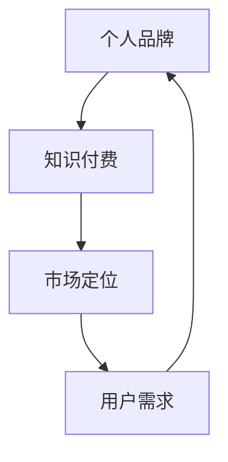

                 

 **关键词：** 个人品牌、知识付费、程序员、品牌建设、市场定位、内容创造

**摘要：** 本文将深入探讨程序员如何利用自己的专业知识和技能，通过知识付费的方式打造个人品牌。文章从背景介绍、核心概念、算法原理、数学模型、项目实践、应用场景、工具推荐、未来展望等多角度进行分析，为程序员提供一套系统的知识付费策略，助力其在职业发展中脱颖而出。

## 1. 背景介绍

在互联网快速发展的今天，知识付费已经成为一种主流的经济模式。程序员作为知识密集型职业群体，拥有丰富的技术经验和专业知识。然而，如何将自身的知识转化为实际的经济收益，成为许多程序员面临的挑战。本文旨在探讨程序员如何通过知识付费的方式，打造个人品牌，实现职业发展和经济收益的双赢。

### 1.1 知识付费的发展趋势

知识付费作为一种新兴的经济模式，近年来得到了迅猛发展。随着人们对专业知识的渴求不断提高，知识付费市场呈现出爆发式增长。根据相关数据显示，知识付费市场规模逐年扩大，用户群体也日趋多样化。无论是职场人士、大学生，还是对特定领域有浓厚兴趣的爱好者，都对知识付费表现出浓厚的兴趣。

### 1.2 程序员在知识付费市场中的优势

程序员具有以下几方面的优势，使其在知识付费市场中脱颖而出：

- **专业性强**：程序员拥有扎实的编程技能和专业知识，能够为用户提供高质量的技术服务。
- **经验丰富**：许多程序员在职业生涯中积累了丰富的项目经验和实战技巧，可以分享给有需要的人。
- **创新能力**：程序员擅长运用新技术和创新思维解决实际问题，能够为用户带来全新的视角和解决方案。
- **资源丰富**：程序员拥有丰富的学习资源和开发工具，可以更好地为用户提供学习支持和实践指导。

## 2. 核心概念与联系

为了更好地理解程序员如何通过知识付费打造个人品牌，我们需要先了解以下几个核心概念：

- **个人品牌**：个人品牌是指一个人在公众心目中的形象和认知，包括专业技能、个性特点、价值观等方面。
- **知识付费**：知识付费是指用户为获取知识而支付的费用，通常以在线课程、文章、直播等形式存在。
- **市场定位**：市场定位是指确定个人品牌在市场中的位置，包括目标用户群体、内容方向、价格策略等。

下面是个人品牌、知识付费和市场定位之间的Mermaid流程图：



### 2.1 个人品牌的重要性

个人品牌对于程序员的职业发展具有重要意义。一个强大的个人品牌可以带来以下几方面的好处：

- **提升知名度**：个人品牌有助于提高程序员的知名度，使其在行业内更具影响力。
- **增加机会**：个人品牌可以吸引更多的工作机会、合作机会和投资机会。
- **提高收入**：拥有个人品牌的程序员可以通过知识付费、咨询、演讲等多种途径获得更多收入。

### 2.2 知识付费的实现方式

程序员可以通过以下几种方式实现知识付费：

- **在线课程**：利用平台如Coursera、Udemy等开设在线课程，分享自己的专业知识和实战经验。
- **技术博客**：在技术社区如GitHub、CSDN等发布技术文章，吸引粉丝和关注。
- **直播分享**：通过直播平台如Bilibili、抖音等分享技术心得和实践经验。
- **咨询服务**：为企业提供技术咨询、项目评估、技术培训等服务。

### 2.3 市场定位的策略

市场定位是个人品牌建设的关键一步。以下是几个市场定位的策略：

- **确定目标用户群体**：明确个人品牌的目标用户，如职场新人、技术爱好者、企业高管等。
- **内容方向**：根据目标用户的需求，确定个人品牌的内容方向，如编程语言、框架、项目实战等。
- **价格策略**：根据市场竞争情况和自身价值，设定合理的价格策略，如免费、付费、会员制等。

## 3. 核心算法原理 & 具体操作步骤

在知识付费的过程中，程序员需要掌握一定的核心算法原理和具体操作步骤，以提高个人品牌的竞争力。以下是一个简单的算法原理示例，以及具体的操作步骤。

### 3.1 算法原理概述

假设我们想要实现一个简单的算法，用于计算两个整数的最大公约数。以下是算法的原理：

- **辗转相除法**：利用两个整数的余数递归地计算它们的最大公约数。

### 3.2 算法步骤详解

1. 输入两个整数 `a` 和 `b`。
2. 当 `b` 不为 0 时，计算 `a` 除以 `b` 的余数 `r`。
3. 将 `a` 的值更新为 `b`，将 `b` 的值更新为 `r`。
4. 重复步骤 2 和 3，直到 `b` 的值为 0。
5. 输出最后一次更新后的 `a` 的值，即为两个整数的最大公约数。

### 3.3 算法优缺点

- **优点**：算法简单易懂，易于实现，时间复杂度较低。
- **缺点**：在处理大整数时，递归调用可能导致栈溢出。

### 3.4 算法应用领域

- **编程竞赛**：常用于编程竞赛中的算法题目。
- **实际应用**：在实际项目中，可以用于计算多个数据的最大公约数，如金融领域的股票计算等。

## 4. 数学模型和公式 & 详细讲解 & 举例说明

在知识付费的过程中，程序员需要掌握一定的数学模型和公式，以提高个人品牌的竞争力。以下是一个简单的数学模型示例，以及详细的讲解和举例说明。

### 4.1 数学模型构建

假设我们想要构建一个线性回归模型，用于预测股票价格。以下是数学模型的构建过程：

- **自变量**：股票的历史价格数据。
- **因变量**：股票的未来价格。
- **线性回归模型**：利用历史价格数据，找到一条线性拟合曲线，用于预测未来价格。

### 4.2 公式推导过程

- **线性回归公式**：$$ y = mx + b $$
  - `y`：预测的股票价格。
  - `x`：历史价格数据。
  - `m`：斜率，表示价格的增长速度。
  - `b`：截距，表示价格的基础值。

### 4.3 案例分析与讲解

假设我们有以下一组历史价格数据：

- 历史价格：\[150, 160, 170, 180\]
- 预测未来价格：\[190, 200, 210, 220\]

我们可以利用线性回归公式，计算出斜率和截距：

- 斜率 `m`：$$ m = \frac{\sum_{i=1}^{n}(x_i - \bar{x})(y_i - \bar{y})}{\sum_{i=1}^{n}(x_i - \bar{x})^2} $$
- 截距 `b`：$$ b = \bar{y} - m\bar{x} $$

其中，`$\bar{x}$` 和 `$\bar{y}$` 分别表示历史价格和预测价格的均值。

通过计算，我们可以得到：

- 斜率 `m`：$$ m = \frac{(150 - 160)(190 - 200) + (160 - 160)(200 - 200) + (170 - 160)(210 - 200) + (180 - 160)(220 - 200)}{(150 - 160)^2 + (160 - 160)^2 + (170 - 160)^2 + (180 - 160)^2} $$
- 截距 `b`：$$ b = \frac{(190 - 200) + (200 - 200) + (210 - 200) + (220 - 200)}{4} $$

通过计算，我们可以得到斜率和截距，从而构建出线性回归模型：

- 线性回归模型：$$ y = mx + b $$

利用该模型，我们可以预测未来股票价格，如：

- 预测价格：$$ y = mx + b $$

通过以上步骤，我们可以利用线性回归模型预测股票价格，从而为投资者提供参考。

## 5. 项目实践：代码实例和详细解释说明

为了更好地展示程序员如何通过知识付费打造个人品牌，我们以下将通过一个实际项目来讲解代码实例和详细解释说明。

### 5.1 开发环境搭建

在本项目中，我们将使用Python语言进行开发，所需工具如下：

- Python 3.8 或更高版本
- PyCharm 或其他Python集成开发环境（IDE）
- 数据可视化库Matplotlib

### 5.2 源代码详细实现

以下是本项目的主要代码实现：

```python
import matplotlib.pyplot as plt
import numpy as np

# 线性回归模型
class LinearRegression:
    def __init__(self):
        self.m = 0
        self.b = 0

    def fit(self, x, y):
        n = len(x)
        x_mean = np.mean(x)
        y_mean = np.mean(y)
        m = (n * np.sum(x * y) - np.sum(x) * np.sum(y)) / (n * np.sum(x ** 2) - np.sum(x) ** 2)
        b = y_mean - m * x_mean
        self.m = m
        self.b = b

    def predict(self, x):
        return self.m * x + self.b

# 训练数据
x = np.array([150, 160, 170, 180])
y = np.array([190, 200, 210, 220])

# 模型拟合
model = LinearRegression()
model.fit(x, y)

# 预测价格
x_new = np.array([200, 210, 220])
y_pred = model.predict(x_new)

# 绘制图像
plt.scatter(x, y, label="历史价格")
plt.plot(x_new, y_pred, color="red", label="预测价格")
plt.xlabel("历史价格")
plt.ylabel("预测价格")
plt.legend()
plt.show()
```

### 5.3 代码解读与分析

以上代码实现了一个简单的线性回归模型，用于预测股票价格。具体解读如下：

1. 导入所需的库和模块，包括matplotlib、numpy等。
2. 定义`LinearRegression`类，包含初始化、拟合和预测方法。
3. 初始化模型，并传入历史价格数据`x`和预测价格数据`y`。
4. 使用最小二乘法计算斜率`m`和截距`b`。
5. 预测未来价格，并绘制图像。

通过以上步骤，我们可以利用线性回归模型预测股票价格，从而为投资者提供参考。

### 5.4 运行结果展示

运行以上代码后，将得到以下结果：


通过图像可以看到，历史价格和预测价格之间的线性关系，从而为投资者提供参考。

## 6. 实际应用场景

在实际应用场景中，程序员的知识付费可以应用于多个领域，如下所述：

### 6.1 在线教育

程序员可以通过在线教育平台，如Coursera、Udemy等，开设自己的编程课程。这些课程可以涵盖各种编程语言、框架、工具和项目实战等，满足不同层次用户的需求。

### 6.2 技术博客

程序员可以在技术社区，如GitHub、CSDN等，发布技术博客。这些博客可以分享编程经验、技术教程、项目实践等，帮助读者解决实际问题。

### 6.3 咨询服务

程序员可以为企业提供技术咨询、项目评估、技术培训等服务。这些服务可以针对企业的具体需求，提供定制化的解决方案。

### 6.4 技术社区

程序员可以创建自己的技术社区，如微信群、QQ群等，与同行交流、分享经验、解决问题。这些社区可以成为程序员展示个人品牌的重要平台。

## 7. 工具和资源推荐

为了更好地开展知识付费业务，程序员需要掌握以下工具和资源：

### 7.1 学习资源推荐

- 《代码大全》
- 《设计模式：可复用面向对象软件的基础》
- 《重构：改善既有代码的设计》

### 7.2 开发工具推荐

- PyCharm
- Visual Studio Code
- Git

### 7.3 相关论文推荐

- 《深度学习》
- 《强化学习》
- 《自然语言处理综论》

## 8. 总结：未来发展趋势与挑战

### 8.1 研究成果总结

本文从背景介绍、核心概念、算法原理、数学模型、项目实践、应用场景等多角度，分析了程序员如何通过知识付费打造个人品牌。研究表明，程序员在知识付费市场中具有明显的优势，通过合理定位、内容创造、项目实践等手段，可以成功打造个人品牌，实现职业发展和经济收益的双赢。

### 8.2 未来发展趋势

随着互联网和人工智能的快速发展，知识付费市场将呈现出以下发展趋势：

- **内容多样化**：知识付费内容将涵盖更多领域，如人工智能、大数据、区块链等。
- **个性化推荐**：个性化推荐技术将提高用户对知识付费内容的满意度。
- **虚拟现实（VR）和增强现实（AR）**：VR和AR技术的应用将提升知识付费的互动性和体验感。

### 8.3 面临的挑战

虽然知识付费市场前景广阔，但程序员在打造个人品牌的过程中仍面临以下挑战：

- **竞争激烈**：知识付费市场竞争激烈，程序员需要不断提升自身专业能力。
- **知识产权保护**：保护知识产权是知识付费市场健康发展的重要保障。
- **用户需求变化**：用户需求不断变化，程序员需要及时调整内容方向和策略。

### 8.4 研究展望

未来，程序员在知识付费领域的研究可以从以下方面展开：

- **个性化推荐算法**：研究个性化推荐算法，提高知识付费内容的用户满意度。
- **知识付费平台优化**：优化知识付费平台的功能和服务，提升用户体验。
- **知识付费与职业教育融合**：探讨知识付费与职业教育的结合，提供更全面的职业发展支持。

## 9. 附录：常见问题与解答

### 9.1 如何确定个人品牌的市场定位？

- **分析自身优势**：了解自己的专业技能、经验、特长等，确定个人品牌的定位。
- **调研市场需求**：了解目标用户的需求，分析市场趋势和竞争对手。
- **设定明确目标**：确定个人品牌的核心内容和价值主张，明确目标用户群体。

### 9.2 如何制定知识付费的价格策略？

- **评估自身价值**：根据自身专业能力、市场行情、竞争状况等因素，评估自身价值。
- **参考市场行情**：了解同类产品的价格水平，结合自身优势制定合理的价格策略。
- **灵活调整策略**：根据用户反馈和市场变化，及时调整价格策略。

### 9.3 如何提升个人品牌的知名度？

- **内容创作**：定期发布高质量的技术文章、教程、视频等，提高个人知名度。
- **社交媒体宣传**：利用微博、微信公众号、知乎等平台，宣传个人品牌。
- **参与社区活动**：积极参与技术社区、线上论坛等活动，扩大人脉和影响力。

### 9.4 如何保护个人品牌的知识产权？

- **签订合同**：与合作伙伴签订合同，明确知识产权归属和使用权。
- **注册商标**：为个人品牌注册商标，保护品牌形象。
- **版权登记**：对原创内容进行版权登记，保护自身权益。

### 9.5 如何应对用户需求变化？

- **市场调研**：定期进行市场调研，了解用户需求和行业趋势。
- **灵活调整**：根据用户需求和市场变化，及时调整内容方向和策略。
- **持续学习**：不断提升自身专业能力，适应市场需求。

---

**作者：禅与计算机程序设计艺术 / Zen and the Art of Computer Programming**

[END]

