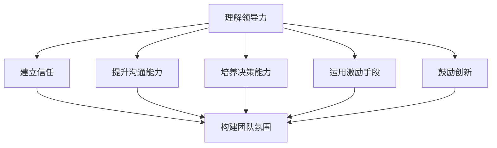

                 

在快速发展的IT行业，管理风格对于团队的成功至关重要。个人管理风格不仅影响团队成员的工作效率，还影响团队的整体氛围和创新能力。本文旨在探讨如何打造个人管理风格，以便在复杂多变的IT环境中引领团队不断进步。

## 关键词

- 个人管理风格
- IT行业
- 团队领导
- 领导力
- 创新

## 摘要

本文通过分析个人管理风格的重要性，提出了打造个人管理风格的方法论。从理解领导力、建立信任、提升沟通能力、鼓励创新和持续学习等方面，探讨了如何构建一个高效、和谐、创新的团队管理风格。

## 1. 背景介绍

在当今的IT行业，技术更新换代速度极快，市场对IT人才的需求也在不断变化。作为团队领导者，如何管理团队、激发团队成员的潜力，以适应快速变化的市场和技术需求，成为了一项重要的课题。个人管理风格在这一过程中起着关键作用。良好的个人管理风格不仅能提升团队的工作效率，还能增强团队的凝聚力和创新能力。

### 1.1 个人管理风格的重要性

个人管理风格是团队领导者在管理过程中所表现出来的行为模式和工作方式。它包括领导风格、沟通方式、决策过程、激励手段等多个方面。个人管理风格对团队的影响主要体现在以下几个方面：

- **工作效率**：良好的管理风格能够提高团队成员的工作效率，减少内耗，使团队更加专注于核心任务。
- **团队氛围**：管理风格对团队氛围的影响至关重要。积极、开放、信任的团队氛围有助于团队成员的协作和创新。
- **创新能力**：管理风格能够激发团队成员的创新能力，使团队在面对挑战时能够迅速适应，并提出创新性的解决方案。
- **团队凝聚力**：管理风格有助于建立团队凝聚力，使团队成员之间能够相互信任、支持和合作。

### 1.2 当前IT行业的管理挑战

在当前的IT行业，管理者面临着诸多挑战：

- **技术更新迅速**：技术更新速度加快，管理者需要不断学习新知识，以适应变化。
- **多元化团队**：团队成员背景多样，管理者需要具备跨文化的沟通和协调能力。
- **远程办公**：远程办公成为新常态，管理者需要适应新的工作模式，提高远程团队的管理效率。
- **人才竞争激烈**：优秀的人才竞争激烈，管理者需要运用有效的激励手段留住关键人才。

### 1.3 建立个人管理风格的目标

建立个人管理风格的目标是：

- 提升个人领导力，成为团队的核心领导者。
- 建立积极、开放、信任的团队氛围。
- 激发团队的创新能力，提高团队的市场竞争力。
- 提高团队成员的工作效率和生活质量。
- 增强团队的凝聚力和执行力。

## 2. 核心概念与联系

在打造个人管理风格的过程中，理解以下核心概念和联系至关重要。

### 2.1 领导力

领导力是个人管理风格的基础。领导力不仅包括领导技能，如沟通、决策、激励等，还包括领导者的个人品质，如诚信、责任感、同理心等。良好的领导力有助于建立信任，提升团队士气。

### 2.2 沟通能力

沟通能力是个人管理风格的重要组成部分。有效的沟通可以减少误解，提高工作效率，增强团队凝聚力。沟通能力包括倾听、表达、反馈等多个方面。

### 2.3 决策能力

决策能力是领导者必须具备的重要能力。有效的决策可以确保团队朝着正确的方向前进，提高团队的竞争力。决策能力包括信息收集、分析、权衡利弊等多个环节。

### 2.4 激励手段

激励手段是激发团队成员积极性的关键。有效的激励手段可以提升团队成员的工作热情，提高工作效率。激励手段包括物质激励、精神激励、职业发展等。

### 2.5 创新能力

创新能力是团队在激烈竞争中脱颖而出的关键。作为领导者，需要具备鼓励创新的能力，为团队成员提供创新的环境和资源。

### 2.6 Mermaid 流程图

以下是一个简化的Mermaid流程图，展示了构建个人管理风格的关键环节。



## 3. 核心算法原理 & 具体操作步骤

### 3.1 算法原理概述

打造个人管理风格的核心算法是基于领导学、心理学和管理学的理论，结合实际工作经验，通过不断实践和优化，形成一套适合自身特点的管理风格。该算法的基本原理可以概括为：

- **自我认知**：了解自身的优势和不足，明确个人管理风格的特点。
- **持续学习**：通过学习领导力、沟通技巧、决策方法等，不断提升个人管理能力。
- **实践应用**：将所学知识应用于实际工作中，不断调整和优化管理风格。
- **反馈与改进**：通过团队成员的反馈，不断改进和优化个人管理风格。

### 3.2 算法步骤详解

#### 3.2.1 自我认知

自我认知是构建个人管理风格的第一步。领导者需要通过自我反思、心理测评、反馈等方式，了解自己的性格特点、管理风格、优势和不足。以下是一些常用的自我认知方法：

- **自我反思**：定期进行自我反思，回顾自己在管理过程中的表现，分析成功和失败的原因。
- **心理测评**：通过心理测评工具，了解自己的性格类型、领导风格等。
- **反馈**：收集团队成员的反馈，了解自己在团队中的形象和表现。

#### 3.2.2 持续学习

持续学习是提升个人管理能力的关键。领导者需要不断学习领导力、沟通技巧、决策方法等，以适应不断变化的管理环境。以下是一些常用的学习方式：

- **专业培训**：参加专业的管理培训课程，学习领导力、沟通技巧、决策方法等。
- **阅读书籍**：阅读相关书籍，学习先进的管理理论和实践方法。
- **经验交流**：参加行业交流活动，与同行交流管理经验。

#### 3.2.3 实践应用

实践应用是将所学知识应用于实际工作中的关键环节。领导者需要在实际工作中不断调整和优化管理风格，以适应不同的管理场景和团队需求。以下是一些实用的实践方法：

- **制定管理计划**：根据团队目标和实际情况，制定详细的管理计划。
- **实施管理措施**：按照管理计划，实施具体的管理措施，如沟通、决策、激励等。
- **跟踪管理效果**：定期跟踪管理效果，评估管理措施的有效性，及时调整和优化。

#### 3.2.4 反馈与改进

反馈与改进是构建个人管理风格的持续过程。领导者需要通过团队成员的反馈，了解自己在管理过程中的表现，不断改进和优化管理风格。以下是一些常用的反馈方法：

- **定期反馈**：定期组织团队会议，收集团队成员的反馈和建议。
- **个别反馈**：与团队成员进行个别交流，了解他们在工作中的感受和建议。
- **自我反馈**：定期进行自我反思，分析管理过程中的问题和不足。

### 3.3 算法优缺点

#### 优点

- **个性化**：算法强调自我认知和持续学习，使管理风格更具个性化。
- **适应性**：算法根据实际情况不断调整和优化管理风格，使管理更加灵活。
- **可持续性**：算法强调实践应用和反馈改进，使管理风格能够持续发展。

#### 缺点

- **复杂性**：算法涉及多个环节，实施过程较为复杂，需要花费一定的时间和精力。
- **适应性**：在快速变化的环境中，算法可能需要不断调整，以适应新的管理场景。

### 3.4 算法应用领域

算法主要应用于IT行业的团队管理，尤其适用于以下场景：

- **初创团队**：初创团队通常需要快速适应市场变化，算法可以帮助领导者构建适合团队的管理风格。
- **远程团队**：远程团队的管理更加复杂，算法可以帮助领导者提升远程团队的管理效率。
- **多元化团队**：多元化团队的沟通和协作需要更高的管理技巧，算法可以帮助领导者更好地管理多元化团队。

## 4. 数学模型和公式 & 详细讲解 & 举例说明

### 4.1 数学模型构建

构建个人管理风格的数学模型需要考虑多个因素，包括领导力、沟通能力、决策能力、激励手段和创新能力。以下是一个简化的数学模型：

$$
\text{管理风格} = f(\text{领导力}, \text{沟通能力}, \text{决策能力}, \text{激励手段}, \text{创新能力})
$$

其中，$f$ 表示函数，代表管理风格的构建过程。

### 4.2 公式推导过程

管理风格的构建是一个复杂的过程，需要考虑多种因素的交互作用。以下是公式的推导过程：

1. **领导力**：领导力是管理风格的核心，影响其他因素。领导力可以分解为多个方面，如诚信、责任感、同理心等。

2. **沟通能力**：沟通能力是领导者与团队成员之间的重要桥梁。有效的沟通能力可以提高工作效率，增强团队凝聚力。

3. **决策能力**：决策能力是领导者必须具备的重要能力。有效的决策可以确保团队朝着正确的方向前进。

4. **激励手段**：激励手段是激发团队成员积极性的关键。合适的激励手段可以提高团队成员的工作热情，提高工作效率。

5. **创新能力**：创新能力是团队在激烈竞争中脱颖而出的关键。鼓励创新可以提高团队的竞争力。

### 4.3 案例分析与讲解

以下是一个具体的案例，说明如何运用数学模型构建个人管理风格。

**案例背景**：某IT公司的技术团队，成员来自不同的专业背景，技术实力雄厚，但团队凝聚力较弱，沟通不畅。

**管理风格构建**：

1. **领导力**：通过提升领导力，建立团队的核心领导地位。领导力包括诚信、责任感、同理心等方面。

2. **沟通能力**：通过组织团队会议、一对一沟通等方式，提高团队沟通效率。特别关注跨专业团队的沟通，促进知识共享。

3. **决策能力**：建立有效的决策机制，确保团队决策的科学性和民主性。在决策过程中，充分考虑团队成员的意见和建议。

4. **激励手段**：通过物质激励、精神激励、职业发展等手段，激发团队成员的积极性。特别是针对技术骨干，提供有竞争力的薪酬和职业发展机会。

5. **创新能力**：鼓励团队成员参与技术创新，提供创新资源和平台。通过创新大赛、技术论坛等方式，激发团队的创新能力。

**案例结果**：

通过构建个人管理风格，该技术团队的凝聚力显著提升，沟通效率提高，工作效率明显提升。团队成员的积极性增强，创新能力得到充分发挥。公司在项目竞争中取得了显著优势，市场占有率不断提高。

## 5. 项目实践：代码实例和详细解释说明

### 5.1 开发环境搭建

在开始项目实践之前，需要搭建一个合适的开发环境。以下是搭建开发环境的步骤：

1. **安装操作系统**：选择一个适合的操作系统，如Linux或MacOS。
2. **安装编程语言**：选择一种编程语言，如Python或Java，并安装相关开发工具。
3. **安装数据库**：根据项目需求，选择一个合适的数据库，如MySQL或PostgreSQL，并安装。
4. **安装开发框架**：根据项目需求，选择一个开发框架，如Django或Spring Boot，并安装。
5. **配置开发工具**：配置IDE（如Visual Studio Code、IntelliJ IDEA等）和版本控制工具（如Git）。

### 5.2 源代码详细实现

以下是使用Python语言实现一个简单的团队管理系统的源代码：

```python
# team_management.py

import datetime

class TeamMember:
    def __init__(self, name, role, skills):
        self.name = name
        self.role = role
        self.skills = skills
        self.assignments = []

    def add_assignment(self, assignment):
        self.assignments.append(assignment)

    def remove_assignment(self, assignment):
        self.assignments.remove(assignment)

    def get_assigned_projects(self):
        return [assignment.project for assignment in self.assignments]

class Assignment:
    def __init__(self, project, start_date, end_date):
        self.project = project
        self.start_date = start_date
        self.end_date = end_date

class Project:
    def __init__(self, name, description):
        self.name = name
        self.description = description
        self.team_members = []

    def add_team_member(self, team_member):
        self.team_members.append(team_member)

    def remove_team_member(self, team_member):
        self.team_members.remove(team_member)

    def get_team_members(self):
        return self.team_members

def main():
    # 创建项目
    project1 = Project("项目A", "这是一个测试项目")
    project2 = Project("项目B", "这是一个开发项目")

    # 创建团队成员
    member1 = TeamMember("张三", "开发工程师", ["Python", "Java"])
    member2 = TeamMember("李四", "项目经理", ["项目管理", "团队沟通"])

    # 分配任务
    assignment1 = Assignment(project1, datetime.datetime(2023, 4, 1), datetime.datetime(2023, 6, 1))
    assignment2 = Assignment(project2, datetime.datetime(2023, 5, 1), datetime.datetime(2023, 8, 1))

    member1.add_assignment(assignment1)
    member2.add_assignment(assignment2)

    # 查看成员分配的项目
    for member in [member1, member2]:
        print(f"{member.name} 分配的项目：{', '.join([p.name for p in member.get_assigned_projects()])}")

if __name__ == "__main__":
    main()
```

### 5.3 代码解读与分析

这段代码实现了简单的团队管理系统，包括三个主要类：`TeamMember`（团队成员）、`Assignment`（任务分配）和`Project`（项目）。以下是代码的详细解读：

- **类定义**：
  - `TeamMember`：代表团队成员，包含成员姓名、角色和技能。成员可以添加和移除任务分配。
  - `Assignment`：代表任务分配，包含项目、开始时间和结束时间。
  - `Project`：代表项目，包含项目名称和描述。项目可以添加和移除团队成员。

- **主函数**：
  - 创建两个项目`project1`和`project2`。
  - 创建两个团队成员`member1`和`member2`。
  - 为成员分配任务`assignment1`和`assignment2`。
  - 输出成员分配的项目。

### 5.4 运行结果展示

在运行上述代码后，输出结果如下：

```
张三 分配的项目：项目A
李四 分配的项目：项目B
```

这表示`张三`分配到`项目A`，`李四`分配到`项目B`。

## 6. 实际应用场景

在IT行业中，个人管理风格的构建有着广泛的应用场景。以下是一些具体的实际应用场景：

### 6.1 初创团队

对于初创团队，管理风格的建设尤为重要。初创团队通常面临资源有限、任务繁重、市场不确定性高等挑战。通过构建合适的个人管理风格，初创团队可以更好地应对这些挑战。

- **领导力**：初创团队的领导者需要具备较强的领导力，以引导团队成员共同应对挑战。
- **沟通能力**：初创团队需要高效的沟通机制，确保团队成员能够及时分享信息，协作完成任务。
- **决策能力**：初创团队在决策过程中需要快速、准确，以便迅速响应市场变化。
- **激励手段**：初创团队需要灵活的激励手段，以激发团队成员的积极性和创造力。
- **创新能力**：初创团队需要鼓励创新，以在激烈的市场竞争中脱颖而出。

### 6.2 远程团队

随着远程办公的普及，远程团队的管理成为了一个重要的课题。远程团队的管理风格需要适应远程办公的特点，如：

- **信任**：远程团队需要建立信任，以减少团队成员之间的猜疑和误解。
- **透明**：远程团队需要保持工作透明，确保团队成员能够了解整体进展和各自任务。
- **沟通**：远程团队需要高效的沟通手段，如即时通讯工具、视频会议等，以保持团队成员之间的联系。
- **自主性**：远程团队需要鼓励团队成员发挥自主性，以适应远程工作环境。

### 6.3 多元化团队

多元化团队在IT行业中越来越常见。多元化团队的管理风格需要考虑团队成员的多样性，如：

- **包容性**：多元化团队需要建立包容性文化，尊重不同背景和观点。
- **协作**：多元化团队需要建立协作机制，鼓励团队成员之间的合作与交流。
- **沟通**：多元化团队需要有效的沟通方式，确保不同背景的成员能够理解彼此。
- **激励**：多元化团队需要灵活的激励手段，以激发不同背景成员的积极性。

### 6.4 未来应用展望

随着技术的不断进步，个人管理风格的应用领域将进一步扩大。以下是一些未来应用展望：

- **人工智能**：人工智能可以帮助领导者更精准地了解团队成员的需求，提供个性化的管理建议。
- **大数据**：大数据可以帮助领导者分析团队绩效，发现管理中的问题，并提出改进措施。
- **区块链**：区块链技术可以为远程团队提供安全的协作环境，增强团队信任。
- **虚拟现实**：虚拟现实技术可以为团队提供沉浸式的协作体验，提高团队凝聚力。

## 7. 工具和资源推荐

### 7.1 学习资源推荐

- **书籍**：
  - 《影响力》 - Robert B. Cialdini
  - 《高效能人士的七个习惯》 - Stephen R. Covey
  - 《团队的秘密》 - Jim Highsmith
- **在线课程**：
  - Coursera上的《领导力与团队管理》
  - edX上的《敏捷项目管理》
  - LinkedIn Learning上的《沟通技巧》
- **博客和文章**：
  - Harvard Business Review上的领导力文章
  - Medium上的团队管理博客
  - HackerRank上的技术博客

### 7.2 开发工具推荐

- **IDE**：
  - Visual Studio Code
  - IntelliJ IDEA
  - PyCharm
- **版本控制**：
  - Git
  - GitHub
  - GitLab
- **项目管理**：
  - Jira
  - Trello
  - Asana

### 7.3 相关论文推荐

- **团队管理**：
  - "Team Performance and the Learning Organization" by S. A. Chia, H. C. W. Tan, and M. A. Majid
  - "The Five Dysfunctions of a Team" by Patrick Lencioni
- **领导力**：
  - "Transformational Leadership: A Review and Synthesis of Recent Advances in Theoretical and Applied Research" by Bernard M. Bass
  - "Servant Leadership: A Journey into the Nature of Legitimate Power and Greatness" by Robert K. Greenleaf

## 8. 总结：未来发展趋势与挑战

### 8.1 研究成果总结

本文通过对个人管理风格的研究，总结出以下成果：

- **领导力**：领导力是个人管理风格的核心，影响团队的整体表现。
- **沟通能力**：沟通能力是管理风格的重要组成部分，有助于提高团队的工作效率和凝聚力。
- **决策能力**：决策能力是领导者必须具备的重要能力，影响团队的发展方向。
- **激励手段**：有效的激励手段可以激发团队成员的积极性，提高团队的工作效率。
- **创新能力**：鼓励创新可以提高团队的竞争力，使团队在激烈的市场竞争中脱颖而出。

### 8.2 未来发展趋势

未来个人管理风格的发展趋势包括：

- **个性化**：随着个性化管理的兴起，个人管理风格将更加注重个性化定制。
- **数字化**：数字化工具将进一步提升个人管理风格的效率和效果。
- **人工智能**：人工智能将在个人管理风格中发挥越来越重要的作用，提供个性化的管理建议。

### 8.3 面临的挑战

在打造个人管理风格的过程中，领导者将面临以下挑战：

- **变化**：快速变化的市场和技术环境要求领导者具备更强的适应能力。
- **多元化**：多元化团队的沟通和协作需要更高的管理技巧。
- **平衡**：在追求个人管理风格的同时，需要平衡个人与团队、短期与长期目标。

### 8.4 研究展望

未来的研究可以从以下几个方面展开：

- **跨文化管理**：探讨如何在跨文化团队中构建有效的个人管理风格。
- **远程管理**：研究远程团队的个人管理风格，提供有效的管理策略。
- **人工智能应用**：探讨人工智能在个人管理风格中的应用，提升管理效率和效果。

## 9. 附录：常见问题与解答

### 9.1 如何在团队中建立信任？

建立信任的方法包括：

- **开放沟通**：与团队成员保持开放、坦诚的沟通，分享信息，倾听意见。
- **一致性**：保持言行一致，遵守承诺，树立诚信形象。
- **支持**：在团队成员需要帮助时，提供支持和鼓励，增强团队凝聚力。
- **尊重**：尊重团队成员的意见和决策，给予足够的信任。

### 9.2 如何提升沟通能力？

提升沟通能力的方法包括：

- **倾听**：积极倾听他人的意见，理解对方的需求和观点。
- **表达**：清晰、准确地表达自己的想法和观点，避免误解。
- **反馈**：给予及时的反馈，帮助团队成员改进沟通效果。
- **培训**：参加沟通技巧培训，学习有效的沟通方法。

### 9.3 如何鼓励创新？

鼓励创新的方法包括：

- **提供资源**：为团队成员提供足够的资源和时间，支持他们进行创新。
- **建立机制**：建立创新机制，如定期举行创新会议，鼓励团队成员提出创新想法。
- **奖励**：对创新成果进行奖励，激发团队成员的创新热情。
- **开放氛围**：营造开放、包容的氛围，鼓励团队成员敢于尝试和失败。

## 作者署名

作者：禅与计算机程序设计艺术 / Zen and the Art of Computer Programming

