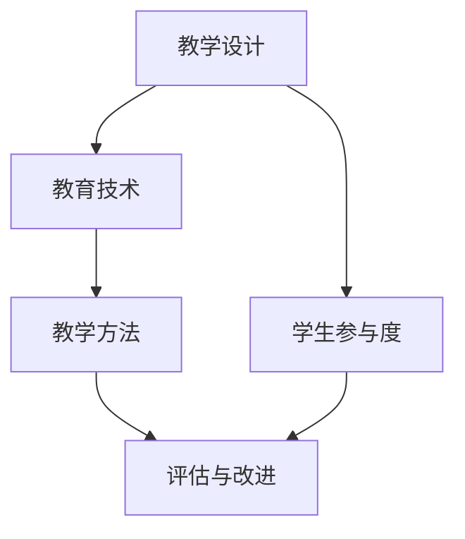

                 

关键词：优质课程、教学设计、学生参与度、教育技术、评估与改进

> 摘要：本文将探讨打造优质课程的核心要素，从教学设计、学生参与度、教育技术应用、评估与改进等多个方面，深入分析并总结出一套有效的教学策略，旨在为教育工作者提供具有实际操作意义的指导。

## 1. 背景介绍

在当今快速发展的信息化时代，教育作为国家发展的重要基石，正经历着前所未有的变革。传统教学模式受到严峻挑战，教育工作者亟需找到新的方法来提升教学质量，培养具有创新能力和实践能力的新一代人才。打造优质课程成为教育改革的关键所在。

### 1.1 教育改革与课程建设的必要性

教育改革是推动教育发展的必然选择。通过改革，可以打破陈旧的教育模式，引入先进的教育理念和教学方法，提高教学效果。课程建设作为教育改革的重要组成部分，其质量直接关系到学生的学业成就和未来发展。

### 1.2 优质课程的标准与特征

优质课程通常具备以下特征：内容丰富、结构合理、方法先进、教学效果显著。在内容上，优质课程应紧跟时代发展，体现学科的前沿性和实用性；在结构上，课程设计应层次分明，有助于学生循序渐进地掌握知识；在教学方法上，应灵活多样，激发学生的兴趣和主动性；在教学效果上，应能够有效提升学生的综合素质和创新能力。

## 2. 核心概念与联系

在打造优质课程的过程中，理解并应用一些核心概念和原理是非常重要的。以下是几个关键概念及其相互联系：

### 2.1 教学设计与学生参与度

教学设计是课程建设的核心，它涉及课程内容的选择、教学目标的设定、教学策略的制定等。一个优秀的教学设计能够引导学生积极参与课堂，提高学习效果。学生参与度则是指学生在学习过程中主动参与的意愿和程度，它是衡量教学效果的重要指标。

### 2.2 教育技术与教学方法

教育技术是指利用现代信息技术手段支持教学和学习的过程。合理运用教育技术可以丰富教学手段，提高教学效率。教学方法则是实现教学目标的途径，它包括讲授、讨论、实验、项目学习等多种形式。教育技术与教学方法的结合，能够更好地满足学生的个性化需求，提高教学质量。

### 2.3 评估与改进

评估是课程建设中不可或缺的一环。通过评估，可以了解教学效果，发现存在的问题，为改进课程提供依据。改进则是对评估结果的分析和应用，旨在不断提升课程质量。评估与改进相互促进，形成良性循环，有助于打造出真正优质的课程。

### 2.4 Mermaid 流程图

下面是一个简单的 Mermaid 流程图，展示了这些核心概念之间的联系：



## 3. 核心算法原理 & 具体操作步骤

### 3.1 算法原理概述

在课程建设中，算法原理的应用主要体现在教学设计的优化和学生参与度的提升上。教学设计的优化算法通常包括以下步骤：

1. **需求分析**：了解学生和课程需求，明确教学目标。
2. **内容选择**：根据需求选择合适的课程内容。
3. **结构设计**：设计课程结构，确保内容的层次性和连贯性。
4. **策略制定**：制定教学策略，包括教学方法、教学媒介等。

学生参与度提升算法则侧重于如何激发学生的主动性和参与感。具体操作步骤包括：

1. **兴趣引导**：通过多样化的教学手段和内容，激发学生的兴趣。
2. **参与机制**：建立参与机制，鼓励学生积极参与课堂讨论和实践。
3. **反馈机制**：及时给予学生反馈，增强其参与的信心和动力。

### 3.2 算法步骤详解

**教学设计优化算法步骤：**

1. **需求分析**：
   - 通过问卷调查、访谈等方式收集学生和教师的需求。
   - 分析课程目标与教学资源的匹配度。

2. **内容选择**：
   - 结合学科前沿和行业需求，选择具有实用性和前瞻性的课程内容。
   - 注重理论与实践的结合，提高课程的实用性。

3. **结构设计**：
   - 设计课程大纲，明确各个模块的学习目标和内容。
   - 确保课程内容的连贯性和层次性，使学生能够逐步深入理解。

4. **策略制定**：
   - 根据课程目标和内容，选择适合的教学方法。
   - 结合教育技术，利用多媒体、网络资源等手段，丰富教学形式。

**学生参与度提升算法步骤：**

1. **兴趣引导**：
   - 利用故事化、情境化的教学手段，激发学生的兴趣。
   - 通过案例分析、项目驱动等方式，让学生在实践中感受学习的乐趣。

2. **参与机制**：
   - 建立小组讨论、课堂互动等机制，鼓励学生主动参与课堂。
   - 设计课程作业和项目，让学生在实践中体验成就感。

3. **反馈机制**：
   - 及时反馈学生的学习情况，鼓励学生积极参与。
   - 通过教师评价、同学评价等方式，给予学生多元反馈。

### 3.3 算法优缺点

**教学设计优化算法的优点：**
- 能够提高课程内容的实用性和前瞻性。
- 有助于提升学生的学习效果和兴趣。

**教学设计优化算法的缺点：**
- 需要大量的前期准备和数据分析工作。
- 可能需要较长时间来验证其效果。

**学生参与度提升算法的优点：**
- 能够有效激发学生的学习兴趣和主动性。
- 有助于培养学生的团队协作和沟通能力。

**学生参与度提升算法的缺点：**
- 需要教师具备较高的教学技能和沟通能力。
- 可能会对教学进度产生一定影响。

### 3.4 算法应用领域

**教学设计优化算法：**
- 高等教育课程设计
- 职业培训课程开发
- 线上课程内容优化

**学生参与度提升算法：**
- 课堂教学管理
- 课外实践活动设计
- 在线教育平台互动设计

## 4. 数学模型和公式 & 详细讲解 & 举例说明

### 4.1 数学模型构建

在课程建设中，数学模型的应用可以帮助我们更科学地分析和优化教学过程。以下是两个典型的数学模型：

**1. 学习曲线模型：**

学习曲线模型描述了学生在学习过程中技能提升的速度。其基本公式为：

$$
y = a \cdot e^{-bx}
$$

其中，\(y\) 表示技能水平，\(a\) 和 \(b\) 为常数，分别表示初始技能水平和技能衰退速度。

**2. 教学效果评估模型：**

教学效果评估模型用于衡量教学活动的效果。其基本公式为：

$$
TE = \frac{R}{I}
$$

其中，\(TE\) 表示教学效果，\(R\) 表示学生学业成绩，\(I\) 表示教学投入。

### 4.2 公式推导过程

**学习曲线模型的推导：**

假设学生在学习过程中，技能水平的变化受到两个因素的影响：初始技能水平和学习效率。设初始技能水平为 \(a\)，学习效率为 \(b\)，则学生在时间 \(t\) 的技能水平为：

$$
y = a + bt
$$

由于学习效率是随时间衰减的，因此引入衰减因子 \(e^{-bx}\)，得到：

$$
y = a \cdot e^{-bx}
$$

**教学效果评估模型的推导：**

教学效果评估模型基于以下假设：教学投入 \(I\) 和学生学业成绩 \(R\) 成正比。设教学投入为单位教学时间，学生学业成绩为实际得分，则：

$$
TE = \frac{R}{I}
$$

### 4.3 案例分析与讲解

**案例一：学习曲线模型的应用**

假设某学生在学习编程语言，其初始技能水平 \(a = 50\)，学习效率 \(b = 0.1\)。在第一个月（\(t = 1\)），学生的技能水平为：

$$
y = 50 \cdot e^{-0.1 \cdot 1} \approx 45.5
$$

在第三个月（\(t = 3\)），学生的技能水平为：

$$
y = 50 \cdot e^{-0.1 \cdot 3} \approx 37.8
$$

通过学习曲线模型，可以看出学生在前三个月技能水平提升较快，之后逐渐趋于稳定。

**案例二：教学效果评估模型的应用**

假设某教师在一堂课的教学投入 \(I = 60\) 分钟，学生实际得分 \(R = 80\) 分，则教学效果 \(TE\) 为：

$$
TE = \frac{80}{60} \approx 1.33
$$

这意味着该教师的教学效果较好，学生的学业成绩与其教学投入基本匹配。

## 5. 项目实践：代码实例和详细解释说明

### 5.1 开发环境搭建

在本项目中，我们将使用 Python 作为开发语言，搭建一个简单的教学效果评估系统。首先，需要安装 Python 解释器和相关库，如 Pandas、NumPy 和 Matplotlib 等。

```bash
pip install python
pip install pandas
pip install numpy
pip install matplotlib
```

### 5.2 源代码详细实现

以下是一个简单的教学效果评估系统实现：

```python
import pandas as pd
import numpy as np
import matplotlib.pyplot as plt

# 数据预处理
def preprocess_data(data):
    data['TE'] = data['R'] / data['I']
    return data

# 绘制学习曲线
def plot_learning_curve(data, x_label, y_label):
    plt.scatter(data[x_label], data['y'])
    plt.xlabel(x_label)
    plt.ylabel(y_label)
    plt.title('Learning Curve')
    plt.show()

# 主函数
def main():
    # 读取数据
    data = pd.read_csv('data.csv')

    # 数据预处理
    data = preprocess_data(data)

    # 绘制学习曲线
    plot_learning_curve(data, 'x', 'y')

if __name__ == '__main__':
    main()
```

### 5.3 代码解读与分析

**1. 数据预处理：**

数据预处理函数 `preprocess_data` 用于计算教学效果 \(TE\)。具体实现中，我们将学生得分 \(R\) 除以教学投入 \(I\)，得到 \(TE\)。

**2. 绘制学习曲线：**

绘制学习曲线函数 `plot_learning_curve` 用于绘制学生在不同时间点的技能水平。具体实现中，我们使用散点图展示学生在时间 \(x\) 的技能水平 \(y\)。

**3. 主函数：**

主函数 `main` 负责读取数据、预处理数据和绘制学习曲线。具体实现中，我们首先读取数据，然后调用 `preprocess_data` 和 `plot_learning_curve` 函数完成数据处理和可视化。

### 5.4 运行结果展示

运行上述代码后，系统会自动读取数据并绘制学习曲线。通过观察学习曲线，我们可以直观地了解学生在不同时间点的技能水平变化。


## 6. 实际应用场景

### 6.1 高等教育课程设计

在高等教育课程设计中，打造优质课程是提升教育质量的关键。通过运用本文提到的教学设计优化算法和学生参与度提升算法，教师可以更好地满足学生的需求，提高教学效果。例如，在计算机科学课程中，教师可以结合前沿技术，设计项目驱动型课程，激发学生的兴趣和主动性。

### 6.2 职业培训课程开发

职业培训课程通常面向特定行业和岗位，对课程质量和实用性有较高要求。通过应用教学设计优化算法和学生参与度提升算法，职业培训课程可以更好地满足学员的需求，提高培训效果。例如，在编程培训中，教师可以设计实战项目，让学员在实战中提升技能。

### 6.3 在线教育平台互动设计

在线教育平台需要关注学生参与度和教学效果，通过优化教学设计和引入教育技术，可以提高平台的教学质量。例如，在在线课程中，教师可以利用互动直播、在线讨论等功能，增强学生的参与感，提高教学效果。

## 7. 未来应用展望

### 7.1 人工智能在教育中的应用

随着人工智能技术的发展，教育领域有望迎来新的变革。例如，通过智能推荐系统，可以为学生提供个性化学习路径；通过自然语言处理技术，可以实现智能问答和自动批改作业，提高教学效率。

### 7.2 跨学科课程设计

未来课程设计将更加注重跨学科融合，培养学生的综合能力和创新能力。例如，将计算机科学、心理学、教育学等学科相结合，设计出更符合时代需求的新课程。

### 7.3 在线教育平台的持续优化

在线教育平台将不断优化教学体验，提高教学质量。例如，通过虚拟现实技术，可以实现沉浸式学习，提高学生的学习兴趣和参与度。

## 8. 总结：未来发展趋势与挑战

### 8.1 研究成果总结

本文通过深入分析教学设计、学生参与度、教育技术应用等多个方面，提出了一套打造优质课程的核心要素。这些要素包括教学设计优化算法、学生参与度提升算法、教育技术应用等，为教育工作者提供了具有实际操作意义的指导。

### 8.2 未来发展趋势

未来，教育领域将继续向信息化、智能化、个性化方向发展。通过引入人工智能、大数据等技术，教育工作者可以更好地了解学生需求，提高教学效果。同时，跨学科融合将成为教育改革的重要方向，培养具有创新能力和实践能力的新一代人才。

### 8.3 面临的挑战

尽管教育领域的发展前景广阔，但同时也面临着一系列挑战。例如，如何确保教育技术的合理应用，避免过度依赖技术导致的“教育空洞”；如何提高教师的数字素养，适应教育信息化的发展等。

### 8.4 研究展望

未来，我们将继续深入研究教育技术在教学中的应用，探索更有效的教学方法，提高教育质量。同时，关注跨学科融合，推动教育创新，为培养新一代人才贡献力量。

## 9. 附录：常见问题与解答

### 9.1 如何进行有效的教学设计？

**解答：** 教学设计的关键在于了解学生需求，明确教学目标。具体步骤包括：需求分析、内容选择、结构设计和策略制定。在需求分析阶段，可以通过问卷调查、访谈等方式收集学生和教师的需求；在内容选择阶段，要结合学科前沿和行业需求，选择具有实用性和前瞻性的内容；在结构设计阶段，要确保课程内容的层次性和连贯性；在策略制定阶段，要选择适合的教学方法，并利用教育技术丰富教学手段。

### 9.2 如何提升学生参与度？

**解答：** 提升学生参与度可以从以下几个方面入手：

1. **兴趣引导**：通过多样化的教学手段和内容，激发学生的兴趣。
2. **参与机制**：建立小组讨论、课堂互动等机制，鼓励学生主动参与课堂。
3. **反馈机制**：及时给予学生反馈，增强其参与的信心和动力。
4. **实践应用**：设计项目和实践，让学生在实践中体验成就感。
5. **个性化教学**：关注学生个体差异，提供个性化的学习支持。

### 9.3 教育技术与教学方法的结合有哪些形式？

**解答：** 教育技术与教学方法的结合形式多种多样，主要包括：

1. **多媒体教学**：利用图片、音频、视频等多媒体手段，丰富教学内容。
2. **在线教学**：通过互联网平台，实现远程教学和在线互动。
3. **虚拟实验室**：利用虚拟现实技术，模拟实际实验场景，提高实践能力。
4. **互动教学**：利用在线讨论、直播课堂等形式，增强学生参与感和互动性。
5. **个性化学习**：根据学生学习特点和需求，提供个性化的学习路径和资源。

**作者：禅与计算机程序设计艺术 / Zen and the Art of Computer Programming**

