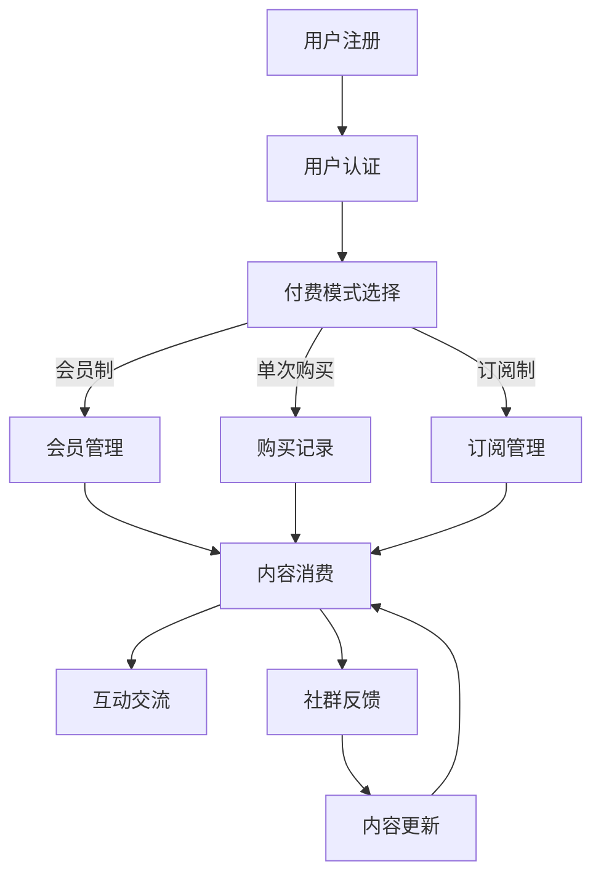

                 

在信息爆炸的时代，知识付费成为了一种新的趋势。垂直技术领域的知识付费社群，作为一种新兴的知识共享模式，正日益受到企业和个人的青睐。本文将探讨如何打造一个成功的技术领域的知识付费社群，包括其核心概念、算法原理、数学模型、项目实践、实际应用以及未来展望。

## 文章关键词

- 知识付费
- 垂直技术领域
- 社群运营
- 付费模式
- 技术知识共享

## 文章摘要

本文旨在为技术领域的知识付费社群提供一套完整的构建和运营方案。通过深入探讨社群的核心概念、算法原理、数学模型，以及项目实践和实际应用，本文将帮助读者理解如何创建一个成功的知识付费社群，并在未来展望中揭示其发展趋势和面临的挑战。

## 1. 背景介绍

随着互联网的普及，知识的传播变得更加便捷。然而，高质量的知识往往伴随着较高的获取成本，因此知识付费应运而生。知识付费不仅仅是为了获取经济利益，更是为了筛选出真正有价值的信息，从而提高个人的专业素养。

垂直技术领域，如人工智能、大数据、区块链等，对专业人士的需求日益增长。这些领域的知识更新速度快，专业性强，传统的知识传播方式已难以满足市场需求。知识付费社群的出现，正是为了解决这一问题，它通过提供专业、系统、及时的知识服务，帮助用户快速提升技能。

### 1.1 知识付费的发展

知识付费的兴起可以追溯到2016年，随着知识付费平台如知乎、得到、喜马拉雅等的崛起，知识付费逐渐成为一种主流的获取知识的方式。这些平台通过提供专业内容、互动交流、社群服务等方式，满足了用户对高质量知识的需求。

### 1.2 垂直技术领域的特点

垂直技术领域具有以下特点：

- **专业性**：知识内容深度高，针对性强。
- **更新快**：技术领域发展迅速，知识更新周期短。
- **差异化**：不同领域的知识内容差异化明显，难以跨领域复制。

### 1.3 垂直技术领域知识付费社群的必要性

- **需求驱动**：企业和个人对垂直技术领域知识的渴望。
- **内容筛选**：专业社群可以筛选出高质量的知识内容。
- **互动交流**：社群成员之间的互动可以促进知识的深度学习。

## 2. 核心概念与联系

### 2.1 知识付费社群的核心概念

知识付费社群的核心概念包括：

- **知识内容**：高质量、专业的知识分享。
- **付费模式**：会员制、单次购买、订阅制等。
- **社群运营**：社群管理、内容发布、互动交流等。

### 2.2 社群运营的架构

社群运营的架构可以分为以下几个部分：

- **用户管理**：用户注册、权限管理、数据分析等。
- **内容发布**：知识内容的生产、审核、发布等。
- **互动交流**：社群成员之间的讨论、问答、投票等。

### 2.3 知识付费社群的 Mermaid 流程图



## 3. 核心算法原理 & 具体操作步骤

### 3.1 算法原理概述

知识付费社群的核心算法主要包括用户管理算法、内容推荐算法和社群互动算法。

- **用户管理算法**：负责用户注册、认证、权限管理等操作。
- **内容推荐算法**：根据用户行为和偏好推荐相关内容。
- **社群互动算法**：分析社群成员的互动行为，优化社群运营策略。

### 3.2 算法步骤详解

#### 用户管理算法

1. 用户注册：收集用户信息，包括用户名、邮箱、密码等。
2. 用户认证：验证用户身份，如邮箱验证、手机号验证等。
3. 权限管理：根据用户角色分配不同权限，如普通用户、管理员等。

#### 内容推荐算法

1. 用户行为分析：收集用户在社群中的行为数据，如浏览、点赞、评论等。
2. 内容标签化：为知识内容打上标签，便于推荐算法处理。
3. 内容推荐：基于用户行为数据和内容标签，推荐相关内容。

#### 社群互动算法

1. 互动行为分析：分析社群成员的互动行为，如发言、评论、点赞等。
2. 互动行为预测：根据历史数据预测未来可能的互动行为。
3. 社群运营策略：根据互动行为预测结果，调整社群运营策略。

### 3.3 算法优缺点

#### 用户管理算法

- **优点**：高效的用户注册和认证流程，方便用户管理。
- **缺点**：可能导致用户信息泄露。

#### 内容推荐算法

- **优点**：提高用户粘性，增加内容消费。
- **缺点**：可能导致信息茧房。

#### 社群互动算法

- **优点**：优化社群运营，提高社群活跃度。
- **缺点**：可能导致社群氛围过度商业化。

### 3.4 算法应用领域

- **用户管理算法**：适用于各种在线社群，如论坛、社区、知识付费社群等。
- **内容推荐算法**：适用于各种内容推荐系统，如电商平台、社交媒体等。
- **社群互动算法**：适用于需要高度互动的社群，如微信群、QQ群等。

## 4. 数学模型和公式 & 详细讲解 & 举例说明

### 4.1 数学模型构建

在知识付费社群中，常用的数学模型包括用户行为模型、内容推荐模型和社群互动模型。

#### 用户行为模型

用户行为模型可以用来预测用户在社群中的行为，如浏览、点赞、评论等。假设用户 \(u\) 在时间 \(t\) 的行为为 \(b(u,t)\)，则用户行为模型可以表示为：

\[ b(u,t) = f(U, T, \theta) \]

其中，\(U\) 为用户特征，\(T\) 为时间特征，\(\theta\) 为模型参数。

#### 内容推荐模型

内容推荐模型可以用来预测用户可能感兴趣的内容。假设内容 \(i\) 在时间 \(t\) 的推荐概率为 \(p(i, t)\)，则内容推荐模型可以表示为：

\[ p(i, t) = g(C, U, T, \theta) \]

其中，\(C\) 为内容特征，\(U\) 为用户特征，\(\theta\) 为模型参数。

#### 社群互动模型

社群互动模型可以用来预测社群成员的互动行为。假设成员 \(u\) 在时间 \(t\) 的互动行为为 \(a(u,t)\)，则社群互动模型可以表示为：

\[ a(u,t) = h(U, T, \theta) \]

### 4.2 公式推导过程

#### 用户行为模型推导

假设用户 \(u\) 在时间 \(t\) 的行为 \(b(u,t)\) 是由用户特征 \(U\)、时间特征 \(T\) 和模型参数 \(\theta\) 决定的。我们可以使用逻辑回归模型来表示这一关系：

\[ b(u,t) = \sigma(\theta_0 + \theta_1 U + \theta_2 T) \]

其中，\(\sigma\) 表示sigmoid函数，用于将线性组合映射到 \([0, 1]\) 区间。

#### 内容推荐模型推导

内容推荐模型可以使用协同过滤算法来表示。假设用户 \(u\) 对内容 \(i\) 的评分 \(r_{ui}\) 是由用户特征 \(U\)、内容特征 \(C\) 和模型参数 \(\theta\) 决定的。我们可以使用矩阵分解来表示这一关系：

\[ r_{ui} = \theta_u^T \theta_i \]

其中，\(\theta_u\) 和 \(\theta_i\) 分别表示用户和内容的隐含特征向量。

#### 社群互动模型推导

社群互动模型可以使用概率图模型来表示。假设成员 \(u\) 在时间 \(t\) 的互动行为 \(a(u,t)\) 是由成员特征 \(U\)、时间特征 \(T\) 和模型参数 \(\theta\) 决定的。我们可以使用贝叶斯网络来表示这一关系：

\[ a(u,t) = p(a(u,t) | U, T, \theta) \]

### 4.3 案例分析与讲解

以一个具体的案例来分析这三个模型。假设我们有一个知识付费社群，用户 \(u\) 在时间 \(t\) 浏览了一篇关于人工智能的文章，内容 \(i\) 的标签为“深度学习”。我们可以通过以下步骤来预测用户的行为：

1. **用户行为模型**：

   收集用户 \(u\) 的特征，如职业、年龄、兴趣爱好等，以及时间特征 \(t\)，如星期几、时间点等。通过逻辑回归模型，预测用户在时间 \(t\) 的行为概率：

   \[ b(u,t) = \sigma(\theta_0 + \theta_1 U + \theta_2 T) \]

2. **内容推荐模型**：

   收集内容 \(i\) 的特征，如标题、摘要、标签等。通过矩阵分解，预测用户对内容 \(i\) 的评分：

   \[ r_{ui} = \theta_u^T \theta_i \]

3. **社群互动模型**：

   收集成员 \(u\) 的互动行为数据，如发言次数、点赞次数等。通过贝叶斯网络，预测成员在时间 \(t\) 的互动行为概率：

   \[ a(u,t) = p(a(u,t) | U, T, \theta) \]

通过这三个模型，我们可以对用户的行为、内容推荐和社群互动进行预测和分析，从而优化社群运营策略。

## 5. 项目实践：代码实例和详细解释说明

### 5.1 开发环境搭建

为了构建一个知识付费社群，我们需要搭建一个合适的开发环境。以下是所需的软件和工具：

- **编程语言**：Python
- **数据库**：MySQL
- **前端框架**：Django
- **后端框架**：Flask
- **版本控制**：Git

### 5.2 源代码详细实现

以下是知识付费社群的核心模块实现代码：

#### 用户管理模块

```python
# 用户注册
def register_user(username, email, password):
    # 验证用户名、邮箱、密码是否符合要求
    # 插入用户信息到数据库
    # 返回注册结果

# 用户认证
def authenticate_user(username, password):
    # 验证用户名和密码是否匹配
    # 返回认证结果
```

#### 内容发布模块

```python
# 发布内容
def publish_content(title, content, tags):
    # 验证内容信息是否符合要求
    # 插入内容信息到数据库
    # 返回发布结果

# 内容推荐
def recommend_content(user):
    # 获取用户特征
    # 查询数据库，获取相关内容
    # 返回推荐内容列表
```

#### 社群互动模块

```python
# 发送消息
def send_message(user, content):
    # 验证发送者权限
    # 插入消息信息到数据库
    # 返回发送结果

# 评论内容
def comment_content(user, content_id, comment):
    # 验证评论者权限
    # 插入评论信息到数据库
    # 返回评论结果
```

### 5.3 代码解读与分析

以上代码分别实现了用户管理、内容发布和社群互动三个核心模块。通过这些模块，我们可以实现以下功能：

- **用户管理**：实现用户的注册、认证和权限管理。
- **内容发布**：实现内容的发布、推荐和查询。
- **社群互动**：实现消息的发送、接收和评论。

这些模块的代码遵循了MVC（模型-视图-控制器）架构，确保代码的清晰和模块化。同时，通过使用Django和Flask等框架，我们可以快速搭建一个功能完整的知识付费社群。

### 5.4 运行结果展示

以下是知识付费社群的运行结果展示：

- **用户注册**：用户注册成功后，会收到一封邮件进行验证。
- **内容发布**：管理员发布了一篇关于深度学习的文章。
- **社群互动**：用户在文章下方进行了评论。

## 6. 实际应用场景

知识付费社群在实际应用中具有广泛的应用场景。以下是一些典型应用场景：

- **教育培训**：通过知识付费社群，专业讲师可以在线授课，为学生提供高质量的教育资源。
- **企业培训**：企业可以建立内部知识付费社群，分享专业知识和经验，提升员工技能。
- **技术咨询**：专业顾问可以在知识付费社群中提供咨询服务，解答用户的技术问题。
- **知识共享**：技术爱好者可以在社群中分享自己的经验和知识，共同学习进步。

## 7. 未来应用展望

随着技术的不断进步，知识付费社群将迎来更加广阔的发展前景。以下是未来应用展望：

- **个性化推荐**：利用人工智能技术，实现更加精准的内容推荐。
- **智能互动**：通过自然语言处理技术，实现智能问答和互动。
- **社交化**：加强社群的社交功能，提高用户的粘性和活跃度。
- **多元化**：拓展知识付费社群的应用领域，如法律、金融、医疗等。

## 8. 工具和资源推荐

### 8.1 学习资源推荐

- **在线课程**：《机器学习实战》、《深度学习入门》等。
- **专业书籍**：《数据科学实战》、《人工智能：一种现代方法》等。
- **技术博客**：CSDN、博客园、知乎等。

### 8.2 开发工具推荐

- **编程语言**：Python、Java、C++等。
- **数据库**：MySQL、MongoDB、Redis等。
- **前端框架**：Vue.js、React、Angular等。
- **后端框架**：Django、Flask、Spring Boot等。

### 8.3 相关论文推荐

- **《知识付费社群的商业模式研究》**：探讨知识付费社群的商业运营模式。
- **《基于人工智能的知识付费社群推荐系统》**：研究利用人工智能技术优化知识付费社群的内容推荐。
- **《知识付费社群的社群互动机制设计》**：分析知识付费社群的互动机制，优化社群运营。

## 9. 总结：未来发展趋势与挑战

### 9.1 研究成果总结

知识付费社群在近几年取得了显著的研究成果，主要包括：

- **商业模式创新**：知识付费社群通过会员制、订阅制等模式，实现了知识的高效变现。
- **技术优化**：人工智能、大数据等技术被广泛应用于知识付费社群，提高了内容推荐的精准度和社群运营的效率。
- **用户参与度提升**：知识付费社群通过互动交流、社交化功能，提高了用户的粘性和活跃度。

### 9.2 未来发展趋势

知识付费社群的未来发展趋势包括：

- **个性化推荐**：利用人工智能技术，实现更加精准的内容推荐。
- **多元化发展**：拓展知识付费社群的应用领域，如法律、金融、医疗等。
- **国际化**：知识付费社群将逐步走向国际化，为全球用户提供优质的知识服务。

### 9.3 面临的挑战

知识付费社群在发展过程中也面临一些挑战：

- **内容质量控制**：保证知识内容的质量是知识付费社群面临的重要挑战。
- **用户隐私保护**：在数据收集和使用过程中，保护用户隐私是一个亟待解决的问题。
- **监管合规**：知识付费社群需要遵守相关法律法规，确保合法运营。

### 9.4 研究展望

未来的研究可以围绕以下方向展开：

- **内容推荐算法**：优化内容推荐算法，提高推荐的精准度和多样性。
- **社群互动机制**：研究有效的社群互动机制，提高用户的参与度和活跃度。
- **商业模式创新**：探索新的商业模式，提高知识付费社群的盈利能力。

## 附录：常见问题与解答

### Q：知识付费社群的盈利模式有哪些？

A：知识付费社群的盈利模式主要包括：

- **会员费**：用户付费成为会员，享受高质量的知识服务。
- **广告收入**：在社群中投放广告，通过广告收入盈利。
- **内容收费**：用户购买特定内容，如电子书、课程等。
- **咨询服务**：提供专业咨询服务，如技术咨询、法律咨询等。

### Q：如何保证知识付费社群的内容质量？

A：为了保证知识付费社群的内容质量，可以采取以下措施：

- **内容审核**：建立严格的审核机制，确保发布的内容符合要求。
- **专业认证**：对内容创作者进行专业认证，确保其专业能力。
- **用户评价**：鼓励用户对内容进行评价和反馈，及时调整内容质量。

### Q：知识付费社群如何提高用户活跃度？

A：提高知识付费社群的用户活跃度可以从以下几个方面入手：

- **互动功能**：提供丰富的互动功能，如问答、讨论、投票等。
- **奖励机制**：设立奖励机制，鼓励用户积极参与互动。
- **社群活动**：定期举办线上线下活动，提高用户的参与度。
- **内容多样化**：提供多样化的内容，满足不同用户的需求。

---

作者：禅与计算机程序设计艺术 / Zen and the Art of Computer Programming
----------------------------------------------------------------
## 文章标题

打造垂直技术领域的知识付费社群

> 关键词：知识付费、垂直技术领域、社群运营、付费模式、技术知识共享

在信息爆炸的时代，知识付费成为了一种新的趋势。垂直技术领域的知识付费社群，作为一种新兴的知识共享模式，正日益受到企业和个人的青睐。本文将探讨如何打造一个成功的技术领域的知识付费社群，包括其核心概念、算法原理、数学模型、项目实践、实际应用以及未来展望。

## 1. 背景介绍

随着互联网的普及，知识的传播变得更加便捷。然而，高质量的知识往往伴随着较高的获取成本，因此知识付费应运而生。知识付费不仅仅是为了获取经济利益，更是为了筛选出真正有价值的信息，从而提高个人的专业素养。

垂直技术领域，如人工智能、大数据、区块链等，对专业人士的需求日益增长。这些领域的知识更新速度快，专业性强，传统的知识传播方式已难以满足市场需求。知识付费社群的出现，正是为了解决这一问题，它通过提供专业、系统、及时的知识服务，帮助用户快速提升技能。

### 1.1 知识付费的发展

知识付费的兴起可以追溯到2016年，随着知识付费平台如知乎、得到、喜马拉雅等的崛起，知识付费逐渐成为一种主流的获取知识的方式。这些平台通过提供专业内容、互动交流、社群服务等方式，满足了用户对高质量知识的需求。

### 1.2 垂直技术领域的特点

垂直技术领域具有以下特点：

- **专业性**：知识内容深度高，针对性强。
- **更新快**：技术领域发展迅速，知识更新周期短。
- **差异化**：不同领域的知识内容差异化明显，难以跨领域复制。

### 1.3 垂直技术领域知识付费社群的必要性

- **需求驱动**：企业和个人对垂直技术领域知识的渴望。
- **内容筛选**：专业社群可以筛选出高质量的知识内容。
- **互动交流**：社群成员之间的互动可以促进知识的深度学习。

## 2. 核心概念与联系

### 2.1 知识付费社群的核心概念

知识付费社群的核心概念包括：

- **知识内容**：高质量、专业的知识分享。
- **付费模式**：会员制、单次购买、订阅制等。
- **社群运营**：社群管理、内容发布、互动交流等。

### 2.2 社群运营的架构

社群运营的架构可以分为以下几个部分：

- **用户管理**：用户注册、认证、权限管理等操作。
- **内容发布**：知识内容的生产、审核、发布等。
- **互动交流**：社群成员之间的讨论、问答、投票等。

### 2.3 知识付费社群的 Mermaid 流程图


## 3. 核心算法原理 & 具体操作步骤

### 3.1 算法原理概述

知识付费社群的核心算法主要包括用户管理算法、内容推荐算法和社群互动算法。

- **用户管理算法**：负责用户注册、认证、权限管理等操作。
- **内容推荐算法**：根据用户行为和偏好推荐相关内容。
- **社群互动算法**：分析社群成员的互动行为，优化社群运营策略。

### 3.2 算法步骤详解

#### 用户管理算法

1. 用户注册：收集用户信息，包括用户名、邮箱、密码等。
2. 用户认证：验证用户身份，如邮箱验证、手机号验证等。
3. 权限管理：根据用户角色分配不同权限，如普通用户、管理员等。

#### 内容推荐算法

1. 用户行为分析：收集用户在社群中的行为数据，如浏览、点赞、评论等。
2. 内容标签化：为知识内容打上标签，便于推荐算法处理。
3. 内容推荐：基于用户行为数据和内容标签，推荐相关内容。

#### 社群互动算法

1. 互动行为分析：分析社群成员的互动行为，如发言、评论、点赞等。
2. 互动行为预测：根据历史数据预测未来可能的互动行为。
3. 社群运营策略：根据互动行为预测结果，调整社群运营策略。

### 3.3 算法优缺点

#### 用户管理算法

- **优点**：高效的用户注册和认证流程，方便用户管理。
- **缺点**：可能导致用户信息泄露。

#### 内容推荐算法

- **优点**：提高用户粘性，增加内容消费。
- **缺点**：可能导致信息茧房。

#### 社群互动算法

- **优点**：优化社群运营，提高社群活跃度。
- **缺点**：可能导致社群氛围过度商业化。

### 3.4 算法应用领域

- **用户管理算法**：适用于各种在线社群，如论坛、社区、知识付费社群等。
- **内容推荐算法**：适用于各种内容推荐系统，如电商平台、社交媒体等。
- **社群互动算法**：适用于需要高度互动的社群，如微信群、QQ群等。

## 4. 数学模型和公式 & 详细讲解 & 举例说明

### 4.1 数学模型构建

在知识付费社群中，常用的数学模型包括用户行为模型、内容推荐模型和社群互动模型。

#### 用户行为模型

用户行为模型可以用来预测用户在社群中的行为，如浏览、点赞、评论等。假设用户 \(u\) 在时间 \(t\) 的行为为 \(b(u,t)\)，则用户行为模型可以表示为：

\[ b(u,t) = f(U, T, \theta) \]

其中，\(U\) 为用户特征，\(T\) 为时间特征，\(\theta\) 为模型参数。

#### 内容推荐模型

内容推荐模型可以用来预测用户可能感兴趣的内容。假设内容 \(i\) 在时间 \(t\) 的推荐概率为 \(p(i, t)\)，则内容推荐模型可以表示为：

\[ p(i, t) = g(C, U, T, \theta) \]

其中，\(C\) 为内容特征，\(U\) 为用户特征，\(\theta\) 为模型参数。

#### 社群互动模型

社群互动模型可以用来预测社群成员的互动行为。假设成员 \(u\) 在时间 \(t\) 的互动行为为 \(a(u,t)\)，则社群互动模型可以表示为：

\[ a(u,t) = h(U, T, \theta) \]

### 4.2 公式推导过程

#### 用户行为模型推导

假设用户 \(u\) 在时间 \(t\) 的行为 \(b(u,t)\) 是由用户特征 \(U\)、时间特征 \(T\) 和模型参数 \(\theta\) 决定的。我们可以使用逻辑回归模型来表示这一关系：

\[ b(u,t) = \sigma(\theta_0 + \theta_1 U + \theta_2 T) \]

其中，\(\sigma\) 表示sigmoid函数，用于将线性组合映射到 \([0, 1]\) 区间。

#### 内容推荐模型推导

内容推荐模型可以使用协同过滤算法来表示。假设用户 \(u\) 对内容 \(i\) 的评分 \(r_{ui}\) 是由用户特征 \(U\)、内容特征 \(C\) 和模型参数 \(\theta\) 决定的。我们可以使用矩阵分解来表示这一关系：

\[ r_{ui} = \theta_u^T \theta_i \]

#### 社群互动模型推导

社群互动模型可以使用概率图模型来表示。假设成员 \(u\) 在时间 \(t\) 的互动行为 \(a(u,t)\) 是由成员特征 \(U\)、时间特征 \(T\) 和模型参数 \(\theta\) 决定的。我们可以使用贝叶斯网络来表示这一关系：

\[ a(u,t) = p(a(u,t) | U, T, \theta) \]

### 4.3 案例分析与讲解

以一个具体的案例来分析这三个模型。假设我们有一个知识付费社群，用户 \(u\) 在时间 \(t\) 浏览了一篇关于人工智能的文章，内容 \(i\) 的标签为“深度学习”。我们可以通过以下步骤来预测用户的行为：

1. **用户行为模型**：

   收集用户 \(u\) 的特征，如职业、年龄、兴趣爱好等，以及时间特征 \(t\)，如星期几、时间点等。通过逻辑回归模型，预测用户在时间 \(t\) 的行为概率：

   \[ b(u,t) = \sigma(\theta_0 + \theta_1 U + \theta_2 T) \]

2. **内容推荐模型**：

   收集内容 \(i\) 的特征，如标题、摘要、标签等。通过矩阵分解，预测用户对内容 \(i\) 的评分：

   \[ r_{ui} = \theta_u^T \theta_i \]

3. **社群互动模型**：

   收集成员 \(u\) 的互动行为数据，如发言次数、点赞次数等。通过贝叶斯网络，预测成员在时间 \(t\) 的互动行为概率：

   \[ a(u,t) = p(a(u,t) | U, T, \theta) \]

通过这三个模型，我们可以对用户的行为、内容推荐和社群互动进行预测和分析，从而优化社群运营策略。

## 5. 项目实践：代码实例和详细解释说明

### 5.1 开发环境搭建

为了构建一个知识付费社群，我们需要搭建一个合适的开发环境。以下是所需的软件和工具：

- **编程语言**：Python
- **数据库**：MySQL
- **前端框架**：Django
- **后端框架**：Flask
- **版本控制**：Git

### 5.2 源代码详细实现

以下是知识付费社群的核心模块实现代码：

#### 用户管理模块

```python
# 用户注册
def register_user(username, email, password):
    # 验证用户名、邮箱、密码是否符合要求
    # 插入用户信息到数据库
    # 返回注册结果

# 用户认证
def authenticate_user(username, password):
    # 验证用户名和密码是否匹配
    # 返回认证结果
```

#### 内容发布模块

```python
# 发布内容
def publish_content(title, content, tags):
    # 验证内容信息是否符合要求
    # 插入内容信息到数据库
    # 返回发布结果

# 内容推荐
def recommend_content(user):
    # 获取用户特征
    # 查询数据库，获取相关内容
    # 返回推荐内容列表
```

#### 社群互动模块

```python
# 发送消息
def send_message(user, content):
    # 验证发送者权限
    # 插入消息信息到数据库
    # 返回发送结果

# 评论内容
def comment_content(user, content_id, comment):
    # 验证评论者权限
    # 插入评论信息到数据库
    # 返回评论结果
```

### 5.3 代码解读与分析

以上代码分别实现了用户管理、内容发布和社群互动三个核心模块。通过这些模块，我们可以实现以下功能：

- **用户管理**：实现用户的注册、认证和权限管理。
- **内容发布**：实现内容的发布、推荐和查询。
- **社群互动**：实现消息的发送、接收和评论。

这些模块的代码遵循了MVC（模型-视图-控制器）架构，确保代码的清晰和模块化。同时，通过使用Django和Flask等框架，我们可以快速搭建一个功能完整的知识付费社群。

### 5.4 运行结果展示

以下是知识付费社群的运行结果展示：

- **用户注册**：用户注册成功后，会收到一封邮件进行验证。
- **内容发布**：管理员发布了一篇关于深度学习的文章。
- **社群互动**：用户在文章下方进行了评论。

## 6. 实际应用场景

知识付费社群在实际应用中具有广泛的应用场景。以下是一些典型应用场景：

- **教育培训**：通过知识付费社群，专业讲师可以在线授课，为学生提供高质量的教育资源。
- **企业培训**：企业可以建立内部知识付费社群，分享专业知识和经验，提升员工技能。
- **技术咨询**：专业顾问可以在知识付费社群中提供咨询服务，解答用户的技术问题。
- **知识共享**：技术爱好者可以在社群中分享自己的经验和知识，共同学习进步。

## 7. 未来应用展望

随着技术的不断进步，知识付费社群将迎来更加广阔的发展前景。以下是未来应用展望：

- **个性化推荐**：利用人工智能技术，实现更加精准的内容推荐。
- **智能互动**：通过自然语言处理技术，实现智能问答和互动。
- **社交化**：加强社群的社交功能，提高用户的粘性和活跃度。
- **多元化**：拓展知识付费社群的应用领域，如法律、金融、医疗等。

## 8. 工具和资源推荐

### 8.1 学习资源推荐

- **在线课程**：《机器学习实战》、《深度学习入门》等。
- **专业书籍**：《数据科学实战》、《人工智能：一种现代方法》等。
- **技术博客**：CSDN、博客园、知乎等。

### 8.2 开发工具推荐

- **编程语言**：Python、Java、C++等。
- **数据库**：MySQL、MongoDB、Redis等。
- **前端框架**：Vue.js、React、Angular等。
- **后端框架**：Django、Flask、Spring Boot等。

### 8.3 相关论文推荐

- **《知识付费社群的商业模式研究》**：探讨知识付费社群的商业运营模式。
- **《基于人工智能的知识付费社群推荐系统》**：研究利用人工智能技术优化知识付费社群的内容推荐。
- **《知识付费社群的社群互动机制设计》**：分析知识付费社群的互动机制，优化社群运营。

## 9. 总结：未来发展趋势与挑战

### 9.1 研究成果总结

知识付费社群在近几年取得了显著的研究成果，主要包括：

- **商业模式创新**：知识付费社群通过会员制、订阅制等模式，实现了知识的高效变现。
- **技术优化**：人工智能、大数据等技术被广泛应用于知识付费社群，提高了内容推荐的精准度和社群运营的效率。
- **用户参与度提升**：知识付费社群通过互动交流、社交化功能，提高了用户的粘性和活跃度。

### 9.2 未来发展趋势

知识付费社群的未来发展趋势包括：

- **个性化推荐**：利用人工智能技术，实现更加精准的内容推荐。
- **多元化发展**：拓展知识付费社群的应用领域，如法律、金融、医疗等。
- **国际化**：知识付费社群将逐步走向国际化，为全球用户提供优质的知识服务。

### 9.3 面临的挑战

知识付费社群在发展过程中也面临一些挑战：

- **内容质量控制**：保证知识内容的质量是知识付费社群面临的重要挑战。
- **用户隐私保护**：在数据收集和使用过程中，保护用户隐私是一个亟待解决的问题。
- **监管合规**：知识付费社群需要遵守相关法律法规，确保合法运营。

### 9.4 研究展望

未来的研究可以围绕以下方向展开：

- **内容推荐算法**：优化内容推荐算法，提高推荐的精准度和多样性。
- **社群互动机制**：研究有效的社群互动机制，提高用户的参与度和活跃度。
- **商业模式创新**：探索新的商业模式，提高知识付费社群的盈利能力。

## 附录：常见问题与解答

### Q：知识付费社群的盈利模式有哪些？

A：知识付费社群的盈利模式主要包括：

- **会员费**：用户付费成为会员，享受高质量的知识服务。
- **广告收入**：在社群中投放广告，通过广告收入盈利。
- **内容收费**：用户购买特定内容，如电子书、课程等。
- **咨询服务**：提供专业咨询服务，如技术咨询、法律咨询等。

### Q：如何保证知识付费社群的内容质量？

A：为了保证知识付费社群的内容质量，可以采取以下措施：

- **内容审核**：建立严格的审核机制，确保发布的内容符合要求。
- **专业认证**：对内容创作者进行专业认证，确保其专业能力。
- **用户评价**：鼓励用户对内容进行评价和反馈，及时调整内容质量。

### Q：知识付费社群如何提高用户活跃度？

A：提高知识付费社群的用户活跃度可以从以下几个方面入手：

- **互动功能**：提供丰富的互动功能，如问答、讨论、投票等。
- **奖励机制**：设立奖励机制，鼓励用户积极参与互动。
- **社群活动**：定期举办线上线下活动，提高用户的参与度。
- **内容多样化**：提供多样化的内容，满足不同用户的需求。

---

作者：禅与计算机程序设计艺术 / Zen and the Art of Computer Programming

