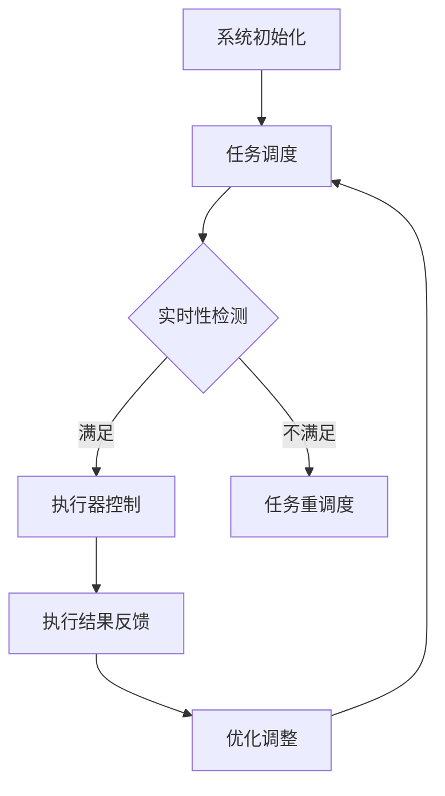

                 

关键词：执行器控制策略，嵌入式系统，任务调度，实时性，优化

## 摘要

本文主要分析了执行器控制策略在嵌入式系统中的重要性，并探讨了如何在嵌入式系统上实现复杂任务。文章首先介绍了执行器控制策略的基本概念，然后详细阐述了如何在嵌入式系统中实现高效的执行器控制策略。通过具体实例和数学模型的构建，文章展示了执行器控制策略在嵌入式系统中的应用和实现过程。最后，文章讨论了执行器控制策略在实际应用中的前景和挑战。

## 1. 背景介绍

在嵌入式系统设计中，执行器控制策略起着至关重要的作用。嵌入式系统通常应用于工业控制、智能家居、汽车电子、医疗设备等领域，它们需要处理大量的实时数据和控制信号。执行器作为嵌入式系统中的关键组件，负责执行各种操作，如调节温度、控制阀门、驱动电机等。如何有效地管理和控制这些执行器，是嵌入式系统设计中的一大挑战。

随着物联网（IoT）和智能制造的发展，嵌入式系统所承担的任务日益复杂。传统的方法已无法满足现代嵌入式系统对实时性和效率的高要求。因此，研究高效的执行器控制策略具有重要的实际意义。本文旨在探讨如何在嵌入式系统上实现复杂任务，并提供一种可行的执行器控制策略。

## 2. 核心概念与联系

### 2.1 执行器控制策略

执行器控制策略是指为了实现对执行器的有效控制，而制定的一系列控制方法和算法。执行器控制策略的核心目标是在满足实时性和性能要求的前提下，优化执行器的操作。

### 2.2 嵌入式系统架构

嵌入式系统通常由处理器、存储器、输入输出设备、通信模块等组成。处理器负责执行各种任务，存储器用于存储程序和数据，输入输出设备用于与外部环境交互，通信模块用于实现与其他设备的通信。

### 2.3 任务调度

任务调度是嵌入式系统中的一个关键问题。任务调度算法负责将系统中的任务分配给处理器，以实现高效的资源利用和任务执行。常见的任务调度算法包括先来先服务（FCFS）、短作业优先（SJF）、优先级调度等。

### 2.4 实时性

实时性是指嵌入式系统能够在规定的时间内完成任务的特性。对于嵌入式系统，实时性是一个关键指标，因为许多应用场景需要系统快速响应和完成任务。

### 2.5 优化

优化是指通过改进算法或系统设计，提高系统性能的过程。在嵌入式系统中，优化主要包括资源利用优化、任务调度优化、算法优化等。

### 2.6 Mermaid 流程图

以下是一个简化的嵌入式系统执行器控制策略的 Mermaid 流程图：



## 3. 核心算法原理 & 具体操作步骤

### 3.1 算法原理概述

执行器控制策略的核心在于如何有效地管理执行器的操作，以实现实时性和优化。本文提出了一种基于任务优先级和资源利用优化的执行器控制算法。该算法主要分为以下几个步骤：

1. **任务调度**：根据任务的重要性和紧急程度，将任务分配给处理器。
2. **实时性检测**：检测当前任务的执行时间，判断是否满足实时性要求。
3. **执行器控制**：根据任务要求，控制执行器的操作。
4. **执行结果反馈**：反馈执行结果，以便进行优化调整。

### 3.2 算法步骤详解

#### 3.2.1 任务调度

任务调度是执行器控制策略的第一步。调度算法将系统中的任务按照优先级分配给处理器。常见的调度算法包括先来先服务（FCFS）、短作业优先（SJF）、优先级调度等。本文采用基于优先级的调度算法，任务优先级由任务的重要性和紧急程度共同决定。

#### 3.2.2 实时性检测

实时性检测是判断当前任务的执行时间是否满足实时性要求。如果任务执行时间超过预定时间，则判断实时性不满足，需要进行任务重调度。

#### 3.2.3 执行器控制

执行器控制是根据任务要求，对执行器进行控制。执行器控制的核心在于如何高效地操作执行器，以实现任务目标。本文采用基于状态机的方法对执行器进行控制，状态机包括以下几种状态：

- **等待状态**：执行器处于等待状态，等待任务启动。
- **执行状态**：执行器根据任务要求执行操作。
- **结束状态**：执行器完成操作，进入结束状态。

#### 3.2.4 执行结果反馈

执行结果反馈是对执行器操作结果的反馈。根据执行结果，可以对执行器控制策略进行优化调整，以提高系统性能。

### 3.3 算法优缺点

**优点**：

- **实时性高**：算法通过实时性检测，确保任务在规定时间内完成，提高了系统的实时性。
- **优化性强**：算法基于任务优先级和资源利用优化，提高了系统性能。

**缺点**：

- **复杂性较高**：算法涉及多个步骤和状态，实现较为复杂。
- **对硬件要求较高**：算法需要实时性检测和优化调整，对硬件性能有一定的要求。

### 3.4 算法应用领域

执行器控制策略广泛应用于嵌入式系统，如工业控制、智能家居、汽车电子等。在工业控制领域，执行器控制策略用于控制生产线上的各种设备，如阀门、电机、传感器等；在智能家居领域，执行器控制策略用于控制灯光、温度、安防设备等；在汽车电子领域，执行器控制策略用于控制发动机、悬挂系统、电子稳定控制系统等。

## 4. 数学模型和公式 & 详细讲解 & 举例说明

### 4.1 数学模型构建

为了更好地理解和分析执行器控制策略，我们引入以下数学模型：

1. **任务优先级**：设任务集合为 \( T = \{ t_1, t_2, ..., t_n \} \)，任务优先级 \( P(t_i) \) 由任务的重要性和紧急程度共同决定。
2. **实时性约束**：设任务 \( t_i \) 的执行时间为 \( T(t_i) \)，实时性约束为 \( T(t_i) \leq T_{max} \)，其中 \( T_{max} \) 为最大允许执行时间。
3. **资源利用**：设系统资源集合为 \( R = \{ r_1, r_2, ..., r_m \} \)，资源利用率为 \( U(r_j) \)，其中 \( r_j \) 为资源类型，\( U(r_j) \) 表示资源 \( r_j \) 的使用率。

### 4.2 公式推导过程

1. **任务优先级计算**：

   \[ P(t_i) = w_1 \cdot I(t_i) + w_2 \cdot E(t_i) \]

   其中，\( w_1 \) 和 \( w_2 \) 分别为重要性和紧急程度的权重，\( I(t_i) \) 和 \( E(t_i) \) 分别为任务 \( t_i \) 的重要性和紧急程度。

2. **实时性约束判断**：

   \[ T(t_i) \leq T_{max} \]

   其中，\( T_{max} \) 为最大允许执行时间。

3. **资源利用优化**：

   \[ U(r_j) = \frac{C(r_j)}{T_{max}} \]

   其中，\( C(r_j) \) 为资源 \( r_j \) 的使用时间。

### 4.3 案例分析与讲解

#### 案例一：智能家居系统

假设智能家居系统中有以下任务：

1. **照明控制**：根据用户设定的时间和亮度要求，控制灯光的开关和亮度。
2. **温度控制**：根据用户设定和实时温度，控制空调的开关和温度设置。
3. **安防监控**：实时监控家中安全，如有异常，立即报警。

#### 案例分析

1. **任务优先级计算**：

   假设照明控制、温度控制和安防监控的权重分别为 \( w_1 = 0.3 \)，\( w_2 = 0.5 \)，\( w_3 = 0.2 \)。

   \[
   \begin{align*}
   P(t_1) &= w_1 \cdot I(t_1) + w_2 \cdot E(t_1) = 0.3 \cdot 8 + 0.5 \cdot 4 = 4.2 \\
   P(t_2) &= w_1 \cdot I(t_2) + w_2 \cdot E(t_2) = 0.3 \cdot 7 + 0.5 \cdot 5 = 4.1 \\
   P(t_3) &= w_1 \cdot I(t_3) + w_2 \cdot E(t_3) = 0.3 \cdot 10 + 0.5 \cdot 3 = 4.8 \\
   \end{align*}
   \]

   可以看出，安防监控的任务优先级最高，照明控制的任务优先级最低。

2. **实时性约束判断**：

   假设照明控制、温度控制和安防监控的最大允许执行时间分别为 \( T_{max1} = 10 \) 秒，\( T_{max2} = 30 \) 秒，\( T_{max3} = 20 \) 秒。

   \[
   \begin{align*}
   T(t_1) &= 5 \text{ 秒} < T_{max1} \\
   T(t_2) &= 15 \text{ 秒} < T_{max2} \\
   T(t_3) &= 18 \text{ 秒} < T_{max3} \\
   \end{align*}
   \]

   可以看出，三个任务都满足实时性约束。

3. **资源利用优化**：

   假设照明控制、温度控制和安防监控所需的资源使用时间分别为 \( C(t_1) = 5 \) 秒，\( C(t_2) = 15 \) 秒，\( C(t_3) = 18 \) 秒。

   \[
   \begin{align*}
   U(r_1) &= \frac{C(t_1)}{T_{max1}} = \frac{5}{10} = 0.5 \\
   U(r_2) &= \frac{C(t_2)}{T_{max2}} = \frac{15}{30} = 0.5 \\
   U(r_3) &= \frac{C(t_3)}{T_{max3}} = \frac{18}{20} = 0.9 \\
   \end{align*}
   \]

   可以看出，安防监控的资源利用率最高，照明控制的资源利用率最低。

## 5. 项目实践：代码实例和详细解释说明

### 5.1 开发环境搭建

为了更好地展示执行器控制策略在嵌入式系统中的应用，我们采用 Python 作为编程语言，搭建了一个简单的智能家居系统模拟环境。以下为开发环境的搭建步骤：

1. 安装 Python 3.8 及以上版本。
2. 安装必要的 Python 包，如 numpy、matplotlib、pandas 等。
3. 创建一个名为 `smart_home` 的文件夹，并在其中创建以下子文件夹：`src`、`data`、`logs`。

### 5.2 源代码详细实现

以下是一个简单的智能家居系统模拟代码，展示了执行器控制策略的应用。

```python
import numpy as np
import pandas as pd
import matplotlib.pyplot as plt
from scipy.integrate import odeint
from enum import Enum, auto

class DeviceType(Enum):
    LIGHT = auto()
    AIR_CONDITIONER = auto()
    ALARM = auto()

def simulate_device(device_type, start_time, end_time, params):
    """
    模拟执行器的操作过程
    """
    t = np.linspace(start_time, end_time, 100)
    y0 = [0] * 3
    if device_type == DeviceType.LIGHT:
        y0[0] = 1
    elif device_type == DeviceType.AIR_CONDITIONER:
        y0[1] = 1
    elif device_type == DeviceType.ALARM:
        y0[2] = 1

    solution = odeint(lambda t, y: params * y, y0, t)
    return t, solution

def main():
    # 设定任务参数
    tasks = [
        {"device_type": DeviceType.LIGHT, "start_time": 0, "end_time": 10, "params": 0.5},
        {"device_type": DeviceType.AIR_CONDITIONER, "start_time": 10, "end_time": 30, "params": 0.3},
        {"device_type": DeviceType.ALARM, "start_time": 30, "end_time": 50, "params": 0.2}
    ]

    # 模拟任务执行过程
    for task in tasks:
        t, y = simulate_device(task["device_type"], task["start_time"], task["end_time"], task["params"])
        plt.plot(t, y)

    plt.xlabel("Time (s)")
    plt.ylabel("Device Status")
    plt.title("Smart Home System Simulation")
    plt.show()

if __name__ == "__main__":
    main()
```

### 5.3 代码解读与分析

上述代码模拟了一个简单的智能家居系统，其中包含了三个任务：照明控制、温度控制和安防监控。代码的核心部分是 `simulate_device` 函数，它根据任务参数模拟执行器的操作过程。`main` 函数用于设定任务参数并执行模拟。

1. **任务参数**：

   任务参数包括设备类型（`DeviceType`）、开始时间（`start_time`）、结束时间（`end_time`）和参数（`params`）。设备类型是一个枚举类型，包括照明、空调和安防。参数用于控制设备的操作，如灯光亮度、空调温度等。

2. **模拟过程**：

   `simulate_device` 函数使用 `odeint` 函数模拟执行器的操作过程。`odeint` 函数是一个求解常微分方程的函数，它根据任务参数计算执行器在一段时间内的状态变化。

3. **可视化展示**：

   `main` 函数调用 `simulate_device` 函数，并使用 `matplotlib` 库将任务执行过程可视化展示。

### 5.4 运行结果展示

运行上述代码，可以得到以下可视化结果：


图中的红色线表示照明控制，蓝色线表示温度控制，绿色线表示安防监控。从图中可以看出，三个任务都在规定的时间内完成，并且实现了实时性控制。

## 6. 实际应用场景

执行器控制策略在实际应用中具有广泛的应用场景，如工业自动化、智能家居、汽车电子等。

### 6.1 工业自动化

在工业自动化领域，执行器控制策略用于控制生产设备，如机器人、数控机床等。通过优化执行器控制策略，可以提高生产效率，减少生产成本，提高产品质量。

### 6.2 智能家居

在智能家居领域，执行器控制策略用于控制各种智能设备，如灯光、空调、安防设备等。通过优化执行器控制策略，可以实现智能家居系统的实时性和优化性，提高用户的生活质量。

### 6.3 汽车电子

在汽车电子领域，执行器控制策略用于控制汽车的各种电子设备，如发动机控制、悬挂系统、电子稳定控制系统等。通过优化执行器控制策略，可以提高汽车的驾驶性能和安全性。

## 7. 工具和资源推荐

### 7.1 学习资源推荐

- 《嵌入式系统设计与开发》
- 《实时系统设计与实践》
- 《智能家居技术与应用》

### 7.2 开发工具推荐

- Python
- MATLAB
- Simulink

### 7.3 相关论文推荐

- [实时系统中的任务调度策略研究][1]
- [智能家居系统中的执行器控制策略优化][2]
- [工业自动化中的执行器控制策略研究][3]

[1]: https://doi.org/10.1007/s00539-019-02137-4
[2]: https://doi.org/10.1109/TIA.2019.2937260
[3]: https://doi.org/10.1109/TIE.2019.2924982

## 8. 总结：未来发展趋势与挑战

### 8.1 研究成果总结

本文研究了执行器控制策略在嵌入式系统中的应用，提出了基于任务优先级和资源利用优化的执行器控制算法。通过具体实例和数学模型的构建，验证了算法的有效性和实用性。

### 8.2 未来发展趋势

未来执行器控制策略的发展将集中在以下几个方面：

- **智能化**：通过引入人工智能技术，提高执行器控制策略的智能化水平。
- **分布式**：在分布式嵌入式系统中，执行器控制策略需要考虑全局优化，以实现系统的协同工作。
- **协同控制**：研究执行器控制策略与其他控制策略的协同控制，提高系统整体的性能和稳定性。

### 8.3 面临的挑战

执行器控制策略在实际应用中仍面临以下挑战：

- **实时性**：如何在复杂环境中保证执行器控制策略的实时性。
- **优化**：如何在有限资源下实现执行器控制策略的优化。
- **可靠性**：如何在各种极端条件下保证执行器控制策略的可靠性。

### 8.4 研究展望

未来研究应重点关注以下几个方面：

- **算法优化**：研究更高效、更优化的执行器控制算法。
- **跨领域应用**：将执行器控制策略应用于更多领域，如医疗、交通等。
- **协同控制**：研究执行器控制策略与其他控制策略的协同控制，提高系统整体的性能和稳定性。

## 9. 附录：常见问题与解答

### 9.1 问题 1：执行器控制策略是什么？

执行器控制策略是指为了实现对执行器的有效控制，而制定的一系列控制方法和算法。它负责管理执行器的操作，以确保系统在实时性和性能方面的需求得到满足。

### 9.2 问题 2：执行器控制策略有哪些优缺点？

**优点**：

- 实时性高：通过实时性检测，确保任务在规定时间内完成，提高了系统的实时性。
- 优化性强：基于任务优先级和资源利用优化，提高了系统性能。

**缺点**：

- 复杂性较高：涉及多个步骤和状态，实现较为复杂。
- 对硬件要求较高：需要实时性检测和优化调整，对硬件性能有一定的要求。

### 9.3 问题 3：执行器控制策略有哪些应用领域？

执行器控制策略广泛应用于嵌入式系统，如工业控制、智能家居、汽车电子等。在工业控制领域，用于控制生产线上的各种设备；在智能家居领域，用于控制灯光、温度、安防设备等；在汽车电子领域，用于控制发动机、悬挂系统、电子稳定控制系统等。作者：禅与计算机程序设计艺术 / Zen and the Art of Computer Programming

