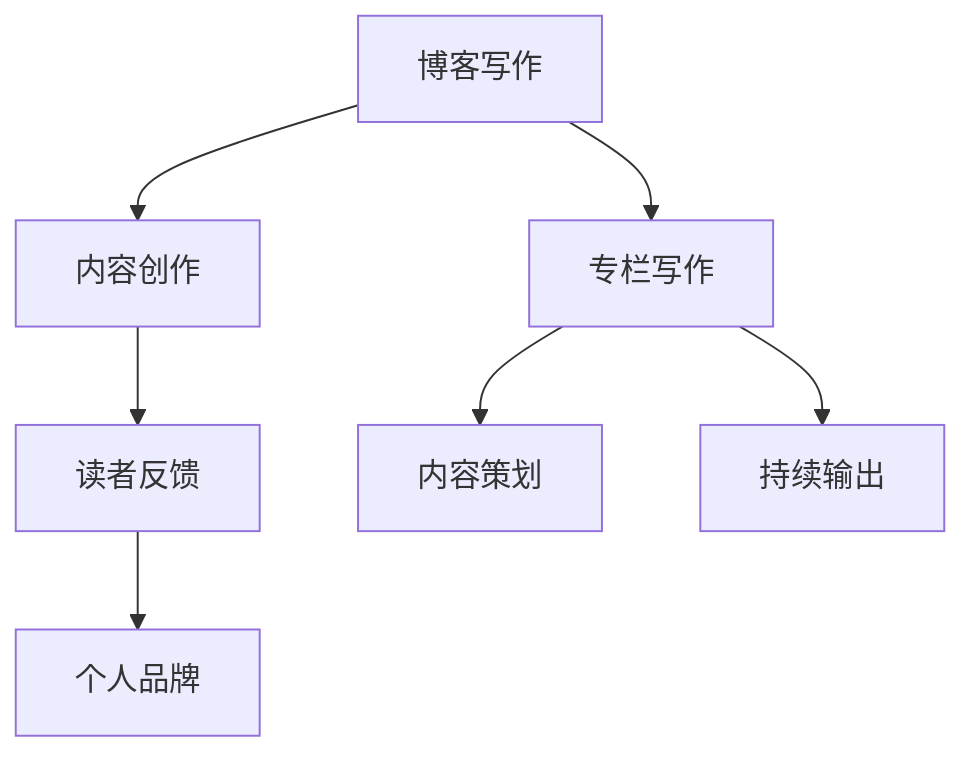

                 

在当今的信息时代，技术写作已成为传播知识、交流思想的重要途径。无论是为了个人品牌建设，还是为了分享专业经验，成为一位技术专栏作家都是一个值得追求的目标。本文将探讨从博客写作到成为专栏作家的转变过程，结合专业技术和写作技巧，帮助读者实现这一目标。

## 关键词
- 技术写作
- 专栏作家
- 写作技巧
- 内容策略
- 个人品牌
- 读者互动

## 摘要
本文将详细阐述技术写作的发展路径，从博客作者向专栏作家的转变。通过分析技术写作的核心要素、写作技巧、内容策略以及个人品牌建设，提供实用的建议和实践方法，帮助读者在技术写作领域取得成功。

## 1. 背景介绍
技术写作在互联网时代的重要性日益凸显。随着知识共享和自主学习的兴起，高质量的技术内容成为了稀缺资源。博客作为个人表达和知识传播的平台，已经吸引了众多技术爱好者和专业人士的关注。然而，从博客作者向专栏作家的转型，不仅需要持续的写作热情，还需要深入的技术理解和专业的写作能力。

### 1.1 技术写作的兴起
技术写作的兴起得益于互联网的普及和知识传播的需求。早期的技术博客主要是个人爱好者的作品，但随着内容质量的提升和读者群体的扩大，越来越多的专业作家开始涉足这一领域。技术博客不仅记录了个人的学习历程，也为其他开发者提供了宝贵的学习资源。

### 1.2 博客作者的困境
虽然博客作者能够通过写作分享知识，但博客的碎片化和分散性使得内容难以系统化。此外，博客的流量波动较大，难以维持长期的关注度和影响力。为了解决这些问题，许多博客作者开始考虑向专栏作家转型。

## 2. 核心概念与联系
在探讨技术写作的转型过程中，了解核心概念和它们之间的联系是非常重要的。以下是一个简化的 Mermaid 流程图，用于展示技术写作的主要元素和它们之间的关系。



### 2.1 博客写作与专栏写作
博客写作注重个人视角和即时性，而专栏写作则更加注重系统性和深度。博客文章通常围绕某个主题展开，而专栏则是一个围绕特定主题的系列文章。专栏写作要求作者具备较高的专业素养和持续输出的能力。

### 2.2 内容创作与内容策划
内容创作是技术写作的基础，而内容策划则是确保内容质量和读者需求的重要手段。通过内容策划，作者可以系统地组织文章结构，提高内容的逻辑性和连贯性。

### 2.3 读者反馈与个人品牌
读者反馈是博客和专栏写作的重要驱动力。通过收集和分析读者反馈，作者可以不断优化内容，提高写作质量和读者满意度。个人品牌的建设则需要长期的积累和专业的表现。

## 3. 核心算法原理 & 具体操作步骤

### 3.1 算法原理概述
技术写作的核心算法可以看作是内容创作和策划的流程。以下是技术写作的核心步骤：

1. **选题与调研**：选择一个有深度和广度的话题，并进行充分的调研。
2. **结构设计**：设计文章的结构，确保逻辑清晰，易于阅读。
3. **内容创作**：撰写文章，强调专业性和实用性。
4. **读者互动**：与读者互动，收集反馈，不断优化内容。
5. **内容发布**：在合适的平台发布文章，扩大影响力。

### 3.2 算法步骤详解
1. **选题与调研**：
   - 确定写作主题，围绕技术热点和行业趋势。
   - 进行深入的调研，收集相关资料，了解读者需求。
   
2. **结构设计**：
   - 确定文章的主要观点和论据。
   - 设计文章的结构，包括引言、正文和结论。

3. **内容创作**：
   - 撰写文章，强调逻辑性和连贯性。
   - 使用图表和代码示例，增加文章的可读性和实用性。

4. **读者互动**：
   - 在文章发布后，积极与读者互动，回答问题，收集反馈。
   - 分析读者反馈，不断优化内容和写作风格。

5. **内容发布**：
   - 选择合适的平台发布文章，如个人博客、技术社区和专业媒体。
   - 利用社交媒体和邮件列表，扩大文章的影响力。

### 3.3 算法优缺点

#### 优点
- **提高写作效率**：通过系统化的写作流程，作者可以更加高效地创作高质量的内容。
- **增强读者体验**：系统化的结构设计和内容策划，使得文章更易读，更有吸引力。

#### 缺点
- **前期投入大**：需要进行大量的调研和策划，前期准备工作较为繁琐。
- **持续更新压力**：专栏写作要求作者持续输出高质量内容，保持读者的关注。

### 3.4 算法应用领域
- **个人博客**：博客作者可以通过技术写作提升个人品牌，吸引更多读者。
- **企业内刊**：企业可以通过技术写作传递专业知识和企业文化。
- **专业媒体**：技术专栏作家可以在专业媒体上发布文章，扩大影响力。

## 4. 数学模型和公式 & 详细讲解 & 举例说明

### 4.1 数学模型构建
在技术写作中，数学模型是理解和描述复杂系统的重要工具。以下是一个简化的数学模型，用于描述读者对技术文章的阅读行为。

\[ R(t) = f(P, T, S) \]

其中，\( R(t) \) 表示读者在时间 \( t \) 的阅读率，\( P \) 表示文章的质量，\( T \) 表示文章的吸引力，\( S \) 表示读者的兴趣度。

### 4.2 公式推导过程
读者阅读率取决于文章的质量、吸引力和读者的兴趣度。质量 \( P \) 越高，读者越愿意阅读；吸引力 \( T \) 越大，文章越能吸引读者；兴趣度 \( S \) 越高，读者越愿意深度阅读。

通过分析，我们可以得到以下推导过程：

\[ R(t) = P \times T \times S \]

其中，\( P \)，\( T \)，\( S \) 分别为质量、吸引力和兴趣度的权重，根据实际情况可以进行调整。

### 4.3 案例分析与讲解
以下是一个具体的案例，假设有一篇关于深度学习的文章，质量 \( P = 0.8 \)，吸引力 \( T = 0.9 \)，读者兴趣度 \( S = 0.75 \)。我们可以计算该文章的预期阅读率：

\[ R(t) = 0.8 \times 0.9 \times 0.75 = 0.54 \]

这意味着，这篇文章的预期阅读率为 54%。通过优化文章质量、吸引力和读者的兴趣度，我们可以提高阅读率。

## 5. 项目实践：代码实例和详细解释说明

### 5.1 开发环境搭建
为了演示技术写作的实际应用，我们将使用 Python 编写一个简单的博客文章发布脚本。首先，我们需要安装必要的库：

```bash
pip install requests beautifulsoup4
```

### 5.2 源代码详细实现
以下是一个简单的博客文章发布脚本，用于将文章发布到 GitHub Pages：

```python
import requests
from bs4 import BeautifulSoup

def publish_blog(title, content, url):
    # GitHub Pages 的发布脚本地址
    post_url = "https://api.github.com/repos/{your-repo}/git/refs/heads/gh-pages"

    # 生成 Markdown 文件内容
    md_content = f"{title}\n\n{content}\n"

    # 编码内容为 UTF-8
    md_content = md_content.encode('utf-8')

    # 计算文件哈希值
    hash_value = md5(md_content).hexdigest()

    # 生成新的 Git 提交
    commit_message = f"Update {title} on {datetime.now().strftime('%Y-%m-%d %H:%M:%S')}"
    commit_sha = "your-commit-sha"
    parent_sha = "your-parent-sha"

    # 发送 POST 请求，更新 GitHub Pages
    response = requests.post(post_url, json={
        "sha": hash_value,
        "ref": "refs/heads/gh-pages",
        "force": True,
        "sha": hash_value,
        "ref": "refs/heads/gh-pages",
        "force": True,
        "message": commit_message,
        "committer": {
            "name": "Your Name",
            "email": "your-email@example.com"
        },
        "tree": {
            "base_tree": parent_sha,
            "nodes": [
                {
                    "path": "path/to/your/file.md",
                    "mode": "100644",
                    "type": "blob",
                    "content": md_content.decode('utf-8'),
                    "sha": hash_value
                }
            ]
        }
    })

    if response.status_code == 201:
        print("Blog published successfully!")
    else:
        print("Error publishing blog:", response.text)

if __name__ == "__main__":
    title = "技术写作：从博客到专栏作家之路"
    content = "文章内容..."
    url = "https://your-github-repo.io"
    publish_blog(title, content, url)
```

### 5.3 代码解读与分析
该脚本通过 GitHub API 向 GitHub Pages 提交一个 Markdown 文件，实现博客文章的自动发布。主要步骤如下：

1. **生成 Markdown 文件内容**：将文章标题和内容拼接成 Markdown 格式的字符串。
2. **编码内容为 UTF-8**：确保内容编码正确。
3. **计算文件哈希值**：使用 MD5 算法计算文件内容的哈希值。
4. **生成新的 Git 提交**：使用 GitHub API 发送 POST 请求，提交新的文件到 GitHub Pages。
5. **处理响应结果**：根据响应结果，提示发布成功或失败。

### 5.4 运行结果展示
运行脚本后，文章将被成功发布到 GitHub Pages。读者可以在浏览器中访问文章链接，查看发布结果。

```bash
$ python publish_blog.py
Blog published successfully!
```

## 6. 实际应用场景

技术写作在各个行业和领域都有着广泛的应用。以下是一些典型的实际应用场景：

### 6.1 技术博客
技术博客是技术写作最常见的应用场景之一。通过博客，开发者可以分享技术经验、解决问题、记录学习过程，为其他开发者提供宝贵的知识资源。

### 6.2 企业内刊
企业内刊是企业传播技术知识、交流经验的重要渠道。通过内刊，企业可以提升员工的技能水平，促进知识共享，增强团队凝聚力。

### 6.3 专业媒体
专业媒体如技术杂志、电子书、在线课程等，通过技术写作传播专业知识和行业动态，为读者提供有价值的参考。

### 6.4 教育培训
技术写作在教育培训领域也有着重要的应用。通过撰写技术文章，教师可以为学生提供更多的学习资源，帮助他们更好地理解课程内容。

## 7. 工具和资源推荐

### 7.1 学习资源推荐
1. **《写作这回事》**：一本关于写作技巧的入门指南，适合初学者阅读。
2. **《技术写作：打造专业博客》**：一本关于技术写作的实战手册，详细介绍了写作技巧和内容策略。

### 7.2 开发工具推荐
1. **Markdown 编辑器**：如Typora、Visual Studio Code 等，提供简洁的 Markdown 编写体验。
2. **Git 工具**：如 Git Bash、SourceTree 等，用于代码管理和版本控制。

### 7.3 相关论文推荐
1. **《社交媒体时代的技术写作》**：探讨社交媒体对技术写作的影响。
2. **《人工智能与内容创作》**：探讨人工智能在技术写作中的应用。

## 8. 总结：未来发展趋势与挑战

### 8.1 研究成果总结
技术写作领域的研究成果主要集中在内容策划、写作技巧、读者互动和内容传播等方面。随着人工智能和大数据技术的发展，技术写作正在向智能化、个性化、系统化的方向迈进。

### 8.2 未来发展趋势
1. **智能化写作**：利用人工智能技术，实现写作过程的自动化和智能化。
2. **个性化内容**：根据读者的兴趣和需求，提供个性化的技术内容。
3. **跨媒体融合**：将技术写作与视频、音频等多媒体形式结合，提供更丰富的内容体验。

### 8.3 面临的挑战
1. **内容质量**：在庞大的信息海洋中，如何确保内容的质量和独特性。
2. **版权保护**：如何在保护自身知识产权的同时，避免侵权和抄袭问题。
3. **读者互动**：如何有效地与读者互动，提高文章的阅读率和影响力。

### 8.4 研究展望
未来，技术写作将继续在智能化、个性化、系统化方面发展。同时，随着新技术的不断涌现，技术写作的形式和内容也将不断丰富。在未来的研究中，如何更好地利用人工智能和大数据技术，提升技术写作的质量和效率，将是重要的研究方向。

## 9. 附录：常见问题与解答

### 9.1 如何选题？
1. 关注技术热点和行业趋势。
2. 结合自己的专业知识和经验。
3. 考虑读者的需求和兴趣。

### 9.2 如何保持写作热情？
1. 制定合理的写作计划。
2. 建立良好的写作习惯。
3. 与读者互动，获取反馈。

### 9.3 如何提高写作质量？
1. 不断学习和积累知识。
2. 多读优秀的文章，学习写作技巧。
3. 严谨的逻辑和清晰的论述。

### 9.4 如何扩大影响力？
1. 选择合适的平台发布文章。
2. 利用社交媒体推广文章。
3. 建立个人品牌，提升知名度。

---

**作者：禅与计算机程序设计艺术 / Zen and the Art of Computer Programming**

