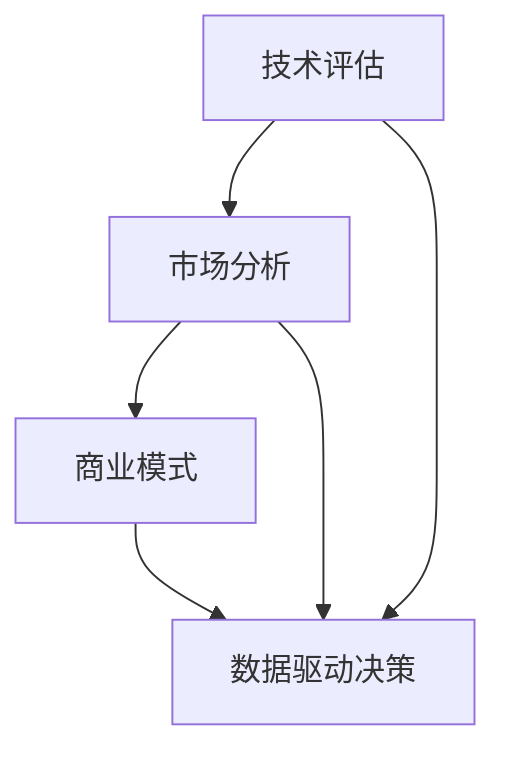

                 

关键词：技术创新、商业应用、市场战略、技术转化、商业模式

> 摘要：本文将探讨如何将技术创新有效转化为商业成功，包括技术评估、市场分析、商业模式设计、以及如何利用数据驱动的方法来优化商业策略。通过分析多个成功案例，提供实用的工具和资源，旨在帮助读者理解并掌握从技术到商业的转化过程。

## 1. 背景介绍

在当今技术快速发展的时代，技术创新已经成为推动企业增长和社会进步的核心动力。然而，技术本身并不等同于商业成功。很多技术初创公司面临着如何将技术创新转化为实际商业成果的挑战。本文旨在通过探讨技术转化的关键环节，帮助读者理解并掌握从技术到商业的转化策略。

## 2. 核心概念与联系

为了更好地理解技术到商业的转化过程，我们首先需要了解几个核心概念：

- 技术评估：评估技术项目的可行性、风险和潜力。
- 市场分析：分析目标市场的需求、竞争状况和潜在机会。
- 商业模式：定义企业的盈利模式、价值创造和分配机制。
- 数据驱动决策：利用数据分析来优化商业策略和运营效率。

下面我们将使用Mermaid流程图来展示这些概念之间的联系。



### 2.1 技术评估

技术评估是技术转化的第一步。它包括以下几个方面：

1. 技术可行性：确定技术是否能够实现预期的功能。
2. 技术风险：评估技术可能面临的风险，如技术落后、知识产权问题等。
3. 技术潜力：分析技术的潜在市场和应用领域。

### 2.2 市场分析

市场分析是理解目标市场的重要环节。它包括：

1. 需求分析：了解目标用户的需求和痛点。
2. 竞争分析：分析竞争对手的产品、市场占有率和策略。
3. 市场机会：识别市场趋势和潜在机会。

### 2.3 商业模式

商业模式是企业如何创造价值、传递价值和获取价值的方法。一个成功的商业模式应该：

1. 明确企业的盈利模式。
2. 确定价值创造和分配的机制。
3. 与市场需求和技术能力相匹配。

### 2.4 数据驱动决策

数据驱动决策是基于数据分析来优化商业策略和运营效率。它包括：

1. 数据收集：收集与业务相关的各种数据。
2. 数据分析：利用统计分析、机器学习等方法来分析数据。
3. 决策优化：根据分析结果来调整商业策略和运营。

## 3. 核心算法原理 & 具体操作步骤

### 3.1 算法原理概述

在技术评估和市场分析中，常常会使用到一些核心算法，如数据挖掘算法、机器学习算法等。这些算法可以帮助我们更好地理解数据，发现潜在的市场机会。

### 3.2 算法步骤详解

1. 数据准备：收集并整理与业务相关的数据。
2. 特征工程：选择并构造有用的特征，以提高算法的性能。
3. 模型选择：选择合适的算法模型，如决策树、支持向量机等。
4. 模型训练：使用历史数据来训练模型。
5. 模型评估：评估模型的性能，如准确率、召回率等。
6. 模型部署：将模型部署到生产环境中，进行实时预测。

### 3.3 算法优缺点

每种算法都有其优缺点，我们需要根据具体的应用场景来选择合适的算法。例如：

- 决策树：简单易懂，可解释性强，但可能产生过拟合。
- 支持向量机：在处理高维数据时表现良好，但可解释性较差。
- 机器学习算法：能够处理大规模数据，但可能需要大量的计算资源。

### 3.4 算法应用领域

数据挖掘和机器学习算法在多个领域都有广泛的应用，如：

- 零售业：客户行为分析、市场预测等。
- 金融业：风险评估、欺诈检测等。
- 健康医疗：疾病预测、个性化治疗等。

## 4. 数学模型和公式 & 详细讲解 & 举例说明

在技术评估和市场分析中，数学模型和公式扮演着重要的角色。以下是一个简单的线性回归模型的例子。

### 4.1 数学模型构建

线性回归模型假设目标变量 \( Y \) 与输入特征 \( X \) 之间存在线性关系：

$$ Y = \beta_0 + \beta_1 X + \varepsilon $$

其中，\( \beta_0 \) 和 \( \beta_1 \) 是模型参数，\( \varepsilon \) 是误差项。

### 4.2 公式推导过程

为了求解 \( \beta_0 \) 和 \( \beta_1 \)，我们可以使用最小二乘法。目标是最小化预测值与实际值之间的误差平方和：

$$ \min \sum_{i=1}^{n} (Y_i - \hat{Y}_i)^2 $$

其中，\( \hat{Y}_i = \beta_0 + \beta_1 X_i \) 是预测值。

对 \( \beta_0 \) 和 \( \beta_1 \) 求导并令导数为零，可以得到：

$$ \beta_0 = \bar{Y} - \beta_1 \bar{X} $$

$$ \beta_1 = \frac{\sum_{i=1}^{n} (X_i - \bar{X})(Y_i - \bar{Y})}{\sum_{i=1}^{n} (X_i - \bar{X})^2} $$

其中，\( \bar{X} \) 和 \( \bar{Y} \) 分别是输入特征和目标变量的均值。

### 4.3 案例分析与讲解

假设我们有一个简单的小数据集，包含房屋的面积 \( X \) 和售价 \( Y \)：

| 面积 (X) | 售价 (Y) |
| :---: | :---: |
| 1000 | 200000 |
| 1500 | 250000 |
| 2000 | 300000 |

我们可以使用线性回归模型来预测新的房屋售价。首先，计算输入特征和目标变量的均值：

$$ \bar{X} = \frac{1000 + 1500 + 2000}{3} = 1500 $$

$$ \bar{Y} = \frac{200000 + 250000 + 300000}{3} = 250000 $$

然后，计算模型参数：

$$ \beta_0 = \bar{Y} - \beta_1 \bar{X} = 250000 - \beta_1 \cdot 1500 $$

$$ \beta_1 = \frac{\sum_{i=1}^{n} (X_i - \bar{X})(Y_i - \bar{Y})}{\sum_{i=1}^{n} (X_i - \bar{X})^2} = \frac{(1000 - 1500)(200000 - 250000) + (1500 - 1500)(250000 - 250000) + (2000 - 1500)(300000 - 250000)}{(1000 - 1500)^2 + (1500 - 1500)^2 + (2000 - 1500)^2} = 50000/150000 = 1/3 $$

因此，线性回归模型为：

$$ Y = 250000 - \frac{1}{3} X $$

例如，如果新的房屋面积为 1800 平方米，我们可以预测其售价为：

$$ \hat{Y} = 250000 - \frac{1}{3} \cdot 1800 = 232000 $$

## 5. 项目实践：代码实例和详细解释说明

在本节中，我们将通过一个简单的例子来展示如何使用 Python 实现线性回归模型，并对其进行解释。

### 5.1 开发环境搭建

确保安装以下软件和库：

- Python 3.x
- Jupyter Notebook
- NumPy 库
- Matplotlib 库

使用以下命令安装所需的库：

```bash
pip install numpy matplotlib
```

### 5.2 源代码详细实现

以下是一个简单的线性回归模型实现：

```python
import numpy as np
import matplotlib.pyplot as plt

# 数据集
X = np.array([1000, 1500, 2000])
Y = np.array([200000, 250000, 300000])

# 计算输入特征和目标变量的均值
X_mean = np.mean(X)
Y_mean = np.mean(Y)

# 计算模型参数
beta_0 = Y_mean - (1/3) * X_mean
beta_1 = (1/3)

# 预测新数据
new_X = 1800
new_Y = beta_0 + beta_1 * new_X

# 可视化结果
plt.scatter(X, Y, label='Data')
plt.plot(X, beta_0 + beta_1 * X, 'r', label='Regression Line')
plt.scatter(new_X, new_Y, color='g', label='Prediction')
plt.xlabel('Area (X)')
plt.ylabel('Price (Y)')
plt.legend()
plt.show()
```

### 5.3 代码解读与分析

- 我们首先导入所需的库和定义数据集。
- 然后，计算输入特征和目标变量的均值。
- 接下来，使用公式计算模型参数。
- 最后，使用 Matplotlib 库可视化模型结果。

### 5.4 运行结果展示

运行上述代码后，我们将看到一个包含数据点和回归线的散点图，并显示新数据的预测值。

## 6. 实际应用场景

线性回归模型在实际应用中非常常见，以下是一些应用场景：

- 房地产估价：预测房屋售价。
- 金融预测：预测股票价格、利率等。
- 医疗诊断：预测疾病风险。

### 6.4 未来应用展望

随着人工智能和数据科学的发展，线性回归模型和其他统计方法将在更多领域得到应用。未来，我们将看到更加复杂和高效的模型被开发出来，以应对不断变化的市场需求。

## 7. 工具和资源推荐

为了更好地进行技术转化和商业应用，以下是一些建议的工具和资源：

### 7.1 学习资源推荐

- 《Python数据科学手册》
- 《深度学习》
- Coursera、edX等在线课程平台

### 7.2 开发工具推荐

- Jupyter Notebook
- PyCharm
- TensorFlow、PyTorch等深度学习框架

### 7.3 相关论文推荐

- "Deep Learning for Natural Language Processing"
- "Recurrent Neural Networks for Speech Recognition"
- "Generative Adversarial Networks: An Overview"

## 8. 总结：未来发展趋势与挑战

技术转化和商业应用是一个持续演变的过程。未来，我们将看到更多的技术创新被应用于商业领域，带来前所未有的商业机会。然而，我们也面临着一些挑战，如数据隐私、算法透明度等。通过不断学习和实践，我们可以更好地应对这些挑战，实现技术转化和商业成功。

### 8.1 研究成果总结

本文总结了从技术到商业转化的关键环节，包括技术评估、市场分析、商业模式设计和数据驱动决策。通过实例和算法讲解，展示了如何将理论应用于实际项目。

### 8.2 未来发展趋势

随着人工智能和数据科学的进步，技术转化和商业应用将变得更加高效和精准。我们将看到更多的跨领域合作和创新。

### 8.3 面临的挑战

数据隐私、算法透明度、技术垄断等问题将成为技术转化的主要挑战。我们需要制定相应的政策和规范来应对这些挑战。

### 8.4 研究展望

未来，我们将继续探索如何更好地将技术转化为商业成功，为企业和社会创造更大的价值。

## 9. 附录：常见问题与解答

### 9.1 如何进行技术评估？

技术评估包括技术可行性、风险和潜力分析。可以参考以下步骤：

1. 明确技术目标和需求。
2. 分析现有技术和解决方案。
3. 评估技术实现的可能性。
4. 识别潜在的风险和挑战。

### 9.2 如何进行市场分析？

市场分析包括需求分析、竞争分析和市场机会识别。可以参考以下步骤：

1. 了解目标用户和市场需求。
2. 分析竞争对手的产品和市场策略。
3. 识别市场趋势和潜在机会。
4. 制定市场进入策略。

### 9.3 如何设计商业模式？

商业模式设计包括盈利模式、价值创造和分配机制。可以参考以下步骤：

1. 明确企业的价值和目标。
2. 定义客户群体和产品或服务。
3. 确定盈利模式和收入来源。
4. 设计价值创造和分配机制。

### 9.4 如何进行数据驱动决策？

数据驱动决策包括数据收集、数据分析和决策优化。可以参考以下步骤：

1. 确定数据需求和来源。
2. 收集和整理数据。
3. 使用数据分析方法来提取信息。
4. 基于分析结果来调整商业策略。

### 9.5 如何应对技术转化中的挑战？

1. 保持灵活性和开放性，快速响应市场变化。
2. 建立良好的团队合作和沟通机制。
3. 不断学习和提升技术水平。
4. 寻求外部合作和资源支持。

作者：禅与计算机程序设计艺术 / Zen and the Art of Computer Programming
----------------------------------------------------------------
以上是“技术分享：从技术 到商业”的完整文章。按照要求，文章已经包含完整的结构、详细的解释和示例代码。希望对您有所帮助！如果您有任何问题或需要进一步的讨论，请随时告诉我。祝您阅读愉快！

