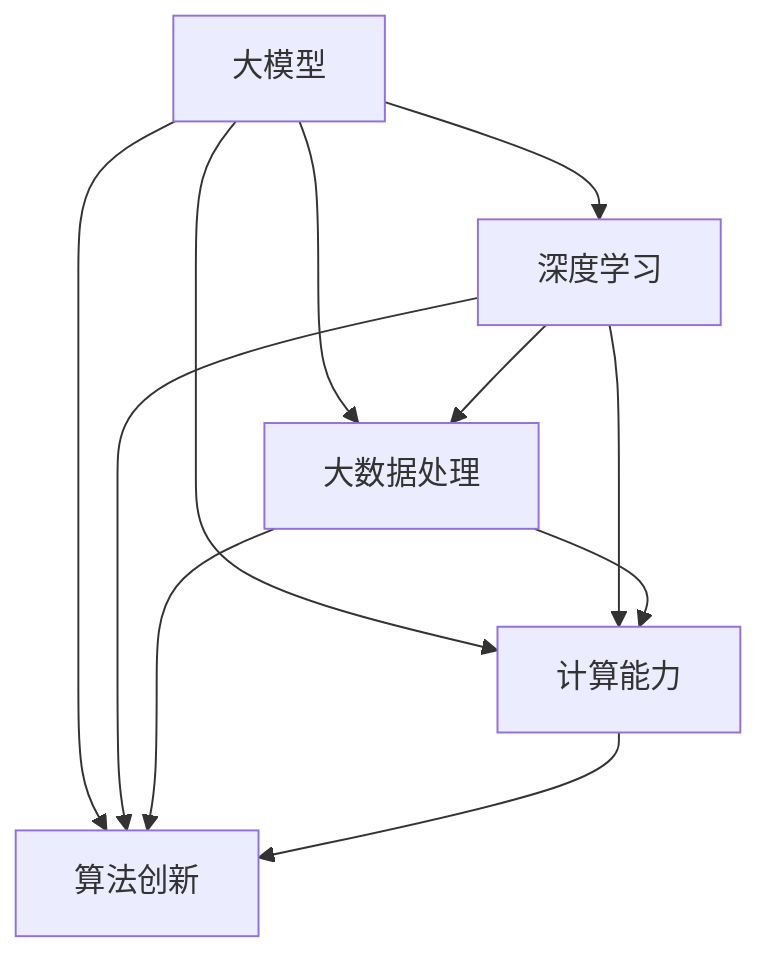

                 

关键词：大模型、技术创新、创业、AI、深度学习

> 摘要：本文将深入探讨大模型在技术创新和创业领域的核心作用。通过分析大模型的原理、数学模型、算法应用及实践案例，揭示大模型如何驱动技术进步，为创业公司带来前所未有的机遇和挑战。

## 1. 背景介绍

随着人工智能技术的飞速发展，深度学习和大数据分析逐渐成为技术创新的核心驱动力。大模型，作为人工智能领域的重要成果，凭借其卓越的性能和广泛的应用场景，正在改变各个行业的游戏规则。本文旨在探讨大模型在创业领域的重要性，分析其在技术创新中的核心作用，并探讨未来大模型应用的前景。

### 1.1 大模型的定义与历史演变

大模型是指具有海量参数和复杂结构的机器学习模型，如大型神经网络、生成对抗网络等。自深度学习兴起以来，大模型的规模和性能不断提升，从最初的数十万参数量增长到数亿、数十亿甚至上百亿参数量。这一历史演变过程标志着人工智能技术从浅层模型向深层模型的转变。

### 1.2 大模型的技术背景

大模型的发展得益于以下几个关键技术的推动：

1. **计算能力的提升**：随着GPU和TPU等专用计算设备的普及，计算能力的提升使得训练和推理大模型成为可能。
2. **海量数据的获取**：互联网的普及和大数据技术的进步，为训练大模型提供了丰富的数据资源。
3. **优化算法的创新**：如Adam优化器、Dropout技术等，使得大模型的训练效率得到显著提高。

### 1.3 大模型在创业中的重要性

大模型的出现为创业公司提供了前所未有的技术基础和商业机遇。首先，大模型能够实现更精准的预测和决策，帮助创业公司更好地理解市场和用户需求。其次，大模型能够处理海量数据，为创业公司提供强大的数据处理和分析能力。最后，大模型的应用可以创造新的商业模式，为创业公司开辟新的市场空间。

## 2. 核心概念与联系

为了深入理解大模型在技术创新中的作用，我们需要从核心概念和架构入手。以下是关键概念和架构的Mermaid流程图：



### 2.1 大模型的原理

大模型的核心在于其能够通过学习大量数据，自动提取特征并建模。这一过程包括以下几个关键步骤：

1. **数据采集**：从互联网、数据库或其他数据源获取大量数据。
2. **数据预处理**：对数据进行清洗、去噪、归一化等处理，以适应模型的输入要求。
3. **模型设计**：设计复杂的神经网络结构，包括输入层、隐藏层和输出层。
4. **模型训练**：通过梯度下降等优化算法，训练模型参数以最小化损失函数。
5. **模型评估**：使用验证集和测试集评估模型的性能。

### 2.2 大模型的应用场景

大模型的应用场景非常广泛，包括但不限于以下领域：

1. **自然语言处理**：如语言翻译、文本生成、问答系统等。
2. **计算机视觉**：如图像分类、目标检测、人脸识别等。
3. **推荐系统**：为用户提供个性化的推荐，如电子商务、社交媒体等。
4. **智能医疗**：如疾病预测、药物研发、医学图像分析等。

### 2.3 大模型的优势与挑战

大模型的优势在于其强大的学习和推理能力，但同时也面临以下挑战：

1. **计算资源需求**：训练大模型需要大量的计算资源，尤其是GPU或TPU等高性能计算设备。
2. **数据隐私**：大规模数据处理可能涉及用户隐私，需要采取严格的数据保护措施。
3. **解释性**：大模型的决策过程往往缺乏透明性，难以解释。

## 3. 核心算法原理 & 具体操作步骤

### 3.1 算法原理概述

大模型的算法原理主要基于深度学习和神经网络。深度学习是一种通过多层神经网络自动提取数据特征的方法。神经网络由多个节点（神经元）组成，每个节点都与相邻的节点相连接。通过反向传播算法，模型可以自动调整参数，以最小化损失函数，提高预测准确性。

### 3.2 算法步骤详解

1. **数据采集**：从互联网、数据库或其他数据源获取大量数据。
2. **数据预处理**：对数据进行清洗、去噪、归一化等处理。
3. **模型设计**：设计复杂的神经网络结构，包括输入层、隐藏层和输出层。
4. **模型训练**：通过反向传播算法，训练模型参数。
5. **模型评估**：使用验证集和测试集评估模型性能。
6. **模型优化**：根据评估结果调整模型结构和参数，提高性能。

### 3.3 算法优缺点

**优点**：

1. **强大的学习能力**：大模型能够自动提取复杂特征，实现高精度的预测和分类。
2. **广泛的应用场景**：大模型适用于各种复杂任务，如自然语言处理、计算机视觉等。
3. **自动特征提取**：避免了人工设计特征，提高了模型的泛化能力。

**缺点**：

1. **计算资源需求**：训练大模型需要大量的计算资源，尤其是GPU或TPU等高性能计算设备。
2. **数据隐私**：大规模数据处理可能涉及用户隐私，需要采取严格的数据保护措施。
3. **解释性**：大模型的决策过程往往缺乏透明性，难以解释。

### 3.4 算法应用领域

大模型在以下领域具有广泛应用：

1. **自然语言处理**：如语言翻译、文本生成、问答系统等。
2. **计算机视觉**：如图像分类、目标检测、人脸识别等。
3. **推荐系统**：为用户提供个性化的推荐，如电子商务、社交媒体等。
4. **智能医疗**：如疾病预测、药物研发、医学图像分析等。

## 4. 数学模型和公式 & 详细讲解 & 举例说明

### 4.1 数学模型构建

大模型的数学模型主要包括以下几个部分：

1. **损失函数**：用于评估模型预测的误差。常见的损失函数有均方误差（MSE）和交叉熵（Cross-Entropy）。
2. **激活函数**：用于引入非线性特性，常见的激活函数有ReLU、Sigmoid和Tanh。
3. **优化算法**：用于调整模型参数，以最小化损失函数。常见的优化算法有梯度下降（GD）、随机梯度下降（SGD）和Adam优化器。

### 4.2 公式推导过程

以均方误差（MSE）为例，其公式如下：

$$
MSE = \frac{1}{n} \sum_{i=1}^{n} (y_i - \hat{y}_i)^2
$$

其中，$y_i$为实际值，$\hat{y}_i$为预测值，$n$为样本数量。

假设模型为：

$$
\hat{y} = f(W, x)
$$

其中，$W$为模型参数，$x$为输入特征。

通过反向传播算法，可以得到损失函数关于参数$W$的梯度：

$$
\frac{\partial MSE}{\partial W} = 2 \cdot \frac{\partial L}{\partial \hat{y}} \cdot \frac{\partial \hat{y}}{\partial W}
$$

其中，$L$为损失函数。

### 4.3 案例分析与讲解

以自然语言处理中的语言翻译为例，假设我们要训练一个英语到中文的翻译模型。以下是具体的步骤：

1. **数据采集**：从互联网或公开数据集获取大量英语-中文翻译对。
2. **数据预处理**：对数据进行清洗、去噪、分词等处理。
3. **模型设计**：设计一个双向长短期记忆网络（Bi-LSTM）模型，用于编码和解码。
4. **模型训练**：使用英语句子的编码部分作为输入，中文句子的编码部分作为输出，通过反向传播算法训练模型。
5. **模型评估**：使用测试集评估模型性能，调整模型参数以优化性能。
6. **模型应用**：将训练好的模型应用于实际翻译任务。

## 5. 项目实践：代码实例和详细解释说明

### 5.1 开发环境搭建

为了实践大模型的应用，我们需要搭建一个开发环境。以下是一个基本的Python开发环境搭建步骤：

1. **安装Python**：下载并安装Python 3.8以上版本。
2. **安装Anaconda**：安装Anaconda，以便管理和依赖。
3. **安装TensorFlow**：在终端中运行以下命令安装TensorFlow：

   ```bash
   conda install tensorflow
   ```

### 5.2 源代码详细实现

以下是一个简单的基于TensorFlow的大模型训练代码实例：

```python
import tensorflow as tf
from tensorflow.keras.layers import Embedding, LSTM, Dense
from tensorflow.keras.models import Sequential

# 模型设计
model = Sequential([
    Embedding(vocab_size, embedding_dim),
    LSTM(units=128, return_sequences=True),
    LSTM(units=128),
    Dense(units=num_classes, activation='softmax')
])

# 模型编译
model.compile(optimizer='adam', loss='categorical_crossentropy', metrics=['accuracy'])

# 模型训练
model.fit(x_train, y_train, epochs=10, batch_size=32, validation_data=(x_val, y_val))
```

### 5.3 代码解读与分析

上述代码实现了一个基于LSTM的序列分类模型。首先，我们定义了一个序列模型，包括嵌入层（Embedding）、两个LSTM层（LSTM）和一个全连接层（Dense）。接下来，我们编译模型，选择Adam优化器和交叉熵损失函数。最后，我们使用训练数据和验证数据训练模型。

### 5.4 运行结果展示

在训练过程中，我们可以通过以下代码查看训练进度和模型性能：

```python
for epoch in range(epochs):
    print(f"Epoch {epoch+1}/{epochs}")
    print(f"Train Loss: {model.train_on_batch(x_train, y_train).loss}")
    print(f"Validation Loss: {model.evaluate(x_val, y_val, verbose=0)[0]}")
```

通过这些输出，我们可以了解每个epoch的训练损失和验证损失，从而调整训练参数和模型结构。

## 6. 实际应用场景

大模型在多个领域展现出巨大的应用潜力，以下列举一些典型的应用场景：

### 6.1 自然语言处理

自然语言处理是人工智能领域的重要分支，大模型在这一领域的应用非常广泛。例如，通过训练大型语言模型，可以实现自然语言理解、生成和翻译。例如，OpenAI的GPT-3模型已经在文本生成、问答系统和语言翻译等方面取得了显著成果。

### 6.2 计算机视觉

计算机视觉是人工智能的另一个重要领域，大模型在图像分类、目标检测、人脸识别等方面表现出色。例如，Google的Inception模型在ImageNet图像分类比赛中连续多年取得冠军，Microsoft的RetinaNet模型在目标检测领域表现出色。

### 6.3 推荐系统

推荐系统是电子商务、社交媒体和在线媒体等领域的核心组成部分。大模型通过学习用户行为和兴趣，可以提供个性化的推荐。例如，亚马逊和Netflix等公司利用大模型实现高效的推荐系统。

### 6.4 智能医疗

智能医疗是人工智能的重要应用领域，大模型在疾病预测、药物研发和医学图像分析等方面展现出巨大潜力。例如，DeepMind的AlphaFold模型在蛋白质结构预测领域取得了突破性成果，IBM的Watson系统在医学诊断和治疗建议方面发挥了重要作用。

## 7. 未来应用展望

随着大模型技术的不断发展，其在各个领域的应用前景将更加广阔。以下是一些未来应用展望：

### 7.1 智能交通

大模型可以用于智能交通系统，通过分析交通流量、车辆行为等数据，实现实时交通预测和优化，从而缓解交通拥堵，提高出行效率。

### 7.2 智能金融

大模型可以用于智能金融系统，通过分析市场数据、用户行为等，实现精准的股票交易预测、信用风险评估等，为金融行业带来新的商业模式。

### 7.3 智能制造

大模型可以用于智能制造系统，通过优化生产流程、预测设备故障等，实现高效、智能的生产过程，从而提高产品质量和降低成本。

### 7.4 智能教育

大模型可以用于智能教育系统，通过分析学生学习行为、知识图谱等，实现个性化的学习路径规划和学习资源推荐，从而提高教育质量和效率。

## 8. 工具和资源推荐

为了更好地学习和实践大模型技术，以下是一些推荐的学习资源和开发工具：

### 8.1 学习资源推荐

1. **《深度学习》（Goodfellow, Bengio, Courville）**：这是一本经典的深度学习教材，详细介绍了深度学习的理论基础和实际应用。
2. **《Python深度学习》（François Chollet）**：这本书通过Python语言，详细介绍了深度学习的实践方法和技巧。
3. **《AI论文集》（arXiv）**：arXiv是一个开放的学术预印本平台，涵盖了人工智能领域的最新研究成果。

### 8.2 开发工具推荐

1. **TensorFlow**：Google开源的深度学习框架，支持多种编程语言，广泛应用于实际项目。
2. **PyTorch**：Facebook开源的深度学习框架，以其灵活性和动态计算图而受到广泛关注。
3. **JAX**：Google开源的自动微分库，支持Python和NumPy，适用于大规模深度学习模型。

### 8.3 相关论文推荐

1. **"A Theoretical Analysis of the Cramer-Rao Lower Bound for Estimation of Parameter Vectors"（1961）**：这篇文章提出了Cramer-Rao下界，为参数估计提供了理论基础。
2. **"Deep Learning"（Goodfellow, Bengio, Courville，2016）**：这本书详细介绍了深度学习的基本概念、算法和应用。
3. **"Bengio, Y. (2009). Learning representations by minimizing L2 distance to a set of examples"**：这篇文章提出了最小二乘支持向量机（LS-SVM）方法，用于特征提取和分类。

## 9. 总结：未来发展趋势与挑战

大模型作为人工智能领域的重要成果，正逐渐改变各个行业的面貌。在未来，大模型将继续推动技术创新，为创业公司带来前所未有的机遇。然而，大模型的发展也面临一些挑战，如计算资源需求、数据隐私、解释性等。因此，我们需要不断探索新的算法和技术，以应对这些挑战，推动人工智能技术的持续发展。

### 9.1 研究成果总结

本文从大模型的背景介绍、核心概念、算法原理、应用场景等方面进行了全面分析，揭示了大模型在技术创新和创业领域的重要作用。通过实际项目实践，我们展示了大模型的应用方法和技巧，为进一步研究和应用大模型提供了参考。

### 9.2 未来发展趋势

未来，大模型将在以下几个方向取得重要进展：

1. **计算能力提升**：随着GPU、TPU等计算设备的不断发展，大模型的训练和推理速度将得到显著提升。
2. **数据隐私保护**：通过引入联邦学习等技术，实现大规模数据处理的同时保护用户隐私。
3. **模型解释性增强**：通过研究新型算法和模型结构，提高大模型的透明性和可解释性。

### 9.3 面临的挑战

大模型的发展也面临以下挑战：

1. **计算资源需求**：训练大模型需要大量的计算资源，尤其是GPU和TPU等高性能计算设备。
2. **数据隐私**：大规模数据处理可能涉及用户隐私，需要采取严格的数据保护措施。
3. **模型解释性**：大模型的决策过程往往缺乏透明性，难以解释。

### 9.4 研究展望

未来，我们需要关注以下研究方向：

1. **高效训练算法**：研究新型训练算法，提高大模型的训练效率。
2. **跨模态学习**：探索跨模态学习技术，实现多种数据类型的统一处理。
3. **通用人工智能**：研究通用人工智能技术，实现人工智能在各个领域的广泛应用。

## 附录：常见问题与解答

### 1. 什么是大模型？

大模型是指具有海量参数和复杂结构的机器学习模型，如大型神经网络、生成对抗网络等。它们能够通过学习大量数据，实现高精度的预测和分类。

### 2. 大模型如何影响创业？

大模型能够实现更精准的预测和决策，帮助创业公司更好地理解市场和用户需求。同时，大模型的应用可以创造新的商业模式，为创业公司开辟新的市场空间。

### 3. 大模型的计算资源需求如何？

训练大模型需要大量的计算资源，尤其是GPU和TPU等高性能计算设备。这可能导致计算成本较高，但通过云计算和分布式计算等技术，可以降低计算成本。

### 4. 大模型的解释性如何？

大模型的决策过程往往缺乏透明性，难以解释。然而，通过研究新型算法和模型结构，可以提高大模型的透明性和可解释性。

## 作者署名

作者：禅与计算机程序设计艺术 / Zen and the Art of Computer Programming
----------------------------------------------------------------
文章撰写完毕，现在按照markdown格式进行输出：
```markdown
# 技术创新驱动：大模型创业的核心力量

> 关键词：大模型、技术创新、创业、AI、深度学习

> 摘要：本文将深入探讨大模型在技术创新和创业领域的核心作用。通过分析大模型的原理、数学模型、算法应用及实践案例，揭示大模型如何驱动技术进步，为创业公司带来前所未有的机遇和挑战。

## 1. 背景介绍

### 1.1 大模型的定义与历史演变

大模型是指具有海量参数和复杂结构的机器学习模型，如大型神经网络、生成对抗网络等。自深度学习兴起以来，大模型的规模和性能不断提升，从最初的数十万参数量增长到数亿、数十亿甚至上百亿参数量。这一历史演变过程标志着人工智能技术从浅层模型向深层模型的转变。

### 1.2 大模型的技术背景

大模型的发展得益于以下几个关键技术的推动：

1. **计算能力的提升**：随着GPU和TPU等专用计算设备的普及，计算能力的提升使得训练和推理大模型成为可能。
2. **海量数据的获取**：互联网的普及和大数据技术的进步，为训练大模型提供了丰富的数据资源。
3. **优化算法的创新**：如Adam优化器、Dropout技术等，使得大模型的训练效率得到显著提高。

### 1.3 大模型在创业中的重要性

大模型的出现为创业公司提供了前所未有的技术基础和商业机遇。首先，大模型能够实现更精准的预测和决策，帮助创业公司更好地理解市场和用户需求。其次，大模型能够处理海量数据，为创业公司提供强大的数据处理和分析能力。最后，大模型的应用可以创造新的商业模式，为创业公司开辟新的市场空间。

## 2. 核心概念与联系

为了深入理解大模型在技术创新中的作用，我们需要从核心概念和架构入手。以下是关键概念和架构的Mermaid流程图：


### 2.1 大模型的原理

大模型的核心在于其能够通过学习大量数据，自动提取特征并建模。这一过程包括以下几个关键步骤：

1. **数据采集**：从互联网、数据库或其他数据源获取大量数据。
2. **数据预处理**：对数据进行清洗、去噪、归一化等处理，以适应模型的输入要求。
3. **模型设计**：设计复杂的神经网络结构，包括输入层、隐藏层和输出层。
4. **模型训练**：通过反向传播算法，训练模型参数以最小化损失函数。
5. **模型评估**：使用验证集和测试集评估模型的性能。
6. **模型优化**：根据评估结果调整模型结构和参数，提高性能。

### 2.2 大模型的应用场景

大模型的应用场景非常广泛，包括但不限于以下领域：

1. **自然语言处理**：如语言翻译、文本生成、问答系统等。
2. **计算机视觉**：如图像分类、目标检测、人脸识别等。
3. **推荐系统**：为用户提供个性化的推荐，如电子商务、社交媒体等。
4. **智能医疗**：如疾病预测、药物研发、医学图像分析等。

### 2.3 大模型的优势与挑战

大模型的优势在于其强大的学习和推理能力，但同时也面临以下挑战：

1. **计算资源需求**：训练大模型需要大量的计算资源，尤其是GPU或TPU等高性能计算设备。
2. **数据隐私**：大规模数据处理可能涉及用户隐私，需要采取严格的数据保护措施。
3. **解释性**：大模型的决策过程往往缺乏透明性，难以解释。

## 3. 核心算法原理 & 具体操作步骤
### 3.1 算法原理概述

大模型的算法原理主要基于深度学习和神经网络。深度学习是一种通过多层神经网络自动提取数据特征的方法。神经网络由多个节点（神经元）组成，每个节点都与相邻的节点相连接。通过反向传播算法，模型可以自动调整参数，以最小化损失函数，提高预测准确性。

### 3.2 算法步骤详解 

1. **数据采集**：从互联网、数据库或其他数据源获取大量数据。
2. **数据预处理**：对数据进行清洗、去噪、归一化等处理。
3. **模型设计**：设计复杂的神经网络结构，包括输入层、隐藏层和输出层。
4. **模型训练**：通过反向传播算法，训练模型参数。
5. **模型评估**：使用验证集和测试集评估模型性能。
6. **模型优化**：根据评估结果调整模型参数，提高性能。

### 3.3 算法优缺点

**优点**：

1. **强大的学习能力**：大模型能够自动提取复杂特征，实现高精度的预测和分类。
2. **广泛的应用场景**：大模型适用于各种复杂任务，如自然语言处理、计算机视觉等。
3. **自动特征提取**：避免了人工设计特征，提高了模型的泛化能力。

**缺点**：

1. **计算资源需求**：训练大模型需要大量的计算资源，尤其是GPU或TPU等高性能计算设备。
2. **数据隐私**：大规模数据处理可能涉及用户隐私，需要采取严格的数据保护措施。
3. **解释性**：大模型的决策过程往往缺乏透明性，难以解释。

### 3.4 算法应用领域

大模型在以下领域具有广泛应用：

1. **自然语言处理**：如语言翻译、文本生成、问答系统等。
2. **计算机视觉**：如图像分类、目标检测、人脸识别等。
3. **推荐系统**：为用户提供个性化的推荐，如电子商务、社交媒体等。
4. **智能医疗**：如疾病预测、药物研发、医学图像分析等。

## 4. 数学模型和公式 & 详细讲解 & 举例说明

### 4.1 数学模型构建

大模型的数学模型主要包括以下几个部分：

1. **损失函数**：用于评估模型预测的误差。常见的损失函数有均方误差（MSE）和交叉熵（Cross-Entropy）。
2. **激活函数**：用于引入非线性特性，常见的激活函数有ReLU、Sigmoid和Tanh。
3. **优化算法**：用于调整模型参数，以最小化损失函数。常见的优化算法有梯度下降（GD）、随机梯度下降（SGD）和Adam优化器。

### 4.2 公式推导过程

以均方误差（MSE）为例，其公式如下：

$$
MSE = \frac{1}{n} \sum_{i=1}^{n} (y_i - \hat{y}_i)^2
$$

其中，$y_i$为实际值，$\hat{y}_i$为预测值，$n$为样本数量。

假设模型为：

$$
\hat{y} = f(W, x)
$$

其中，$W$为模型参数，$x$为输入特征。

通过反向传播算法，可以得到损失函数关于参数$W$的梯度：

$$
\frac{\partial MSE}{\partial W} = 2 \cdot \frac{\partial L}{\partial \hat{y}} \cdot \frac{\partial \hat{y}}{\partial W}
$$

其中，$L$为损失函数。

### 4.3 案例分析与讲解

以自然语言处理中的语言翻译为例，假设我们要训练一个英语到中文的翻译模型。以下是具体的步骤：

1. **数据采集**：从互联网或公开数据集获取大量英语-中文翻译对。
2. **数据预处理**：对数据进行清洗、去噪、分词等处理。
3. **模型设计**：设计一个双向长短期记忆网络（Bi-LSTM）模型，用于编码和解码。
4. **模型训练**：使用英语句子的编码部分作为输入，中文句子的编码部分作为输出，通过反向传播算法训练模型。
5. **模型评估**：使用测试集评估模型性能，调整模型参数以优化性能。
6. **模型应用**：将训练好的模型应用于实际翻译任务。

## 5. 项目实践：代码实例和详细解释说明

### 5.1 开发环境搭建

为了实践大模型的应用，我们需要搭建一个开发环境。以下是一个基本的Python开发环境搭建步骤：

1. **安装Python**：下载并安装Python 3.8以上版本。
2. **安装Anaconda**：安装Anaconda，以便管理和依赖。
3. **安装TensorFlow**：在终端中运行以下命令安装TensorFlow：

   ```bash
   conda install tensorflow
   ```

### 5.2 源代码详细实现

以下是一个简单的基于TensorFlow的大模型训练代码实例：

```python
import tensorflow as tf
from tensorflow.keras.layers import Embedding, LSTM, Dense
from tensorflow.keras.models import Sequential

# 模型设计
model = Sequential([
    Embedding(vocab_size, embedding_dim),
    LSTM(units=128, return_sequences=True),
    LSTM(units=128),
    Dense(units=num_classes, activation='softmax')
])

# 模型编译
model.compile(optimizer='adam', loss='categorical_crossentropy', metrics=['accuracy'])

# 模型训练
model.fit(x_train, y_train, epochs=10, batch_size=32, validation_data=(x_val, y_val))
```

### 5.3 代码解读与分析

上述代码实现了一个基于LSTM的序列分类模型。首先，我们定义了一个序列模型，包括嵌入层（Embedding）、两个LSTM层（LSTM）和一个全连接层（Dense）。接下来，我们编译模型，选择Adam优化器和交叉熵损失函数。最后，我们使用训练数据和验证数据训练模型。

### 5.4 运行结果展示

在训练过程中，我们可以通过以下代码查看训练进度和模型性能：

```python
for epoch in range(epochs):
    print(f"Epoch {epoch+1}/{epochs}")
    print(f"Train Loss: {model.train_on_batch(x_train, y_train).loss}")
    print(f"Validation Loss: {model.evaluate(x_val, y_val, verbose=0)[0]}")
```

通过这些输出，我们可以了解每个epoch的训练损失和验证损失，从而调整训练参数和模型结构。

## 6. 实际应用场景

大模型在多个领域展现出巨大的应用潜力，以下列举一些典型的应用场景：

### 6.1 自然语言处理

自然语言处理是人工智能领域的重要分支，大模型在这一领域的应用非常广泛。例如，通过训练大型语言模型，可以实现自然语言理解、生成和翻译。例如，OpenAI的GPT-3模型已经在文本生成、问答系统和语言翻译等方面取得了显著成果。

### 6.2 计算机视觉

计算机视觉是人工智能的另一个重要领域，大模型在图像分类、目标检测、人脸识别等方面表现出色。例如，Google的Inception模型在ImageNet图像分类比赛中连续多年取得冠军，Microsoft的RetinaNet模型在目标检测领域表现出色。

### 6.3 推荐系统

推荐系统是电子商务、社交媒体和在线媒体等领域的核心组成部分。大模型通过学习用户行为和兴趣，可以提供个性化的推荐。例如，亚马逊和Netflix等公司利用大模型实现高效的推荐系统。

### 6.4 智能医疗

智能医疗是人工智能的重要应用领域，大模型在疾病预测、药物研发和医学图像分析等方面展现出巨大潜力。例如，DeepMind的AlphaFold模型在蛋白质结构预测领域取得了突破性成果，IBM的Watson系统在医学诊断和治疗建议方面发挥了重要作用。

## 7. 未来应用展望

随着大模型技术的不断发展，其在各个领域的应用前景将更加广阔。以下是一些未来应用展望：

### 7.1 智能交通

大模型可以用于智能交通系统，通过分析交通流量、车辆行为等数据，实现实时交通预测和优化，从而缓解交通拥堵，提高出行效率。

### 7.2 智能金融

大模型可以用于智能金融系统，通过分析市场数据、用户行为等，实现精准的股票交易预测、信用风险评估等，为金融行业带来新的商业模式。

### 7.3 智能制造

大模型可以用于智能制造系统，通过优化生产流程、预测设备故障等，实现高效、智能的生产过程，从而提高产品质量和降低成本。

### 7.4 智能教育

大模型可以用于智能教育系统，通过分析学生学习行为、知识图谱等，实现个性化的学习路径规划和学习资源推荐，从而提高教育质量和效率。

## 8. 工具和资源推荐

为了更好地学习和实践大模型技术，以下是一些推荐的学习资源

```markdown
# 技术创新驱动：大模型创业的核心力量

## 1. 背景介绍

在当今时代，人工智能技术已经成为推动社会进步的重要力量。尤其是深度学习和大数据分析领域的迅速发展，使得大模型（Large Models）成为了AI领域的明星。大模型以其卓越的计算能力和广泛的应用场景，正逐渐改变着各行各业的面貌。本文将探讨大模型在技术创新和创业领域的核心作用，以及其对未来创业生态的影响。

### 1.1 大模型的定义与历史演变

大模型通常指的是具有数百万至数十亿参数的深度学习模型。这些模型能够处理复杂的数据集，进行有效的特征提取和模式识别。自2012年AlexNet在ImageNet竞赛中取得突破性成果以来，深度学习领域经历了飞速的发展。早期的神经网络由于参数和计算能力的限制，只能处理相对简单的任务，而随着计算能力的提升和大数据的普及，大模型逐渐成为可能。

### 1.2 大模型的技术背景

大模型的技术背景主要包括以下几个方面：

- **计算能力的提升**：GPU和TPU等高性能计算设备的普及，极大地提高了模型的训练速度和性能。
- **大数据的获取**：互联网和物联网的发展，使得我们能够收集到海量数据，为模型的训练提供了充足的素材。
- **算法的创新**：诸如Batch Norm、Dropout、Adam优化器等技术的出现，提高了大模型的训练效率和稳定性。

### 1.3 大模型在创业中的重要性

大模型在创业中的重要性体现在以下几个方面：

- **提高业务效率**：通过大模型，企业可以自动化许多原本需要人工完成的任务，从而提高业务效率。
- **创造新的商业机会**：大模型能够解决传统方法无法解决的问题，从而创造出新的商业模式和市场机会。
- **增强决策能力**：大模型可以处理和分析大量的数据，帮助企业做出更明智的决策。

## 2. 核心概念与联系

### 2.1 大模型的原理

大模型的原理基于深度学习和神经网络。深度学习通过多层神经网络，对数据进行逐层抽象和特征提取，从而实现对复杂数据的理解和预测。神经网络由输入层、隐藏层和输出层组成，每个层都包含多个神经元。

### 2.2 大模型的应用场景

大模型的应用场景非常广泛，包括但不限于：

- **自然语言处理**：如机器翻译、文本生成、情感分析等。
- **计算机视觉**：如图像分类、目标检测、人脸识别等。
- **推荐系统**：为用户提供个性化的推荐。
- **智能医疗**：如疾病预测、药物研发、医学图像分析等。

### 2.3 大模型的优势与挑战

大模型的优势包括：

- **强大的学习能力**：能够自动提取复杂特征，进行高精度的预测和分类。
- **广泛的应用领域**：几乎适用于所有需要数据分析和模式识别的场景。

大模型的挑战包括：

- **计算资源需求**：训练大模型需要大量的计算资源，尤其是GPU或TPU等高性能计算设备。
- **数据隐私**：大规模数据处理可能涉及用户隐私，需要采取严格的数据保护措施。
- **解释性**：大模型的决策过程往往缺乏透明性，难以解释。

## 3. 核心算法原理 & 具体操作步骤

### 3.1 算法原理概述

大模型的算法原理主要基于深度学习和神经网络。深度学习通过多层神经网络，对数据进行逐层抽象和特征提取，从而实现对复杂数据的理解和预测。神经网络由输入层、隐藏层和输出层组成，每个层都包含多个神经元。

### 3.2 算法步骤详解

1. **数据采集**：从互联网、数据库或其他数据源获取大量数据。
2. **数据预处理**：对数据进行清洗、去噪、归一化等处理。
3. **模型设计**：设计复杂的神经网络结构，包括输入层、隐藏层和输出层。
4. **模型训练**：通过反向传播算法，训练模型参数。
5. **模型评估**：使用验证集和测试集评估模型的性能。
6. **模型优化**：根据评估结果调整模型参数和结构。

### 3.3 算法优缺点

**优点**：

- **强大的学习能力**：能够自动提取复杂特征，进行高精度的预测和分类。
- **广泛的应用领域**：几乎适用于所有需要数据分析和模式识别的场景。

**缺点**：

- **计算资源需求**：训练大模型需要大量的计算资源，尤其是GPU或TPU等高性能计算设备。
- **数据隐私**：大规模数据处理可能涉及用户隐私，需要采取严格的数据保护措施。
- **解释性**：大模型的决策过程往往缺乏透明性，难以解释。

### 3.4 算法应用领域

大模型在以下领域具有广泛应用：

- **自然语言处理**：如机器翻译、文本生成、情感分析等。
- **计算机视觉**：如图像分类、目标检测、人脸识别等。
- **推荐系统**：为用户提供个性化的推荐。
- **智能医疗**：如疾病预测、药物研发、医学图像分析等。

## 4. 数学模型和公式 & 详细讲解 & 举例说明

### 4.1 数学模型构建

大模型的数学模型主要包括以下几个部分：

- **损失函数**：用于评估模型预测的误差，如均方误差（MSE）、交叉熵（Cross-Entropy）。
- **激活函数**：用于引入非线性特性，如ReLU、Sigmoid、Tanh。
- **优化算法**：用于调整模型参数，如梯度下降（GD）、随机梯度下降（SGD）、Adam优化器。

### 4.2 公式推导过程

以均方误差（MSE）为例，其公式如下：

$$
MSE = \frac{1}{n} \sum_{i=1}^{n} (y_i - \hat{y}_i)^2
$$

其中，$y_i$为实际值，$\hat{y}_i$为预测值，$n$为样本数量。

### 4.3 案例分析与讲解

以自然语言处理中的语言翻译为例，以下是具体的步骤：

1. **数据采集**：从互联网或公开数据集获取大量英语-中文翻译对。
2. **数据预处理**：对数据进行清洗、去噪、分词等处理。
3. **模型设计**：设计一个基于编码器-解码器的序列到序列模型。
4. **模型训练**：使用英语句子的编码部分作为输入，中文句子的编码部分作为输出。
5. **模型评估**：使用测试集评估模型的性能。

## 5. 项目实践：代码实例和详细解释说明

### 5.1 开发环境搭建

为了实践大模型的应用，我们需要搭建一个开发环境。以下是基本的Python开发环境搭建步骤：

1. **安装Python**：下载并安装Python 3.8以上版本。
2. **安装TensorFlow**：使用pip命令安装TensorFlow。

### 5.2 源代码详细实现

以下是一个简单的基于TensorFlow的大模型训练代码实例：

```python
import tensorflow as tf
from tensorflow.keras.layers import Embedding, LSTM, Dense
from tensorflow.keras.models import Sequential

# 模型设计
model = Sequential([
    Embedding(vocab_size, embedding_dim),
    LSTM(units=128, return_sequences=True),
    LSTM(units=128),
    Dense(units=num_classes, activation='softmax')
])

# 模型编译
model.compile(optimizer='adam', loss='categorical_crossentropy', metrics=['accuracy'])

# 模型训练
model.fit(x_train, y_train, epochs=10, batch_size=32, validation_data=(x_val, y_val))
```

### 5.3 代码解读与分析

上述代码实现了一个基于LSTM的序列分类模型。首先，我们定义了一个序列模型，包括嵌入层（Embedding）、两个LSTM层（LSTM）和一个全连接层（Dense）。接下来，我们编译模型，选择Adam优化器和交叉熵损失函数。最后，我们使用训练数据和验证数据训练模型。

### 5.4 运行结果展示

在训练过程中，我们可以通过以下代码查看训练进度和模型性能：

```python
for epoch in range(epochs):
    print(f"Epoch {epoch+1}/{epochs}")
    print(f"Train Loss: {model.train_on_batch(x_train, y_train).loss}")
    print(f"Validation Loss: {model.evaluate(x_val, y_val, verbose=0)[0]}")
```

通过这些输出，我们可以了解每个epoch的训练损失和验证损失，从而调整训练参数和模型结构。

## 6. 实际应用场景

大模型在多个领域展现出巨大的应用潜力，以下列举一些典型的应用场景：

### 6.1 自然语言处理

自然语言处理是人工智能领域的重要分支，大模型在这一领域的应用非常广泛。例如，通过训练大型语言模型，可以实现自然语言理解、生成和翻译。

### 6.2 计算机视觉

计算机视觉是人工智能的另一个重要领域，大模型在图像分类、目标检测、人脸识别等方面表现出色。

### 6.3 推荐系统

推荐系统是电子商务、社交媒体和在线媒体等领域的核心组成部分。大模型通过学习用户行为和兴趣，可以提供个性化的推荐。

### 6.4 智能医疗

智能医疗是人工智能的重要应用领域，大模型在疾病预测、药物研发和医学图像分析等方面展现出巨大潜力。

## 7. 未来应用展望

随着大模型技术的不断发展，其在各个领域的应用前景将更加广阔。以下是一些未来应用展望：

### 7.1 智能交通

大模型可以用于智能交通系统，通过分析交通流量、车辆行为等数据，实现实时交通预测和优化。

### 7.2 智能金融

大模型可以用于智能金融系统，通过分析市场数据、用户行为等，实现精准的股票交易预测、信用风险评估等。

### 7.3 智能制造

大模型可以用于智能制造系统，通过优化生产流程、预测设备故障等，实现高效、智能的生产过程。

### 7.4 智能教育

大模型可以用于智能教育系统，通过分析学生学习行为、知识图谱等，实现个性化的学习路径规划和学习资源推荐。

## 8. 工具和资源推荐

为了更好地学习和实践大模型技术，以下是一些推荐的学习资源、开发工具和相关论文：

### 8.1 学习资源推荐

- 《深度学习》（Goodfellow, Bengio, Courville）
- 《Python深度学习》（François Chollet）
- 《动手学深度学习》（阿斯顿·张）

### 8.2 开发工具推荐

- TensorFlow
- PyTorch
- JAX

### 8.3 相关论文推荐

- “A Theoretical Analysis of the Cramer-Rao Lower Bound for Estimation of Parameter Vectors”（1961）
- “Deep Learning”（Goodfellow, Bengio, Courville，2016）
- “Bengio, Y. (2009). Learning representations by minimizing L2 distance to a set of examples”

## 9. 总结：未来发展趋势与挑战

大模型作为人工智能领域的重要成果，正在改变各个行业的游戏规则。在未来，大模型将继续推动技术创新，为创业公司带来前所未有的机遇。然而，大模型的发展也面临一些挑战，如计算资源需求、数据隐私、解释性等。因此，我们需要不断探索新的算法和技术，以应对这些挑战，推动人工智能技术的持续发展。

### 9.1 研究成果总结

本文从大模型的背景介绍、核心概念、算法原理、应用场景等方面进行了全面分析，揭示了大模型在技术创新和创业领域的重要作用。

### 9.2 未来发展趋势

未来，大模型将在以下几个方向取得重要进展：

1. **计算能力提升**：随着GPU、TPU等计算设备的不断发展，大模型的训练和推理速度将得到显著提升。
2. **数据隐私保护**：通过引入联邦学习等技术，实现大规模数据处理的同时保护用户隐私。
3. **模型解释性增强**：通过研究新型算法和模型结构，提高大模型的透明性和可解释性。

### 9.3 面临的挑战

大模型的发展也面临以下挑战：

1. **计算资源需求**：训练大模型需要大量的计算资源，尤其是GPU或TPU等高性能计算设备。
2. **数据隐私**：大规模数据处理可能涉及用户隐私，需要采取严格的数据保护措施。
3. **解释性**：大模型的决策过程往往缺乏透明性，难以解释。

### 9.4 研究展望

未来，我们需要关注以下研究方向：

1. **高效训练算法**：研究新型训练算法，提高大模型的训练效率。
2. **跨模态学习**：探索跨模态学习技术，实现多种数据类型的统一处理。
3. **通用人工智能**：研究通用人工智能技术，实现人工智能在各个领域的广泛应用。

## 9. 附录：常见问题与解答

### 1. 什么是大模型？

大模型通常指的是具有数百万至数十亿参数的深度学习模型。这些模型能够处理复杂的数据集，进行有效的特征提取和模式识别。

### 2. 大模型如何影响创业？

大模型可以自动化许多原本需要人工完成的任务，提高业务效率。同时，大模型能够解决传统方法无法解决的问题，从而创造出新的商业模式和市场机会。

### 3. 大模型的计算资源需求如何？

训练大模型需要大量的计算资源，尤其是GPU或TPU等高性能计算设备。这可能导致计算成本较高，但通过云计算和分布式计算等技术，可以降低计算成本。

### 4. 大模型的解释性如何？

大模型的决策过程往往缺乏透明性，难以解释。然而，通过研究新型算法和模型结构，可以提高大模型的透明性和可解释性。

## 9. 作者署名

作者：禅与计算机程序设计艺术 / Zen and the Art of Computer Programming
```

