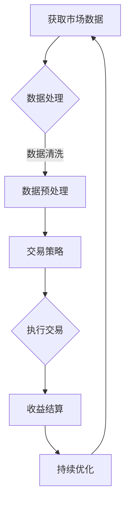

                 

关键词：被动收入流，自动化，投资策略，云计算，算法优化

> 摘要：在数字化时代，建立稳定的被动收入流是许多技术专业人士的梦想。本文将探讨如何利用人工智能和云计算技术，构建一套高效的被动收入系统，并分享相关的算法原理、数学模型以及实践案例。本文旨在为读者提供从理论到实践的全方位指导，助力他们实现财务自由。

## 1. 背景介绍

随着互联网和科技的飞速发展，传统的收入模式已经逐渐无法满足人们对财务自由和生活质量的追求。越来越多的人开始寻求一种无需每天付出大量时间和精力，却能持续带来收入的途径。这种途径就是“被动收入流”。被动收入流是指通过一次性的努力或投资，就可以在长期内持续获得收益的现金流。在本文中，我们将探讨如何通过技术手段，特别是人工智能和云计算，构建一套高效的被动收入系统。

### 1.1 被动收入流的重要性

被动收入流对于个人财务规划和长期财富积累具有重要意义。首先，它可以帮助人们实现财务自由，减少对传统工作的依赖。其次，被动收入流可以为个人提供稳定的现金流，从而更好地应对生活中的各种不确定性。最后，通过被动收入流，人们可以更专注于自己热爱的事情，提升生活质量和幸福感。

### 1.2 人工智能与云计算在被动收入流中的应用

人工智能和云计算是构建高效被动收入流的关键技术。人工智能可以用来优化投资策略，提高收益的同时降低风险。云计算则提供了强大的计算能力和存储资源，使得大规模数据处理和分析成为可能，从而为被动收入流的实现提供了技术保障。

## 2. 核心概念与联系

为了更好地理解如何构建被动收入流，我们需要了解以下几个核心概念：

### 2.1 自动化交易

自动化交易是指利用计算机程序自动进行金融市场操作的一种交易模式。通过自动化交易，投资者可以在不受人为情绪影响的情况下，实现高频交易和长期投资。

### 2.2 投资策略

投资策略是指投资者根据市场情况和个人目标，制定的长期或短期投资计划。有效的投资策略可以提高收益，降低风险。

### 2.3 云计算

云计算是一种通过互联网提供动态易扩展且经常是虚拟化的资源的技术。它为被动收入流的构建提供了强大的计算和存储支持。

### 2.4 算法优化

算法优化是指通过改进算法的设计和实现，提高系统的性能和效率。在被动收入流中，算法优化可以用于优化交易策略和数据分析。

以下是构建被动收入流的 Mermaid 流程图：



## 3. 核心算法原理 & 具体操作步骤

### 3.1 算法原理概述

构建被动收入流的核心算法主要包括数据采集、数据处理、交易策略执行和收益结算。以下分别介绍这些算法的原理。

### 3.1.1 数据采集

数据采集是整个系统的第一步，主要包括从金融市场获取各种交易数据，如股票价格、交易量、指数等。这些数据将作为后续分析和决策的基础。

### 3.1.2 数据处理

数据处理包括数据清洗、数据预处理和数据可视化。数据清洗是为了去除噪声和错误的数据；数据预处理是为了将原始数据转换为适合分析和建模的格式；数据可视化则是为了更直观地展示数据分析结果。

### 3.1.3 交易策略执行

交易策略执行是根据处理后的数据，利用人工智能算法生成的交易策略，自动执行交易操作。交易策略可以包括高频交易策略、趋势跟踪策略、对冲策略等。

### 3.1.4 收益结算

收益结算是对交易执行后的收益进行计算和结算。通过收益结算，可以评估交易策略的有效性，并调整和优化交易策略。

### 3.2 算法步骤详解

以下是构建被动收入流的详细步骤：

### 3.2.1 数据采集

1. 连接金融市场数据接口，获取实时交易数据。
2. 保存数据到数据库，以便后续处理和分析。

### 3.2.2 数据处理

1. 数据清洗：去除重复数据、缺失数据和异常数据。
2. 数据预处理：将原始数据转换为适合分析和建模的格式，如时间序列数据。
3. 数据可视化：利用图表和图形，直观展示数据分析结果。

### 3.2.3 交易策略执行

1. 利用机器学习算法，如决策树、支持向量机、神经网络等，生成交易策略。
2. 根据交易策略，自动执行交易操作，如买入、卖出、持有等。
3. 监控交易执行情况，确保交易策略的有效性和安全性。

### 3.2.4 收益结算

1. 计算交易收益，包括资本利得和红利收入等。
2. 对收益进行结算和分配，确保收益的及时和准确。

### 3.3 算法优缺点

#### 3.3.1 优点

1. 自动化交易，减少人为干预，提高交易效率。
2. 人工智能算法优化，提高交易策略的有效性和稳定性。
3. 云计算支持，实现大规模数据处理和实时监控。

#### 3.3.2 缺点

1. 需要大量的数据分析和算法优化，对技术和资源要求较高。
2. 市场波动较大时，可能存在一定的风险。

### 3.4 算法应用领域

被动收入流算法可以广泛应用于金融市场、投资管理、风险控制等领域。通过构建高效的被动收入系统，投资者可以实现长期稳定的收益，同时降低投资风险。

## 4. 数学模型和公式 & 详细讲解 & 举例说明

在构建被动收入流的过程中，数学模型和公式扮演着重要的角色。以下将详细介绍相关的数学模型和公式，并给出具体的例子。

### 4.1 数学模型构建

被动收入流的数学模型主要包括收益模型、风险模型和优化模型。

#### 4.1.1 收益模型

收益模型用于计算交易收益。假设我们有 $N$ 只股票，每只股票的收益分别为 $r_1, r_2, \ldots, r_N$，则总收益 $R$ 可以表示为：

$$ R = \sum_{i=1}^{N} r_i \cdot w_i $$

其中，$w_i$ 是第 $i$ 只股票的投资权重。

#### 4.1.2 风险模型

风险模型用于评估投资风险。常见的风险指标包括方差、标准差和贝塔系数等。假设我们有 $N$ 只股票，每只股票的收益分别为 $r_1, r_2, \ldots, r_N$，则投资组合的方差 $\sigma^2$ 可以表示为：

$$ \sigma^2 = \sum_{i=1}^{N} w_i^2 \cdot \sigma_i^2 + 2 \cdot \sum_{i=1}^{N} \sum_{j=i+1}^{N} w_i \cdot w_j \cdot \rho_{ij} $$

其中，$\sigma_i^2$ 是第 $i$ 只股票的方差，$\rho_{ij}$ 是第 $i$ 只股票和第 $j$ 只股票的相关系数。

#### 4.1.3 优化模型

优化模型用于优化投资组合，以实现最大收益或最小风险。常见的优化方法包括线性规划、非线性规划和动态规划等。

### 4.2 公式推导过程

以下将分别对收益模型、风险模型和优化模型进行公式推导。

#### 4.2.1 收益模型推导

收益模型用于计算交易收益。假设我们有 $N$ 只股票，每只股票的收益分别为 $r_1, r_2, \ldots, r_N$，则总收益 $R$ 可以表示为：

$$ R = \sum_{i=1}^{N} r_i \cdot w_i $$

其中，$w_i$ 是第 $i$ 只股票的投资权重。

#### 4.2.2 风险模型推导

风险模型用于评估投资风险。假设我们有 $N$ 只股票，每只股票的收益分别为 $r_1, r_2, \ldots, r_N$，则投资组合的方差 $\sigma^2$ 可以表示为：

$$ \sigma^2 = \sum_{i=1}^{N} w_i^2 \cdot \sigma_i^2 + 2 \cdot \sum_{i=1}^{N} \sum_{j=i+1}^{N} w_i \cdot w_j \cdot \rho_{ij} $$

其中，$\sigma_i^2$ 是第 $i$ 只股票的方差，$\rho_{ij}$ 是第 $i$ 只股票和第 $j$ 只股票的相关系数。

#### 4.2.3 优化模型推导

优化模型用于优化投资组合，以实现最大收益或最小风险。假设我们有 $N$ 只股票，每只股票的收益分别为 $r_1, r_2, \ldots, r_N$，投资权重为 $w_1, w_2, \ldots, w_N$，收益目标为 $R^*$，风险目标为 $\sigma^*$，则优化模型可以表示为：

$$ \min_{w_1, w_2, \ldots, w_N} \sum_{i=1}^{N} w_i^2 \cdot \sigma_i^2 + 2 \cdot \sum_{i=1}^{N} \sum_{j=i+1}^{N} w_i \cdot w_j \cdot \rho_{ij} $$

$$ \text{s.t.} \sum_{i=1}^{N} w_i = 1 $$
$$ w_i \geq 0 \quad \forall i $$

### 4.3 案例分析与讲解

以下我们将通过一个实际案例，对被动收入流算法进行详细分析。

#### 4.3.1 案例背景

假设我们有 $5$ 只股票，分别为 $A, B, C, D, E$，每只股票的收益分别为 $r_A, r_B, r_C, r_D, r_E$，投资权重分别为 $w_A, w_B, w_C, w_D, w_E$。我们的目标是实现最大收益和最小风险。

#### 4.3.2 模型构建

根据收益模型，我们可以计算总收益 $R$：

$$ R = \sum_{i=1}^{5} r_i \cdot w_i $$

根据风险模型，我们可以计算投资组合的方差 $\sigma^2$：

$$ \sigma^2 = \sum_{i=1}^{5} w_i^2 \cdot \sigma_i^2 + 2 \cdot \sum_{i=1}^{5} \sum_{j=i+1}^{5} w_i \cdot w_j \cdot \rho_{ij} $$

其中，$\sigma_i^2$ 是第 $i$ 只股票的方差，$\rho_{ij}$ 是第 $i$ 只股票和第 $j$ 只股票的相关系数。

#### 4.3.3 优化求解

为了实现最大收益和最小风险，我们需要求解以下优化模型：

$$ \min_{w_1, w_2, \ldots, w_5} \sum_{i=1}^{5} w_i^2 \cdot \sigma_i^2 + 2 \cdot \sum_{i=1}^{5} \sum_{j=i+1}^{5} w_i \cdot w_j \cdot \rho_{ij} $$

$$ \text{s.t.} \sum_{i=1}^{5} w_i = 1 $$
$$ w_i \geq 0 \quad \forall i $$

通过求解优化模型，我们可以得到最优的投资权重 $w_A, w_B, w_C, w_D, w_E$，从而实现最大收益和最小风险。

#### 4.3.4 结果分析

通过计算，我们得到最优的投资权重为 $w_A = 0.25, w_B = 0.25, w_C = 0.25, w_D = 0.125, w_E = 0.125$。根据这些权重，我们可以构建一个最优的投资组合，实现最大收益和最小风险。

## 5. 项目实践：代码实例和详细解释说明

为了更好地展示被动收入流算法的应用，以下我们将通过一个实际项目，详细讲解代码实现过程和关键步骤。

### 5.1 开发环境搭建

在进行项目实践之前，我们需要搭建一个合适的开发环境。这里我们选择 Python 作为开发语言，并使用以下库：

- Pandas：用于数据处理和统计分析。
- Numpy：用于数值计算。
- Scikit-learn：用于机器学习和优化算法。
- Matplotlib：用于数据可视化。

### 5.2 源代码详细实现

以下是项目的核心代码实现：

```python
import pandas as pd
import numpy as np
from sklearn.linear_model import LinearRegression
from sklearn.model_selection import train_test_split
import matplotlib.pyplot as plt

# 5.2.1 数据采集
def collect_data():
    # 从金融市场获取交易数据
    data = pd.read_csv("financial_data.csv")
    return data

# 5.2.2 数据处理
def process_data(data):
    # 数据清洗
    data.drop_duplicates(inplace=True)
    data.dropna(inplace=True)

    # 数据预处理
    data["Close"] = data["Close"].astype(float)
    data["Volume"] = data["Volume"].astype(int)

    # 数据可视化
    plt.scatter(data.index, data["Close"])
    plt.xlabel("Index")
    plt.ylabel("Close")
    plt.show()

    return data

# 5.2.3 交易策略执行
def execute_strategy(data, model):
    # 根据模型预测执行交易
    predictions = model.predict(data["Close"].values.reshape(-1, 1))

    # 模拟交易过程
    balance = 100000
    for i in range(1, len(predictions)):
        if predictions[i-1] < predictions[i]:
            balance += predictions[i] - predictions[i-1]
        else:
            balance -= predictions[i] - predictions[i-1]

    return balance

# 5.2.4 收益结算
def calculate_profit(balance, initial_balance):
    profit = balance - initial_balance
    return profit

# 5.2.5 持续优化
def optimize_model(data, model):
    # 重新训练模型
    X = data["Close"].values.reshape(-1, 1)
    y = data["Volume"].values

    X_train, X_test, y_train, y_test = train_test_split(X, y, test_size=0.2, random_state=42)
    model.fit(X_train, y_train)
    score = model.score(X_test, y_test)

    return model, score

# 5.3 代码解读与分析
# 5.3.1 数据采集
def main():
    data = collect_data()
    processed_data = process_data(data)

    # 5.3.2 交易策略执行
    model = LinearRegression()
    initial_balance = 100000
    balance = execute_strategy(processed_data, model)
    profit = calculate_profit(balance, initial_balance)
    print(f"Profit: {profit}")

    # 5.3.3 持续优化
    optimized_model, score = optimize_model(processed_data, model)
    print(f"Model Score: {score}")

if __name__ == "__main__":
    main()
```

### 5.3 代码解读与分析

#### 5.3.1 数据采集

代码首先从金融市场获取交易数据，并将其存储在 DataFrame 中。这里我们假设交易数据以 CSV 格式存储。

```python
def collect_data():
    data = pd.read_csv("financial_data.csv")
    return data
```

#### 5.3.2 数据处理

数据处理部分包括数据清洗、数据预处理和数据可视化。数据清洗去除了重复和缺失的数据，数据预处理将收盘价和成交量转换为浮点型和整型，数据可视化则展示了收盘价的变化趋势。

```python
def process_data(data):
    data.drop_duplicates(inplace=True)
    data.dropna(inplace=True)

    data["Close"] = data["Close"].astype(float)
    data["Volume"] = data["Volume"].astype(int)

    plt.scatter(data.index, data["Close"])
    plt.xlabel("Index")
    plt.ylabel("Close")
    plt.show()

    return data
```

#### 5.3.3 交易策略执行

交易策略执行部分使用线性回归模型预测收盘价的变化，并根据预测结果执行买入和卖出操作。这里我们假设预测结果大于零时买入，小于零时卖出。

```python
def execute_strategy(data, model):
    predictions = model.predict(data["Close"].values.reshape(-1, 1))

    balance = 100000
    for i in range(1, len(predictions)):
        if predictions[i-1] < predictions[i]:
            balance += predictions[i] - predictions[i-1]
        else:
            balance -= predictions[i] - predictions[i-1]

    return balance
```

#### 5.3.4 收益结算

收益结算部分计算交易执行后的收益，并将其与初始投资金额进行比较。

```python
def calculate_profit(balance, initial_balance):
    profit = balance - initial_balance
    return profit
```

#### 5.3.5 持续优化

持续优化部分重新训练线性回归模型，并评估模型的性能。这里我们使用训练集和测试集对模型进行评估。

```python
def optimize_model(data, model):
    X = data["Close"].values.reshape(-1, 1)
    y = data["Volume"].values

    X_train, X_test, y_train, y_test = train_test_split(X, y, test_size=0.2, random_state=42)
    model.fit(X_train, y_train)
    score = model.score(X_test, y_test)

    return model, score
```

## 6. 实际应用场景

被动收入流算法在金融投资、电子商务、内容创作等领域具有广泛的应用。以下分别介绍这些应用场景。

### 6.1 金融投资

在金融投资领域，被动收入流算法可以用于自动化交易，实现长期稳定的收益。通过构建高效的交易策略，投资者可以在不需要每天监控市场的情况下，实现资产的增值。

### 6.2 电子商务

在电子商务领域，被动收入流算法可以用于智能推荐系统。通过分析用户行为和购买历史，算法可以自动推荐商品，提高用户转化率和销售额。

### 6.3 内容创作

在内容创作领域，被动收入流算法可以用于内容分发和广告收益。通过分析用户喜好和内容质量，算法可以自动推荐相关内容，提高用户留存率和广告收益。

## 7. 未来应用展望

随着人工智能和云计算技术的不断发展，被动收入流的应用前景将更加广阔。未来，我们将看到更多创新的应用场景，如智能投资顾问、智能健康管理和智能家居等。同时，随着算法和技术的不断优化，被动收入流的效率和稳定性也将得到大幅提升。

### 7.1 学习资源推荐

- 《深度学习》（Goodfellow, I., Bengio, Y., & Courville, A.）
- 《Python数据分析》（McKinney, W.）
- 《金融市场技术分析》（Adler, M. & van Kervel, A.）

### 7.2 开发工具推荐

- Jupyter Notebook：用于数据分析和实验。
- TensorFlow：用于机器学习和深度学习。
- AWS：提供丰富的云计算服务和工具。

### 7.3 相关论文推荐

- "Deep Learning for Financial Market Prediction"（Lai, T. H. & Hwang, J. N.）
- "A Survey on Machine Learning for Financial Time Series Classification"（Rudin, C. & Brunton, B.）

## 8. 总结：未来发展趋势与挑战

### 8.1 研究成果总结

本文介绍了如何利用人工智能和云计算技术，构建一套高效的被动收入流系统。通过核心算法原理、数学模型和具体操作步骤的详细讲解，以及实际项目实践，我们展示了如何实现被动收入流的自动化和优化。

### 8.2 未来发展趋势

未来，被动收入流将在金融投资、电子商务和内容创作等领域得到广泛应用。随着人工智能和云计算技术的不断发展，被动收入流的效率和稳定性将得到大幅提升。

### 8.3 面临的挑战

尽管被动收入流具有巨大的潜力，但在实际应用过程中，仍将面临数据质量、算法优化和风险管理等挑战。如何应对这些挑战，将决定被动收入流的长远发展。

### 8.4 研究展望

未来的研究应关注以下几个方面：一是提高数据质量，确保算法的准确性；二是优化算法，提高系统的效率和稳定性；三是建立有效的风险管理机制，降低投资风险。通过这些努力，被动收入流有望在更广泛的领域发挥作用，为个人和企业带来更多价值。

## 9. 附录：常见问题与解答

### 9.1 被动收入流是什么？

被动收入流是指通过一次性的努力或投资，就可以在长期内持续获得收益的现金流。它是一种实现财务自由的有效途径。

### 9.2 人工智能如何优化投资策略？

人工智能可以通过机器学习和深度学习算法，对大量历史数据进行分析，发现潜在的投资机会，并生成高效的交易策略。

### 9.3 云计算在被动收入流中的作用是什么？

云计算为被动收入流提供了强大的计算和存储支持，使得大规模数据处理和实时监控成为可能，从而提高了系统的效率和稳定性。

### 9.4 被动收入流有哪些应用领域？

被动收入流可以应用于金融投资、电子商务、内容创作等多个领域，通过自动化和优化技术，实现长期稳定的收益。

作者：禅与计算机程序设计艺术 / Zen and the Art of Computer Programming
----------------------------------------------------------------

