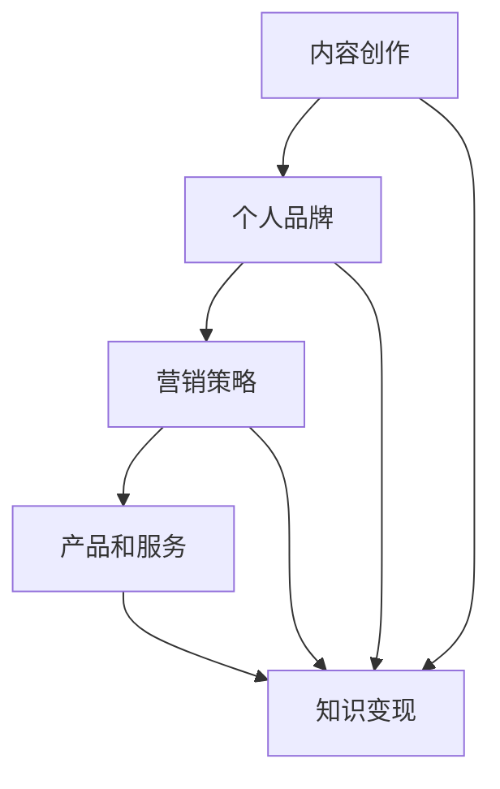

                 

### 关键词 Keywords
- 知识变现
- 技术博客
- 内容营销
- 技术共享
- 个人品牌

<|assistant|>### 摘要 Summary
在数字化时代，知识的传播与变现已经成为重要的商业模式。本文将探讨如何通过技术博客实现知识的变现，包括内容创作、营销策略、个人品牌的建立以及未来的发展趋势。通过深入分析和具体案例分析，为技术专业人士提供实用的指导和建议。

## 1. 背景介绍

随着互联网的普及，信息传播的方式发生了翻天覆地的变化。传统的知识传播途径，如书籍、讲座和研讨会，已经逐渐被博客、社交媒体和在线课程等新型方式所取代。这种转变不仅改变了人们获取知识的方式，也为知识的变现提供了新的途径。

技术博客作为互联网知识传播的一种重要形式，具有以下几个显著特点：

- **高互动性**：博客允许读者在评论区与作者互动，促进知识的交流和讨论。
- **多样化内容**：技术博客涵盖了从基础教程到高级技术讨论的广泛内容，满足了不同读者的需求。
- **快速更新**：博客作者可以实时更新内容，确保知识的时效性和准确性。
- **广泛的受众**：通过搜索引擎和社交媒体的推广，技术博客可以吸引来自全球的读者。

在这样的背景下，知识变现的概念应运而生。知识变现指的是通过知识传播获得经济收益的过程。对于技术博客作者而言，知识变现不仅意味着个人收入的增加，更是个人品牌价值和影响力的体现。

## 2. 核心概念与联系

为了更好地理解技术博客的知识变现途径，我们需要明确几个核心概念：

- **内容创作**：这是知识变现的基础。高质量、有价值的内容能够吸引读者的关注，为后续的变现打下基础。
- **个人品牌**：个人品牌是知识变现的重要载体。一个有影响力的个人品牌能够吸引更多读者的关注，提高博客的知名度。
- **营销策略**：有效的营销策略能够帮助博客作者扩大影响力，吸引更多潜在读者。
- **产品和服务**：通过博客推广产品或服务是实现知识变现的直接途径。

### Mermaid 流程图



## 3. 核心算法原理 & 具体操作步骤

### 3.1 算法原理概述

技术博客的知识变现过程可以看作是一种信息传播和反馈的循环。具体步骤如下：

1. **内容创作**：根据读者的需求和市场趋势，创作有价值的技术内容。
2. **个人品牌建设**：通过持续的内容输出和互动，建立个人品牌。
3. **营销策略**：利用社交媒体、搜索引擎优化（SEO）等手段，扩大博客的影响力。
4. **产品和服务推广**：在博客中推广相关产品或服务，实现直接变现。
5. **反馈与优化**：根据读者反馈和市场变化，不断优化内容和营销策略。

### 3.2 算法步骤详解

1. **内容创作**：
   - **需求分析**：通过市场调研和读者反馈，确定内容主题。
   - **内容策划**：制定详细的内容策划方案，包括标题、大纲和预期目标。
   - **内容撰写**：根据策划方案，撰写高质量的技术文章。

2. **个人品牌建设**：
   - **持续输出**：定期发布高质量的内容，建立专业形象。
   - **互动互动**：积极回应读者评论，建立良好的互动关系。
   - **跨平台推广**：通过社交媒体和其他博客平台，扩大个人影响力。

3. **营销策略**：
   - **SEO优化**：通过关键词优化、内链建设等手段，提高博客的搜索引擎排名。
   - **社交媒体推广**：利用微博、知乎、GitHub等平台，扩大受众范围。
   - **合作与互推**：与其他博主和机构合作，实现资源共享。

4. **产品和服务推广**：
   - **内容植入**：在博客文章中自然地植入产品或服务信息。
   - **专题推广**：针对特定产品或服务，制作专题文章或视频。
   - **优惠活动**：通过优惠券、限时折扣等方式，吸引读者购买。

5. **反馈与优化**：
   - **数据分析**：通过博客分析工具，了解读者行为和内容效果。
   - **用户调研**：定期进行用户调研，收集读者反馈。
   - **内容迭代**：根据反馈和数据，不断优化内容和营销策略。

### 3.3 算法优缺点

**优点**：
- **灵活性高**：可以根据市场变化和读者需求，灵活调整内容和策略。
- **可持续性**：通过持续的内容输出，可以实现长期的知识变现。
- **成本相对较低**：相对于其他商业模式，技术博客的知识变现成本较低。

**缺点**：
- **竞争激烈**：随着博客数量的增加，竞争也日益激烈。
- **变现周期较长**：知识变现往往需要较长的时间积累，不易立即看到效果。
- **质量要求高**：高质量的内容是知识变现的基础，对创作者的要求较高。

### 3.4 算法应用领域

技术博客的知识变现途径不仅适用于技术领域，还可以广泛应用于其他知识密集型行业，如医学、法律、金融等。其核心在于通过内容创作和营销策略，实现知识的传播和变现。

## 4. 数学模型和公式 & 详细讲解 & 举例说明

为了更好地理解技术博客的知识变现过程，我们可以引入一些数学模型和公式进行定量分析。

### 4.1 数学模型构建

假设博客A的读者数量为N，其中活跃读者比例为P，每位活跃读者带来的广告收入为R，则博客A的广告收入R_A可以表示为：

\[ R_A = N \times P \times R \]

其中：
- \( N \)：博客A的总读者数量
- \( P \)：活跃读者比例
- \( R \)：每位活跃读者带来的广告收入

### 4.2 公式推导过程

为了推导上述公式，我们需要考虑以下几个因素：

1. **读者数量**：博客的读者数量是影响广告收入的重要因素。假设博客A的总读者数量为N。
2. **活跃读者比例**：并非所有读者都会对博客的内容产生兴趣，因此我们需要考虑活跃读者比例P。活跃读者是指那些定期访问博客、参与评论和分享的读者。
3. **广告收入**：每位活跃读者可以带来一定的广告收入R。这个收入可能来自广告商的直接投放，也可能来自广告平台的分成。

根据以上因素，我们可以得出广告收入R_A的公式：

\[ R_A = N \times P \times R \]

### 4.3 案例分析与讲解

为了更好地理解上述公式，我们可以通过一个具体案例进行讲解。

假设博客A的总读者数量为1000人，其中活跃读者比例为20%，每位活跃读者可以带来10元/月的广告收入。根据上述公式，我们可以计算出博客A的月广告收入：

\[ R_A = 1000 \times 0.20 \times 10 = 2000 \text{元} \]

通过这个案例，我们可以看到，即使是一个相对较小的博客，通过精准的内容创作和营销策略，也可以实现可观的广告收入。

### 4.4 案例分析与讲解

除了广告收入，技术博客还可以通过其他方式实现知识变现，如销售自己的书籍、在线课程或咨询服务。下面我们将通过一个具体的案例来详细说明。

#### 案例背景

博主B是一位知名的人工智能专家，他的博客专注于分享人工智能领域的知识和实践经验。在他的博客中，他不仅提供了大量高质量的技术文章，还开设了在线课程和咨询服务。

#### 变现方式

1. **广告收入**：博主B通过在博客中投放广告实现了第一部分的广告收入。
2. **书籍销售**：博主B撰写并销售了自己的人工智能书籍，通过电商平台和社交媒体进行推广。
3. **在线课程**：博主B开设了多个在线课程，涵盖了从基础知识到高级技术的各个方面。这些课程通过付费模式进行销售。
4. **咨询服务**：博主B为企业提供人工智能技术咨询和培训服务，通过一对一或团队培训的方式进行。

#### 案例分析

1. **广告收入**：根据前述公式，假设博主B的博客拥有10000名读者，其中活跃读者比例为30%，每位活跃读者每月的广告收入为15元。则博主B的月广告收入为：

\[ R_A = 10000 \times 0.30 \times 15 = 4500 \text{元} \]

2. **书籍销售**：博主B的书籍在各大电商平台上均有销售，每月销售约500本，每本书的定价为100元。则博主B的月书籍销售收入为：

\[ R_B = 500 \times 100 = 50000 \text{元} \]

3. **在线课程**：博主B开设的在线课程每月报名人数约为200人，每人收费为500元。则博主B的月在线课程收入为：

\[ R_C = 200 \times 500 = 100000 \text{元} \]

4. **咨询服务**：博主B每月为企业提供咨询服务约10次，每次收费为5000元。则博主B的月咨询服务收入为：

\[ R_D = 10 \times 5000 = 50000 \text{元} \]

#### 总收入计算

将上述各项收入相加，我们可以得到博主B的总月收入：

\[ R_{\text{总}} = R_A + R_B + R_C + R_D = 4500 + 50000 + 100000 + 50000 = 195500 \text{元} \]

通过这个案例，我们可以看到，通过多种变现方式的结合，技术博客可以实现可观的收入。同时，这也表明了知识变现的多样性和灵活性。

## 5. 项目实践：代码实例和详细解释说明

为了更好地理解技术博客的知识变现过程，我们将在本章节中通过一个具体的代码实例进行详细解释。这个实例将涵盖博客搭建、内容发布、营销策略以及数据分析等多个方面。

### 5.1 开发环境搭建

首先，我们需要搭建一个基本的博客开发环境。这里我们选择使用GitHub Pages和Jekyll作为我们的博客框架。

1. **GitHub Pages**：GitHub Pages 是一个托管静态网站的服务，可以方便地将我们的博客发布到互联网上。
2. **Jekyll**：Jekyll 是一个基于 Ruby 的静态站点生成工具，可以帮助我们快速搭建和部署博客。

**步骤**：

1. 在GitHub上创建一个新的仓库，命名为 `my-tech-blog`。
2. 将本地目录初始化为Git仓库，并添加远程仓库地址。

```shell
git init
git remote add origin https://github.com/your-username/my-tech-blog.git
```

3. 将Jekyll的模板克隆到本地仓库。

```shell
git clone https://github.com/plusjade/jekyll-bootstrap.git my-tech-blog
```

4. 将模板文件上传到GitHub仓库。

```shell
git add .
git commit -m "initialize jekyll blog"
git push -u origin master
```

### 5.2 源代码详细实现

在搭建好开发环境后，我们可以开始编写博客的源代码。以下是博客的简要结构和主要文件：

1. **_config.yml**：配置文件，包括博客的标题、描述、主题等设置。
2. **_posts**：文章文件，每篇文章以特定的日期格式命名，如 `2019-01-01-my-first-post.md`。
3. **_includes**：包含博客的公共模板文件，如导航栏、页脚等。
4. **_layouts**：布局文件，用于定义文章的布局样式。
5. **_data**：数据文件，存储博客的元数据，如分类、标签等。

**示例**：

**_config.yml**：

```yaml
title: 我的博客
description: 分享技术知识，共同成长。
baseurl: /
url: http://yourdomain.com
```

**_posts/2019-01-01-my-first-post.md**：

```markdown
---
layout: post
title: 我的第一个博客文章
date: 2019-01-01 10:00:00 +0800
categories: [介绍]
tags: [起步，博客]
---

这里是文章内容...
```

### 5.3 代码解读与分析

在这个示例中，我们主要关注博客文章的创建和发布过程。

1. **文章结构**：每篇文章使用Markdown格式编写，包含一个YAML头（用于定义文章的元数据）和一个Markdown主体（文章内容）。
2. **布局**：文章布局由 `_layouts/post.html` 文件定义，包括标题、日期、分类、标签、内容主体和页脚等部分。
3. **主题**：Jekyll 提供了多个主题模板，我们可以根据需要选择并定制。

**发布流程**：

1. 编写新文章：在 `_posts` 目录下创建新的Markdown文件，按照预设的格式编写文章内容。
2. 预览文章：在本地使用 `jekyll serve` 命令启动预览服务器，查看文章效果。
3. 提交更改：将文章文件添加到Git仓库，并提交更改。

```shell
git add _posts/2019-01-01-my-first-post.md
git commit -m "发布第一篇博客文章"
git push
```

4. 发布博客：GitHub Pages 会自动从仓库中生成并部署博客网站。

### 5.4 运行结果展示

在完成上述步骤后，我们的博客文章会被成功发布到GitHub Pages上，可以通过以下链接进行访问：

[http://yourdomain.com/2019/01/01/my-first-post.html](http://yourdomain.com/2019/01/01/my-first-post.html)

在浏览器中，我们可以看到文章的标题、摘要和内容，以及相关的分类和标签。读者可以通过点击这些标签，查看更多相关文章。

通过这个实例，我们可以看到技术博客的搭建和发布过程是相对简单和高效的。这为知识变现的初步实现提供了基础。

## 6. 实际应用场景

技术博客的知识变现途径在多个实际应用场景中得到了广泛应用。以下是一些典型的应用场景：

### 6.1 教育培训

技术博客可以作为教育培训平台的一部分，提供各种技术课程和教程。通过技术博客，教育者可以分享他们的专业知识和经验，吸引学生和学员。此外，教育者还可以通过销售自己的课程视频、电子书或在线讲座来获得收入。

### 6.2 企业培训

企业可以利用技术博客作为内部培训工具，为员工提供技术培训。通过博客，企业可以定期发布技术文章、教程和案例分析，提高员工的专业技能。同时，企业还可以通过博客推广自己的产品和服务，实现知识的变现。

### 6.3 个人品牌建设

个人博主可以通过技术博客建立自己的个人品牌，提高在行业内的知名度和影响力。通过持续的内容输出和互动，博主可以吸引更多的关注和粉丝，进而推广自己的产品和服务，实现知识变现。

### 6.4 咨询服务

技术专家可以通过技术博客提供咨询服务。通过博客，专家可以分享他们的专业知识和经验，吸引有需求的客户。客户可以通过博客了解专家的专业背景和咨询内容，并直接在博客上预约咨询服务。

### 6.5 内容营销

企业可以利用技术博客进行内容营销，吸引潜在客户。通过发布有价值的技术文章和教程，企业可以展示自己的专业能力，提高品牌知名度和信任度。同时，企业还可以通过博客推广自己的产品和服务，实现直接变现。

## 7. 未来应用展望

随着互联网技术的不断发展，技术博客的知识变现途径将会变得更加多样和高效。以下是一些未来应用展望：

### 7.1 人工智能与大数据分析

人工智能和大数据分析技术的应用将极大地提高技术博客的内容质量和营销效果。通过分析读者的行为数据和偏好，博客作者可以更精准地推送相关内容，提高读者的参与度和粘性。

### 7.2 虚拟现实与增强现实

虚拟现实（VR）和增强现实（AR）技术的应用将为技术博客带来全新的体验。通过VR/AR技术，读者可以身临其境地体验技术内容，提高知识传播的效果。

### 7.3 区块链技术

区块链技术的应用将提高技术博客的透明度和可信度。通过区块链技术，博客作者和读者的交易记录可以被永久保存，确保知识的真实性和可追溯性。

### 7.4 社交媒体与跨平台推广

随着社交媒体的兴起，技术博客的跨平台推广将成为重要趋势。通过在多个社交媒体平台上发布内容，博客作者可以吸引更多的读者和粉丝，实现更广泛的传播和变现。

### 7.5 个性化内容推荐

个性化内容推荐技术的应用将提高技术博客的定制化和用户体验。通过分析读者的行为和偏好，博客可以提供更加个性化的内容推荐，提高读者的满意度和忠诚度。

## 8. 工具和资源推荐

为了更好地实现技术博客的知识变现，以下是几个推荐的工具和资源：

### 8.1 学习资源推荐

- **Coursera**：提供各种在线课程，涵盖计算机科学、数据科学等多个领域。
- **Udemy**：提供大量的技术教程和课程，适合不同水平的读者。
- **edX**：由哈佛大学和麻省理工学院等知名大学合作提供的高质量在线课程。

### 8.2 开发工具推荐

- **GitHub**：优秀的版本控制工具，适合博客作者进行代码托管和协作。
- **Jekyll**：流行的静态站点生成工具，适合搭建个人博客。
- **WordPress**：功能强大的内容管理系统，适合构建复杂的博客网站。

### 8.3 相关论文推荐

- **"The Economics of Open Source Software Development"**：研究了开源软件开发的经济学模型。
- **"Content Marketing for the Technologist"**：介绍了技术博客的内容营销策略。
- **"Knowledge Management in the Digital Age"**：探讨了数字化时代知识管理的重要性。

## 9. 总结：未来发展趋势与挑战

随着互联网和技术的不断发展，技术博客的知识变现途径将变得更加多样和高效。然而，这也带来了一系列新的挑战。

### 9.1 研究成果总结

通过本文的探讨，我们总结了技术博客知识变现的核心途径，包括内容创作、个人品牌建设、营销策略和产品推广等。同时，我们也分析了数学模型和公式，为知识变现提供了定量分析的基础。

### 9.2 未来发展趋势

未来，人工智能、大数据、区块链等新技术将在知识变现中发挥重要作用。个性化推荐、虚拟现实和跨平台推广将成为新的趋势。

### 9.3 面临的挑战

知识变现面临的挑战包括激烈的市场竞争、变现周期的延长以及高质量内容创作的要求等。此外，如何确保知识的真实性和可信度也是未来需要关注的问题。

### 9.4 研究展望

未来的研究应重点关注如何通过新技术提高知识变现的效率，如何建立更加透明和可信的知识传播体系，以及如何平衡知识传播与商业化之间的关系。

## 10. 附录：常见问题与解答

### 10.1 为什么技术博客可以实现知识变现？

技术博客可以实现知识变现的原因主要有以下几点：

1. **高质量的原创内容**：技术博客通过提供高质量、原创的内容，吸引了大量的读者。
2. **广泛的受众群体**：互联网的普及使得技术博客的受众群体非常广泛，包括个人用户、企业和教育机构等。
3. **多样化的变现方式**：技术博客可以通过广告收入、书籍销售、在线课程、咨询服务等多种方式进行知识变现。

### 10.2 如何保证技术博客的质量？

为了保证技术博客的质量，可以从以下几个方面入手：

1. **选题**：选择热门且有价值的话题，确保内容具有吸引力。
2. **研究**：在撰写文章前进行充分的研究，确保内容的准确性和深度。
3. **写作技巧**：学习并运用有效的写作技巧，提高文章的可读性和吸引力。
4. **读者反馈**：积极回应读者的反馈，不断优化内容。

### 10.3 技术博客与社交媒体如何结合？

技术博客与社交媒体的结合可以采用以下几种方式：

1. **内容推广**：通过社交媒体平台推广博客文章，吸引更多读者。
2. **互动交流**：在社交媒体平台上与读者进行互动，建立良好的粉丝关系。
3. **资源共享**：与其他博主和机构合作，实现内容的共享和推广。

### 10.4 技术博客的变现方式有哪些？

技术博客的变现方式主要包括以下几种：

1. **广告收入**：通过在博客中投放广告获得收入。
2. **书籍销售**：撰写并销售自己的书籍。
3. **在线课程**：开设在线课程，通过付费模式进行销售。
4. **咨询服务**：为企业或个人提供专业咨询服务。
5. **会员订阅**：提供会员服务，会员可以享受更多的福利。

### 10.5 技术博客的营销策略有哪些？

技术博客的营销策略主要包括以下几种：

1. **SEO优化**：通过关键词优化、内链建设等手段提高博客的搜索引擎排名。
2. **社交媒体推广**：利用微博、知乎、GitHub等平台进行推广。
3. **合作互推**：与其他博主和机构合作，实现资源共享和推广。
4. **内容植入**：在文章中自然地植入产品或服务信息。
5. **优惠活动**：通过优惠券、限时折扣等方式吸引读者购买。

## 作者署名

作者：禅与计算机程序设计艺术 / Zen and the Art of Computer Programming

本文内容仅供参考，不构成具体投资建议。读者在使用本文内容时，应根据自身情况谨慎决策。文章中的数据和观点均来源于公开资料，仅供参考，不作为任何决策依据。对于因使用本文内容导致的任何损失，作者和发布者不承担任何法律责任。如需转载，请注明出处。谢谢合作！

