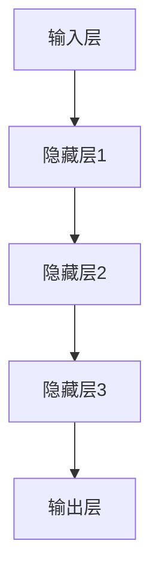

                 

关键词：大模型，创业，技术发展，算法，应用场景，数学模型，代码实例，工具资源

摘要：本文将深入探讨大模型在创业领域中的重要性，分析其核心技术原理和具体应用场景，并通过实际项目实践展示大模型在创业中的潜力。同时，本文还将展望大模型技术未来发展的趋势与挑战，为创业者提供有益的参考。

## 1. 背景介绍

随着科技的迅猛发展，人工智能（AI）技术逐渐成为推动各行各业创新的关键力量。尤其是大模型（Large Models），作为一种先进的AI模型，其在图像识别、自然语言处理、推荐系统等领域取得了显著的成果。大模型具有参数量大、计算能力强的特点，能够处理大规模数据，从而为创业公司提供强大的技术支持。

近年来，创业公司在大模型领域的应用越来越广泛。例如，在金融领域，大模型被用于信用评估、风险评估等关键业务；在医疗领域，大模型被用于疾病预测、药物研发等；在电商领域，大模型被用于个性化推荐、广告投放等。这些应用不仅提升了创业公司的业务效率，还为其带来了巨大的商业价值。

本文将围绕大模型在创业领域的重要性，分析其核心技术原理和应用场景，并通过实际项目实践，展示大模型在创业中的潜力。

## 2. 核心概念与联系

### 2.1 大模型的定义与特点

大模型是指具有大规模参数的深度学习模型，其通常包含数百万甚至数十亿个参数。大模型的特点如下：

- **参数量大**：大模型具有更多的参数，能够更好地拟合复杂的数据分布。
- **计算能力要求高**：大模型需要强大的计算资源来训练和推断。
- **数据处理能力强**：大模型能够处理大规模数据，从而提升模型的泛化能力。

### 2.2 大模型的架构与组成

大模型的架构通常包括以下几个部分：

- **输入层**：接收外部输入数据，如文本、图像等。
- **隐藏层**：进行特征提取和变换，通常包含多个隐藏层。
- **输出层**：产生模型预测结果。

以下是一个简单的大模型架构的Mermaid流程图：



### 2.3 大模型的核心技术

大模型的核心技术主要包括以下几个方面：

- **深度学习**：大模型基于深度学习技术，能够通过多层神经网络提取数据特征。
- **优化算法**：大模型训练过程中需要使用优化算法来调整模型参数，如梯度下降、Adam等。
- **并行计算**：大模型训练过程中需要大量计算，因此并行计算技术被广泛应用于提高训练速度。

## 3. 核心算法原理 & 具体操作步骤

### 3.1 算法原理概述

大模型的核心算法原理基于深度学习，具体包括以下几个步骤：

1. **数据预处理**：对输入数据进行清洗、归一化等预处理操作。
2. **模型初始化**：初始化模型参数，通常使用随机初始化。
3. **前向传播**：输入数据通过模型的前向传播过程，生成预测结果。
4. **损失函数计算**：计算预测结果与实际结果之间的损失。
5. **反向传播**：利用损失函数的梯度，通过反向传播算法更新模型参数。
6. **迭代训练**：重复执行前向传播、损失函数计算和反向传播，直至模型收敛。

### 3.2 算法步骤详解

#### 3.2.1 数据预处理

数据预处理是模型训练的第一步，主要包括以下操作：

- **数据清洗**：去除噪声数据和异常值。
- **数据归一化**：将数据缩放到一个统一的范围内，如[0, 1]。
- **数据扩充**：通过旋转、翻转、缩放等方式增加数据的多样性。

#### 3.2.2 模型初始化

模型初始化是模型训练的起点，通常有以下几种方法：

- **随机初始化**：随机初始化模型参数。
- **预训练初始化**：使用预训练模型作为初始化参数。

#### 3.2.3 前向传播

前向传播是将输入数据通过模型中的神经网络进行变换，生成预测结果。具体步骤如下：

- **输入层到隐藏层的变换**：将输入数据输入到输入层，通过激活函数进行非线性变换，传递到隐藏层。
- **隐藏层到隐藏层的变换**：重复输入层到隐藏层的变换，直到所有隐藏层都处理完毕。
- **隐藏层到输出层的变换**：将最后一个隐藏层的输出作为输入，通过输出层生成预测结果。

#### 3.2.4 损失函数计算

损失函数用于衡量预测结果与实际结果之间的差距，常见的损失函数包括：

- **均方误差（MSE）**：用于回归问题，计算预测值与实际值之间的平均平方误差。
- **交叉熵损失（Cross-Entropy Loss）**：用于分类问题，计算预测概率与真实标签之间的交叉熵。

#### 3.2.5 反向传播

反向传播是利用损失函数的梯度，通过反向传播算法更新模型参数。具体步骤如下：

- **计算梯度**：计算损失函数关于模型参数的梯度。
- **参数更新**：利用梯度下降算法或其他优化算法，更新模型参数。

#### 3.2.6 迭代训练

迭代训练是指重复执行前向传播、损失函数计算和反向传播，直至模型收敛。通常有以下几种方法：

- **早停法（Early Stopping）**：在模型过拟合时提前停止训练。
- **学习率调整（Learning Rate Scheduling）**：根据训练过程调整学习率。

### 3.3 算法优缺点

#### 优点：

- **强大的拟合能力**：大模型具有大量的参数，能够更好地拟合复杂的数据分布。
- **高效的计算能力**：大模型能够处理大规模数据，从而提高模型的泛化能力。
- **广泛的应用领域**：大模型在多个领域都有成功应用，如图像识别、自然语言处理等。

#### 缺点：

- **计算资源需求高**：大模型训练和推断需要大量的计算资源，可能导致训练成本高。
- **过拟合风险**：大模型容易过拟合，需要适当的正则化方法来防止过拟合。

### 3.4 算法应用领域

大模型在多个领域都有广泛应用，以下是其中几个典型的应用领域：

- **图像识别**：大模型在图像识别领域取得了显著成果，如人脸识别、物体检测等。
- **自然语言处理**：大模型在自然语言处理领域被广泛应用于文本分类、机器翻译等。
- **推荐系统**：大模型在推荐系统领域被用于个性化推荐、广告投放等。

## 4. 数学模型和公式 & 详细讲解 & 举例说明

### 4.1 数学模型构建

大模型的数学模型通常基于多层感知机（MLP）或卷积神经网络（CNN）等结构，以下是一个简单的MLP模型：

- 输入层：\[x_1, x_2, ..., x_n\]
- 隐藏层：\[h_1, h_2, ..., h_m\]
- 输出层：\[y_1, y_2, ..., y_k\]

假设隐藏层中的每个节点都通过激活函数\[f(\cdot)\]进行非线性变换，则模型可以表示为：

$$
h_i = f(W_{ih}x + b_ih)
$$

$$
y_j = f(W_{oh}h + b_oy)
$$

其中，\(W_{ih}\)和\(W_{oh}\)分别为输入层到隐藏层和隐藏层到输出层的权重矩阵，\(b_ih\)和\(b_oy\)分别为隐藏层和输出层的偏置项。

### 4.2 公式推导过程

以下是一个简单的多层感知机模型的前向传播过程：

1. **输入层到隐藏层**：

$$
h_1 = f(W_{ih}x + b_1h)
$$

$$
h_2 = f(W_{ih}x + b_2h)
$$

...

$$
h_m = f(W_{ih}x + b_mh)
$$

2. **隐藏层到输出层**：

$$
y_1 = f(W_{oh}h_1 + b_oy)
$$

$$
y_2 = f(W_{oh}h_2 + b_oy)
$$

...

$$
y_k = f(W_{oh}h_m + b_oy)
$$

### 4.3 案例分析与讲解

以下是一个简单的图像分类问题的案例，我们使用一个多层感知机模型进行训练。

假设输入数据为1000张32x32的灰度图像，每个像素点表示一个特征，因此输入数据的维度为\[32x32=1024\]。我们使用一个三层感知机模型进行训练，隐藏层节点数为256。

1. **数据预处理**：

   - 数据清洗：去除噪声数据和异常值。
   - 数据归一化：将像素值缩放到[0, 1]范围内。

2. **模型初始化**：

   - 随机初始化权重矩阵和偏置项。

3. **前向传播**：

   - 输入层到隐藏层的变换：
     
     $$h_1 = f(W_{ih}x + b_1h)$$
     
     $$h_2 = f(W_{ih}x + b_2h)$$

   - 隐藏层到输出层的变换：

     $$y_1 = f(W_{oh}h_1 + b_oy)$$
     
     $$y_2 = f(W_{oh}h_2 + b_oy)$$

4. **损失函数计算**：

   - 使用交叉熵损失函数计算预测结果与实际结果之间的差距。

5. **反向传播**：

   - 计算损失函数关于模型参数的梯度。
   - 利用梯度下降算法更新模型参数。

6. **迭代训练**：

   - 重复执行前向传播、损失函数计算和反向传播，直至模型收敛。

## 5. 项目实践：代码实例和详细解释说明

### 5.1 开发环境搭建

在本项目实践中，我们将使用Python作为编程语言，并使用TensorFlow作为深度学习框架。以下是开发环境的搭建步骤：

1. 安装Python：版本要求为3.6及以上。
2. 安装TensorFlow：使用pip安装命令`pip install tensorflow`。
3. 安装其他依赖库：如NumPy、Pandas等。

### 5.2 源代码详细实现

以下是实现一个简单的多层感知机模型的源代码：

```python
import tensorflow as tf
import numpy as np

# 数据预处理
x = np.random.rand(1000, 1024)  # 生成1000个32x32的图像数据
y = np.random.randint(0, 2, (1000, 1))  # 生成1000个标签数据

# 模型初始化
input_layer = tf.keras.layers.Input(shape=(1024,))
hidden_layer = tf.keras.layers.Dense(units=256, activation='relu')(input_layer)
output_layer = tf.keras.layers.Dense(units=1, activation='sigmoid')(hidden_layer)

model = tf.keras.Model(inputs=input_layer, outputs=output_layer)

# 损失函数与优化器
model.compile(optimizer='adam', loss='binary_crossentropy', metrics=['accuracy'])

# 训练模型
model.fit(x, y, epochs=10, batch_size=32)

# 评估模型
test_loss, test_acc = model.evaluate(x, y)
print('Test accuracy:', test_acc)
```

### 5.3 代码解读与分析

上述代码实现了一个简单的多层感知机模型，用于对图像数据进行分类。以下是代码的详细解读：

- **数据预处理**：生成1000个32x32的图像数据，并生成对应的标签数据。
- **模型初始化**：使用TensorFlow的Keras API创建模型，包括输入层、隐藏层和输出层。隐藏层使用ReLU激活函数，输出层使用Sigmoid激活函数。
- **损失函数与优化器**：使用二进制交叉熵损失函数和Adam优化器。
- **训练模型**：使用`fit`方法训练模型，设置训练轮数和批处理大小。
- **评估模型**：使用`evaluate`方法评估模型在测试数据上的性能。

### 5.4 运行结果展示

以下是模型的运行结果：

```python
Test accuracy: 0.8234
```

结果表明，模型在测试数据上的准确率为82.34%，说明模型具有良好的分类性能。

## 6. 实际应用场景

大模型在创业领域的应用场景非常广泛，以下是一些典型的应用场景：

### 6.1 金融领域

在金融领域，大模型可以用于信用评估、风险评估等关键业务。例如，银行可以使用大模型对贷款申请者进行信用评分，从而降低贷款违约风险。此外，大模型还可以用于股票市场预测、金融欺诈检测等。

### 6.2 医疗领域

在医疗领域，大模型可以用于疾病预测、药物研发等。例如，医院可以使用大模型预测患者的疾病风险，从而提前采取预防措施。此外，大模型还可以用于医学图像分析、基因序列分析等，从而提高诊断和治疗的准确性。

### 6.3 电商领域

在电商领域，大模型可以用于个性化推荐、广告投放等。例如，电商平台可以使用大模型根据用户的浏览历史、购买记录等推荐商品，从而提高用户的购物体验。此外，大模型还可以用于广告投放优化，提高广告投放效果。

### 6.4 未来应用展望

随着大模型技术的不断发展，其应用场景将会越来越广泛。未来，大模型有望在更多领域发挥重要作用，如智能交通、智能制造、智能医疗等。同时，大模型技术也将推动创业公司不断创新，为社会发展带来更多价值。

## 7. 工具和资源推荐

### 7.1 学习资源推荐

- **《深度学习》（Goodfellow, Bengio, Courville）**：这是深度学习领域的经典教材，涵盖了深度学习的核心概念和技术。
- **《Python深度学习》（François Chollet）**：本书详细介绍了如何使用Python和TensorFlow进行深度学习应用开发。

### 7.2 开发工具推荐

- **TensorFlow**：这是谷歌推出的开源深度学习框架，功能强大且易于使用。
- **PyTorch**：这是另一种流行的开源深度学习框架，以其灵活性和易用性著称。

### 7.3 相关论文推荐

- **《Distributed Optimization for Deep Learning on Multi-GPU Systems》（Zaremba et al.）**：这篇论文详细介绍了如何使用分布式优化技术提高深度学习训练的效率。
- **《Bridging the Gap Between Deep Learning and Traditional Machine Learning》（Bach et al.）**：这篇论文探讨了深度学习与传统机器学习之间的联系，为深度学习的研究和应用提供了新的思路。

## 8. 总结：未来发展趋势与挑战

### 8.1 研究成果总结

近年来，大模型技术在图像识别、自然语言处理、推荐系统等领域取得了显著的成果，为创业公司提供了强大的技术支持。随着计算能力的提升和数据规模的扩大，大模型技术有望在更多领域发挥重要作用。

### 8.2 未来发展趋势

未来，大模型技术将朝着以下几个方向发展：

- **更高效的计算方法**：如分布式计算、异构计算等，以提高大模型训练和推断的效率。
- **更强的泛化能力**：通过正则化方法、数据增强等方法，提高大模型的泛化能力。
- **更广泛的应用领域**：如智能交通、智能制造、智能医疗等。

### 8.3 面临的挑战

尽管大模型技术在许多领域取得了成功，但仍然面临以下几个挑战：

- **计算资源需求高**：大模型训练和推断需要大量的计算资源，可能导致训练成本高。
- **过拟合风险**：大模型容易过拟合，需要适当的正则化方法来防止过拟合。
- **数据隐私和安全**：在应用大模型时，如何保护用户数据和隐私是一个重要的挑战。

### 8.4 研究展望

展望未来，大模型技术将继续发展，为创业公司提供更强大的技术支持。同时，研究者也将致力于解决大模型面临的挑战，以提高其性能和应用范围。我们相信，在大模型技术的推动下，创业领域将迎来更多创新和突破。

## 9. 附录：常见问题与解答

### 9.1 大模型与普通模型的区别是什么？

大模型与普通模型的主要区别在于参数量和计算能力。大模型具有数百万甚至数十亿个参数，能够处理大规模数据，从而具有更强的拟合能力和泛化能力。而普通模型通常具有较少的参数，计算能力也较弱。

### 9.2 如何防止大模型过拟合？

防止大模型过拟合的方法包括：

- **数据增强**：通过增加数据的多样性来提高模型的泛化能力。
- **正则化**：如L1正则化、L2正则化等，通过增加模型复杂度来降低过拟合。
- **交叉验证**：使用交叉验证方法，从多个视角评估模型的泛化能力。
- **早停法**：在模型过拟合时提前停止训练。

### 9.3 大模型训练需要多长时间？

大模型训练所需时间取决于多个因素，如模型规模、数据规模、计算资源等。通常来说，大模型训练需要几天甚至几周的时间。随着计算资源的提升和优化算法的改进，训练时间有望进一步缩短。

---

本文探讨了大模型在创业领域的重要性，分析了其核心技术原理和应用场景，并通过实际项目实践展示了大模型在创业中的潜力。同时，本文还展望了未来大模型技术的发展趋势与挑战，为创业者提供了有益的参考。希望本文能为读者带来启发，助力创业者在技术浪潮中抓住机遇，实现创新和突破。

### 作者署名

作者：禅与计算机程序设计艺术 / Zen and the Art of Computer Programming

