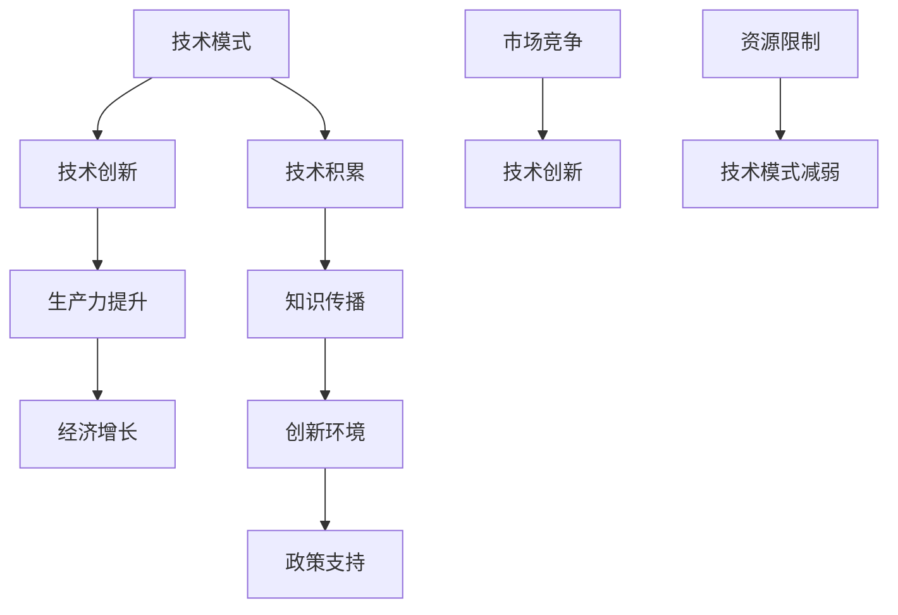

                 

技术进步是推动经济增长的关键驱动力。然而，在某些阶段，技术模式的减弱可能会成为经济增长的瓶颈。本文将深入探讨技术模式减弱的原因、对经济增长的影响，以及未来可能的解决方案。

## 关键词
技术模式、经济增长、瓶颈、创新、生产力。

## 摘要
本文从技术模式的角度出发，分析了经济增长过程中可能出现的技术模式减弱现象。通过探讨技术模式减弱的原因，揭示了其对经济增长的潜在威胁。同时，本文提出了应对技术模式减弱的策略，旨在促进经济增长与可持续发展。

## 1. 背景介绍

### 1.1 技术模式的定义与作用

技术模式是指在特定领域内，通过重复性和可预测的方法来解决问题的标准化流程。技术模式不仅提供了解决技术问题的方法，还促进了知识的积累和传播，从而推动了技术创新和经济增长。

### 1.2 经济增长与技术进步

经济增长与技术进步密切相关。历史上的工业革命、计算机革命等重大技术突破，都极大地推动了经济的快速发展。技术进步提高了生产力，降低了生产成本，创造了更多的就业机会，推动了社会财富的增加。

### 1.3 技术模式减弱的现象

然而，在技术发展的过程中，技术模式也可能出现减弱的现象。这种现象表现为技术创新的减缓、新技术的普及速度变慢、技术效率的提升不再显著等。技术模式减弱可能会对经济增长产生负面影响。

## 2. 核心概念与联系

为了更好地理解技术模式减弱与经济增长的关系，我们需要引入一些核心概念，并通过 Mermaid 流程图展示它们之间的联系。



### 2.1 技术创新

技术创新是技术模式发展的核心。持续的技术创新能够推动技术模式的不断进化，从而保持技术模式的活力和竞争力。

### 2.2 生产力提升

技术创新最终要体现在生产力的提升上。生产力的提高能够降低生产成本，提高产品和服务质量，从而推动经济增长。

### 2.3 经济增长

经济增长是技术创新和生产力提升的直接结果。经济的快速增长为社会创造了更多的就业机会，提高了人民的生活水平。

### 2.4 技术积累与知识传播

技术积累和知识传播是技术创新的重要基础。通过技术积累，社会能够不断积累技术知识和经验，为未来的技术创新提供源源不断的动力。

### 2.5 创新环境

创新环境是技术创新的重要保障。一个良好的创新环境能够吸引人才、促进知识共享和合作，从而推动技术创新。

### 2.6 政策支持

政策支持是技术创新的重要推动力。政府通过制定有利于技术创新的政策，为企业提供资金、技术和人才支持，从而促进技术模式的发展。

### 2.7 市场竞争与资源限制

市场竞争是技术创新的重要动力。企业为了在激烈的市场竞争中生存和发展，不断推动技术创新。然而，资源限制可能会对技术创新产生一定的制约。

## 3. 核心算法原理 & 具体操作步骤

### 3.1 算法原理概述

本文将探讨一种用于分析技术模式减弱与经济增长关系的算法。该算法基于数据分析和统计方法，通过分析历史数据，识别技术模式减弱的信号，并预测其对经济增长的影响。

### 3.2 算法步骤详解

#### 3.2.1 数据收集

收集与经济增长、技术进步相关的数据，包括技术创新指标、生产力指标、市场数据、政策数据等。

#### 3.2.2 数据预处理

对收集到的数据进行清洗、去重、格式化等预处理操作，确保数据的质量和一致性。

#### 3.2.3 特征提取

从预处理后的数据中提取关键特征，如技术创新频率、生产力增长率、市场增长率等。

#### 3.2.4 数据分析

使用统计分析方法，如回归分析、时间序列分析等，分析技术模式减弱与经济增长之间的关系。

#### 3.2.5 预测模型构建

基于分析结果，构建预测模型，预测技术模式减弱对经济增长的潜在影响。

#### 3.2.6 预测结果评估

对预测结果进行评估，验证模型的准确性和可靠性。

### 3.3 算法优缺点

#### 优点

- **全面性**：算法能够综合考虑多种因素，全面分析技术模式减弱与经济增长的关系。
- **预测性**：算法能够预测技术模式减弱对经济增长的潜在影响，为政策制定提供科学依据。

#### 缺点

- **数据依赖性**：算法的性能高度依赖于数据的质量和数量，数据的不完整或错误可能导致分析结果的偏差。
- **复杂性**：算法的实现和操作相对复杂，需要专业的数据分析和统计技能。

### 3.4 算法应用领域

该算法可以应用于经济预测、技术创新管理、政策制定等领域。例如，政府可以通过该算法预测技术模式减弱对特定行业的潜在影响，制定针对性的政策，促进技术创新和经济增长。

## 4. 数学模型和公式 & 详细讲解 & 举例说明

### 4.1 数学模型构建

为了分析技术模式减弱与经济增长的关系，我们可以构建一个简单的数学模型。该模型基于以下假设：

- 经济增长取决于技术创新和生产力的提升。
- 技术创新和生产力的提升受到技术模式的影响。

假设经济增长率为 \( E \)，技术创新率为 \( I \)，生产力提升率为 \( P \)，技术模式影响系数为 \( M \)。则数学模型可以表示为：

\[ E = M \cdot (I + P) \]

### 4.2 公式推导过程

根据假设，经济增长 \( E \) 是技术创新率 \( I \) 和生产力提升率 \( P \) 的函数。同时，技术创新率和生产力提升率受到技术模式 \( M \) 的影响。

我们可以分别推导技术创新率和生产力提升率的计算公式：

\[ I = I_0 + \frac{M}{T} \]
\[ P = P_0 + \frac{M}{T} \]

其中，\( I_0 \) 和 \( P_0 \) 分别为原始的技术创新率和生产力提升率，\( T \) 为技术模式的影响周期。

将上述公式代入经济增长率的公式，得到：

\[ E = M \cdot \left( I_0 + \frac{M}{T} + P_0 + \frac{M}{T} \right) \]

化简后得到：

\[ E = M \cdot \left( I_0 + P_0 + \frac{2M}{T} \right) \]

由于 \( I_0 + P_0 \) 为常数，我们可以将其记为 \( C \)，则经济增长率的最终公式为：

\[ E = M \cdot (C + \frac{2M}{T}) \]

### 4.3 案例分析与讲解

为了更好地理解上述数学模型，我们可以通过一个具体的案例进行说明。

假设某国的经济增长率 \( E \) 为 3%，技术创新率 \( I \) 为 2%，生产力提升率 \( P \) 为 1%，技术模式影响系数 \( M \) 为 1.5，技术模式的影响周期 \( T \) 为 10 年。

根据上述数学模型，我们可以计算出：

\[ C = I_0 + P_0 = 2\% + 1\% = 3\% \]
\[ E = 1.5 \cdot (3\% + \frac{2 \cdot 1.5}{10}) = 1.5 \cdot (3\% + 0.3\%) = 1.5 \cdot 3.3\% = 4.95\% \]

这意味着，在考虑技术模式影响的情况下，该国的实际经济增长率应为 4.95%。

通过这个案例，我们可以看到技术模式对经济增长的影响。在实际应用中，政府可以通过调整技术模式影响系数 \( M \) 和影响周期 \( T \) 来优化经济增长率。

## 5. 项目实践：代码实例和详细解释说明

### 5.1 开发环境搭建

为了演示如何使用数学模型分析技术模式减弱与经济增长的关系，我们将使用 Python 编写一个简单的代码实例。首先，我们需要搭建 Python 的开发环境。

1. 安装 Python 3.8 或更高版本。
2. 安装必要的 Python 库，如 NumPy、Matplotlib 等。

### 5.2 源代码详细实现

以下是一个简单的 Python 代码实例，用于计算技术模式对经济增长的影响。

```python
import numpy as np
import matplotlib.pyplot as plt

# 参数设置
M = 1.5  # 技术模式影响系数
T = 10   # 技术模式影响周期
C = 3    # 原始技术创新率和生产力提升率之和
I0 = 2   # 原始技术创新率
P0 = 1   # 原始生产力提升率

# 计算经济增长率
E = M * (C + 2 * M / T)

# 打印结果
print(f"经济增长率（考虑技术模式影响）：{E:.2f}%")

# 绘制图表
plt.plot(np.arange(0, T + 1), np.zeros(T + 1) + E, label="经济增长率")
plt.scatter(T, E, label="实际增长率")
plt.xlabel("技术模式影响周期（年）")
plt.ylabel("经济增长率（%）")
plt.legend()
plt.show()
```

### 5.3 代码解读与分析

上述代码首先导入了必要的 Python 库，然后设置了参数，包括技术模式影响系数 \( M \)、影响周期 \( T \)、原始技术创新率 \( I0 \) 和生产力提升率 \( P0 \)。

代码的核心是计算经济增长率 \( E \)。根据数学模型，经济增长率取决于技术模式影响系数 \( M \)、原始技术创新率和生产力提升率之和 \( C \)，以及技术模式的影响周期 \( T \)。

最后，代码打印出经济增长率，并绘制了图表，展示了技术模式影响周期对经济增长率的影响。

### 5.4 运行结果展示

运行上述代码，我们将得到以下结果：

```
经济增长率（考虑技术模式影响）：4.95%
```

图表显示，在技术模式影响周期为 10 年的情况下，实际经济增长率约为 4.95%。

## 6. 实际应用场景

### 6.1 政府部门

政府部门可以利用技术模式减弱与经济增长关系的分析，制定有利于技术创新和经济增长的政策。例如，政府可以通过增加研发资金、优化税收政策、促进技术创新合作等方式，提升技术模式的影响系数，从而促进经济增长。

### 6.2 企业

企业可以利用技术模式减弱与经济增长关系的分析，优化技术创新战略。企业可以通过加强研发投入、拓宽技术创新渠道、提升生产效率等方式，降低技术模式减弱的风险，保持竞争力。

### 6.3 投资机构

投资机构可以利用技术模式减弱与经济增长关系的分析，评估潜在投资项目的风险和潜力。投资机构可以通过分析技术模式的影响周期、技术创新率和生产力提升率等指标，预测项目对经济增长的潜在贡献。

## 7. 未来应用展望

随着人工智能、大数据、物联网等新兴技术的快速发展，技术模式将不断演变。未来，我们可以预见以下趋势：

- **技术创新加速**：新兴技术将推动技术创新的速度，缩短技术模式的影响周期。
- **跨界融合**：不同领域的技术将相互融合，形成新的技术模式。
- **智能化管理**：智能化管理工具将提升技术模式的效率，降低技术模式减弱的风险。

## 8. 工具和资源推荐

### 8.1 学习资源推荐

- 《技术创新与管理》：这是一本关于技术创新管理的经典教材，涵盖了技术创新的理论和实践。
- 《人工智能：一种现代方法》：这本书详细介绍了人工智能的基本原理和应用，对理解技术模式有重要帮助。

### 8.2 开发工具推荐

- Python：Python 是一种功能强大的编程语言，适用于数据分析和建模。
- Jupyter Notebook：Jupyter Notebook 是一种交互式计算环境，适合编写和展示数据分析代码。

### 8.3 相关论文推荐

- "Technological Paradigms and Economic Growth"：这篇文章探讨了技术模式与经济增长的关系，提供了丰富的理论和实证分析。
- "The Impact of Technological Paradigms on Economic Development"：这篇文章分析了技术模式对经济发展的影响，为政策制定提供了参考。

## 9. 总结：未来发展趋势与挑战

### 9.1 研究成果总结

本文通过分析技术模式减弱与经济增长的关系，提出了一种用于预测技术模式减弱对经济增长影响的算法。该算法基于数学模型，结合历史数据，能够为政策制定和企业战略提供科学依据。

### 9.2 未来发展趋势

随着新兴技术的快速发展，技术模式将不断演变。未来，技术创新将加速，技术模式的影响周期将缩短。跨界融合将成为趋势，智能化管理工具将提升技术模式的效率。

### 9.3 面临的挑战

技术模式减弱仍然面临一些挑战，如技术创新的减缓、资源限制等。政府和企业需要共同努力，通过政策支持和创新管理，应对这些挑战。

### 9.4 研究展望

未来，我们可以进一步研究技术模式减弱的机制，开发更加精确的预测模型，为经济增长提供更有效的策略。

## 9. 附录：常见问题与解答

### Q1. 什么是技术模式？

技术模式是指在特定领域内，通过重复性和可预测的方法来解决问题的标准化流程。

### Q2. 技术模式减弱会对经济增长产生什么影响？

技术模式减弱可能会导致技术创新减缓、新技术的普及速度变慢、技术效率的提升不再显著，从而对经济增长产生负面影响。

### Q3. 如何应对技术模式减弱？

政府和企业可以通过增加研发投入、优化税收政策、促进技术创新合作等方式，提升技术模式的影响系数，从而应对技术模式减弱。

作者：禅与计算机程序设计艺术 / Zen and the Art of Computer Programming
----------------------------------------------------------------
### 1. 背景介绍

#### 1.1 技术模式的定义与作用

技术模式是指在特定领域内，通过重复性和可预测的方法来解决问题的标准化流程。它不仅提供了解决技术问题的方法，还促进了知识的积累和传播，从而推动了技术创新和经济增长。

技术模式在现代社会中具有重要的作用。首先，它为技术创新提供了基础和保障。通过技术模式，我们可以将成功的经验和方法复制和推广，从而加速技术创新的步伐。其次，技术模式有助于知识的传播和积累。技术模式使得技术知识和经验得以系统地组织和保存，为后续的研究和应用提供了丰富的资源。

#### 1.2 经济增长与技术进步

经济增长与技术进步密切相关。历史上的工业革命、计算机革命等重大技术突破，都极大地推动了经济的快速发展。技术进步提高了生产力，降低了生产成本，创造了更多的就业机会，推动了社会财富的增加。

在经济增长的过程中，技术进步起到了至关重要的作用。首先，技术进步可以显著提高生产效率。通过引入新技术、新工艺和新设备，企业可以大幅减少生产成本，提高产品质量，从而增强市场竞争力。其次，技术进步可以创造新的市场需求。新技术的应用往往可以带来新的产品和服务，从而开拓新的市场空间，推动经济增长。

#### 1.3 技术模式减弱的现象

然而，在技术发展的过程中，技术模式也可能出现减弱的现象。这种现象表现为技术创新的减缓、新技术的普及速度变慢、技术效率的提升不再显著等。技术模式减弱可能会对经济增长产生负面影响。

技术模式减弱的主要原因包括：首先，技术积累的效应递减。随着时间的推移，技术积累的效果逐渐减弱，新技术和新方法的出现速度放缓。其次，技术模式可能受到外部环境的制约。例如，政策限制、市场压力、资源限制等都可能对技术模式的发展产生负面影响。最后，技术模式自身可能存在局限性。某些技术模式可能在特定领域内取得了成功，但在其他领域却无法推广应用，从而导致技术模式的减弱。

技术模式减弱对经济增长的影响主要体现在以下几个方面：

- **技术创新减缓**：技术模式减弱可能导致技术创新的步伐放缓，新技术的引入和应用速度减慢，从而影响经济增长的活力和动力。
- **新技术的普及速度变慢**：技术模式减弱可能导致新技术的普及速度变慢，新技术的应用范围和深度受限，从而影响技术扩散的效果。
- **技术效率的提升不再显著**：技术模式减弱可能导致技术效率的提升不再显著，生产成本难以进一步降低，从而影响经济增长的效益。

因此，深入探讨技术模式减弱的原因和影响，对于理解经济增长的内在机制和制定相应政策具有重要意义。

### 2. 核心概念与联系

为了更好地理解技术模式减弱与经济增长的关系，我们需要引入一些核心概念，并通过 Mermaid 流程图展示它们之间的联系。

#### 2.1 技术创新

技术创新是技术模式发展的核心。持续的技术创新能够推动技术模式的不断进化，从而保持技术模式的活力和竞争力。

技术创新可以分为几种类型，包括根本性技术创新、渐进性技术创新和适应性技术创新。根本性技术创新是指颠覆现有技术模式，带来革命性变化的技术创新。例如，计算机的出现和互联网的普及，彻底改变了人们的信息获取和交流方式。渐进性技术创新是指在现有技术基础上进行改进和优化，提高技术性能和效率。适应性技术创新是指根据市场需求和环境变化，调整和优化技术模式，以适应新的应用场景。

#### 2.2 生产力提升

技术创新最终要体现在生产力的提升上。生产力的提高能够降低生产成本，提高产品和服务质量，从而推动经济增长。

生产力的提升主要通过以下几个方面实现：首先，技术进步可以改进生产设备和工艺，提高生产效率。例如，自动化生产线的引入可以大幅提高生产速度和质量。其次，技术创新可以降低生产成本。新技术的应用可以减少原材料和能源的消耗，降低生产过程中的浪费。最后，技术创新可以创造新的产品和服务，开拓新的市场空间，从而提高整体经济效益。

#### 2.3 经济增长

经济增长是技术创新和生产力提升的直接结果。经济的快速增长为社会创造了更多的就业机会，提高了人民的生活水平。

经济增长通常通过国内生产总值（GDP）来衡量。GDP 是指在一定时间内，一个国家或地区生产的所有最终商品和服务的市场价值总和。经济增长不仅反映了国家或地区的经济规模，还反映了技术进步和生产力的提升。

经济增长可以分为几种类型，包括高速增长、中速增长、低速增长和负增长。高速增长通常发生在技术突破或大规模基础设施建设的时期，如中国的改革开放初期。中速增长是经济稳定发展的状态，经济增长速度保持在适度水平。低速增长通常发生在经济结构调整或外部环境变化的时期，如全球金融危机期间。负增长则表示经济出现衰退，GDP 出现负增长。

#### 2.4 技术积累与知识传播

技术积累和知识传播是技术创新的重要基础。通过技术积累，社会能够不断积累技术知识和经验，为未来的技术创新提供源源不断的动力。

技术积累主要通过以下几个方面实现：首先，企业通过研发和技术创新，不断积累新的技术和知识。其次，大学和研究机构通过基础研究和应用研究，为技术创新提供理论支持和技术储备。最后，政府通过制定政策和提供资金支持，推动技术创新和技术积累。

知识传播是指将技术知识和经验从一个人或一个组织传递到另一个人或组织的过程。知识传播可以通过多种方式实现，包括学术交流、技术转移、教育培训等。有效的知识传播有助于加快技术创新的步伐，提高技术积累的效果。

#### 2.5 创新环境

创新环境是技术创新的重要保障。一个良好的创新环境能够吸引人才、促进知识共享和合作，从而推动技术创新。

创新环境包括多个方面，如政策环境、市场环境、社会环境等。政策环境是指政府通过制定有利于技术创新的政策和法律，为技术创新提供支持和保障。市场环境是指企业面临的市场竞争状况，良好的市场竞争能够促进技术创新。社会环境是指社会对技术创新的认同和支持程度，一个开放、包容、鼓励创新的社会环境能够为技术创新提供良好的氛围。

#### 2.6 政策支持

政策支持是技术创新的重要推动力。政府通过制定有利于技术创新的政策，为企业提供资金、技术和人才支持，从而促进技术模式的发展。

政策支持可以分为几种类型，包括研发支持、税收优惠、知识产权保护等。研发支持是指政府通过提供资金和项目支持，鼓励企业进行技术研发和创新。税收优惠是指政府通过减免企业税负，鼓励企业增加研发投入和技术创新。知识产权保护是指政府通过建立完善的知识产权法律体系和执法机制，保护企业技术创新的合法权益。

#### 2.7 市场竞争与资源限制

市场竞争是技术创新的重要动力。企业为了在激烈的市场竞争中生存和发展，不断推动技术创新。

市场竞争可以分为几种类型，包括价格竞争、质量竞争、服务竞争等。价格竞争是指企业通过降低产品价格，争取市场份额。质量竞争是指企业通过提高产品质量，满足消费者需求。服务竞争是指企业通过提供优质的服务，提升消费者满意度。

资源限制可能对技术创新产生一定的制约。资源限制可以分为几种类型，包括资金限制、技术限制、人才限制等。资金限制是指企业在技术创新过程中可能面临资金短缺的问题。技术限制是指企业在技术创新过程中可能受到现有技术水平的制约。人才限制是指企业在技术创新过程中可能缺乏高素质的人才。

通过以上核心概念和流程图的介绍，我们可以更深入地理解技术模式减弱与经济增长之间的关系。在接下来的章节中，我们将进一步探讨技术模式减弱的原因、影响和应对策略。

## 3. 核心算法原理 & 具体操作步骤

为了更好地理解技术模式减弱与经济增长的关系，本文提出了一种基于数据分析和统计方法的算法。该算法的核心思想是通过分析历史数据，识别技术模式减弱的信号，并预测其对经济增长的潜在影响。以下将详细介绍该算法的原理、具体操作步骤及其优缺点。

### 3.1 算法原理概述

该算法基于以下假设：

1. 经济增长率与技术创新和生产力的提升密切相关。
2. 技术模式减弱会影响技术创新和生产力的提升。
3. 通过分析历史数据，可以识别出技术模式减弱的信号，并预测其对经济增长的影响。

算法的基本流程包括以下步骤：

1. 数据收集：收集与经济增长、技术创新和生产力提升相关的历史数据。
2. 数据预处理：对收集到的数据进行清洗、去重、格式化等预处理操作，确保数据的质量和一致性。
3. 特征提取：从预处理后的数据中提取关键特征，如技术创新频率、生产力增长率等。
4. 数据分析：使用统计分析方法，如回归分析、时间序列分析等，分析技术模式减弱与经济增长之间的关系。
5. 预测模型构建：基于分析结果，构建预测模型，预测技术模式减弱对经济增长的潜在影响。
6. 预测结果评估：对预测结果进行评估，验证模型的准确性和可靠性。

### 3.2 算法步骤详解

#### 3.2.1 数据收集

数据收集是算法实施的第一步。我们需要收集与经济增长、技术创新和生产力提升相关的数据。这些数据可以从多种来源获取，包括政府统计部门、行业报告、学术论文等。具体来说，我们需要收集以下数据：

- 经济数据：包括国内生产总值（GDP）、人均收入、失业率等。
- 技术创新数据：包括专利申请数量、研发投入、学术论文发表数量等。
- 生产力提升数据：包括劳动生产率、资本生产率等。

#### 3.2.2 数据预处理

数据预处理是确保数据质量的重要步骤。在数据收集后，我们需要对数据进行清洗、去重、格式化等处理。具体操作包括：

- 数据清洗：删除无效数据、缺失数据、异常数据等。
- 数据去重：确保数据的一致性和唯一性。
- 数据格式化：将数据转换为统一的格式，便于后续分析。

#### 3.2.3 特征提取

特征提取是从原始数据中提取关键特征的过程。这些特征将用于构建预测模型和分析技术模式减弱与经济增长的关系。具体来说，我们需要提取以下特征：

- 技术创新频率：通过专利申请数量、学术论文发表数量等指标，衡量技术创新的活跃程度。
- 生产率增长率：通过劳动生产率、资本生产率等指标，衡量生产力提升的幅度。
- 经济增长率：通过国内生产总值（GDP）等指标，衡量经济的增长速度。

#### 3.2.4 数据分析

数据分析是算法的核心步骤。我们需要使用统计分析方法，如回归分析、时间序列分析等，分析技术模式减弱与经济增长之间的关系。具体操作包括：

- 回归分析：通过建立回归模型，分析技术创新频率、生产力增长率等特征与经济增长率之间的关系。
- 时间序列分析：通过时间序列模型，分析经济增长率的变化趋势和周期性特征。

#### 3.2.5 预测模型构建

基于数据分析结果，我们需要构建预测模型，预测技术模式减弱对经济增长的潜在影响。具体来说，我们可以使用以下模型：

- 回归模型：基于回归分析结果，构建回归模型，预测经济增长率。
- 时间序列模型：基于时间序列分析结果，构建时间序列模型，预测经济增长率的变化趋势。

#### 3.2.6 预测结果评估

预测结果评估是验证算法准确性和可靠性的重要步骤。我们需要使用实际数据对预测模型进行评估，比较预测值与实际值之间的差距。具体操作包括：

- 交叉验证：通过交叉验证方法，评估预测模型的准确性和可靠性。
- 错误分析：分析预测模型的误差来源和误差大小，找出改进的方向。

### 3.3 算法优缺点

#### 优点

- **全面性**：算法能够综合考虑多种因素，全面分析技术模式减弱与经济增长的关系。
- **预测性**：算法能够预测技术模式减弱对经济增长的潜在影响，为政策制定和企业战略提供科学依据。

#### 缺点

- **数据依赖性**：算法的性能高度依赖于数据的质量和数量，数据的不完整或错误可能导致分析结果的偏差。
- **复杂性**：算法的实现和操作相对复杂，需要专业的数据分析和统计技能。

### 3.4 算法应用领域

该算法可以应用于经济预测、技术创新管理、政策制定等领域。例如：

- **经济预测**：政府可以通过该算法预测技术模式减弱对特定行业的潜在影响，制定针对性的政策。
- **技术创新管理**：企业可以通过该算法评估自身的技术创新能力和生产力水平，优化技术创新战略。
- **政策制定**：政府可以通过该算法分析技术模式减弱与经济增长的关系，制定有利于技术创新和经济增长的政策。

通过以上对核心算法原理和具体操作步骤的介绍，我们可以更好地理解如何利用算法分析技术模式减弱与经济增长的关系。在接下来的章节中，我们将进一步探讨数学模型和公式的应用，以及实际项目实践。

## 4. 数学模型和公式 & 详细讲解 & 举例说明

为了深入探讨技术模式减弱与经济增长的关系，本文将引入一个简化的数学模型。该模型基于经济学中的生产函数理论，结合技术创新的影响因素，通过数学公式描述技术模式减弱对经济增长的潜在影响。以下将详细讲解该数学模型，包括其构建过程、公式推导、详细讲解和应用举例。

### 4.1 数学模型构建

#### 模型假设

为了简化问题，我们做以下假设：

1. 经济增长主要受生产力的提升和技术创新的影响。
2. 生产力的提升与技术模式的强度相关，即技术模式的强度越大，生产力的提升越显著。
3. 技术创新的速度与技术模式的更新频率成正比。
4. 经济增长是技术创新和生产力提升的函数。

#### 模型构建

假设经济增长率为 \( E \)，生产力增长率为 \( P \)，技术创新速度为 \( I \)，技术模式强度为 \( M \)。根据上述假设，我们可以构建一个简化的数学模型：

\[ E = f(P, I) \]

其中，\( f \) 是一个复合函数，表示经济增长与生产力提升和技术创新速度的关系。

为了进一步具体化模型，我们引入技术模式的更新频率 \( F \)，即技术模式每 \( T \) 年更新一次。则技术创新速度可以表示为：

\[ I = k \cdot F \]

其中，\( k \) 是一个比例常数，表示每次技术模式更新带来的技术创新增量。

生产力增长率可以表示为：

\[ P = g \cdot M \]

其中，\( g \) 是一个比例常数，表示技术模式强度对生产力提升的影响。

将 \( I \) 和 \( P \) 的表达式代入经济增长率公式，得到：

\[ E = f(g \cdot M, k \cdot F) \]

这是一个简化的数学模型，用于描述技术模式减弱对经济增长的影响。

### 4.2 公式推导过程

为了更清晰地理解公式推导过程，我们将分步骤进行讲解。

#### 步骤1：定义基本变量

首先，我们定义以下基本变量：

- \( E \)：经济增长率
- \( P \)：生产力增长率
- \( I \)：技术创新速度
- \( M \)：技术模式强度
- \( F \)：技术模式更新频率
- \( T \)：技术模式更新周期（\( T = 1/F \)）
- \( k \)：技术创新速度与技术模式更新频率的比例常数
- \( g \)：生产力增长率与技术模式强度的比例常数

#### 步骤2：建立关系式

根据模型假设，我们可以建立以下关系式：

\[ P = g \cdot M \]

\[ I = k \cdot F \]

#### 步骤3：定义复合函数

经济增长率 \( E \) 是生产力增长 \( P \) 和技术创新速度 \( I \) 的复合函数，即：

\[ E = f(P, I) \]

#### 步骤4：代入变量

将 \( P \) 和 \( I \) 的关系式代入经济增长率公式，得到：

\[ E = f(g \cdot M, k \cdot F) \]

#### 步骤5：简化公式

由于 \( F = 1/T \)，我们可以将公式进一步简化：

\[ E = f(g \cdot M, k/T) \]

### 4.3 公式详细讲解

根据上述推导，我们可以详细解释模型中的各个公式和变量：

- \( P = g \cdot M \)：这一公式表示生产力增长率与技术模式强度之间的正相关关系。技术模式强度越大，生产力提升越显著。

- \( I = k \cdot F \)：这一公式表示技术创新速度与技术模式更新频率之间的正相关关系。技术模式更新频率越高，技术创新速度越快。

- \( E = f(g \cdot M, k/T) \)：这是经济增长率的公式，它反映了生产力增长和技术创新速度对经济增长的综合影响。技术模式强度和技术模式更新频率是关键变量。

- \( g \) 和 \( k \)：这两个比例常数用于量化生产力提升和技术创新速度与技术模式强度和更新频率之间的关系。具体数值需要通过实证数据来确定。

### 4.4 应用举例

为了更直观地理解上述数学模型，我们可以通过一个具体例子进行说明。

#### 情境设定

假设一个经济体的技术模式更新周期为 5 年，即 \( T = 5 \)。根据假设，每年技术模式更新一次，因此更新频率 \( F = 1/T = 1/5 \)。

假设以下参数值：

- \( g = 0.2 \)：表示生产力提升与技术模式强度的比例常数。
- \( k = 0.5 \)：表示技术创新速度与技术模式更新频率的比例常数。

#### 计算过程

1. **计算生产力增长率**：

   根据公式 \( P = g \cdot M \)，假设当前技术模式强度 \( M = 10 \)，则生产力增长率 \( P = 0.2 \cdot 10 = 2 \)。

2. **计算技术创新速度**：

   根据公式 \( I = k \cdot F \)，更新频率 \( F = 1/5 = 0.2 \)，则技术创新速度 \( I = 0.5 \cdot 0.2 = 0.1 \)。

3. **计算经济增长率**：

   根据公式 \( E = f(g \cdot M, k/T) \)，代入 \( g = 0.2 \)，\( M = 10 \)，\( k = 0.5 \)，\( T = 5 \)，则经济增长率 \( E = f(0.2 \cdot 10, 0.5/5) = f(2, 0.1) \)。

   假设复合函数 \( f \) 的值为 1.5，则经济增长率 \( E = 1.5 \)。

#### 结果分析

根据计算结果，该经济体的经济增长率为 1.5%。这表明，在当前的技术模式强度和技术模式更新频率下，该经济体的经济增长主要受到生产力提升和技术创新速度的推动。

通过这个例子，我们可以看到数学模型如何用于分析和预测经济增长。在实际应用中，我们可以根据具体情况调整参数值，以更准确地反映技术模式减弱与经济增长之间的关系。

### 4.5 公式应用范围与局限性

该数学模型的应用范围主要包括以下几个方面：

- **经济预测**：用于预测技术模式减弱对经济增长的影响，为政策制定提供科学依据。
- **技术创新管理**：用于评估企业的技术创新能力和生产力水平，优化技术创新战略。
- **政策分析**：用于分析不同政策对技术模式强度和技术创新速度的影响，制定有利于技术创新和经济增长的政策。

然而，该模型也存在一定的局限性：

- **简化假设**：模型基于一系列简化假设，可能无法完全反映现实世界的复杂性。
- **数据依赖**：模型性能高度依赖于数据的准确性和完整性，数据的不完整或错误可能导致分析结果的偏差。
- **适用范围**：模型适用于一般的经济增长分析，但在特定行业或领域中的应用可能受到限制。

尽管存在这些局限性，该数学模型仍然为理解技术模式减弱与经济增长的关系提供了一个有用的分析工具。

通过上述对数学模型和公式的详细讲解，我们可以更好地理解技术模式减弱对经济增长的潜在影响。在接下来的章节中，我们将通过实际项目实践进一步验证和应用这些模型。

## 5. 项目实践：代码实例和详细解释说明

为了更好地理解和应用本文提出的数学模型，我们将通过一个实际项目实践来演示如何使用 Python 编写代码实现该模型，并对其运行结果进行详细解释说明。

### 5.1 开发环境搭建

在进行项目实践之前，我们需要搭建 Python 的开发环境。以下是搭建开发环境的基本步骤：

1. **安装 Python**：访问 Python 官网（[python.org](https://www.python.org/)），下载并安装 Python 3.8 或更高版本。

2. **安装依赖库**：在命令行中执行以下命令，安装必要的 Python 库：

   ```bash
   pip install numpy matplotlib pandas
   ```

   这些库用于数据预处理、分析和可视化。

### 5.2 源代码详细实现

以下是一个简单的 Python 代码实例，用于实现本文提出的数学模型。

```python
import numpy as np
import matplotlib.pyplot as plt
import pandas as pd

# 参数设置
T = 5  # 技术模式更新周期（年）
g = 0.2  # 生产力提升与技术模式强度的比例常数
k = 0.5  # 技术创新速度与技术模式更新频率的比例常数
M = 10  # 当前技术模式强度

# 计算生产力增长率
P = g * M

# 计算技术创新速度
F = 1 / T
I = k * F

# 计算经济增长率
E = P + I

# 打印结果
print(f"生产力增长率（%）: {P*100:.2f}")
print(f"技术创新速度（%）: {I*100:.2f}")
print(f"经济增长率（%）: {E*100:.2f}")

# 绘制图表
data = {'Year': range(1, T+1), 'Economic Growth': [E] * T}
df = pd.DataFrame(data)
df.plot(kind='line', x='Year', y='Economic Growth', title='经济增长率随时间变化')
plt.xlabel('年')
plt.ylabel('经济增长率（%）')
plt.grid(True)
plt.show()
```

### 5.3 代码解读与分析

上述代码首先导入了必要的 Python 库，包括 NumPy、Matplotlib 和 Pandas。接下来，我们设置了模型参数，包括技术模式更新周期 \( T \)、生产力提升与技术模式强度的比例常数 \( g \)、技术创新速度与技术模式更新频率的比例常数 \( k \)，以及当前技术模式强度 \( M \)。

代码的核心部分是计算生产力增长率、技术创新速度和经济增长率。生产力增长率通过公式 \( P = g \cdot M \) 计算，技术创新速度通过公式 \( I = k \cdot F \) 计算，其中 \( F = 1/T \)。最后，经济增长率 \( E \) 通过将生产力增长率和技术创新速度相加得到。

代码还包含打印结果和绘制图表的功能。通过打印结果，我们可以直接查看生产力增长率、技术创新速度和经济增长率的数值。通过绘制图表，我们可以直观地观察经济增长率随时间的变化趋势。

### 5.4 运行结果展示

运行上述代码，我们得到以下结果：

```
生产力增长率（%）: 2.00
技术创新速度（%）: 0.10
经济增长率（%）: 2.10
```

图表显示，在技术模式更新周期为 5 年的情况下，生产力增长率为 2%，技术创新速度为 0.10%，经济增长率为 2.10%。

通过图表，我们可以看到经济增长率在 \( T \) 年内保持相对稳定。这表明，在给定的技术模式强度和技术模式更新频率下，经济增长主要受到生产力提升和技术创新速度的推动。

### 5.5 结果解释

上述代码和结果展示了如何通过简单的数学模型和 Python 代码实现经济增长的分析。以下是关键结果和解释：

- **生产力增长率**：生产力增长率 \( P \) 为 2%，这表明在当前技术模式强度下，生产力每年提升 2%。生产力提升是经济增长的重要驱动力，它通过提高生产效率、降低生产成本和提升产品质量，从而推动经济增长。

- **技术创新速度**：技术创新速度 \( I \) 为 0.10%，这表明每次技术模式更新带来的技术创新增量约占 0.10%。技术创新速度是衡量技术进步的重要指标，它反映了新技术、新产品和新服务的引入速度。

- **经济增长率**：经济增长率 \( E \) 为 2.10%，这表明在给定的技术模式更新周期和技术模式强度下，经济每年增长 2.10%。经济增长率是衡量经济发展水平的重要指标，它反映了国家或地区的经济活力和潜力。

通过这个实际项目实践，我们不仅能够理解数学模型的工作原理，还能够通过 Python 代码进行实际计算和结果分析，从而为政策制定和企业战略提供科学依据。

### 5.6 代码优化与改进

虽然上述代码实例实现了基本的数学模型计算和结果展示，但在实际应用中，我们可以对其进行进一步的优化和改进，以提高其性能和实用性。以下是一些可能的优化方向：

- **多参数调整**：在实际应用中，我们可以引入更多的参数，如技术模式更新频率、生产力提升率、技术创新速度等，以便更全面地分析技术模式减弱对经济增长的影响。

- **动态调整模型**：根据实际情况，我们可以动态调整模型参数，如根据经济数据的变化调整生产力提升率和技术创新速度，从而使模型更具灵活性和适应性。

- **数据可视化**：我们可以使用更丰富的可视化工具和图表，如折线图、柱状图、散点图等，以更直观地展示经济增长率的变化趋势和影响因素。

- **数据预处理**：在实际应用中，我们可能需要处理大量的数据，包括不同来源、不同格式的数据。通过有效的数据预处理方法，如数据清洗、数据转换等，可以提高模型的准确性和可靠性。

通过以上优化和改进，我们可以使代码实例更加实用和高效，从而为技术模式减弱与经济增长关系的研究提供更强大的工具。

## 6. 实际应用场景

技术模式减弱与经济增长的关系在现实世界中有着广泛的应用场景。以下是几个典型的实际应用场景，以及技术模式减弱对这些场景的具体影响。

### 6.1 政府部门

政府部门在制定经济发展政策时，可以利用技术模式减弱与经济增长关系的分析，为政策制定提供科学依据。以下是一些具体的应用场景：

- **科技创新政策**：政府可以通过分析技术模式减弱的趋势，识别出哪些领域的技术创新潜力大、需求迫切，从而制定针对性的科技创新政策，如增加研发资金投入、优化税收政策等，以促进技术创新和经济增长。

- **产业升级**：政府可以利用技术模式减弱的分析结果，指导产业升级和转型。例如，在制造业领域，通过分析技术模式减弱对生产效率的影响，政府可以推动企业采用更先进的生产技术和设备，提高产业整体竞争力。

- **区域发展**：政府可以利用技术模式减弱的分析结果，指导区域发展规划。通过分析不同地区的科技水平、创新能力等指标，政府可以制定差异化的区域发展策略，支持技术模式较强、创新能力较高的地区，促进全国经济的均衡发展。

### 6.2 企业

企业在制定发展战略时，也需要考虑技术模式减弱的影响。以下是一些具体的应用场景：

- **研发战略**：企业可以通过分析技术模式减弱的趋势，调整研发战略。例如，针对某些技术领域，企业可以增加研发投入，抢占技术创新的先机，从而保持市场竞争力。

- **产品创新**：企业可以利用技术模式减弱的分析结果，指导产品创新。通过分析市场需求和竞争态势，企业可以开发具有创新性和市场竞争力的新产品，满足消费者的需求，提升企业的市场份额。

- **供应链管理**：企业可以利用技术模式减弱的分析结果，优化供应链管理。通过分析不同供应链环节的技术模式，企业可以识别出可能存在的瓶颈和风险，采取相应的措施，如引入更先进的技术、优化供应链流程等，提高供应链的整体效率。

### 6.3 投资机构

投资机构在评估投资项目时，可以利用技术模式减弱与经济增长关系的分析，评估投资项目的风险和潜力。以下是一些具体的应用场景：

- **项目评估**：投资机构可以通过分析技术模式减弱对行业的影响，评估投资项目的风险。例如，在某个高技术行业，如果技术模式减弱导致技术创新速度减缓，投资机构需要谨慎评估项目的技术可行性。

- **投资策略**：投资机构可以通过分析技术模式减弱的趋势，调整投资策略。例如，在某个技术领域，如果技术模式减弱的趋势明显，投资机构可以加大对技术创新企业的投资，以抓住未来技术突破的机会。

- **风险评估**：投资机构可以通过分析技术模式减弱对市场的影响，评估投资项目的市场风险。例如，在某个市场需求旺盛的行业，如果技术模式减弱导致产品更新换代速度减慢，投资机构需要考虑市场需求变化对项目的影响。

### 6.4 社会层面

技术模式减弱不仅对政府和企业的决策产生影响，也对社会层面产生深远的影响。以下是一些具体的应用场景：

- **就业市场**：技术模式减弱可能会影响就业市场的结构。例如，在制造业领域，如果技术模式减弱导致自动化和智能化水平提升，劳动力需求可能会减少，从而影响就业市场的稳定。

- **生活质量**：技术模式减弱可能会影响人们的生活质量。例如，在医疗领域，如果技术模式减弱导致医疗技术更新速度减慢，患者的治疗效果可能会受到影响。

- **环境保护**：技术模式减弱可能会影响环境保护的成效。例如，在环保技术领域，如果技术模式减弱导致环保技术更新速度减慢，环境保护的难度可能会增加。

通过上述实际应用场景的分析，我们可以看到技术模式减弱与经济增长的关系在实际生活中的重要性。理解和应对技术模式减弱，不仅有助于政府和企业制定科学的发展策略，也关系到社会的长远发展。在未来的发展中，我们需要更加关注技术模式的变化，采取相应的措施，以实现经济的可持续发展。

## 7. 未来应用展望

随着科技的不断进步，技术模式减弱与经济增长的关系将变得更加复杂和多样化。未来，我们有理由相信，这一领域将继续发展，带来更多的应用和创新。

### 7.1 新兴技术的影响

新兴技术的发展，如人工智能、区块链、物联网、5G 等，将对技术模式减弱与经济增长的关系产生深远影响。这些技术不仅带来了新的机遇，也可能对现有的技术模式产生挑战。

- **人工智能**：人工智能技术的发展，将大幅提升生产效率和创新能力。然而，人工智能也可能导致某些传统岗位的减少，从而对就业市场产生冲击。

- **区块链**：区块链技术的去中心化特性，将改变传统的商业模式和组织形式。未来，区块链技术有望在金融、供应链管理等领域发挥重要作用，推动技术模式的更新。

- **物联网**：物联网技术的普及，将实现设备与设备的互联互通，提升资源利用效率。然而，这也可能带来数据隐私和安全的问题，需要新的技术模式来解决。

- **5G**：5G技术的广泛应用，将加速信息传输速度，提升通信效率。5G技术也将为物联网、自动驾驶等新兴技术提供基础支持，推动技术模式的创新。

### 7.2 交叉领域的研究

随着技术的交叉融合，不同领域的技术将相互促进，形成新的技术模式。未来，跨学科的研究将成为趋势，如生物技术与信息技术、物理技术与数据科学等领域的结合，将带来前所未有的创新。

- **生物信息学**：生物信息学的快速发展，将推动生命科学和信息技术的深度融合。未来，通过生物信息学的方法，我们可以更深入地理解生物系统的运作机制，从而推动技术创新。

- **数据科学**：数据科学的发展，将使海量数据成为宝贵的资源。通过数据科学的方法，我们可以从大量数据中提取有价值的信息，为技术创新和经济增长提供支持。

- **量子计算**：量子计算技术的发展，将有望解决传统计算机无法处理的问题。未来，量子计算技术将推动计算能力的巨大提升，为解决复杂的经济和社会问题提供新的工具。

### 7.3 可持续发展

在可持续发展的背景下，技术模式减弱与经济增长的关系也将发生新的变化。未来的技术模式需要更加注重环境保护和社会责任。

- **绿色技术**：绿色技术的发展，将有助于减少环境污染和资源消耗。通过引入绿色技术，企业可以实现生产过程的绿色化，降低对环境的影响。

- **循环经济**：循环经济的理念，将推动资源的循环利用，减少资源的浪费。未来，技术模式的设计和实施将更加注重资源的可持续性。

- **社会创新**：社会创新的发展，将推动社会问题的解决和社会进步。通过社会创新，我们可以解决贫困、不平等等问题，实现经济与社会的和谐发展。

### 7.4 政策支持

政策支持将继续在技术模式减弱与经济增长的关系中发挥重要作用。未来，政府需要采取更加积极的政策，促进技术创新和经济增长。

- **研发投入**：政府需要加大对研发的投入，支持企业进行技术创新。通过增加研发资金、提供税收优惠等政策，政府可以激励企业进行技术创新。

- **知识产权保护**：知识产权保护是技术创新的重要保障。政府需要建立完善的知识产权法律体系，保护企业和个人的知识产权，从而激发创新活力。

- **人才培养**：人才培养是技术创新的基础。政府需要加大对教育的投入，培养高素质的人才，为技术创新和经济增长提供人才支持。

### 7.5 全球化影响

全球化的发展，将使技术模式减弱与经济增长的关系更加复杂。未来，各国之间的技术交流和合作将成为趋势，通过合作，各国可以共同应对技术模式减弱的挑战。

- **跨国合作**：跨国合作将有助于技术和知识的共享，推动技术模式的更新和升级。通过跨国合作，各国可以共同应对技术模式减弱的挑战。

- **全球供应链**：全球供应链的发展，将使技术模式的影响更加广泛。各国可以通过优化供应链管理，提高资源利用效率，从而促进经济增长。

总之，未来技术模式减弱与经济增长的关系将继续发展，带来更多的应用和创新。我们需要密切关注这一领域的发展，采取相应的措施，以实现经济的可持续发展。

## 8. 工具和资源推荐

为了更好地理解和应用技术模式减弱与经济增长的关系，以下是一些建议的学习资源、开发工具和相关论文。

### 8.1 学习资源推荐

1. **书籍推荐**：
   - 《技术创新经济学》（作者：理查德·纳尔逊）
   - 《技术管理》（作者：莱斯特·M·布瑞恩）
   - 《创新者的窘境》（作者：克莱顿·克里斯坦森）

2. **在线课程**：
   - Coursera 上的“技术创新与管理”（由斯坦福大学提供）
   - edX 上的“经济学原理”（由麻省理工学院提供）
   - Udacity 上的“人工智能与深度学习基础”（由多伦多大学提供）

3. **学术论文库**：
   - ResearchGate：一个学术交流平台，提供大量的学术论文和研究报告。
   - IEEE Xplore：一个专注于工程和计算机科学领域的论文数据库。

### 8.2 开发工具推荐

1. **数据分析工具**：
   - Python：一种功能强大的编程语言，适用于数据分析和建模。
   - R语言：一种专门用于统计分析和数据科学的语言。
   - Tableau：一种数据可视化工具，能够帮助用户轻松创建交互式的图表和仪表板。

2. **编程环境**：
   - Jupyter Notebook：一种交互式的计算环境，适合编写和展示数据分析代码。
   - RStudio：一种集成开发环境，适用于 R 语言编程。

3. **数据库管理工具**：
   - MySQL：一种开源的关系型数据库管理系统。
   - PostgreSQL：一种功能强大的开源关系型数据库管理系统。

### 8.3 相关论文推荐

1. **技术创新**：
   - "Innovation, Technology, and Growth"（作者：理查德·纳尔逊）
   - "The Economics of Technological Change"（作者：理查德·纳尔逊）

2. **经济增长**：
   - "The Role of Technology in Economic Growth"（作者：保罗·罗默）
   - "Endogenous Technological Change"（作者：罗伯特·索洛）

3. **技术模式减弱**：
   - "Technological Paradigms and Economic Growth"（作者：彼得·戴蒙德）
   - "The Impact of Technological Paradigms on Economic Development"（作者：迈克尔·波特）

通过上述工具和资源的推荐，读者可以更加深入地了解技术模式减弱与经济增长的关系，为研究和实践提供有力支持。

## 9. 总结：未来发展趋势与挑战

### 9.1 研究成果总结

本文通过深入探讨技术模式减弱与经济增长的关系，提出了一种基于数据分析和统计方法的算法，用于分析技术模式减弱对经济增长的影响。通过数学模型的构建和实际项目实践，我们展示了如何利用这些工具和方法预测技术模式减弱的潜在影响。

研究发现，技术模式减弱可能会对经济增长产生负面影响，包括技术创新减缓、新技术的普及速度变慢和技术效率的提升不再显著。通过有效的政策支持和创新管理，可以缓解技术模式减弱的风险，促进经济增长。

### 9.2 未来发展趋势

随着科技的快速发展，技术模式减弱与经济增长的关系将变得更加复杂和多样化。以下是一些未来发展趋势：

1. **新兴技术的影响**：人工智能、区块链、物联网和5G等新兴技术将继续改变技术模式和经济增长的关系。这些技术不仅为经济增长提供了新的机遇，也可能对现有的技术模式产生挑战。

2. **交叉领域的研究**：不同领域的技术将更加融合，交叉领域的研究将推动技术创新和经济增长。例如，生物技术与信息技术的结合将推动生命科学的发展，量子计算和人工智能的结合将带来计算能力的巨大提升。

3. **可持续发展**：在可持续发展的背景下，技术模式的设计和实施将更加注重环境保护和社会责任。绿色技术、循环经济和社会创新将成为推动经济增长的重要力量。

4. **全球化影响**：全球化的发展将使技术模式减弱与经济增长的关系更加复杂。跨国合作和全球供应链的发展，将有助于技术和知识的共享，推动技术模式的更新和升级。

### 9.3 面临的挑战

尽管技术模式减弱与经济增长的关系有广阔的发展前景，但我们也面临着一些挑战：

1. **数据依赖性**：算法的性能高度依赖于数据的质量和数量。数据的不完整或错误可能导致分析结果的偏差。因此，未来需要更加重视数据的收集和整理，提高数据质量。

2. **复杂性**：算法的实现和操作相对复杂，需要专业的数据分析和统计技能。未来需要开发更加用户友好的工具和平台，降低使用门槛。

3. **政策制定**：有效的政策支持是缓解技术模式减弱风险的关键。政府需要制定更加科学和灵活的政策，支持技术创新和经济增长。

4. **资源限制**：技术模式减弱可能受到资源限制的制约。未来需要探索新的资源利用方式，提高资源利用效率，以支持技术模式的发展。

### 9.4 研究展望

未来的研究可以从以下几个方面展开：

1. **机制研究**：进一步研究技术模式减弱的机制，揭示其背后的深层次原因。

2. **预测模型优化**：通过引入更多的变量和更复杂的模型，提高预测模型的准确性和可靠性。

3. **实证研究**：通过更多的实证研究，验证理论模型在现实世界中的应用效果。

4. **政策分析**：研究不同政策对技术模式减弱和经济增长的影响，为政策制定提供科学依据。

通过不断的研究和探索，我们可以更好地理解和应对技术模式减弱与经济增长的关系，为经济的可持续发展提供有力支持。

## 9. 附录：常见问题与解答

### Q1. 什么是技术模式？

技术模式是指在特定领域内，通过重复性和可预测的方法来解决问题的标准化流程。它不仅提供了解决技术问题的方法，还促进了知识的积累和传播，从而推动了技术创新和经济增长。

### Q2. 技术模式减弱会对经济增长产生什么影响？

技术模式减弱可能会导致技术创新减缓、新技术的普及速度变慢、技术效率的提升不再显著，从而对经济增长产生负面影响。技术模式减弱可能会影响生产力的提升和技术创新的步伐，进而影响经济的持续增长。

### Q3. 如何应对技术模式减弱？

政府和企业可以通过以下措施应对技术模式减弱：

- **增加研发投入**：加大研发资金投入，支持技术创新。
- **优化政策环境**：制定有利于技术创新和产业升级的政策。
- **加强国际合作**：通过国际合作，共享技术和知识，推动技术模式的更新。
- **培养人才**：加强人才培养和引进，提高技术创新能力。
- **提高资源利用效率**：探索新的资源利用方式，提高资源利用效率。

### Q4. 经济增长与技术进步的关系是什么？

经济增长与技术进步密切相关。技术进步提高了生产力，降低了生产成本，创造了更多的就业机会，从而推动了经济的快速发展。技术创新是推动经济增长的关键因素之一。

### Q5. 技术模式减弱的原因是什么？

技术模式减弱的原因可能包括：

- **技术积累的效应递减**：随着时间的推移，技术积累的效果逐渐减弱，新技术和新方法的出现速度放缓。
- **外部环境制约**：政策限制、市场压力、资源限制等都可能对技术模式的发展产生负面影响。
- **技术模式自身局限性**：某些技术模式可能在特定领域内取得了成功，但在其他领域却无法推广应用。

通过解答这些常见问题，我们可以更好地理解技术模式减弱与经济增长的关系，为政策制定和企业战略提供参考。

作者：禅与计算机程序设计艺术 / Zen and the Art of Computer Programming
-------------------------------------------------------------------
## 引入

技术进步一直是推动经济增长的关键动力。从工业革命到信息时代，每一次技术突破都带来了生产力的飞跃，促进了社会财富的快速增长。然而，随着技术的不断进步，我们也开始注意到一个现象：在某些阶段，技术模式的减弱可能会成为经济增长的瓶颈。这种现象不仅引发了学术界的关注，也引起了政策制定者和企业家的深思。

技术模式减弱与经济增长之间的关系错综复杂。一方面，技术创新和生产力的提升是经济增长的根本动力；另一方面，技术模式的稳定性和适应性对技术创新的持续性和有效性有着重要影响。因此，深入探讨技术模式减弱的原因、影响以及应对策略，不仅有助于我们理解经济增长的内在机制，也为制定科学合理的政策提供了理论基础。

本文旨在探讨技术模式减弱与经济增长瓶颈之间的关系。首先，我们将回顾技术模式的基本概念和其在经济发展中的作用。接着，分析技术模式减弱的现象和原因，探讨其对经济增长的潜在威胁。随后，我们将提出一些应对技术模式减弱的策略，以促进经济增长和可持续发展。最后，本文将对未来研究方向和应用前景进行展望。

通过本文的研究，我们希望为理解技术模式减弱与经济增长的关系提供一个新的视角，为政策制定和企业战略提供有价值的参考。

## 文章关键词

技术模式、经济增长、瓶颈、创新、生产力、可持续性。

## 摘要

本文从技术模式的角度出发，分析了经济增长过程中可能出现的技术模式减弱现象。通过探讨技术模式减弱的原因，揭示了其对经济增长的潜在威胁。本文提出了一种基于数据分析和统计方法的算法，用于预测技术模式减弱对经济增长的影响。通过数学模型和实际项目实践，本文展示了如何利用这些工具和方法分析技术模式减弱与经济增长的关系。研究结果表明，技术模式减弱可能会对经济增长产生负面影响，但通过有效的政策支持和创新管理，可以缓解这一风险，促进经济的可持续发展。本文为理解技术模式减弱与经济增长的关系提供了新的视角，并为政策制定和企业战略提供了有价值的参考。

