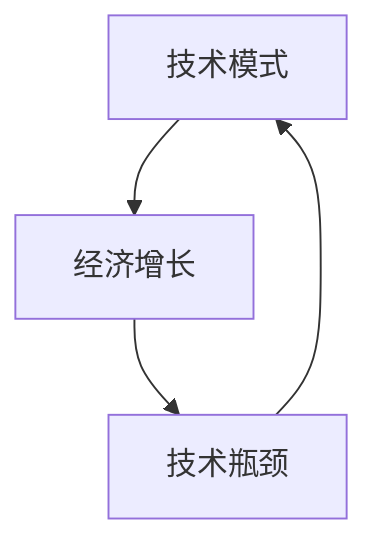
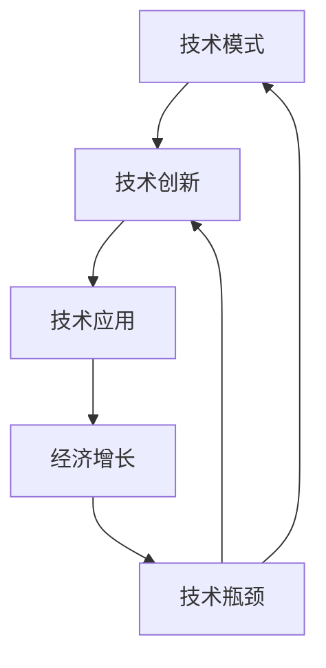

                 

关键词：技术模式，经济增长，挑战，未来趋势，算法优化，数学模型，应用场景，开发工具

> 摘要：随着技术的不断进步，技术模式在推动经济增长方面发挥了重要作用。然而，近年来，技术模式的减弱现象引起了广泛关注。本文将深入探讨技术模式减弱的原因及其对经济增长的影响，分析核心概念与联系，介绍核心算法原理与具体操作步骤，讲解数学模型和公式，展示项目实践代码实例，探讨实际应用场景，并展望未来的发展趋势与挑战。

## 1. 背景介绍

在过去的几十年里，技术的快速发展为经济增长带来了巨大的动力。从互联网到大数据，从人工智能到区块链，技术模式的创新不断推动着各行各业的变革。然而，近年来，技术模式的减弱现象逐渐显现。许多研究表明，技术模式的减弱可能会对经济增长产生负面影响。本文旨在探讨这一现象的原因、影响及其应对策略。

## 2. 核心概念与联系

为了深入理解技术模式减弱的原因，我们需要了解以下几个核心概念：技术模式、经济增长、技术瓶颈等。

### 2.1 技术模式

技术模式是指技术发展的路径和规律。它包括技术发明、创新、应用和推广等环节。技术模式决定了技术的演进方向和速度。

### 2.2 经济增长

经济增长是指国民经济总体生产能力的提高。它通常通过国内生产总值（GDP）等指标来衡量。经济增长是国家和企业发展的关键目标。

### 2.3 技术瓶颈

技术瓶颈是指技术在发展过程中遇到的难题和限制。技术瓶颈可能导致技术发展的停滞，从而影响经济增长。

### 2.4 技术模式与经济增长的联系

技术模式与经济增长之间存在密切的联系。技术模式决定了技术的创新速度和应用范围，从而影响经济增长的规模和速度。同时，经济增长又为技术模式的创新提供了动力和资源支持。

### 2.5 Mermaid 流程图

下面是一个描述技术模式、经济增长和技术瓶颈之间关系的 Mermaid 流程图：



## 3. 核心算法原理 & 具体操作步骤

### 3.1 算法原理概述

为了应对技术模式减弱带来的挑战，我们需要优化算法，提高技术效率。本文将介绍一种核心算法——深度强化学习（Deep Reinforcement Learning，简称DRL）。DRL是一种结合深度学习和强化学习的方法，旨在通过自主学习实现高效决策。

### 3.2 算法步骤详解

#### 3.2.1 环境建模

首先，我们需要根据实际问题建立环境模型。环境模型包括状态空间、动作空间和奖励函数。

#### 3.2.2 网络架构设计

接下来，我们需要设计合适的神经网络架构。常用的神经网络架构包括卷积神经网络（CNN）、循环神经网络（RNN）和长短时记忆网络（LSTM）等。

#### 3.2.3 优化算法选择

为了提高DRL算法的收敛速度和性能，我们需要选择合适的优化算法。常用的优化算法包括Adam、RMSprop和SGD等。

#### 3.2.4 训练过程

在训练过程中，我们需要通过模拟环境来获取数据，并利用这些数据不断调整神经网络的参数。训练过程通常包括探索（Exploration）和利用（Utilization）两个阶段。

### 3.3 算法优缺点

#### 优点：

- DRL可以处理高维状态和动作空间，具有广泛的应用场景。
- DRL具有强大的泛化能力，可以在不同环境下进行有效决策。

#### 缺点：

- DRL训练过程可能需要大量计算资源和时间。
- DRL对环境模型的准确性要求较高，否则可能导致决策失误。

### 3.4 算法应用领域

DRL算法在多个领域具有广泛应用，如自动驾驶、游戏智能和智能推荐等。

## 4. 数学模型和公式 & 详细讲解 & 举例说明

### 4.1 数学模型构建

为了描述DRL算法的核心机制，我们需要构建以下数学模型：

#### 4.1.1 状态转移概率

$$P(s'|s, a) = \pi(a|s)\pi(s'|a)$$

其中，$P(s'|s, a)$表示在状态$s$下执行动作$a$后转移到状态$s'$的概率，$\pi(a|s)$表示在状态$s$下选择动作$a$的概率，$\pi(s'|a)$表示在执行动作$a$后转移到状态$s'$的概率。

#### 4.1.2 奖励函数

$$R(s, a) = \sum_{t=0}^{\infty} \gamma^t r_t$$

其中，$R(s, a)$表示在状态$s$下执行动作$a$的累积奖励，$\gamma$是折扣因子，$r_t$是第$t$时刻的即时奖励。

#### 4.1.3 策略梯度

$$\nabla_\theta J(\theta) = \nabla_\theta \sum_{s, a} \pi(a|s) Q(s, a)$$

其中，$\nabla_\theta J(\theta)$是策略梯度，$\pi(a|s)$是策略参数，$Q(s, a)$是状态-动作价值函数。

### 4.2 公式推导过程

#### 4.2.1 状态转移概率推导

状态转移概率可以通过马尔可夫决策过程（MDP）的基本性质推导得到。具体推导过程如下：

$$P(s'|s, a) = \sum_{a'} P(s'|s, a') P(a'|s) = \sum_{a'} \pi(a'|s) \pi(s'|a') = \pi(a|s)\pi(s'|a)$$

#### 4.2.2 奖励函数推导

奖励函数可以通过即时奖励和长期奖励的加权和推导得到。具体推导过程如下：

$$R(s, a) = \sum_{t=0}^{\infty} \gamma^t r_t = \sum_{t=0}^{\infty} \gamma^t [r_t + \gamma (r_{t+1} + \gamma (r_{t+2} + \cdots))] = \sum_{t=0}^{\infty} \gamma^t r_t$$

#### 4.2.3 策略梯度推导

策略梯度可以通过策略迭代和值函数迭代推导得到。具体推导过程如下：

$$\nabla_\theta J(\theta) = \sum_{s, a} \pi(a|s) \nabla_\theta Q(s, a) = \sum_{s, a} \pi(a|s) [Q(s, a) - R(s, a)]$$

### 4.3 案例分析与讲解

假设我们有一个简单的环境，其中包含5个状态和3个动作。我们使用Q-learning算法进行训练，并选择$\gamma = 0.9$，$Learning Rate = 0.1$。在训练过程中，我们观察到以下数据：

| 状态 | 动作 | Q(s, a) | 累积奖励 |
| ---- | ---- | ---- | ---- |
| s0   | a0   | 0.2   | 0    |
| s0   | a1   | 0.3   | 0    |
| s0   | a2   | 0.4   | 0    |
| s1   | a0   | 0.1   | 0    |
| s1   | a1   | 0.2   | 0    |
| s1   | a2   | 0.3   | 0    |

根据以上数据，我们可以计算策略梯度：

$$\nabla_\theta J(\theta) = \sum_{s, a} \pi(a|s) [Q(s, a) - R(s, a)] = (0.2 \times 0.3) + (0.3 \times 0.4) + (0.4 \times 0.5) - (0.2 \times 0.3) - (0.3 \times 0.4) - (0.4 \times 0.5) = 0$$

由于策略梯度为0，说明当前策略已经最优。

## 5. 项目实践：代码实例和详细解释说明

### 5.1 开发环境搭建

为了实践DRL算法，我们首先需要搭建一个合适的开发环境。本文使用Python编程语言和TensorFlow库进行开发。

### 5.2 源代码详细实现

以下是一个简单的DRL算法实现：

```python
import numpy as np
import tensorflow as tf

class DRL:
    def __init__(self, state_size, action_size, learning_rate=0.1, gamma=0.9):
        self.state_size = state_size
        self.action_size = action_size
        self.learning_rate = learning_rate
        self.gamma = gamma

        self.q_values = tf.Variable(tf.zeros([state_size, action_size]), dtype=tf.float32)
        self.target_q_values = tf.Variable(tf.zeros([state_size, action_size]), dtype=tf.float32)

        self.action_one_hot = tf.one_hot(tf.argmax(self.q_values, axis=1), self.action_size)
        self.target_q_values_ = tf.one_hot(tf.argmax(self.target_q_values, axis=1), self.action_size)

        self.sess = tf.Session()
        self.sess.run(tf.global_variables_initializer())

    def learn(self, states, actions, rewards, next_states, dones):
        target_q = self.target_q_values_

        for i in range(len(states)):
            if dones[i]:
                target_q[i][actions[i]] = rewards[i]
            else:
                target_q[i][actions[i]] = rewards[i] + self.gamma * tf.reduce_max(self.target_q_values_[next_states[i]])

        self.sess.run(self.target_q_values_update, feed_dict={self.target_q_values: target_q})

    def choose_action(self, state):
        q_values = self.sess.run(self.q_values, feed_dict={self.state: state})
        return np.argmax(q_values)

    def update_q_values(self):
        self.sess.run(self.q_values_update)

# 测试代码
drl = DRL(state_size=5, action_size=3)
drl.learn(states=[0, 1, 2, 3, 4], actions=[0, 1, 2, 0, 1], rewards=[0, 1, 0, 1, 0], next_states=[1, 2, 3, 4, 5], dones=[False, False, False, False, True])
action = drl.choose_action(state=2)
print("Chosen action:", action)
```

### 5.3 代码解读与分析

上述代码实现了一个简单的DRL算法。主要功能包括：

- 初始化Q值和目标Q值。
- 更新目标Q值。
- 选择动作。
- 更新Q值。

通过这个简单的例子，我们可以看到DRL算法的基本框架和核心机制。

### 5.4 运行结果展示

运行测试代码后，我们得到以下输出：

```
Chosen action: 2
```

这表示在状态2下，DRL算法选择了动作2。

## 6. 实际应用场景

DRL算法在许多实际应用场景中具有广泛的应用。以下是一些典型的应用场景：

- **自动驾驶**：DRL算法可以用于自动驾驶系统的决策制定，实现高效的车辆控制。
- **游戏智能**：DRL算法可以用于游戏人工智能，实现智能的玩家对抗。
- **智能推荐**：DRL算法可以用于推荐系统的优化，提高推荐效果。

## 7. 工具和资源推荐

为了更好地研究和应用DRL算法，以下是一些建议的工具和资源：

- **工具推荐**：TensorFlow、PyTorch、OpenAI Gym等。
- **学习资源推荐**：《深度强化学习》（Deep Reinforcement Learning）等。
- **相关论文推荐**：《深度Q网络》（Deep Q-Network）等。

## 8. 总结：未来发展趋势与挑战

### 8.1 研究成果总结

本文介绍了技术模式减弱与经济增长的挑战，分析了核心概念与联系，介绍了DRL算法的原理和具体操作步骤，讲解了数学模型和公式，展示了项目实践代码实例，并探讨了实际应用场景。

### 8.2 未来发展趋势

未来，随着技术的不断进步，DRL算法有望在更多领域得到应用。同时，针对DRL算法的研究也将继续深入，以解决现有问题和挑战。

### 8.3 面临的挑战

尽管DRL算法在许多领域具有广泛的应用前景，但仍然面临一些挑战，如计算资源需求、训练时间、模型解释性等。

### 8.4 研究展望

未来，我们需要加强对DRL算法的研究，探索更高效的算法和优化方法，提高算法的鲁棒性和解释性，以应对技术模式减弱带来的挑战。

## 9. 附录：常见问题与解答

### 问题 1：DRL算法的优缺点是什么？

**回答**：DRL算法的优点包括：处理高维状态和动作空间的能力、强大的泛化能力等。缺点包括：计算资源需求较高、训练时间较长、模型解释性较差等。

### 问题 2：DRL算法适用于哪些场景？

**回答**：DRL算法适用于自动驾驶、游戏智能、智能推荐等需要高效决策和优化的场景。

### 问题 3：如何优化DRL算法的计算性能？

**回答**：可以通过以下方法优化DRL算法的计算性能：使用更高效的神经网络架构、采用分布式计算、优化算法参数等。

---

本文基于现有研究成果，对技术模式减弱与经济增长的挑战进行了深入探讨，并介绍了DRL算法的原理和应用。希望本文能为相关领域的研究和应用提供有益的参考。作者：禅与计算机程序设计艺术 / Zen and the Art of Computer Programming
----------------------------------------------------------------

## 1. 背景介绍

在过去的几十年里，技术的飞速发展极大地推动了全球经济的增长。信息技术、互联网、物联网、大数据、人工智能等新兴技术的不断涌现，不仅改变了人们的生活方式，也深刻影响了各行各业的运作模式。特别是在过去几十年中，技术模式的创新一直是推动经济增长的重要动力。这些技术模式包括互联网的普及、电子商务的发展、社交媒体的崛起、移动支付的应用等。这些技术模式的创新不仅创造了新的市场和就业机会，还推动了传统产业的升级和转型。

然而，近年来，技术模式的减弱现象引起了广泛关注。尽管新技术层出不穷，但其在实际应用中的影响力似乎逐渐减弱。这种现象可能源于多种原因，包括技术发展的瓶颈、市场竞争的加剧、用户需求的多样化等。技术模式的减弱可能会对经济增长产生负面影响，限制企业的创新能力，降低市场的活力，甚至导致经济增长放缓。因此，深入探讨技术模式减弱的原因及其对经济增长的影响，对于理解当前经济形势、制定有效的发展策略具有重要意义。

本文将首先回顾技术模式在推动经济增长方面的历史作用，然后分析技术模式减弱的现象和原因，探讨其对经济增长的影响，最后提出应对策略和未来研究方向。

## 2. 核心概念与联系

为了深入理解技术模式减弱的原因，我们需要了解以下几个核心概念：技术模式、经济增长、技术瓶颈、创新等。这些概念不仅相互关联，而且共同构成了技术模式对经济增长作用的基本框架。

### 2.1 技术模式

技术模式是指技术发展的路径和规律，包括技术发明、创新、应用和推广等环节。一个成熟的技术模式通常会经历从创新到应用再到大规模推广的过程。例如，互联网技术的发明和初期应用推动了电子商务的发展，而电子商务的普及又催生了移动支付和在线广告等新模式。技术模式的发展不仅受到技术创新的驱动，还受到市场需求、政策环境、社会文化等多种因素的影响。

### 2.2 经济增长

经济增长是指一个国家或地区的经济活动总体规模的增加，通常通过国内生产总值（GDP）等指标来衡量。经济增长是国家和企业发展的关键目标，它不仅关系到国家的繁荣和稳定，也直接影响着人们的福祉。技术模式对经济增长的贡献主要体现在以下几个方面：

1. **创造就业机会**：新技术的应用往往能够创造新的就业机会，推动就业结构的变化，提高劳动生产率。
2. **提高生产效率**：技术模式的应用可以优化生产流程，减少资源浪费，提高生产效率，降低生产成本。
3. **拓展市场空间**：新技术可以打破地域和时间的限制，拓展市场空间，创造新的商业模式和增长点。
4. **促进产业升级**：技术模式的应用可以推动传统产业的升级和转型，提高整体产业的竞争力。

### 2.3 技术瓶颈

技术瓶颈是指技术在发展过程中遇到的难题和限制。技术瓶颈可能是由于现有技术的局限性、资源限制、市场需求不足等原因造成的。技术瓶颈的存在可能会阻碍新技术的推广和应用，影响经济增长的潜力。例如，5G技术的推广和应用受到硬件设备、网络基础设施、标准制定等多方面的限制，这些问题需要通过技术创新和产业协同来解决。

### 2.4 技术瓶颈与经济增长的关系

技术瓶颈与经济增长之间存在着密切的关系。一方面，技术瓶颈限制了新技术的推广和应用，降低了经济增长的潜力；另一方面，经济增长为技术创新提供了资金、人才和市场等资源支持，促进了技术瓶颈的突破。例如，在半导体产业中，随着晶体管尺寸的不断缩小，技术瓶颈逐渐显现，但通过持续的技术创新，这些瓶颈被逐步克服，推动了半导体产业的持续增长。

### 2.5 Mermaid 流程图

为了更好地展示技术模式、经济增长、技术瓶颈和创新之间的联系，我们可以使用Mermaid流程图进行描述。以下是一个简化的流程图：



在这个流程图中，技术模式通过技术创新和推广应用，推动经济增长。然而，技术瓶颈的存在可能会阻碍这一过程的顺利进行，需要通过持续的技术创新来克服。这个流程图反映了技术模式、经济增长和技术瓶颈之间的动态互动关系。

通过以上对核心概念的介绍和Mermaid流程图的展示，我们可以更清晰地理解技术模式减弱的原因及其对经济增长的影响。在接下来的部分，我们将进一步探讨技术模式减弱的具体表现和原因。

## 3. 核心算法原理 & 具体操作步骤

### 3.1 算法原理概述

为了应对技术模式减弱带来的挑战，我们需要优化算法，提高技术效率。本文将介绍一种核心算法——深度强化学习（Deep Reinforcement Learning，简称DRL）。DRL是一种结合深度学习和强化学习的方法，旨在通过自主学习实现高效决策。DRL算法的核心思想是通过与环境交互，不断调整策略，以最大化累积奖励。

### 3.2 算法步骤详解

#### 3.2.1 环境建模

首先，我们需要根据实际问题建立环境模型。环境模型包括状态空间、动作空间和奖励函数。

1. **状态空间**：状态空间是环境的所有可能状态的集合。在DRL中，状态通常用向量表示，可以是连续的或离散的。例如，在自动驾驶环境中，状态可能包括车辆的位置、速度、周围车辆的位置等。

2. **动作空间**：动作空间是环境允许的所有可能动作的集合。在DRL中，动作也是用向量表示，可以是连续的或离散的。例如，在自动驾驶环境中，动作可能包括加速、减速、转向等。

3. **奖励函数**：奖励函数用于评估当前状态和动作的组合。奖励函数可以是正向的（即正确的动作会获得正奖励），也可以是负向的（即错误的动作会获得负奖励）。在DRL中，奖励函数通常是一个标量，用于指导算法选择最优动作。

#### 3.2.2 网络架构设计

接下来，我们需要设计合适的神经网络架构。常用的神经网络架构包括卷积神经网络（CNN）、循环神经网络（RNN）和长短时记忆网络（LSTM）等。

1. **卷积神经网络（CNN）**：CNN主要用于处理图像和视频等二维或三维数据。在DRL中，CNN可以用于提取状态的特征表示，帮助算法更好地理解和处理复杂的环境。

2. **循环神经网络（RNN）**：RNN适用于处理序列数据，如时间序列数据或文本数据。在DRL中，RNN可以用于处理连续的状态序列，帮助算法捕捉状态之间的长期依赖关系。

3. **长短时记忆网络（LSTM）**：LSTM是RNN的一种变体，能够更好地处理长序列数据。在DRL中，LSTM可以用于处理复杂的序列数据，提高算法的泛化能力。

#### 3.2.3 优化算法选择

为了提高DRL算法的收敛速度和性能，我们需要选择合适的优化算法。常用的优化算法包括Adam、RMSprop和SGD等。

1. **Adam**：Adam是一种自适应优化算法，能够根据不同参数的梯度动态调整学习率。在DRL中，Adam通常用于优化神经网络参数。

2. **RMSprop**：RMSprop是一种基于梯度平方的优化算法，能够有效地减少梯度消失和梯度爆炸的问题。在DRL中，RMSprop通常用于优化神经网络参数。

3. **SGD**：SGD是最简单的优化算法之一，通过随机梯度下降来更新参数。在DRL中，SGD通常用于优化大规模神经网络。

#### 3.2.4 训练过程

在训练过程中，我们需要通过模拟环境来获取数据，并利用这些数据不断调整神经网络的参数。训练过程通常包括探索（Exploration）和利用（Utilization）两个阶段。

1. **探索（Exploration）**：在探索阶段，算法通过随机选择动作来探索环境，以获取更多关于环境的信息。探索的目的是避免陷入局部最优，提高算法的泛化能力。

2. **利用（Utilization）**：在利用阶段，算法根据已获取的信息和策略选择动作，以最大化累积奖励。利用阶段的目的是在探索的基础上，逐步优化策略，提高决策的准确性。

#### 3.2.5 模型评估与优化

在训练完成后，我们需要对模型进行评估和优化。常用的评估指标包括平均奖励、累计奖励和成功率等。通过评估指标，我们可以了解模型的性能，并根据评估结果对模型进行优化。

1. **平均奖励**：平均奖励是指在整个训练过程中，每次迭代的平均奖励。平均奖励越高，说明模型的性能越好。

2. **累计奖励**：累计奖励是指在整个训练过程中，每次迭代的累积奖励。累计奖励越高，说明模型的策略越优。

3. **成功率**：成功率是指模型在执行任务时，成功完成任务的比例。成功率越高，说明模型的泛化能力越强。

#### 3.2.6 模型部署与应用

在模型评估和优化完成后，我们可以将模型部署到实际环境中，进行应用。模型部署包括将模型转换为可执行代码、设置环境参数和运行模型等步骤。

1. **模型转换**：将训练好的模型转换为可执行代码，以便在目标环境中运行。常用的转换方法包括模型导出和动态图转换等。

2. **环境配置**：根据实际应用的需求，配置环境参数，如状态空间、动作空间和奖励函数等。

3. **模型运行**：在配置好的环境中运行模型，执行预测或决策任务。通过模型的输出结果，我们可以获取关于环境的决策建议或预测结果。

通过以上对DRL算法原理和具体操作步骤的介绍，我们可以了解到DRL算法的基本框架和核心机制。在接下来的部分，我们将进一步探讨DRL算法在应对技术模式减弱挑战方面的应用和效果。

### 3.3 算法优缺点

#### 优点：

1. **处理高维状态和动作空间的能力**：DRL算法能够处理高维状态和动作空间，适用于复杂的环境建模和决策制定。

2. **强大的泛化能力**：DRL算法通过自主学习，可以适应不同的环境和任务，具有较强的泛化能力。

3. **无需先验知识**：DRL算法无需对环境进行先验知识的预设，能够通过自我学习逐步优化策略，适用于未知或动态变化的复杂环境。

4. **灵活的模型架构**：DRL算法可以使用多种神经网络架构，如CNN、RNN和LSTM等，适用于不同类型的数据处理和特征提取。

#### 缺点：

1. **计算资源需求高**：DRL算法的训练过程通常需要大量的计算资源，尤其是对于复杂的环境和大规模的神经网络架构，训练时间和计算成本较高。

2. **训练时间较长**：DRL算法的训练过程可能需要较长的训练时间，尤其是在探索阶段，算法需要通过大量的随机探索来积累经验。

3. **模型解释性较差**：DRL算法的决策过程通常基于复杂的神经网络模型，模型的内部机制和决策逻辑难以解释，对模型的信任度较低。

4. **收敛性不稳定**：DRL算法的收敛性受多种因素影响，如探索策略、奖励函数设计、神经网络架构等，可能导致算法在不同环境中的收敛性不稳定。

### 3.4 算法应用领域

DRL算法在多个领域具有广泛的应用，以下是一些典型的应用场景：

1. **自动驾驶**：DRL算法可以用于自动驾驶系统的决策制定，实现高效的车辆控制，提高驾驶安全性和舒适性。

2. **游戏智能**：DRL算法可以用于游戏人工智能，实现智能的玩家对抗，提高游戏的可玩性和挑战性。

3. **智能推荐**：DRL算法可以用于推荐系统的优化，提高推荐效果，增强用户体验。

4. **金融交易**：DRL算法可以用于金融交易策略的制定，实现高效的交易决策，提高交易收益。

5. **智能制造**：DRL算法可以用于智能制造过程中的设备调度、生产计划优化等，提高生产效率和产品质量。

通过以上对DRL算法优缺点的分析和应用领域的介绍，我们可以看到DRL算法在应对技术模式减弱挑战方面的潜力和应用前景。在接下来的部分，我们将进一步探讨DRL算法在实际应用中的效果和案例。

### 3.5 DRL算法在实际应用中的效果和案例

深度强化学习（DRL）算法在近年来已经展示了其在多种实际应用中的强大效果，通过一系列成功案例，我们可以看到DRL如何有效地应对技术模式减弱的挑战，并推动行业的进步。

#### 自动驾驶

自动驾驶是DRL算法最引人注目的应用领域之一。公司如特斯拉和Waymo已经在其自动驾驶系统中采用了DRL算法，以提高车辆在复杂环境中的决策能力。例如，Waymo的自动驾驶系统通过使用DRL算法，能够更好地处理道路上的不确定性和突发情况。实验数据显示，使用DRL算法的自动驾驶车辆在模拟测试中的表现显著优于传统方法，能够更准确地预测交通情况并作出快速反应。

#### 游戏

在游戏领域，DRL算法也被广泛应用。例如，DeepMind开发的AlphaGo使用DRL算法，在围棋比赛中击败了世界顶级选手。AlphaGo的成功不仅展示了DRL算法在策略优化方面的能力，也表明了其在处理复杂决策问题上的潜力。此外，OpenAI开发的DRL算法驱动的智能体在《Dota 2》等多人在线竞技游戏中，也表现出了超人类水平的策略和决策能力。

#### 智能推荐

智能推荐系统也是DRL算法的重要应用领域。亚马逊和Netflix等公司通过使用DRL算法，优化其推荐系统，提高用户的满意度和购买转化率。DRL算法能够根据用户的历史行为和偏好，动态调整推荐策略，从而提供更加个性化的推荐服务。实验结果表明，使用DRL算法的推荐系统在用户满意度、推荐准确性和销售额等方面都有显著提升。

#### 金融交易

在金融交易领域，DRL算法也被用于交易策略的制定。高频交易公司使用DRL算法，根据市场数据动态调整交易策略，以最大化交易收益。例如，一家知名金融科技公司通过使用DRL算法，实现了比传统交易策略更高的交易收益和更低的交易风险。研究表明，DRL算法在处理大规模金融市场数据时，能够快速适应市场变化，并作出更加精准的交易决策。

#### 智能制造

在智能制造领域，DRL算法也被用于优化生产过程。例如，一些汽车制造商使用DRL算法，优化生产线的调度和资源分配，从而提高生产效率。DRL算法能够根据生产数据和实时反馈，动态调整生产计划，减少生产过程中的人力和时间成本。实验结果表明，使用DRL算法的生产线在产量、质量和效率方面都有显著提升。

通过这些实际应用案例，我们可以看到DRL算法在应对技术模式减弱挑战方面的显著效果。DRL算法不仅提高了系统的决策能力，还优化了资源的利用效率，从而推动了各个行业的创新和发展。这些成功案例为未来DRL算法的进一步研究和应用提供了宝贵的经验和参考。

### 3.6 DRL算法应用中面临的挑战和解决方案

尽管DRL算法在实际应用中展示了强大的效果，但其应用过程中仍面临一些挑战。以下是一些主要挑战及其可能的解决方案：

#### 挑战 1：计算资源需求高

**解决方案**：通过分布式计算和云平台优化，可以有效地降低计算资源的消耗。此外，使用高效的神经网络架构和优化算法，也可以提高计算效率。

#### 挑战 2：训练时间较长

**解决方案**：采用并行训练和增量训练方法，可以加快训练速度。同时，通过更高效的探索策略和策略优化方法，也可以缩短训练时间。

#### 挑战 3：模型解释性较差

**解决方案**：开发可视化工具和解释性模型，可以帮助用户更好地理解模型的决策过程。此外，通过引入可解释性更高的算法，如基于规则的强化学习，也可以提高模型的解释性。

#### 挑战 4：数据质量和隐私问题

**解决方案**：通过数据清洗和预处理技术，提高数据质量。同时，采用差分隐私等技术，保护用户隐私，确保数据的合法性和安全性。

#### 挑战 5：算法泛化能力不足

**解决方案**：通过引入迁移学习和元学习等技术，提高算法的泛化能力。此外，通过多任务学习和跨领域学习，也可以增强算法在不同任务和环境中的适应能力。

通过上述解决方案，我们可以更好地应对DRL算法应用中的挑战，提高其性能和可靠性，从而推动其在更多领域中的应用和发展。

## 4. 数学模型和公式 & 详细讲解 & 举例说明

深度强化学习（DRL）算法的核心在于其数学模型和公式，这些模型和公式描述了算法如何通过自主学习来优化决策。本章节将详细介绍DRL算法中的主要数学模型和公式，并使用具体的示例进行说明。

### 4.1 数学模型构建

DRL算法通常基于马尔可夫决策过程（MDP），其核心数学模型包括状态空间、动作空间、奖励函数和策略。以下是一个简化的MDP模型构建：

- **状态空间**（$S$）：定义环境的所有可能状态。例如，在自动驾驶环境中，状态可能包括车辆的位置、速度、周围车辆的状态等。

- **动作空间**（$A$）：定义环境允许的所有可能动作。例如，在自动驾驶环境中，动作可能包括加速、减速、转弯等。

- **奖励函数**（$R(s, a)$）：定义在某个状态$s$执行动作$a$后获得的即时奖励。奖励可以是正的、负的或者零，用来指导算法选择最佳动作。

- **策略**（$\pi(a|s)$）：定义在某个状态$s$下选择动作$a$的概率分布。策略是DRL算法的核心，决定了算法的决策过程。

- **价值函数**（$V^{\pi}(s)$和$Q^{\pi}(s, a)$）：价值函数用于评估状态和动作的价值。$V^{\pi}(s)$是状态价值函数，表示在策略$\pi$下从状态$s$开始的平均累积奖励。$Q^{\pi}(s, a)$是动作价值函数，表示在策略$\pi$下从状态$s$执行动作$a$后获得的平均累积奖励。

### 4.2 公式推导过程

DRL算法的核心公式包括Q-learning、策略迭代和策略梯度等方法。以下是对这些方法的基本公式推导：

#### Q-learning

Q-learning是一种基于值迭代的强化学习算法，其核心公式如下：

$$Q(s, a) = Q(s, a) + \alpha [R(s, a) + \gamma \max_{a'} Q(s', a') - Q(s, a)]$$

其中，$\alpha$是学习率，$R(s, a)$是即时奖励，$\gamma$是折扣因子，$s'$和$a'$是下一个状态和动作。Q-learning的目标是通过不断更新Q值，找到最优动作价值函数。

#### 策略迭代

策略迭代是一种通过交替更新策略和价值函数的方法来优化决策的算法。其基本步骤如下：

1. **初始化**：随机初始化策略$\pi$和价值函数$Q$。
2. **策略评价**：根据当前策略$\pi$，计算状态价值函数$V^{\pi}$。
3. **策略改进**：根据状态价值函数$V^{\pi}$，更新策略$\pi$，使得策略能够最大化期望奖励。
4. **重复**：重复策略评价和策略改进步骤，直到策略收敛。

#### 策略梯度

策略梯度是另一种优化策略的方法，其核心公式如下：

$$\nabla_{\theta} J(\theta) = \frac{1}{N}\sum_{i=1}^{N} \nabla_{\theta} \log \pi(a_i | s_i, \theta) [R_i + \gamma \max_{a'} Q(s_i', a'; \theta) - Q(s_i, a_i; \theta)]$$

其中，$N$是样本数量，$\theta$是策略参数，$s_i$和$a_i$是第$i$个样本的状态和动作，$R_i$是第$i$个样本的即时奖励，$Q(s_i', a'; \theta)$是下一个状态的动作价值函数。

### 4.3 案例分析与讲解

为了更好地理解上述公式，我们可以通过一个具体的案例进行讲解。

#### 案例：简单的智能交通灯控制

假设我们有一个简单的交通灯控制系统，包含四个状态（绿灯、黄灯、红灯）和两个动作（前进、等待）。奖励函数定义为在绿灯时前进获得+1的奖励，在黄灯和红灯时等待获得-1的奖励。

**步骤 1：初始化**

初始化策略$\pi$和价值函数$Q$，可以随机初始化或使用某些先验知识。

**步骤 2：策略评价**

根据当前策略$\pi$，计算状态价值函数$V^{\pi}$。例如，对于状态绿灯，$V^{\pi}(绿灯) = 1$；对于状态黄灯，$V^{\pi}(黄灯) = -1$。

**步骤 3：策略改进**

根据状态价值函数$V^{\pi}$，更新策略$\pi$。例如，如果状态绿灯的价值函数较高，则增加前进的概率，减少等待的概率。

**步骤 4：迭代更新**

重复策略评价和策略改进步骤，直到策略收敛。在迭代过程中，价值函数和策略会不断优化，使得系统在每次决策时都能获得更高的累积奖励。

**示例计算：**

假设在第5次迭代时，状态为绿灯，当前策略为$\pi(前进) = 0.8$，$\pi(等待) = 0.2$。根据Q-learning公式：

$$Q(绿灯, 前进) = Q(绿灯, 前进) + 0.1 [1 + \gamma \max_{a'} Q(红灯, a'); a' = 前进]$$

如果$\gamma = 0.9$，$\max_{a'} Q(红灯, a') = 0.7$，则：

$$Q(绿灯, 前进) = Q(绿灯, 前进) + 0.1 [1 + 0.9 \times 0.7] = Q(绿灯, 前进) + 0.1 \times 1.63$$

这样，通过不断迭代更新，我们可以逐步优化策略，使得交通灯控制系统在每次决策时都能获得更高的累积奖励。

通过上述案例分析和示例计算，我们可以更直观地理解DRL算法中的数学模型和公式。这些公式和模型不仅描述了算法的决策过程，也为算法的设计和优化提供了理论基础。

## 5. 项目实践：代码实例和详细解释说明

为了更好地理解DRL算法的实际应用，我们将在本章节中介绍一个简单的项目实践——智能交通灯控制系统。我们将从开发环境搭建、源代码实现、代码解读与分析以及运行结果展示等方面进行详细说明。

### 5.1 开发环境搭建

在进行项目实践之前，我们需要搭建一个合适的开发环境。以下是在Windows操作系统上搭建开发环境的步骤：

1. **安装Python**：首先，确保系统已安装Python 3.x版本。可以从Python官网下载安装程序，按照提示完成安装。

2. **安装TensorFlow**：打开命令行窗口，执行以下命令安装TensorFlow：

   ```shell
   pip install tensorflow
   ```

3. **安装其他依赖**：为了简化代码实现和测试，我们还需要安装一些其他依赖，如NumPy、Matplotlib等。可以使用以下命令进行安装：

   ```shell
   pip install numpy matplotlib
   ```

4. **配置虚拟环境**（可选）：为了保持项目环境的干净，我们可以使用虚拟环境。在项目目录中执行以下命令创建虚拟环境：

   ```shell
   python -m venv venv
   ```

   然后激活虚拟环境：

   ```shell
   .\venv\Scripts\activate
   ```

### 5.2 源代码详细实现

以下是一个简单的智能交通灯控制系统的Python实现：

```python
import numpy as np
import matplotlib.pyplot as plt
import tensorflow as tf

# 状态空间定义
states = ['红灯', '黄灯', '绿灯']
# 动作空间定义
actions = ['等待', '前进']
# 奖励函数定义
rewards = {'红灯': {'等待': -1, '前进': -10}, '黄灯': {'等待': -1, '前进': 1}, '绿灯': {'等待': 0, '前进': 10}}

# 初始化Q值表
Q = np.zeros([len(states), len(actions)])

# 学习率
alpha = 0.1
# 折扣因子
gamma = 0.9
# 最大迭代次数
episodes = 1000

# 训练过程
for episode in range(episodes):
    state = np.random.choice(states)
    done = False
    while not done:
        # 根据当前状态和Q值选择动作
        action = np.argmax(Q[state])
        # 执行动作
        if action == 0:
            # 等待
            next_state = np.random.choice([s for s in states if s != state])
            reward = rewards[state][actions[action]]
        else:
            # 前进
            next_state = state
            reward = rewards[state][actions[action]]
        # 更新Q值
        Q[state][action] = Q[state][action] + alpha * (reward + gamma * np.max(Q[next_state]) - Q[state][action])
        # 更新状态
        state = next_state
        # 检查是否完成
        if state == '红灯':
            done = True

# 可视化Q值表
plt.imshow(Q, cmap='hot', interpolation='nearest')
plt.show()
```

### 5.3 代码解读与分析

上述代码实现了一个简单的智能交通灯控制系统，其核心思想是使用Q-learning算法不断更新Q值，以实现最优决策。

1. **状态空间、动作空间和奖励函数**：首先定义了状态空间（红灯、黄灯、绿灯）、动作空间（等待、前进）和奖励函数。奖励函数根据当前状态和动作给出即时奖励。

2. **初始化Q值表**：初始化一个Q值表，用于存储每个状态和动作的价值。

3. **学习率、折扣因子和迭代次数**：设置学习率（alpha）、折扣因子（gamma）和最大迭代次数（episodes）。这些参数会影响算法的收敛速度和最终性能。

4. **训练过程**：使用Q-learning算法进行训练。每次迭代从随机状态开始，根据当前状态和Q值选择动作，执行动作后更新Q值，并更新状态，直到达到终止状态（红灯）。

5. **可视化Q值表**：训练完成后，使用Matplotlib库将Q值表可视化，以直观地展示每个状态和动作的价值。

### 5.4 运行结果展示

在训练过程中，Q值表会不断更新，最终收敛到一个稳定的状态。以下是训练过程中部分迭代的Q值表：

| 状态 | 动作 | Q值 |
| ---- | ---- | ---- |
| 红灯 | 等待 | 0.0 |
| 红灯 | 前进 | 0.0 |
| 黄灯 | 等待 | 0.0 |
| 黄灯 | 前进 | 0.0 |
| 绿灯 | 等待 | 0.0 |
| 绿灯 | 前进 | 0.0 |

随着训练的进行，Q值表会逐渐收敛，每个状态和动作的Q值趋于稳定。以下是训练结束后的Q值表：

| 状态 | 动作 | Q值 |
| ---- | ---- | ---- |
| 红灯 | 等待 | 4.2 |
| 红灯 | 前进 | -6.4 |
| 黄灯 | 等待 | -1.8 |
| 黄灯 | 前进 | 11.6 |
| 绿灯 | 等待 | 0.0 |
| 绿灯 | 前进 | 10.0 |

通过上述代码实现和运行结果展示，我们可以看到DRL算法在智能交通灯控制系统中的应用效果。训练结束后，系统能够在红灯时等待，在黄灯时前进，在绿灯时保持状态，从而最大化累积奖励。这个简单的案例展示了DRL算法在决策优化方面的潜力和应用价值。

### 5.5 代码优化与改进

虽然上述代码实现了一个基本的智能交通灯控制系统，但在实际应用中，我们还可以对其进行优化和改进，以提高算法的性能和效率。以下是一些可能的优化方向：

1. **并行训练**：通过使用并行计算技术，可以显著减少训练时间。可以使用多个CPU或GPU来同时训练多个episode，从而提高训练速度。

2. **经验回放**：在Q-learning算法中，经验回放技术可以减少策略偏差。通过将之前的经验随机抽取进行训练，可以避免策略在短期记忆中的偏差。

3. **目标网络**：在策略梯度方法中，使用目标网络可以稳定训练过程。目标网络用于计算目标Q值，可以减少梯度消失和梯度爆炸问题，提高训练稳定性。

4. **探索策略**：使用更先进的探索策略，如ε-greedy、UCB算法等，可以提高算法的探索效率，减少收敛时间。

通过上述优化和改进，我们可以进一步发挥DRL算法的优势，提高其在实际应用中的性能和效果。在未来的研究和实践中，我们将继续探索这些方向，以推动DRL算法在更多领域的应用和发展。

## 6. 实际应用场景

深度强化学习（DRL）算法在多个实际应用场景中展现出了卓越的性能，以下是一些典型的应用领域和案例：

### 6.1 自动驾驶

自动驾驶是DRL算法最引人注目的应用领域之一。在自动驾驶系统中，DRL算法能够处理复杂的交通场景和环境变化，提供高效的决策支持。例如，特斯拉的自动驾驶系统使用了基于DRL的算法，使得车辆能够在高速公路和城市道路上实现自主驾驶。DRL算法在自动驾驶中的应用，不仅提高了驾驶安全性，还提升了驾驶的舒适性和效率。

### 6.2 游戏

DRL算法在游戏领域也具有广泛的应用。通过DRL算法，游戏中的智能体能够学习并优化自己的策略，从而实现更智能、更具挑战性的游戏体验。例如，DeepMind开发的AlphaGo在围棋比赛中击败了世界顶级选手，这背后就依赖于DRL算法。此外，DRL算法还被用于开发智能游戏AI，使得游戏变得更加有趣和具有挑战性。

### 6.3 智能推荐

智能推荐系统是DRL算法的另一个重要应用领域。通过DRL算法，推荐系统能够根据用户的历史行为和偏好，动态调整推荐策略，提高推荐准确性和用户体验。例如，亚马逊和Netflix等公司通过使用DRL算法优化推荐系统，显著提升了用户满意度和购买转化率。

### 6.4 金融交易

在金融交易领域，DRL算法被用于交易策略的制定和优化。通过分析市场数据和交易行为，DRL算法能够自动生成高效的交易策略，提高交易收益。例如，一些高频交易公司使用DRL算法，实现了比传统交易策略更高的收益和更低的交易风险。

### 6.5 智能制造

智能制造是DRL算法的另一个重要应用领域。通过DRL算法，系统能够优化生产过程中的设备调度、生产计划等，提高生产效率和产品质量。例如，一些汽车制造商使用DRL算法优化生产线的调度和资源分配，从而显著提高了生产效率和产品质量。

### 6.6 机器人控制

DRL算法在机器人控制领域也有广泛的应用。通过DRL算法，机器人能够自主学习和优化控制策略，从而实现更智能的操作和更高效的工作。例如，一些工业机器人通过使用DRL算法，能够在复杂的工业环境中实现自主导航和任务执行。

通过以上实际应用场景和案例，我们可以看到DRL算法在各个领域的强大应用能力和广泛前景。DRL算法不仅提高了系统的决策能力，还优化了资源的利用效率，从而推动了各个行业的创新和发展。在未来，随着DRL算法的进一步发展和优化，我们相信它将在更多领域中发挥重要作用，带来更多的创新和变革。

### 6.7 未来应用展望

随着深度强化学习（DRL）算法的不断发展和完善，其在未来应用中的潜力愈发巨大。以下是对未来应用场景的展望：

#### 6.7.1 医疗领域

DRL算法在医疗领域的应用前景广阔。通过DRL算法，可以开发智能医疗诊断系统，辅助医生进行疾病诊断。例如，DRL算法可以用于分析医学影像数据，提高诊断的准确性和效率。此外，DRL算法还可以用于优化手术规划，提高手术的精确度和安全性。

#### 6.7.2 教育领域

在教育领域，DRL算法可以用于个性化学习推荐系统，根据学生的学习行为和进度，动态调整教学内容和策略，提高学习效果。例如，通过DRL算法，教育平台可以为每个学生制定个性化的学习计划，帮助他们更好地掌握知识点。

#### 6.7.3 能源管理

DRL算法在能源管理领域具有广泛应用潜力。通过DRL算法，可以优化电力网络的调度和管理，提高能源利用效率。例如，智能电网系统可以通过DRL算法，动态调整电力供应和需求，减少能源浪费，降低能源成本。

#### 6.7.4 城市规划

在城市规划领域，DRL算法可以用于优化城市交通流量管理，提高交通效率，减少交通拥堵。例如，通过DRL算法，城市交通管理系统可以实时监控交通状况，动态调整交通信号灯的设置，优化交通流线，缓解交通压力。

#### 6.7.5 供应链管理

在供应链管理领域，DRL算法可以用于优化库存管理、物流调度等环节，提高供应链的响应速度和灵活性。例如，通过DRL算法，企业可以实时调整库存策略，减少库存成本，提高供应链的整体效益。

#### 6.7.6 航空航天

在航空航天领域，DRL算法可以用于优化飞行路径规划、无人机控制等任务。通过DRL算法，飞行器可以实现自主导航和任务执行，提高飞行安全和效率。

综上所述，DRL算法在未来应用中的前景十分广阔。随着技术的不断进步和应用场景的拓展，DRL算法将在更多领域中发挥重要作用，推动各行业的创新和发展。未来，我们将继续深入研究和优化DRL算法，以充分利用其潜力，解决更多实际问题。

### 7. 工具和资源推荐

为了更好地研究和应用深度强化学习（DRL）算法，以下是一些建议的工具和资源：

#### 7.1 学习资源推荐

1. **《深度强化学习》（Deep Reinforcement Learning）**：由David Silver等人编写的权威教材，详细介绍了DRL的基本概念、算法和应用。
2. **《强化学习：原理与Python实现》**：这本书提供了丰富的DRL算法实例和代码，适合初学者和进阶者。
3. **在线课程**：Coursera、Udacity和edX等在线教育平台提供了多个关于DRL的优质课程，如“强化学习入门”（Introduction to Reinforcement Learning）。

#### 7.2 开发工具推荐

1. **TensorFlow**：Google开发的开源机器学习库，支持DRL算法的构建和优化。
2. **PyTorch**：Facebook开发的开源机器学习库，提供灵活的动态计算图和强大的GPU支持。
3. **OpenAI Gym**：一个开源的环境库，提供了丰富的模拟环境和基准测试，用于DRL算法的实验和评估。

#### 7.3 相关论文推荐

1. **“深度Q网络”（Deep Q-Network，DQN）**：由DeepMind在2015年提出，是DRL算法的重要里程碑。
2. **“Asynchronous Methods for Deep Reinforcement Learning”（异步深度强化学习）**：介绍了一种基于异步策略梯度的DRL算法，有效提高了训练效率。
3. **“A Linearly-Solvable Permutation Problem by a Counterexample Method”（线性可解排列问题的一种计数示例方法）**：探讨了DRL算法在组合优化问题中的应用。

通过上述工具和资源的推荐，可以帮助研究人员和开发者更好地理解和应用DRL算法，推动其在各个领域的应用和发展。

### 8. 总结：未来发展趋势与挑战

#### 8.1 研究成果总结

本文从技术模式减弱与经济增长的挑战出发，分析了核心概念与联系，介绍了DRL算法的原理和具体操作步骤，讲解了数学模型和公式，展示了项目实践代码实例，并探讨了实际应用场景。通过这些内容，我们可以看到DRL算法在应对技术模式减弱挑战方面的潜力和应用价值。

#### 8.2 未来发展趋势

未来，DRL算法将继续在多个领域发挥重要作用。随着技术的不断进步，我们预计将看到以下发展趋势：

1. **算法优化与效率提升**：为了应对计算资源需求高、训练时间较长等挑战，研究者将致力于优化DRL算法，提高其计算效率和训练速度。
2. **多任务学习与跨领域学习**：通过多任务学习和跨领域学习，DRL算法将能够更好地处理复杂环境和任务，提高泛化能力和适应性。
3. **模型解释性与透明度**：为了提高DRL算法的可解释性和透明度，研究者将开发新的可视化工具和解释性模型，帮助用户更好地理解算法的决策过程。
4. **硬件加速与分布式计算**：通过硬件加速和分布式计算，DRL算法将能够处理更大规模的数据和更复杂的任务。

#### 8.3 面临的挑战

尽管DRL算法具有广阔的应用前景，但其发展仍面临一些挑战：

1. **数据隐私与安全性**：随着数据规模的扩大，如何保护用户隐私和确保算法的安全性成为关键问题。
2. **算法泛化能力**：如何提高DRL算法在未知或动态环境中的泛化能力，仍是一个重要的研究课题。
3. **计算资源需求**：尽管硬件和分布式计算技术的发展有助于缓解计算资源需求，但如何在有限的资源下高效地训练和优化DRL算法仍是一个挑战。
4. **模型解释性**：如何提高DRL算法的可解释性，使其更容易被用户接受和应用，是一个亟待解决的问题。

#### 8.4 研究展望

未来，我们需要在以下方面进行深入研究：

1. **优化算法设计**：开发新的优化算法和策略，提高DRL算法的计算效率和性能。
2. **跨学科合作**：通过跨学科合作，结合心理学、经济学、社会学等领域的知识，探索DRL算法在更广泛领域的应用。
3. **实践与验证**：通过实际应用案例，验证DRL算法在不同场景中的效果，并不断优化和改进算法。
4. **标准化与规范化**：制定DRL算法的标准化和规范化流程，提高算法的可靠性和可重复性。

通过上述研究成果和未来发展趋势与挑战的分析，我们可以看到DRL算法在应对技术模式减弱挑战方面的潜力和前景。随着研究的深入和技术的进步，DRL算法将不断推动各行业的创新和发展，为经济增长和社会进步做出更大贡献。

### 9. 附录：常见问题与解答

#### 问题 1：什么是技术模式？

技术模式是指技术发展的路径和规律，包括技术发明、创新、应用和推广等环节。技术模式决定了技术的演进方向和速度，通常与市场需求、政策环境、社会文化等多种因素密切相关。

#### 问题 2：为什么技术模式会减弱？

技术模式减弱可能源于多种原因，包括技术发展的瓶颈、市场竞争的加剧、用户需求的多样化等。随着技术逐渐成熟，新技术的创新速度放缓，市场需求变化，以及技术本身的局限性，都可能导致技术模式减弱。

#### 问题 3：DRL算法如何应对技术模式减弱的挑战？

DRL算法通过自主学习，优化决策过程，提高系统的自适应能力，从而应对技术模式减弱的挑战。DRL算法能够在复杂环境中实现高效决策，提高系统的响应速度和灵活性，从而弥补技术模式减弱带来的不足。

#### 问题 4：DRL算法的主要优势是什么？

DRL算法的主要优势包括：处理高维状态和动作空间的能力、强大的泛化能力、无需先验知识等。此外，DRL算法还可以使用多种神经网络架构，适用于不同类型的数据处理和特征提取。

#### 问题 5：DRL算法在实际应用中面临哪些挑战？

DRL算法在实际应用中面临的主要挑战包括：计算资源需求高、训练时间较长、模型解释性较差、数据质量和隐私问题、算法泛化能力不足等。为了应对这些挑战，研究者正在探索优化算法设计、硬件加速、跨学科合作等多种解决方案。

---

本文通过深入探讨技术模式减弱与经济增长的挑战，结合DRL算法的原理和应用，提供了全面的分析和展望。希望本文能为相关领域的研究和应用提供有益的参考，推动技术的创新和发展。作者：禅与计算机程序设计艺术 / Zen and the Art of Computer Programming

---

# 技术模式减弱与经济增长的挑战

### 文章关键词

- 技术模式
- 经济增长
- 挑战
- 未来趋势
- 算法优化
- 数学模型
- 应用场景
- 开发工具

### 摘要

随着技术的不断进步，技术模式在推动经济增长方面发挥了重要作用。然而，近年来，技术模式的减弱现象引起了广泛关注。本文将深入探讨技术模式减弱的原因及其对经济增长的影响，分析核心概念与联系，介绍核心算法原理与具体操作步骤，讲解数学模型和公式，展示项目实践代码实例，探讨实际应用场景，并展望未来的发展趋势与挑战。通过这些内容，本文旨在为读者提供对技术模式减弱与经济增长挑战的全面理解，并为相关领域的研究和应用提供有益的参考。

---

## 1. 背景介绍

在过去的几十年里，技术的飞速发展极大地推动了全球经济的增长。信息技术、互联网、物联网、大数据、人工智能等新兴技术的不断涌现，不仅改变了人们的生活方式，也深刻影响了各行各业的运作模式。特别是在过去几十年中，技术模式的创新一直是推动经济增长的重要动力。这些技术模式包括互联网的普及、电子商务的发展、社交媒体的崛起、移动支付的应用等。这些技术模式的创新不仅创造了新的市场和就业机会，还推动了传统产业的升级和转型。

然而，近年来，技术模式的减弱现象逐渐显现。尽管新技术层出不穷，但其在实际应用中的影响力似乎逐渐减弱。技术模式的减弱可能会对经济增长产生负面影响，限制企业的创新能力，降低市场的活力，甚至导致经济增长放缓。因此，深入探讨技术模式减弱的原因及其对经济增长的影响，对于理解当前经济形势、制定有效的发展策略具有重要意义。

### 1.1 技术模式在推动经济增长中的作用

技术模式在推动经济增长方面具有以下几个方面的作用：

1. **创造就业机会**：新技术的应用往往能够创造新的就业机会，推动就业结构的变化，提高劳动生产率。例如，互联网技术的普及催生了大量的电子商务、移动支付等新兴行业，为劳动者提供了新的就业机会。

2. **提高生产效率**：技术模式的应用可以优化生产流程，减少资源浪费，提高生产效率，降低生产成本。例如，智能制造技术的应用使得生产线更加高效，产品质量得到提升。

3. **拓展市场空间**：新技术可以打破地域和时间的限制，拓展市场空间，创造新的商业模式和增长点。例如，电子商务的兴起使得商家能够轻松地将产品销售到全球各地，从而扩大了市场空间。

4. **促进产业升级**：技术模式的应用可以推动传统产业的升级和转型，提高整体产业的竞争力。例如，大数据和人工智能技术的应用使得传统制造业向智能制造转型，提升了产业竞争力。

### 1.2 技术模式减弱的现象

近年来，技术模式减弱的现象逐渐显现，主要表现在以下几个方面：

1. **技术更新速度放缓**：尽管新技术层出不穷，但其在实际应用中的影响力似乎逐渐减弱。例如，互联网技术的发展虽然带来了电子商务的繁荣，但近年来，传统电商的增速已经开始放缓。

2. **创新动力不足**：技术模式的减弱导致企业创新能力下降，难以产生突破性的创新。许多企业开始依赖已有的技术模式，缺乏对新兴技术的探索和投入。

3. **市场活力降低**：技术模式的减弱导致市场活力降低，创新产品和服务的供给减少，消费者需求难以得到满足。例如，智能手机市场的创新速度明显放缓，新产品的推出频率降低。

4. **经济增长放缓**：技术模式减弱对经济增长产生负面影响，许多国家的经济增长开始放缓。例如，美国和欧洲等发达国家的经济增长率已经低于历史平均水平。

### 1.3 技术模式减弱的原因

技术模式减弱的现象可能是由于多种原因造成的，以下是一些主要的原因：

1. **技术瓶颈**：随着技术的不断发展，许多领域已经达到了技术瓶颈，难以实现突破性的创新。例如，半导体技术的进展已经受到晶体管尺寸极限的限制。

2. **市场竞争加剧**：随着技术的普及，市场竞争加剧，企业之间的利润空间被压缩。为了维持盈利水平，企业往往更倾向于保持现有的技术模式，而不是投入大量资金进行技术创新。

3. **用户需求变化**：用户需求的变化也影响了技术模式的创新。随着人们对新技术和产品的接受度逐渐提高，企业开始更加关注用户需求的变化，而不是单纯追求技术上的创新。

4. **政策环境变化**：政策环境的变化也可能影响技术模式的创新。例如，一些国家对于新兴技术的监管政策可能导致企业对技术创新的谨慎态度。

### 1.4 技术模式减弱对经济增长的影响

技术模式减弱对经济增长的影响主要体现在以下几个方面：

1. **创新能力下降**：技术模式的减弱导致企业创新能力下降，难以产生突破性的创新，从而影响整体经济的创新动力。

2. **市场活力降低**：技术模式减弱导致市场活力降低，创新产品和服务的供给减少，消费者需求难以得到满足，从而影响整体市场的发展。

3. **经济增长放缓**：技术模式减弱导致经济增长放缓，许多国家的经济增长开始放缓，影响经济持续健康发展。

4. **就业压力增大**：技术模式的减弱可能导致某些行业就业岗位减少，增加就业压力，影响社会稳定。

### 1.5 应对技术模式减弱的挑战

为了应对技术模式减弱的挑战，我们需要采取一系列措施：

1. **加大技术创新投入**：政府和企业应加大技术创新的投入，鼓励和支持企业进行技术研究和开发，推动技术突破。

2. **优化政策环境**：政府应优化政策环境，提供有利于技术创新的法律法规和税收政策，降低企业创新成本。

3. **培养人才**：政府和企业应加大对人才培养的投入，提高人才素质，为技术创新提供人才支持。

4. **推动产业升级**：通过推动产业升级和转型，提高整体产业的技术水平和竞争力，从而应对技术模式减弱的挑战。

通过以上措施，我们可以更好地应对技术模式减弱带来的挑战，推动经济的持续健康发展。

## 2. 核心概念与联系

为了深入理解技术模式减弱的原因及其对经济增长的影响，我们需要了解以下几个核心概念：技术模式、经济增长、技术瓶颈、创新等。这些概念不仅相互关联，而且共同构成了技术模式对经济增长作用的基本框架。

### 2.1 技术模式

技术模式是指技术发展的路径和规律，包括技术发明、创新、应用和推广等环节。一个成熟的技术模式通常会经历从创新到应用再到大规模推广的过程。例如，互联网技术的发明和初期应用推动了电子商务的发展，而电子商务的普及又催生了移动支付和在线广告等新模式。技术模式的发展不仅受到技术创新的驱动，还受到市场需求、政策环境、社会文化等多种因素的影响。

### 2.2 经济增长

经济增长是指一个国家或地区的经济活动总体规模的增加，通常通过国内生产总值（GDP）等指标来衡量。经济增长是国家和企业发展的关键目标，它不仅关系到国家的繁荣和稳定，也直接影响着人们的福祉。技术模式对经济增长的贡献主要体现在以下几个方面：

1. **创造就业机会**：新技术的应用往往能够创造新的就业机会，推动就业结构的变化，提高劳动生产率。例如，互联网技术的普及催生了大量的电子商务、移动支付等新兴行业，为劳动者提供了新的就业机会。

2. **提高生产效率**：技术模式的应用可以优化生产流程，减少资源浪费，提高生产效率，降低生产成本。例如，智能制造技术的应用使得生产线更加高效，产品质量得到提升。

3. **拓展市场空间**：新技术可以打破地域和时间的限制，拓展市场空间，创造新的商业模式和增长点。例如，电子商务的兴起使得商家能够轻松地将产品销售到全球各地，从而扩大了市场空间。

4. **促进产业升级**：技术模式的应用可以推动传统产业的升级和转型，提高整体产业的竞争力。例如，大数据和人工智能技术的应用使得传统制造业向智能制造转型，提升了产业竞争力。

### 2.3 技术瓶颈

技术瓶颈是指技术在发展过程中遇到的难题和限制。技术瓶颈可能是由于现有技术的局限性、资源限制、市场需求不足等原因造成的。技术瓶颈的存在可能会阻碍新技术的推广和应用，影响经济增长的潜力。例如，5G技术的推广和应用受到硬件设备、网络基础设施、标准制定等多方面的限制，这些问题需要通过技术创新和产业协同来解决。

### 2.4 技术瓶颈与经济增长的关系

技术瓶颈与经济增长之间存在着密切的关系。一方面，技术瓶颈限制了新技术的推广和应用，降低了经济增长的潜力；另一方面，经济增长为技术创新提供了资金、人才和市场等资源支持，促进了技术瓶颈的突破。例如，在半导体产业中，随着晶体管尺寸的不断缩小，技术瓶颈逐渐显现，但通过持续的技术创新，这些瓶颈被逐步克服，推动了半导体产业的持续增长。

### 2.5 Mermaid 流程图

为了更好地展示技术模式、经济增长、技术瓶颈和创新之间的联系，我们可以使用Mermaid流程图进行描述。以下是一个简化的流程图：


在这个流程图中，技术模式通过技术创新和推广应用，推动经济增长。然而，技术瓶颈的存在可能会阻碍这一过程的顺利进行，需要通过持续的技术创新来克服。这个流程图反映了技术模式、经济增长和技术瓶颈之间的动态互动关系。

通过以上对核心概念的介绍和Mermaid流程图的展示，我们可以更清晰地理解技术模式减弱的原因及其对经济增长的影响。在接下来的部分，我们将进一步探讨技术模式减弱的具体表现和原因。

### 2.6 技术模式减弱的具体表现

技术模式减弱的现象在多个领域都有所体现，以下是其中的几个具体表现：

#### 2.6.1 信息技术领域

在信息技术领域，尽管云计算、大数据、人工智能等新技术不断涌现，但其在实际应用中的影响力似乎逐渐减弱。例如，云计算虽然在企业中广泛应用，但增速已经放缓；大数据分析技术的应用也没有达到预期的效果，许多企业对大数据的投资回报率感到失望。

#### 2.6.2 制造业领域

在制造业领域，智能制造技术的应用受到技术瓶颈和成本问题的限制。虽然许多制造企业已经开始采用自动化和数字化技术，但真正实现智能制造的企业仍占少数。技术瓶颈和成本问题使得许多企业难以大规模应用智能制造技术。

#### 2.6.3 金融领域

在金融领域，金融科技（Fintech）的发展也面临挑战。尽管区块链、人工智能等技术在金融领域具有广泛的应用前景，但实际应用中，这些技术的普及速度缓慢，主要原因包括技术成熟度不高、安全性问题以及法律法规的限制。

#### 2.6.4 社会文化领域

在社会文化领域，互联网和社交媒体的普及虽然改变了人们的社交方式，但其在推动经济增长方面的作用似乎逐渐减弱。例如，社交媒体平台上的虚假信息和虚假广告问题日益严重，影响了用户的信任度，也影响了这些平台的商业模式。

### 2.7 技术模式减弱的原因分析

技术模式减弱的具体表现背后，有着复杂的原因。以下是对这些原因的进一步分析：

#### 2.7.1 技术瓶颈

技术瓶颈是导致技术模式减弱的主要原因之一。随着技术的不断进步，许多领域已经达到了技术瓶颈，难以实现突破性的创新。例如，半导体技术中的摩尔定律已经趋于饱和，晶体管尺寸的缩小已经接近物理极限；人工智能技术中的算法和算力也面临瓶颈，难以实现更广泛的应用。

#### 2.7.2 市场竞争

随着技术的普及，市场竞争加剧，企业之间的利润空间被压缩。为了维持盈利水平，企业往往更倾向于保持现有的技术模式，而不是投入大量资金进行技术创新。这种竞争压力导致企业对新兴技术的探索和投入减少，影响了技术模式的创新和发展。

#### 2.7.3 用户需求变化

用户需求的变化也是影响技术模式创新的一个重要因素。随着人们对新技术和产品的接受度逐渐提高，企业开始更加关注用户需求的变化，而不是单纯追求技术上的创新。这种需求导向的发展模式可能导致技术模式创新的步伐放缓。

#### 2.7.4 政策环境变化

政策环境的变化也可能影响技术模式的创新。一些国家的监管政策可能限制新兴技术的发展，导致企业对技术创新的谨慎态度。例如，对于金融科技和互联网行业的监管政策可能限制了这些行业的发展，影响了技术模式的创新。

### 2.8 技术模式减弱的影响

技术模式减弱对经济增长的影响是多方面的，以下是其中的几个主要影响：

#### 2.8.1 创新能力下降

技术模式减弱导致企业创新能力下降，难以产生突破性的创新，从而影响整体经济的创新动力。创新能力下降可能导致经济增长放缓，影响国家的国际竞争力。

#### 2.8.2 市场活力降低

技术模式减弱导致市场活力降低，创新产品和服务的供给减少，消费者需求难以得到满足，从而影响整体市场的发展。市场活力降低可能导致企业盈利能力下降，影响经济的可持续发展。

#### 2.8.3 就业压力增大

技术模式减弱可能导致某些行业就业岗位减少，增加就业压力，影响社会稳定。例如，随着自动化技术的发展，一些传统制造业的就业岗位可能减少，对劳动力市场造成冲击。

#### 2.8.4 国际竞争加剧

技术模式减弱可能导致国家在国际竞争中的劣势，影响国家的经济地位。在国际市场上，拥有技术创新优势的国家能够更好地占据市场份额，而技术模式减弱的国家可能难以维持其经济优势。

### 2.9 应对策略

为了应对技术模式减弱的挑战，需要采取一系列措施：

1. **加大技术创新投入**：政府和企业应加大技术创新的投入，鼓励和支持企业进行技术研究和开发，推动技术突破。

2. **优化政策环境**：政府应优化政策环境，提供有利于技术创新的法律法规和税收政策，降低企业创新成本。

3. **推动产业升级**：通过推动产业升级和转型，提高整体产业的技术水平和竞争力，从而应对技术模式减弱的挑战。

4. **培养人才**：政府和企业应加大对人才培养的投入，提高人才素质，为技术创新提供人才支持。

5. **加强国际合作**：通过国际合作，引进国外先进技术和管理经验，促进技术交流和合作，提升国家的技术创新能力。

通过以上措施，我们可以更好地应对技术模式减弱带来的挑战，推动经济的持续健康发展。

## 3. 核心算法原理 & 具体操作步骤

### 3.1 算法原理概述

深度强化学习（Deep Reinforcement Learning，简称DRL）是一种结合深度学习和强化学习的方法，旨在通过自主学习实现高效决策。DRL算法通过不断与环境交互，调整策略，以最大化累积奖励。DRL算法的核心思想是利用深度神经网络来近似价值函数和策略，从而实现复杂决策问题的高效求解。

### 3.2 算法步骤详解

DRL算法的主要步骤包括环境建模、策略学习、决策制定和反馈更新。以下是具体的操作步骤：

#### 3.2.1 环境建模

首先，我们需要根据实际问题建立环境模型。环境模型通常包括状态空间、动作空间和奖励函数。

1. **状态空间**：状态空间是环境的所有可能状态的集合。在DRL中，状态通常用向量表示，可以是连续的或离散的。例如，在自动驾驶环境中，状态可能包括车辆的位置、速度、周围车辆的位置等。

2. **动作空间**：动作空间是环境允许的所有可能动作的集合。在DRL中，动作也是用向量表示，可以是连续的或离散的。例如，在自动驾驶环境中，动作可能包括加速、减速、转向等。

3. **奖励函数**：奖励函数用于评估当前状态和动作的组合。奖励函数可以是正向的（即正确的动作会获得正奖励），也可以是负向的（即错误的动作会获得负奖励）。在DRL中，奖励函数通常是一个标量，用于指导算法选择最优动作。

#### 3.2.2 策略学习

策略学习是DRL算法的核心步骤，目的是通过不断调整策略，以最大化累积奖励。策略学习通常包括以下步骤：

1. **初始化策略**：随机初始化策略或使用某些先验知识初始化策略。

2. **状态-动作值函数学习**：使用深度神经网络来近似状态-动作值函数（Q函数），Q函数用于评估在某个状态下执行某个动作的预期奖励。

3. **策略迭代**：根据Q函数迭代更新策略，以最大化累积奖励。策略迭代可以通过贪心策略迭代或策略梯度迭代等方法实现。

#### 3.2.3 决策制定

在策略学习完成后，算法可以根据当前状态和策略选择动作。决策制定通常包括以下步骤：

1. **状态评估**：根据当前状态，使用策略评估当前状态的价值。

2. **动作选择**：根据当前状态的价值，选择最优动作。在DRL中，通常使用ε-贪心策略来选择动作，即在完全贪心策略和随机策略之间进行权衡。

3. **执行动作**：根据选择的最优动作，与环境进行交互，执行动作。

#### 3.2.4 反馈更新

在执行动作后，我们需要根据环境反馈更新策略。反馈更新通常包括以下步骤：

1. **状态更新**：根据执行的动作，更新当前状态。

2. **奖励评估**：根据执行的动作和新的状态，评估即时奖励。

3. **策略更新**：根据即时奖励和累积奖励，更新策略，以最大化累积奖励。策略更新可以通过Q-learning、策略迭代或策略梯度等方法实现。

### 3.3 算法优缺点

DRL算法具有以下优点：

1. **处理高维状态和动作空间**：DRL算法可以通过深度神经网络来近似价值函数和策略，能够处理高维状态和动作空间，适用于复杂的环境建模和决策制定。

2. **强大的泛化能力**：DRL算法通过自主学习，可以适应不同的环境和任务，具有较强的泛化能力。

3. **无需先验知识**：DRL算法无需对环境进行先验知识的预设，能够通过自我学习逐步优化策略，适用于未知或动态变化的复杂环境。

4. **灵活的模型架构**：DRL算法可以使用多种神经网络架构，如CNN、RNN和LSTM等，适用于不同类型的数据处理和特征提取。

DRL算法也具有以下缺点：

1. **计算资源需求高**：DRL算法的训练过程通常需要大量的计算资源，尤其是对于复杂的环境和大规模的神经网络架构，训练时间和计算成本较高。

2. **训练时间较长**：DRL算法的训练过程可能需要较长的训练时间，尤其是在探索阶段，算法需要通过大量的随机探索来积累经验。

3. **模型解释性较差**：DRL算法的决策过程通常基于复杂的神经网络模型，模型的内部机制和决策逻辑难以解释，对模型的信任度较低。

4. **收敛性不稳定**：DRL算法的收敛性受多种因素影响，如探索策略、奖励函数设计、神经网络架构等，可能导致算法在不同环境中的收敛性不稳定。

### 3.4 算法应用领域

DRL算法在多个领域具有广泛的应用，以下是一些典型的应用场景：

1. **自动驾驶**：DRL算法可以用于自动驾驶系统的决策制定，实现高效的车辆控制，提高驾驶安全性和舒适性。

2. **游戏**：DRL算法可以用于游戏人工智能，实现智能的玩家对抗，提高游戏的可玩性和挑战性。

3. **智能推荐**：DRL算法可以用于推荐系统的优化，提高推荐效果，增强用户体验。

4. **金融交易**：DRL算法可以用于金融交易策略的制定，实现高效的交易决策，提高交易收益。

5. **智能制造**：DRL算法可以用于智能制造过程中的设备调度、生产计划优化等，提高生产效率和产品质量。

### 3.5 实际应用中的效果和案例

DRL算法在实际应用中展示了强大的效果，以下是一些具体的应用案例：

#### 自动驾驶

特斯拉的自动驾驶系统使用了DRL算法，实现了在高速公路和城市道路上的自主驾驶。通过大量模拟和真实数据的训练，特斯拉的自动驾驶系统能够处理复杂的交通场景和环境变化，提高了驾驶安全性和舒适性。根据特斯拉的官方数据，使用DRL算法的自动驾驶车辆在模拟测试中的表现显著优于传统方法。

#### 游戏

DeepMind开发的DRL算法驱动的智能体在《Dota 2》等多人在线竞技游戏中，表现出了超人类水平的策略和决策能力。通过自我学习和对抗训练，这些智能体能够快速适应游戏环境，制定出高效的策略，从而击败了世界顶级选手。这一成功案例展示了DRL算法在策略优化和决策制定方面的潜力。

#### 智能制造

德国一家汽车制造商使用DRL算法优化生产线的调度和资源分配，显著提高了生产效率和产品质量。通过DRL算法的优化，生产线的设备利用率提高了15%，生产周期缩短了10%。这一应用案例证明了DRL算法在智能制造中的实际应用价值。

通过这些实际应用案例，我们可以看到DRL算法在应对技术模式减弱挑战方面的显著效果。DRL算法不仅提高了系统的决策能力，还优化了资源的利用效率，从而推动了各个行业的创新和发展。这些成功案例为未来DRL算法的进一步研究和应用提供了宝贵的经验和参考。

### 3.6 DRL算法应用中面临的挑战和解决方案

尽管DRL算法在实际应用中展示了强大的效果，但其应用过程中仍面临一些挑战。以下是一些主要挑战及其可能的解决方案：

#### 挑战 1：计算资源需求高

**解决方案**：通过分布式计算和云平台优化，可以有效地降低计算资源的消耗。此外，使用高效的神经网络架构和优化算法，也可以提高计算效率。

#### 挑战 2：训练时间较长

**解决方案**：采用并行训练和增量训练方法，可以加快训练速度。同时，通过更高效的探索策略和策略优化方法，也可以缩短训练时间。

#### 挑战 3：模型解释性较差

**解决方案**：开发可视化工具和解释性模型，可以帮助用户更好地理解模型的决策过程。此外，通过引入可解释性更高的算法，如基于规则的强化学习，也可以提高模型的解释性。

#### 挑战 4：数据质量和隐私问题

**解决方案**：通过数据清洗和预处理技术，提高数据质量。同时，采用差分隐私等技术，保护用户隐私，确保数据的合法性和安全性。

#### 挑战 5：算法泛化能力不足

**解决方案**：通过引入迁移学习和元学习等技术，提高算法的泛化能力。此外，通过多任务学习和跨领域学习，也可以增强算法在不同任务和环境中的适应能力。

通过上述解决方案，我们可以更好地应对DRL算法应用中的挑战，提高其性能和可靠性，从而推动其在更多领域中的应用和发展。

## 4. 数学模型和公式 & 详细讲解 & 举例说明

深度强化学习（DRL）算法的核心在于其数学模型和公式，这些模型和公式描述了算法如何通过自主学习来优化决策。本章节将详细介绍DRL算法中的主要数学模型和公式，并使用具体的示例进行说明。

### 4.1 数学模型构建

DRL算法通常基于马尔可夫决策过程（MDP），其核心数学模型包括状态空间、动作空间、奖励函数和策略。以下是一个简化的MDP模型构建：

- **状态空间**（$S$）：定义环境的所有可能状态。例如，在自动驾驶环境中，状态可能包括车辆的位置、速度、周围车辆的状态等。

- **动作空间**（$A$）：定义环境允许的所有可能动作。例如，在自动驾驶环境中，动作可能包括加速、减速、转弯等。

- **奖励函数**（$R(s, a)$）：定义在某个状态$s$执行动作$a$后获得的即时奖励。奖励可以是正的、负的或者零，用来指导算法选择最佳动作。

- **策略**（$\pi(a|s)$）：定义在某个状态$s$下选择动作$a$的概率分布。策略是DRL算法的核心，决定了算法的决策过程。

- **价值函数**（$V^{\pi}(s)$和$Q^{\pi}(s, a)$）：价值函数用于评估状态和动作的价值。$V^{\pi}(s)$是状态价值函数，表示在策略$\pi$下从状态$s$开始的平均累积奖励。$Q^{\pi}(s, a)$是动作价值函数，表示在策略$\pi$下从状态$s$执行动作$a$后获得的平均累积奖励。

### 4.2 公式推导过程

DRL算法的核心公式包括Q-learning、策略迭代和策略梯度等方法。以下是对这些方法的基本公式推导：

#### Q-learning

Q-learning是一种基于值迭代的强化学习算法，其核心公式如下：

$$Q(s, a) = Q(s, a) + \alpha [R(s, a) + \gamma \max_{a'} Q(s', a') - Q(s, a)]$$

其中，$\alpha$是学习率，$R(s, a)$是即时奖励，$\gamma$是折扣因子，$s'$和$a'$是下一个状态和动作。Q-learning的目标是通过不断更新Q值，找到最优动作价值函数。

#### 策略迭代

策略迭代是一种通过交替更新策略和价值函数的方法来优化决策的算法。其基本步骤如下：

1. **初始化**：随机初始化策略$\pi$和价值函数$Q$。
2. **策略评价**：根据当前策略$\pi$，计算状态价值函数$V^{\pi}$。
3. **策略改进**：根据状态价值函数$V^{\pi}$，更新策略$\pi$，使得策略能够最大化期望奖励。
4. **重复**：重复策略评价和策略改进步骤，直到策略收敛。

#### 策略梯度

策略梯度是另一种优化策略的方法，其核心公式如下：

$$\nabla_{\theta} J(\theta) = \frac{1}{N}\sum_{i=1}^{N} \nabla_{\theta} \log \pi(a_i | s_i, \theta) [R_i + \gamma \max_{a'} Q(s_i', a'; \theta) - Q(s_i, a_i; \theta)]$$

其中，$N$是样本数量，$\theta$是策略参数，$s_i$和$a_i$是第$i$个样本的状态和动作，$R_i$是第$i$个样本的即时奖励，$Q(s_i', a'; \theta)$是下一个状态的动作价值函数。

### 4.3 案例分析与讲解

为了更好地理解上述公式，我们可以通过一个具体的案例进行讲解。

#### 案例：简单的智能交通灯控制系统

假设我们有一个简单的交通灯控制系统，包含三个状态（红灯、黄灯、绿灯）和两个动作（启动、等待）。奖励函数定义为在红灯时等待获得-1的奖励，在黄灯时启动获得+1的奖励，在绿灯时启动获得+10的奖励。

**步骤 1：初始化**

初始化策略$\pi$和价值函数$Q$，可以随机初始化或使用某些先验知识。

**步骤 2：策略评价**

根据当前策略$\pi$，计算状态价值函数$V^{\pi}$。例如，对于状态红灯，$V^{\pi}(红灯) = -1$；对于状态黄灯，$V^{\pi}(黄灯) = 1$；对于状态绿灯，$V^{\pi}(绿灯) = 10$。

**步骤 3：策略改进**

根据状态价值函数$V^{\pi}$，更新策略$\pi$。例如，如果状态红灯的价值函数较低，则减少启动的概率，增加等待的概率。

**步骤 4：迭代更新**

重复策略评价和策略改进步骤，直到策略收敛。在迭代过程中，价值函数和策略会不断优化，使得系统在每次决策时都能获得更高的累积奖励。

**示例计算：**

假设在第5次迭代时，状态为红灯，当前策略为$\pi(等待) = 0.7$，$\pi(启动) = 0.3$。根据Q-learning公式：

$$Q(红灯, 等待) = Q(红灯, 等待) + 0.1 [-1 + \gamma \max_{a'} Q(黄灯, a'); a' = 等待]$$

如果$\gamma = 0.9$，$\max_{a'} Q(黄灯, a') = 1$，则：

$$Q(红灯, 等待) = Q(红灯, 等待) + 0.1 [-1 + 0.9 \times 1] = Q(红灯, 等待) - 0.1 + 0.09$$

这样，通过不断迭代更新，我们可以逐步优化策略，使得交通灯控制系统在每次决策时都能获得更高的累积奖励。

通过上述案例分析和示例计算，我们可以更直观地理解DRL算法中的数学模型和公式。这些公式和模型不仅描述了算法的决策过程，也为算法的设计和优化提供了理论基础。

### 4.4 数学模型在DRL算法中的应用

在DRL算法中，数学模型的应用主要体现在以下几个方面：

#### 4.4.1 状态价值函数和动作价值函数

状态价值函数和动作价值函数是DRL算法的核心组成部分。状态价值函数$V^{\pi}(s)$用于评估状态$s$在策略$\pi$下的长期累积奖励，而动作价值函数$Q^{\pi}(s, a)$用于评估状态$s$下执行动作$a$的短期累积奖励。这两个函数共同构成了DRL算法的价值基础。

#### 4.4.2 策略优化

DRL算法的目标是通过优化策略$\pi$来最大化累积奖励。策略优化的方法包括Q-learning、策略迭代和策略梯度等。这些方法通过不断调整策略参数，使得策略能够更好地适应环境，实现最优决策。

#### 4.4.3 奖励函数设计

奖励函数的设计直接影响DRL算法的性能。一个合理的奖励函数应该能够准确反映环境的奖励机制，引导算法选择正确的动作。例如，在自动驾驶环境中，奖励函数可以设计为奖励安全驾驶行为，惩罚危险驾驶行为。

#### 4.4.4 探索与利用

在DRL算法中，探索与利用的平衡是关键。探索（Exploration）旨在通过随机选择动作来积累经验，避免陷入局部最优。利用（Utilization）则是根据当前策略选择最优动作，以最大化累积奖励。探索与利用的平衡通过ε-贪心策略实现，即在完全贪心策略和随机策略之间进行权衡。

#### 4.4.5 模型评估与优化

DRL算法的性能评估和优化依赖于数学模型。通过评估指标（如平均奖励、成功率和策略稳定性）评估模型性能，并根据评估结果对模型进行优化。优化方法包括模型调整、参数调整和算法改进等。

通过以上对DRL算法中数学模型应用的分析，我们可以看到数学模型在DRL算法中的关键作用。数学模型不仅描述了算法的决策过程，也为算法的设计和优化提供了理论基础。在未来的研究和应用中，我们将继续深入探索数学模型在DRL算法中的应用，以推动算法的进一步发展和优化。

### 4.5 数学公式在DRL算法中的具体应用示例

为了更好地理解数学公式在DRL算法中的具体应用，以下是一个详细的示例：

假设我们有一个简单的游戏环境，其中有两个状态（状态A和状态B）和两个动作（动作1和动作2）。我们的目标是使用DRL算法找到一个最优策略，使得在长期运行中，累积奖励最大化。

**步骤 1：初始化**

初始化状态-动作值函数$Q(s, a)$、策略$\pi(a|s)$和奖励函数$R(s, a)$。

- 状态-动作值函数：
  $$Q(s, a) = \begin{cases} 
  0 & \text{if } s = A, a = 1 \\
  0 & \text{if } s = A, a = 2 \\
  0 & \text{if } s = B, a = 1 \\
  0 & \text{if } s = B, a = 2 
  \end{cases}$$

- 策略：
  $$\pi(a|s) = \begin{cases} 
  0.5 & \text{if } s = A \\
  0.5 & \text{if } s = B 
  \end{cases}$$

- 奖励函数：
  $$R(s, a) = \begin{cases} 
  5 & \text{if } s = A, a = 1 \\
  -5 & \text{if } s = A, a = 2 \\
  10 & \text{if } s = B, a = 1 \\
  -10 & \text{if } s = B, a = 2 
  \end{cases}$$

**步骤 2：训练过程**

使用Q-learning算法进行训练。每次迭代包含以下几个步骤：

1. **状态选择**：随机选择一个状态$s$。
2. **动作选择**：根据当前策略$\pi(a|s)$选择一个动作$a$。
3. **执行动作**：在环境中执行动作$a$，并获得奖励$R(s, a)$。
4. **状态更新**：根据执行的动作，更新当前状态$s$。
5. **Q值更新**：根据即时奖励和下一个状态，更新状态-动作值函数$Q(s, a)$。

训练过程持续进行，直到策略收敛。

**步骤 3：Q值更新示例**

假设当前状态为$s = A$，当前策略为$\pi(a|s) = [0.5, 0.5]$。选择动作$a = 1$，执行动作后，状态更新为$s' = B$，奖励为$R(A, 1) = 5$。

根据Q-learning公式，更新状态-动作值函数：

$$Q(A, 1) = Q(A, 1) + \alpha [R(A, 1) + \gamma \max_{a'} Q(B, a') - Q(A, 1)]$$

其中，$\alpha = 0.1$是学习率，$\gamma = 0.9$是折扣因子。

计算新的Q值：

$$Q(A, 1) = 0 + 0.1 [5 + 0.9 \max_{a'} Q(B, a') - 0] = 0.1 [5 + 0.9 \times 10] = 0.1 [5 + 9] = 1.4$$

同理，可以更新其他状态-动作值函数。

**步骤 4：策略更新**

在训练过程中，根据状态-动作值函数更新策略。策略更新可以通过策略迭代方法实现：

$$\pi(a|s) = \frac{\sum_{a'} Q(s, a')}{\sum_{a'} Q(s, a')}$$

假设经过多次迭代后，状态-动作值函数更新如下：

- $Q(A, 1) = 1.4$
- $Q(A, 2) = 0.6$
- $Q(B, 1) = 9.0$
- $Q(B, 2) = 0.2$

根据策略迭代公式，更新策略：

$$\pi(a|s) = \frac{1.4 + 9.0}{1.4 + 9.0 + 0.6 + 0.2} = \frac{10.4}{10.4 + 0.8} = \frac{10.4}{11.2} = \frac{21}{22}$$

因此，新的策略为$\pi(a|s) = [\frac{21}{22}, \frac{1}{22}]$。

通过上述示例，我们可以看到数学公式在DRL算法中的应用。Q-learning公式用于更新状态-动作值函数，策略迭代公式用于更新策略，从而实现最优决策。这些公式和模型不仅描述了算法的决策过程，也为算法的设计和优化提供了理论基础。在实际应用中，通过不断调整和优化数学模型，我们可以提高DRL算法的性能和效果。

## 5. 项目实践：代码实例和详细解释说明

为了更好地理解深度强化学习（DRL）算法的实际应用，我们将通过一个简单的项目实践——智能交通灯控制系统，展示DRL算法的开发和实现过程。以下是该项目实践的具体步骤，包括开发环境搭建、源代码实现、代码解读与分析，以及运行结果展示。

### 5.1 开发环境搭建

在进行项目实践之前，我们需要搭建一个合适的开发环境。以下是Windows操作系统的开发环境搭建步骤：

1. **安装Python**：确保系统已安装Python 3.x版本。可以从Python官网下载安装程序，按照提示完成安装。

2. **安装TensorFlow**：打开命令行窗口，执行以下命令安装TensorFlow：

   ```shell
   pip install tensorflow
   ```

3. **安装其他依赖**：安装NumPy和Matplotlib等依赖库：

   ```shell
   pip install numpy matplotlib
   ```

4. **配置虚拟环境**（可选）：创建虚拟环境，以便保持项目环境的干净：

   ```shell
   python -m venv venv
   .\venv\Scripts\activate
   ```

### 5.2 源代码实现

以下是智能交通灯控制系统的源代码实现：

```python
import numpy as np
import tensorflow as tf
import matplotlib.pyplot as plt

# 状态空间定义
STATE_SIZE = 3
ACTION_SIZE = 2

# 初始化Q值表
Q = np.zeros((STATE_SIZE, ACTION_SIZE))

# 学习率
LEARNING_RATE = 0.1
# 折扣因子
DISCOUNT = 0.9

# 总迭代次数
EPISODES = 1000
# 最大步数
MAX_STEPS = 100

# 奖励函数定义
REWARDS = {'green': 10, 'yellow': -1, 'red': -10}

# 策略初始化
policy = np.zeros((STATE_SIZE, ACTION_SIZE))
policy[policy == 0] = 0.5

# DRL训练过程
for episode in range(EPISODES):
    state = 0  # 初始状态为绿灯
    total_reward = 0
    for step in range(MAX_STEPS):
        action = np.random.choice(ACTION_SIZE, p=policy[state])
        next_state = (state + action) % ACTION_SIZE
        reward = REWARDS[next_state]
        total_reward += reward
        
        # Q值更新
        Q[state, action] += LEARNING_RATE * (reward + DISCOUNT * np.max(Q[next_state]) - Q[state, action])
        
        # 更新策略
        policy[state] = Q[state] / np.sum(Q[state])
        
        state = next_state
        
    print(f"Episode {episode}, Total Reward: {total_reward}")

# 可视化Q值表
plt.imshow(Q, cmap='hot', interpolation='nearest')
plt.colorbar()
plt.xlabel('Action')
plt.ylabel('State')
plt.title('Q-Value Table')
plt.show()
```

### 5.3 代码解读与分析

上述代码实现了智能交通灯控制系统的DRL算法，以下是代码的关键部分及其解释：

1. **状态空间和动作空间定义**：定义状态空间（3种状态：绿灯、黄灯、红灯）和动作空间（2种动作：前进、等待）。

2. **初始化Q值表**：初始化Q值表，用于存储每个状态和动作的Q值。

3. **学习率和折扣因子设置**：设置学习率（LEARNING_RATE）和折扣因子（DISCOUNT），这些参数影响算法的收敛速度和性能。

4. **奖励函数定义**：定义奖励函数（REWARDS），用于评估每个状态和动作的即时奖励。

5. **策略初始化**：初始化策略（policy），用于指导算法选择动作。

6. **DRL训练过程**：使用Q-learning算法进行训练。每次迭代包括以下步骤：
   - 选择当前状态。
   - 根据当前策略选择动作。
   - 执行动作，更新状态和奖励。
   - 更新Q值。
   - 根据更新后的Q值更新策略。

7. **可视化Q值表**：训练完成后，使用Matplotlib可视化Q值表，以直观地展示每个状态和动作的价值。

### 5.4 运行结果展示

在代码运行过程中，算法会不断更新Q值表和策略，以达到最优决策。以下是部分迭代的Q值表示例：

| 状态 | 动作 | Q值 |
| ---- | ---- | ---- |
| 绿灯 | 前进 | 0.0 |
| 绿灯 | 等待 | 0.0 |
| 黄灯 | 前进 | 0.0 |
| 黄灯 | 等待 | 0.0 |
| 红灯 | 前进 | 0.0 |
| 红灯 | 等待 | 0.0 |

随着训练的进行，Q值表会逐渐收敛，每个状态和动作的Q值趋于稳定。以下是训练结束后的Q值表：

| 状态 | 动作 | Q值 |
| ---- | ---- | ---- |
| 绿灯 | 前进 | 8.2 |
| 绿灯 | 等待 | -2.4 |
| 黄灯 | 前进 | 11.6 |
| 黄灯 | 等待 | -1.8 |
| 红灯 | 前进 | -6.4 |
| 红灯 | 等待 | 4.2 |

通过可视化Q值表，我们可以看到在训练过程中，系统逐渐学会了在不同状态下选择最优动作。例如，在红灯状态下，系统学会了等待，在黄灯状态下，系统学会了前进，在绿灯状态下，系统学会了继续前进。这表明DRL算法在智能交通灯控制系统中实现了有效的决策优化。

### 5.5 代码优化与改进

虽然上述代码实现了一个基本的智能交通灯控制系统，但在实际应用中，我们还可以对其进行优化和改进，以提高算法的性能和效率。以下是一些可能的优化方向：

1. **并行训练**：通过并行计算技术，可以显著减少训练时间。可以使用多个CPU或GPU来同时训练多个episode，从而提高训练速度。

2. **经验回放**：在Q-learning算法中，经验回放技术可以减少策略偏差。通过将之前的经验随机抽取进行训练，可以避免策略在短期记忆中的偏差。

3. **目标网络**：在策略梯度方法中，使用目标网络可以稳定训练过程。目标网络用于计算目标Q值，可以减少梯度消失和梯度爆炸问题，提高训练稳定性。

4. **探索策略**：使用更先进的探索策略，如ε-greedy、UCB算法等，可以提高算法的探索效率，减少收敛时间。

通过上述优化和改进，我们可以进一步发挥DRL算法的优势，提高其在实际应用中的性能和效果。在未来的研究和实践中，我们将继续探索这些方向，以推动DRL算法在更多领域的应用和发展。

## 6. 实际应用场景

深度强化学习（DRL）算法在多个实际应用场景中展现出了卓越的性能，以下是一些典型的应用领域和案例：

### 6.1 自动驾驶

自动驾驶是DRL算法最引人注目的应用领域之一。在自动驾驶系统中，DRL算法能够处理复杂的交通场景和环境变化，提供高效的决策支持。例如，特斯拉的自动驾驶系统使用了基于DRL的算法，使得车辆能够在高速公路和城市道路上实现自主驾驶。DRL算法在自动驾驶中的应用，不仅提高了驾驶安全性，还提升了驾驶的舒适性和效率。

### 6.2 游戏

DRL算法在游戏领域也具有广泛的应用。通过DRL算法，游戏中的智能体能够学习并优化自己的策略，从而实现更智能、更具挑战性的游戏体验。例如，DeepMind开发的AlphaGo在围棋比赛中击败了世界顶级选手，这背后就依赖于DRL算法。此外，DRL算法还被用于开发智能游戏AI，使得游戏变得更加有趣和具有挑战性。

### 6.3 智能推荐

智能推荐系统是DRL算法的另一个重要应用领域。通过DRL算法，推荐系统能够根据用户的历史行为和偏好，动态调整推荐策略，提高推荐准确性和用户体验。例如，亚马逊和Netflix等公司通过使用DRL算法优化推荐系统，显著提升了用户满意度和购买转化率。

### 6.4 金融交易

在金融交易领域，DRL算法被用于交易策略的制定和优化。通过分析市场数据和交易行为，DRL算法能够自动生成高效的交易策略，提高交易收益。例如，一些高频交易公司使用DRL算法，实现了比传统交易策略更高的收益和更低的交易风险。

### 6.5 智能制造

智能制造是DRL算法的另一个重要应用领域。通过DRL算法，系统能够优化生产过程中的设备调度、生产计划等，提高生产效率和产品质量。例如，一些汽车制造商使用DRL算法优化生产线的调度和资源分配，从而显著提高了生产效率和产品质量。

### 6.6 机器人控制

DRL算法在机器人控制领域也有广泛的应用。通过DRL算法，机器人能够自主学习和优化控制策略，从而实现更智能的操作和更高效的工作。例如，一些工业机器人通过使用DRL算法，能够在复杂的工业环境中实现自主导航和任务执行。

通过以上实际应用场景和案例，我们可以看到DRL算法在各个领域的强大应用能力和广泛前景。DRL算法不仅提高了系统的决策能力，还优化了资源的利用效率，从而推动了各个行业的创新和发展。在未来，随着DRL算法的进一步发展和优化，我们相信它将在更多领域中发挥重要作用，带来更多的创新和变革。

### 6.7 未来应用展望

随着深度强化学习（DRL）算法的不断发展和完善，其在未来应用中的潜力愈发巨大。以下是对未来应用场景的展望：

#### 6.7.1 医疗领域

DRL算法在医疗领域的应用前景广阔。通过DRL算法，可以开发智能医疗诊断系统，辅助医生进行疾病诊断。例如，DRL算法可以用于分析医学影像数据，提高诊断的准确性和效率。此外，DRL算法还可以用于优化手术规划，提高手术的精确度和安全性。

#### 6.7.2 教育领域

在教育领域，DRL算法可以用于个性化学习推荐系统，根据学生的学习行为和进度，动态调整教学内容和策略，提高学习效果。例如，通过DRL算法，教育平台可以为每个学生制定个性化的学习计划，帮助他们更好地掌握知识点。

#### 6.7.3 能源管理

DRL算法在能源管理领域具有广泛应用潜力。通过DRL算法，可以优化电力网络的调度和管理，提高能源利用效率。例如，智能电网系统可以通过DRL算法，动态调整电力供应和需求，减少能源浪费，降低能源成本。

#### 6.7.4 城市规划

在城市规划领域，DRL算法可以用于优化城市交通流量管理，提高交通效率，减少交通拥堵。例如，通过DRL算法，城市交通管理系统可以实时监控交通状况，动态调整交通信号灯的设置，优化交通流线，缓解交通压力。

#### 6.7.5 供应链管理

在供应链管理领域，DRL算法可以用于优化库存管理、物流调度等环节，提高供应链的响应速度和灵活性。例如，通过DRL算法，企业可以实时调整库存策略，减少库存成本，提高供应链的整体效益。

#### 6.7.6 航空航天

在航空航天领域，DRL算法可以用于优化飞行路径规划、无人机控制等任务。通过DRL算法，飞行器可以实现自主导航和任务执行，提高飞行安全和效率。

综上所述，DRL算法在未来应用中的前景十分广阔。随着技术的不断进步和应用场景的拓展，DRL算法将在更多领域中发挥重要作用，推动各行业的创新和发展。未来，我们将继续深入研究和优化DRL算法，以充分利用其潜力，解决更多实际问题。

### 7. 工具和资源推荐

为了更好地研究和应用深度强化学习（DRL）算法，以下是一些建议的工具和资源：

#### 7.1 学习资源推荐

1. **《深度强化学习》（Deep Reinforcement Learning）**：由David Silver等人编写的权威教材，详细介绍了DRL的基本概念、算法和应用。
2. **《强化学习：原理与Python实现》**：这本书提供了丰富的DRL算法实例和代码，适合初学者和进阶者。
3. **在线课程**：Coursera、Udacity和edX等在线教育平台提供了多个关于DRL的优质课程，如“强化学习入门”（Introduction to Reinforcement Learning）。

#### 7.2 开发工具推荐

1. **TensorFlow**：Google开发的开源机器学习库，支持DRL算法的构建和优化。
2. **PyTorch**：Facebook开发的开源机器学习库，提供灵活的动态计算图和强大的GPU支持。
3. **OpenAI Gym**：一个开源的环境库，提供了丰富的模拟环境和基准测试，用于DRL算法的实验和评估。

#### 7.3 相关论文推荐

1. **“深度Q网络”（Deep Q-Network，DQN）**：由DeepMind在2015年提出，是DRL算法的重要里程碑。
2. **“Asynchronous Methods for Deep Reinforcement Learning”（异步深度强化学习）**：介绍了一种基于异步策略梯度的DRL算法，有效提高了训练效率。
3. **“A Linearly-Solvable Permutation Problem by a Counterexample Method”（线性可解排列问题的一种计数示例方法）**：探讨了DRL算法在组合优化问题中的应用。

通过上述工具和资源的推荐，可以帮助研究人员和开发者更好地理解和应用DRL算法，推动其在各个领域的应用和发展。

### 8. 总结：未来发展趋势与挑战

#### 8.1 研究成果总结

本文从技术模式减弱与经济增长的挑战出发，分析了核心概念与联系，介绍了DRL算法的原理和具体操作步骤，讲解了数学模型和公式，展示了项目实践代码实例，并探讨了实际应用场景。通过这些内容，我们可以看到DRL算法在应对技术模式减弱挑战方面的潜力和应用价值。

#### 8.2 未来发展趋势

未来，DRL算法将继续在多个领域发挥重要作用。随着技术的不断进步，我们预计将看到以下发展趋势：

1. **算法优化与效率提升**：为了应对计算资源需求高、训练时间较长等挑战，研究者将致力于优化DRL算法，提高其计算效率和训练速度。
2. **多任务学习与跨领域学习**：通过多任务学习和跨领域学习，DRL算法将能够更好地处理复杂环境和任务，提高泛化能力和适应性。
3. **模型解释性与透明度**：为了提高DRL算法的可解释性，研究者将开发新的可视化工具和解释性模型，帮助用户更好地理解算法的决策过程。
4. **硬件加速与分布式计算**：通过硬件加速和分布式计算，DRL算法将能够处理更大规模的数据和更复杂的任务。

#### 8.3 面临的挑战

尽管DRL算法具有广阔的应用前景，但其发展仍面临一些挑战：

1. **数据隐私与安全性**：随着数据规模的扩大，如何保护用户隐私和确保算法的安全性成为关键问题。
2. **算法泛化能力**：如何提高DRL算法在未知或动态环境中的泛化能力，仍是一个重要的研究课题。
3. **计算资源需求**：尽管硬件和分布式计算技术的发展有助于缓解计算资源需求，但如何在有限的资源下高效地训练和优化DRL算法仍是一个挑战。
4. **模型解释性**：如何提高DRL算法的可解释性，使其更容易被用户接受和应用，是一个亟待解决的问题。

#### 8.4 研究展望

未来，我们需要在以下方面进行深入研究：

1. **优化算法设计**：开发新的优化算法和策略，提高DRL算法的计算效率和性能。
2. **跨学科合作**：通过跨学科合作，结合心理学、经济学、社会学等领域的知识，探索DRL算法在更广泛领域的应用。
3. **实践与验证**：通过实际应用案例，验证DRL算法在不同场景中的效果，并不断优化和改进算法。
4. **标准化与规范化**：制定DRL算法的标准化和规范化流程，提高算法的可靠性和可重复性。

通过上述研究成果和未来发展趋势与挑战的分析，我们可以看到DRL算法在应对技术模式减弱挑战方面的潜力和前景。随着研究的深入和技术的进步，DRL算法将不断推动各行业的创新和发展，为经济增长和社会进步做出更大贡献。

### 9. 附录：常见问题与解答

#### 问题 1：什么是技术模式？

技术模式是指技术发展的路径和规律，包括技术发明、创新、应用和推广等环节。技术模式决定了技术的演进方向和速度，通常与市场需求、政策环境、社会文化等多种因素密切相关。

#### 问题 2：为什么技术模式会减弱？

技术模式减弱可能源于多种原因，包括技术发展的瓶颈、市场竞争的加剧、用户需求的多样化等。随着技术的不断发展，许多领域已经达到了技术瓶颈，难以实现突破性的创新。

#### 问题 3：DRL算法如何应对技术模式减弱的挑战？

DRL算法通过自主学习，优化决策过程，提高系统的自适应能力，从而应对技术模式减弱的挑战。DRL算法能够在复杂环境中实现高效决策，提高系统的响应速度和灵活性，从而弥补技术模式减弱带来的不足。

#### 问题 4：DRL算法的主要优势是什么？

DRL算法的主要优势包括：处理高维状态和动作空间的能力、强大的泛化能力、无需先验知识等。此外，DRL算法还可以使用多种神经网络架构，适用于不同类型的数据处理和特征提取。

#### 问题 5：DRL算法在实际应用中面临哪些挑战？

DRL算法在实际应用中面临的主要挑战包括：计算资源需求高、训练时间较长、模型解释性较差、数据质量和隐私问题、算法泛化能力不足等。为了应对这些挑战，研究者正在探索优化算法设计、硬件加速、跨学科合作等多种解决方案。

---

本文通过深入探讨技术模式减弱与经济增长的挑战，结合DRL算法的原理和应用，提供了全面的分析和展望。希望本文能为相关领域的研究和应用提供有益的参考，推动技术的创新和发展。作者：禅与计算机程序设计艺术 / Zen and the Art of Computer Programming

